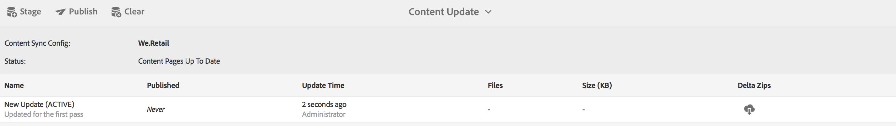

# Création et gestion du contenu de l’application{#creating-and-managing-app-content}

>[!NOTE]
>
>Adobe recommande d’utiliser l’éditeur d’application d’une seule page (SPA) pour les projets nécessitant un rendu côté client basé sur la structure SPA (par exemple, React). [En savoir plus](/help/sites-developing/spa-overview.md).

La gestion du contenu de l’application requiert un effort collectif des [développeurs](#developer), des [auteurs](#author) et [administrateurs](#administrator). Les auteurs manipulent les pages, qui sont à leur tour basées sur les modèles et les composants générés par les développeurs d’applications.

Enfin, les administrateurs publient stratégiquement le contenu de l’application mis à jour.

>[!NOTE]
>
>**Condition requise**:
>
>Dans [Déploiement et gestion](/help/sites-deploying/deploy.md), les développeurs se sont familiarisés avec AEM système de composants et de modèles.

## Mosaïque Gérer le contenu de la page {#the-manage-page-content-tile}

>[!CAUTION]
>
>Si vous n’utilisez pas de modèle d’application prêt à l’emploi, pour permettre la publication d’un nouveau contenu d’application OTA, vous devez configurer un gestionnaire de synchronisation de contenu.
>
>Voir [Mobile with Content Sync](/help/mobile/phonegap-contentsync.md) dans la section Développeur pour plus d’informations.

Ici, le contenu peut être créé, modifié et supprimé en AEM Mobile de la même manière que vous le feriez en AEM Sites.

La mosaïque **Gérer le contenu de la page** affiche le nombre de pages du contenu géré et la dernière modification pour une charge utile particulière. Vous pouvez voir le détail du contenu pour créer, copier, déplacer, supprimer et mettre à jour des pages en cliquant sur chaque enregistrement de la mosaïque.

Une fois le contenu mis à jour, les administrateurs peuvent publier une charge utile de mise à jour de contenu en direct (OTA) pour les clients via la mosaïque **Gérer les packages de contenu.**

Sélectionnez l’un des packages de contenu de la liste pour créer ou modifier du contenu tel que la création, la modification ou la suppression de pages, la modification de la navigation et de l’ordre des pages, la création ou la mise à jour de contenu tel que la copie (texte) et le support.

Notez *que tout est du contenu*, ce qui signifie que les styles d’application, la copie (texte), les médias, les pages, la navigation et, le ciblage du contenu peut tous être modifié et mis à jour OTA, sans aller dans une boutique d’applications.

Afin de modifier le contenu AEM Mobile, *les auteurs AEM *auront besoin d&#39;une bonne compréhension de l&#39;interface de modification de contenu AEM : [Création de pages dans AEM.](/help/sites-authoring/qg-page-authoring.md)

## Mosaïque Gérer les packages de contenu {#the-manage-content-packages-tile}

Ici, *AEM les administrateurs* peuvent rapidement et facilement mettre à jour leurs applications pour fournir des expériences attrayantes et du contenu à jour afin de stimuler l’engagement de la marque et d’atteindre les objectifs commerciaux sans avoir à soumettre à nouveau un développeur ou une boutique d’applications.

Une fois que *les auteurs AEM* ont ajouté ou modifié du contenu par le biais de la mosaïque de gestion du contenu, *AEM les administrateurs* sont en mesure d’envoyer ces modifications aux clients avec une mise à jour des packs de contenu.

L’action Package de contenu permet à l’*Auteur AEM* de créer et de modifier le contenu de la page pendant que l’équipe de développement apporte des modifications à la conception et à l’implémentation d’une application hôte, y compris la navigation, le style, la logique côté serveur, les modèles et les composants, puis envoie ces modifications OTA aux clients sans avoir à soumettre à nouveau aux divers magasins pour distribution.

**Pour publier du contenu nouveau ou mis à jour**

Sélectionnez un package de contenu dans la mosaïque, dans cet exemple le package anglais. Notez qu’une boîte de dialogue de mise à jour de contenu liste la configuration *Content Sync* appropriée. Si le contenu de l’application a été modifié depuis une mise à jour précédente, l’état s’affiche *En attente*, comme illustré ci-dessous.

Ensuite, sélectionnez l’action **Stage** en haut à droite de la création de la nouvelle mise à jour de contenu. Ajoutez les informations de mise à jour appropriées et appuyez sur Terminé.

Le gestionnaire *Content Sync* crée ensuite les packages requis en formant un delta (un package de *uniquement* ce qui a changé). Une fois terminé, ce package de contenu de mise à jour a été mis en scène comme illustré ci-dessous.

L’évaluation d’une mise à jour du contenu permet d’effectuer plusieurs mises à jour avant de les publier dans OTA sur des périphériques mobiles.

>[!NOTE]
>
>Le contenu intermédiaire peut être vérifié à l’aide de l’application AEM Vérifier avant publication.
>
>Voir [Démarrage rapide mobile pour la vérification des AEM](/help/mobile/phonegap-mobile-quickstart.md) pour plus d’informations sur l’application AEM Verify.

Lorsque vous êtes prêt à diffuser du nouveau contenu à vos utilisateurs de l’application avec Content Sync OTA, sélectionnez **Publier** comme illustré ci-dessous.

### Étapes suivantes {#the-next-steps}

Une fois que vous avez pris connaissance de la création et de la gestion du contenu de l’application dans le tableau de bord d’applications, consultez les ressources suivantes pour les autres rôles de création :

* [Mosaïque Gestion de l’application](/help/mobile/phonegap-app-details-tile.md)
* [Modification de métadonnées d’application](/help/mobile/phonegap-editmetadata.md)
* [Définitions d’application](/help/mobile/phonegap-app-definitions.md)
* [Création d’une application à l’aide de l’assistant de création d’application](/help/mobile/phonegap-create-new-app.md)
* [Importation d’une application hybride existante](/help/mobile/phonegap-adding-content-to-imported-app.md)

### Ressources supplémentaires {#additional-resources}

Pour en savoir plus sur les rôles et les responsabilités d’un administrateur et d’un développeur, consultez les ressources ci-dessous :

* [Développer pour Adobe PhoneGap Enterprise avec AEM](/help/mobile/developing-in-phonegap.md)
* [Administration de contenu pour Adobe PhoneGap Enterprise avec AEM](/help/mobile/administer-phonegap.md)
