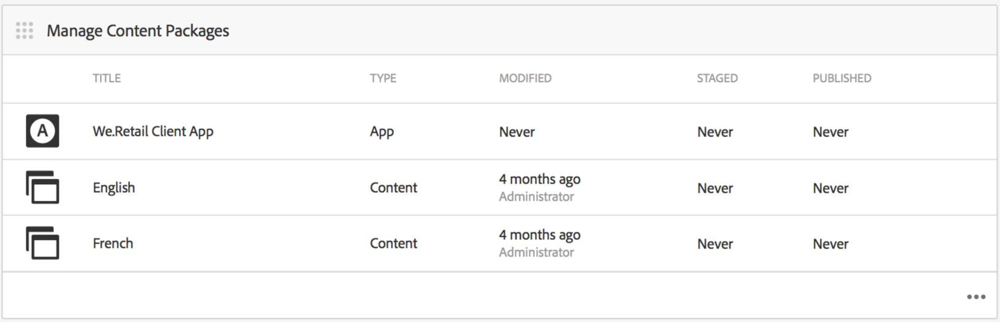

# Création et gestion de contenu d’application{#creating-and-managing-app-content}

>[!NOTE]
>
>Adobe recommande d’utiliser l’éditeur SPA pour les projets nécessitant un rendu côté client, basé sur un framework, pour une application à une seule page (comme React). [En savoir plus](/help/sites-developing/spa-overview.md).

La gestion du contenu des applications requiert un effort collectif de la part de [développeurs](#developer), contenu [authors](#author), et [administrateurs](#administrator). Les auteurs manipulent les pages, qui sont basées sur des modèles et des composants générés par les développeurs d’applications.

Enfin, les administrateurs publient stratégiquement le contenu de l’application mis à jour.

>[!NOTE]
>
>**Condition requise**:
>
>Dans [Déploiement et maintenance](/help/sites-deploying/deploy.md), les développeurs se sont familiarisés avec les composants système et les modèles dans Adobe Experience Manager (AEM).

## Mosaïque Gérer le contenu de la page {#the-manage-page-content-tile}

>[!CAUTION]
>
>Si vous n’utilisez pas de modèle d’application prêt à l’emploi, vous devez configurer un gestionnaire de synchronisation de contenu pour permettre la publication du nouveau contenu de l’application.
>
>Voir [Mobile avec synchronisation de contenu](/help/mobile/phonegap-contentsync.md) pour plus d’informations.

Ici, le contenu peut être créé, modifié et supprimé dans AEM Mobile de la même manière que dans AEM Sites.

La variable **Mosaïque Gestion du contenu de la page** affiche le nombre de pages de contenu géré et la date de dernière modification pour une charge utile particulière. Vous pouvez analyser le contenu pour créer, copier, déplacer, supprimer et mettre à jour des pages en cliquant sur chaque enregistrement de la mosaïque.

Une fois que le contenu a été mis à jour, les administrateurs peuvent publier une payload de mise à jour de contenu en direct (OTA) pour les clients via le **Gestion de la mosaïque Modules de contenu .**

Sélectionnez l’un des packages de contenu répertoriés pour créer ou modifier du contenu, tel que la création, la modification ou la suppression de pages, la modification de la navigation et de l’ordre des pages, la création ou la mise à jour de contenu (texte) ou multimédia, par exemple.

Remarque *tout est contenu*, c’est-à-dire que les styles d’application, la copie (texte), le média, les pages, la navigation et le ciblage du contenu peuvent tous être modifiés et mis à jour OTA, sans avoir à se rendre dans une boutique d’applications.

Pour modifier le contenu AEM Mobile, *AEM auteurs *auront besoin d’une bonne compréhension de l’AEM interface d’édition de contenu : [Création de pages dans AEM.](/help/sites-authoring/qg-page-authoring.md)

## Mosaïque Gestion des packages de contenu {#the-manage-content-packages-tile}

Ici, *Administrateurs AEM* peut mettre à jour rapidement et facilement leurs applications pour offrir des expériences attrayantes et du contenu à jour afin de stimuler l’engagement de la marque et d’atteindre les objectifs de l’entreprise sans avoir à soumettre à nouveau un développeur ou une boutique d’applications.

Une fois *Auteurs d’AEM* avoir ajouté ou modifié du contenu par le biais de la mosaïque Gérer le contenu , *Administrateurs AEM* peuvent envoyer ces modifications aux clients disposant d’une mise à jour de modules de contenu.

L’action de module de contenu permet au *Auteur AEM* pour créer et modifier le contenu de la page pendant que l’équipe de développement apporte des modifications à la conception et à l’implémentation d’une application hôte, notamment la navigation, le style, la logique côté serveur, les modèles et les composants, puis envoie ces modifications à OTA aux clients sans avoir à envoyer à nouveau aux différents magasins pour distribution.

**Pour publier du contenu nouveau ou mis à jour**

Sélectionnez un module de contenu dans la mosaïque, dans cet exemple le module en anglais. Notez qu’une boîte de dialogue de mise à jour du contenu répertorie les *Synchronisation du contenu* configuration. Si le contenu de l’application a été modifié depuis une mise à jour précédente, l’état s’affiche. *En attente*, comme illustré ci-dessous.

Sélectionnez ensuite le **Évaluation** en haut à droite de la création de la mise à jour du contenu. Ajoutez les informations de mise à jour appropriées et appuyez sur Terminé.

La variable *Synchronisation du contenu* Le gestionnaire crée ensuite les modules requis en formant un delta (un module de *only* ce qui a changé). Une fois terminé, ce module de contenu de mise à jour a été mis en scène comme illustré ci-dessous.

L’évaluation d’une mise à jour du contenu permet d’effectuer plusieurs mises à jour avant de les publier sur OTA sur des périphériques mobiles.

>[!NOTE]
>
>Le contenu intermédiaire peut être vérifié à l’aide de l’application AEM Vérifier avant publication.
>
>Voir [Démarrage rapide mobile pour la vérification AEM](/help/mobile/phonegap-mobile-quickstart.md) pour plus d’informations sur AEM Vérifier l’application.

Lorsque vous êtes prêt à diffuser du nouveau contenu aux utilisateurs de votre application avec l’OTA de synchronisation de contenu, sélectionnez **Publier** comme illustré ci-dessous.

### Les étapes suivantes {#the-next-steps}

Une fois que vous avez appris à créer et gérer le contenu de l’application dans le tableau de bord de l’application, reportez-vous aux ressources suivantes pour obtenir d’autres rôles de création :

* [Mosaïque Gérer l’application](/help/mobile/phonegap-app-details-tile.md)
* [Modification des métadonnées d’application](/help/mobile/phonegap-editmetadata.md)
* [Définitions des applications](/help/mobile/phonegap-app-definitions.md)
* [Création d’une application à l’aide de l’assistant Créer une application](/help/mobile/phonegap-create-new-app.md)
* [Importation d’une application hybride existante](/help/mobile/phonegap-adding-content-to-imported-app.md)

### Ressources supplémentaires {#additional-resources}

Pour en savoir plus sur les rôles et les responsabilités d’un administrateur et d’un développeur, consultez les ressources ci-dessous :

* [Développement pour Adobe PhoneGap Enterprise avec AEM](/help/mobile/developing-in-phonegap.md)
* [Administration de contenu pour Adobe PhoneGap Enterprise avec AEM](/help/mobile/administer-phonegap.md)
