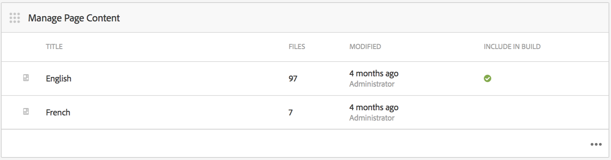

# Création et gestion de contenu d’application{#creating-and-managing-app-content}

>[!NOTE]
>
>Adobe recommande d’utiliser l’éditeur d’application d’une seule page (SPA) pour les projets nécessitant un rendu côté client basé sur la structure SPA (par exemple, React). [En savoir plus](/help/sites-developing/spa-overview.md).

La gestion du contenu d’une application requiert un effort collectif de la part des [développeurs](#developer), des [auteurs](#author) de contenu et des [administrateurs](#administrator). Les auteurs manipulent les pages, qui sont à leur tour basées sur les modèles et les composants générés par les développeurs d’applications.

Enfin, les administrateurs publient stratégiquement le contenu de l’application mis à jour.

>[!NOTE]
>
>**Condition requise**:
>
>Lors du [déploiement et de la maintenance](/help/sites-deploying/deploy.md), les développeurs se sont familiarisés avec le système de composants et de modèles d’AEM.

## The Manage Page Content Tile {#the-manage-page-content-tile}

>[!CAUTION]
>
>Si vous n’utilisez pas de modèle d’application prêt à l’emploi, vous devez configurer un gestionnaire de synchronisation de contenu pour que le nouveau contenu de l’application soit publié OTA.
>
>Voir [Mobile avec synchronisation](/help/mobile/phonegap-contentsync.md) de contenu dans la section Développeur pour plus d’informations.

Ici, le contenu peut être créé, modifié et supprimé dans AEM Mobile comme vous le feriez dans les sites AEM.

The **Manage Page Content tile** displays the number of pages of managed content and last modified for a particular payload. Vous pouvez voir le détail du contenu pour créer, copier, déplacer, supprimer et mettre à jour des pages en cliquant sur chaque enregistrement de la mosaïque.

Une fois le contenu mis à jour, les administrateurs peuvent publier une charge utile en direct (OTA) de mise à jour de contenu pour les clients via le volet **Gérer les packs de contenu.**

Sélectionnez l’un des packages de contenu répertorié pour créer ou modifier du contenu, tel que la création, la modification ou la suppression de pages, la modification de la navigation et de l’ordre des pages, la création ou la mise à jour de contenu, tel que le texte et le support.

Notez *que tout est contenu*, c’est-à-dire les styles d’application, la copie (texte), le média, les pages, la navigation et, le ciblage du contenu peut tous être modifié et mis à jour OTA, sans aller dans une boutique d’applications.

Pour modifier le contenu AEM Mobile, *les auteurs d&#39;AEM *auront besoin d&#39;une bonne compréhension de l&#39;interface de modification du contenu AEM : Création de pages [dans AEM.](/help/sites-authoring/qg-page-authoring.md)

## The Manage Content Packages Tile {#the-manage-content-packages-tile}

Ici, les administrateurs *d’* AEM peuvent rapidement et facilement mettre à jour leurs applications pour offrir des expériences attrayantes et du contenu à jour afin de stimuler l’engagement de la marque et d’atteindre les objectifs commerciaux sans avoir à soumettre à nouveau un développeur ou une boutique d’applications.

Once *AEM Authors* have added or modified content through the Manage Content Tile, *AEM Administrators* are able to push those changes out to customers with a Content Packages update.

L’action Package de contenu permet à l’auteur *d’* AEM de créer et de modifier le contenu de la page pendant que l’équipe de développement apporte des modifications à la conception et à l’implémentation d’une application hôte, y compris la navigation, le style, la logique côté serveur, les modèles et les composants, puis envoie ces modifications OTA aux clients sans avoir à les soumettre à nouveau aux divers magasins pour distribution.

**Pour publier du contenu nouveau ou mis à jour**

Sélectionnez un package de contenu dans la mosaïque, dans cet exemple le package anglais. Notez qu’une boîte de dialogue de mise à jour du contenu répertorie la configuration de synchronisation *du* contenu appropriée. Si le contenu de l’application a été modifié depuis une mise à jour précédente, l’état s’affiche *En attente*, comme illustré ci-dessous.

Ensuite, sélectionnez l’action **Stage** dans la partie supérieure droite pour créer la nouvelle mise à jour de contenu. Ajoutez les informations de mise à jour appropriées et appuyez sur Terminé.

Le gestionnaire *Content Sync* crée alors les packages requis en formant un delta (un package de *seulement* ce qui a changé). Une fois terminé, ce package de contenu de mise à jour a été mis en scène comme illustré ci-dessous.

L’évaluation d’une mise à jour du contenu permet d’effectuer plusieurs mises à jour avant de les publier dans OTA sur des périphériques mobiles.

>[!NOTE]
>
>Le contenu intermédiaire peut être vérifié à l’aide de l’application AEM Verify avant publication.
>
>Pour plus d&#39;informations sur l&#39;application AEM Verify [, reportez-vous à Démarrage rapide](/help/mobile/phonegap-mobile-quickstart.md) mobile pour AEM Verify.

Lorsque vous êtes prêt à diffuser du nouveau contenu aux utilisateurs de votre application avec Content Sync OTA, sélectionnez **Publier** comme illustré ci-dessous.

### Étapes suivantes {#the-next-steps}

Une fois que vous avez appris à créer et à gérer le contenu de l’application dans le tableau de bord de l’application, reportez-vous aux ressources suivantes pour d’autres rôles de création :

* [Mosaïque Gestion de l’application](/help/mobile/phonegap-app-details-tile.md)
* [Modification de métadonnées d’application](/help/mobile/phonegap-editmetadata.md)
* [Définitions d’application](/help/mobile/phonegap-app-definitions.md)
* [Création d’une application à l’aide de l’assistant de création d’application](/help/mobile/phonegap-create-new-app.md)
* [Importation d’une application hybride existante](/help/mobile/phonegap-adding-content-to-imported-app.md)

### Ressources supplémentaires {#additional-resources}

Pour en savoir plus sur les rôles et les responsabilités d’un administrateur et d’un développeur, consultez les ressources ci-dessous :

* [Développement pour Adobe PhoneGap Enterprise avec AEM](/help/mobile/developing-in-phonegap.md)
* [Administration de contenu pour Adobe PhoneGap Enterprise avec AEM](/help/mobile/administer-phonegap.md)
