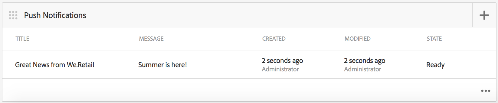

# Notifications Push{#push-notifications}

>[!NOTE]
>
>Adobe recommande d’utiliser l’éditeur d’application d’une seule page (SPA) pour les projets nécessitant un rendu côté client basé sur la structure SPA (par exemple, React). [En savoir plus](/help/sites-developing/spa-overview.md).

La possibilité d’alerter instantanément les utilisateurs de votre application AEM Mobile avec des notifications importantes est essentielle à la valeur d’une application mobile et de ses campagnes marketing. Ici, nous décrivons les étapes à suivre pour permettre à votre application de recevoir des notifications Push et comment configurer et envoyer des notifications Push d&#39;AEM Mobile à l&#39;application installée sur votre téléphone. En outre, cette section décrit comment configurer la fonction de liaison  profonde à vos notifications Push.

>[!NOTE]
>
>*Les notifications Push ne sont pas garanties de diffusion ; ce sont plutôt des annonces. Le meilleur effort est fait pour s&#39;assurer que tout le monde les reçoit, mais ce n&#39;est pas un mécanisme de diffusion garanti. En outre, le temps nécessaire pour diffuser une notification Push peut varier de moins d’une seconde à une demi-heure.*

L’utilisation de notifications Push avec AEM nécessite quelques technologies différentes. Tout d&#39;abord, un prestataire de notification Push doit être utilisé pour gérer les identifications et les périphériques (AEM ne le fait pas encore). Deux fournisseurs sont configurés prêts à l’emploi avec AEM : [Service](https://aws.amazon.com/sns/) de notification simple Amazon (SNS) et [Pushwoosh](https://www.pushwoosh.com/). Deuxièmement, la technologie Push pour le système d&#39;exploitation mobile donné doit passer par le service approprié — Service de notification Push (ou APNS) d&#39;Apple pour les périphériques iOS ; et Google Cloud Messaging (ou GCM) pour appareils Android. Bien que AEM ne communique pas directement avec ces services spécifiques à la plate-forme, des informations de configuration connexes doivent être fournies par AEM avec les notifications pour que ces services exécutent la commande push.

Une fois installé et configuré (comme expliqué ci-dessous), il fonctionne comme suit :

1. Une notification Push est créée dans AEM et envoyée au prestataire (Amazon SNS ou Pushwoosh).
1. Le prestataire le reçoit et l’envoie au fournisseur principal (APNS ou GCM).
1. Le fournisseur principal envoie la notification à tous les périphériques enregistrés pour cette notification Push. Pour chaque périphérique, il utilise le réseau de données cellulaires ou le Wi-Fi, selon ce qui est actuellement disponible sur le périphérique.
1. La notification s’affiche sur l’appareil si l’application pour laquelle il est enregistré n’est pas en cours d’exécution. Un utilisateur qui appuie sur la notification début l’application et affiche la notification dans l’application. Si l’application est déjà en cours d’exécution, seule la notification intégrée s’affiche.

Cette version d’AEM prend en charge les périphériques mobiles iOS et Android.

## Présentation et procédure {#overview-and-procedure}

Pour utiliser les notifications Push dans une application AEM Mobile, les étapes de haut niveau suivantes doivent être effectuées.

En règle générale, un développeur AEM :

1. S’inscrire aux services de messagerie Apple et Google
1. S’inscrire à un service de messagerie Push et le configurer
1. Prise en charge des notifications Push Ajoutées dans l’application
1. Préparation d’un téléphone pour le test

Un administrateur AEM :

1. Configuration des notifications Push sur les applications AEM
1. Création et déploiement de l’application
1. Envoyer une notification Push
1. Configuration de liens profonds *(facultatif)*

### Étape 1 : S’inscrire aux services de messagerie Apple et Google {#step-register-with-apple-and-google-messaging-services}

#### Utilisation du service de notifications Push Apple (APNS) {#using-the-apple-push-notification-service-apns}

Accédez à la page Apple [ici](https://developer.apple.com/library/ios/documentation/NetworkingInternet/Conceptual/RemoteNotificationsPG/Chapters/ApplePushService.html) pour vous familiariser avec le service de notifications Push Apple.

Pour utiliser APNS, vous aurez besoin d’un fichier de **certificat** (un fichier .cer), d’une clé **** privée Push (un fichier .p12) et d’un mot de passe **de clé** privée d’Apple. Vous trouverez [ici](https://developer.apple.com/library/ios/documentation/NetworkingInternet/Conceptual/RemoteNotificationsPG/Chapters/ProvisioningDevelopment.html)des instructions sur la façon de le faire.

#### Utilisation du service Google Cloud Messaging (GCM) {#using-the-google-cloud-messaging-gcm-service}

>[!NOTE]
>
>Google remplace GCM par un service similaire appelé Firebase Cloud Messaging (FCM). Pour plus d&#39;informations sur FCM, cliquez [ici](https://developers.google.com/cloud-messaging/faq).

Accédez à la page Google [ici](https://developer.android.com/google/gcm/index.html) pour vous familiariser avec Google Cloud Messaging for Android.

Vous devez suivre les étapes [ici](https://developer.android.com/google/gcm/gs.html) pour **créer un projet** d’API Google, **activer le service** GCM et **obtenir une clé d’API.** Vous aurez besoin de la clé **** API pour envoyer des notifications Push aux périphériques Android. Enregistrez également votre numéro **de** projet, parfois appelé ID **d’expéditeur** GCM.

Les étapes suivantes montrent une autre méthode de création des clés d’API GCM :

1. Connectez-vous à Google et accédez à la page [Développeur de](https://developers.google.com/mobile/add?platform=android&amp;cntapi=gcm)Google.
1. Choisissez votre application dans la liste (ou créez-en une).
1. Sous Android Package Name, saisissez l’ID de votre application, c’est-à-dire `com.adobe.cq.mobile.weretail.outdoorsapp`. (Si cela ne fonctionne pas, réessayez avec &quot;test.test&quot;.)
1. Cliquez sur **Continuer pour sélectionner et configurer des services.**
1. Sélectionnez Cloud Messaging, puis cliquez sur **Activer Google Cloud Messaging**.
1. La nouvelle clé d&#39;API de serveur et l&#39;ID d&#39;expéditeur (nouveau ou existant) s&#39;affichent alors.

>[!NOTE]
>
>Enregistrez la clé d&#39;API du serveur. Cette valeur est saisie sur le site de votre fournisseur de notifications Push.

### Étape 2 : Enregistrement et configuration d’un service de messagerie Push {#step-register-and-configure-a-push-messaging-service}

aem est configuré pour utiliser l’un des trois services pour les notifications Push :

* SNS Amazon
* Pushwoosh
* Adobe Mobile Services

*Les configurations Amazon SNS* et *Pushwoosh* vous permettront d&#39;envoyer des messages push depuis AEM écrans.

*La configuration de Adobe Mobile Services* vous permet de configurer et d’envoyer des notifications Push à partir d’Adobe Mobile Services à l’aide d’un compte Adobe Analytics (mais l’application doit être créée avec cette configuration pour activer les notifications Push AMS).

#### Utilisation du service de messagerie SNS Amazon {#using-the-amazon-sns-messaging-service}

>[!NOTE]
>
>*Vous trouverez des informations sur Amazon SNS et un lien pour créer un nouveau compte AWS [ici](https://aws.amazon.com/sns/). Vous pouvez obtenir un compte gratuit pendant un an.*

Si vous ne souhaitez pas utiliser Amazon SNS, vous pouvez ignorer ces étapes.

Pour configurer Amazon SNS pour les notifications Push, procédez comme suit :

1. **S&#39;inscrire au SNS Amazon**

   1. Enregistrez votre ID de compte. Le format doit être composé de douze chiffres sans espaces ni tirets, c&#39;est-à-dire. &quot;123456789012&quot;.
   1. Assurez-vous que vous vous trouvez dans la région &quot;us-east&quot; (nous-est) ou &quot;eu&quot;, car une étape ultérieure (Création du pool d’identités) nécessite l’une de ces étapes.
   1. Après l’enregistrement, connectez-vous à la console de gestion et sélectionnez [SNS](https://console.aws.amazon.com/sns/) (Push Notification Service). Cliquez sur &quot;Commencer&quot; s&#39;il apparaît.

1. **Créer une clé et un ID d’accès**

   1. Cliquez sur votre nom de connexion dans l&#39;angle supérieur droit de l&#39;écran, puis choisissez Informations d&#39;identification de sécurité dans le menu.
   1. Cliquez sur Clés d&#39;accès et, dans l&#39;espace ci-dessous, cliquez sur **Créer une clé** d&#39;accès.
   1. Cliquez sur **Afficher la clé** d&#39;accès, puis copiez et enregistrez l&#39;ID de clé d&#39;accès et la clé d&#39;accès secrète affichés. Si vous choisissez l’option de téléchargement des clés, vous obtiendrez un fichier csv contenant les mêmes valeurs.
   1. D’autres certificats liés à la sécurité, et d’autres, peuvent être gérés sur cette page.

   >[!NOTE]
   >
   >Une clé d&#39;accès peut être utilisée pour plusieurs applications.

   Pour les organisations qui utilisent un compte &quot;AWS Sandbox&quot;, les étapes sont très similaires et sont décrites ci-dessous :

   1. Cliquez sur votre nom de connexion dans l&#39;angle supérieur droit de l&#39;écran, puis choisissez Mes informations d&#39;identification de sécurité dans le menu.
   1. Cliquez sur Utilisateurs dans la liste d’actions de gauche, puis choisissez votre nom d’utilisateur.
   1. Cliquez sur l’onglet Informations d’identification de sécurité.
   1. A partir de là, vous voyez vos clés et créez de nouvelles clés. Enregistrez les clés pour une utilisation ultérieure.

1. **Création d’une rubrique**

   1. Cliquez sur **Créer une rubrique** et choisissez un nom de rubrique. Enregistrez tous les champs, tels que l’ARN de la rubrique, le propriétaire de la rubrique, la région, le nom d’affichage.
   1. Cliquez sur **Autres actions** de rubrique > **Modifier la stratégie** de rubrique. Sous **Autoriser ces utilisateurs à s’abonner à cette rubrique**, sélectionnez **Tout le monde.**
   1. Cliquez sur **Mettre à jour la stratégie**.

   >[!NOTE]
   >
   >Vous pouvez créer plusieurs rubriques pour différents scénarios tels que le développement, le test, la démonstration, etc. Le reste de la configuration SNS peut rester le même. Créez l’application avec une rubrique différente ; Les notifications Push envoyées à cette rubrique ne seront reçues que par l’application créée avec cette rubrique.

1. **Création d’applications de plateformes**

   1. Cliquez sur Applications, puis sur Créer une application de plateforme. Choisissez un nom et sélectionnez une plate-forme (APNS pour iOS, GCM pour Android). En fonction de la plateforme, d’autres champs devront être renseignés :

      1. Pour APNS, un fichier P12, un mot de passe, un certificat et une clé privée doivent tous être entrés. Ces informations auraient dû être obtenues lors de l’étape *Utilisation du service de notifications Push Apple (APNS)* ci-dessus.
      1. Pour GCM, une clé d’API doit être saisie. Cela aurait dû être obtenu lors de l’étape *Utilisation du service* Google Cloud Messaging (GCM) ci-dessus.
   1. Répétez l’étape ci-dessus une fois pour chaque plateforme que vous prendrez en charge. Pour être en mesure d’effectuer des notifications Push sur iOS et Android, deux applications de plateforme doivent être créées.

1. **Création d’un pool d’identité**

   1. Utilisez [Cognito](https://console.aws.amazon.com/cognito) pour créer un pool d’identités, qui stockera les données de base des utilisateurs non authentifiés. Notez que seules les régions &quot;us-east&quot; (nous-est) et &quot;eu&quot; sont actuellement prises en charge par Amazon Cognito.
   1. Donnez-lui un nom et cochez la case &quot;Activer l’accès aux identités non authentifiées&quot;.
   1. Sur la page suivante (&quot;*Vos identités de cookie nécessitent l’accès à vos ressources*&quot;), cliquez sur Autoriser.
   1. Dans l&#39;angle supérieur droit de la page, cliquez sur le lien &quot;*Modifier le pool d&#39;identité&quot;*. L&#39;ID de pool d&#39;identités s&#39;affiche. Enregistrez ce texte pour plus tard.
   1. Sur la même page, choisissez la liste déroulante en regard de &quot;Rôle non authentifié&quot; et assurez-vous que le rôle Cognito_&lt;nom du pool>UnauthRole est sélectionné. Enregistrez vos modifications.

1. **Configurer l’accès**

   1. Connexion à [Identity and Access Management](https://console.aws.amazon.com/iam/home) (IAM)
   1. Sélectionner des rôles
   1. Cliquez sur le rôle créé à l’étape précédente, appelé Cognito_&lt;yourIdentityPoolName>Unauth_Role. Enregistrez le &quot;Role ARN&quot; affiché.
   1. Ouvrez &quot;Stratégies en ligne&quot; si elles ne sont pas déjà ouvertes. Vous devriez y voir une stratégie portant un nom tel que oneClick_Cognito_&lt;yourIdentityPoolName>Unauth_Role_1234567890123.
   1. Cliquez sur &quot;Modifier la stratégie&quot;. Remplacez le contenu du Document de stratégie par ce fragment de code JSON :

   <table>
    <tbody>
     <tr>
     <td>
 
 
{
 
 "Version" : "2012-10-17",
 
 "Instruction": [
 
 {
 
 "Action": [
 
 "mobileanalytics:PutEvents",
 
 "cognito-sync:*",
 
 "SNS:CreatePlatformEndpoint",
 
 "SNS:Subscribe"
 
 ],
 
 "Effet" : "Allow",
 
 "Resource": [
 
 "*"
 
 ]
 
 }
 
 ]
 
}
 
 
 </td>
     </tr>
    </tbody>
    </table>

   1. Cliquez sur **Appliquer la stratégie**

#### Utilisation du service de messagerie Pushwoosh {#using-the-pushwoosh-messaging-service}

Si vous ne souhaitez pas utiliser Pushwoosh, vous pouvez ignorer cette étape.

Pour utiliser Pushwoosh :

1. **S&#39;inscrire avec Pushwoosh**

   1. Accédez à pushwoosh.com et créez un nouveau compte.

1. **Création d’un Jeton d&#39;accès d’API**

   1. Sur le site Web Pushwoosh, accédez à l&#39;option de menu Accès à l&#39;API pour générer un Jeton d&#39;accès d&#39;API. Vous devrez enregistrer ceci en toute sécurité.

1. **Créer une application**

   1. Pour la prise en charge d’Android, vous devez fournir votre clé d’API GCM.
   1. Lors de la configuration de l&#39;application, sélectionnez Cordova comme cadre.
   1. Pour la prise en charge iOS, vous devez fournir le fichier de certificat (.cer), le certificat Push (.p12) et le mot de passe de clé privée ; ils auraient dû être obtenus sur le site APNS d’Apple. Pour Framework, sélectionnez Cordova.
   1. Pushwoosh génère un ID d&#39;application pour cette application, sous la forme &quot;XXXXX-XXXXX&quot;, où chaque X est une valeur hexadécimale (0 à F).

>[!NOTE]
>
>*Si une seconde application est configurée dans AEM avec le même ID d’application (et les autres valeurs associées) : JETON D&#39;ACCÈS d’API et ID GCM), toutes les notifications Push envoyées via la seconde application sur AEM iront à toute autre application avec cet ID d’application.*

### Étape 3 : Prise en charge des notifications Push Ajoutées dans l’application {#step-add-push-support-to-the-app}

#### Ajouter la configuration de ContentSync {#add-contentsync-configuration}

Créez deux noeuds de contenu (un dans app-config et un dans app-config-dev) appelés notificationsConfig :

* /content/`<your app>`/shell/jcr:content/page-app/app-config-dev/notificationsConfig
* /content/`<your app>`/shell/jcr:content/page-app/app-config/notificationsConfig

Avec ces propriétés (fichiers .content.xml) :
&lt;jcr:root xmlns:jcr=&quot; [https://www.jcp.org/jcr/1.0](https://www.jcp.org/jcr/1.0)&quot; xmlns:nt=&quot; [https://www.jcp.org/jcr/nt/1.0](https://www.jcp.org/jcr/nt/1.0)&quot;jcr:primaryType=&quot;nt:unstructured&quot;excludeProperties=&quot;[appAPIAccessToken]&quot;path=&quot;../../../...&quot;
targetRootDirectory=&quot;www&quot;type=&quot;notificationsconfig&quot;/>

>[!NOTE]
>
>Le gestionnaire de synchronisation de contenu recherche ces noeuds et, s’ils ne sont pas présents, il n’écrit pas le fichier page-notifications-config.json.

#### Ajouter les bibliothèques clientes {#add-client-libraries}

Les bibliothèques clientes de notification Push doivent être ajoutées à l’application en procédant comme suit :

En CRXDE Lite :

1. Accédez à */etc/designs/phonegap/&lt;nom de l’application>/clientlibsall.*
1. Doublon cliquez sur la section d’intégration dans le volet des propriétés.
1. Dans la boîte de dialogue qui s&#39;affiche, ajoutez une nouvelle bibliothèque cliente en cliquant sur le bouton +.
1. Dans le nouveau champ de texte, ajoutez &quot;cq.mobile.push&quot;, puis cliquez sur OK.
1. Ajoutez-en un de plus appelé cq.mobile.push.amazon, puis cliquez sur OK.
1. Enregistrez les modifications.

>[!NOTE]
>
>Si des notifications Push sont supprimées ou ne sont pas utilisées pour des raisons d’espace sur l’application et pour éviter les messages d’erreur de la console, supprimez ces clientlibs de votre application.

### Étape 4 : Préparation d’un téléphone pour le test {#step-prepare-a-phone-for-testing}

>[!NOTE]
>
>*Pour les notifications Push, vous devez effectuer un test sur un périphérique réel, car les émulateurs ne peuvent pas recevoir de notifications Push.*

#### IOS {#ios}

Pour iOS, vous devez utiliser un ordinateur Mac OS et rejoindre le Programme [de développement](https://developer.apple.com/programs/ios/)iOS. Certaines sociétés disposent de licences d&#39;entreprise qui peuvent être mises à la disposition de tous les développeurs.

Avec XCode 8.1, avant d&#39;utiliser les notifications Push, vous devez accéder à l&#39;onglet Fonctionnalités de votre projet et activer/désactiver l&#39;option Notifications Push.

#### Android {#android}

Pour installer l&#39;application sur un téléphone Android à l&#39;aide de l&#39;interface de ligne de commande (voir ci-dessous : **Etape 6 - Création et déploiement de l’application**), vous devez d’abord mettre le téléphone en &quot;mode développeur&quot;. Voir [Activation des options](https://developer.android.com/tools/device.html#developer-device-options) pour les développeurs sur périphérique pour en savoir plus.

### Étape 5 : Configuration des notifications Push sur les applications AEM {#step-configure-push-on-aem-apps}

Avant de créer et de déployer sur votre périphérique mobile configuré, vous devez configurer les paramètres de notification du service de messagerie que vous avez décidé d’utiliser.

1. Créez les groupes d’autorisations appropriés pour les notifications Push.
1. Connectez-vous à AEM en tant qu’utilisateur approprié, puis cliquez sur l’onglet Applications.
1. Cliquez sur l’application.
1. Recherchez la mosaïque Gérer les Cloud Services et cliquez sur le crayon pour modifier vos configurations de cloud.
1. Sélectionnez Amazon SNS Connection, Pushwoosh Connection ou Adobe Mobile Services comme configuration de notification.
1. Saisissez les propriétés du fournisseur et cliquez sur Envoyer pour les enregistrer, puis sur Terminé. À ce stade, ils ne sont pas vérifiés à distance, sauf dans le cas de l&#39;AMS.
1. Vous devriez maintenant voir la configuration que vous venez de saisir sur la mosaïque Gérer les Cloud Services.

### Étape 6 : Création et déploiement de l’application {#step-build-and-deploy-the-app}

**Remarque :** Reportez-vous également à nos instructions [ici](/help/mobile/building-app-mobile-phonegap.md) sur la création d&#39;applications PhoneGap.

Il existe deux façons de créer et de déployer votre application à l’aide de PhoneGap.

**Remarque :** Pour les tests de notification Push, les émulateurs ne suffiront pas, car les notifications Push utilisent un protocole distinct entre le fournisseur de notification Push (Apple ou Google) et le périphérique. Le matériel et les émulateurs Mac/PC actuels ne prennent pas en charge cette fonction.

1. *Le PhoneGap Build* est un service offert par PhoneGap qui va créer votre application pour vous sur leurs serveurs et vous permettre de la télécharger directement sur votre appareil. Reportez-vous à la documentation [du](https://build.phonegap.com/) PhoneGap Build pour savoir comment configurer et utiliser le PhoneGap Build.

1. *L&#39;interface* de ligne de commande PhoneGap (CLI) vous permet d&#39;utiliser un ensemble de commandes PhoneGap très complet sur votre ligne de commande pour créer, déboguer et déployer votre application. Reportez-vous à la documentation [destinée aux développeurs](https://docs.phonegap.com/en/edge/guide_cli_index.md.html#The%20Command-Line%20Interface) PhoneGap pour savoir comment configurer et utiliser PhoneGap CLI.

### Étape 7 : Envoyer une notification Push {#step-send-a-push-notification}

Pour créer une notification et l’envoyer, procédez comme suit.

1. Créer une notification

   * Dans le tableau de bord de votre application AEM Mobile, recherchez la mosaïque Notifications Push.
   * Dans le menu en haut à droite, choisissez &quot;Créer&quot;. Notez que ce bouton ne sera pas disponible tant que la configuration de cloud n’aura pas été définie pour la première fois.
   * Dans l&#39;Assistant Créer une notification, entrez un titre et un message, puis cliquez sur le bouton Créer. Votre notification est maintenant prête à être envoyée immédiatement ou ultérieurement. Il peut être modifié et le message et/ou le titre peuvent être modifiés et enregistrés.

1. Envoyer la notification

   * Dans le tableau de bord Applications, recherchez le volet Notifications Push.
   * Sélectionnez la notification ou cliquez sur le bouton de détails en bas à droite (. . .), pour afficher la liste des notifications. Cette liste indique également si une notification est prête à être envoyée, a déjà été envoyée ou si une erreur s’est produite lors de l’envoi.
   * Cochez la case correspondant à une notification (seulement) et cliquez sur le bouton &quot;Envoyer la notification&quot; au-dessus de la liste. Vous aurez la possibilité d&#39;annuler ou d&#39;envoyer la notification dans la boîte de dialogue qui s&#39;affiche.

1. Traitement des résultats

   * Si le service de notification Push (Amazon SNS ou Pushwoosh) reçoit la demande Envoyer, la confirme comme valide et l’envoie aux fournisseurs natifs (APNS et GCM), la boîte de dialogue Envoyer se ferme sans message. Dans la liste de notification, le statut de cette notification est indiqué comme Envoyé.
   * Si l&#39;envoi push échoue, la boîte de dialogue affiche un message indiquant le problème. Dans la liste de notification, l’état de cette notification est indiqué comme Erreur, mais si le problème est résolu, la notification peut être envoyée de nouveau. Dans le événement d’une erreur, des informations d’erreur supplémentaires doivent apparaître dans le journal des erreurs du serveur.
   * Notez qu’il existe certaines différences de plate-forme entre les notifications Push iOS et Android. Parmi eux :

      * Une fois l’application déployée sous Android, la création avec l’interface de ligne de commande début l’application. Sous iOS, vous devez le début manuellement. Comme l&#39;étape d&#39;enregistrement Push se produit au démarrage, les applications Android peuvent recevoir immédiatement des notifications Push (puisqu&#39;elles ont démarré et sont enregistrées), contrairement aux applications iOS.
      * Sous Android, le texte du bouton OK se trouve en majuscules (et dans tous les autres boutons ajoutés à la notification in-app), contrairement à iOS.

Pour les notifications Push AMS, les notifications doivent être composées et envoyées à partir du serveur AMS. AMS fournit des fonctionnalités de notification Push supplémentaires au-delà de celles fournies par les notifications AEM avec AWS et Pushwoosh.

>[!NOTE]
>
>*Les notifications Push ne sont pas garanties de diffusion ; ce sont plutôt des annonces. Le meilleur effort est fait pour s&#39;assurer que tout le monde l&#39;entend, mais ce n&#39;est pas un mécanisme de diffusion garanti. En outre, le temps nécessaire pour diffuser une notification Push peut varier de moins d’une seconde à une demi-heure.*

### Configuration de liens profonds avec des notifications Push {#configuring-deep-linking-with-push-notifications}

Qu&#39;est-ce que la liaison profonde ? Dans le contexte d’une notification Push, il s’agit d’un moyen d’autoriser l’ouverture ou la redirection (le cas échéant) d’une application à un emplacement spécifié dans l’application.

Comment ça marche ? L’auteur d’une notification Push ajoute éventuellement une étiquette de bouton (c.-à-d. &quot;Montre-moi !&quot;) à la notification et sélectionne la page qu’ils souhaitent lier dans la notification, via un navigateur de chemins d’accès visuel. Lorsqu’elle est envoyée, la notification Push se produit normalement, sauf que dans le message in-app, le bouton OK est remplacé par un bouton &quot;Ignorer&quot; et le nouveau bouton spécifié (&quot;Afficher moi !&quot;). apparaît également. En cliquant sur le nouveau bouton, l’application accède à la page indiquée dans l’application. Cliquez sur Ignorer pour ignorer le message.

Si l’application n’est pas ouverte, l’ombrage apparaîtra normalement. Une action sur la notification à l’ombre ouvrira l’application, puis présentera à l’utilisateur les boutons de lien profond en fonction de ce qui a été configuré dans la notification Push.

Créez la notification, ajoutez un texte de bouton et un chemin de lien pour le lien profond facultatif :

>[!CAUTION]
>
>.Pour accéder à la mosaïque Notification Push dans votre tableau de bord, suivez les étapes ci-dessous.

1. Cliquez sur la modification dans le coin supérieur droit de la mosaïque **Gérer les Cloud Services** .

   

1. Sélectionnez **Connexion** Pushwoosh. Cliquez sur **Suivant**.

   

1. Saisissez les détails des propriétés, puis cliquez sur **Envoyer**.

   

   Une fois votre configuration envoyée, la mosaïque Notifications **** Push s’affiche dans le tableau de bord.

   

### Assistant de création de notification {#create-notification-wizard}

Une fois que la mosaïque Notifications **** Push s’affiche dans votre tableau de bord, utilisez l’assistant de création de notifications pour ajouter le contenu :

1. Cliquez sur le symbole d’ajout dans le coin supérieur droit de la mosaïque Notifications **** Push pour ouvrir l’Assistant **** Créer une notification.

   

1. Cliquez sur l’icône Parcourir dans le chemin du lien pour présenter à l’utilisateur la structure de contenu de l’application.

   Une fois le chemin sélectionné, cliquez sur l’icône représentant une coche.

   

   >[!NOTE]
   >
   >Le texte du bouton de lien est limité à 20 caractères.
   >
   >Si l’utilisateur final ne dispose pas de la dernière version de l’application et que le chemin d’accès lié n’est pas disponible, la confirmation de l’action du lien profond amènera l’utilisateur sur la page principale de l’application.

1. Saisissez le **texte Détails** dans l’Assistant **** Créer une notification, puis cliquez sur **Créer**.

   

   Ouvrez les détails en cliquant sur la notification Push que vous avez créée à partir de la mosaïque Notifications **** Push.

   Vous pouvez modifier les propriétés, envoyer des notifications ou supprimer la notification.

   

>[!NOTE]
>
>**Informations supplémentaires**:
>
>Pushwoosh et Amazon SNS ne seront pas pris en charge après la version 6.4 et seront disponibles en tant que module complémentaire à partir du partage de package.

### Étapes suivantes {#the-next-steps}

Une fois que vous avez compris les détails des notifications Push pour votre application, reportez-vous à la page Personnalisation [du contenu](/help/mobile/phonegap-aem-mobile-content-personalization.md)AEM Mobile.

