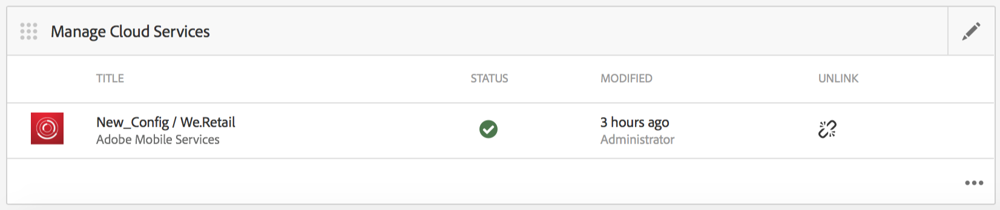

# Notifications Push{#push-notifications}

>[!NOTE]
>
>Adobe recommande d’utiliser l’éditeur SPA pour les projets nécessitant un rendu côté client, basé sur un framework, pour une application à une seule page (comme React). [En savoir plus](/help/sites-developing/spa-overview.md).

La possibilité d’alerter instantanément les utilisateurs de l’application mobile Adobe Experience Manager (AEM) avec des notifications importantes est essentielle à la valeur d’une application mobile et de ses campagnes marketing. Ici, des étapes doivent être suivies pour permettre à votre application de recevoir des notifications push. Vous apprenez également à configurer et à envoyer des notifications push d’AEM Mobile vers l’application installée sur le téléphone. Cette section décrit également comment configurer la variable [Lien profond](#deeplinking) de vos notifications push.

>[!NOTE]
>
>*La diffusion des notifications push n’est pas garantie ; il s’agit plus d’annonces. Un effort est fourni pour s&#39;assurer que chacun les reçoit, mais qu&#39;il ne s&#39;agit pas d&#39;un mécanisme de livraison garanti. En outre, la durée de diffusion d’une notification push peut varier de moins d’une seconde à une demi-heure.*

L’utilisation de notifications push avec AEM nécessite quelques technologies différentes. Tout d&#39;abord, un fournisseur de service de notification push doit être utilisé pour gérer les énumérations et les appareils (AEM ne le fait pas encore). Deux fournisseurs sont configurés d’usine avec AEM : [Amazon Simple Notification Service](https://aws.amazon.com/sns/) (ou SNS) et [Pushwoosh](https://www.pushwoosh.com/). Deuxièmement, la technologie push pour le système d’exploitation mobile donné doit passer par le service approprié : Apple Push Notification Service (ou APNS) pour les appareils iOS et Google Cloud Messaging (ou GCM) pour les appareils Android™. Bien qu’AEM ne communique pas directement avec ces services spécifiques à la plateforme, des informations de configuration associées doivent être fournies par AEM avec les notifications pour que ces services exécutent la notification push.

Une fois installé et configuré (comme expliqué ci-dessous), il fonctionne comme suit :

1. Une notification push est créée dans AEM et envoyée au prestataire (Amazon SNS ou Pushwoosh).
1. Le prestataire le reçoit et l&#39;envoie au prestataire principal (APNS ou GCM).
1. Le fournisseur principal envoie la notification à tous les appareils enregistrés pour cette notification push. Pour chaque appareil, il utilise le réseau de données cellulaires ou le Wi-Fi, selon ce qui est disponible sur l’appareil.
1. La notification s’affiche sur l’appareil si l’application pour laquelle il est enregistré n’est pas en cours d’exécution. Un utilisateur qui appuie sur la notification démarre l’application et affiche la notification dans l’application. Si l’application est déjà en cours d’exécution, seule la notification in-app s’affiche.

Cette version d’AEM prend en charge les appareils mobiles iOS et Android™.

## Présentation et procédure {#overview-and-procedure}

Pour utiliser les notifications push dans une application AEM Mobile, les étapes de haut niveau suivantes doivent être effectuées.

En règle générale, un développeur Experience Manager effectue les opérations suivantes :

1. Enregistrement auprès des services de messagerie Apple et Google
1. Enregistrez-vous avec un service de messagerie push et configurez-le.
1. Ajout de la prise en charge des notifications push à l’application
1. Préparation d’un téléphone pour le test

Lorsqu’un administrateur Experience Manager effectue les opérations suivantes :

1. Configuration des notifications push sur les applications AEM
1. Création et déploiement de l’application
1. Envoi d’une notification push
1. Configuration de liens profonds *(facultatif)*

### Étape 1 : Enregistrement auprès des services de messagerie Apple et Google {#step-register-with-apple-and-google-messaging-services}

#### Utilisation du service de notification push Apple (APNS) {#using-the-apple-push-notification-service-apns}

Accédez à la page Apple [here](https://developer.apple.com/documentation/usernotifications#//apple_ref/doc/uid/TP40008194-CH8-SW1) pour vous familiariser avec le service de notification push Apple.

Pour utiliser les APNS, vous devez disposer d’un **Certificat** fichier (fichier .cer), un fichier push **Clé privée** (un fichier .p12) et un **Mot de passe de la clé privée** d’Apple. Vous trouverez des instructions pour le faire [here](https://developer.apple.com/library/archive/documentation/NetworkingInternet/Conceptual/RemoteNotificationsPG/).

#### Utilisation du service Google Cloud Messaging (GCM) {#using-the-google-cloud-messaging-gcm-service}

>[!NOTE]
>
>Google remplace GCM par un service similaire appelé Firebase Cloud Messaging (FCM). Pour plus d’informations sur FCM, cliquez sur [here](https://firebase.google.com/docs/cloud-messaging/).

Accédez à la page Google [here](https://developer.android.com/google/gcm/index.html) pour vous familiariser avec Google Cloud Messaging pour Android™.

[Procédez comme suit :](https://developer.android.com/google/gcm/gs.html) to **Création d’un projet d’API Google**, **Activation du service GCM**, et **Obtention d’une clé API**. Vous avez besoin de **Clé API** pour envoyer des notifications push aux appareils Android™. Enregistrez également votre **Numéro de projet**, qui est également parfois appelé **Identifiant d’expéditeur GCM**.

Les étapes suivantes montrent une autre méthode de création de clés API GCM :

1. Connectez-vous à Google et accédez à la [Page du développeur de Google](https://developers.google.com/mobile/add?platform=android&amp;cntapi=gcm).
1. Sélectionnez votre application dans la liste (ou créez-en une).
1. Sous Android™ Nom de module, saisissez votre ID d’application, c’est-à-dire : `com.adobe.cq.mobile.weretail.outdoorsapp`. (Si cela ne fonctionne pas, réessayez avec &quot;test.test&quot;.)
1. Cliquez sur **Continuer à sélectionner et configurer les services**
1. Sélectionnez Cloud Messaging, puis cliquez sur **Activation de Google Cloud Messaging**.
1. La nouvelle clé API du serveur et l’ ID d’expéditeur (nouveau ou existant) s’affichent alors.

>[!NOTE]
>
>Enregistrez la clé API du serveur. Cette valeur est saisie sur le site de votre fournisseur de services push.

### Étape 2 : enregistrement et configuration d’un service de messagerie push {#step-register-and-configure-a-push-messaging-service}

AEM est configuré pour utiliser l’un des trois services pour les notifications push :

* SNS Amazon
* Pushwoosh
* Adobe Mobile Services

*AMAZON SNS* et *Pushwoosh* les configurations vous permettent d’envoyer des notifications push depuis AEM écrans.

*Adobe Mobile Services* La configuration vous permet de configurer et d’envoyer des notifications push depuis Adobe Mobile Services à l’aide d’un compte Adobe Analytics (mais l’application doit être créée avec ce jeu de configuration pour activer les notifications push AMS).

#### Utilisation du service de messagerie SNS Amazon {#using-the-amazon-sns-messaging-service}

>[!NOTE]
>
>*Vous trouverez des informations sur Amazon SNS et un lien pour créer un compte AWS. [here](https://aws.amazon.com/sns/). Vous pouvez avoir un compte gratuit pendant un an.*

Si vous ne souhaitez pas utiliser Amazon SNS, vous pouvez ignorer ces étapes.

Pour configurer Amazon SNS pour les notifications push, procédez comme suit :

1. **Enregistrement auprès du SNS Amazon**

   1. Enregistrez votre ID de compte. Le format doit être 12 chiffres sans espaces ni tirets, c’est-à-dire &quot;123456789012&quot;.
   1. Assurez-vous que vous vous trouvez dans la région &quot;us-est&quot; ou &quot;eu&quot;, car une étape ultérieure (Création de pool d’identités) nécessite l’une d’elles.
   1. Une fois enregistré, connectez-vous à la console de gestion et sélectionnez [SNS](https://console.aws.amazon.com/sns/) (Service de notification push). Cliquez sur &quot;Commencer&quot; s’il apparaît.

1. **Création d’une clé d’accès et d’un identifiant**

   1. Cliquez sur votre nom de connexion en haut à droite de l’écran, puis sélectionnez Informations d’identification de sécurité dans le menu.
   1. Cliquez sur Accéder aux clés puis, dans l’espace ci-dessous, cliquez sur **Créer une clé d’accès**.
   1. Cliquez sur **Afficher la clé d’accès**, puis copiez et enregistrez l’ID de clé d’accès et la clé d’accès secrète affichés. Si vous choisissez l’option de téléchargement des clés, vous obtenez un fichier csv contenant les mêmes valeurs.
   1. D’autres certificats liés à la sécurité, et d’autres, peuvent être gérés sur cette page.

   >[!NOTE]
   >
   >Une clé d’accès peut être utilisée pour plusieurs applications.

   Pour les organisations qui utilisent un compte &quot;AWS Sandbox&quot;, les étapes sont similaires et décrites ici :

   1. Cliquez sur votre nom de connexion en haut à droite de l’écran, puis sélectionnez Mes informations d’identification de sécurité dans le menu.
   1. Cliquez sur Utilisateurs dans la liste d’actions à gauche, puis sélectionnez votre nom d’utilisateur.
   1. Cliquez sur l’onglet Informations d’identification de sécurité .
   1. A partir de là, vous voyez vos clés et créez de nouvelles clés. Enregistrez les clés pour une utilisation ultérieure.

1. **Création d’une rubrique**

   1. Cliquez sur **Création d’une rubrique** et choisissez un nom de rubrique. Enregistrez tous les champs tels que Topic ARN, Topic Owner, Region, Display name.
   1. Cliquez sur **Autres actions de rubrique** > **Modifier la stratégie de rubrique**. Sous **Autoriser ces utilisateurs à s’abonner à cette rubrique**, sélectionnez **Tout le monde.**
   1. Cliquez sur **Mettre à jour la stratégie**.

   >[!NOTE]
   >
   >Vous pouvez créer plusieurs rubriques pour différents scénarios tels que le développement, le test et la démonstration. Le reste de la configuration SNS peut rester le même. Créez l’application avec les différentes rubriques ; les notifications push envoyées à cette rubrique ne seront reçues que par l’application créée avec cette rubrique.

1. **Création d’applications Platform**

   1. Cliquez sur Applications, puis sur Créer une application de plateforme. Choisissez un nom et sélectionnez une plateforme (APNS pour iOS, GCM pour Android™). Selon la plateforme. les autres champs doivent être renseignés :

      1. Pour APNS, un fichier P12, un mot de passe, un certificat et une clé privée doivent tous être renseignés. Elles doivent avoir été obtenues à l’étape *Utilisation du service de notification push Apple (APNS)* ci-dessus.
      1. Pour GCM, une clé API doit être saisie. Cela aurait dû être obtenu à l’étape *Utilisation du service Google Cloud Messaging (GCM)* ci-dessus.

   1. Répétez l’étape ci-dessus une fois pour chaque plateforme que vous prenez en charge. Pour pouvoir envoyer des notifications push vers iOS et Android™, deux applications Platform doivent être créées.

1. **Créer un pool d’identités**

   1. Utilisation [Cognito](https://console.aws.amazon.com/cognito) pour créer un pool d’identités qui stockera les données de base des utilisateurs non authentifiés. Remarque : Actuellement, seules les régions &quot;us-east&quot; (nous-est) et &quot;eu&quot; sont prises en charge par Amazon Cognito.
   1. Attribuez-lui un nom et cochez la case &quot;Autoriser l’accès aux identités non authentifiées&quot;.
   1. Sur la page suivante (&quot;*Vos identités de Cognito nécessitent un accès à vos ressources*&quot;) cliquez sur Autoriser.
   1. Dans le coin supérieur droit de la page, cliquez sur le lien &quot;*Modifier le pool d’identités&quot;*. L’identifiant du pool d’identités s’affiche. Enregistrez ce texte pour plus tard.
   1. Sur la même page, sélectionnez la liste déroulante en regard de &quot;Rôle non authentifié&quot; et assurez-vous qu’elle dispose du rôle Cognito_&lt;pool name=&quot;&quot;>UnauthRole sélectionné. Enregistrez vos modifications.

1. **Configurer l’accès**

   1. Connexion à [Gestion des identités et des accès](https://console.aws.amazon.com/iam/home) (IAM).
   1. Sélectionnez Rôles.
   1. Cliquez sur le rôle créé à l’étape précédente, appelé Cognito_&lt;youridentitypoolname>Unauth_Role. Enregistrez le &quot;Role ARN&quot; affiché.
   1. Ouvrez &quot;Stratégies intégrées&quot; si elles ne sont pas déjà ouvertes. Vous devriez y voir une stratégie avec un nom comme oneClick_Cognito_&lt;youridentitypoolname>Unauth_Role_1234567890123.
   1. Cliquez sur &quot;Modifier la stratégie&quot;. Remplacez le contenu du document de stratégie par ce fragment de code JSON :

   <table>
    <tbody>
     <tr>
     <td>
 
 
{
 
 "Version": "2012-10-17",
 
 "Statement": [
 
 {
 
 "Action": [
 
 "mobileanalytics:PutEvents",
 
 "cognito-sync:*",
 
 "SNS:CreatePlatformEndpoint",
 
 "SNS:Subscribe"
 
 ],
 
 "Effet" : "Autoriser",
 
 "Resource": [
 
 "*"
 
 ]
 
 }
 
 ]
 
}
 
 
 </td>
     </tr>
    </tbody>
    </table>

   1. Cliquez sur **Appliquer la stratégie**.

#### Utilisation du service de messagerie Pushwoosh {#using-the-pushwoosh-messaging-service}

Si vous ne souhaitez pas utiliser Pushwoosh, vous pouvez ignorer cette étape.

Pour utiliser Pushwoosh :

1. **Inscrivez-vous auprès de Pushwoosh**

   1. Accédez à pushwoosh.com et créez un compte.

1. **Création d’un jeton d’accès API**

   1. Sur le site Pushwoosh, accédez à l’option de menu Accès à l’API pour générer un jeton d’accès à l’API. Enregistrez ce jeton en toute sécurité.

1. **Création d’une application**

   1. Pour la prise en charge d’Android™, vous devez fournir votre clé d’API GCM.
   1. Lors de la configuration de l’application, sélectionnez Cordova comme structure.
   1. Pour la prise en charge d’iOS, vous devez fournir le fichier de certificat (.cer), le certificat push (.p12) et le mot de passe de la clé privée. Ils doivent avoir été obtenus à partir du site APNS Apple. Pour Framework, sélectionnez Cordova.
   1. Pushwoosh génère un ID d’application pour cette application, sous la forme &quot;XXXXX-XXXXX&quot;, où chaque X est une valeur hexadécimale (de 0 à F).

>[!NOTE]
>
>*Si une seconde application est configurée en AEM avec le même ID d’application (et d’autres valeurs associées : jeton d’accès à l’API et ID GCM), toutes les notifications push envoyées via la seconde application sur AEM iront à toute autre application avec cet ID d’application.*

### Étape 3 : Ajout de la prise en charge des notifications push à l’application {#step-add-push-support-to-the-app}

#### Ajouter la configuration ContentSync {#add-contentsync-configuration}

Créez deux noeuds de contenu (un dans app-config et un dans app-config-dev) appelés notificationsConfig :

* /content/`<your app>`/shell/jcr:content/page-app/app-config-dev/notificationsConfig
* /content/`<your app>`/shell/jcr:content/page-app/app-config/notificationsConfig

Avec ces propriétés (fichiers .content.xml ) :
&lt;jcr:root xmlns:jcr=&quot; &lt;span id=&quot; translate=&quot;no&quot; />https://developer.adobe.com/experience-manager/reference-materials/spec/jcr/1.0/index.html](https://developer.adobe.com/experience-manager/reference-materials/spec/jcr/1.0/index.html)&quot; xmlns:nt=&quot; [https://developer.adobe.com/experience-manager/reference-materials/spec/jcr/1.0/index.html](https://developer.adobe.com/experience-manager/reference-materials/spec/jcr/1.0/index.html)&quot; jcr:primaryType=&quot;nt:unstructured&quot; excludeProperties=&quot;[appAPIActainToken]&quot; path=&quot;../../../...&quot;
[
targetRootDirectory=&quot;www&quot; type=&quot;notificationsconfig&quot;/>

>[!NOTE]
>
>Le gestionnaire de synchronisation de contenu recherche ces noeuds et, s’ils ne sont pas présents, il n’écrit pas le fichier page-notifications-config.json .

#### Ajout de bibliothèques clientes {#add-client-libraries}

Les bibliothèques clientes de notification push doivent être ajoutées à l’application en procédant comme suit :

En CRXDE Lite :

1. Accédez à */etc/designs/phonegap/&lt;app name=&quot;&quot;>/clientlibsall.*
1. Double-cliquez sur la section incorporer dans le volet des propriétés.
1. Dans la boîte de dialogue qui s’affiche, ajoutez une bibliothèque cliente en cliquant sur le bouton + .
1. Dans le nouveau champ de texte, ajoutez &quot;cq.mobile.push&quot;, puis cliquez sur OK.
1. Ajoutez-en un autre appelé cq.mobile.push.amazon, puis cliquez sur OK.
1. Enregistrez les modifications.

>[!NOTE]
>
>Si les notifications push sont supprimées ou ne sont pas utilisées, pour des raisons d’espace sur l’application et pour éviter les messages d’erreur de la console, supprimez ces clientlibs de votre application.

### Étape 4 : Préparation d’un téléphone pour les tests {#step-prepare-a-phone-for-testing}

>[!NOTE]
>
>*Pour les notifications push, vous devez tester un appareil réel, car les émulateurs ne peuvent pas recevoir de notifications push.*

#### IOS {#ios}

Pour iOS, utilisez un ordinateur macOS et rejoignez le [Programme de développement iOS](https://developer.apple.com/programs/ios/). Certaines sociétés disposent de licences d’entreprise qui peuvent être disponibles pour tous les développeurs.

Avec XCode 8.1, avant d’utiliser les notifications push, vous devez accéder à l’onglet Fonctionnalités de votre projet et activer la case à cocher Notifications push .

#### Android™ {#android}

Pour installer l’application sur un téléphone Android™ à l’aide de l’interface de ligne de commande (voir ci-dessous : **Étape 6 - Création et déploiement de l’application**), vous devez d’abord mettre le téléphone en &quot;mode développeur&quot;. Voir [Activation des options du développeur sur appareil](https://developer.android.com/tools/device.html#developer-device-options) pour plus d’informations.

### Étape 5 : configuration des notifications push sur les applications AEM {#step-configure-push-on-aem-apps}

Avant de créer et de déployer sur votre appareil mobile configuré, vous devez configurer les paramètres de notification pour le service de messagerie que vous avez décidé d’utiliser.

1. Créez les groupes d’autorisations appropriés pour les notifications push.
1. Connectez-vous à AEM en tant qu’utilisateur approprié, cliquez sur l’onglet Applications .
1. Cliquez sur l’application.
1. Recherchez la mosaïque Gérer les Cloud Service et cliquez sur le crayon pour modifier vos configurations cloud.
1. Sélectionnez Amazon SNS Connection, Pushwoosh Connection ou Adobe Mobile Services comme configuration de notification.
1. Saisissez les propriétés du fournisseur et cliquez sur Envoyer pour les enregistrer, puis sur Terminé. Elles ne sont pas vérifiées à distance à ce stade, sauf s’il existe AMS.
1. Vous devriez maintenant voir la configuration que vous venez de saisir dans la mosaïque Gérer les Cloud Service .

### Étape 6 : création et déploiement de l’application {#step-build-and-deploy-the-app}

**Remarque :** Voir les instructions [here](/help/mobile/building-app-mobile-phonegap.md) lors de la création des applications PhoneGap.

Il existe deux manières de créer et déployer votre application à l’aide de PhoneGap.

**Remarque :** Pour les tests de notification push, les émulateurs ne suffiront pas, car les notifications push utilisent un protocole distinct entre le fournisseur push (Apple ou Google) et l’appareil. Les émulateurs et le matériel Mac/PC actuels ne prennent pas en charge cette fonctionnalité.

1. *PhoneGap Build* est un service proposé par PhoneGap qui crée votre application pour vous sur leurs serveurs et vous permet de la télécharger directement sur votre appareil. Voir la documentation PhoneGap Build à l’adresse `https://build.phonegap.com/` pour apprendre à configurer et à utiliser le PhoneGap Build.

1. *Interface de ligne de commande PhoneGap* (interface de ligne de commande) vous permet d’utiliser un vaste ensemble de commandes PhoneGap sur votre ligne de commande pour créer, déboguer et déployer votre application. Reportez-vous à la documentation destinée aux développeurs PhoneGap (`https://docs.phonegap.com/en/edge/guide_cli_index.md.html#The%20Command-Line%20Interface`) pour savoir comment configurer et utiliser l’interface de ligne de commande de PhoneGap.

### Étape 7 : envoi d’une notification push {#step-send-a-push-notification}

Pour créer une notification et l&#39;envoyer, procédez comme suit.

1. Créer une notification

   * Dans le tableau de bord de votre application AEM Mobile, recherchez la vignette Notifications push .
   * Dans le menu en haut à droite, sélectionnez &quot;Créer&quot;. Ce bouton n’est pas disponible tant que la configuration cloud n’a pas été définie pour la première fois.
   * Dans l’assistant Créer une notification, saisissez un titre et un message, puis cliquez sur le bouton &quot;Créer&quot;. Votre notification est maintenant prête à être envoyée immédiatement ou ultérieurement. Il peut être modifié et le message et/ou le titre peuvent être modifiés et enregistrés.

1. Envoyer la notification

   * Dans le tableau de bord Applications, recherchez la vignette Notifications push .
   * Sélectionnez la notification ou cliquez sur le bouton de détails en bas à droite (. . .), pour afficher la liste des notifications. Cette liste indique également si une notification est prête à être envoyée, a déjà été envoyée ou si une erreur s’est produite lors de l’envoi.
   * Cochez la case correspondant à une notification (uniquement) et cliquez sur le bouton &quot;Envoyer la notification&quot; au-dessus de la liste. Vous avez la possibilité d’annuler ou d’envoyer la notification dans la boîte de dialogue qui s’affiche.

1. Traitement des résultats

   * Si le service de notification push (Amazon SNS ou Pushwoosh) reçoit la demande d’envoi, la confirme comme valide et l’envoie correctement aux fournisseurs natifs (APNS et GCM), la boîte de dialogue Envoyer se ferme sans message. Dans la liste des notifications, le statut de cette notification est Envoyé.
   * Si l’envoi push échoue, la boîte de dialogue affiche un message indiquant le problème. Dans la liste des notifications, l&#39;état de cette notification est signalé comme Erreur, mais si le problème est corrigé, la notification peut être de nouveau envoyée. En cas d’erreur, des informations d’erreur supplémentaires doivent apparaître dans le journal des erreurs du serveur.
   * Notez qu’il existe des différences de plateforme entre les notifications push iOS et Android™. Parmi eux :

      * La création avec l’interface de ligne de commande démarre l’application après son déploiement sur Android™. Sur iOS, vous devez le démarrer manuellement. Comme l’étape d’enregistrement push se produit au démarrage, les applications Android™ peuvent recevoir immédiatement des notifications push (car elles ont déjà commencé et sont enregistrées), contrairement aux applications iOS.
      * Sur Android™, le texte du bouton OK se trouve en majuscules (et dans tous les autres boutons ajoutés à la notification in-app), contrairement à iOS.

Pour les notifications push AMS, les notifications doivent être composées et envoyées à partir du serveur AMS. AMS fournit des fonctionnalités de notification push supplémentaires au-delà de celles fournies par les notifications AEM avec AWS et Pushwoosh.

>[!NOTE]
>
>*La diffusion des notifications push n’est pas garantie ; il s’agit plus d’annonces. Un effort est fourni pour s&#39;assurer que tout le monde l&#39;entend, mais qu&#39;il ne s&#39;agit pas d&#39;un mécanisme de livraison garanti. En outre, la durée de diffusion d’une notification push peut varier de moins d’une seconde à une demi-heure.*

### Configuration de liens profonds avec des notifications push {#configuring-deep-linking-with-push-notifications}

Qu’est-ce que la création de liens profonds ? Dans le cadre d’une notification push, il est possible d’ouvrir ou de rediriger une application (si ouverte) vers un emplacement spécifié dans l’application.

Comment cela fonctionne-t-il ? L’auteur d’une notification push peut éventuellement ajouter une étiquette de bouton (c’est-à-dire &quot;Montrez-moi !&quot;). à la notification et choisissez la page qu&#39;il souhaite lier dans la notification, via un navigateur de chemin visuel. Lorsqu’elle est envoyée, la notification push se produit normalement, sauf que dans le message in-app, le bouton OK est remplacé par un bouton &quot;Ignorer&quot;, et le nouveau bouton est spécifié (&quot;Afficher moi !&quot;). s’affiche également. Si vous cliquez sur le nouveau bouton, l’application accède à la page indiquée dans l’application. Cliquez sur Ignorer pour exclure le message.

Si l’application n’est pas ouverte, l’ombrage apparaît normalement. L’action sur la notification à l’ombre ouvre l’application, puis présente à l’utilisateur les boutons de lien profond en fonction de ce qui a été configuré dans la notification push.

Créez la notification, ajoutez un texte de bouton et un chemin de lien pour le lien profond facultatif :

>[!CAUTION]
>
>Pour accéder à la mosaïque Notification push dans votre tableau de bord, procédez comme suit.

1. Cliquez sur la modification dans le coin supérieur droit du **Gestion des Cloud Service** mosaïque.

   

1. Sélectionnez la variable **Connexion push**. Cliquez sur **Suivant**.

   

1. Saisissez les détails des propriétés, puis cliquez sur **Envoyer**.

   

   Une fois que vous avez envoyé votre configuration, **Notifications push** s’affiche dans le tableau de bord.

   

### Assistant de création de notification {#create-notification-wizard}

Une fois que la variable **Notifications push** s’affiche dans votre tableau de bord, utilisez l’assistant de création de notification pour ajouter le contenu :

1. Cliquez sur le symbole d’ajout dans le coin supérieur droit de la **Notifications push** pour ouvrir la mosaïque **Assistant Créer une notification**.

   

1. Cliquez sur l’icône Parcourir dans le chemin du lien pour présenter à l’utilisateur la structure de contenu de l’application.

   Une fois le chemin sélectionné, cliquez sur l’icône représentant une coche.

   

   >[!NOTE]
   >
   >Le texte du bouton de lien est limité à 20 caractères.
   >
   >Si l’utilisateur final ne dispose pas de la dernière version de l’application et que le chemin d’accès associé n’est pas disponible, confirmer l’action du lien profond amènera l’utilisateur à la page principale de l’application.

1. Saisissez le **Détails du texte** dans le **Assistant Créer une notification** et cliquez sur **Créer**.

   

   Ouvrez les détails en cliquant sur la notification push que vous avez créée à partir du **Notifications push** mosaïque.

   Vous pouvez modifier les propriétés, envoyer des notifications ou supprimer la notification.

   

>[!NOTE]
>
>**Informations supplémentaires**:
>
>Pushwoosh et Amazon SNS ne seront pas pris en charge après la version 6.4 et seront disponibles sous forme de module complémentaire à partir du partage de modules.

### Les étapes suivantes {#the-next-steps}

Une fois que vous avez compris les détails des notifications push pour votre application, voir [Personnalisation du contenu AEM Mobile](/help/mobile/phonegap-aem-mobile-content-personalization.md).
