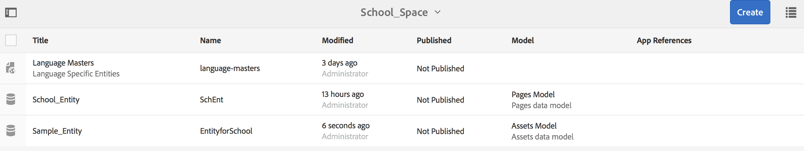
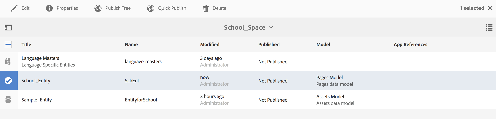

# Espaces et entités{#spaces-and-entities}

>[!NOTE]
>
>Adobe recommande d’utiliser l’éditeur d’application d’une seule page (SPA) pour les projets nécessitant un rendu côté client basé sur la structure SPA (par exemple, React). [En savoir plus](/help/sites-developing/spa-overview.md).

Un espace est un emplacement pratique pour stocker les entités exposées par le biais de l’API REST Content Services. Cela s’avère particulièrement utile, car une application (ou n’importe quel canal) peut être associée à de nombreuses entités. Forcer les entités à être dans un espace force la bonne pratique de regroupement des exigences d’une application. Vous pouvez éventuellement associer une application dans AEM à un petit nombre d’espaces.

>[!NOTE]
>
>Pour rendre un élément disponible pour n’importe quel canal de Content Services, il doit se trouver sous un espace.

## Création d’un espace {#creating-a-space}

Si l’utilisateur souhaite exposer un ensemble de contenu et de ressources à une application mobile, il crée l’espace à l’aide du tableau de bord AEM Mobile.

Pour la première fois, si un utilisateur n’a pas configuré les services de contenu pour qu’ils fonctionnent avec les espaces, le tableau de bord AEM Mobile affiche uniquement les applications après avoir sélectionné **Content Services**.

>[!CAUTION]
>
>**Conditions préalables pour l’ajout d’un espace**
>
>Cochez la case **Activer AEM Content Services** pour utiliser les espaces et l’activer dans le tableau de bord de votre application AEM Mobile.
>
>Voir [Administration de Content Services](/help/mobile/developing-content-services.md) pour plus d’informations.

Une fois que vous avez configuré les espaces dans le tableau de bord, procédez comme suit pour créer des espaces :

1. Sélectionnez **Espaces** dans Content Services.

   

1. Sélectionnez **Créer** pour créer un espace. Saisissez **Titre**, **Nom** et **Description** pour l’espace.

   Cliquez sur **Créer**.

   

## Gestion d’un espace {#managing-a-space}

Une fois que vous avez créé un espace, cliquez sur la gauche pour le gérer dans la liste.

Vous pouvez afficher les propriétés de l’espace, supprimer l’espace ou publier l’espace et son contenu sur une instance de publication AEM.

**Affichage et modification des propriétés d’un espace**

1. Sélectionner l’espace dans la liste
1. Sélectionnez **Propriétés** dans la barre d’outils.
1. Cliquez sur **Fermer** une fois terminé.

**Publication d’un** espace : lorsqu’un espace est publié, tous les dossiers et entités de cet espace sont également publiés.

1. Sélectionnez l’espace en cliquant sur son icône dans la liste Console d’espace
1. Sélectionnez **Publier l’arborescence**

>[!NOTE]
>
>Vous pouvez **Annuler la publication** d’un espace, ce qui supprime l’espace de l’instance de publication.
>
>L’image suivante illustre les actions qui peuvent être effectuées après la publication de l’espace.

## Utilisation de dossiers dans un espace {#working-with-folders-in-a-space}

Les espaces peuvent inclure des dossiers pour mieux organiser le contenu et les ressources de l’espace. Les utilisateurs peuvent créer leur propre hiérarchie sous un espace.

### Création d’un dossier {#creating-a-folder}

1. Cliquez sur l’espace dans la liste de la console d’espace et cliquez sur **Créer un dossier**

   

1. Saisissez le **Titre**, **Nom,** et **Description** du dossier.

   

1. Cliquez sur **Créer** pour créer le dossier dans un espace.

## Copie de la langue {#language-copy}

>[!CAUTION]
>
>La copie de langue n’est pas entièrement fonctionnelle dans cette version. Il ne fait que configurer la structure.

La fonction **Copie de langue** permet aux auteurs de copier leur copie de langue principale, puis de créer un projet et un workflow pour traduire automatiquement le contenu. Copie de langue crée la structure appropriée. Une fois que vous avez ajouté un dossier dans un espace, vous pouvez y ajouter une copie de la langue.

>[!NOTE]
>
>Il est recommandé de placer tout contenu pouvant être traduit sous le noeud Copie de la langue .

### Ajout d’une copie de langue {#adding-language-copy}

1. Une fois que vous avez créé l’espace, cliquez sur cet espace pour créer une copie de langue.

   Cliquez sur **Créer** et sélectionnez **Copie de la langue**.

   

   >[!NOTE]
   >
   >Les noeuds Copie de langue ne peuvent exister qu’en tant qu’enfant direct de l’espace.

1. Sélectionnez **Content Package Language&amp;ast;** et saisissez **Title&amp;ast;** dans la boîte de dialogue **Créer une copie de langue**.

   Cliquez sur **Créer**.

   

1. Une fois que vous avez créé une copie de langue, elle apparaît dans votre espace sous **Principal de langue**.

   

   >[!NOTE]
   >
   >Sélectionnez **Principal de langue** pour afficher les dossiers de copie de langue.

### Suppression d’un dossier de l’espace {#removing-a-folder-from-the-space}

1. Sélectionner le dossier dans la liste des contenus d&#39;espace
1. Cliquez sur **Supprimer** dans la barre d’outils.

   >[!NOTE]
   >
   >Pour accéder à un dossier et afficher son contenu ou ajouter un sous-dossier ou une entité, cliquez sur le titre du dossier dans la liste de contenu de l’espace.

## Utilisation d’entités dans un espace {#working-with-entities-in-a-space}

Les entités représentent le contenu exposé par le biais du point d’entrée du service Web. Les entités sont stockées dans des espaces afin qu’elles puissent être facilement trouvées et restent indépendantes de la structure de référentiel AEM qui contient leur contenu associé.

Vous souhaiterez peut-être regrouper les entités dans un rassemblement logique. Pour ce faire, vous pouvez créer un nombre illimité de dossiers.

Si les enfants d’entités, qui sont d’autres entités, sont collectés pour la modélisation des données, l’utilisateur développeur peut créer des &quot;modèles de groupe&quot; spécifiques à partir du type de modèle &quot;Groupe d’entités&quot;, fourni prêt à l’emploi.

>[!NOTE]
>
>Les entités sont toujours associées à un espace. Par conséquent, la plupart de l’interface utilisateur de l’entité est accessible par le biais de la console d’espace.

### Création d’une entité {#creating-an-entity}

1. Ouvrez la console Espace et cliquez sur le titre de l’espace.

   Vous pouvez éventuellement accéder au dossier en cliquant sur le titre du dossier dans la liste.

   

1. Sélectionnez le modèle de l’entité. Il s’agit du type d’entité que vous souhaitez créer. Cliquez sur Suivant.

   

   >[!NOTE]
   >
   >Vous avez la possibilité de choisir **Modèle de ressources**, **Modèle de pages** ou un modèle de type d’entité que vous avez créé précédemment.
   >
   >Voir [Création d’un modèle](/help/mobile/administer-mobile-apps.md) pour créer votre entité personnalisée.

1. Saisissez un **Titre**, **Nom**, **Description** et **Balises** pour l’entité. Cliquez sur **Créer**.

   

   Une fois que vous avez terminé, l’entité apparaît dans les descendants de votre espace.

### Modification d’une entité {#editing-an-entity}

1. Une fois que vous avez créé une entité, accédez à votre dossier ou espace et sélectionnez votre entité dans la console Espace pour la modifier.

   

1. Sélectionnez une entité à modifier et cliquez sur **Modifier**.

   

   >[!CAUTION]
   >
   >Selon le modèle que vous choisissez de créer votre entité, l’interface utilisateur sera différente pour les deux, pour la modification et l’affichage des propriétés de votre entité. Pour plus d’informations, voir les étapes ci-dessous.

   ***Si vous choisissez le modèle de création de l’entité comme Modèles*** d’actifs, cliquez sur  **** Modifier pour ajouter des actifs, comme illustré dans la figure ci-dessous :

   

   Vous pouvez également cliquer sur **Aperçu** pour afficher le lien json.

   

   ***Si vous choisissez le modèle de création de l’entité comme Modèles de pages***, cliquez sur  **** Modifier pour ajouter des ressources, comme illustré dans la figure ci-dessous :

   

   Cliquez sur l’icône **Chemin** pour ajouter une ressource.

   

   >[!NOTE]
   >
   >Une fois que vous avez ajouté une entité, elle doit être enregistrée pour que le lien Aperçu fonctionne. Pour afficher l’aperçu, cliquez sur **Enregistrer**. Cliquez sur **Aperçu** pour afficher le fichier json de la ressource ajoutée, comme illustré dans la figure ci-dessous :

   

   >[!NOTE]
   >
   >Lorsque vous avez terminé d’ajouter des ressources à votre entité, vous pouvez soit sélectionner **Enregistrer** pour enregistrer les modifications, soit sélectionner **Enregistrer et fermer** pour enregistrer et rediriger vers la liste de la console Espace dans laquelle les entités sont définies.

   De plus, sélectionnez une entité dans la liste de la console d’espace et cliquez sur **Propriétés** pour afficher et modifier les propriétés d’une entité définie.

   

   Vous pouvez modifier le titre, la description, les balises et ajouter les ressources à votre entité.

   

### Suppression d’une entité {#removing-an-entity}

1. Sélectionnez l’entité dans la liste des contenus d’espace

   

1. Cliquez sur **Supprimer** dans la barre d’outils pour supprimer l’entité spécifique de l’espace.

### Publication d’une entité {#publishing-an-entity}

Vous avez la possibilité de choisir **Publier l’arborescence** ou **Publication rapide** pour publier votre entité.

1. Sélectionnez une entité dans la liste de la console d’espace et cliquez sur **Publier l’arborescence **pour publier cette entité et ses enfants.

   

   **Ou**,

   Cliquez sur **Publication rapide** pour publier cette entité spécifique.
