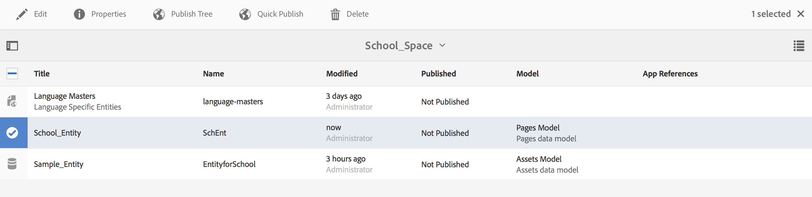

# Espaces et entités{#spaces-and-entities}

{{ue-over-mobile}}

Un espace est un emplacement pratique pour stocker les entités exposées par le biais de l’API REST Content Services. Cela s’avère particulièrement utile, car une application (ou n’importe quel canal) peut être associée à de nombreuses entités. Forcer les entités à se trouver dans un espace force la bonne pratique de regroupement des exigences d&#39;une application. Vous pouvez éventuellement associer une application dans AEM à un petit nombre d’espaces.

>[!NOTE]
>
>Pour rendre un élément disponible pour un canal à partir de Content Services, il doit se trouver sous un espace.

## Création d’un emplacement {#creating-a-space}

Si l’utilisateur souhaite exposer un ensemble de contenu et de ressources à une application mobile, il crée l’espace à l’aide du tableau de bord AEM Mobile.

Pour la première fois qu’un utilisateur n’a pas configuré Content Services pour qu’il fonctionne avec des espaces, le tableau de bord AEM Mobile affiche uniquement les applications après avoir sélectionné **Content Services**.

>[!CAUTION]
>
>**Conditions préalables pour l’ajout d’un emplacement**
>
>Cochez la case **Activer AEM Content Services** pour utiliser les espaces et les activer dans le tableau de bord de votre application AEM Mobile.
>
>Voir [Administration de Content Services](/help/mobile/developing-content-services.md) pour plus d’informations.

Une fois que vous avez configuré les espaces dans le tableau de bord, procédez comme suit pour créer des espaces :

1. Choisissez **Spaces** dans Content Services.

   

1. Choisissez **Créer** pour créer un espace. Saisissez **Titre**, **Nom** et **Description** pour l’espace.

   Cliquez sur **Créer**.

   

## Gestion d’un emplacement {#managing-a-space}

Après avoir créé un espace, cliquez sur la gauche pour le gérer dans la liste.

Vous pouvez afficher les propriétés de l’espace, supprimer l’espace ou publier l’espace et son contenu sur une instance de publication AEM.

**Affichage et modification des propriétés d&#39;un espace**

1. Sélectionnez l&#39;emplacement dans la liste
1. Choisissez **Propriétés** dans la barre d’outils
1. Cliquez sur **Fermer** lorsque vous avez terminé

**Publication d’un emplacement** Lorsqu’un emplacement est publié, tous les dossiers et entités de cet emplacement sont également publiés.

1. Sélectionnez l&#39;espace en cliquant sur son icône dans la liste de la console Space
1. Choisir L&#39;Arborescence De Publish **&#x200B;**

>[!NOTE]
>
>Vous pouvez **Dépublier** un espace, ce qui supprime l’espace de l’instance de publication.
>
>L’image suivante illustre les actions qui peuvent être effectuées après la publication de l’espace.

## Utilisation de dossiers dans un espace {#working-with-folders-in-a-space}

Les espaces peuvent inclure des dossiers pour mieux organiser le contenu et les ressources de l’espace. Les utilisateurs peuvent créer leur propre hiérarchie sous un espace.

### Création d’un dossier {#creating-a-folder}

1. Cliquez sur l’espace dans la liste de la console Espace et cliquez sur **Créer un dossier**

   

1. Saisissez les **Titre**, **Nom** et **Description** pour le dossier

   

1. Cliquez sur **Créer** pour créer le dossier dans un espace

## Copie de langue {#language-copy}

>[!CAUTION]
>
>La copie de langue n’est pas entièrement fonctionnelle pour cette version. Il ne fait que mettre en place la structure.

La fonction **Copie de langue** permet aux auteurs de copier leur copie de langue principale, puis de créer un projet et un workflow pour traduire automatiquement le contenu. La copie de la langue crée la structure appropriée. Une fois que vous avez ajouté un dossier dans un espace, vous pouvez ajouter la copie de langue à votre espace.

>[!NOTE]
>
>Il est recommandé que tout contenu susceptible d’être traduit soit placé sous le nœud Copie de la langue .

### Ajout d’une copie de langue {#adding-language-copy}

1. Après avoir créé un espace, cliquez sur cet espace pour créer une copie de langue.

   Cliquez sur **Créer** et choisissez **Copie de la langue**.

   

   >[!NOTE]
   >
   >Les nœuds de copie de langue ne peuvent exister qu’en tant qu’enfant direct de l’espace.

1. Choisissez **Content Package Language&ast;** et saisissez le **Title&ast;** dans la boîte de dialogue **Créer une copie de langue**.

   Cliquez sur **Créer**.

   

1. Une fois la copie de langue créée, elle apparaît dans votre espace dans **Principal de langue**.

   

   >[!NOTE]
   >
   >Sélectionnez **Principal de langue** pour afficher les dossiers de copie de langue.

### Suppression d’un dossier de l’espace {#removing-a-folder-from-the-space}

1. Sélectionnez le dossier dans la liste des contenus d&#39;espace
1. Cliquez sur **Supprimer** dans la barre d’outils

   >[!NOTE]
   >
   >Pour accéder à un dossier et voir son contenu ou ajouter un sous-dossier ou une entité, cliquez sur le titre du dossier dans la liste de contenu de l&#39;espace.

## Utilisation d’entités dans un espace {#working-with-entities-in-a-space}

Les entités représentent le contenu exposé via le point d’entrée du service web. Les entités sont stockées dans des espaces afin que les puissent être facilement trouvées et qu’elles restent indépendantes de la structure de référentiel AEM qui contient leur contenu associé.

Vous pouvez regrouper des entités dans un regroupement logique. Pour ce faire, vous pouvez créer un nombre illimité de dossiers.

Si des enfants d&#39;entités, qui sont d&#39;autres entités, sont rassemblés pour la modélisation des données, l&#39;utilisateur développeur peut créer des « Modèles de groupe » spécifiques à partir du type de modèle « Groupe d&#39;entités », fournis prêts à l&#39;emploi.

>[!NOTE]
>
>Les entités étant toujours associées à un espace, la majeure partie de l&#39;interface utilisateur d&#39;entité est accessible via la console d&#39;espace.

### Création d&#39;une entité {#creating-an-entity}

1. Ouvrez la console Espace et cliquez sur le titre de l’espace.

   Vous pouvez éventuellement accéder au dossier en cliquant sur son titre dans la liste.

   

1. Choisissez le modèle de l&#39;entité. Il s’agit du type d’entité que vous souhaitez créer. Cliquez sur Suivant.

   

   >[!NOTE]
   >
   >Vous avez la possibilité de choisir le **modèle Assets**, le **modèle Pages** ou un modèle de type d’entité que vous avez créé précédemment.
   >
   >Voir [Création d’un modèle](/help/mobile/administer-mobile-apps.md) pour créer votre entité personnalisée.

1. Saisissez un **Titre**, **Nom**, **Description** et **Balises** pour l’entité. Cliquez sur **Créer**.

   

   Une fois que vous avez terminé, l’entité apparaît dans les descendants de votre espace perso.

### Modification d&#39;une entité {#editing-an-entity}

1. Une fois que vous avez créé une entité, accédez à votre dossier ou à votre espace et choisissez votre entité dans la console Espace pour la modifier.

   

1. Sélectionnez une entité à modifier et cliquez sur **Modifier**.

   

   >[!CAUTION]
   >
   >Selon le modèle que vous choisissez pour créer votre entité, l’interface utilisateur sera différente pour les deux, pour la modification et l’affichage des propriétés de votre entité. Pour plus d’informations, suivez les étapes ci-dessous.

   ***Si vous choisissez le modèle de création de l&#39;entité sous la forme de Modèles Assets***, le fait de cliquer sur **Modifier** permet d&#39;ajouter des ressources, comme dans l&#39;illustration ci-dessous :

   

   Vous pouvez également cliquer sur **Aperçu** pour afficher le lien json.

   

   ***Si vous choisissez le modèle pour créer l’entité en tant que modèles de pages***, le fait de cliquer sur **Modifier** vous permet d’ajouter des ressources comme illustré dans la figure ci-dessous :

   

   Cliquez sur l’icône dans le **Chemin** pour ajouter une ressource

   

   >[!NOTE]
   >
   >Une fois que vous avez ajouté une entité, elle doit être enregistrée pour que le lien Aperçu fonctionne. Pour afficher l’aperçu, cliquez sur **Enregistrer**. Cliquez sur l’**Aperçu** pour afficher le fichier json de la ressource ajoutée, comme illustré dans la figure ci-dessous :

   

   >[!NOTE]
   >
   >Lorsque vous avez terminé d’ajouter des ressources à votre entité, vous pouvez choisir **Enregistrer** pour enregistrer les modifications ou choisir **Enregistrer et fermer** pour enregistrer et rediriger vers la liste de la console Espace où les entités sont définies.

   De plus, sélectionnez une entité dans la liste de la console spatiale et cliquez sur **Propriétés** pour afficher et modifier les propriétés d&#39;une entité définie.

   

   Vous pouvez modifier le titre, la description, les balises et ajouter les ressources à votre entité.

   

### Suppression d’une entité {#removing-an-entity}

1. Sélectionnez l&#39;entité dans la liste des contenus de l&#39;emplacement

   

1. Cliquez sur **Supprimer** dans la barre d’outils pour supprimer l’entité spécifique de l’espace

### Publication d’une entité {#publishing-an-entity}

Vous avez la possibilité de choisir **Arborescence de Publish** ou **Publish rapide** pour publier votre entité.

1. Sélectionnez une entité dans la liste de la console spatiale et cliquez sur l&#39;icône **Arborescence Publish**&#x200B;pour la publier ainsi que ses enfants.

   

   **Ou**,

   Cliquez sur **Quick Publish** pour publier cette entité spécifique.
