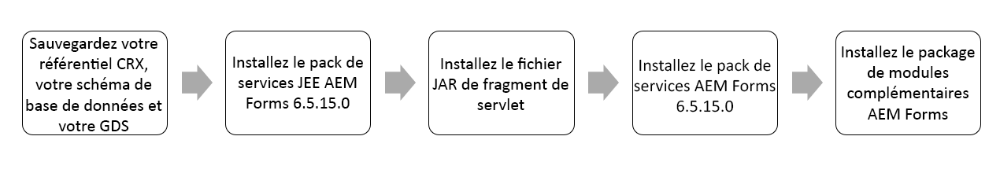
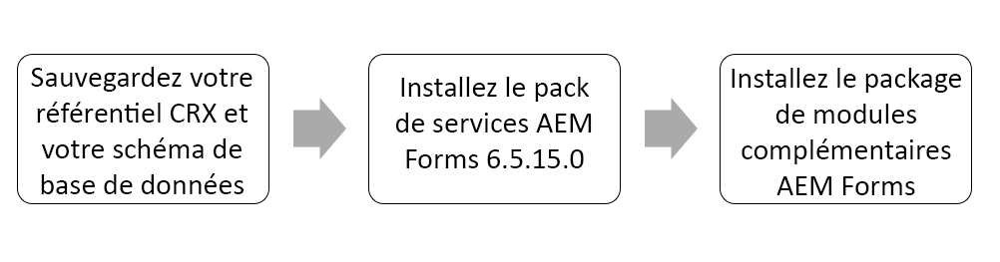

# Instructions d’installation d’AEM 6.5 Service Pack Forms {#aem-form-patch-installation-instructions}

## Informations sur la version

| Produit | Adobe Experience Manager  6.5 Forms |
|---|---|
| Version | 6.5.15.0 |
| Type | Mise à jour du pack de services |
| Date | 01 décembre 2022 |

## Éléments inclus dans Experience Manager Forms 6.5.15.0

Le Service Pack d’Adobe Experience Manager (AEM) Forms comprend de nouvelles fonctionnalités et des fonctionnalités mises à niveau, telles que les améliorations importantes demandées par les clients, les performances, la stabilité et les améliorations de sécurité. AEM Forms publie les Service Packs à intervalles réguliers afin de fournir les dernières fonctionnalités et améliorations. Selon votre pile, sélectionnez l’un des chemins suivants pour télécharger et installer le Service Pack sur votre environnement :

* [Télécharger et installer le Service Pack sur un environnement AEM Forms on JEE](#download-and-install-for-jee-service-pack)
* [Télécharger et installer le Service Pack sur un environnement AEM Forms on OSGi](#download-and-install-for-osgi-service-pack)

>[!NOTE]
>
> Adobe publie un programme d’installation complet après chaque 6e Service Pack. AEM 6.5 Forms Service Pack 12 (6.5.12.0) on JEE est le dernier programme d’installation complet. Le programme d’installation complet prend en charge les nouvelles plates-formes, tandis que le programme d’installation du package de service normal inclut uniquement des correctifs de bogues et des améliorations générales. Si vous effectuez une nouvelle installation ou une nouvelle planification pour utiliser les derniers logiciels de votre environnement Forms on JEE 6.5 AEM, Adobe recommande d’utiliser AEM 6.5.12.0 Forms on JEEfull, programme d’installation lancé le 3 mars 2022 au lieu du programme d’installation Forms 6.5, publié le 8 avril 2019. Après avoir utilisé le programme d’installation complet, installez le dernier Service Pack.

## Télécharger et installer le Service Pack sur un environnement AEM Forms on JEE {#download-and-install-for-jee-service-pack}

+++1. Sauvegardez votre environnement existant :

1. Sauvegardez vos [Référentiel CRX, schéma de base de données et répertoire de stockage global de documents](https://experienceleague.adobe.com/docs/experience-manager-65/forms/administrator-help/aem-forms-backup-recovery/backing-aem-forms-data.html).
1. Sauvegardez le &lt;*AEM_forms_root* dossier >/deploy. Elle est requise si vous décidez de désinstaller le Service Pack.

+++

+++2.Téléchargez le logiciel requis :

* Service Pack d’AEM Forms on JEE 6.5.15.0
* AEM 6.5.15.0 Service Pack 
* Package de modules complémentaires Forms
* Bundle
* Fragments

+++

+++3. Installez le Service Pack d’AEM Forms on JEE :

1. Arrêtez le serveur d’applications.
1. Extrayez le **Archive du programme d’installation d’AEM Forms on JEE 6.5.15.0 Service Pack** sur votre disque dur :

   * **Windows**
Accédez au répertoire approprié sur le support d’installation ou dans le dossier de votre disque dur dans lequel vous avez copié le programme d’installation, puis double-cliquez sur le 
`aemforms65_cfp_install.exe` approuvé.

      * (Windows 32 bits) `Windows\Disk1\InstData\VM`
      * (Windows 64 bits) `Windows_64Bit`\ `Disk1\InstData\VM`
   * **Linux**
Accédez au répertoire approprié, puis à partir d’un shell et saisissez 
`./aem65_cfp_install.bin`.

      * (Linux) `Linux/Disk1/InstData/NoVM`

   Un assistant s’ouvre alors et vous guide tout au long de l’installation.

1. Dans le panneau Introduction, cliquez sur **[!UICONTROL Suivant]**.
1. Sur le **Choisir le dossier d’installation** vérifiez que l’emplacement par défaut affiché est correct pour votre installation existante, ou cliquez sur **[!UICONTROL Parcourir]** pour sélectionner l’autre dossier dans lequel AEM forms est installé, puis cliquez sur **[!UICONTROL Suivant]**.
1. Lisez les informations récapitulatives du Service Pack et cliquez sur **[!UICONTROL Suivant]**.
1. Lisez le résumé relatif à la pré-installation, puis cliquez sur **[!UICONTROL Installer]**.
1. Lorsque l’installation est terminée, cliquez sur **[!UICONTROL Suivant]** pour appliquer les mises à jour du Quick Fix à vos fichiers installés.
1. **[Pour Windows uniquement]:** Effectuez l’une des étapes suivantes :

   * Désélectionnez l’option **Démarrez Configuration Manager** avant de cliquer sur **[!UICONTROL Terminé]**. Exécuter **Configuration Manager** en utilisant la variable **ConfigurationManager.bat** fichier situé dans `[aem-forms root]\configurationManager\bin`.

   * Ou désélectionnez l’option **Démarrez Configuration Manager** avant de cliquer sur **[!UICONTROL Terminé]**. Avant exécution **Configuration Manager** using **ConfigurationManager.exe** ou **ConfigurationManager_IPv6.exe**, accédez à *`<AEMForms_Install_Dir>\configurationManager\bin`* répertoire et remplacer [ConfigurationManager.lax](/help/assets/ConfigurationManager.lax) et [ConfigurationManager_IPV6.lax](/help/assets/ConfigurationManager_IPv6.lax) fichiers .

      >[!NOTE]
      >
      > En utilisant la variable **ConfigurationManager.bat** vous permet d’éviter de mettre à jour manuellement le nom des fichiers .lax.

1. **[Pour Unix uniquement]:** Le **Démarrez Configuration Manager** est sélectionnée par défaut. Cliquez sur **[!UICONTROL Terminé]** pour exécuter Configuration Manager instantanément ou pour exécuter **Configuration Manager** désélectionnez ensuite l’option **Démarrez Configuration Manager** avant de cliquer sur **[!UICONTROL Terminé]**. Vous pouvez commencer **Configuration Manager** par la suite, en utilisant le script approprié dans la variable `[AEM_forms_root]/configurationManager/bin` répertoire .

1. En fonction de votre serveur d’applications, sélectionnez l’un des documents suivants et suivez les instructions de la section *Configuration et déploiement d’AEM Forms*.

   * [Installation et déploiement d’AEM Forms pour JBoss](https://www.adobe.com/go/learn_aemforms_installJBoss_65_fr)
   * [Installation et déploiement d’AEM Forms pour WebSphere](https://www.adobe.com/go/learn_aemforms_installWebSphere_65_fr)
   * [Installation et déploiement d’AEM Forms pour WebLogic](https://www.adobe.com/go/learn_aemforms_installWebLogic_65_fr)

+++

+++4. Installation du fragment de servlet

L’installation est obligatoire. **fragment de servlet** pour tous les serveurs d’applications, à l’exception de ceux qui s’exécutent sur JBoss EAP 7.4.0. Pour télécharger et installer le fragment de servlet :

1. Si vous n’avez pas téléchargé le fragment, téléchargez-le à partir de [Distribution logicielle](https://experience.adobe.com/#/downloads/content/software-distribution/en/aem.html?package=/content/software-distribution/en/details.html/content/dam/aem/public/adobe/packages/cq650/featurepack/org.apache.felix.http.servlet-api-1.2.0_fragment_full.jar)

1. Démarrez le serveur d’applications, attendez que les journaux se stabilisent et vérifiez l’état du lot.

1. Ouvrez les lots de la console web. L’URL par défaut est `http://[Server]:[Port]/system/console/bundles`.

1. Cliquez sur Installer/Mettre à jour. Sélectionnez le fragment téléchargé org.apache.felix.http.servlet-api-1.2.0_fragment_full.jar. Cliquez sur Install (Installer) ou Update (Mettre à jour). Attendez que le serveur applicatif se stabilise

1. Arrêtez le serveur d’applications.

+++

+++5. Installez AEM  Service Pack 

1. Redémarrez l’instance avant l’installation si l’instance est en mode de mise à jour (lorsque l’instance a été mise à jour à partir d’une version antérieure). Adobe recommande un redémarrage si le temps de disponibilité actuel d’une instance est élevé.
1. Avant l’installation, prenez un instantané ou exécutez une sauvegarde récente de votre instance [!DNL Experience Manager].
1. Téléchargez le pack de services à partir de la [Distribution logicielle](https://experience.adobe.com/#/downloads/content/software-distribution/en/aem.html?package=/content/software-distribution/en/details.html/content/dam/aem/public/adobe/packages/cq650/servicepack/aem-service-pkg-6.5.15.0.zip). <!-- UPDATE FOR EACH NEW RELEASE -->
1. Ouvrez Package Manager, puis sélectionnez **[!UICONTROL Télécharger le module]** pour télécharger le module. Pour en savoir plus, consultez la section [Gestionnaire de modules](/help/sites-administering/package-manager.md).
1. Sélectionnez le module, puis sélectionnez **[!UICONTROL Installer]**.
1. Pour mettre à jour le connecteur S3, arrêtez l’instance après l’installation du pack de services, remplacez le connecteur existant par un nouveau fichier binaire fourni dans le dossier d’installation, puis redémarrez l’instance. Consultez la section [Entrepôt de données S3 Amazon](/help/sites-deploying/data-store-config.md#upgrading-to-a-new-version-of-the-s-connector).

**Installation automatique**

Vous pouvez utiliser deux méthodes différentes pour installer automatiquement [!DNL ExperienceManager] 6.5.15.0.<!--       UPDATE FOR EACH NEW RELEASE -->

* Placez le module dans `../crx-quickstart/install` lorsque le serveur est disponible en ligne.
Le module est automatiquement installé.

* Utilisez l’[API HTTP à partir du gestionnaire de modules](/help/sites-administering/package-managermd#package-share). Utilisation     `cmd=install&recursive=true` afin que les modules imbriqués soient installés.

   >[!NOTE]
   >
   >Experience Manager 6.5.15.0 ne prend pas en charge l’installation de Bootstrap. <!-- UPDATE FOR EACHNEW RELEASE -->

**Validation de l’installation**

Pour connaître les plates-formes certifiées pour travailler avec cette version, reportez-vous à la section [exigences techniques](/help/ sites-deploying/technical-requirements.md).

1. la page d’informations sur les produits (`/system/console/productinfo`) affiche la chaîne de version mise à jour `Adobe Experience      Manager (6.5.15.0)` under [!UICONTROL Produits installés].<!-- UPDATE FOR EACH NEW RELEASE -->
1. Tous les lots OSGi sont : **[!UICONTROL PRINCIPAL]** ou **[!UICONTROL FRAGMENT]** dans la console OSGi (Utiliser la console web : `/system/console/bundles`).
1. Le lot OSGi `org.apache.jackrabbit.oak-core` est version 1.22.13 ou ultérieure (Utiliser WebConsole) : `/system/console/     bundles`).

+++

+++6. Installation du module complémentaire Experience Manager Forms AEM

1. Assurez-vous que vous avez installé le [!DNL Experience Manager] Service pack.
1. Téléchargez le module complémentaire Forms correspondant répertorié à l’adresse [Versions d’AEM Forms](https:/experienceleague.adobe.com/ docs/experience-manager-release-informationaem-release-updates/forms-updates/aem-forms-releases.html#forms-updates) pour votre système d’exploitation.
1. Installez le module complémentaire Forms comme décrit dans [Installation des packages de modules complémentaires AEM Forms](help/forms/using/installing-configuring-aem-forms-osgimd#install-aem-forms-add-on-package).
1. Si vous utilisez des lettres dans Experience Manager 6.5 Forms, installez la variable [dernier package AEMFDCompatibility](https:// experienceleague.adobe.com/docsexperience-manager-release-information/aem-release-updates/forms-updates/).

+++

<!-- 1. (JBoss only) After installing the patch and configuring the server, delete  tmp  and work directories of JBoss application server.

>[!IMPORTANT]
>
>Before installing [AEM 6.5.15.0 service pack](#install-the-aem-service-pack-install-aem-service-pack), for all the AEM Forms on JEE environments using any application servers other than JBoss EAP 7.4.0: 
> * Install  the [org.apache.felix.http.servlet-api-1.2.0_fragment-full.jar](https://experience.adobe.com/#/downloads/content/software-distribution/en/aem.html?package=/content/software-distribution/en/details.html/content/dam/aem/public/adobe/packages/cq650/featurepack/org.apache.felix.http.servlet-api-1.2.0_fragment_full.jar) servlet fragment and wait for the application server to stabilize.
>* If you install the latest [AEM service pack (6.5.15.0)](#install-the-aem-service-pack-install-aem-service-pack), prior to the fragment servlet `org.apache.felix.http.servlet-api-1.2.0_fragment-full.jar` on JEE environment, the CRX/bundle and the start page show service unavailable errors, [click here](/help/forms/using/aem-service-pack-installation-solution.md) to know the troubleshooting steps. 

### !-->

## Télécharger et installer le Service Pack sur un environnement AEM Forms on OSGi {#download-and-install-for-osgi-service-pack}

+++1. Effectuez une sauvegarde de votre environnement existant :

1. Sauvegardez vos [Référentiel CRX et schéma de base de données](https://experienceleague.adobe.com/docs/experience-manager-65/forms/administrator-help/aem-forms-backup-recovery/backing-aem-forms-data.html).

>[!NOTE]
>
> Si vous installez le Service Pack AEM Forms pour la base de données relationnelle, il est obligatoire de sauvegarder DB_schema.

+++

+++2.Téléchargez le logiciel requis :

* [AEM 6.5.15.0 Service Pack ](https://experience.adobe.com/#/downloads/content/software-distribution/en/aem.html?package=/content/software-distribution/en/details.html/content/dam/aem/public/adobe/packages/cq650/servicepack/aem-service-pkg-6.5.15.0.zip)
* [Package de modules complémentaires Forms](/help/forms/using/installing-configuring-aem-forms-osgi.md#install-aem-forms-add-on-package)

+++

+++3. Installez AEM  Service Pack 

1. Redémarrez l’instance avant l’installation si l’instance est en mode de mise à jour (lorsque l’instance a été mise à jour à partir d’une version antérieure). Adobe recommande un redémarrage si le temps de disponibilité actuel d’une instance est élevé.
1. Avant l’installation, prenez un instantané ou exécutez une sauvegarde récente de votre instance [!DNL Experience Manager].
1. Téléchargez le pack de services à partir de la [Distribution logicielle](https://experience.adobe.com/#/downloads/content/software-distribution/en/aem.html?package=/content/software-distribution/en/details.html/content/dam/aem/public/adobe/packages/cq650/servicepack/aem-service-pkg-6.5.15.0.zip). <!-- UPDATE FOR EACH NEW RELEASE -->
1. Ouvrez Package Manager, puis sélectionnez **[!UICONTROL Télécharger le module]** pour télécharger le module. Pour en savoir plus, consultez la section [Gestionnaire de modules](/help/sites-administering/package-manager.md).
1. Sélectionnez le module, puis sélectionnez **[!UICONTROL Installer]**.
1. Pour mettre à jour le connecteur S3, arrêtez l’instance après l’installation du pack de services, remplacez le connecteur existant par un nouveau fichier binaire fourni dans le dossier d’installation, puis redémarrez l’instance. Consultez la section [Entrepôt de données S3 Amazon](/help/sites-deploying/data-store-config.md#upgrading-to-a-new-version-of-the-s-connector).

**Installation automatique**

Vous pouvez utiliser deux méthodes différentes pour installer automatiquement [!DNL Experience Manager] 6.5.15.0.<!--       UPDATE FOR EACH NEW RELEASE -->

* Placez le module dans le dossier `../crx-quickstart/install` lorsque le serveur est disponible en ligne. Le module est automatiquement installé.
* Utilisez l’[API HTTP à partir du gestionnaire de modules](/help/sites-administering/package-manager.md#package-share). Utilisez `cmd=install&recursive=true` afin que les modules imbriqués soient installés.

   >[!NOTE]
   >
   >Experience Manager 6.5.15.0 ne prend pas en charge l’installation de Bootstrap. <!-- UPDATE FOR EACH NEW RELEASE -->

**Validation de l’installation**

Pour connaître les plates-formes certifiées pour travailler avec cette version, reportez-vous à la section [exigences techniques](/help/ sites-deploying/technical-requirements.md).

1. La page d’informations sur les produits (`/system/console/productinfo`) affiche la chaîne de version mise à jour `Adobe Experience      Manager (6.5.15.0)` sous [!UICONTROL Produits installés]. <!-- UPDATE FOR EACH NEW RELEASE -->

1. Tous les lots OSGi sont au statut **[!UICONTROL ACTIF]** ou **[!UICONTROL FRAGMENT]** dans la console OSGi (utilisez la console web : `/system/console/bundles`).

   1. La version du lot OSGi `org.apache.jackrabbit.oak-core` est 1.22.13 ou une version ultérieure (utilisez la console web : `/system/console/bundles`).

+++

+++4. Installation du module complémentaire Experience Manager Forms AEM

1. Assurez-vous que vous avez installé le [!DNL Experience Manager] Service pack.
1. Téléchargez le module complémentaire Forms correspondant répertorié dans les [Mises à jour d’AEM Forms](https://experienceleague.adobe.com/docs/experience-manager-release-information/aem-release-updates/forms-updates/aem-forms-releases.html?lang=fr#forms-updates) pour votre système d’exploitation.
1. Installez le module complémentaire Forms comme décrit dans la section [Installation des modules complémentaires AEM Forms](/help/forms/using/installing-configuring-aem-forms-osgi.md#install-aem-forms-add-on-package-install-aem-forms-add-on-package).
1. Si vous utilisez des lettres dans Experience Manager 6.5 Forms, installez le [dernier module de compatibilité AEMFD](https://experienceleague.adobe.com/docs/experience-manager-release-information/aem-release-updates/forms-updates/aem-forms-releases.html?lang=fr#forms-updates).

+++

## Résolution des problèmes

* If **Boîte de dialogue sur l’interface utilisateur du gestionnaire de modules** quitte le service pack pendant l’installation, attendez que les journaux d’erreurs se stabilisent avant d’accéder au déploiement. Attendez les logs spécifiques liés à la désinstallation du lot de mise à jour avant de vous assurer que les installations sont réussies. En règle générale, ce problème se produit dans le navigateur Safari, mais peut se produire par intermittence dans n’importe quel navigateur.

* Vérifiez les logs du moniteur (error.log) une fois l’installation terminée pour toute activité. Patientez quelques minutes jusqu’à ce qu’il n’y ait aucune activité dans les journaux. Redémarrez l’instance AEM.

* Si vous rencontrez **erreur du service indisponible** après l’installation du dernier Service Pack AEM Forms 6.5.15.0, [cliquez ici](/help/forms/using/aem-service-pack-installation-solution.md) pour voir les étapes de dépannage.
