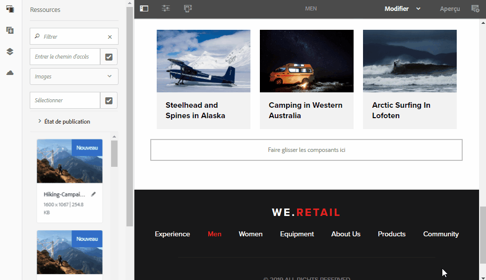

# AEM Assets Notes de mise à jour{#aem-assets-release-notes}

Voici les principales fonctionnalités et points forts d’AEM 6.5 Assets.

## Intégration avec Adobe Creative Cloud et workflows créatifs {#integration-with-adobe-creative-cloud-and-creative-workflows}

AEM propose différentes manières de s’intégrer à Adobe Creative Cloud et de partager des ressources à utiliser dans des workflows, où les équipes créatives et marketing ou les équipes d’entreprise collaborent étroitement. AEM 6.5 continue à améliorer l’intégration et à la rationaliser afin d’exposer davantage de possibilités et de rationaliser les méthodes existantes. 

Lisez ce qui suit pour connaître les fonctionnalités et intégrations spécifiques d’AEM 6.5 que vous pouvez utiliser pour prendre en charge les cas d’utilisation de vélocité de contenu.

### Adobe Asset Link {#aal}

Adobe Asset Link renforce la collaboration entre les créatifs et les marketeurs dans le processus de création de contenu. Les créatifs peuvent accéder au contenu stocké dans Adobe Experience Manager Assets (AEM Assets), sans quitter les applications qu’ils connaissent le mieux. Ils peuvent parcourir, rechercher, extraire et archiver des ressources de manière transparente à l’aide du panneau intégré à l’application dans les applications Photoshop, Illustrator et InDesign.

Adobe Asset Link fait partie de l’offre [Creative Cloud pour les entreprises](https://www.adobe.com/creativecloud/business/enterprise.html). Pour plus d’informations à ce sujet, y compris sur la configuration nécessaire de votre déploiement AEM, consultez la section [Adobe Asset Link](https://helpx.adobe.com/enterprise/using/adobe-asset-link.html).

### Intégration d’Adobe Stock {#stock}

Votre entreprise peut utiliser son plan d’entreprise Adobe Stock dans AEM Assets pour s’assurer que les ressources sous licence sont largement disponibles pour vos projets créatifs et marketing. Vous pouvez rapidement rechercher, prévisualiser et utiliser sous licence les ressources Adobe Stock enregistrées dans AEM, grâce aux puissantes fonctionnalités de gestion dynamique des ressources d’AEM.

Le service Adobe Stock permet aux créateurs et aux entreprises d’accéder à des millions de photos, de vecteurs, d’illustrations, de vidéos, de modèles et de ressources 3D organisés, de haute qualité et libres de droit pour tous leurs projets de création.

Pour plus d’informations, consultez la section [Utiliser des ressources Adobe Stock dans AEM Assets](/help/assets/aem-assets-adobe-stock.md). 

Prévisualisez l’image et la licence Adobe Stock depuis AEM Assets

Recherchez et filtrez les images Adobe Stock sous licence dans AEM.

### Dynamic references in Adobe InDesign {#dynamic-references-in-indesign}

Les ressources AEM utilisées dans les fichiers Adobe InDesign sont dynamiques. Les références sont mises à jour automatiquement si les ressources référencées sont déplacées dans la hiérarchie JCR. Pour plus d’informations, consultez [Gestion des ressources composites](/help/assets/managing-linked-subassets.md). 

## Fonctionnalités de Brand Portal {#brand-portal-capabilities}

AEM Assets Brand Portal vous permet d’acquérir facilement, de contrôler efficacement et de distribuer en toute sécurité les ressources approuvées aux fournisseurs/agences externes et aux utilisateurs professionnels internes sur tous les appareils. Il contribue à améliorer l’efficacité du partage des ressources, accélère la mise sur le marché des ressources et élimine le risque d’utilisation non conforme et d’accès non autorisé.

Pour plus d’informations, consultez [Nouveautés de Brand Portal](https://helpx.adobe.com/experience-manager/brand-portal/using/whats-new.html).

## Ressources connectées {#connectedassets}

Dans les grandes entreprises, l’infrastructure requise pour créer des sites web peut être distribuée. Parfois, les capacités de création de sites web et les ressources numériques requises résident dans différents silos.

AEM Sites offre des fonctionnalités pour créer des pages web. AEM Assets est le système de gestion des actifs numériques (DAM) qui fournit les ressources requises pour les sites web. AEM prend désormais en charge le cas d’utilisation ci-dessus en intégrant AEM Sites et AEM Assets.

Pour plus d’informations, consultez [Utiliser des ressources à partir d’une ressource connectée](/help/assets/use-assets-across-connected-assets-instances.md). 

Faites glisser des ressources de la gestion des actifs numériques (DAM) d’une instance AEM de la page Sites et déposez-les sur une autre instance AEM.

## Dynamic Media {#dynamic-media}

Dynamic Media permet la création et la diffusion de contenus multimédias enrichis améliorés dans AEM Assets afin de générer des expériences de pointe immersives et personnalisées. En téléchargeant une seule ressource principale de grande qualité et en utilisant le rendu et visionneuses cloud avancés, vous pouvez diffuser n’importe quelle combinaison de rendus à la volée pour prendre en charge la stratégie multimédia de votre entreprise.

Pour plus d’informations sur les nouvelles fonctionnalités de Dynamic Media, consultez les [Notes de mise à jour de Dynamic Media](https://marketing.adobe.com/resources/help/en_US/s7/release_notes/).

### Prise en charge de la vidéo à 360° {#video-support}

Gérez vos fichiers vidéo 360° directement dans AEM à l’aide des visionneuses de pointe de Dynamic Media pour diffuser des expériences VR sur les postes de travail, appareils mobiles et casques VR. Pour plus d’informations, consultez [Utilisation de la vidéo 360°](/help/assets/360-video.md)

### Miniatures vidéo personnalisées {#custom-video-thumbnails}

Vous pouvez maintenant personnaliser les vignettes de vos ressources vidéo à l’aide d’images de la vidéo ou de tout autre contenu stocké dans DAM. Pour obtenir des instructions supplémentaires, consultez la section [Ȃ propos des vignettes vidéo](/help/assets/video.md#about-video-thumbnails-in-dynamic-media-scene-mode).

### Amélioration de l’accessibilité {#accessibility-enhancements}

Les visionneuses Dynamic Media assurent désormais la prise en charge de fonctionnalités d’accessibilité améliorées telles que la prise en charge Aria, les lecteurs d’écran et le texte de remplacement. Pour plus de détails, consultez les [notes de mise à jour des visionneuses de Dynamic Media](https://marketing.adobe.com/resources/help/en_US/s7/viewers_ref/index.html).

## Amélioration de l’expérience de recherche {#search-experience-enhancement}

A partir d’AEM 6.5, les marketeurs peuvent découvrir les ressources souhaitées plus rapidement à partir de la page des résultats de recherche. Les facettes de recherche sont mises à jour avec le nombre de ressources avant même d’appliquer le filtre de recherche. L’affichage du nombre attendu par rapport au filtre aide les utilisateurs à naviguer efficacement dans les résultats de la recherche. Pour plus d’informations, voir [Recherche de ressources dans AEM](../assets/search-assets.md).

Afficher le nombre de ressources sans filtrer les résultats de la recherche dans les facettes de recherche.

## Amélioration de la convivialité {#usability-enhancement}

Vous pouvez désormais sélectionner simultanément toutes les ressources dans un fichier ou un résultat de recherche. Vous pouvez ainsi gérer plusieurs ressources rapidement. La case à cocher permet de sélectionner toutes les ressources correspondant au scénario, par exemple un résultat de recherche, et pas seulement les ressources visibles dans l’interface d’AEM.

Utilisez l’option Sélectionner tout pour sélectionner toutes les ressources en un seul clic.

## Améliorations des métadonnées {#metadata-enhancements}

Assets vous permet de créer des schémas de métadonnées pour des dossiers de ressources. Ces schémas définissent la disposition et les métadonnées affichées dans les pages de propriétés des dossiers. Vous pouvez désormais attribuer un schéma de métadonnées de dossier à un dossier existant ou lors de la création d’un dossier. Pour plus d’informations, consultez la section [Schéma de métadonnées de dossier](/help/assets/folder-metadata-schema.md).

Lors de la spécification des métadonnées en cascade, les options peuvent être chargées à partir d’un fichier JSON à l’exécution, au lieu de les saisir manuellement dans le formulaire. Pour plus d’informations, consultez la section [Schéma de métadonnées de dossier](/help/assets/cascading-metadata.md).

## Amélioration des rapports {#reporting-enhancements}

Les fragments de contenu et les partages de liens sont maintenant inclus dans le rapport Ressource téléchargée. Pour plus d’informations, consultez la section [Rapports d’Assets](/help/assets/asset-reports.md).
