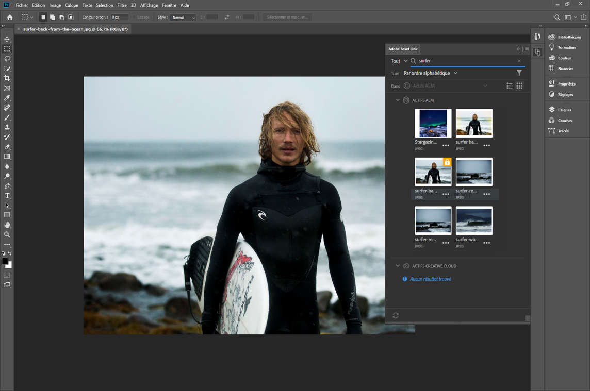
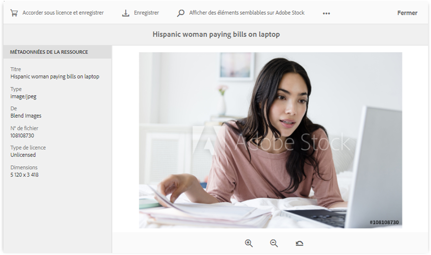
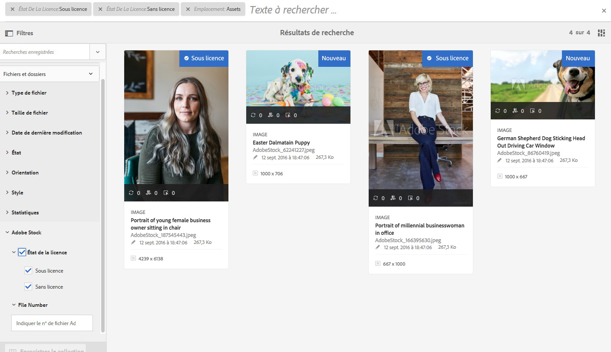
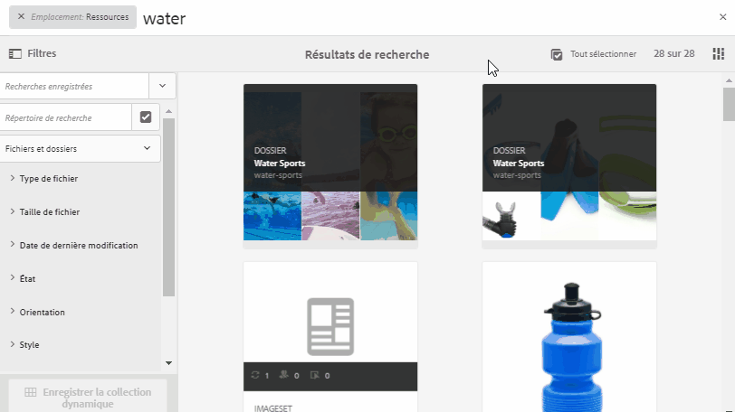

# [!DNL Adobe Experience Manager Assets] notes de mise à jour  {#aem-assets-release-notes}

Voici les principales fonctionnalités et les points forts de la version [!DNL Adobe Experience Manager] 6.5 [!DNL Assets].

## Intégration avec [!DNL Adobe Creative Cloud] et les workflows créatifs {#integration-with-adobe-creative-cloud-and-creative-workflows}

[!DNL Adobe Experience Manager] propose différentes manières de s’intégrer à et de partager des ressources à utiliser dans des workflows, où les équipes créatives et marketing ou les équipes d’entreprise collaborent étroitement.[!DNL Adobe Creative Cloud] [!DNL Experience Manager] 6.5 continue à améliorer l’intégration et à la rationaliser afin d’exposer davantage de possibilités et de rationaliser les méthodes existantes. 

Lisez la suite pour connaître les fonctionnalités et intégrations spécifiques de [!DNL Experience Manager] 6.5 que vous pouvez exploiter pour mieux prendre en charge vos cas d’utilisation de vitesse du contenu.

### Adobe Asset Link {#aal}

[!DNL Adobe Asset Link] renforce la collaboration entre les créatifs et les marketeurs dans le processus de création de contenu. Les créatifs peuvent accéder au contenu stocké dans [!DNL Experience Manager Assets], sans quitter les applications qui leur sont les plus familières. Les créatifs peuvent facilement parcourir, rechercher, extraire et archiver des ressources à l’aide du panneau intégré à l’application dans les applications [!DNL Adobe Photoshop], [!DNL Adobe Illustrator] et [!DNL Adobe InDesign].

[!DNL Adobe Asset Link] fait partie du  [Creative Cloud pour l’](https://www.adobe.com/creativecloud/business/enterprise.html) offre d’entreprise. Pour plus d’informations à ce sujet, y compris la configuration nécessaire de votre déploiement [!DNL Experience Manager], voir [Adobe Asset Link](https://helpx.adobe.com/fr/enterprise/using/adobe-asset-link.html).

### [!DNL Adobe Stock] integration {#stock}

Votre entreprise peut utiliser son formule d’abonnement pour entreprise [!DNL Adobe Stock] dans [!DNL Experience Manager Assets] pour s’assurer que les ressources sous licence sont largement disponibles pour vos projets de création et de marketing. Vous pouvez rapidement rechercher, prévisualiser et acquérir sous licence les ressources [!DNL Adobe Stock] qui sont enregistrées en Experience Manager, à l’aide des puissantes fonctionnalités de gestion des actifs numériques de [!DNL Experience Manager].

Le service [!DNL Adobe Stock] permet aux créateurs et aux entreprises d’accéder à des millions de photos, de vecteurs, d’illustrations, de vidéos, de modèles et de ressources 3D organisés, de haute qualité et libres de droits pour tous leurs projets de création. 

Pour plus d’informations, voir [Utilisation de ressources Adobe Stock dans Experience Manager Assets](/help/assets/aem-assets-adobe-stock.md).

*Figure : Prévisualisez  [!DNL Adobe Stock] l’image et la licence depuis  [!DNL Experience Manager Assets].*

*Figure : Recherchez et filtrez les  [!DNL Adobe Stock] images sous licence dans  [!DNL Experience Manager].*

### Références dynamiques dans [!DNL Adobe InDesign] {#dynamic-references-in-indesign}

[!DNL Experience Manager Assets] sont dynamiques dans  [!DNL Adobe InDesign] les fichiers. Les références sont automatiquement mises à jour si les ressources référencées se déplacent dans le référentiel. Pour plus d’informations, voir [Comment gérer les ressources composites](/help/assets/managing-linked-subassets.md).

## Fonctionnalités de Brand Portal {#brand-portal-capabilities}

[!DNL Experience Manager Assets Brand Portal] vous permet d’acquérir facilement, de contrôler efficacement et de distribuer en toute sécurité les ressources approuvées aux fournisseurs/agences externes et aux utilisateurs professionnels internes sur tous les appareils. Il contribue à améliorer l’efficacité du partage des ressources, accélère la mise sur le marché des ressources et élimine le risque d’utilisation non conforme et d’accès non autorisé.

Pour plus d’informations, consultez [Nouveautés de Brand Portal](https://experienceleague.adobe.com/docs/experience-manager-brand-portal/using/introduction/whats-new.html?lang=fr#introduction).

## Ressources connectées {#connectedassets}

Dans les grandes entreprises, l’infrastructure requise pour créer des sites web peut être distribuée. Parfois, les capacités de création de sites web et les ressources numériques requises résident dans différents silos.

[!DNL Experience Manager Sites] offre des fonctionnalités pour créer des pages web.  est le système de gestion des actifs numériques (DAM) qui fournit les ressources requises pour les sites web.[!DNL Experience Manager Assets] [!DNL Experience Manager] prend désormais en charge le cas d’utilisation ci-dessus en intégrant [!DNL Sites] et [!DNL Assets]. Voir [comment configurer et utiliser la fonctionnalité Ressources connectées](/help/assets/use-assets-across-connected-assets-instances.md).

![Faire glisser une ressource d’un  [!DNL Experience Manager] déploiement sur une  [!DNL Sites] page d’un  [!DNL Experience Manager] déploiement différent](assets/connected-assets-drag-and-drop-only.gif)

*Figure : Faites glisser une ressource d’un  [!DNL Experience Manager] déploiement sur une  [!DNL Sites] page sur un autre  [!DNL Experience Manager] déploiement.*

## Dynamic Media {#dynamic-media}

[!DNL Dynamic Media] fournit une création et une diffusion rich-media améliorées dans  [!DNL Experience Manager Assets] afin de générer des expériences de pointe immersives et personnalisées. En chargeant une seule ressource principale de haute qualité et en utilisant le rendu cloud avancé et les visionneuses, vous pouvez diffuser n’importe quelle combinaison de rendus à la volée pour prendre en charge la stratégie multimédia de votre entreprise.

Pour plus d’informations sur les nouvelles fonctionnalités [!DNL Dynamic Media], voir [Notes de mise à jour de Dynamic Media](https://experienceleague.adobe.com/docs/dynamic-media-developer-resources/release-notes/s7rn2017.html).

### Prise en charge de la vidéo 360 {#video-support}

Gérez vos fichiers vidéo 360 directement dans [!DNL Experience Manager] à l’aide des visionneuses de pointe pour diffuser des expériences VR sur les ordinateurs de bureau, les appareils mobiles et les casques VR. Pour plus d’informations, consultez [Utilisation de la vidéo 360°](/help/assets/360-video.md)

### Miniatures vidéo personnalisées {#custom-video-thumbnails}

Vous pouvez maintenant personnaliser les vignettes de vos ressources vidéo à l’aide d’images de la vidéo ou de tout autre contenu stocké dans DAM. Pour obtenir des instructions supplémentaires, consultez la section [Ȃ propos des vignettes vidéo](/help/assets/video.md#about-video-thumbnails-in-dynamic-media-scene-mode).

### Amélioration de l’accessibilité {#accessibility-enhancements}

[!DNL Dynamic Media] Les visionneuses prennent désormais en charge les fonctionnalités d’accessibilité améliorées telles que la prise en charge d’Aria, les lecteurs d’écran et le texte de remplacement. Pour plus de détails, consultez les [notes de mise à jour des visionneuses de Dynamic Media](https://experienceleague.adobe.com/docs/dynamic-media-developer-resources/library/home.html?lang=fr).

## Amélioration de l’expérience de recherche {#experience-enhancement-for-searching}

[!DNL Experience Manager] À compter de la version 6.5, les marketeurs pourront découvrir plus rapidement les ressources souhaitées à partir de la page des résultats de recherche. Les facettes de recherche sont mises à jour avec le nombre de ressources avant même d’appliquer le filtre de recherche. L’affichage du nombre attendu par rapport au filtre aide les utilisateurs à naviguer efficacement dans les résultats de la recherche. Pour plus d’informations, voir [Recherche de ressources dans Experience Manager](../assets/search-assets.md).

*Figure : Afficher le nombre de ressources sans filtrer les résultats de la recherche dans les facettes de recherche.*

## Amélioration de la convivialité {#usability-enhancement}

Vous pouvez désormais sélectionner toutes les ressources chargées dans un dossier ou à partir d’un résultat de recherche en une seule fois. Vous pouvez ainsi gérer plusieurs ressources rapidement. La case à cocher sélectionne toutes les ressources qui correspondent au scénario, par exemple un résultat de recherche, et pas seulement les ressources visibles dans l’interface [!DNL Experience Manager].

*Figure : Utilisez l’option Sélectionner tout pour sélectionner toutes les ressources chargées en un seul clic.*

## Améliorations des métadonnées {#metadata-enhancements}

[!DNL Assets] vous permet de créer des schémas de métadonnées pour des dossiers de ressources. Ces schémas définissent la disposition et les métadonnées affichées dans les pages de propriétés des dossiers. Vous pouvez désormais attribuer un schéma de métadonnées de dossier à un dossier existant ou lors de la création d’un dossier. Pour plus d’informations, consultez la section [Schéma de métadonnées de dossier](/help/assets/metadata-config.md#folder-metadata-schema).

Lors de la spécification des métadonnées en cascade, les options peuvent être chargées à partir d’un fichier JSON à l’exécution, au lieu de les saisir manuellement dans le formulaire. Pour plus d’informations, voir [métadonnées en cascade](/help/assets/metadata-schemas.md#cascading-metadata).

## Amélioration des rapports {#reporting-enhancements}

Les fragments de contenu et les partages de lien sont désormais inclus dans le rapport téléchargé. Pour plus d’informations, consultez la section [Rapports d’Assets](/help/assets/asset-reports.md).
