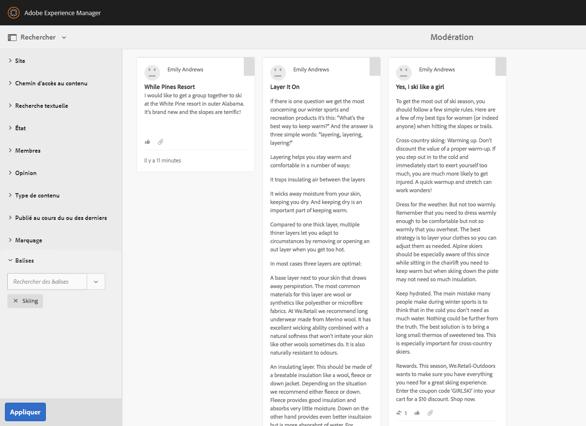
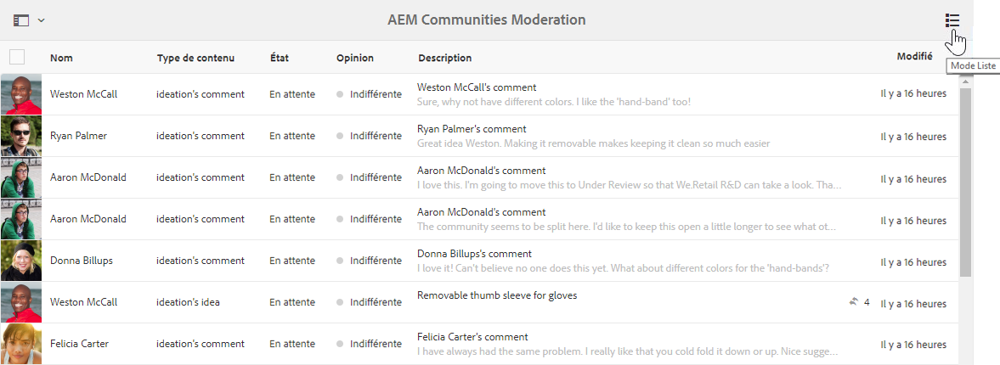
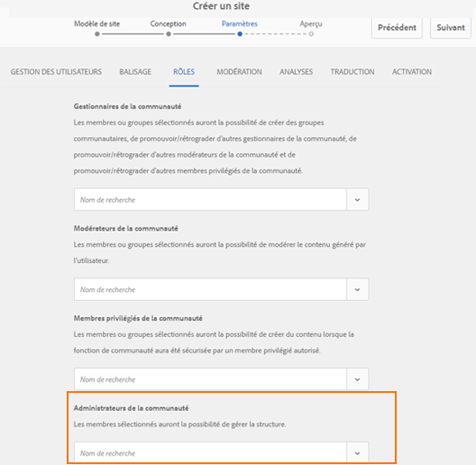

# AEM Communities notes de mise à jour {#aem-communities-release-notes}

Lisez ce qui suit pour connaître les améliorations d’AEM Communities depuis la version 6.4. Pour en savoir plus sur les nouvelles fonctionnalités, consultez le [Guide de l’utilisateur d’AEM Communities 6.5](https://helpx.adobe.com/fr/experience-manager/6-4/communities/user-guide.html).

Pour obtenir la version la plus récente, consultez la section [Déploiement de Communities de la documentation.](https://helpx.adobe.com/in/experience-manager/6-4/help/communities/deploy-communities.html#LatestReleases)

## Améliorations majeures {#major-enhancements}

### Améliorations de l’engagement communautaire {#enhancements-to-community-engagement}

**@Mentions**
supportLes communautés AEM permettent maintenant aux utilisateurs enregistrés de baliser (mentionner) d&#39;autres membres enregistrés pour attirer leur attention, dans le contenu généré par l&#39;utilisateur. Les membres balisés (mentionnés) sont ensuite notifiés, avec un lien profond vers le Contenu généré par l’utilisateur correspondant. Les utilisateurs peuvent toutefois choisir d’activer/de désactiver les notifications par e-mail et web.

Les utilisateurs de la communauté n’ont pas besoin de rechercher leur prénom, leur nom ou leur nom d’utilisateur pour voir si quelqu’un les a contactés ou requiert leur attention. De plus, les auteurs de CGU peuvent demander une réponse à des utilisateurs enregistrés spécifiques pouvant résoudre le problème et ajouter des entrées.

Les administrateurs de la communauté doivent **activer la mention** sur les composants de la communauté pour permettre aux utilisateurs enregistrés d&#39;utiliser la fonctionnalité sur ces composants.

**Messagerie de groupe** 

Les membres de la communauté enregistrés peuvent désormais envoyer des messages directs en masse aux groupes via un seul message e-mail, au lieu de renvoyer le même message à chaque membre du groupe. Pour autoriser [la messagerie de groupe](/help/communities/configure-messaging.md), activez les deux instances de [Messaging Operations Service](/help/communities/messaging.md#group-messaging).

### Améliorations apportées à la modération en bloc {#enhancements-to-bulk-moderation}

Filtres personnalisés dans la modération en bloc

[Les ](/help/communities/moderation.md#custom-filters) filtres personnalisés peuvent maintenant être développés et ajoutés à l’interface de modération en bloc.

Un [exemple de projet](https://github.com/Adobe-Marketing-Cloud/aem-communities-extensions/tree/master/aem-communities-moderation-filter) illustrant le filtrage par balises est disponible dans [Github](https://github.com/Adobe-Marketing-Cloud/aem-communities-extensions/tree/master/aem-communities-moderation-filter). Ce projet peut être utilisé comme base pour développer des filtres personnalisés analogues.

**Vue de liste en modération en bloc** 

Une nouvelle vue de liste avec une interface utilisateur améliorée a été fournie dans la modération en bloc afin d’afficher les entrées de contenu généré par l’utilisateur.

### Amélioration de la gestion des sites et des groupes {#enhancements-to-site-and-group-management}

**Administrateurs de sites côté Auteur et de groupes** 

Communities, à partir de la version AEM 6.5, permet une administration (et une gestion) décentralisée de différents sites et groupes/groupes imbriqués de communautés. Les organisations hébergeant plusieurs sites de communautés et groupes imbriqués peuvent désormais sélectionner des membres pour les rôles d’administrateur côté Auteur au moment de la création du site (et du groupe).

Les administrateurs de site peuvent créer un groupe à n’importe quel niveau de la hiérarchie et devenir les administrateurs par défaut. Ces administrateurs peuvent ensuite être supprimés par d’autres administrateurs de groupe. Les administrateurs de groupe peuvent gérer leur groupe G1 et créer un sous-groupe imbriqué sous G1.

### Améliorations de l’activation {#enhancements-to-enablement}

**Prise en charge de SCORM 2017.1** 

La fonctionnalité d’activation des communautés AEM 6.5 prend en charge le moteur de référence d’objet de contenu partagé [(SCORM) 2017.1](https://rusticisoftware.com/blog/scorm-engine-2017-released/).

* Prise en charge de la navigation par clavier sur les composants d’activation
* Les composants d’activation (par exemple, Lecture de catalogue et de cours, Affectations, Bibliothèque de fichiers) dans AEM Communities prennent en charge la navigation clavier pour une meilleure accessibilité.

### Autres améliorations {#other-enhancements}

* Prise en charge de Solr 7
* AEM 6.5 Communities prend en charge la version Apache Solr 7.0 de la plate-forme de recherche lors de la configuration de MSRP et DSRP.
