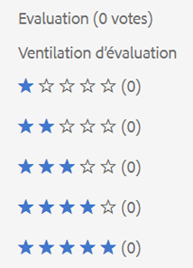

# Nouveautés de Adobe Experience Manager 6.5 Service Pack 6 {#aem-whats-new-service-pack-6}

Les Service Packs Adobe Experience Manager 6.5 offrent de nouvelles fonctionnalités, des améliorations demandées par les clients, ainsi que des améliorations des performances, de la stabilité et de la sécurité à tous les trimestres. La disponibilité trimestrielle facilite l&#39;accès et l&#39;adoption de nouvelles fonctionnalités et innovations.

Cet article présente les fonctionnalités incluses dans le dernier Service Pack 6.5, les fonctionnalités [clés incluses dans les Service Packs](#key-features-previous-service-packs)6.5 précédents et certaines des versions [clés depuis la version 6.5.5.0](#key-releases-since-last-sp) du Experience Manager.

## Sites d&#39;Adobe [!DNL Experience Manager] {#aem-sites}

### Disponibilité de l’opération de déplacement de page en mode asynchrone {#page-move-asynchronous}

L’opération de déplacement de page est désormais disponible en mode asynchrone. Outre l’exécution immédiate, vous pouvez également planifier l’opération Déplacement de page pour une exécution ultérieure.

## [!DNL Dynamic Media] {#dynamic-media}

### Invalider le contenu mis en cache du CDN {#invalidate-cdn-cached-content}

Vous pouvez désormais utiliser l’interface utilisateur pour[!DNL  Dynamic Media] invalider le contenu mis en cache du réseau de Diffusion de contenu (CDN). Par conséquent, les ressources mises à jour sont disponibles instantanément au lieu d’attendre l’expiration du cache. Vous pouvez invalider le CDN en procédant comme suit :

* Création d’un modèle d’invalidation CDN : Sélection de fichiers et d’URL associées à des modèles de formulaire

* Sélection de fichiers et de paramètres prédéfinis associés par le biais du sélecteur de fichiers

* ajouter des URL de fichier complètes

### Publication sélective d’actifs vers [!DNL Experience Manager] et [!DNL Dynamic Media] {#selective-publishing}

Vous pouvez désormais choisir de publier ou d’annuler la publication de fichiers sur [!DNL Experience Manager] ou [!DNL Dynamic Media] à l’aide de l’assistant Publication  rapide ou [!UICONTROL Gérer la publication] . Vous pouvez également définir le mode `Publish` ou `Unpublish` le mode au niveau du dossier.

## [!DNL Adobe Experience Manager Assets] {#aem-assets}

### Amélioration de l’accessibilité {#accessibility-assets-6560}

* **Amélioration de la mise au point de l’interface utilisateur lors de la navigation** au clavier, par exemple en mettant l’accent sur :

   * `x` dans la boîte de dialogue Prévisualisation [!UICONTROL de] version d’une ressource dans le [!UICONTROL journal].

   * Options d’interface utilisateur utilisables.

   * Champ Courriel de la boîte de dialogue [!UICONTROL Partager le lien] et champ permettant d’ajouter un groupe d’utilisateurs fermé dans l’onglet [!UICONTROL Autorisation] de [!UICONTROL Propriétés]du dossier.

* **Fonctionnalité améliorée à l’aide des touches du clavier**

   Les utilisateurs peuvent utiliser les touches du clavier pour faire glisser des commandes dans l’éditeur de Schémas de métadonnées en mode de navigation du lecteur d’écran.

* **Amélioration de l’utilisation des lecteurs** d’écran en raison des éléments suivants :

   * Les lecteurs d’écran annoncent l’objectif des lecteurs vidéo et audio.

   * Les lecteurs d’écran annoncent l’objectif des options de l’interface utilisateur pour supprimer les balises sélectionnées à l’aide de la boîte de dialogue [!UICONTROL de sélection] Balises sur les [!UICONTROL propriétés]du fichier.

   * Les lecteurs d’écran annoncent les en-têtes de ligne et les éléments de ligne des tableaux afin que les utilisateurs sachent quelles entrées appartiennent à la même ligne.

   * Titre de page significatif et descriptif de la page de recherche.

   * Les lecteurs d’écran annoncent les options du panneau de filtre de recherche sous forme d’accordéons extensibles.

### Autres améliorations des ressources {#other-enhancements-assets-6560}

* Les groupes d’utilisateurs de dossiers privés sont maintenant supprimés du référentiel lors de la suppression de dossiers privés. La suppression d’un dossier privé nettoie le référentiel des groupes d’utilisateurs orphelins, qui sont créés chaque fois qu’un dossier privé est créé.

## [!DNL Adobe Experience Manager Forms] {#aem-forms}

### Préremplir un formulaire adaptatif au niveau du client {#prefill-merge-data-at-client}

Lorsque vous préremplissez un formulaire adaptatif, le [!DNL Experience Manager Forms] serveur fusionne les données avec un formulaire adaptatif et vous transmet le formulaire rempli. Par défaut, l’action de fusion des données a lieu sur le serveur.
Vous pouvez désormais configurer le [!DNL Experience Manager Forms] serveur pour qu’il effectue l’action de fusion des données sur le client plutôt que sur le serveur. Il réduit considérablement le temps nécessaire pour préremplir et générer les formulaires adaptatifs.

### Intégration du modèle de données de formulaire avec les API RESTful sur un serveur avec une implémentation SSL bidirectionnelle {#fdm-integration-rest-apis-two-way-ssl}

[!DNL Experience Manager Forms] Le modèle de données de formulaire peut désormais s’intégrer aux API RESTful sur un serveur sur lequel un protocole SSL bidirectionnel est implémenté.

### Prise en charge Ajoutée des [!DNL Adobe Sign] balises de texte dans le service de conversion automatisée de Forms {#sign-integration-acroform-afcs}

Si un AcroForm inclut des [!DNL Adobe Sign] balises de texte, ces champs sont maintenant reconnus et représentés comme [!DNL Adobe Sign] champs dans le formulaire adaptatif converti à l’aide de [!DNL Automated Forms Conversion service]. Un signataire peut remplir ces champs lors de la signature du formulaire adaptatif.

### Prise en charge de la conversion de PDF forms colorés en formulaires adaptatifs {#colore-PDF-forms}

Vous pouvez utiliser [!DNL Automated Forms Conversion service] pour convertir des PDF forms colorés en formulaires adaptatifs.

### Prise en charge des protocoles SMB 2 et SMB 3 {#smb-support}

[!DNL Experience Manager Forms] prend désormais en charge les protocoles SMB 2 et SMB 3.

### Mise en cache améliorée pour les pages de formulaires adaptatifs converties {#enhanced-caching-translated-adaptive-forms}

Vous pouvez désormais spécifier des paramètres régionaux en tant que sélecteur plutôt qu’en tant qu’argument URL. Il permet de mettre en cache les formulaires adaptatifs convertis sur [!DNL Experience Manager Dispatcher].

### Enregistrer la sortie du service de modèle de données de formulaire dans une variable {#save-fdm-service-to-variable}

Le modèle de données de formulaire vous permet d’enregistrer la sortie d’un service de modèle de données de formulaire dans une variable. [!DNL Experience Manager Forms] mappe désormais automatiquement le type du service de modèle de données de formulaire au type de variable.

### Joindre plusieurs fichiers pour le composant Pièce jointe {#attach-multiple-files}

Vous pouvez désormais joindre plusieurs fichiers au composant de pièce jointe  de formulaires adaptatifs.

## Principales fonctionnalités des Service Packs version 6.5 du Experience Manager précédent {#key-features-previous-service-packs}

### Experience Manager Sites {#aem-sites-previous-service-packs}

#### Améliorations de l&#39;accessibilité (6.5.5.0) {#accessibility-sites}

* Rapports d&#39;erreur amélioré en ajoutant des informations sur le texte.

* Amélioration de la mise au point de l’interface utilisateur lors de la navigation au clavier.

* Amélioration du rapport de contraste pour divers éléments de l’interface utilisateur.

* Amélioration de la cohérence des attributs de remplacement pour les images de page.

* Amélioration de la cohérence des étiquettes des applications Internet enrichies accessibles (ARIA).

* Amélioration des fonctionnalités NVDA (Non Visual Desktop Access).

* Prise en charge du lecteur d’écran améliorée.

#### Autres améliorations clés (6.5.5.0) {#other-enhancements-sites}

* L&#39;accès anonyme au CRXDE Lite n&#39;est pas autorisé pour améliorer la sécurité. Les utilisateurs sont redirigés vers l’écran de connexion. See [Developing with CRXDE Lite](/help/sites-developing/developing-with-crxde-lite.md).

* Lors de la copie ou du collage d’une arborescence de page, vous avez désormais la possibilité de coller la page racine ou de coller la page racine avec les sous-pages de l’arborescence.

* [!DNL Adobe Experience Manager Experience Fragments] L’exportation vers [!DNL Adobe Target] les espaces de travail s’affiche désormais sous la forme de types d’offre uniques et de sources d’offre dans [!DNL Target].

* Gestionnaire de sites multiples : le déclencheur de publication supprime désormais un composant de la page publiée si un composant est supprimé de la page source.

* Gestionnaire de sites multiples : lorsque le nom d&#39;un composant local d&#39;une [!UICONTROL Live Copy] est identique au nom d&#39;un composant du plan et que le composant est déployé à partir du plan, le terme `_msm_moved` est maintenant ajouté au nom du composant local.

#### Améliorations du système de style (6.5.4.0) {#style-system-enhancements}

Vous pouvez désormais sélectionner des styles dans la boîte de dialogue du composant à l’aide du système de style amélioré.

#### Amélioration des performances dans divers domaines (6.5.4.0) {#performance-improvements}

* Réduction du temps de chargement et d’initialisation de ContextHub dans un site (`contexthub.kernel.js`). Le chargement des pages s’en trouve accéléré lors d’une visite du site.

* Réduction du temps d’actualisation d’une page après le glissement [!DNL Experience Fragments] vers [!DNL Sites] l’éditeur de page.

* Réduction du temps de chargement des entrées sur une [!DNL Sites] page avec plus de 200 copies dynamiques dans l’aperçu **[!UICONTROL de la]** Live Copy.

* Amélioration de la gestion des URL incomplètes ou non valides. De telles URL peuvent ralentir l’éditeur de modèles.

### [!DNL Adobe Experience Manager Assets] {#aem-assets-previous-service-packs}

#### Améliorations de l’accessibilité dans [!DNL Assets] (6.5.5.0) {#assets-accessibility}

[!DNL Experience Manager Assets] est désormais plus accessible en conformité avec les Web Content Accessibility Guidelines (WCAG). L’accessibilité a été améliorée en raison des améliorations suivantes :

* De nombreux éléments, commandes, pages et boîtes de dialogue de l’interface utilisateur sont compatibles avec le lecteur d’écran.

* De nombreux éléments, contrôles et champs de formulaire d’entrée de l’interface utilisateur sont accessibles à l’aide du clavier.

* La couleur et le contraste de certains éléments de l’interface utilisateur ont été mis à jour afin que les utilisateurs disposant d’une vision limitée ou qui ne perçoivent pas les couleurs puissent distinguer ces éléments de l’interface utilisateur. For example, the color of star rating icons (such as in [!UICONTROL Rating] section of [!UICONTROL Advanced] tab in asset [!UICONTROL Properties] or in card view) is changed for appropriate contrast.

   

#### Amélioration de la gestion des exceptions (6.5.5.0) {#exception-handling}

[!DNL Assets] le flux de l’interface utilisateur a une meilleure gestion des exceptions. Si un fichier n’a pas de type pour sa dimension, l’exception observée est enregistrée dans les fichiers journaux.

#### Prise en charge des ressources 3D dans [!DNL Dynamic Media] (6.5.5.0) {#support-for-3d}

La prise en charge des images 3D dans [!DNL Dynamic Media] permet aux clients de publier et d&#39;ajouter du contenu 3D aux pages Web et aux applications. Le soutien inclut :

* Publiez des formats de fichier 3D courants et générez une URL de fichier qui peut être utilisée dans des pages Web et d’autres applications.

* Lecteur Web 3D optimisé par [!DNL Adobe Dimension]le lecteur pour vue interactive des ressources 3D publiées.

* Publiez et vue des ressources 3D courantes sur [!DNL Experience Manager Sites] les pages à l’aide du composant [!DNL Sites] WCM.

#### Configurer [!DNL Experience Manager Assets] avec [!DNL Brand Portal] (6.5.4.0) {#configure-assets-bp}

Le canal d&#39;autorisation entre [!DNL Experience Manager Assets] et [!DNL Brand Portal] est modifié. Earlier, [!DNL Brand Portal] was configured in Classic UI via Legacy OAuth Gateway, which uses the JWT token exchange to obtain an IMS Access token for authorization. [!DNL Experience Manager Assets] est maintenant configuré avec les E/S [!DNL Brand Portal] par Adobe, qui obtiennent un jeton IMS pour l&#39;autorisation de votre [!DNL Brand Portal] locataire.

The steps to configure [!DNL Experience Manager Assets] with [!DNL Brand Portal] are different depending on your [!DNL Experience Manager] version, and whether you are configuring for the first time, or upgrading the existing configurations. See [Configure Experience Manager Assets with Brand Portal](https://docs.adobe.com/content/help/fr-FR/experience-manager-brand-portal/using/publish/configure-aem-assets-with-brand-portal.html) for details.

#### Accessibility enhancements (6.5.4.0) {#accessibility-enhancements}

[!DNL Experience Manager Assets] comprend les améliorations d’accessibilité suivantes :

* Les touches fléchées du clavier permettent de déplacer et de faire défiler des zones dans les images agrandies. Pour plus d’informations, voir Fichiers de [prévisualisation utilisant uniquement](../assets/managing-assets-touch-ui.md#previewing-assets)les touches du clavier.

* Les cases à cocher d’état mixte (dans lesquelles, à moins que vous ne sélectionniez tous les prédicats imbriqués, les cases de premier niveau ne sont pas sélectionnées et sont enfoncées) dans le panneau Filtres sont lisibles par les lecteurs d’écran.

* Les contraintes de format de date et d’heure sont fournies dans les libellés de champs des champs de date, afin de permettre aux utilisateurs de saisir la date dans le format correct à l’aide du clavier.
Par exemple, `On Time (MM-DD-YYYY HH:mm)`. Ici MM est le mois en format à deux chiffres, AAAA est l&#39;année, JJ est le jour en format à deux chiffres, HH est l&#39;heure en format militaire à 24 heures et mm est la minute.

* Les lecteurs d’écran annoncent maintenant le `X` symbole pour supprimer les balises sélectionnées ainsi que le nombre de balises sélectionnées.

#### Recherche visuelle pour [!DNL Adobe Experience Manager Assets] (6.5.2.0) {#visual-search}

[!DNL Assets] les utilisateurs peuvent rechercher des images visuellement similaires. Le Experience Manager affiche les images balisées intelligentes du référentiel DAM qui sont similaires à une image sélectionnée par l’utilisateur. See [Visual search](../assets/search-assets.md).

### Dynamic Media {#dynamic-media-previous-service-packs}

#### Smart Imaging for Dynamic Media {#smart-imaging}

L’imagerie intelligente utilise les caractéristiques d’affichage uniques de chaque utilisateur pour fournir automatiquement les images appropriées optimisées pour leur expérience, ce qui se traduit par de meilleures performances et un meilleur engagement. L’imagerie dynamique fonctionne avec vos paramètres d’image prédéfinis et utilise des informations à la dernière milliseconde de la diffusion pour réduire davantage encore la taille du fichier d’image en fonction de la vitesse de connexion du réseau et du navigateur. Voir [Smart Imaging](../assets/imaging-faq.md).

#### Recadrage intelligent dans les profils vidéo pour les médias dynamiques (6.5.3.0) {#smart-crop-video}

Le recadrage intelligent pour la vidéo (une fonctionnalité en option dans les profils vidéo) est un outil qui utilise la puissance de l’intelligence artificielle d’Adobe Sensei pour détecter et rogner automatiquement le point focal dans toute vidéo adaptative ou progressive que vous avez chargée, quelle que soit sa taille. See [About using smart crop in video profiles](../assets/video-profiles.md).

### Experience Manager Forms {#aem-forms-previous-service-packs}

#### Personnaliser les colonnes de la boîte de réception Adobe Experience Manager (6.5.5.0){#customize-aem-inbox-columns}

Vous pouvez personnaliser une [!DNL Experience Manager] boîte de réception pour modifier le titre par défaut d&#39;une colonne, réorganiser la position d&#39;une colonne et afficher d&#39;autres colonnes en fonction des données d&#39;un flux de travail. Les membres de `administrators` ou `workflow-administrators` de groupe peuvent personnaliser les colonnes. Pour plus d’informations, voir Contrôle d’administration.

#### Enregistrer les communications interactives en tant que brouillon (6.5.5.0) {#save-as-draft}

Vous pouvez utiliser l’interface utilisateur de l’agent pour enregistrer un ou plusieurs brouillons pour chaque communication interactive et récupérer le brouillon ultérieurement pour continuer à travailler dessus. Vous pouvez spécifier un nom différent pour chaque brouillon afin de l’identifier. Pour plus d’informations, voir [Enregistrer les communications interactives en tant que brouillon](../forms/using/prepare-send-interactive-communication.md#save-as-draft).

#### [!DNL Oracle WebLogic] prise en charge du serveur d’applications (6.5.5.0) {#weblogic-support}

adobe experience manager forms a ajouté la prise en charge de [!DNL Oracle WebLogic 12] Adobe Experience Manager Forms on JEE. Vous pouvez effectuer une mise à niveau à partir d’une version précédente ou configurer un nouveau serveur Forms on JEE Experience Manager 6.5 sur [!DNL Oracle WebLogic] 12.2.1.4 et versions ultérieures. Plus tard correspond aux changements mineurs de version, où x dans 12.2.1.x est remplacé par un numéro de version.

#### Améliorations de l&#39;accessibilité (6.5.5.0) {#accessibility-improvements}

adobe experience manager forms comprend les améliorations d’accessibilité suivantes :

* Lorsqu’un utilisateur prévisualisation un formulaire adaptatif sous la forme d’un formulaire HTML, le champ Signature  tactile conserve la cible d’action de l’onglet.

* Les messages d’erreur affichés lors de l’envoi d’un formulaire adaptatif contiennent désormais l’ `aria-describedBy` attribut. L’attribut est attaché aux champs référencés dans le message d’erreur. L’ `aria-describedby` attribut indique les identifiants des éléments qui décrivent l’objet. Il permet d’établir une relation entre les widgets ou les groupes et le texte qui les décrit.

* Si un formulaire adaptatif comporte certains champs obligatoires, l’attribut obligatoire est défini sur `True` pour ces champs dans le schéma d’accessibilité ARIA.

#### Authentification par certificat X-509 pour les services Web SOAP dans le modèle de données de formulaire (6.5.5.0) {#x509-based-authentication-soap}

Le modèle de données de formulaire prend désormais en charge l’authentification par certificat X-509 lors de l’utilisation des services Web SOAP en tant que source de données. Pour plus d’informations, voir [Configuration des services](../forms/using/configure-data-sources.md#configure-soap-web-services)Web SOAP.

#### Autres améliorations clés (6.5.5.0) {#other-improvements}

* Experience Manager 6.5 Forms on JEE Document Security est désormais basé sur [!DNL Apache Struts 2].

* Prise en charge Ajoutée pour [!DNL Oracle Real Applications Cluster (RAC) 19c].

#### Générer une sortie imprimable dans les workflows Forms Experience Manager (6.5.4.0) {#generate-printable-output}

L’étape de flux de travail Générer une sortie imprimable vous permet d’intégrer un fichier de modèle source à un fichier de données. Cette intégration vous permet d’imprimer ou d’enregistrer différentes copies du fichier de modèle. L’étape génère une sortie PCL, PostScript, ZPL, IPL, TPCL ou DPL. Pour plus d’informations sur cette fonctionnalité, voir Processus [Forms sur OSGi - Guide de référence](../forms/using/aem-forms-workflow-step-reference.md)des étapes.

#### Prise en charge de plusieurs colonnes pour les formulaires adaptatifs et les communications interactives en mode Mise en page (6.5.4.0) {#multi-column-adaptive-forms}

Vous pouvez désormais définir le nombre de colonnes pour un panneau dans les formulaires adaptatifs et les communications interactives. Passez en mode de mise en page pour utiliser la nouvelle option multi-colonne. Pour plus d’informations, voir [Utilisation du mode Mise en page pour redimensionner des composants](../forms/using/resize-using-layout-mode.md).

#### Personnalisations de la boîte de réception Experience Manager (6.5.4.0) {#aem-inbox}

La nouvelle option de contrôle d’administration permet aux administrateurs d’effectuer les opérations suivantes :

* Personnalisez le texte et le logo de l’en-tête.

* Permet de contrôler l’affichage des liens de navigation disponibles dans l’en-tête.

L’option Contrôle d’administration n’est visible que pour les membres du `administrators` groupe ou `workflow-administrators` du groupe. Pour plus d’informations sur cette fonctionnalité, voir [Votre boîte de réception](../sites-authoring/inbox.md).

#### Prise en charge du texte enrichi dans les formulaires HTML5 (6.5.4.0) {#rich-text-support}

Convertissez un champ de texte d’un formulaire XFA en champ de texte enrichi dans un formulaire HTML5. Pour plus d’informations, voir [Conception de modèles de formulaire pour les formulaires](../forms/using/designing-form-template.md)HTML5.

#### Accessibility enhancements (6.5.4.0) {#forms-accessibility-enhancements-6540}

Experience Manager Forms inclut les améliorations d’accessibilité suivantes :

* Les lecteurs d’écran annoncent correctement les cases à cocher, les liens, le sélecteur de date et les champs de saisie de date dans un formulaire adaptatif.

* Chaque page d’un formulaire adaptatif comprend désormais un titre et une étiquette de repère principale.

#### Partager et demander l’accès aux éléments de boîte de réception d’un utilisateur Forms Experience Manager (6.5.3.0) {#share-request-access}

Vous pouvez partager vos éléments de boîte de réception avec un autre utilisateur. Une fois qu&#39;un autre utilisateur a accès à vos éléments de boîte de réception, il peut demander et prendre les mesures appropriées sur les éléments partagés. De même, vous pouvez demander l’accès aux éléments de boîte de réception à d’autres utilisateurs. Voir [Partage et demande d’accès aux éléments de boîte de réception d’un utilisateur](../forms/using/configure-shared-queues-osgi.md).

#### Configuration des paramètres d’absence du bureau pour les éléments de boîte de réception d’un utilisateur Forms Experience Manager (6.5.3.0) {#configure-out-of-office}

Si vous prévoyez d’être absent du bureau, vous pouvez indiquer ce qui se passe pour les éléments qui vous sont affectés pour cette période.
Vous pouvez spécifier une date et une heure de début, ainsi qu’une date et une heure de fin, pour l’application de vos paramètres d’absence du bureau. Vous pouvez définir une personne par défaut à laquelle tous vos éléments sont envoyés. Voir [Configuration des paramètres](../forms/using/configure-out-of-office-settings.md)d’absence du bureau.

#### Générer plusieurs communications interactives à l’aide de l’API Batch pour le Forms Experience Manager (6.5.3.0) {#generate-multiple-ic}

Vous pouvez utiliser l’API de traitement par lots pour produire plusieurs communications interactives à partir d’un modèle. Le modèle est une communication interactive sans données. L’API de traitement par lots combine les données avec un modèle pour produire une communication interactive. L&#39;API est utile pour la production de masse de communications interactives. Par exemple, factures de téléphone, relevés de carte de crédit pour plusieurs clients. Voir [Générer plusieurs communications interactives à l’aide de l’API](../forms/using/generate-multiple-interactive-communication-using-batch-api.md)de traitement par lot.

## Principales versions depuis Adobe Experience Manager 6.5 SP5 {#key-releases-since-last-sp}

Entre le 04 juin 2020 et le 03 septembre 2020, Adobe a publié ce qui suit, en plus des Service Packs et des Fix Packs cumulatifs :

* [Le portail](https://experience.adobe.com/#/downloads/content/software-distribution/en/aem.html) de distribution de logiciels permet de télécharger des Service Packs Experience Manager, des packs de correctifs cumulatifs, des correctifs logiciels et des packs de fonctionnalités.

* [!DNL Adobe Experience Manager as a cloud service] [2020.7.0](https://docs.adobe.com/content/help/en/experience-manager-cloud-service/release-notes/release-notes/release-notes-2020-7-0.html) et [2020.8.0](https://docs.adobe.com/content/help/en/experience-manager-cloud-service/release-notes/release-notes/release-notes-current.html).

* [application de bureau Experience Manager 2.0 (2.0.3.2)](https://docs.adobe.com/content/help/en/experience-manager-desktop-app/using/release-notes.html).

* [experience manager screens : Feature Pack 202008](https://docs.adobe.com/content/help/en/experience-manager-screens/user-guide/release-notes/release-notes-fp-202008.html)

>[!MORELIKETHIS]
>
>* [Documentation de Adobe Experience Manager 6.5](../user-guide/home.md)
>* [Notes de mise à jour générales pour Adobe Experience Manager 6.5](release-notes.md)
>* [Notes de mise à jour du Service Pack pour Adobe Experience Manager 6.5](sp-release-notes.md)

