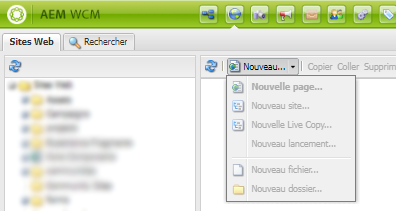

# Correctifs et Feature Packs inclus dans les Service Packs précédents {#hotfixes-and-feature-packs-included-in-previous-service-packs}

## [!DNL Adobe Experience Manager] 6.5.7.0  {#experience-manager-6570}

[!DNL Adobe Experience Manager] La version 6.5.7.0 est une mise à jour importante qui contient de nouvelles fonctionnalités, des améliorations des demandes client clés et des améliorations de performances, de stabilité et de sécurité, publiées depuis la version 6.5 d’avril 2019. Le Service Pack est installé sur [!DNL Adobe Experience Manager] 6.5.

Les fonctionnalités et améliorations clés introduites dans la version [!DNL Adobe Experience Manager] 6.5.7.0 incluent :

* L’exécution des déplacements de page et des déploiements MSM sous la forme d’opérations asynchrones afin de réduire leur impact sur les performances d’exécution.

* Les utilisateurs peuvent trier les ressources numériques en mode Carte et Colonnes.

* [!DNL Assets] et  [!DNL Dynamic Media] fournissent plusieurs améliorations de l’accessibilité. Les améliorations ont été apportées à la navigation au clavier, à l’utilisation des lecteurs d’écran et à la possibilité pour les utilisateurs d’utiliser une technologie d’assistance similaire (AT). Voir [[!DNL Assets] améliorations](#assets-6570) et [[!DNL Dynamic Media] améliorations](#dynamic-media-6570).

* [Configuration du client HTTP du modèle de données de formulaire ](../../help/forms/using/configure-data-sources.md#fdm-http-client-configuration) pour optimiser les performances.

* [Disponibilité de l’option de réinitialisation pour chaque ](../../help/forms/using/resize-using-layout-mode.md#resize-components) composant en mode Disposition

* [!DNL Experience Manager] 6.5 Service Pack 7 Forms améliore les performances pour :

   * Validation des valeurs de champ sur le serveur lorsque vous envoyez un formulaire adaptatif.

   * Conversion d’un formulaire PDF en formulaire adaptatif à l’aide de [!DNL Automated Forms Conversion service].

* Prise en charge de [!DNL Microsoft SQL Server] 2019 dans [!DNL Experience Manager Forms].

* Prise en charge de [!DNL Microsoft] groupes de disponibilité Toujours active SQL Server 2016 pour une haute disponibilité pour les déploiements OSGi.

* Le référentiel intégré (Apache Jackrabbit Oak) a été mis à niveau vers la version 1.22.5.

Pour obtenir la liste complète des fonctionnalités et améliorations introduites dans [!DNL Experience Manager] 6.5.7.0, voir [Nouveautés de [!DNL Adobe Experience Manager] 6.5 Service Pack 7](new-features-latest-service-pack.md).

Voici la liste des correctifs fournis dans la version [!DNL Experience Manager] 6.5.7.0.

### [!DNL Sites] {#sites-6570}

* Lorsque vous ouvrez l’option [!UICONTROL Timewrap] pour une page, laissez ouverte l’option de rail latéral Chronologie et accédez à la console [!UICONTROL Sites], l’erreur `Failed to Load` se produit (NPR-34951).

* L’option [!UICONTROL Timewrap] n’affiche pas d’images pour la période et l’heure sélectionnées (NPR-34951).

* Lorsqu’un filtre appelle `getHeader()` à partir d’une page contenant un fragment de contenu, l’erreur `java.lang.AbstractMethodError` se produit (NPR-34942).

* Lorsque le chemin d’accès d’une page contient plusieurs sous-chaînes de contenu, le rendu des aperçus échoue et la fonction de comparaison de version échoue également (NPR-34740).

* Lorsque vous définissez une valeur numérique pour la propriété de libellé de type `String` d’un composant, vous pouvez supprimer le composant et annuler l’opération de suppression. Cependant, après avoir annulé la suppression, la propriété label passe de `String` à `Long` (NPR-34739).

* L’exception suivante se produit lors de l’ajout d’un fragment d’expérience basé sur un modèle avec une disposition verrouillée sur une page (NPR-34632) :

   ```TXT
   org.apache.sling.api.SlingException: Cannot get DefaultSlingScript: org.apache.sling.api.SlingException: Cannot get DefaultSlingScript: org.mozilla.javascript.EcmaError: TypeError: Cannot call method "getChildren" of null
   ```

* Lorsque vous déplacez un dossier, des problèmes de traversée se produisent et l’erreur suivante se produit (NPR-34554) :

   ```TXT
   org.apache.sling.api.SlingException: Cannot get DefaultSlingScript. org.apache.jackrabbit.oak.query.RuntimeNodeTraversalException: The query read or traversed more than 100000 nodes. To avoid affecting other tasks, processing was stopped
   ```

* Lorsque de nouvelles ressources sont créées, publiées et déplacées vers un nouvel emplacement, le workflow `Request to complete move operation` est créé et l’état Abandon est obtenu. Le téléchargement d’une nouvelle ressource et l’exécution d’une opération `move` entraînent la création du workflow `Request to complete move operation` en état d’attente (NPR-34543).

* Lorsque vous exportez un fragment d’expérience de l’environnement [!DNL Experience Manager] 6.5.2 vers la norme [!DNL Target], l’appel API échoue, car la propriété de l’espace de travail n’est pas disponible pour la norme [!DNL Target] (NPR-34557).

* Les utilisateurs ne peuvent pas publier de pages via l’option [!UICONTROL gérer la publication] car l’option [!UICONTROL Publier] disparaît (NPR-34542).

* Lorsque vous ajoutez des styles au texte, une balise `<div>` est ajoutée au texte, et le style ne peut plus être appliqué au texte (NPR-34531).

* Lorsque vous sélectionnez un élément dans un menu contextuel et mettez à jour les fichiers requis, cela n’autorise pas l’enregistrement des valeurs de boîte de dialogue, car l’autre menu comporte un champ obligatoire vide (NPR-34529).

* Lorsque vous créez une page à partir d’un modèle personnalisé et que vous la déplacez dans la hiérarchie de plan directeur, les composants supprimés plus tôt dans la page commencent à s’afficher sur la page dans la hiérarchie de Live Copy (NPR-34527).

* Une fois qu’un style d’article est appliqué à un contenu, il ne peut pas être supprimé (NPR-34486).

* Toutes les Live Copies et copies d’un fragment d’expérience pointent vers le même ID d’offre [!DNL Adobe Target] (NPR-34469).

* Les éléments de liste à puces s’affichent en plus de la liste numérotée (NPR-34455).

* L’option comparer à la source ne permet pas d’afficher la différence entre la page source et la version modifiée d’une page (NPR-34285).

* Lorsque vous supprimez une page, les détails de contrôle de version ne sont pas configurables (NPR-34159).

* Lorsqu’un utilisateur sélectionne l’option de boîte de dialogue [!UICONTROL Ouvrir la sélection], la sélection au clavier se déplace vers le contrôle masqué présent sur la page (CQ-4307779, CQ-4293601).

* Lorsque vous déplacez un dossier publié sur l’auteur, les chemins d’accès aux dossiers ne sont pas mis à jour en conséquence sur l’instance de publication (CQ-4305144).

* Lorsqu’un utilisateur clique sur la touche `Enter` de l’option [!UICONTROL Sélectionner tout], la sélection au clavier ne passe pas à l’option [!UICONTROL Créer un contrôle] (CQ-4293599).

* Lorsque vous sélectionnez la clé `Esc`, le focus n’est pas restauré au contrôle parent (CQ-4293593, CQ-4293590).

* Amélioration de la conformité WCAG pour l’interface utilisateur [!DNL Sites] et les composants principaux (CQ-4293448).

*  Les fonctions de zoom et   de mise à l’échelle sont désactivées pour la  [!DNL Sites Editor] page (CQ-4282353).

* Après avoir utilisé l’option Rotation à droite , le lecteur d’écran cesse de narrer la rotation ou l’état de rotation actuel (CQ-4282128).

* Les boutons Terminé et Annuler la configuration de la boîte de dialogue comportent plusieurs taquets de tabulation (CQ-4274601).

* Le déplacement de pages portant un nom similaire au même niveau n’est pas autorisé (NPR-35041).

* Après avoir sélectionné l’option Effacer (x), la sélection au clavier ne passe pas au champ [!UICONTROL Filtre] (CQ-4293581).

* Lorsque vous effectuez une mise à niveau vers [!DNL Experience Manager] 6.5.6.0, le comportement du système de paragraphes hérité change et ne fonctionne pas correctement (NPR-35117).

* Les utilisateurs du clavier ne peuvent pas changer la mise au point de l’onglet dans l’ordre approprié après avoir sélectionné la section [!UICONTROL Action] sur une page [!DNL AEM Sites] (CQ-4307786).

* Après avoir sélectionné une option dans la liste de menu cible des liens de la barre d’outils de l’éditeur de texte enrichi lors de la modification d’un fragment de contenu, la boîte de dialogue de création de fragment de contenu commence à scintiller (CQ-4305532).

* Les utilisateurs du clavier ne peuvent pas sélectionner les options de la liste déroulante [!UICONTROL Ajouter un composant] à l’aide de la touche Flèche vers le bas (CQ-4295097).

* La sélection de l’onglet n’est pas décalée dans l’ordre approprié lors de la sélection d’une date dans le menu Calendrier de l’onglet [!UICONTROL Ressources] d’une page [!DNL Sites] (CQ-4293600).

* La sélection de l’onglet ne passe pas aux options suivantes ou précédentes pour les utilisateurs du clavier après la suppression des options Lien ou Texte disponibles lors de la modification d’une page Sites (CQ-4293597).

* Les utilisateurs du clavier ne peuvent pas revenir aux options Plus dans la section [!UICONTROL Actions] après avoir affiché les options disponibles et appuyé sur la touche `Esc` (CQ-4293592).

* Lorsque vous activez l’option [!UICONTROL Rotation] d’une image en mode [!UICONTROL Modifier], la sélection de l’onglet, au lieu de rester sur Rotation, passe à l’option [!UICONTROL Rétablir] pour les utilisateurs du clavier (CQ-4293587).

* Dans la boîte de dialogue [!UICONTROL Ouvrir la sélection] disponible dans l’onglet [!UICONTROL Lien et Actions], la sélection de l’onglet passe aux éléments masqués dans la page après l’option [!UICONTROL Annuler] (CQ-4293579).

* Lorsque les utilisateurs du clavier modifient une image, accédez à l’option [!UICONTROL Terminer] et appuyez sur la touche Entrée, les lecteurs d’écran n’annoncent pas la fin (CQ-4282351).

* Les options Déplacer vers le haut et Déplacer vers le bas disponibles dans la boîte de dialogue [!UICONTROL Lien et Actions] ne sont pas disponibles pour le lecteur d’écran et les utilisateurs de clavier (CQ-4281120).

* Les utilisateurs du clavier ne peuvent pas restaurer la sélection de l’onglet après avoir accédé à l’option Fermer (X) sur la page [!UICONTROL Propriétés] (CQ-4293581, NPR-34653).

### [!DNL Assets] {#assets-6570}

[!DNL Adobe Experience Manager] La version 6.5.7.0  [!DNL Assets] corrige les problèmes suivants et apporte les améliorations suivantes.

* Les améliorations suivantes ont été apportées à l’accessibilité d’[!DNL Experience Manager Assets] grâce à cette version. Pour plus d’informations, voir [Fonctionnalités d’accessibilité d’ [!DNL Assets]](/help/assets/accessibility.md).

   * Lors de la navigation dans la chronologie à l’aide du clavier, la touche `Esc` peut réduire l’option [!UICONTROL Tout afficher] sans perdre la cible d’action (CQ-4293598).
   * Lorsque vous naviguez à l’aide de la touche de tabulation du clavier, après avoir supprimé la dernière balise des balises ajoutées, le champ de balise conserve la cible d’action (NPR-35109).
   * [!DNL Experience Manager] Les composants contiennent désormais les informations appropriées pour le nom, le rôle et la valeur à utiliser par les lecteurs d’écran (NPR-34255).
   * Après avoir supprimé la zone combinée Type/Taille, la zone combinée Lier, la zone combinée Langue ou la zone de modification Texte, la sélection au clavier revient aux éléments suivants ou aux éléments précédents de l’interface utilisateur ou à un élément d’interface utilisateur plus pertinent (CQ-4293585).
   * Lorsque vous placez le pointeur de la souris sur des options, des conseils concernant par exemple les fonctions Sélectionner et Télécharger s’affichent. Il est possible que les utilisateurs de la loupe ne voient pas les miniatures des fichiers en raison de ces conseils. Il est désormais possible de conserver la sélection après avoir supprimé l’option à l’aide de la touche `Escape`. (CQ-4293554).
   * Lors de la sélection d’une cellule de grille à partir de la grille présente dans la page, la sélection se déplace vers la barre d’actions qui s’affiche à l’écran (CQ-4282127).
   * Les utilisateurs visuels peuvent différencier le texte normal d’un lien, car des indices visuels (icône de soulignement et de chevron) s’affichent pour les liens vers toutes les solutions dans la [!DNL Experience Manager] page d’accueil (CQ-4282072).

* L’amélioration de l’expérience utilisateur suivante est apportée dans [!DNL Assets] :

   * Activez le tri des ressources en mode Carte et Colonnes (NPR-35097).

* Après la mise à niveau vers la version 6.5, si un fichier JSON est généré à l’aide de l’API HTTP Assets, le codage utilisé dans le fichier est problématique (NPR-35129).

* Les utilisateurs d’un groupe qui n’est pas autorisé à créer des collections (l’option Créer une collection n’est pas disponible) peuvent toujours créer des collections en accédant directement à l’URL `https://[aem_server]:[port]/mnt/overlay/dam/gui/content/collections/createcollectionwizard.html/content/dam/collections?contentPath=/content/dam/collections` (NPR-35115).

* Lorsqu’elles sont triées par nom, les ressources recherchées sont triées selon la casse. Cela crée deux listes triées distinctes en fonction de la casse qui apparaît de manière ordonnée dans les résultats de recherche (NPR-35068).

* Lorsqu’un fragment de contenu est ouvert dans l’éditeur, les messages d’avertissement (`Invalid value specified for a metadata property`) sont consignés dans les journaux d’erreur (NPR-35012).

* Les utilisateurs ne disposant pas de droits d’administrateur peuvent modifier des ressources expirées à l’aide de l’appli de bureau [Experience Manager]. (NPR-34993).

* Lorsque la même ressource est glissée-déposée sur l’interface utilisateur d’Assets et qu’une nouvelle version est créée, les modifications apportées aux métadonnées ne sont pas persistantes (NPR-34940).

* Lors de la modification de collections, un utilisateur peut supprimer le titre de la collection et enregistrer les modifications avec succès (NPR-34889).

* Lorsque vous téléchargez une image en double, une option de suppression s’affiche. La sélection de la suppression permet de télécharger les images. Le workflow Ressource de mise à jour de gestion des actifs numériques est également déclenché (NPR-34744).

* Lors de l’utilisation de [!DNL Adobe Asset Link] avec [!DNL Adobe InDesign], les résultats de recherche ne contiennent pas de dossiers et de collections, mais uniquement des ressources (NPR-34699, CQ-4303666).

* Le survol du pointeur en mode Carte permet de faire défiler l’écran suite à la mise au point (automatique) des actions rapides disponibles dans la carte (NPR-34514).

* Lors de la modification des propriétés de plusieurs ressources en bloc, la sélection de l’option [!UICONTROL Enregistrer] ferme la vue de l’éditeur en bloc et redirige vers la page [!DNL Assets] principale. Ce comportement est identique à celui de l’option [!UICONTROL Enregistrer et fermer] et n’est pas attendu (NPR-34546).

* La collection dynamique ne présente pas le paramètre d’interface utilisateur correct après l’enregistrement. La requête est enregistrée correctement, mais l’interface affiche toujours le dernier prédicat Option ajouté (NPR-34539).

* Lors de l’ajout de ressources à [!DNL Experience Manager], les métadonnées sans espace de noms ne sont pas importées (NPR-34530).

* Lorsque vous faites glisser une ressource sur un dossier pour la déplacer, l’interface utilisateur affiche également l’option [!UICONTROL Déposer dans Lightbox] et [!UICONTROL Déposer dans la collection]. Même si l’opération de déplacement est annulée, l’interface utilisateur continue d’afficher les deux dernières options (NPR-34526).

* Le symbole `%>` s’affiche sur la page des collections (NPR-34499).

* En mode Colonne, [!DNL Assets] affiche des noms de dossiers et de ressources en double lors d’un défilement vers le haut ou vers le bas avant l’affichage de toutes les ressources (NPR-34464).

* Si vous créez un dossier privé immédiatement après la création d’un dossier public, ce dernier utilise les paramètres du dossier privé (NPR-34415).

* En mode Carte, les cartes ne sont pas répertoriées dans l’ordre alphabétique et les cartes ne peuvent pas être triées par ordre alphabétique (NPR-34234).

* Lors de la réouverture de règles en cascade, les choix ne sont pas conservés dans l’interface utilisateur (CQ-4301452).

#### [!DNL Dynamic Media] {#dynamic-media-6570}

* Les améliorations suivantes ont été apportées à l’accessibilité dans [!DNL Dynamic Media] (CQ-4290306). Pour plus d’informations, voir [Fonctionnalités d’accessibilité dans [!DNL Dynamic Media]](/help/assets/accessibility-dm.md).

   * Les lecteurs d’écran (JAWS, Narrateur) indiquent le nom, le rôle et l’état des éléments de menu dans l’option de menu Taille d’incorporation (CQ-4290927).
   * Les utilisateurs peuvent naviguer dans la boîte de dialogue Lien d’email à l’aide de la clé `Tab` (CQ-4290926).
   * Le processus de création de profils de codage vidéo est plus convivial, vu l’amélioration du lecteur d’écran (CQ-4290623, CQ-4290622).
   * Lors de la navigation à l’aide de la touche `Tab`, la sélection se déplace vers les éléments d’interface utilisateur appropriés dans le workflow pour créer une vidéo interactive (CQ-4290621, CQ-4290620, CQ-4290619).
   * Les pages Publier, Modifier ressource, Modifier les recadrages intelligents et Éditeur de visionneuse d’images ont été améliorées pour répondre aux références standard du web. Les utilisateurs de la technologie d’assistance (AT) peuvent désormais naviguer facilement sur ces pages et prendre des mesures telles que le recadrage d’images (CQ-4290617, CQ-4290616, CQ-4290613, CQ-4290612, CQ-4290610, CQ-4290614).
   * Les visionneuses sont améliorées pour permettre aux utilisateurs de naviguer à l’aide du clavier (CQ-4290615).
   * Les utilisateurs du clavier et du lecteur d’écran peuvent utiliser la fonctionnalité de recadrage (CQ-4290609).
   * Les utilisateurs du clavier peuvent mieux gérer les zones réactives (CQ-4290604, CQ-4290603).

* Les jeux d’images distants ne sont pas modifiables dans [!DNL Experience Manager] si le nom de la société et le nom du dossier sont identiques (NPR-31340).

* L’ordre d’index z est incorrect lorsque vous essayez de prévisualiser la sortie après l’ajout d’une zone réactive à une image [!DNL Dynamic Media] ou après la modification d’une vidéo [!DNL Dynamic Media] ou d’une [!DNL Experience Fragment] avec une image (CQ-4307267).

* [!DNL Dynamic Media] la synchronisation échoue lorsque les visionneuses de médias mixtes sont retraitées (CQ-4307184).

* Si une ressource est déplacée vers un dossier sur lequel la synchronisation automatique vers [!DNL Dynamic Media] est configurée, la ressource ne se synchronise pas (CQ-4307122).

* [!DNL Dynamic Media] La vidéo n’est pas lue sur les appareils iOS avec les commandes vidéo HTML5 natives (CQ-4306977, CQ-4306727).

* Impossible de télécharger les images sur lesquelles le recadrage intelligent est appliqué (CQ-4304558).

* Impossible de publier sélectivement des dossiers sur Dynamic Media (CQ-4304526).

* L’annulation de la publication d’un fichier vidéo à partir de [!DNL Experience Manager] n’annule pas la publication de la visionneuse de vidéos adaptative à partir d’un déploiement Scene7 configuré (CQ-4304405).

* L’ajout d’une ressource d’image panoramique dans un composant de média panoramique et l’actualisation de la page génèrent une erreur `Uncaught ReferenceError: $ is not defined` (CQ-4302810).

* Dans l’ [!UICONTROL éditeur de paramètres prédéfinis de la visionneuse], lors de la modification du paramètre prédéfini [!UICONTROL Image panoramique/Image panoramique_VR], dans le composant `PanoramicView`, l’étiquette de modificateur `PANORAMICVIEW_AUTOROTATE` n’est pas disponible (CQ-4302443).

* Les sous-titres de vidéo ne s’affichent pas si la vidéo n’est pas la première dans un visionneuse de supports variés (CQ-4298161).

* La visionneuse de catalogue électronique HTML5 sur les appareils mobiles iPhone ne peut pas tourner les pages ou retourner les pages (CQ-4296611).

* Lors du défilement d’échantillons sur un appareil mobile, les échantillons défilent vers la droite et hors de la zone visible pendant quelques secondes avant de faire défiler à nouveau la vue (CQ-4296439).

* Lorsqu’un enregistrement de Principal de paramètre prédéfini de visionneuse est créé, le CSS et l’illustration ne sont pas publiés et seul le paramètre prédéfini de visionneuse est publié (CQ-4262205).

* Lorsque vous tentez de lier un fragment d’expérience pour une zone réactive donnée dans le composant [!UICONTROL Vidéo/Images interactives], le chemin d’accès au fragment d’expérience sélectionné n’est pas affiché. Il renvoie plutôt une valeur vide du champ de chemin (NPR-35146, CQ-4298136).

* Impossible d’afficher l’aperçu d’un fragment d’expérience dans IVV Editor (CQ-4308560).

* Lors de l’ajout d’une zone réactive à une image et de la sélection d’un fragment d’expérience, il n’est pas possible de sélectionner les sous-dossiers et les variantes du fragment d’expérience (CQ-4307455).

* Les ressources autres que les images ne s’affichent pas comme publiées après le chargement (CQ-4306415).

#### [!DNL Experience Manager] Ressources 3D  {#three-d-assets-6570}

* `DAM CQ MIME Type` Le service applique des types MIME incorrects aux ressources 3D générant un rendu incorrect (NPR-34731).

### [!DNL Commerce] {#commerce-6570}

* L’interface utilisateur de la collection de produits Commerce ne répertorie pas plus de 15 produits au sein d’une collection (NPR-34502).

### Plate-forme {#platform-6570}

* Une session HTTP via HTTPS n’est pas invalidée (NPR-35083).
* Une valeur `NullPointerException` est renvoyée lors du démarrage de tâches de maintenance quotidiennes ou hebdomadaires à partir de l’interface utilisateur (NPR-34953).
* Le validateur W3C signale des avertissements pour les fichiers JavaScript de bibliothèque cliente compatibles (NPR-34898).
* La fonction `AudienceOmniSearchHandler` utilise un index obsolète (NPR-34870).
* La déconnexion de Experience Manager n’efface pas les cookies (NPR-34743).
* La fonction `findByTitle` de l’API `TagManager` ne fonctionne pas si le nom de la balise contient un caractère spécial (NPR-34357).
* Le processus d’importation du package de synchronisation des utilisateurs échoue (NPR-34399).
* Ajout de la prise en charge des propriétés `ariaLabel` et `ariaLabelledby` au composant `Coral.Masonry` (GRANITE-29962).
* Le cache de Dispatcher n’est pas actualisé pour les pages contenant des fragments de contenu après l’installation des derniers packages de composants principaux (CQ-4306788).
* Les noms de balises localisés avec des guillemets (`"`) ne s’affichent pas correctement dans l’interface utilisateur (CQ-4305439).

### Interface utilisateur {#ui-6570}

* Le champ [!UICONTROL Lien vers] dans les propriétés du composant affiche des suggestions de saisie semi-automatique qui ne correspondent pas à la chaîne spécifiée (NPR-34865).

* AEM affiche le message d’erreur suivant lorsque vous planifiez une période de maintenance quotidienne distribuée entre 2 jours (NPR-35280) :

   ```TXT
   ERROR The start time must precede (be less than) the end time
   ```

### Intégrations {#integrations-6570}

* La modification d’une configuration [!DNL Adobe Launch] existante échoue (NPR-35045).
* Impossible d’exporter [!DNL Experience Fragments] vers [!DNL Adobe Target] si vous utilisez la configuration IMS et l’environnement [!DNL Adobe Target Standard] (NPR-34555).
* L’option [!UICONTROL Créer] apparaît sur la page [!UICONTROL Audiences] lors de la navigation d’un dossier vers la page [!UICONTROL Audiences] (NPR-35151).

### Sling {#sling-6570}

* Le contrôle d’intégrité de la connexion par défaut valide les informations d’identification d’un utilisateur qui n’existe pas (NPR-34686).

### Projets de traduction {#translation-6570}

* Lors de l’annulation d’un projet de traduction dans [!DNL Experience Manager], la demande d’annulation n’est pas envoyée au fournisseur de traduction (NPR-34433).

### [!DNL Communities] {#communities-6570}

* Tous les cas de terminologie inéquitable du produit sont remplacés par des équivalents acceptés (NPR-34311).
* [!DNL Google+] est supprimé de la liste des options de partage sur les réseaux sociaux (NPR-33877).

### [!DNL Brand Portal] {#brandportal-6570}

* L’interface utilisateur ne répond pas lors de la sélection des ressources dans la [!UICONTROL vue Liste] (NPR-34728).

### [!DNL Forms] {#forms-6570}

>[!NOTE]
>
>[!DNL Experience Manager Forms] publie les packages de modules complémentaires une semaine après la date de publication prévue du Service Pack [!DNL Experience Manager].

>[!NOTE]
>
>[!DNL Experience Manager] Le Service Pack n’inclut pas de correctifs pour  [!DNL Forms]. Ils sont livrés à l’aide d’un module complémentaire [!DNL Forms] distinct. En outre, un programme d’installation cumulatif est publié, qui comprend des correctifs pour [!DNL Experience Manager Forms] on JEE. Pour plus d’informations, voir [Installation du module complémentaire AEM Forms](#install-aem-forms-add-on-package) et [Installation d’AEM Forms on JEE](#install-aem-forms-jee-installer).

**Formulaires adaptatifs**

* Impossible de modifier un formulaire adaptatif à l’aide de l’interface utilisateur classique après avoir appliqué [!DNL Experience Manager] Service Pack 6 (NPR-35126).

* Lorsque vous convertissez un PDF en formulaire adaptatif, vous ne pouvez pas définir de valeur pour un panneau imbriqué à l’aide d’un modèle de données de formulaire sur la mise en page à onglets. En outre, il existe des problèmes lors de la définition dynamique d’une valeur pour les groupes de boutons radio avec un tableau statique à l’aide de l’éditeur de code (NPR-35062).

* Lorsque vous saisissez des caractères japonais dans un composant de champ de texte dans un formulaire adaptatif, vous pouvez spécifier plus de caractères que la limite maximale de 35 caractères (NPR-35039).

* Le formulaire adaptatif affiche des paramètres indésirables, tels que `owner` et `status`, sur la page **[!UICONTROL Remerciements]** affichée après l’envoi du formulaire (NPR-34989).

* La boîte de dialogue [!UICONTROL Sélection de fichier] pour le composant [!UICONTROL Pièce jointe] affiche également les types de fichiers non pris en charge pour la sélection, ce qui entraîne une erreur lors de l’envoi du formulaire adaptatif (NPR-34970).

* Lorsque vous insérez un formulaire adaptatif dans une page [!DNL Experience Manager Sites] contenant du texte avant le formulaire, le curseur se déplace directement vers le formulaire au lieu du texte avant le formulaire (NPR-34947).

* [!UICONTROL L’option Aperçu avec ] données pour préremplir un formulaire adaptatif à l’aide d’un fichier XML de données  [!DNL Experience Manager] 6.2 ne fonctionne pas correctement (NPR-35087).

* Lorsque vous mettez à jour le dictionnaire de données d’un formulaire adaptatif, le formulaire n’est pas traduit, car le formulaire adaptatif renvoie des valeurs mises en cache (NPR-34845).

* Le chargement des fragments prend plus de temps dans un formulaire adaptatif en raison de l’invalidation du cache (NPR-34567).

* La navigation par onglets ne fonctionne pas correctement pour les lecteurs d’écran d’un formulaire adaptatif (NPR-34544).

**Correspondence Management**

* Impossible d’enregistrer les valeurs des balises XML avec des données numériques, qui incluent le type flottant, en tant que brouillon (NPR-35050).

* Lorsque vous migrez les ressources à partir d’ES3, les ressources incluent deux conditions par défaut non modifiables (NPR-34972).

* Lorsque vous modifiez un dictionnaire de données dans une lettre, la section [!UICONTROL Contenu prêté] affiche des rectangles en rotation au lieu d’informations utiles (NPR-34853).

**Communication interactive**

* Le nom de configuration du déploiement pour la communication interactive, disponible après l’installation du module complémentaire [!DNL Forms], duplique le nom de configuration du déploiement standard (NPR-34976).

**Document Security**

* Lorsque vous enregistrez une nouvelle stratégie Document Security, Experience Manager Forms affiche le message d’erreur `Relative validity period is required` (NPR-34679).

* Document Security n’est pas en mesure de protéger le document PDF 2.0 (CQ-4305851).

Pour plus d’informations sur les mises à jour de sécurité, voir la [page Bulletins de sécurité des Experience Manager](https://helpx.adobe.com/security/products/experience-manager.html).

## [!DNL Adobe Experience Manager] 6.5.6.0  {#experience-manager-6560}

Adobe Experience Manager 6.5.6.0 est une mise à jour importante qui inclut de nouvelles fonctionnalités, des améliorations demandées par les clients clés, ainsi que des améliorations des performances, de la stabilité et de la sécurité, publiées depuis la mise à disposition de la version 6.5 en **avril 2019**. Il peut être installé sur Adobe Experience Manager 6.5.

Les principales fonctionnalités et améliorations introduites dans Adobe Experience Manager 6.5.6.0 sont les suivantes :

* Publiez ou annulez sélectivement des ressources sur [!DNL Experience Manager] ou [!DNL Dynamic Media] à l’aide de l’assistant [!UICONTROL Publication rapide] ou [!UICONTROL Gérer la publication] .

* Utilisez l’interface utilisateur [!DNL Dynamic Media] pour invalider le contenu mis en cache du réseau de diffusion de contenu (CDN).

* La publication des dossiers de contribution des ressources de Brand Portal vers Experience Manager Assets est désormais prise en charge par le biais d’un serveur proxy.

* Les groupes de dossiers privés générés automatiquement sont désormais nettoyés lors de la suppression du dossier privé dans [!DNL Experience Manager Assets].

* Les descriptions des modificateurs dans l’éditeur de paramètres prédéfinis de la [!UICONTROL visionneuse] vidéo ont été mises à jour dans [!DNL Dynamic Media].

* Un nouveau paramètre d’entreprise est fourni pour refléter l’état du connecteur [!DNL Dynamic Media].

* Les options par défaut pour `test` et `aiprocess` sont mises à jour vers `Thumbnail`, à partir de `Rasterize` précédemment dans Dynamic Media, afin de garantir que les utilisateurs doivent créer uniquement des miniatures et ignorer l’extraction de page et l’extraction de mots-clés.

* [Préremplir un formulaire adaptatif au niveau du client](../../help/forms/using/prepopulate-adaptive-form-fields.md#prefill-at-client).

* [Intégration du modèle de données de formulaire avec les API RESTful sur un serveur avec une implémentation](../../help/forms/using/configure-data-sources.md) SSL bidirectionnelle.

* [Amélioration de la mise en cache des pages de formulaires adaptatifs traduites](../../help/forms/using/configure-adaptive-forms-cache.md).

* Prise en charge des [balises de texte Adobe Sign dans Automated forms conversion Service](https://docs.adobe.com/content/help/en/aem-forms-automated-conversion-service/using/convert-existing-forms-to-adaptive-forms.html).

* Prise en charge de la [conversion des formulaires colorés en formulaires adaptatifs](https://docs.adobe.com/content/help/en/aem-forms-automated-conversion-service/using/convert-existing-forms-to-adaptive-forms.html) à l’aide de [!DNL Automated Forms Conversion service].

* Prise en charge des protocoles SMB 2 et SMB 3.

* Le référentiel intégré (Apache Jackrabbit Oak) a été mis à niveau vers la version 1.22.4.

Pour obtenir la liste complète des fonctionnalités et améliorations introduites dans Experience Manager 6.5.6.0, voir [Nouveautés d’Adobe Experience Manager 6.5 Service Pack 6](new-features-latest-service-pack.md).

Voici la liste des correctifs fournis dans la version [!DNL Experience Manager] 6.5.6.0.

### [!DNL Sites] {#sites-6560}

* Dans [!DNL Sites] ou [!DNL Screens], sélectionnez un projet et cliquez sur [!UICONTROL Gestion Publications]. Les utilisateurs ne peuvent pas avancer dans l’assistant [!UICONTROL Gérer la publication] en raison d’erreurs de l’interface utilisateur. Plus précisément, l’option [!UICONTROL Publier] ne fonctionne pas (NPR-34099).
* La position d’iParsys (système de paragraphes hérité) n’est pas rétablie à sa position par défaut d’origine après avoir désélectionné les options [!UICONTROL Annuler l’héritage] ou [!UICONTROL Désactiver l’héritage] (NPR-34097).
* Si `RolloutConfigManagerFactoryImpl` ne parvient pas à charger une configuration de déploiement, il ne tente pas de charger les configurations manquantes. Elle renvoie les configurations mises en cache (NPR-34092).
* Dans le composant principal Texte, après avoir utilisé l’option d’édition HTML source, la classe de la balise `em` est supprimée (NPR-34081).
* Après la mise à niveau de Experience Manager 6.3.3 vers Experience Manager 6.5.3, le processus de déploiement prend beaucoup plus de temps et le déploiement échoue avec une erreur de délai d’expiration (NPR-34049).
* `htmlwriter` ne récode pas les valeurs d’attribut. Les balises présentes dans le balisage XF sont exportées avec des valeurs d’attribut décodées (à savoir `"` au lieu de `&#34`). Cela entraîne des problèmes du côté Target avec le compositeur d’expérience visuelle qui utilise le fichier XF exporté (NPR-34048).
* Lors du déplacement de pages dans [!DNL Experience Manager Sites], augmentez la journalisation afin de capturer l’échec de création de version avec raison (NPR-34014).
* Dans [!DNL Rich Text Editor] si tout le texte est supprimé, la balise de paragraphe est également supprimée (NPR-33976).
* Lorsque la page `siteadmin` (dans l’IU classique) est ouverte ou actualisée, les options du menu `New` sont désactivées (NPR-33949).

   

* Un [!DNL Content Fragment] ne peut pas être utilisé comme `TemplatedResource`, car il échoue dans `ContentFragmentUsePojo` (NPR-33911).
* Les opérations de déplacement synchrones et asynchrones peuvent entraîner des erreurs en raison de transferts simultanés. Les opérations de déplacement de page sont limitées au déplacement asynchrone uniquement. Elle empêche le déplacement simultané des pages (NPR-33875).
* [!UICONTROL L’opération Gérer la ] publication pour répliquer le contenu de l’instance d’auteur vers l’instance de publication échoue et génère une erreur JavaScript (NPR-33872).
* Lorsque plusieurs pages ou ressources sont sélectionnées pour créer des versions, la nouvelle version est créée uniquement pour la dernière page ou ressource sélectionnée (NPR-33866).
* Déplacez une page de plan directeur avec des Live Copies vers un autre dossier. Lors du déplacement vers le dossier d’origine, l’opération de déplacement échoue sans erreur (NPR-33864).
* Lorsque l’action de déplacement est utilisée pour renommer une page web dans la console [!DNL Sites], elle affiche deux boîtes de dialogue qui se chevauchent à la dernière étape de l’assistant (NPR-33831).

   

* Les propriétés `cq:acLinks` et `cq:acUUID` de [!DNL Adobe Campaign] de la copie sont supprimées lors de l’opération de copier-coller (NPR-33794).
* Lors de la tentative de déploiement sur une page enfant d’une Live Copy parent détachée, [!DNL Experience Manager] génère une exception de pointeur null (NPR-33676).
* Les composants [!DNL RTE] d’un conteneur de mises en page ne sont pas visibles lorsque le conteneur de mises en page est à nouveau copié et collé sur la page. Les composants [!DNL RTE] ne sont pas modifiables, mais s’affichent lors d’une actualisation de page (NPR-33662).
* Lors du redimensionnement d’un composant de mise en page pour différents points d’arrêt (moyens et grands), la mise en page ne se comporte pas comme prévu (NPR-33608).
* En mode de modification en ligne dans [!DNL RTE], le fait de faire glisser une image ne fonctionne pas pour le composant Texte (NPR-33602).
* Il est possible de créer un composant dans une page de plan directeur portant le même nom que le nom de la page. Lors du déploiement, `_msm_moved` est suffixé pour renommer le composant. Le composant est déplacé à la fin du [!UICONTROL système de paragraphes] (NPR-33535).
* Lorsque offTime ou onTime est défini sur de nombreuses pages ou ressources, il consomme beaucoup de ressources et ralentit le système au démarrage et à l’arrêt (NPR-33482).
* Un utilisateur disposant d’autorisations CRUD sur `/content/experience-fragment` ne peut pas supprimer un dossier (NPR-33436).
* Vous pouvez sélectionner [!UICONTROL HTML et JSON] comme option pour le [!UICONTROL format d’exportation Adobe Target] sur un dossier parent dans la section [!DNL Experience Fragments]. Les mêmes propriétés s’affichent dans l’IU tactile pour les sous-dossiers de ce dossier parent. Cependant, dans CRXDE, pour `cq:adobeTargetExportFormat`, il affiche uniquement du code HTML au lieu d’afficher `html,json` (NPR-33423).
* La publication ou l’annulation de la publication à partir d’un alias de page n’est pas prise en charge. Supprimez l&#39;option qui semble prétendre le contraire (NPR-33415).
* Une balise spécifique peut être déplacée d’un emplacement à un autre dans [!DNL Experience Manager]. Elle peut également être appliquée à différentes pages avant et après le déplacement. Lors de la modification des propriétés des pages, la balise ne s’affiche pas pour modification, même si la balise est identique (NPR-33353).
* Un modèle de page ne s’affiche pas correctement lorsqu’un conteneur de mises en page est supprimé d’un modèle contenant plusieurs conteneurs de mises en page (NPR-33347).
* Dans l’éditeur de modèles, essayez de supprimer un modèle utilisé par plus de 100000 pages sous `/content/`. Une erreur s’affiche sans message d’erreur (NPR-33312).
* La redirection vers la page [!DNL Experience Manager] avec ancre ne fonctionne pas sur l’instance d’auteur, car `PageRedirectServlets` place la chaîne de requête après un fragment d’URL ou une ancre (NPR-34288).
* La création d’une marque sous `/content/campaign` donne une structure qui ne permet pas de créer des campagnes. [!UICONTROL L’option Créer une ] marque ne permet pas à la marque nouvellement créée de créer des  [!UICONTROL offres et ] des activités, car il n’existe aucune option de   création (NPR-34113).
* Vous pouvez suspendre la balise [!DNL Live Copy] d’une page et l’héritage est rompu en mode Éditeur. Dans les propriétés de la page, l’icône représentant l’héritage indique incorrectement que l’héritage existe et n’est pas rompu (NPR-34017).
* Les pages comportant de nombreuses références ne peuvent pas être déplacées de manière asynchrone et parfois l’opération de déplacement échoue (CQ-4297969).
* Une page web avec le caractère `/` dans l’URL ne répond plus lors de la création. Lorsqu’un composant est ajouté lors de la création, l’utilisation du processeur augmente et le navigateur cesse de répondre (CQ-4295749).
* En mode de navigation, NVDA ne décrit pas une valeur sélectionnée dans l’option de menu Type/Taille . La sélection visuelle ne porte pas sur l’élément sélectionné. Les utilisateurs qui utilisent un lecteur d’écran ne peuvent pas utiliser le mode de navigation (CQ-4294993).
* Lors de la création d’une page web, les utilisateurs peuvent sélectionner le modèle [!UICONTROL Page de contenu] . Dans l’onglet [!UICONTROL Média social] , les utilisateurs sélectionnent une [!UICONTROL variation XF préférée]. Pour sélectionner un fragment d’expérience en mode de navigation NVDA, les utilisateurs ne peuvent pas utiliser les touches du clavier (CQ-4292669).
* Mise à jour de la bibliothèque handlebars vers la version 4.7.3 plus sécurisée (NPR-34484).
* Plusieurs instances de script intersite dans des composants [!DNL Experience Manager Sites] (NPR-33925).
* Le champ du nom du dossier lors de la création d’un dossier est vulnérable aux scripts intersites stockés (GRANITE-30094).
* Les résultats de recherche sur la page[!UICONTROL  Bienvenue] et le modèle d’achèvement du chemin sont vulnérables aux scripts intersites (NPR-33719, NPR-33718).
* La création d’une propriété binaire sur un noeud non structuré génère un script intersite sur la boîte de dialogue de propriété binaire (NPR-33717).
* Script intersite lors de l’utilisation de l’option [!UICONTROL Test de contrôle d’accès] dans l’interface CRX DE (NPR-33716).
* Les entrées utilisateur ne sont pas codées correctement pour divers composants lors de l’envoi d’informations au client (NPR-33695).
* Script intersite en mode Calendrier pour la boîte de réception du Experience Manager (NPR-33545).
* Une URL qui se termine par `childrenlist.html` affiche une page HTML au lieu d’une réponse 404. Ces URL sont vulnérables aux scripts intersites (NPR-33441).


### [!DNL Assets] {#assets-6560}

**Améliorations de l’accessibilité dans Experience Manager Assets**

* Grâce aux touches du clavier, les utilisateurs peuvent désormais accéder aux options de l’interface utilisateur interactive dans la liste [!UICONTROL Références] des ressources (NPR-34115) et se concentrer sur ces options.

* Le lecteur d’écran annonce maintenant l’action prévue des prédicats sur la page de recherche (NPR-34104).

* La page de recherche et la page de résultats de recherche ont désormais des titres plus informatifs pour mieux comprendre les utilisateurs de lecteurs d’écran (NPR-34093).

* Les lecteurs d’écran indiquent maintenant les options de suppression des balises sélectionnées dans l’onglet [!UICONTROL Simple] de la page [!UICONTROL Propriétés] de la ressource (NPR-33972).

* Les éléments de chaque ligne en mode Liste sont désormais annoncés comme éléments de la même ligne par les lecteurs d’écran (NPR-33932).

* La sélection de l’utilisateur lors de la navigation à l’aide de la touche `Tab` passe désormais à l’option de fermeture dans l’aperçu de version (NPR-33863).

* La sélection de l’utilisateur se déplace désormais vers l’icône de recherche une fois Omni-recherche fermé (NPR-33705).

* Les options exploitables de l’interface utilisateur ont désormais une mise au point visuelle plus nette avec un contraste amélioré lors de la navigation à l’aide des touches du clavier. Les utilisateurs du clavier peuvent identifier les zones ciblées (NPR-33542).

* La fonctionnalité de glisser à l’aide du clavier fonctionne désormais dans [!UICONTROL l’éditeur de schéma de métadonnées] en mode de navigation du lecteur d’écran (CQ-4296326).

* Dans la boîte de dialogue de partage de liens, lorsque vous naviguez en mode de navigation, un lecteur d’écran,

   * Ne décrit pas les informations du tableau dès que la boîte de dialogue est chargée.

   * Peut accéder à toutes les suggestions automatiques répertoriées.

   * Extrait les suggestions automatiques affichées pour la fonction [!UICONTROL Ajouter l’adresse électronique/Rechercher] (CQ-4294232).

* L’utilisation de la touche `Esc` pour supprimer les icônes d’action rapide du mode Carte ne supprime plus la sélection au clavier du dernier élément sélectionné (CQ-4293554).

* Pour les options interactives sur l’interface utilisateur, le lecteur d’écran annonce désormais leur objectif plutôt que les noms littéraux des icônes (CQ-4272943).

* La sélection du clavier passe désormais à [!UICONTROL Fenêtre déroulante], [!UICONTROL Zoom intégré], [!UICONTROL Bannière Shoppable], [!UICONTROL Zoom_dark], [!UICONTROL Zoom_light], [!UICONTROL ZoomVertical_dark ] et [!UICONTROL ZoomVertical_light] lors de la navigation à l’aide de la touche de tabulation du clavier dans les détails de la ressource [!UICONTROL Visionneuses] dans [!DNL Dynamic Media] (CQ-4290605).

* [!UICONTROL L’option Enregistrer et ] fermer de la   propriété des ressources est désormais accessible à l’aide des touches du clavier (NPR-34107).

* Les messages d’erreur dus à des combinaisons de nom d’utilisateur et de mot de passe incorrectes sur la page de connexion sont désormais annoncés par les lecteurs d’écran chaque fois que l’erreur se produit (NPR-33722).

* Dans la section [!DNL Experience Manager] de l’en-tête, lorsque vous naviguez en mode de navigation, le lecteur d’écran annonce désormais :

   * Suggestions modifiées automatiquement dans [!UICONTROL Saisissez pour effectuer une recherche ] dans Omni-recherche.

   * L’état est développé ou réduit pour les options [!UICONTROL Solutions], [!UICONTROL Aide], [!UICONTROL Boîte de réception] et [!UICONTROL Utilisateur].

   * Message d’état [!UICONTROL Recherche de l’aide] qui s’affiche lorsque l’utilisateur saisit une chaîne de recherche dans le champ [!UICONTROL Rechercher l’aide] sous l’option [!UICONTROL Aide].

   

   *Figure :  [!UICONTROL Recherchez ] Aide   du menu Aide.*

   * Le message d’erreur si une valeur incorrecte est saisie dans le champ [!UICONTROL Se faire passer pour] sous l’option [!UICONTROL Utilisateur] et le focus se déplace correctement vers le champ de texte (NPR-33804).

   

   *Figure :  [!UICONTROL Empruntez l’identité ] d’un champ dans le   menu utilisateur de l’en-tête.*

* L’utilisateur peut désormais changer de focus à l’aide du clavier dans :

   * [!UICONTROL Recherchez/ajoutez le champ ] Adresse électronique dans la boîte de dialogue  [!UICONTROL Partage de ] liens.

   * [!UICONTROL Ajoutez un utilisateur ou un ] champ de groupe sous  [!UICONTROL Groupe d’utilisateurs ] fermé dans l’onglet   Autorisations des  [!UICONTROL propriétés du dossier]  (NPR-34452).

**Problèmes résolus dans Experience Manager Assets**

[!DNL Adobe Experience Manager] La version 6.5.6.0  [!DNL Assets] fournit des correctifs pour les problèmes suivants :

* Les annotations ne sont pas mises en surbrillance lorsqu’elles sont sélectionnées dans la chronologie de la ressource (CQ-4302422).

* L’aperçu des ressources marketing collatérales (Brochure, prospectus et carte professionnelle, par exemple) créé à l’aide du modèle [!DNL Adobe InDesign] n’affiche pas les sauts de ligne et de paragraphe (NPR-34268).

* L’extraction de texte et par conséquent la recherche de texte intégral pour les fichiers PDF chargés ne fonctionnent pas (NPR-34164). Pour le corriger, redémarrez le déploiement [!DNL sAdobe Experience Manager] après l’installation du Service Pack 6.

* La chronologie des ressources de plusieurs pages affiche les annotations appliquées à toutes les sous-ressources lors de l’exploration de la ressource en mode Chronologie, au lieu d’afficher les annotations spécifiques aux sous-ressources spécifiques (NPR-34100).

* Les dossiers de ressources ne sont pas publiés à l’aide de l’option [!UICONTROL Gérer la publication] si les dossiers contiennent des ressources aux formats de fichiers JavaScript, CSS ou JSON (NPR-34090).

* La désélection ou la suppression des balises ou filtres appliqués dans l’omni-recherche exécute la requête à plusieurs reprises, ce qui entraîne une augmentation du temps de recherche (NPR-34078).

* En mode Carte lorsqu’un workflow (sur une ressource d’un dossier) est en cours ou en attente, la page se recharge jusqu’à ce que le workflow soit terminé ou arrêté. Par conséquent, les auteurs ne peuvent pas travailler sur ces ressources dans le dossier pour lequel ils doivent faire défiler la page vers le bas (NPR-33986).

* Si l’utilisateur déplace une ressource publiée vers un nouvel emplacement, la ressource est republiée même si l’option [!UICONTROL Republier] est désélectionnée. Cela entraîne la présence de nombreuses ressources orphelines sur l’instance de publication. Cependant, le comportement par défaut est que l’opération de déplacement sur une ressource publiée annule automatiquement sa publication ; cette ressource est republiée si l’auteur sélectionne l’option [!UICONTROL Republier] lors du déplacement de la ressource (NPR-33934).

* La page [!UICONTROL Déplacer les ressources] des ressources des collections ne charge pas tout le contenu HTML, tel que l’option [!UICONTROL Ajuster/republier]. Par conséquent, les utilisateurs ne peuvent pas terminer l’opération de déplacement (NPR-33860).

* Le déplacement d’une ressource et l’ajout de caractères spéciaux dans le nom et le titre des ressources déplacées créent un dossier supplémentaire (portant le même nom) au nouvel emplacement de la ressource (NPR-33826).

*  Le bouton Télécharger d’une ressource est désactivé lorsque l’option   Courrier électronique est sélectionnée sur le   Téléchargement (NPR-33730).

* L’erreur &quot;Request-URI too long&quot; est observée lors des opérations en bloc sur des ressources, telles que la modification des métadonnées en masse (NPR-33723).

* Une erreur JavaScript est observée et les utilisateurs ne peuvent pas sélectionner ni supprimer les choix générés dans le champ [!UICONTROL Liste déroulante] par [!UICONTROL Ajouter par le biais du chemin JSON] dans la fonctionnalité [!UICONTROL Éditeur de formulaire de schéma de métadonnées de dossier], si le fichier JSON téléchargé a un espace ou des caractères spéciaux dans sa valeur (NPR-3333777773777771112).

* Les rendus statiques des ressources ne sont pas mis à jour lorsque la ressource est mise à jour à l’aide de l’option [!UICONTROL Ouvrir] dans [!DNL desktop app] ou [!DNL Adobe Asset Link] et sont resynchronisés sur [!DNL Adobe Experience Manager] (CQ-4296279).

* En mode Colonne, l’opération de déplacement sur un ensemble de ressources déplace également les ressources sélectionnées avant d’utiliser l’option [!UICONTROL Filtrer] pour elles. Notez que l’utilisation de l’option [!UICONTROL Filtrer] désélectionne la sélection précédente (NPR-34018).

* Des barres obliques inverses sont ajoutées avant les caractères spéciaux dans les suggestions de recherche de ressources, qui portent des caractères spéciaux dans leur nom (NPR-33834).

* Lors de la création de règles pour la liste déroulante dans le [!UICONTROL formulaire de schéma de métadonnées de dossier], l’utilisateur ne peut pas sélectionner de valeurs à partir de la colonne [!UICONTROL Choix de champ] (CQ-4297530).

* La copie d’exécution du modèle de workflow personnalisé des ressources (créée dans `/var/workflow/models/dam`) est supprimée lorsque vous installez [!DNL Experience Manager] 6.5 Service Pack 5 ou une version précédente sur [!DNL Experience Manager] 6.5 (NPR-34532). Pour récupérer la copie d’exécution, synchronisez la copie de conception du modèle de workflow avec la copie d’exécution à l’aide de l’API HTTP :
   `<designModelPath>/jcr:content.generate.json`.

**Problèmes résolus dans Dynamic Media**

* Si l’utilisateur définit les paramètres de codage dans les modifications après la création du profil vidéo, les paramètres de recadrage intelligent sont supprimés des profils vidéo (CQ-4299177).

* Le scintillement des ressources au chargement de la page lorsque l’utilisateur bascule entre les options du rail latéral (par exemple, [!UICONTROL Aperçu], [!UICONTROL Chronologie], [!UICONTROL Visionneuses]) sur la page des détails de la ressource (NPR-34235).

* Les problèmes suivants sont observés avec la tâche de retraitement :

   * L’ID de tâche est manquant dans la gestion de tâche renvoyée par la tâche de retraitement.

   * Retraiter la tâche pour les journaux vidéo uniquement le nom de fichier et non le chemin d’accès complet.

   * La tâche de retraitement ne dispose pas d’une option permettant de définir le type de ressource comme statique.

   * `ExcludeFromAVS` n’est pas fournie (CQ-4298401).

* La fonctionnalité de recadrage intelligent échoue en cas d’erreur lorsque le profil d’image est ajouté à un dossier ayant plusieurs (par exemple, 11) proportions (NPR-34082).

* Le workflow de mise à jour de gestion des actifs numériques est déclenché lorsque l’utilisateur fait défiler la page [!UICONTROL Archive de workflow] sur l’onglet [!UICONTROL Workflow] dans [!UICONTROL Outils] dans [!DNL Adobe Experience Manager] configuré avec Dynamic Media Scene7 (CQ-4299727).

* Les symboles de l’onglet [!UICONTROL Comportement] de [!UICONTROL Éditeur de paramètres prédéfinis de la visionneuse] ne sont pas localisés (CQ-4299026).

* La vue principale affiche une image dans une mise en page incorrecte qui ne tient pas dans la visionneuse, si la visionneuse est en mode réactif (CQ-4298293).

* Les modifications apportées aux paramètres d’image prédéfinis dans [!UICONTROL Adobe Experience Manager] ne sont pas synchronisées avec Scene7 Publishing System (CQ-4299713).

### [!DNL Commerce] {#commerce-6560}

* Les liens vers les ressources des produits ne sont pas restructurés lorsque les ressources sont déplacées (NPR-34098).

### Plate-forme {#platform-6560}

* Impossible de télécharger les journaux à l’aide de l’outil de diagnostic sur une instance de Experience Manager mise à niveau (NPR-34336).
* La mise à niveau échoue avec une erreur en raison de dépendances sur une version spécifique du package de base `cq-wcm-api` (CQ-4300520).
* Les valeurs par défaut des paramètres **[!UICONTROL Délai de connexion]** et **[!UICONTROL Délai d’expiration du socket]** pour la configuration de l’agent par défaut (publication) ne sont pas spécifiées (NPR-33707).
* Les mises à jour de la configuration du mappage sous `/etc/map.publish` ne sont pas répercutées sur les pages du site (NPR-34015).
* [La ](https://helpx.adobe.com/fr/experience-manager/6-5/sites/developing/using/reference-materials/javadoc/com/day/cq/tagging/package-summary.html) documentation de référence de l’API n’inclut pas la documentation du  `com.day.cq.tagging` package (CQ-4295864).

### Interface utilisateur {#ui-6560}

* L’interface du navigateur de déchargement n’affiche pas toutes les rubriques de tâche (NPR-34308).
* L’interface [Navigateur de configuration](/help/sites-administering/configurations.md) n’affiche pas toutes les configurations (NPR-33644).
* Lorsque vous appuyez sur la touche `Esc` lors de la recherche d’utilisateurs à emprunter l’identité, la boîte de dialogue **[!UICONTROL Utilisateur]** se ferme au lieu de la liste des utilisateurs (NPR-34084).

### Intégrations {#integrations-6560}

* Les activités dont le nom est long ne sont pas synchronisées avec [!DNL Adobe Target] (NPR-34254).

* Lorsque vous sélectionnez une propriété lors de la création d’une configuration Adobe Launch, le message d’erreur suivant s’affiche (NPR-33947) :

   ```javascript
   GET http://hostname:Port/libs/cq/dtm-reactor/content/configurations/createcloudconfigwizard/jcr:content/body/items/form/items/wizard/items/general/items/fixedcolumns/items/container/items/general/items/property/data.html?query=&start=0&end=25&imsConfigurationId=Adobe%20Launch&companyId=&_charset_=utf-8 400 (Bad Request)
   ```

### Projets de traduction {#translation-6560}

* Un projet de traduction n’est pas créé si la balise `authorizableID` de l’utilisateur contient des caractères spéciaux (NPR-33828).

### Sling {#sling-6560}

* Les fonctionnalités de contrôle de l’intégrité et de détection des motifs se chevauchent. Par conséquent, la vérification de la santé est supprimée du produit (NPR-33928).

### WCM {#wcm-6560}

* Composants de base : lorsque vous ajoutez un composant d’image de base à une page et référencez une image, l’opération `Undo` ne fonctionne pas (NPR-34516).

* Impossible d’utiliser l’opération Déplacement de page (CQ-4303028).

### [!DNL Communities] {#communities-6560}

* Le partage d’une publication sur les médias sociaux montre une option obsolète Google+ (NPR-33877).

* Le membre de la communauté ne peut pas modifier le modèle de groupe ou d’autres paramètres de fonction de groupe (NPR-33530).

* Les balises d’hyperlien sur les images ne sont pas générées correctement dans une publication de forum (NPR-33464).

* Les problèmes d’accessibilité sont identifiés dans la fonction d’affectation de communauté (NPR-33442).

* Les utilisateurs existants d’un groupe de communautés ajouté par le biais d’Admin Console sont supprimés de la liste des utilisateurs lors de toute modification dans la console de groupe de communautés (NPR-34315).

* `TagFilterServlet` fuit des données potentiellement sensibles (NPR-33868).

<!--
* Tag filters are vulnerable to sensitive information disclosure (NPR-33868).
-->

### [!DNL Forms] {#forms-6560}

>[!NOTE]
>
>[!DNL Experience Manager] Le Service Pack n’inclut pas de correctifs pour  [!DNL Forms]. Ils sont livrés à l’aide d’un module complémentaire [!DNL Forms] distinct. En outre, un programme d’installation cumulatif est publié, qui comprend des correctifs pour [!DNL Experience Manager Forms] on JEE. Pour plus d’informations, voir [Installation du module complémentaire AEM Forms](#install-aem-forms-add-on-package) et [Installation d’AEM Forms on JEE](#install-aem-forms-jee-installer).

Après l’installation du module complémentaire [!DNL Experience Manager Forms] 6.5.6.0 :

* Arrêtez l’instance [!DNL Experience Manager Forms].

* Supprimez les fichiers JAR `bcpkix-1.51`, `bcmail-1.51` et `bcprov-1.51` du répertoire `crx-repository\launchpad\ext`.

* Supprimez la propriété ` sling.bootdelegation.class.org.bouncycastle.jce.provider.BouncyCastleProvider` du fichier `sling.properties`.

* Redémarrez l’instance [!DNL Experience Manager Forms].

**Formulaires adaptatifs**

* Lorsqu’il manque un fragment de formulaire adaptatif, le rendu du formulaire adaptatif échoue (NPR-34302).

* La description du contenu d’aide d’un champ de formulaire adaptatif affiche une balise HTML de paragraphe (NPR-34116).

* Lorsque vous sélectionnez la propriété **[!UICONTROL Revalider sur le serveur]**, le formulaire adaptatif ne parvient pas à envoyer (NPR-33876).

* L’action d’envoi **[!UICONTROL Envoyer vers le point de terminaison REST]** ne fonctionne pas pour un formulaire adaptatif (CQ-4299044).

* Accessibilité : Lorsque vous essayez d’envoyer un formulaire adaptatif sans télécharger de pièce jointe pour un champ obligatoire, la sélection ne se déplace pas automatiquement vers le champ de pièce jointe (CQ-4298065).

* Lorsque vous ajoutez des lignes à un tableau d’un formulaire adaptatif, les options **[!UICONTROL Ajouter au haut]** et **[!UICONTROL Ajouter au bas]** n’affichent pas les résultats appropriés (CQ-4297511).

* Le script [!UICONTROL Value Commit] n’est pas déclenché correctement, ce qui entraîne une perte de données dans un formulaire adaptatif (CQ-4296874).

* Le sélecteur de date ne fonctionne pas correctement pour les formulaires adaptatifs localisés (NPR-34333).

* Lorsque le nom de fichier comporte un trait de soulignement ou un espace, vous ne pouvez pas joindre le fichier à un formulaire adaptatif (CQ-4301001).

* Lorsqu’un panneau répétable imbriqué comporte plus d’occurrences que son parent, toutes les occurrences de ce type ne sont pas préremplies (NPR-33666).

* Les formulaires adaptatifs ont des résolveurs de ressources ouverts. Cela entraîne des échecs d’envoi. Le problème se produit par intermittence (CQ-4299407).

* Lorsque vous ouvrez la configuration de champ pour la première fois, l’icône de propriétés ne s’affiche pas (CQ-4296284).

* Les utilisateurs peuvent modifier les métadonnées d’envoi, telles que `afPath`, `afSubmissionTime` et `signers`, lors de l’envoi d’un formulaire adaptatif. Pour résoudre ce problème, les valeurs des métadonnées sont supprimées des données d’envoi du formulaire côté client. Les utilisateurs peuvent utiliser l’objet `FormSubmitInfo` pour récupérer ces valeurs auprès du serveur (NPR-33654).

* Les entrées utilisateur ne sont pas codées correctement pour les composants [!DNL Forms] lors de l’envoi d’informations au client (NPR-33611).

**Processus**

* Lorsqu’un approbateur de workflow charge une pièce jointe, la pièce jointe est renommée `undefined` (NPR-33699).

* [!DNL Experience Manager] L’opération de purge du workflow échoue et affiche le message d’erreur suivant (NPR-33575) :

   `java.lang.UnsupportedOperationException: The query read more than 500000 nodes in memory`

* [!DNL Experience Manager Forms] pour que  [!DNL Windows] cesse de répondre après l’envoi d’un formulaire (NPR-34409).

* Lorsque vous installez AEM Service Pack, la liste des éléments **À faire** ne s’affiche pas sous forme de liens. Le texte des éléments **À faire** comprend des balises HTML (NPR-34317).

**Communication interactive**

* Lorsque vous incluez un fragment de document texte avec des composants répétables imbriqués, la communication interactive ne parvient pas à enregistrer (NPR-34095).

**Correspondence Management**

* Lorsque vous modifiez un fragment de document texte qui inclut des valeurs de dictionnaire de données, l’interface utilisateur de l’agent cesse de répondre (NPR-33930).

* Le fait de copier-coller du contenu d’un document [!DNL Microsoft Word] dans un fragment de document texte dans une lettre entraîne des problèmes de mise en forme (NPR-33536).

**Services de document**

* Lorsque vous générez un fichier PDF à partir d’un fichier XDP à l’aide des services Output et Forms, le texte est manquant et se chevauche (NPR-34237, CQ-4299331).

* Lorsque vous convertissez un fichier HTML au format PDF, l’attribut `MaxReuseCount` n’est pas configurable (NPR-33470).

* Lorsque vous téléchargez un fichier PDF contenant des fonctions interactives Reader Extensions, vous ne pouvez pas ajouter de pièce jointe au fichier PDF à l’aide de [!DNL Adobe Reader] (NPR-33729).

**Document Security**

* Impossible d’exécuter l’opération Sign avec des certificats basés sur HSM dans un fichier PDF après l’installation du Service Pack [!DNL Experience Manager] (NPR-34310).

**Designer**

* Impossible d’ouvrir XForms dans la version 6.5.x de Designer (CQ-4295322).

* Lorsque vous ouvrez Designer, l’écran de bienvenue affiche une année incorrecte (CQ-4295289).

* Lorsque vous installez [!DNL Acrobat DC] sur le serveur, l’option **[!UICONTROL Diffuser le formulaire]** est inactive (CQ-4296304).

Pour plus d’informations sur les mises à jour de sécurité, voir la [page Bulletins de sécurité des Experience Manager](https://helpx.adobe.com/security/products/experience-manager.html).

## [!DNL Adobe Experience Manager] 6.5.5.0  {#experience-manager-6550}

Adobe Experience Manager 6.5.5.0 est une mise à jour importante qui inclut de nouvelles fonctionnalités, des améliorations demandées par les clients clés, ainsi que des améliorations des performances, de la stabilité et de la sécurité, publiées depuis la mise à disposition de la version 6.5 en **avril 2019**. Il peut être installé sur Adobe Experience Manager 6.5.

Voici quelques fonctions et améliorations clés introduites dans la version [!DNL Adobe Experience Manager] 6.5.5.0 :

* L’accès anonyme à CRXDE Lite est interdit. Les utilisateurs sont redirigés vers l’écran de connexion. Voir [Développement avec CRXDE Lite](/help/sites-developing/developing-with-crxde-lite.md).

* Personnalisez les noms des colonnes qui s’affichent dans la boîte de réception [!DNL Adobe Experience Manager].

* Amélioration de l’accessibilité dans diverses zones de la gestion de contenu web de Experience Manager (WCM), telles que l’éditeur de page, les composants principaux, l’éditeur de texte enrichi et l’interface utilisateur d’administration.

* Enregistrez une balise [!DNL Interactive Communication] en tant que brouillon.

* Prise en charge de [!DNL Oracle WebLogic 12] pour Experience Manager Forms on JEE.

* Amélioration de la gestion des exceptions dans le flux de l’interface utilisateur [!DNL Adobe Experience Manager Assets].

* Pour obtenir l’URL de publication pour Dynamic Media Scene7, une nouvelle méthode `getRemoteAssetPublishURL` est ajoutée à l’interface `com.day.cq.dam.api.s7dam.scene7.ImageUrlApi`.

* [](#assets-6550) Améliorations de l’accessibilité  [!DNL Adobe Experience Manager Assets] conformément aux directives WCAG (Web Content Accessibility Guidelines).

* Suppression de l’intégration du partage de modules dans Adobe Experience Manager.

* Le référentiel intégré (Apache Jackrabbit Oak) a été mis à niveau vers la version 1.22.3.

Pour obtenir la liste complète des fonctionnalités, des points forts et des principales fonctionnalités introduites dans Experience Manager 6.5 Service Pack 5, voir [Nouveautés d’Adobe Experience Manager 6.5 Service Pack 5](new-features-latest-service-pack.md) .

Voici la liste des correctifs fournis dans la version [!DNL Experience Manager] 6.5.5.0.

### [!DNL Sites] {#sites-6550}

* Experience Manager Sites offre la possibilité de publier ou d’annuler la publication d’une page sur son alias. L’option ne fonctionne pas (NPR-33415).
* Lorsqu’un conteneur de mises en page est supprimé d’un modèle contenant plusieurs modèles, le rendu du modèle n’est pas correct (NPR-33347).
* Lorsqu’une page Sites Experience Manager fait partie d’un vaste jeu de contenu avec plusieurs Live Copies, l’aperçu de l’historique des versions de page ne se charge pas (NPR-33311).
* Lorsque vous utilisez la commande Déplacer pour renommer une page Sites de Experience Manager, le titre de la page n’est pas mis à jour (NPR-33264).
* Lorsque vous déplacez des pages dans le mode Colonnes, les colonnes disparaissent (NPR-33216).
* Lorsque le nom d’un composant local dans une copie de langue est identique au nom d’un composant dans le plan directeur et que le composant est déployé à partir du plan directeur, le terme `_msm_moved` n’est pas ajouté au nom du composant local (NPR-33208).
* Le servlet de redirection de page ajoute .html à une URL Sites Experience Manager où ResourceType n’est pas `cq:Page` (NPR-33176).
* Lorsque vous collez une sous-arborescence, il n’est pas possible de choisir si les sous-pages correspondantes doivent être collées ou non (NPR-33149).
* Le nombre de résultats dans les utilisations actives d’un composant est limité au nombre 49 (NPR-33058).
* Lorsque vous basez un fragment de contenu sur un schéma qui contient une zone de texte obligatoire ou un champ de chemin d’accès, l’enregistrement du fragment de contenu échoue (NPR-33007).
* Lorsque vous créez un composant personnalisé à l’aide du composant Fragment d’expérience par défaut et que vous l’utilisez dans les pages Sites de Experience Manager, Experience Manager n’affiche pas de références (utilisation) pour le composant personnalisé (NPR-32852).
* Lorsque vous renommez un dossier avec un grand nombre de références, de nombreuses références au dossier ne sont pas mises à jour (NPR-32765).
* Lorsque vous activez l’option de modification de la source, elle devient disponible pour les options de plein écran intégrées, mais elle reste absente de la boîte de dialogue de modification et des options de plein écran de l’éditeur de texte enrichi (NPR-32763).
* Si vous disposez d’un champ à plusieurs champs et qu’il contient un champ obligatoire (une liste déroulante ou un champ de chemin, par exemple) dans les propriétés de page d’un plan directeur, lorsqu’une page contenant un tel champ à plusieurs champs est déployée, les propriétés de page de la Live Copy ne sont pas enregistrées (NPR-32751).
* Les lecteurs d’écran ne peuvent pas utiliser la structure d’en-tête pour parcourir une page. En outre, le libellé de l’onglet Composants est incorrect (NPR-32648).
* Au démarrage de la pagination, le sélecteur de fragments d’expérience ne charge pas tous les éléments (NPR-32605).
* Les autorisations de création pour lire, modifier, créer et supprimer des Live Copies sont révoquées. Chaque auteur doit fournir explicitement des autorisations de lecture et de modification pour déplacer des pages dans un plan directeur (NPR-32550).
* Les auteurs de contenu ne parviennent pas à créer Launch pour une page qui dispose d’une intégration à Adobe Analytics (NPR-32548).
* Lorsqu’un utilisateur reprend l’héritage avec la synchronisation, la Live Copy de la page parente ne se synchronise pas avec le plan directeur et affiche un état incorrect (NPR-32500).
* Le chargement de la page de l’éditeur de sites de Experience Manager prend plus de 15 secondes (NPR-32413).
* Certains champs n’affichent pas l’option Annuler l’héritage (NPR-32362).
* Lorsque vous sélectionnez un chemin d’accès pour un composant de fragment d’expérience et que vous cochez la case Ouvrir la boîte de dialogue de sélection , vous n’avez pas accès au chemin d’accès sélectionné dans l’Explorateur de chemins d’accès (NPR-32308).
* Lorsque vous effectuez une mise à niveau de Experience Manager 6.2 vers Experience Manager 6.5, le composant Parsys des modèles statiques ne s’affiche pas correctement. La hauteur du composant Parsys est définie sur 0 et les composants qu’il contient ne sont pas visibles (NPR-33663).
* Lorsqu’un utilisateur copie et colle un conteneur de mises en page sur la même page, les composants d’un conteneur de mises en page ne s’affichent pas (NPR-33648).
* Le contrôle de l’intégrité de Dispatcher affiche un message d’avertissement `Invalid cookie header` dans les fichiers journaux (NPR-33629).
* XSS reflété dans PreferencesServlet (NPR-33438).
* Les utilisateurs anonymes peuvent accéder aux fonctionnalités de CRXDE Lite (GRANITE-27790).

### [!DNL Assets] {#assets-6550}

>[!IMPORTANT]
>
>Il est conseillé aux utilisateurs Windows de [!DNL Experience Manager desktop app] d’effectuer une mise à niveau vers l’[appli de bureau version 2.0.3.2](https://docs.adobe.com/content/help/en/experience-manager-desktop-app/using/release-notes.html#whats-new-added) pour accéder au référentiel DAM sur l’instance [!DNL Adobe Experience Manager 6.5.5.0]. Comme ils peuvent rencontrer des problèmes lors de l’accès au référentiel DAM sur l’instance [!DNL Adobe Experience Manager] 6.5.5.0 à l’aide de l’appli de bureau version 2.0.2.

**Améliorations de l’accessibilité dans Experience Manager Assets**

* Il est désormais possible de mettre l’accent sur la liste [!UICONTROL Commentaires] et l’option cliquable sur [!UICONTROL Créer] des commentaires de version sous [!UICONTROL Créer une nouvelle version] dans le panneau [!UICONTROL Frise chronologique] des ressources (NPR-33424).

* Il est désormais possible d’accéder à l’option [!UICONTROL Afficher les paramètres] pour les ressources et de modifier les paramètres dans la boîte de dialogue [!UICONTROL Afficher les paramètres] à l’aide des touches du clavier (NPR-33420).

* La fenêtre contextuelle de zone de liste (dans divers champs sur différentes pages) affiche désormais les entrées sous la forme d’une liste d’options pouvant être annoncées par les lecteurs d’écran (NPR-33516).

* La fonctionnalité de tri des en-têtes triables (en mode Liste, [!UICONTROL Chronologie] et [!UICONTROL Gérer la publication] page) est désormais annoncée par les lecteurs d’écran et les commandes de tri sur les en-têtes de colonne sont accessibles à l’aide du clavier (NPR-32979).

* Les éléments cliquables tels que les cartes de commentaire, les mises à jour de version, les zones de liste modifiable et les icônes chevron des menus peuvent désormais être concentrés et interactifs à l’aide d’un clavier (NPR-33514).

* La fonctionnalité (ou l’objectif de l’action) des icônes d’insights (pour l’utilisation, les impressions et les clics) sur [!UICONTROL Affichage des statistiques] sont désormais correctement annoncées par les lecteurs d’écran (NPR-33513).

* Les champs de formulaire en lecture seule (par exemple, les champs désactivés sur l’onglet [!UICONTROL Simple] de la ressource [!UICONTROL Propriétés]) sont désormais activables à l’aide du clavier (NPR-33493, CQ-4273031).

* Les libellés des différents champs de saisie sont désormais des libellés permanents (donc accessibles) et pas seulement des libellés d’espace réservé, qui disparaissaient lors de la saisie du texte (NPR-33475).

* Les différents niveaux d’en-tête (tels que les titres de page et les en-têtes de section) sont désormais perçus comme des en-têtes avec différents niveaux par les utilisateurs de lecteurs d’écran (NPR-33471).

* Les éléments interactifs de l’interface utilisateur, tels que les liens et les options (dans les options d’en-tête et de zoom de la page de ressources, navigation dans les dossiers), sont désormais accessibles à l’aide d’un clavier (NPR-33468, CQ-4271412).

* Les [!UICONTROL Options], [!UICONTROL Portée] et [!UICONTROL Indicateurs de progression des workflows] sur la page [!UICONTROL Gérer la publication] sont désormais correctement lus par les lecteurs d’écran comme des indicateurs de progression, au lieu d’onglets (NPR-33416).

* La couleur des icônes d’évaluation des étoiles (comme dans la section [!UICONTROL Évaluation] de l’onglet [!UICONTROL Avancé] dans la ressource [!UICONTROL Propriétés] ou en mode Carte) est modifiée afin que le contraste approprié soit visible pour les utilisateurs avec une vision limitée et sans perception de couleur (NPR-33414).

* La flèche pointant vers le haut en regard du champ [!UICONTROL Commentaire] de la page des détails des ressources est désormais accessible à l’aide des touches du clavier (NPR-33397).

* Les états développés et réduits de la boîte de dialogue [!UICONTROL Balises] sur les [!UICONTROL Propriétés] et la navigation du rail de gauche (dans l’interface utilisateur des ressources) sont désormais correctement annoncés par les lecteurs d’écran (NPR-33396).

* Les titres de toutes les pages consultées sur [!DNL Adobe Experience Manager] Assets sont désormais uniques (NPR-33343).

* Lors de la navigation dans l’arborescence, divers éléments du contrôle d’affichage de l’arborescence sont désormais correctement annoncés par les lecteurs d’écran (NPR-33304).

* Différentes versions des ressources dans la vue [!UICONTROL Chronologie] de la page des détails des ressources sont désormais accessibles à l’aide des touches du clavier (NPR-33283).

* Les noms des suggestions de recherche apparaissant dans la zone combinée Omni-recherche sont désormais annoncés par les lecteurs d’écran lors de l’utilisation de la fonctionnalité de recherche (NPR-33280).

* Les éléments cliquables et [!UICONTROL Atteindre le lien] dans le [!UICONTROL rail Références] sont désormais annoncés par les lecteurs d’écran comme éléments cliquables (NPR-33278).

* Les informations sur la structure du tableau (comme la ligne 1, la cellule 1, le tableau) de la boîte de dialogue [!UICONTROL Partager le lien] ne sont plus annoncées par les lecteurs d’écran lorsque la boîte de dialogue s’ouvre (NPR-33268).

* L’objectif de divers éléments de zone combinée (tels que le champ Chemin et l’option d’ouverture de la boîte de dialogue Sélection dans l’onglet De base des propriétés de la ressource) est désormais correctement annoncé par les lecteurs d’écran (NPR-33235).

* Les informations selon lesquelles les lignes du tableau en mode Liste peuvent être sélectionnées sont désormais communiquées aux utilisateurs du lecteur d’écran lorsque le focus au clavier les concerne. Lorsqu’un pointeur survole les lignes, les lecteurs d’écran annoncent les informations (NPR-33234).

* Les options (comportant [!UICONTROL x]) pour supprimer chacune des balises sélectionnées sous le champ [!UICONTROL Balises] dans l’onglet [!UICONTROL De base] des [!UICONTROL Propriétés] sont désormais accessibles aux lecteurs d’écran (NPR-33206).

* Le sélecteur de date du calendrier peut désormais être activé et activé à l’aide du clavier par les utilisateurs de lecteurs d’écran et les utilisateurs de clavier voyants (NPR-33200).

* Le basculement entre les modes Liste et Carte expose désormais correctement sa fonctionnalité (d’ajustement des vues) au lecteur d’écran (NPR-33069).

* Le menu du rail de gauche est désormais accessible. La fonctionnalité et l’objectif du développement du menu sont annoncés de manière appropriée par les lecteurs d’écran (NPR-33068).

* La zone de liste et de nombreux autres éléments de l’interface utilisateur sont désormais accessibles aux utilisateurs de lecteurs d’écran non voyants. Les informations suivantes à leur sujet sont annoncées par les lecteurs d’écran (NPR-33040) :

   * si la saisie de l’utilisateur est requise sur un élément avant l’envoi du formulaire.
   * si un élément n’est pas modifiable.
   * si un widget est sélectionné ou non.

* L’option d’ouverture de la barre latérale de filtrage est désormais accessible à l’aide du clavier (NPR-32842, CQ-4273018).

* Le contrôle des cases à cocher dans l’en-tête de colonne du mode Liste est désormais accessible et l’utilisation du contrôle est annoncée par les lecteurs d’écran (NPR-32722, NPR-33005).

* Les libellés des champs heures (HH) et minutes (mm) du sélecteur de date du calendrier sont désormais des libellés permanents au lieu des libellés d’espace réservé. Ils ne disparaissent pas lorsque l’utilisateur saisit du texte dans ces champs (NPR-32720).

* Le texte des liens des notifications (qui s’affichent après avoir cliqué sur l’icône représentant une cloche) est maintenant annoncé aux utilisateurs de lecteurs d’écran, qui utilisent l’onglet pour accéder à chaque lien (NPR-32645).

* [!UICONTROL Sélectionnez],  [!UICONTROL Télécharger],  [!UICONTROL Propriétés] et  [!UICONTROL Autres ] options sur les cartes de ressources dans la visionneuse  [!UICONTROL Statistiques]  sont désormais accessibles à l’aide du clavier (NPR-32609).

* Le contenu masqué visuellement (tel que le contenu de la barre de menu d’en-tête dans les résultats de recherche) n’est pas plus annoncé par les lecteurs d’écran lorsqu’il est utilisé à l’aide du clavier (NPR-32606).

* L’objectif des libellés des contrôles à déplacer vers les mois suivants et les mois précédents dans le sélecteur de date du calendrier est désormais annoncé par les lecteurs d’écran (NPR-32604).

* Les icônes d’évaluation des étoiles sont désormais activables et activables à l’aide des touches du clavier (NPR-32513).

* La fonctionnalité de contrôle du volume vidéo est désormais accessible via l’onglet (pour mettre l’accent sur le curseur de volume) et les touches fléchées (pour ajuster le volume) du clavier (NPR-32065).

* L’objectif des champs de saisie de taille inférieure ([!UICONTROL De]) et supérieure ([!UICONTROL À]) du filtre Taille de fichier est désormais annoncé aux utilisateurs de lecteurs d’écran non voyants (NPR-32064).

* Le menu [!UICONTROL Langues] du formulaire [!UICONTROL Créer et traduire] est désormais accessible aux lecteurs d’écran en mode de navigation (CQ-4293906).

* Le panneau [!UICONTROL Références] est désormais accessible avec les améliorations suivantes (NPR-33261, CQ-4293798) :

   * En mode de navigation, le focus du lecteur d’écran ne passe plus aux champs de modification multiligne masqués sous [!UICONTROL Références du site], [!UICONTROL Références de ressource], [!UICONTROL Copies] et [!UICONTROL Références de formulaire] .

   * Les lecteurs d’écran annoncent maintenant le rôle des éléments [!UICONTROL Références du site] et [!UICONTROL Copies de langue] .

   * Le focus des lecteurs d’écran en mode de navigation se déplace dans une séquence significative vers divers éléments.

* [!UICONTROL La page ] Éditeur de schéma de métadonnées et ses éléments sont désormais accessibles à l’aide du clavier et sont compatibles avec les lecteurs d’écran (CQ-4290962, CQ-4272953).

* L’objectif du symbole `X` pour supprimer les balises sélectionnées est désormais annoncé par les lecteurs d’écran, ainsi que le nombre de balises sélectionnées (CQ-4273017).

* Pour éviter toute confusion pour les utilisateurs non voyants qui utilisent un lecteur d’écran, les icônes décoratives et les images sont désormais ignorées par les lecteurs d’écran (CQ-4272944).

**Problèmes résolus dans Experience Manager Assets**

[!DNL Adobe Experience Manager] 6.5.5.0 Assets fournit des correctifs pour les problèmes suivants :

*  L’option de démarrage de la boîte de dialogue   Créer un workflow pour les ressources d’une collection est désactivée, ce qui empêche le déclenchement du workflow (NPR-32471).

* Lors de l’utilisation d’une fenêtre contextuelle en cascade dans des schémas de métadonnées, lors de la sélection et de l’enregistrement d’une option déroulante contenant une apostrophe (dans la liste déroulante enfant), l’option d’apostrophe sélectionnée disparaît après la réouverture de la ressource [!UICONTROL Propriétés] (NPR-32649).

* [!UICONTROL Les ] obstacles de synchronisation des statistiques sur les ressources et échouent s’il rencontre des entrées non valides (côté Analytics) au lieu de passer à l’entrée suivante (NPR-32674).

* Le gyroscope n’est pas fonctionnel, car les capteurs de mouvement sont désactivés par défaut sur les navigateurs mobiles dans la visionneuse panoramique (CQ-4272937).

* [!UICONTROL L’assistant de ] configuration des ressources connectées ne fonctionne pas avec l’erreur 404 lors de l’installation de la version 6.5.3 sur 6.5.1 (NPR-32730).

* Pendant le processus d’écriture différée XMP, toutes les propriétés de métadonnées d’espace de noms personnalisé changent le préfixe d’espace de noms personnalisé en ns2 par opposition au préfixe d’espace de noms configuré (NPR-32748).

* Le chargement différé n’est pas déclenché et seules 100 ressources s’affichent lors de la sélection pour passer en revue les tâches de la boîte de réception de notifications (NPR-32750).

* `NullPointerException` est observé en raison de préférences de noeud manquantes dans le profil utilisateur nouvellement créé (SAML/SSO). Cette erreur empêche les utilisateurs nouvellement connectés d’utiliser l’intégration [!DNL Adobe Experience Manager Stock] (NPR-32777).

* Des avertissements de tendance sont observés dans les journaux lors de l’ouverture d’une collection dynamique contenant plus de 10 000 ressources (NPR-32980).

* Les noms des ressources sont modifiés en minuscules lors du déplacement des ressources d’un dossier vers un autre dans [!DNL Adobe Experience Manager] en mode d’exécution Scene7 Dynamic Media (NPR-32995).

* Une ressource recherchée ne peut pas être supprimée après avoir accédé à ses propriétés à partir des résultats de recherche, puis revenez aux résultats de recherche pour la supprimer (NPR-32998).

*  L’option suivante reste désactivée lors de la sélection du dossier de destination dans l’interface  [!UICONTROL Déplacer ] les ressources (NPR-33356).

*  L’option suivante n’est pas activée lors de la sélection d’un noeud parent (où un seul dossier enfant est visible), puis de la sélection d’un dossier enfant (NPR-33275).

* Les autorisations d’archivage et d’extraction sont désactivées sur Adobe Asset Link (AAL) pour les utilisateurs disposant d’une autorisation de suppression, même si d’autres autorisations telles que la lecture, la création ou la modification sont accordées (NPR-33272).

* Les rendus de recadrage intelligent ne sont pas disponibles dans la boîte de dialogue de téléchargement de ressources (NPR-33167).

* Une exception est observée dans les journaux lors de l’ouverture du rail de rendus pour un fichier PDF sous un dossier avec profil de recadrage intelligent (CQ-4294201).

* Les paramètres d’image prédéfinis ne sont pas publiés si le [!UICONTROL mode de synchronisation Dynamic Media] est désactivé par défaut sur Experience Manager avec le mode d’exécution Dynamic Media Scene7 (CQ-4294200).

* Le traitement des ressources pendant le chargement en masse est bloqué et l’instance de workflow affiche les instances bloquées de la ressource de mise à jour de gestion des actifs numériques (CQ-4293916).

* La création d’une configuration Dynamic Media sur Experience Manager fonctionne, mais dans l’interface utilisateur, rien ne se passe lorsque vous sélectionnez Enregistrer (CQ-4292442).

* L’aperçu des ressources vidéo F4V ne fonctionne pas lors de la lecture progressive sur Safari/Mac (CQ-4289844).

* Un dossier supplémentaire est créé lors du recadrage intelligent d’une ressource qui se trouve dans un dossier parent dont le nom contient le caractère `.` (CQ-4289337).

* La miniature est rompue et la bannière de traitement vidéo n’est pas affichée lorsqu’une vidéo est copiée (CQ-4284125).

* La visionneuse Dimensionnel affiche incorrectement des miniatures vides dans Firefox pour certains modèles avec des vues de caméra vides (CQ-4283447).

* Les problèmes de performances résolus dans la version 6.5.5.0 sont (CQ-4279206) :

   * Le chargement de fichiers binaires volumineux sur les serveurs de traitement d’images Dynamic Media prend trop de temps.

   * Le temps de génération des miniatures sur Experience Manager augmente en raison de l’architecture Dynamic Media Scene7.

* Les problèmes de migration de Dynamic Media Scene7 échouent pour les clients qui disposent d’un grand nombre de ressources (CQ-4279206).

* La mise en page de la visionneuse de vidéos 360 est rompue si `setVideo` est utilisé et la vidéo passe à l’utilisation de `video= modifier` (CQ-4263201).

* Un message d’erreur s’affiche lors de l’installation du package SDL Experience Manager (NPR-33175).

* Vulnérabilité SSRF en Experience Manager (NPR-33435).

### Plate-forme {#platform-6550}

* Le filtre [!DNL Sling] n’est pas appelé si l’entrée de mappage `sling:match` est créée sous `/etc/maps` (NPR-33362).
* Experience Manager se bloque en raison d’une erreur de segmentation avec [!DNL Apache Lucene] (NPR-32988).
* [!DNL Jackson] Package principal manquant dans le fichier uberjar du Experience Manager (NPR-32848).
* CRXDE Lite ne charge pas le contenu pour les utilisateurs sans autorisation de lecture sur la propriété `jcr:primaryType` d’un noeud (NPR-32611).
* [!DNL Granite] le planificateur de tâches de maintenance se réinitialise trop souvent lors de déploiements de Experience Manager (CQ-4294627).
* Lorsqu’une requête SQL s’exécute pendant longtemps, par exemple pendant 7 heures, Experience Manager cesse de répondre (NPR-33044).

### Interface utilisateur {#ui-6550}

* La sélection du bouton radio n’est pas conservée dans un champ multiple (NPR-33309).
* La limite de chargement différé ne fonctionne pas pour le mode Liste (NPR-33124).
* La page des résultats de l’omni-recherche n’affiche pas de message s’il n’y a aucune correspondance (NPR-32974).
* Le filtre Omni-recherche renvoie toutes les correspondances sous le noeud `/content` ignorant l’emplacement sélectionné (NPR-32849).

### Intégrations {#integrations-6550}

* Le cache interne est effacé lorsqu’une page avec un composant Adobe Target est publiée (NPR-33162).
* L’intégration à Adobe Target ne fonctionne pas sur [!DNL Windows Internet Explorer] 11 (NPR-33111).
* Lors de la configuration d’Adobe Target, les champs [!UICONTROL Société] et [!UICONTROL Suite de rapports] n’apparaissent pas lors de la sélection d’une source de rapports (NPR-32502).
* Lors de l’exportation de [!DNL Experience Fragments] à l’aide de [!DNL Adobe I/O], des métadonnées telles que Produit source ne sont pas exportées dans Adobe Target (NPR-32159).
* Les utilisateurs IMS autorisés du groupe d’administrateurs de Experience Manager local ne peuvent pas créer ni modifier les configurations IMS (NPR-33045).
* La page Configurations d’Adobe Launch n’affiche pas tous les enregistrements (NPR-33011).
* Les utilisateurs du groupe content-authors ne peuvent pas modifier les propriétés d’un composant Adobe Target en raison d’une erreur JavaScript (NPR-32996).
* Script intersite pour JSON (NPR-32744).

### Projets de traduction {#translation-6550}

* Les balises traduites ne sont pas importées dans Experience Manager à partir de services de traduction tiers (NPR-33154).
* La page de configuration de traduction affiche un fournisseur de traduction incorrect par rapport à celui utilisé pour la traduction (NPR-32971).
* L’ajout d’un dossier de fragment d’expérience à un projet de traduction existant crée un projet (NPR-32843).
* Une erreur `NullPointerException` s’affiche dans les journaux lors de l’exécution d’une tâche de traduction (NPR-32628).

### WCM {#wcm-6550}

* Éditeur de page : [!DNL Sites] L’éditeur de page ne permet pas aux utilisateurs utilisant le clavier uniquement d’accéder au contenu principal au lieu de déplacer le focus de l’onglet à travers toutes les options disponibles dans l’en-tête (CQ-4293883).
* Éditeur de page : les panneaux qui utilisent le composant Bien et incluent des données enregistrées ne s’affichent pas en raison de mises à jour dans les versions [!DNL Chrome] et [!DNL Firefox] (CQ-4292995).
* MSM - La suppression d’un composant de la page ne supprime pas le composant de la version publiée de la page (CQ-4292360).

### [!DNL Brand Portal] {#assets-brand-portal-6550}

* La suppression d’un schéma de métadonnées publié de [!DNL Brand Portal] entraîne une erreur (CQ-4292063).
* Si un administrateur configure [!DNL Experience Manager Assets] 6.5.4 avec Brand Portal via Adobe Developer Console, l’utilisateur [!DNL Brand Portal] ne peut pas publier la ressource d’un dossier de contribution de [!DNL Brand Portal] vers [!DNL Experience Manager] (NPR-33046).
* Dupliquez la réplication des dossiers parents à l’origine de conflits (NPR-33001).

### [!DNL Communities] {#communities-6550}

* Impossible de supprimer une carte dans la console de modération à l’aide de l’option de menu de modification rapide (NPR-33117).
* Une erreur se produit lors de l’accès à la page [!UICONTROL Flux d’activités] (NPR-33146).
* Les groupes supprimés sur l’instance d’auteur ne sont pas supprimés de toutes les instances de publication (NPR-33199).
* Après la création d’un groupe, les auteurs ne sont pas redirigés vers la section [!UICONTROL Groupe de la communauté] sur [!DNL Internet Explorer] 11 (NPR-33205).
* L&#39;accès à un message dans la boîte de réception du Experience Manager ne modifie pas l&#39;état du message en Lecture (NPR-32764).
* La modification d’un groupe [!DNL Communities] et la modification de l’image miniature ne mettent pas à jour l’image miniature du groupe (NPR-32599).
* Un utilisateur ne peut pas envoyer de courrier électronique à un autre utilisateur d’une communauté (NPR-32598).
* Un blog envoyé ne s’affiche pas tant que l’utilisateur n’a pas actualisé la page (NPR-32391).
* Lors de la création d’une version de notifications et d’abonnements de contenu généré par l’utilisateur (UGC), un ID incorrect de la page source est stocké (CQ-4279355, CQ-4289703).
* Problème de script intersite (NPR-33203).

### Workflow {#workflow-6550}

* L’option [!UICONTROL Chronologie] du rail de gauche prend plus de temps que prévu pour se charger (NPR-32851).
* Après le redémarrage d’une instance de Experience Manager, le courrier électronique de la tâche de révision d’une collection comprend un lien de charge utile incorrect (NPR-32774).

### [!DNL Forms] {#forms-6550}

>[!NOTE]
>
>Le Service Pack du Experience Manager n’inclut pas de correctifs pour [!DNL Forms]. Les correctifs sont fournis à l’aide d’un module complémentaire Forms distinct.  En outre, un programme d’installation cumulatif est publié, qui comprend des correctifs pour AEM Forms on JEE. Pour plus d’informations, voir [Installation du module complémentaire Forms Experience Manager](/help/release-notes/sp-release-notes.md#install-aem-forms-add-on-package) et [Installation de Forms Experience Manager sur JEE](/help/release-notes/sp-release-notes.md#install-aem-forms-jee-installer).

* Correspondence Management : L’ordre des ressources dans une zone cible est différent après l’envoi d’une lettre (NPR-33359, NPR-33153).
* Adaptive Forms : Lorsqu’un utilisateur modifie un formulaire adaptatif, l’option [!UICONTROL Démarrer le processus] disponible dans le menu [!UICONTROL Informations sur la page] ne fonctionne pas (NPR-33004).
* Adaptive Forms : L’utilisateur ne peut pas enregistrer de formulaire adaptatif avec plusieurs pièces jointes (NPR-32997).
* Adaptive Forms : La modification de la disposition du panneau dans un formulaire adaptatif entraîne une erreur (CQ-4293880).
* Adaptive Forms : Une nouvelle ligne d’une chaîne dans un dictionnaire de formulaires adaptatifs ajoute des caractères `&#xa;` au dictionnaire (NPR-33266).
* Accessibilité de Forms adaptatif : Lorsqu’un utilisateur prévisualise un formulaire adaptatif en tant que formulaire HTML, le champ [!UICONTROL Signature tactile] ne peut pas conserver le focus de l’onglet (NPR-33159).
* Accessibilité de Forms adaptatif : Les messages d’erreur qui s’affichent lors de l’envoi d’un formulaire adaptatif ne sont pas liés à un attribut `aria-describedBy` (NPR-33071).
* Accessibilité de Forms adaptatif : Les champs marqués comme obligatoires dans un formulaire adaptatif n’ont pas l’attribut obligatoire défini sur True dans le schéma d’accessibilité ARIA (NPR-33070).
* Service PDFG : Lorsqu’un utilisateur convertit un fichier texte au format PDF, les caractères japonais ne s’affichent pas correctement (NPR-33238).
* Service PDFG : `CreatePDF` ne parvient pas à convertir un fichier PDF au format PDF OCR (NPR-32994).
* Service PDFG : La conversion PDF échoue pour la 200e instance d’un document [!DNL OpenOffice] (NPR-32766).
* BackendIntegration : Les demandes de modèle de données de formulaire échouent lorsque le jeton d’actualisation expire en raison d’un état inactif incorrect (NPR-33169).
* Designer : Les lecteurs d’écran exécutent l’ordre de tabulation en fonction de l’ordre géographique par défaut au lieu de l’ordre de tabulation personnalisé défini dans le fichier XDP (NPR-32160).
* Designer : Si l’option de balisage est activée, la bordure du sous-formulaire disparaît dans la sortie PDF générée (NPR-32778).
* XSS stocké avec le GuideSOMProviderServlet (NPR-32700).

## Adobe Experience Manager 6.5.4.0 {#experience-manager-6540}

Adobe Experience Manager 6.5.4.0 est une mise à jour importante qui inclut de nouvelles fonctionnalités, des améliorations et des performances demandées par les clients clés, une stabilité et des améliorations de sécurité, publiée depuis la mise à disposition de la version 6.5 en **avril 2019**. Il peut être installé sur Adobe Experience Manager 6.5.

Voici quelques fonctions et améliorations clés introduites dans Adobe Experience Manager 6.5.4.0 :

* Adobe Experience Manager Assets est désormais configuré avec Brand Portal via la console [!DNL Adobe I/O].

* Une nouvelle étape [Générer une sortie imprimable](../forms/using/aem-forms-workflow-step-reference.md) est désormais disponible pour les workflows Adobe Experience Manager Forms.

* [Prise en ](../forms/using/resize-using-layout-mode.md) charge de plusieurs colonnes pour le mode de mise en page des formulaires adaptatifs et des communications interactives.

* Prise en charge de [texte enrichi](../forms/using/designing-form-template.md) dans les formulaires HTML5.

* [Améliorations de l’accessibilité ](new-features-latest-service-pack.md#accessibility-enhancements) dans les ressources Experience Manager.

* Le référentiel intégré (Apache Jackrabbit Oak) a été mis à niveau vers la version 1.10.8.

* Vous pouvez désormais synchroniser les sous-arborescences de contenu sélectif en *mode Dynamic Media - Scene7* au lieu de toutes les sous-arborescences disponibles à l’adresse `content/dam`.

* L’intégration du modèle de données de formulaire avec le service Web SOAP prend désormais en charge les groupes de choix ou les attributs sur les éléments.

* L’entrée ou la sortie SOAP et les structures de données complexes prennent désormais en charge la substitution de groupes dynamiques.

Pour obtenir la liste complète des fonctionnalités et des principales mises en évidence introduites dans les derniers Service Packs, voir [Nouveautés des Service Packs Adobe Experience Manager 6.5](new-features-latest-service-pack.md).

### Sites {#sites-fixes}

* Lorsqu’une URL d’une page Adobe Experience Manager Sites contient un deux-points (`:`) ou un symbole de pourcentage (`%`), le navigateur cesse de répondre et les pics d’utilisation du processeur (NPR-32369, NPR-31918).

* Lorsqu’une page Sites Experience Manager est ouverte pour modification et qu’un composant est copié, l’action de collage reste indisponible pour certains espaces réservés (NPR-32317).

* Lorsque l’assistant Gérer la publication est ouvert, un fragment d’expérience lié à un composant principal ne s’affiche pas dans les listes de références publiées (NPR-32233).

* L’aperçu de la Live Copy dans l’interface utilisateur tactile prend beaucoup plus de temps que l’interface utilisateur classique pour le rendu (NPR-32149).

* Lorsque l’heure du serveur et l’heure de la machine se trouvent dans des fuseaux horaires différents, l’heure de publication planifiée affiche l’heure du serveur dans l’interface utilisateur tactile, tandis que dans l’interface utilisateur classique, l’heure de la machine s’affiche (NPR-32077).

* Experience Manager Sites ne parvient pas à ouvrir une page avec un suffixe dans l’URL (NPR-32072).

* Lorsqu’un utilisateur modifie un fragment de contenu, une variation supprimée du fragment de contenu est restaurée (NPR-32062).

* Les utilisateurs sont autorisés à enregistrer un fragment de contenu sans fournir d’informations dans les champs requis (NPR-31988).

* Les fichiers kernel.js et ui.js ne sont pas pré-respectés ni mis en cache. Cela entraîne un temps supplémentaire dans les pages de rendu (NPR-31891).

* Lorsque PageEventAuditListener est activé, la longueur de la file d’attente de validation augmente. Cela a un impact sur les performances de nombreuses opérations, telles que la publication en masse, la navigation et le mouvement des ressources en masse (NPR-31890).

* Lorsque vous faites glisser des fragments d’expérience, un temps de réponse élevé est observé (NPR-31878).

* Lorsque vous sélectionnez l’option Faire glisser le composant ici dans l’espace réservé d’une grille réactive, une demande de GET est envoyée et la demande génère une erreur HTTP 403 (NPR-31845).

* Lorsque vous déplacez le contenu dans le même dossier, l’option de déplacement de page est désactivée (NPR-31840).

* En mode de structure des modèles modifiables, la liste des composants autorisés dans le conteneur de mises en page affiche des résultats incorrects. Seuls les composants avec boîte de dialogue de conception s’affichent dans le conteneur de mises en page (NPR-31816).

* Lorsqu’une page dispose d’autorisations en lecture seule pour un utilisateur, l’option Ouvrir les propriétés est visible dans sites.html mais pas dans editor.html (NPR-31770).

* Lorsqu’un utilisateur clique sur le bouton Créer , l’option de page n’est pas disponible (NPR-31756).

* Impossible de synchroniser la campagne dans la campagne Adobe contenant le composant d’importateur de conception prêt à l’emploi (NPR-31728).

* Lorsque vous essayez de changer une liste à puces en liste numérotée, seuls les deux premiers éléments de la liste sont modifiés (NPR-31636).

* Lorsqu’une page n’est pas créée et que le noeud enfant est sélectionné, la boîte de dialogue de sélection affiche toujours le noeud initial. Lorsque la page est créée et que l’utilisateur clique sur Parcourir, la page redirige vers le noeud racine au lieu du noeud créé (NPR-31618).

* La boîte de dialogue de configuration de l’affichage ne fonctionne pas correctement pour la fonctionnalité de workflow de personnalisation de la boîte de réception (NPR-32503 et NPR-32492).

* Un message d’erreur s’affiche lors de l’affichage des informations de workflow à l’aide de la boîte de réception (CQ-4282168).

### Ressources {#assets-6540-enhancements}

* Le bouton permettant de déclencher le workflow sur la page de collecte des ressources est désactivé (NPR-32471).

* Un dossier sans nom est créé dans SPS (Scene7 Publishing System) lors du déplacement d’une ressource d’un dossier à un autre dans Experience Manager avec configuration Dynamic Media Scene7 (NPR-32440).

* L’action de déplacement de toutes les ressources (à l’aide de Sélectionner tout, puis de déplacer) vers un dossier contenant les ressources publiées échoue avec erreur (NPR-32366).

* La génération du rendu pour les ressources avec ${extension} échoue (NPR-32294).

* Les URL d’historique de version s’affichent sous le champ Référencé par sur la page de propriété des ressources (NPR-31889).

* Le fichier ZIP téléchargé à partir de DAM ne peut pas être ouvert à l’aide de WinZip (NPR-32293).

* Les autorisations d’origine d’un dossier sont mises à jour lorsque les paramètres du dossier sont ouverts pour modifier le titre du dossier ou l’image miniature, puis enregistrés (NPR-32292).

* L’icône de calendrier pour l’activation planifiée ne s’affiche pas dans la colonne État (dans l’interface utilisateur classique de la liste de ressources DAM) pour les ressources dont l’activation est planifiée à une date et une heure ultérieures (NPR-32291).

* La création de fragments de code à l’aide de modèles de fragments de code entraîne une erreur lors de la recherche de collections au cours du processus de création de fragments de code (NPR-32290).

* Plusieurs requêtes de recherche sont déclenchées lorsque plusieurs balises sont sélectionnées à partir du filtre de recherche (NPR-32143).

* L’interface utilisateur de Experience Manager Assets affiche les noms de fichier tronqués lorsque des ressources dont le nom comporte plus de 50 caractères sont téléchargées (NPR-32054).

* Toutes les cases à cocher du panneau Filtre sont désélectionnez lorsque la première et la seconde cases à cocher sont désélectionnées, lorsque les cases du niveau deux de l’arborescence des cases à cocher dans Adobe Stock ont été sélectionnées (NPR-31919).

* La recherche de fichiers et de dossiers à l’aide des facettes Omni-recherche fournit une exception (NPR-31872).

* La mise en surbrillance des champs pour la sélection obligatoire des champs dans l’éditeur de métadonnées n’est pas supprimée même après la sélection du champ requis, lorsque les règles de dépendance sont définies dans le formulaire de schéma de métadonnées correspondant (NPR-31834).

* Les noms complets des balises de niveau terminale (issues de la hiérarchie de balises) ne s’affichent pas dans la page Propriétés de la ressource (NPR-31820).

* L’utilisation de la commande back à partir de la page Propriétés de la ressource sur le navigateur Safari renvoie une erreur (NPR-31753).

* La recherche dans l’interface utilisateur tactile (effectuée par l’intermédiaire de l’omni-recherche) fait automatiquement défiler vers le haut et perd la position de défilement de l’utilisateur (NPR-31307).

* La page des détails des ressources PDF n’affiche pas les boutons d’action, à l’exception des boutons À la collection et Ajouter le rendu dans Experience Manager s’exécutant en mode d’exécution Scene7 Dynamic Media (CQ-4286705).

* Le traitement des ressources prend trop de temps lors du transfert par lots de Scene7 (CQ-4286445).

* Le bouton Enregistrer n’importe pas la visionneuse à distance lorsque l’utilisateur n’a apporté aucune modification à l’éditeur de visionneuses dans le client Dynamic Media (CQ-4285690).

* La miniature de la ressource 3D n’est pas informative lorsqu’un modèle 3D pris en charge est ingéré dans Experience Manager (CQ-4283701).

* L’état non traité du paramètre prédéfini de la visionneuse de vidéos de recadrage intelligent s’affiche deux fois sur le texte de bannière à côté du nom du paramètre prédéfini (CQ-4283517).

* La hauteur de conteneur incorrecte d’un modèle 3D téléchargé prévisualisé dans la visionneuse 3D est observée sur la page des détails de la ressource (CQ-4283309).

* L’éditeur de carrousel ne s’ouvre pas dans IE 11 en mode hybride Dynamic Media Experience Manager (CQ-4255590).

* La sélection du clavier est bloquée dans la liste déroulante Email de la boîte de dialogue Télécharger , dans les navigateurs Chrome et Safari (NPR-32067).

* La case à cocher Synchroniser tout le contenu n’est pas activée par défaut lors de la tentative d’ajout de la configuration cloud DM sur Experience Manager (CQ-4288533).

### Interface utilisateur de base {#foundation-ui-6540}

* Le contrôle de la souris passe au champ de filtre précédent au lieu de rester dans le champ de filtre existant lors de la recherche de ressources à l’aide du panneau Filtre (NPR-32538).

* Balisage de plateforme : La recherche de balises en saisissant dans les champs de balise affiche les balises en dehors des limites racine et ne respecte pas la propriété `rootPath` des champs de balise (NPR-31895).

* Interface utilisateur de Platform : L’explorateur de chemins d’accès se interrompt en cas d’ajout d’un chemin d’accès non valide dans un champ de texte (NPR-31884).

* La notification est masquée derrière un menu bascule lors de la sélection de la page (NPR-31628).

### Plate-forme {#platform-sling-6540}

* (HTL) Les traits de soulignement remplacent les deux-points dans la section de chemin de l’URL (NPR-32231).

### Projets {#projects-6540}

* Le bouton Créer n’est pas visible pour l’utilisateur, même s’il est autorisé à créer un projet dans le sous-dossier (NPR-31832).

### Traduction des projets {#projects-translation-6540}

* La création d’un projet de traduction rompt l’interface utilisateur lorsque l’option Rogner les espaces est activée dans `Apache Sling JSP Script Handler` (NPR-32154).

* Une erreur dans l’interface utilisateur et une exception de point nul dans les journaux d’erreur est observée lorsqu’une balise, à traduire, est ajoutée à un projet de traduction (NPR-31896).

### Intégrations {#integrations-6540}

* La génération de l’URL de la bibliothèque Launch est basée uniquement sur les valeurs `path` et `library_name` de l’API Launch et n’est pas basée sur la valeur `library_path` (NPR-31550).

* Un message d’erreur s’affiche lors du traitement des éléments liés à LiveFyre (FYR-12420).

* ReportSuitesServlet est vulnérable aux attaques SSRF (NPR-32156).

### Éditeur de modèles WCM {#wcm-template-editor-6540}

* En mode de structure des modèles modifiables, la liste des composants autorisés dans le conteneur de mises en page n’affiche pas le composant de bouton de lien (CQ-4282099).

### Éditeur de page WCM {#wcm-page-editor-6540}

* Une erreur s’affiche lors de la sélection d’une superposition, puis de la sélection d’une grille réactive. Faites glisser les composants ici (CQ-4283342).

### Campaign - Ciblage {#campaign-targeting-6540}

* La configuration du cloud Target échoue avec l’erreur get mbox request failed (CQ-4279880).

### Brand Portal {#assets-brand-portal-6540}

* Les utilisateurs de Brand Portal ne peuvent pas publier les ressources du dossier de contribution sur [!DNL Assets] lors de la mise à niveau vers [!DNL Adobe I/O] sur Experience Manager 6.5.4 (CQDOC-15655). Pour une solution immédiate sur Experience Manager 6.5.4, il est recommandé de [télécharger le correctif](https://www.adobeaemcloud.com/content/marketplace/marketplaceProxy.html?packagePath=/content/companies/public/adobe/packages/cq650/hotfix/cq-6.5.0-hotfix-33041) et de l’installer sur votre instance d’auteur.

* Les valeurs de fenêtre contextuelle de schéma de métadonnées ne sont pas visibles dans les propriétés de la ressource (CQ-4283287).

* Le sous-schéma de métadonnées n’affiche pas d’onglets basés sur le type MIME dans les propriétés de la ressource (CQ-4283288).

* L’annulation de la publication d’un schéma de métadonnées renvoie un message d’erreur bien que le schéma soit supprimé du serveur principal.

* L’image d’aperçu ne s’affiche pas pour une ressource publiée (CQ-4285886).

* L’utilisateur ne peut pas publier ni annuler la publication de ressources dont le nom contient un guillemet simple (CQ-4272686).

* Les termes et conditions ne s’affichent pas lors du téléchargement de plusieurs ressources (CQ-4281224).

* Des vulnérabilités mineures de sécurité ont été corrigées.

### Communities {#communities-6540}

* Le formulaire Créer un membre s’affiche en tant que page vierge (NPR-31997).

* L’utilisateur ne peut pas afficher le rapport Analytics sur l’instance d’auteur (NPR-30913).

### Oak-Indexation et requêtes {#oak-indexing-6540}

* Les documents MS Word et MS Excel, contenant une image JPEG, lorsqu’ils sont analysés avec l’analyseur Tika ne parviennent pas à analyser et une erreur de classe introuvable est observée (NPR-31952).

### Forms {#forms-6540}

>[!NOTE]
>
>Le Service Pack de Experience Manager n’inclut pas de correctifs pour Experience Manager Forms. Les correctifs sont fournis à l’aide d’un module complémentaire Forms distinct.  En outre, un programme d’installation cumulatif est publié, qui comprend des correctifs pour Adobe Experience Manager Forms on JEE. Pour plus d’informations, voir [Installation du module complémentaire Forms Experience Manager](/help/release-notes/sp-release-notes.md#install-aem-forms-add-on-package) et [Installation de Forms Experience Manager sur JEE](/help/release-notes/sp-release-notes.md#install-aem-forms-jee-installer).

* Correspondence Management : Les lettres affichent des caractères supplémentaires après envoi aux workflows de post-traitement (NPR-32626).

* Correspondence Management : Les lettres affichent un espace réservé de liste déroulante en tant que composant de texte après envoi aux workflows de post-traitement (NPR-32539).

* Correspondence Management : Les valeurs par défaut définies dans le modèle de lettre ne s’affichent pas en mode Aperçu (NPR-32511).

* Mobile Forms : Le bouton d’envoi s’affiche avec une taille développée lors du rendu d’un formulaire XDP dans une version HTML (NPR-32514).

* Document Services : Problèmes d’accès aux URL pour les lettres et d’autres pages après l’application du Service Pack 2 (NPR-32508, NPR-32509).

* Document Services : Si le nombre de transactions sur un serveur dépasse une limite spécifique, la conversion HTML vers PDF échoue et les paramètres de type de fichier sont supprimés du serveur [!DNL Forms] (NPR-32204).

* Adaptive Forms : L’outil d’accessibilité du navigateur signale les échecs dans les formulaires adaptatifs conformément aux directives WCAG2 Level AA (NPR-32312, NPR-32309, CQ-4285439).

* Adaptive Forms : L’outil d’accessibilité du navigateur Chrome signale un échec des bonnes pratiques (NPR-32310).

* Adaptive Forms : Problèmes de traduction lors de la configuration d’un formulaire adaptatif incorporé dans une page Sites de Experience Manager (NPR-32168).

* Workbench : Un message d’erreur s’affiche lors de l’utilisation de l’opération Get PDF Properties pour le service PDF Utilities (NPR-32150).

* Document Security : Un fichier PDF protégé ne s’ouvre pas hors ligne avec l’option DisableGlobalOfflineSynchronizationData définie sur True (NPR-32078).

* Designer : Si l’option de balisage est activée, la bordure du sous-formulaire disparaît dans la sortie PDF générée (NPR-32547, NPR-31983, NPR-31950).

* Designer : S’il existe des cellules fusionnées dans un tableau, le test d’accessibilité échoue pour le fichier PDF de sortie converti à partir d’un formulaire XDP à l’aide du service de sortie (CQ-4285372).

* Foundation JEE : Si un serveur Forms Experience Manager est déconnecté d’une grappe, les problèmes de mise en cache l’empêchent de se reconnecter au serveur (NPR-32412).

## Adobe Experience Manager 6.5.3.0 {#experience-manager-6530}

[!DNL Adobe Experience Manager] La version 6.5.3.0 est une version importante qui comporte des améliorations et correctifs pour les performances, la stabilité, la sécurité et les bogues signalés par des clients depuis la version 6.5 d’ **avril 2019**. Il peut être installé sur [!DNL Adobe Experience Manager] 6.5.

Voici quelques points forts de cette version du Service Pack :

* Le référentiel intégré (Apache Jackrabbit Oak) a été mis à niveau vers la version 1.10.6.

* [!DNL Experience Manager Assets] prend désormais en charge les archives ZIP créées à l’aide de l’algorithme Deflate64.

* Une nouvelle colonne pour la date de création, qui est triable, a été ajoutée en mode Liste de la gestion des actifs numériques et dans les résultats de recherche de ressources en mode Liste.

* Le tri des ressources en fonction de la colonne Nom a été activé en mode Liste.

* [!DNL Dynamic Media] prend désormais en charge le recadrage intelligent des ressources vidéo. Le recadrage intelligent est une fonction pilotée par l’apprentissage automatique qui recadre une vidéo tout en déplaçant le cadre pour qu’il suive le point focal de la scène.

* [!DNL Dynamic Media] prend en charge l’imagerie dynamique.

* Possibilité de [définir les préférences d’absence du bureau](../forms/using/configure-out-of-office-settings.md) dans les workflows [!DNL Experience Manager].

* Possibilité de [partager des éléments de boîte de réception ou de boîte de réception](../forms/using/configure-shared-queues-osgi.md) avec d’autres utilisateurs dans les workflows [!DNL Experience Manager].

* Possibilité de [générer des communications interactives en mode batch](../forms/using/generate-multiple-interactive-communication-using-batch-api.md).

* Mise à jour de la version de jQuery intégrée dans ContextHub vers la version 3.4.1.

### Ressources {#assets-6530-enhancements}

**Améliorations apportées au produit**

* [!DNL Experience Manager Assets] prend désormais en charge les archives ZIP créées à l’aide de l’algorithme Deflate64 (NPR-27573).

* Une nouvelle colonne pour la date de création, qui est triable, est ajoutée en mode Liste de la gestion des actifs numériques et dans les résultats de recherche de ressources en mode Liste (NPR-31312).

* En mode Liste, les utilisateurs peuvent trier la liste des ressources à l’aide de la colonne [!UICONTROL Nom] (NPR-31299).

* Vous pouvez prévisualiser les fichiers GLB, GLTF, OBJ et STL sur la page [!UICONTROL Détails de la ressource] dans la gestion des actifs numériques (CQ-4282277).

* `ReplicationOnModifyListener` est déclenché pour les noeuds de bloc lors du chargement du bloc dans  [!DNL Dynamic Media] (CQ-4281279).

* [!DNL Dynamic Media] prend désormais en charge le recadrage intelligent des ressources vidéo. Le recadrage intelligent est une fonction pilotée par l’apprentissage automatique qui recadre une vidéo tout en déplaçant le cadre pour qu’il suive le point focal de la scène (CQ-4278995).

* [!DNL Dynamic Media] prend en charge l’imagerie dynamique (CQ-4222249).

* La vue de recherche ou de navigation est définie comme vue par défaut dans le sélecteur Foundation si les paramètres de requête sont transmis dans la requête (NPR-31601).

**Correctifs**

* Les métadonnées de certains documents PDF ne sont pas mises à jour et enregistrées dans le PDF lorsque son titre est modifié (NPR-31629).

* Le partage de ressources ne fonctionne pas pour une ressource dont le nom de fichier contient le caractère plus (`+`) (NPR-31547).

* Les modifications apportées au formulaire de recherche par défaut Rail de recherche d’administrateurs de ressources ne fonctionnent pas comme prévu (NPR-31502).

* Les suggestions ne s’affichent pas lors de l’utilisation de l’option Omni-recherche dans la vue des ressources pour la recherche de ressources (NPR-31496).

* Les références de ressources dans les collections ne sont pas mises à jour lorsque les ressources référencées sont déplacées vers un autre emplacement, dans les cas où les mêmes ressources sont référencées par différentes collections par différents utilisateurs (NPR-31486).

* Les balises IPTC en double sont ajoutées aux métadonnées de la ressource (NPR-31328).

* Le nombre de résultats de la recherche n’est pas mis à jour avec précision lorsqu’une recherche est déclenchée à partir du rail de filtre (NPR-31316).

* Toutes les cases à cocher sont désactivées lorsque vous désélectionnez les cases de second niveau dans le filtre Type de fichier, et le texte de la barre de recherche n’est pas synchronisé avec les propriétés sélectionnées ou désélectionnées (NPR-31287).

* Tous les membres (utilisateurs/groupes) ne peuvent pas être supprimés de la section Membres d’un dossier ; lorsque vous tentez de supprimer tous les utilisateurs, l’utilisateur connecté est ajouté à la liste (NPR-31171).

* Les ressources dont le nom de fichier contient le symbole plus (`+`) ne peuvent pas être supprimées (NPR-31162).

* Le menu déroulant Créer, visible dans le menu supérieur lors de la sélection d’un dossier, n’affiche pas &quot;Dossier&quot; comme option de création (NPR-30877).

* Sélection de dossier L’élément d’action Créer > Chargement de fichier est manquant lorsque ACL pour Refuser `jcr:removeChildNodes` et `jcr:removeNode` sur le chemin d’accès sont appliqués pour un utilisateur (NPR-30840).

* Les workflows DAM deviennent obsolètes lorsque certaines ressources mp4 sont chargées, ce qui entraîne l’abandon de tous les workflows restants (NPR-30662).

* Une erreur de mémoire insuffisante est observée lorsqu’un fichier PDF volumineux (de plusieurs gigaoctets) est chargé dans la gestion des actifs numériques et que ses sous-ressources sont traitées (NPR-30614).

* Le déplacement massif des ressources échoue et affiche un message d’avertissement (NPR-30610).

* Les noms des ressources sont modifiés en minuscules lors du déplacement des ressources d’un dossier vers un autre dans [!DNL Experience Manager] s’exécutant en mode [!DNL Dynamic Media]-Scene7 (NPR-31630).

* Une erreur est observée lors de la modification d’un jeu d’images distant, pour l’image résidant dans le dossier nommé de la même manière que le nom de la société Scene7 (NPR-31340).

* [!DNL Dynamic Media] les ressources contenant des références ne sont pas publiées (NPR-31180).

* Les téléchargements du mode [!DNL Dynamic Media]7-Scene7 vers [!DNL Dynamic Media Classic] prennent trop de temps à se terminer (NPR-31048).

* La zone réactive ajoutée à une ressource image n’est pas visible par le biais de la visionneuse d’images interactives dans la page des détails de la ressource (NPR-30979).

* D’énormes tâches Sling sont créées et la bannière de traitement réapparaît lorsque les actions effectuées sur des ressources dans [!DNL Experience manager Assets] sont transmises à Scene7 (NPR-30947).

* Un conflit se produit lors de la création d’une copie de langue des ressources et les ressources ne sont pas transférées vers Scene7 (NPR-30932).

* Les rendus dynamiques téléchargés à partir de [!DNL Experience Manager] s’exécutant en mode [!DNL Dynamic Media]-Hybrid sont rompus (ils sont de type texte avec du contenu &quot;impossible de trouver une image&quot; au lieu du type de contenu d’image) (NPR-30876).

* [!DNL Dynamic Media] Le workflow Coder la vidéo ne parvient pas à générer la miniature de la vidéo qui est migrée  [!DNL Dynamic Media Classic] vers le mode  [!DNL Dynamic Media]Scene7 sur Adobe Experience Manager (CQ-4282011).

* IpsApiException observé lors de la migration des ressources d’une instance vers une autre à l’aide de différents ID de société Scene7 (CQ-4280548).

* La miniature des ressources 3D n’est pas informative lorsqu’un modèle 3D pris en charge est ingéré dans [!DNL Experience Manager] (CQ-4283701).

* Les boutons de défilement s’affichent dans la visionneuse si une ressource 3D présente peu de vues de caméra (CQ-4283322).

* Hauteur de conteneur incorrecte d’un modèle 3D téléchargé prévisualisé dans DimensionalViewer sur la page Détails de la ressource (CQ-4283309).

* Les vidéos ne peuvent pas être lues avec SmartCropVideoViewer dans Internet Explorer 11 et Safari (CQ-4281422).

* L’utilisation du bouton de déplacement pour déplacer plusieurs ressources, d’un dossier à un autre, échoue dans [!DNL Experience Manager] s’exécutant sur le mode d’exécution [!DNL Dynamic Media]-Scene7 (CQ-4280384).

* Une vidéo déformée s’affiche sur les détails de la ressource lorsque le type MIME est autre que MP4 (CQ-4279704).

* Les vidéos nouvellement ingérées dans des dossiers avec profil vidéo restent à l’état de traitement même après l’achèvement du pourcentage de codage à 100 % (CQ-4279389).

* Le déplacement de ressources d’un dossier crée un grand nombre de tâches Sling (appels d’API Scene7) plus que nécessaire (CQ-4278664).

* Les noms des jeux d’images sont modifiés en minuscules dans Scene7, lorsque les jeux d’images (ou jeux de médias) sont créés et nommés avec la convention d’affectation des noms appropriée dans la gestion des ressources numériques (CQ-4281112).

* Scene7 Migrator définit incorrectement l’état de publication (CQ-4263492).

* La recherche dans l’interface utilisateur tactile (effectuée par l’intermédiaire de l’omni-recherche) fait automatiquement défiler vers le haut et perd la position de défilement de l’utilisateur dans les fragments de contenu (CQ-4282898).

* Les fichiers PDF ne sont pas indexés et le contenu dans n’est pas consultable (CQ-4278916).

* Une erreur &quot;Groupe non répertorié par le sélecteur d’utilisateurs : &quot;false attendu égal à true&quot; est observé lors de l’ajout d’un groupe d’utilisateurs fermé avec des `principalName` et `authorizableId` différents (CQ-4278177).

* Le mode Colonnes de l’interface utilisateur des ressources affiche tous les chemins, quel que soit le chemin racine DAM du client spécifique (CQ-4278175).

* La recherche du sélecteur de ressources ne fonctionne pas comme prévu (CQ-4275886).

* Les workflows de rendu échouent (CQ-4271928).

* La purge de l’événement DAM supprime les dernières données d’événement (`maxSavedActivities`) et contient les données créées précédemment (NPR-31336).

* La recherche dans l’interface utilisateur tactile (effectuée par l’intermédiaire de l’omni-recherche) fait automatiquement défiler vers le haut et perd la position de défilement de l’utilisateur (NPR-31307).

* La barre d’actions et le nombre de ressources ne sont pas mis à jour lors de la sélection de tous les éléments, puis de la désélection de certains éléments (dossiers/ressources individuelles) dans l’interface utilisateur tactile (NPR-31118).

* Une exception s’affiche dans [!DNL Experience Manager] lors de l’interrogation des détails de tâche d’une ressource (CQ-4283569).

### Sites

* Si l’héritage LiveCopy est rompu, les pages Live Copy affichent des liens de copie de langue au lieu de liens LiveCopy (NPR-30980).
* Pour un nouveau plan directeur, si le nombre d’enregistrements est supérieur à 40, seuls les 40 premiers enregistrements sont affichés. Le plan directeur affiche des lignes vides pour le reste des enregistrements (NPR-31182).
* Lorsqu’un utilisateur ajoute des caractères japonais ou coréens dans la propriété description d’un menu, le menu affiche des caractères déformés pour le texte en japonais et coréen (NPR-31331).
* L’éditeur de texte enrichi (RTE) ne permet pas d’insérer un tableau incorporé en tant qu’élément de liste (NPR-30879).
* Éditeur de texte enrichi (RTE) prêt à l’emploi. applique inopinément la taille de police en ligne aux éléments (NPR-31284).
* Lorsqu’un utilisateur se concentre sur les champs du rail gauche et utilise un raccourci clavier pour coller du contenu, il colle le contenu du Presse-papiers de l’éditeur de page au lieu du contenu copié à partir des champs du rail gauche (NPR-31172).
* Lorsqu’un utilisateur ajoute un champ Transfert de fichier à un champ à plusieurs champs, le chemin d’accès à l’image est stocké dans le noeud de composant au lieu du noeud à plusieurs champs (NPR-30882).
* L’API `ResponsiveGridExporter` ne renvoie pas l’interface `com.day.cq.wcm.foundation.model.impl.export.AllowedComponentsExporter`. Le package `com.day.cq.wcm.foundation.model.impl` est déclaré comme package privé (NPR-31398).

<!-- Review: NPR-31398 has fixVersion as 6530. However, it is mentioned twice in 6530 and 6520 as fixed. 
Remove one mention of this fix.
-->

* Lorsqu’une page contenant des fragments d’expérience est ouverte en mode non éditeur (soit dans l’instance d’auteur sans le préfixe `editor.html` et `wcmmode=disabled`, soit dans l’éditeur), la requête se termine par un code d’erreur d’état HTTP `500` (NPR-30743).
* Les utilisateurs ne peuvent pas modifier leur mot de passe ni accéder à la page de leur profil (NPR-31161).

### Interface utilisateur de recherche et de recherche {#ui-interface-and-search}

* Lors du passage du mode Carte au mode Liste sur une page de résultats de recherche, un décalage s’affiche avant que la page puisse être défilée (NPR-31286).

* La case à cocher [!UICONTROL Tout sélectionner] est masquée en mode Liste dans l’interface utilisateur [!DNL Sites] (NPR-31614).

* Le [!UICONTROL nombre Sélectionner tout] sur une page de résultats de recherche est incorrect (NPR-31120).

* L’éditeur de métadonnées affiche les balises qui n’existent pas (NPR-31119).

### Traduction {#translation}

* Deux fenêtres contextuelles de calendrier s’affichent lors de la sélection de l’option Échéance dans une tâche de traduction (NPR-31270).

### Plate-forme

* L’option Type MIME de la console web ne fonctionne pas (NPR-31108).

* Le certificat client n’est pas accepté lors de la configuration de l’authentification unique (NPR-31165).

* Les mises à jour de la configuration de la taille de la mémoire tampon pour le service HTTP basé sur Jetty ne sont pas enregistrées (NPR-30925).

* QueryBuilder prend désormais en charge orderby `fn:name()` dans les requêtes xpath (NPR-31322).

* L’arborescence d’activation en double est créée lors de la mise à niveau à partir de [!DNL Experience Manager] 6.3 (NPR-31513).

* Les requêtes transférées ne conservent pas les en-têtes de réponse définis lors de l’authentification Sling (NPR-30013).

* La recherche dans les composants du sélecteur ne fonctionne pas (NPR-31692).

* Une erreur s’affiche lors de l’ajout d’un fichier ZIP à une publication [!DNL Experience Manager Communities] en raison de différentes versions du lot Apache POI et Apache Tika (NPR-31018).

* Le lot `org.apache.sling.distribution.api` est masqué dans le gestionnaire de configuration et n’est donc pas disponible pour les lots personnalisés (NPR-31720).

### Projets

* Le changement d’affichage du calendrier ne fonctionne pas (NPR-31271).

### Brand Portal {#assets-brand-portal-6530}

**Améliorations apportées au produit**

* Le workflow d’importation d’approvisionnement des ressources dans [!DNL Experience Manager Assets] est modifié afin de récupérer uniquement les ressources nouvellement créées de [!DNL Brand Portal] vers [!DNL Experience Manager] et d’ignorer les ressources qui existent déjà dans le dossier NEW afin d’éviter la réplication (CQ-4278527).

**Correctifs**

* Une icône incorrecte s’affiche lors de la création d’un dossier Contribution dans la fonctionnalité d’approvisionnement des ressources (CQ-4282825).
* Lors de la création d’un dossier Contribution, un ou deux sous-dossiers (NEW et SHARED) n’apparaissent pas dans le dossier Contribution (CQ-4282424).
* Le système renvoie une exception si l’utilisateur tente de republier le dossier Contribution de [!DNL Experience Manager] à [!DNL Brand Portal] après avoir reçu de nouvelles ressources dans le dossier Contribution à partir de la fin [!DNL Brand Portal] (CQ-4279740).
* Il est interdit de créer un dossier Contribution dans un dossier Contribution (dossier imbriqué) pour éviter toute complexité (CQ-4278391).
* Le système renvoie une exception lors du téléchargement de la liste d’utilisateurs [!DNL Brand Portal] (fichier .csv) importée à partir du Admin Console [!DNL Experience Manager]. Seuls les champs Email, FirstName et LastName du fichier .csv sont obligatoires (CQ-4278390).

### Communautés {#communities-6530}

**Correctifs**

* Les liens rapides pour gérer les groupes (Ouvrir/Modifier/Publier/Supprimer des groupes) ne sont pas visibles par les administrateurs de la communauté (Administration de groupes/Administration de sites) (NPR-31627).
* Un blog envoyé ne s’affiche pas, sauf si la page est actualisée/rechargée manuellement (NPR-31599).
* La requête JCR utilisée par la fonction &quot;Mentions&quot; est sensible à la casse et prend trop de temps pour renvoyer les résultats (NPR-31475).
* [!DNL Experience Manager] 6.5 Le fichier UberJar renvoie une exception,  `cq-social-translation` un lot manquant dans le fichier UberJar  [!DNL Experience Manager] 6.5 (NPR-31186).
* Les bibliothèques Jackson Databind ont été mises à jour vers la version 2.9.9.3 pour répondre aux nouvelles vulnérabilités (NPR-30967).
* Les titres des activités et des notifications sont incohérents (NPR-30941).
* La pagination ne fonctionne pas correctement dans les [!DNL Communities] blogs (NPR-30914).
* Les rapports Analytics ne sont pas renseignés dans l’environnement de création [!DNL Experience Manager]. Une page vierge s’affiche (NPR-30913).

### Oak {#oak}

* Les mises à jour de l’index Lucene provoquent un ralentissement du serveur de création (NPR-31548).

### Forms {#forms-6530}

>[!NOTE]
>
>[!DNL Experience Manager] Le Service Pack n’inclut pas de correctifs pour  [!DNL Experience Manager Forms]. Les correctifs sont fournis à l’aide d’un module complémentaire Forms distinct.  En outre, un programme d’installation cumulatif est publié, qui comprend des correctifs pour [!DNL Experience Manager Forms] on JEE. Pour plus d’informations, voir [Installation du module complémentaire Forms Experience Manager](/help/release-notes/sp-release-notes.md#install-aem-forms-add-on-package) et [Installation de Forms Experience Manager sur JEE](/help/release-notes/sp-release-notes.md#install-aem-forms-jee-installer).

#### Package de modules complémentaires Forms {#forms-add-on-package-6530}

**Formulaires adaptatifs**

* Les chaînes contiennent la clé du dictionnaire lors de la localisation des formulaires adaptatifs (NPR-31110).

**Communication interactive**

* **MissingNode.toString()**  renvoie des résultats inexacts après la mise à niveau des bibliothèques Jackson vers la version 2.10.0 (NPR-31549).

* L’éditeur de texte supprime de manière aléatoire les espaces du texte copié à partir de Microsoft Word (NPR-31113).

**Correspondence Management**

* Les légendes et les info-bulles ne s’affichent pas lors de la migration de lettres de LiveCycle ES4SP1 vers [!DNL Experience Manager] 6.5 (NPR-31615).

* **Le formatage du flux de texte n’est plus pris en** charge lorsque le message d’erreur s’affiche lors de l’enregistrement de lettres en tant que brouillons (NPR-30463).

**Processus**

* Le workflow OSGi échoue en raison de l’utilisation 100 % du processeur (NPR-31233).

**Formulaires HTML5**

* La génération de l’aperçu HTML5 d’un formulaire XDP affiche un scintillement lors de l’ajout d’instances d’un sous-formulaire (NPR-30909).

#### Programme d’installation de Forms on JEE {#forms-jee-installer-6530}

**Forms - Document Services**

* Le service Web SOAP utilisant MTOM dans un projet .NET affiche des exceptions pour les méthodes AssemblerServiceClient invoke et HtmlToPDF2 (NPR-4281771).

* Vulnérabilité de sécurité 2012-5784 et 2014-3596 trouvée avec AXIS 1.4 jar, et correction fournie avec [AXIS1.4.1 jar](https://helpx.adobe.com/aem-forms/quick-fixes/6-5/jee-patch-0014.html) (NPR-31015).

**Foundation JEE**

* La configuration des actions ne charge pas les noms de processus pour l’action d’envoi Appeler un Forms Workflow (NPR-31478).

### Feature Packs inclus {#feature-packs-included-6530}

>[!NOTE]
>
>Pour les clients [!DNL Experience Manager Forms], il est essentiel d’installer le module complémentaire [!DNL Experience Manager Forms] après l’installation de n’importe quel module de service [!DNL Experience Manager], pack de correctifs cumulatifs ou pack de fonctionnalités.

#### Forms - Foundation JEE {#forms-foundation-jee-feature}

* [!DNL Experience Manager] Prise en charge de Forms pour Oracle 18c (NPR-29155).

## Adobe Experience Manager 6.5.2.0 {#experience-manager-6520}

[!DNL Adobe Experience Manager] La version 6.5.2.0 est une version importante qui comporte des améliorations et correctifs pour les performances, la stabilité, la sécurité et les bogues signalés par les clients depuis la mise à disposition de la version  [!DNL Adobe Experience Manager] 6.5 en  **avril 2019**. Il peut être installé sur [!DNL Experience Manager] 6.5.

Voici quelques points forts de cette version du Service Pack :

* Le référentiel intégré (Apache Jackrabbit Oak) a été mis à niveau vers la version 1.10.3.
* Ajout d’une propriété de configuration permettant d’exporter directement des fragments d’expérience vers des espaces de travail définis par l’utilisateur pour [!DNL Adobe Target].
* Les utilisateurs de ressources peuvent rechercher des images visuellement similaires. [!DNL Experience Manager] affiche les images balisées intelligentes du référentiel DAM qui sont similaires à une image sélectionnée par l’utilisateur. Voir [Recherche visuelle](../assets/search-assets.md#visualsearch).

* La fonctionnalité Ressources connectées a été améliorée afin d’ajouter la prise en charge de la récupération de documents à partir de déploiements DAM distants. Les auteurs de site peuvent désormais rechercher et filtrer les types de documents pris en charge dans l’outil Recherche de contenu. Les documents distants peuvent être ajoutés au composant Télécharger sur les pages web. Voir [Utilisation des ressources connectées](../assets/use-assets-across-connected-assets-instances.md).

* Améliorez les filtres de type Document avec davantage de types MIME pour prendre en charge les options à plusieurs valeurs.
* Un processus de retraitement externe pour la prise en charge de ressources multiples a été mis en place.
* Optimisation des performances [!DNL Dynamic Media] en utilisant les filtres de ressources par défaut pour la réplication.
* Les options de recadrage/rotation des fichiers ont été restaurées pour DMS7.
* Une option permettant de désactiver une vidéo au chargement dans VideoPlayer a été mise en œuvre.
* Une correction a été apportée pour assurer que la vue en colonne de l’interface utilisateur Asset affiche uniquement le contenu spécifique au client.
* Une correction a été apportée pour permettre aux modifications d’accordéon de style de se refléter dans les résultats de la recherche.

### Assets

**Améliorations apportées au produit**

* La fonctionnalité Ressources connectées a été améliorée afin d’ajouter la prise en charge de la récupération de documents à partir de déploiements DAM distants. Les auteurs de site peuvent désormais rechercher et filtrer les types de documents pris en charge dans l’outil Recherche de contenu. Les documents distants peuvent être ajoutés au composant Télécharger sur les pages web. Correctif pour CQ-4270245. Voir [Utilisation des ressources connectées](/help/assets/use-assets-across-connected-assets-instances.md).

* [!DNL Experience Manager Assets] les utilisateurs peuvent rechercher des images visuellement similaires. [!DNL Experience Manager] affiche les images balisées intelligentes du référentiel DAM qui sont similaires à une image sélectionnée par l’utilisateur. Voir [Recherche visuelle](../assets/search-assets.md#visualsearch).

**Correctifs**

* Les chemins d’accès aux ressources dans les URL et les métadonnées des dossiers générés par l’API ACP ne sont pas codés dans les URL. GRANITE-26198 : correctif pour CQ-4271814
* La décompression d’une archive dont le nom contient un signe de pourcentage (%) ne peut pas être ouverte à l’aide de l’interface [!DNL Experience Manager Assets]. NPR-29989 : correctif pour CQ-4270467
* Interface utilisateur tactile : Au cours de l’assistant de gestion de la publication, des références sont ajoutées après la page dans le corps de la requête de publication, ce qui entraîne la publication de toutes les ressources après la page. Lorsque la page est rendue, certaines ressources de l’instance de publication sont manquantes. NPR-29985 : correctif pour CQ-4270724
* La fonction Dissocier ne fonctionne pas pour les éléments associés dont le nom comporte des caractères spéciaux (caractères codés au format URI). NPR-30387 : correctif pour CQ-4274446
* Lors de la modification d’un fragment de contenu, la version est créée avec le mauvais utilisateur.
* Échec lors de la création de collections sur un système basé sur le client. NPR-30114 : correctif pour CQ-4272948
* L’affichage en colonne de l’interface utilisateur Asset ne respecte pas le chemin racine DAM du client actuel, mais l’accès à tous les chemins DAM du client. NPR-30636 : correctif pour CQ-4275481
* Attaque de XSS possible via une fenêtre d&#39;alerte de fichier restreinte, car l&#39;image injectée est visible. NPR-30617 : correctif pour CQ-4270133
* MultiTenant : Les clients qui enregistrent les propriétés du dossier observent à la fois une invite de succès et un message d’erreur décrivant l’action n’a pas réussi. &quot;Impossible de modifier les propriétés. Autorisations insuffisantes. » et par conséquent, ils les confondent. NPR-30545 : correctif pour CQ-4275333
* La boîte de dialogue du sélecteur de ressources n’autorise pas la sélection de ressources, ce qui empêche la mise à jour de la source à l’aide de la fonctionnalité de remplacement de la source correspondante. NPR-30502 : correctif pour CQ-4275029
* [!UICONTROL Processus ] de ressource de mise à jour de gestion des actifs numériques : dans l’état obsolète lors du téléchargement de fichiers mp4 de grande taille. NPR-30480 : correctif pour CQ-4271352
* La fonctionnalité Créer une tâche de révision ne fonctionne pas en raison d’une charge utile nulle qui entraîne l’échec de toutes les actions de révision suivantes liées à la tâche. NPR-30468 : correctif pour CQ-4274263
* Problème de connectivité d’Adobe Smart Tag via Datapower. NPR-30026 : correctif pour CQ-4269457
* L’affichage en colonne de l’interface utilisateur Assets renvoie une erreur lors de la tentative d’ouverture des filtres à gauche du rail. NPR-30501 : correctif pour CQ-4273862
* Lors de l’ajout de groupes synchronisés à partir du protocole LDAP dans les propriétés du groupe d’utilisateurs fermés (CUG) d’un dossier de ressources, le groupe n’est pas enregistré ni récupéré. NPR-30615 : correctif pour CQ-4274689
* Les champs d’orientation et de style de recherche de filtre n’appliquent pas la valeur auto-renseignée à la requête de recherche. NPR-30620 : correctif pour CQ-4275724
* Le lien de partage de ressources d’un dossier avec un espace et le caractère « &amp; » dans le nom affiche des cartes grises vides pour certains fichiers. NPR-30557 : correctif pour CQ-4270187
* Le formulaire de schéma de métadonnées de dossier ne détecte pas automatiquement le type de données et ne crée donc pas le TypeHint associé dans l’envoi du formulaire. NPR-30599 : correctif pour CQ-4275227
* Les options de recadrage et de rotation des fichiers sont désactivées dans l’interface utilisateur de création de DMS7. NPR-30118 : correctif pour CQ-4273221
* La fonction Partager le lien ne fonctionne pas sur l’instance [!DNL Experience Manager] avec la configuration DMS7. NPR-30080, NPR-30492 : correctif pour CQ-4273651
* L’ajout du composant [!DNL Dynamic Media]-Scene7 à la page, puis la publication de la page, ne déclenche pas la configuration de dmscene7 à chaque fois. NPR-30641 : correctif pour CQ-4275962
* Ajout d’un IPSJobJournal dans [!DNL Experience Manager] pour créer une seule tâche IPS (Intrusion Prevention Systems) par profil de traitement. NPR-30490 : correctif pour CQ-4273614
* [!DNL Dynamic Media]: Ajout de filtres par défaut pour exclure les ressources de la réplication sur le noeud de  [!DNL Experience Manager] publication. NPR-30538 : correctif pour CQ-4274678
* Un processus de retraitement externe a été mis en place pour la prise en charge de ressources multiples afin d’autoriser le dossier comme charge utile. Le workflow comporte deux étapes : retraitement des fichiers sans poignées via un mappage de métadonnées à l’étape suivante et retéléchargement de tous les fichiers sans poignée de ressources vers S7 dans une seule tâche IPS. Pour plus d’informations, voir Configuration des Cloud Services [!DNL Dynamic Media] . NPR-30489 : correctif pour CQ-4272903
* Le téléchargement d’un fichier CSV incorrect après un fichier CSV correct efface le fichier CSV correct. Correctif pour CQ-4277694, CQ-4277814
* L’icône incorrecte spécifique aux dossiers de contribution est à supprimer. Correctif pour CQ-4277580
* Lors de la sélection d’un utilisateur dans le sélecteur d’utilisateur de l’onglet Contribution, le nom de l’utilisateur n’apparaît pas dans le tableau et la boîte de dialogue Supprimer l’utilisateur de la page de propriétés affiche un texte incorrect. Correctif pour CQ-4277875
* Les contributeurs ne peuvent pas être ajoutés au dossier de contribution à partir du sélecteur d’utilisateurs en sélectionnant l’utilisateur et en cliquant sur Ajouter. Correctif pour CQ-4277824, CQ-4278087
* La recherche par nom d’utilisateur en minuscules ne fonctionne pas dans le sélecteur d’utilisateurs. Correctif pour CQ-4277958, CQ-4277930
* Les non-administrateurs peuvent publier des fichiers dans un nouveau dossier d’un dossier de contribution. Correctif pour CQ-4278200
* Un utilisateur DAM (non-admin) n’a pas la possibilité d’ajouter des contributeurs au dossier de contribution. Correctif pour CQ-4278192
* Le bouton « Créer » est visible dans le dossier de contribution. Correctif pour CQ-4277560
* Le tri des requêtes de recherche par pertinence renvoie des documents [!DNL InDesign] avec des modèles [!DNL InDesign]. Correctif pour CQ-4273864
* Si l’utilisateur dispose d’un ID de courrier électronique en majuscules, il n’est pas possible d’archiver les fichiers qui ont été précédemment extraits. Correctif pour CQ-4276575
* L’opération Supprimer s’applique uniquement aux paramètres prédéfinis sélectionnés. Si l’écran actualise automatiquement la liste après l’opération, elle affiche les autres paramètres prédéfinis qui ont déjà été actualisés. Correctif pour CQ-4261461
* La configuration des [!DNL Dynamic Media] Cloud Services en mode [!DNL Dynamic Media]-hybride entraîne la création de plusieurs suites de rapports vides dans [!DNL Analytics], sans identifiant de suite de rapports stocké dans [!DNL Experience Manager], ce qui entraîne une duplication des suites de rapports. Correctif pour CQ-4249780
* L’opération de changement de nom de la ressource [!DNL Experience Manager] en nom dupliqué ne se synchronise pas avec Scene7. Correctif pour CQ-4276763
* Le contenu créé par l’utilisateur s’affiche incorrectement dans le panneau du filtre de recherche. Correctif pour CQ-4273875
* L’option Rechercher des images similaires n’est pas disponible pour les images TIFF. Correctif pour CQ-4278238
* Une option permettant de mettre en sourdine la vidéo au chargement dans VideoPlayer a été mise en œuvre. Correctif pour CQ-4266465
* Visionneuses - Visionneuse vidéo : poster=none fonctionne incorrectement en cas d’utilisation d’une vidéo externe. Correctif pour CQ-4265536
* Une icône d’attente est visible pendant la lecture vidéo sur les navigateurs IE11 et MS Edge. Correctif pour CQ-4251539
* Les fichiers Lisez-moi des visionneuses 3.8 SDK et 5.13 ne sont pas mis à jour et contiennent des informations provenant de versions précédentes. Correctif pour CQ-4273737
* Le fragment de contenu est versionné avant même d’enregistrer les modifications. NPR-30616 : correctif pour CQ-4273088
* Remplacez Asset#getMetadata(String) par Asset#getMetadataValueFromJcr(String) dans le traitement des miniatures. NPR-30491 : correctif pour CQ-4273067
* Le téléchargement de fichiers jpg entraîne plusieurs instances du message : « ReplicateOnModifyWorker Replicating UPDATED » pour chaque ressource, ce qui entraîne une dégradation des performances.
* La décompression de l’archive zip à l’aide de la fonctionnalité Extraction de l’archive entraîne des problèmes avec les dossiers dont le nom contient le signe pourcentage (%) dans leur titre. NPR-29990 : correctif pour CQ-4270467

### Sites {#sites-6520}

* Si l’héritage LiveCopy est rompu, les pages Live Copy affichent des liens de copie de langue au lieu de liens LiveCopy (NPR-30980).
* Pour un nouveau plan directeur, si le nombre d’enregistrements est supérieur à 40, seuls les 40 premiers enregistrements sont affichés. Le plan directeur affiche des lignes vides pour le reste des enregistrements (NPR-31182).
* Le plug-in RTE (Rich Text Editor) du composant Texte affiche des caractères déformés pour le texte en japonais et en coréen (NPR-31331).
* L’éditeur de texte enrichi (RTE) ne permet pas d’insérer un tableau incorporé en tant qu’élément de liste (NPR-30879).
* L’éditeur de texte enrichi (RTE) de génération de modèles automatique prêt à l’emploi applique de manière inattendue la taille de police intégrée aux éléments (NPR-31284).
* Lorsqu’un utilisateur se concentre sur les champs du rail de gauche et utilise le raccourci clavier pour coller du contenu, il colle le contenu du Presse-papiers de l’éditeur de page au lieu du contenu copié à partir des champs du rail de gauche (NPR-31172).
* Lorsqu’un utilisateur ajoute un champ Transfert de fichier à un champ à plusieurs champs, le chemin d’accès à l’image est stocké dans le noeud de composant au lieu du noeud à plusieurs champs (NPR-30882).
* L’API `ResponsiveGridExporter` ne renvoie pas l’interface `com.day.cq.wcm.foundation.model.impl.export.AllowedComponentsExporter`. Le package `com.day.cq.wcm.foundation.model.impl` est déclaré comme package privé (NPR-31398).
* Lorsqu’une page contenant des fragments d’expérience est ouverte en mode non éditeur (soit dans l’auteur sans le préfixe `editor.html` et `wcmmode=disabled`, soit dans l’éditeur), la requête se termine par le code d’erreur d’état HTTP 500 (NPR-30743).

### WCM - Éditeur de page {#wcm-page-editor-6520}

**Améliorations apportées au produit**

* Améliorez les filtres de type Document avec plus de types MIME pour prendre en charge les options à plusieurs valeurs. Correctif pour CQ-4270694

### Gestion des fragments de contenu {#content-fragment-management-6520}

* La requête utilisée par l’interface utilisateur des modèles de fragments de contenu est très lente et entraîne éventuellement une erreur. Correctif pour CQ-4270807

### IU – Foundation {#ui-foundation}

* Le déclencheur de raccourcis empêche l’utilisateur d’utiliser &#39;m,&#39; &#39;p,&#39; &#39;e&#39; dans des interfaces utilisateur spécifiques. NPR-30355 : correctif pour GRANITE-26346
* Fermeture de [!DNL Experience Manager Assets] L’interface utilisateur de recherche ne réinitialise pas le rail de gauche sur la sélection de contenu, ce qui empêche l’utilisateur d’ouvrir le rail de filtre la deuxième fois par la suite. NPR-30509 : correctif pour CQ-4274716
* Environnement multi-locataire : [!DNL Experience Manager Assets] La navigation supérieure de l’interface utilisateur n’est pas disponible et renvoie une erreur JavaScript. NPR-30104 : correctif pour GRANITE-26344

### Traduction {#translation-6520}

* Problème de traduction : seuls quelques composants sont traduits à l’aide de la traduction automatique. NPR-30079 : correctif pour CQ-4273764

### Plate-forme {#platform-6520}

* [!DNL Experience Manager] Default Mail Sender ne peut pas envoyer de courrier à un serveur SMTP distant via TLS v1.2. NPR-30476 : Correctif pour GRANITE-26605

### Projets {#projects-6520}

* Les valeurs dam:folderThumbnailPaths ne sont pas actualisées et n’affichent pas les anciennes miniatures, même après la suppression des fichiers dans le dossier. NPR-30424 : correctif pour CQ-4273667
* Lorsque vous terminez avec l’option « déplacer », le titre et le nom du fichier restent inchangés. NPR-30647 : correctif pour CQ-4276265

### Communautés {#communities-6520}

* Les diagnostics de synchronisation des utilisateurs sont complètement rompus et ne fonctionnent pas. NPR-30004, NPR-29943 : correctif pour CQ-4270287, CQ-4271348

### Sling {#sling}

* L’instance mise à niveau de 6.3.3.2 vers 6.5 entraîne la duplication des configurations OSGi. NPR-30130 : correctif pour CQ-4274016

### Intégration

* Le contenu personnalisé ne s’affiche pas correctement sur l’instance de publication tant que l’instance n’a pas été redémarrée. NPR-30377 : correctif pour CQ-4273706
* Lors de la configuration de Launch sur un site web, l’adresse de la bibliothèque comporte une barre oblique (/) pré-activée, ce qui entraîne une intervention manuelle à chaque fois. NPR-30694 : correctif pour CQ-4275501

### Forms {#forms-6520}

>[!NOTE]
>
>[!DNL Experience Manager] Le Service Pack n’inclut pas de correctifs pour  [!DNL Experience Manager Forms]. Ils sont livrés à l’aide d’un module complémentaire [!DNL Forms] distinct. En outre, un programme d’installation cumulatif est publié, qui comprend des correctifs pour [!DNL Experience Manager Forms] on JEE. Pour plus d’informations, voir [Installation du module complémentaire Forms Experience Manager](/help/release-notes/sp-release-notes.md#install-aem-forms-add-on-package) et [Installation de Forms Experience Manager sur JEE](/help/release-notes/sp-release-notes.md#install-aem-forms-jee-installer).

Les principales caractéristiques des formulaires [!DNL Experience Manager] 6.5.2.0 sont les suivantes :

* Ajout du paramètre &quot;Auto&quot; à `RenderAtClient` dans l’API `PDFFormRenderOptions` pour [!DNL Experience Manager] Forms OSGi.

#### Package de modules complémentaires Forms

**Intégration back-end**

* Impossible de configurer le modèle de données de formulaire à l’aide d’une URL équilibrée de charge hébergée par AWS. NPR-30123 : correctif pour CQ-4273359
* Lors de la création du modèle de données de formulaire (FDM) avec le langage WSDL (Web Service Definition Language), le message d’erreur `Caused by: com.adobe.aem.dermis.exception.DermisException: java.lang.Exception: Unable to handle content type` est renvoyé : NPR-30477 : Correctif pour CQ-4272921

**Correspondence Management**

* &quot;Le rendu de l’interface utilisateur de création de correspondance (CCR UI) échoue par intermittence avec l’erreur suivante dans la console :
   `- Uncaught Error: variable [object Object]is already known the letter`- NPR-30127

**Communication interactive**

* Un champ marqué comme obligatoire dans le modèle de données de formulaire s’affiche comme requis dans l’interface utilisateur de création de correspondance (CCR UI). NPR-30623 : correctif pour CQ-4274902

**Forms - Workflow**

* Les variables de sortie non mappées sur les dossiers de contrôle provoquent l’échec de l’appel. Correctif pour CQ-4264451

**Formulaires HTML5**

* Lorsque le code personnalisé ou le projet est déployé pour la deuxième fois, le rendu de la page n’est pas effectué et l’erreur suivante se produit :

   `org.apache.sling.scripting.sightly.SightlyException.`

   NPR-30539 : correctif pour CQ-4272509

* Lors de l’utilisation de l’option Accès aux ordinateurs de bureau non visuels en mode Navigation pour lire un formulaire HTML5, le navigateur Chrome affiche « graphic » avant chaque graphique vectoriel évolutif (SVG) dans la conception du formulaire. NPR-30449 : correctif pour CQ-4274732

#### Programme d’installation de Forms JEE

**Forms - Document Security**

* L’application d’une signature avec horodatage échoue avec l’erreur : ALC-DSC-003-000: com.adobe.idp.dsc.DSCInvocationException : Erreur d&#39;appel. NPR-30820 : correctif pour CQ-4275852

**Forms - Document Services**

* Si &quot;SubmitURL&quot; contient une esperluette (&amp;), des erreurs d’analyse sont affichées dans le journal lorsque la demande POST est effectuée pour le rendu du servlet pdf. NPR-30865 : correctif pour CQ-4278232

**Forms - Foundation JEE**

* Le service HTMLtoPDF n’affiche pas maxReuseCount dans la console JMX. NPR-30134, NPR-30304 : correctif pour CQ-4273763
* L’ajout ou la modification d’une connexion à un service Web en appelant des services Web à partir de [!DNL Experience Manager Forms] Workbench renvoie une erreur : ClassNotFoundException org.apache.axis.message.SOAPBodyElement. NPR-30105 : correctif pour CQ-4273217

### Feature Packs inclus

>[!NOTE]
>
>Pour les clients [!DNL Experience Manager Forms], il est essentiel d’installer le module complémentaire [!DNL Experience Manager Forms] après l’installation de n’importe quel module de service [!DNL Experience Manager], pack de correctifs cumulatifs ou pack de fonctionnalités.

#### Sites {#sites-feature-packs-included}

* Ajout d’une propriété de configuration permettant d’exporter directement des fragments d’expérience vers des espaces de travail définis par l’utilisateur pour [!DNL Adobe Target]. NPR-29189 : correctif pour CQ-4249782

#### Forms - Document Services {#forms-document-services-1}

* Ajout du paramètre &quot;Auto&quot; à `RenderAtClient` dans l’API `PDFFormRenderOptions` pour [!DNL Experience Manager Forms] OSGi. NPR-30759 : correctif pour CQ-4278193

## Adobe Experience Manager 6.5.1.0 {#experience-manager-6510}

[!DNL Adobe Experience Manager] La version 6.5.1.0 est une version importante qui comporte des améliorations et correctifs pour les performances, la stabilité, la sécurité et les bogues signalés par les clients depuis la mise à disposition de la version  [!DNL Adobe Experience Manager] 6.5 en  *avril 2019.*[!DNL Experience Manager] Elle peut être installée sur 6.5.

Voici quelques points forts de cette version du Service Pack :

* Activation de l’inclusion de l’état d’interface utilisateur dynamique dans le suivi des événements en tant qu’attributs personnalisés.
* Prise en charge de la diffusion de ressources vidéo à 360 degrés en mode [!DNL Dynamic Media]-Scene7.
* Activation de la fonction *Retour à la ligne des mots japonais* via le module externe styles de l’éditeur de texte enrichi. Pour plus d’informations, voir [Configuration du renvoi à la ligne de mots japonais](/help/sites-administering/configure-rich-text-editor-plug-ins.md#jpwordwrap)

### Ressources

* Mise à jour de l’interface DAM DMGateway pour la prise en charge multipartie S3. NPR-29740 : correctif pour CQ-4226303
* L’aperçu des rendus génère une erreur `Only empty tenantId is currently supported` après la mise à niveau vers [!DNL Experience Manager] 6.5. NPR-29986 : Correctif pour CQ-4272353
* La boîte de dialogue Supprimer n’est pas visible pour autoriser la suppression de tâches. NPR-29720 : correctif pour CQ-4271074
* Après avoir ajouté le titre de la ressource dans la page des propriétés, lorsqu’un utilisateur tente de fermer la page, [!DNL Experience Manager] ouvre à nouveau la page des propriétés. NPR-29627 : correctif pour CQ-4264929
* VersioningTimelineEventProvider doit fournir la version racine avec le nœud de type nt : version. Correctif pour GRANITE-26063
* Possibilité de charger et de lire des vidéos 360 sphériques en mode [!DNL Experience Manager] DM-Scene7. Correctif pour CQ-4265131
* La Live Copy récupère un état incorrect si la source est modifiée. Correctif pour CQ-4265451
* Activation de la prise en charge de Multi Site Manager pour [!DNL Experience Manager Assets]. Correctif pour CQ-4271453, CQ-4268621, CQ-4257491
* [!DNL Experience Manager] doit afficher une entrée supplémentaire pour la version actuelle de la ressource dans l’historique de la chronologie, en affichant le dernier commentaire d’archivage de  [!DNL Adobe Asset Link]. Correctif pour CQ-4262864
* La chronologie des fragments de contenu affiche un message d’erreur lorsque des propriétés sont manquantes. Correctif pour CQ-4272560
* Un problème survient avec le lecteur vidéo Scene7 lorsqu’il est agrandi en plein écran. Correctif pour CQ-4266700
* ZoomVerticalViewer : Les boutons de panoramique ne doivent pas être affichés si un seul fichier d’image est utilisé. Correctif pour CQ-4264795
* La suppression d’un nœud enfant dans la Live Copy doit détacher les informations liveRelationship. Correctif pour CQ-4270395
* Le schéma de métadonnées contient uniquement des éléments de la configuration globale et ne contient pas ceux du client actif. La valeur de l’URL formPath est rétablie par défaut, même en cas de modification. NPR-29945 : correctif pour CQ-4262898
* La publication des paramètres d’image prédéfinis sur [!DNL Brand Portal] échoue avec le code d’erreur 500. NPR-29510 : correctif pour CQ-4268659

### Sites

* Les propriétés vides et les propriétés multiples ne se propagent pas à partir du plan directeur lors du déploiement. La réinitialisation de la Live Copy avec le plan directeur ne fonctionne pas pour les composants. NPR-29253 : correctif pour CQ-4264928, CQ-4264926, CQ-4267722
* CoralUI, lorsqu’il est utilisé avec `Multifield`, stocke la balise `fileReferenceParameter` au niveau du composant plutôt qu’au niveau de plusieurs champs. NPR-29537 : correctif pour CQ-4266129
* Amélioration du composant de texte [!DNL Experience Manager] et de l’éditeur de texte en japonais. NPR-29785 : correctif pour CQ-4265090
* La page restaurée avec la distorsion du temps doit faire référence à l’image correcte au moment du contrôle de version. NPR-29431 : correctif pour CQ-4262638
* Problème lié à l’héritage des noeuds Système de style du parent à l’enfant. NPR-29516 : correctif pour CQ-4270330
* Message d’erreur lors de la configuration de la publication sociale sur l’authentification [!DNL Facebook]. NPR-29211 : correctif pour CQ-4266630
* La miniature générée sur le fragment de contenu affiche une représentation de calendrier interne pour les champs Date et Heure. NPR-29531 : correctif pour CQ-4269362
* L’ouverture de l’onglet Autorisations dans l’implémentation Coral2 n’affiche pas les boutons. Correctif pour CQ-4269419

### Commerce

* ConstraintViolationException, lors de l’exécution d’une migration différée de contenu pour le commerce électronique. NPR-29247 : correctif pour CQ-4264383

### Gestion des fragments de contenu

* Erreur d’analyse lors de l’ouverture d’un fragment de contenu dont les caractères sont dollar `($)` et qui ouvre l’accolade `({)`. Correctif pour CQ-4270266

### Fragments d’expérience

* Exportez les [!DNL Experience Manager] fragments d’expérience vers [!DNL Adobe Target]. Correctif pour CQ-4265469
* L’exportation des fragments d’expérience vers la cible échoue avec l’image dynamique. Correctif pour CQ-4269606

* L’utilisateur atteint une impasse lorsqu’il tente de déplacer les fragments d’expérience dans Omnisearch en mode d’affichage Carte. Correctif pour CQ-4263848

### WCM - Éditeur de page

* Les scripts intersites (XSS) se reflètent lors de l’utilisation d’un sélecteur non valide. Correctif pour CQ-4270397

### Réplication

* Les données fournies par l’utilisateur ne sont pas ignorées lors de la sortie dans le composant `cq/replication/components/agent`, ce qui entraîne une vulnérabilité Cross-site scripting (XSS) par stockage. Correctif pour CQ-4266263

### Workflow

* Le champ du sélecteur de calendrier du participant à la boîte de dialogue est rompu. NPR-29727 : correctif pour CQ-4270423

### WCM - Éditeur d’application monopage

* Activation de la récupération du contenu prérendu à partir d’un point de fin distant. Correctif pour CQ-4270238
* Avertissements dans les journaux lors de l’ouverture d’une page de modèle d’application monopage générée côté serveur. Correctif pour CQ-4270238

### WCM - MSM

* La mise à niveau vers la version [!DNL Experience Manager] 6.4.3 fait que le déploiement de Multi-Site Manager prend beaucoup de temps. Correctif pour CQ-4271410

### Intégration

* Échec des informations d’identification BrightEdge en cas d’erreur de connexion. NPR-29168 : correctif pour CQ-4265872

* Un message d’exception s’affiche lorsque vous essayez de modifier et d’enregistrer la configuration de lancement de [!DNL Experience Manager]. NPR-29176 : Correctif pour CQ-4265782 / CQ-4266153

### Interface utilisateur

* Ajout de la prise en charge du suivi des états de l’interface utilisateur dynamique en tant qu’attributs personnalisés lors du suivi de certains événements dans l’API de suivi des bases. Correctif pour GRANITE-26283
* Impossible de définir la fonction de suivi sur le bouton d&#39;envoi. Correctif pour GRANITE-26326
* L’assistant ne parvient pas à définir la fonction de suivi sur le bouton d’envoi. NPR-29995, NPR-30025 : correctif pour CQ-4264289

### Communities

* Impossible d&#39;aligner les nouveaux badges dans la liste déroulante de la page du profil du membre. NPR-29381 : correctif pour CQ-4267987
* Les visiteurs et les membres, sans privilèges de modérateur, peuvent voir les publications non approuvées / en attente en collant l’URL. NPR-29724 : correctif pour CQ-4271124, CQ-4271441
* Un temps de réponse élevé allant jusqu’à 40-50 secondes est observé lors de la connexion de l’utilisateur à la Communauté. NPR-29677 : correctif pour CQ-4269444

### Réplication

* Le composant Agent de réplication est exposé à une vulnérabilité qui divulgue des informations sensibles à des utilisateurs non autorisés. NPR-29611 : correctif pour GRANITE-25070

* Fuite de session pendant OAuth pour chaque réplication vers [!DNL Brand Portal]. NPR-30001 : correctif pour GRANITE-26196

### Projets

* La publication de [!DNL Experience Manager Assets] du dossier [!DNL Experience Manager] Auteur /content/dam/mac vers [!DNL Brand Portal] ne fonctionne pas. NPR-29819 : correctif pour CQ-4271118

### Plate-forme

* HtmlLibraryManager supprime tout le contenu de crx-quickstart lors de l’invalidation du cache. NPR-29863 : correctif pour GRANITE-26197

### Felix

* Les détails d’utilisation de la mémoire ne s’affichent pas dans la console système lors de l’utilisation de Java11\. NPR-29669

### Formulaires

Les principales caractéristiques de [!DNL Experience Manager Forms] 6.5.1.0 sont les suivantes :

* OSGi uniquement : Ajout d’un nouvel attribut `PAGECOUNT` dans Output et Forms Service.

* OSGI uniquement : Activation de la prise en charge de la création de fichiers PDF statiques à l’aide du service Forms.
* Autorisations activées sur XMLForm.exe pour les administrateurs et les utilisateurs racines.
* Prise en charge d’ADFS v3.0 pour l’intégration de Dynamics sur site activée.

#### Package de modules complémentaires Forms

**Intégration du serveur principal**

* Échec de récupération du WSDL (Web Service Definition Language) protégé. NPR-29944 : correctif pour CQ-4270777
* Lorsque [!DNL Experience Manager Forms] est installé sur IBM WebSphere, la création d’un modèle de données de formulaire basé sur SOAP échoue. Correctif pour CQ-4251134
* Activation de la prise en charge d’Active Directory Federation Services (ADFS) v3.0 pour l’intégration sur site de Microsoft Dynamics. Correctif pour CQ-4270586
* Lorsque le titre d’une source de données est modifié, le modèle de données de formulaire n’affiche pas le titre mis à jour. Correctif pour CQ-4265599
* Si le nom d’une entité ou d’un attribut contient un trait d’union ou un espace, les expressions ne parviennent pas à évaluer ces entités et attributs. Correctif pour CQ-4225129

* Une sortie incorrecte est observée lorsqu’un deux-points est présent dans la sortie de chaîne primitive. Correctif pour CQ-4260825

* Même si aucun contenu n’est attendu de la sortie de l’API REST, l’opération d’appel du modèle de données de formulaire renvoie une erreur. Correctif pour CQ-4268828

**Formulaires adaptatifs**

* Impossible d’ajouter une nouvelle instance dans le fragment de formulaire adaptatif pendant le chargement différé. NPR-29818 : correctif pour CQ-4269875
* Le composant Vérifier ne consigne ni n’affiche d’erreur pour les modèles de document d’enregistrement. Correctif pour CQ-4272999
* Ajout de la prise en charge nécessaire à la désactivation de l’éditeur de mise en page pour les formulaires adaptatifs. Correctif pour CQ-4270810
* Restauration de l’étape de vérification d’Adaptive Forms dans [!DNL Experience Manager] 6.5. Correctif pour CQ-4269583

* L’échec de validation du champ de formulaire adaptatif rompt [!DNL Adobe Sign]. Correctif pour CQ-4269463
* Lorsqu’une instance [!DNL Experience Manager Forms] comporte plus de 20 fragments de formulaire adaptatif et que le nom de tous les fragments de formulaire commence par la même chaîne, la recherche renvoie au moins 20 fragments créés récemment. Correctif pour CQ-4264414, CQ-4264914

* Problèmes de performances lorsque l’application de formulaires adaptatifs est utilisée avec un jeu de données volumineux. . Correctif pour CQ-4235310

* Lorsqu’il est accessible via un compte anonyme sur une instance de publication, le script GuideRuntime ne charge pas. Correctif pour CQ-4268679

**Forms - Communication interactive**

* Le modèle de communication interactive ne répertorie pas les composants d’en-tête et de pied de page dans la liste des composants autorisés. Correctif pour CQ-4237895
* Lorsque vous créez un modèle d’impression de communication interactive contenant un champ d’image, le titre du graphique est défini sur vide. Correctif pour CQ-4264772
* La couleur de ligne d’un graphique, une fois supprimée, est paramétrée comme non définie. Correctif pour CQ-4264762
* Les modifications apportées au calque de mise en page sur le fragment de document disparaissent lors de l’exécution de la synchronisation des modifications. Correctif pour CQ-4266054
* L’élément de modèle de données de formulaire à l’intérieur d’un fragment de document lié à un champ de texte n’affiche pas d’icône d’héritage et permet la liaison. Correctif pour CQ-4261089
* L’API de rendu de canal d’impression n’a pas la possibilité de transmettre des données en tant que paramètre dans l’API. Correctif pour CQ-4263540
* Les paramètres de l’agent ne sont pas visibles, car la case à cocher Modifiable par l’agent est décochée lorsque le type de liaison est remplacé de Fragment de texte par Objet de modèle de données/Aucun pour le champ/la variable Chaîne. Correctif pour CQ-4261953
* Lors de l’envoi de l’interface utilisateur de l’agent, le fichier JSON de données web résultant stocke des informations pour les champs non liés annulés par héritage. Correctif pour CQ-4265621

**Forms - Workflow**

* Lorsqu’un formulaire est renvoyé à partir de la boîte d’envoi de l’application de formulaires adaptatifs, cela entraîne une perte de données. NPR-28345 : correctif pour CQ-4260929
* Les documents ne sont pas fermés lors de l’enregistrement pour les cas non variables. Correctif pour CQ-4269784
* L’application de formulaires adaptatifs a abandonné la prise en charge de Microsoft Windows 8.1. Correctif pour CQ-4265274
* Lorsqu’une image de plus de 2 Mo est jointe en tant que pièce jointe au niveau du champ à un formulaire dans la version Android de l’application [!DNL Experience Manager Forms], l’application se bloque. Correctif pour CQ-4265578

* Activation des options de préremplissage pour le canal d’impression Communication interactive dans la tâche Attribuer. Correctif pour CQ-4265577
* Les utilisateurs ne peuvent pas afficher une tâche partagée tant qu’ils ne sont pas membres du groupe auquel la tâche est affectée. Correctif pour CQ-4248733
* L’enregistrement ou l’envoi d’applications JEE sur une application de formulaire adaptatif est bloqué sous Windows. Correctif pour CQ-4268704
* Le modèle de données de formulaire associé à la variable de modèle de données de formulaire n’est pas visible. Correctif pour CQ-4266554
* Aucune prise en charge de la variable de statut du symbole de document utilisant la prise en charge des variables n’existe. Correctif pour CQ-4266312
* Les envois à partir de l’espace de travail échouent avec un caractère d’umlaut. Correctif pour CQ-4263172
* Lors d’une configuration mise à niveau, si le processus est ouvert pour modification, une erreur s’affiche au lieu du nom du processus dans l’interface utilisateur du dossier de contrôle. Correctif pour CQ-4238579

**Forms – Gestion**

* Lorsqu’une extension autre que xsd ou schema.json est téléchargée, le téléchargement n’a pas lieu et aucun message d’erreur n’est généré. Correctif pour CQ-4266716

**Forms - Gestion de correspondance**

* [!DNL Experience Manager Forms] 6.5 L’interface utilisateur de création de correspondance (CCR UI) ne parvient pas à ouvrir la correspondance créée avec la version  [!DNL Experience Manager Forms] 6.3. Correctif pour CQ-4266392
* La fonction Somme dans XDP ne fonctionne pas si le type de données DDE est un numéro. Correctif pour CQ-4227403
* La logique d’invalidation du cache de lettres en mémoire doit être mise à jour, car lorsqu’un fichier est publié, son heure de dernière modification n’est pas mise à jour. Correctif pour CQ-4250465
* Impossible de publier le fragment de document, DD et lettres. Correctif pour CQ-4272893

#### Programme d’installation de Forms JEE

**PDF Generator**

* La conversion des fichiers CAO en PDF échoue avec le JDK 64 bits. NPR-29924, NPR-29925 : correctif pour CQ-4272113
* Remplacement du nom de PhantomJS en WebToPDF pour la conversion HTML vers PDF. NPR-29933 : correctif pour CQ-4234545
* Une erreur est générée lors de la conversion du fichier zip au format PDF. Correctif pour CQ-4268628

**Forms - Designer**

* Lorsqu’une vérification complète de l’accessibilité est effectuée sur le PDF statique créé à l’aide de [!DNL Experience Manager Forms Designer], la vérification de la langue Principal échoue en raison de l’attribut de langue manquant. Correctif pour CQ-4272923, CQ-4271002

**Forms - Document Security**

* La signature numérique avec le module de sécurité matérielle (HSM) ne fonctionne pas sous OSGi Linux sur Java 11 et Java 8\. NPR-29838 : correctif pour CQ-4270441
* La signature numérique avec le module de sécurité matérielle (HSM) ne fonctionne pas sur JEE Linux ni tous les serveurs d’applications pris en charge, c’est-à-dire JBoss et Websphere. NPR-29839 : correctif pour CQ-4266721
* La vérification des signatures dans un PDF à l’aide de PDF Advanced Electronic Signatures (PAdES) génère InvalidOperationException. NPR-29842 : correctif pour CQ-4244837
* Ajout de la prise en charge de Document Security Extension pour Office 2019\. Correctif pour CQ-4254369, CQ-4259764

**Forms - Document Services**

* La conversion de PDF en PDF/A-1b avec le champ de formulaire échoue et n’a pas de prédicat d’aspect. NPR-29940 : correctif pour CQ-4269618

* OSGi : Impossible de déterminer le nombre de pages générées lors du rendu. NPR-28922 : correctif pour CQ-4270870
* Activation de la prise en charge des fichiers PDF statiques à l’aide du service Forms dans [!DNL Experience Manager Forms OSGi]. NPR-28572 : correctif pour CQ-4270869
* Impossible de modifier les autorisations sur XMLForm.exe. NPR-29828, NPR-29237 : Correctif pour le Q-4267080
* Le fichier PDF statique créé par le module de sortie du serveur [!DNL Experience Manager Forms] ne renseigne pas l’attribut/la balise language avec la langue du document créé. NPR-27332 : correctif pour CQ-4271002

**Forms - Foundation JEE**

* L’indisponibilité de pdfg_srt dans les artefacts finaux provoque l’échec du programme d’installation. NPR-29854 : correctif pour CQ-4270137
* LCBackupMode.sh ne fonctionne pas. NPR-29840 : correctif pour CQ-4269424
* La référence de port UDP doit être supprimée de l’interface utilisateur (IU) pour WebSphere. Correctif pour CQ-4264782

### Packs de fonctionnalités inclus

#### Ressources - Inclus

* Activation de la prise en charge de Multi Site Manager pour [!DNL Experience Manager Assets]. Pour plus d’informations, voir [Réutilisation des ressources à l’aide de MSM pour Experience Manager Assets](https://docs.adobe.com/content/help/en/experience-manager-65/assets/using/reuse-assets-using-msm.html). NPR-29199 : correctif pour CQ-4259922

#### Sites - Inclus

* Exportez les [!DNL Experience Manager] fragments d’expérience vers [!DNL Adobe Target]. Pour plus d’informations, voir [Fournisseur de réécriture de liens de fragments d’expérience - HTML](https://helpx.adobe.com/experience-manager/6-5/help/sites-developing/experience-fragments.html#TheExperienceFragmentLinkRewriterProviderHTML). Correctif pour CQ-4265469

#### Forms - Services de document - Inclus

* OSGi uniquement : Ajout d’un nouvel attribut PAGECOUNT dans Output et Forms Service. NPR-28922 : correctif pour CQ-4270870
* OSGi uniquement : Activation de la prise en charge de la création de fichiers PDF statiques à l’aide du service Forms. NPR-28572 : correctif pour CQ-4270869
* Autorisations activées sur XMLForm.exe pour les administrateurs et les utilisateurs racines. NPR-29237 : correctif pour CQ-4267080

### Lots OSGi et packages de contenu

Les documents texte suivants répertorient les lots OSGi et les packages de contenu inclus dans [!DNL Experience Manager] 6.5.1.0

Liste des lots OSGi inclus dans [!DNL Experience Manager] 6.5.1.0

[Obtenir le fichier](assets/6_5-bundle-list.txt)

Liste des packages de contenu inclus dans [!DNL Experience Manager] 6.5.1.0

[Obtenir le fichier](assets/6_5-content-package-list.txt)
