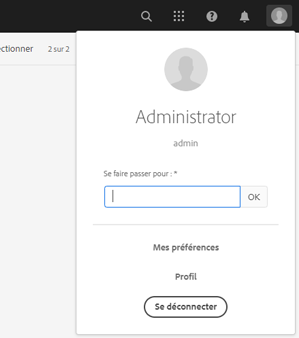

# Correctifs et packs de fonctionnalités inclus dans les packs de service précédents {#hotfixes-and-feature-packs-included-in-previous-service-packs}

## [!DNL Adobe Experience Manager] 6.5.6.0  {#experience-manager-6560}

Adobe Experience Manager 6.5.6.0 est une mise à jour importante qui comprend de nouvelles fonctionnalités, des améliorations clés demandées par les clients et des améliorations de performances, de stabilité et de sécurité, publiées depuis la version 6.5 du **avril 2019**. Il peut être installé sur Adobe Experience Manager 6.5.

Les principales fonctionnalités et améliorations introduites dans Adobe Experience Manager 6.5.6.0 comprennent :

* Publiez ou annulez sélectivement des fichiers dans [!DNL Experience Manager] ou [!DNL Dynamic Media] à l’aide de l’assistant [!UICONTROL Publication rapide] ou [!UICONTROL Gérer la publication].

* Utilisez l’interface utilisateur [!DNL Dynamic Media] pour invalider le contenu mis en cache du réseau de Diffusion de contenu (CDN).

* La publication des dossiers de contribution des ressources depuis le portail de marque vers les ressources du Experience Manager est désormais également prise en charge par le serveur proxy.

* Les groupes de dossiers privés générés automatiquement sont maintenant nettoyés lors de la suppression du dossier privé dans [!DNL Experience Manager Assets].

* La description des modificateurs dans l’éditeur de paramètres prédéfinis de la visionneuse [!UICONTROL vidéo ] a été mise à jour dans [!DNL Dynamic Media].

* Un nouveau paramètre de société est fourni pour refléter l’état du connecteur [!DNL Dynamic Media].

* Les options par défaut pour `test` et `aiprocess` sont mises à jour vers `Thumbnail`, à partir de `Rasterize` précédemment dans Dynamic Media, afin de garantir que les utilisateurs doivent créer uniquement des miniatures et ignorer l’extraction de page et l’extraction de mot-clé.

* [Préremplissez un formulaire adaptatif sur le client](../../help/forms/using/prepopulate-adaptive-form-fields.md#prefill-at-client).

* [Intégration du modèle de données de formulaire avec les API RESTful sur un serveur avec une implémentation](../../help/forms/using/configure-data-sources.md) SSL bidirectionnelle.

* [Amélioration de la mise en cache des pages](../../help/forms/using/configure-adaptive-forms-cache.md) de formulaires adaptatifs converties.

* Prise en charge des [balises texte Adobe Sign dans Automated forms conversion Service](https://docs.adobe.com/content/help/en/aem-forms-automated-conversion-service/using/convert-existing-forms-to-adaptive-forms.html).

* Prise en charge de [convertir les formulaires colorés en formulaires adaptatifs](https://docs.adobe.com/content/help/en/aem-forms-automated-conversion-service/using/convert-existing-forms-to-adaptive-forms.html) à l’aide de [!DNL Automated Forms Conversion service].

* Prise en charge des protocoles SMB 2 et SMB 3.

* Le référentiel intégré (Apache Jackrabbit Oak) a été mis à niveau vers la version 1.22.4.

Pour une liste complète des fonctionnalités et améliorations introduites dans Experience Manager 6.5.6.0, voir [Nouveautés de Adobe Experience Manager 6.5 Service Pack 6](new-features-latest-service-pack.md).

Voici la liste des correctifs fournis dans la version [!DNL Experience Manager] 6.5.6.0.

### [!DNL Sites] {#sites-6560}

* Dans [!DNL Sites] ou [!DNL Screens], sélectionnez un projet et cliquez sur [!UICONTROL Publications de gestion]. Les utilisateurs ne peuvent pas avancer dans l’assistant [!UICONTROL Gérer la publication] en raison d’erreurs d’interface utilisateur. Plus précisément, l’option [!UICONTROL Publier] ne fonctionne pas (NPR-34099).
* La position par défaut d&#39;iParsys (système de paragraphes hérité) n&#39;est pas rétablie après avoir désélectionné les options [!UICONTROL Annuler l&#39;héritage] ou [!UICONTROL Désactiver l&#39;héritage] (NPR-34097).
* Si `RolloutConfigManagerFactoryImpl` ne peut pas charger une configuration de déploiement, il ne tente pas de charger les configurations manquantes. Elle renvoie les configurations mises en cache (NPR-34092).
* Dans le composant noyau de texte, après avoir utilisé l’option d’édition HTML source, la classe de la balise `em` est supprimée (NPR-34081).
* Après la mise à niveau de Experience Manager 6.3.3 vers Experience Manager 6.5.3, le processus de déploiement prend beaucoup plus de temps et le déploiement échoue avec une erreur de dépassement de délai (NPR-34049).
* `htmlwriter` ne récode pas les valeurs d&#39;attribut. L’annotation présente dans l’annotation XF est exportée avec des valeurs d’attribut décodées (à savoir `"` au lieu de `&#34`). Elle entraîne des problèmes du côté Cible avec le compositeur d’expérience visuelle qui utilise le fichier XF exporté (NPR-34048).
* Lorsque vous déplacez des pages dans [!DNL Experience Manager Sites], améliorez la journalisation afin de capturer l’échec de création de version avec raison (NPR-34014).
* Dans [!DNL Rich Text Editor] si tout le texte est supprimé, la balise de paragraphe est également supprimée (NPR-33976).
* Lorsque la page `siteadmin` (dans l’interface utilisateur classique) est ouverte ou actualisée, les options du menu `New` sont désactivées (NPR-33949).

   

* Un [!DNL Content Fragment] ne peut pas être utilisé comme `TemplatedResource` car il échoue dans `ContentFragmentUsePojo` (NPR-33911).
* Les opérations de déplacement synchrones et asynchrones peuvent entraîner des erreurs en raison de transferts simultanés. Les opérations de déplacement de page sont limitées au déplacement asynchrone. Elle empêche le déplacement simultané des pages (NPR-33875).
* [!UICONTROL L’opération Gérer la ] publication pour répliquer du contenu de l’instance d’auteur à l’instance de publication échoue et génère une erreur JavaScript (NPR-33872).
* Lorsque plusieurs pages ou ressources sont sélectionnées pour créer des versions, la nouvelle version est créée uniquement pour la dernière page ou ressource sélectionnée (NPR-33866).
* Déplacez une page de plan avec des copies dynamiques dans un autre dossier. Lors du déplacement vers le dossier d&#39;origine, l&#39;opération de déplacement échoue sans aucune erreur (NPR-33864).
* Lorsque l&#39;action de déplacement est utilisée pour renommer une page Web dans la console [!DNL Sites], deux boîtes de dialogue se chevauchent à la dernière étape de l&#39;Assistant (NPR-33831).

   

* Les propriétés `cq:acLinks` et `cq:acUUID` de [!DNL Adobe Campaign] sur la copie sont supprimées lors de l&#39;opération de copier-coller (NPR-33794).
* Lors d’une tentative de déploiement sur une page enfant d’une copie dynamique parent détachée, [!DNL Experience Manager] génère une exception de pointeur nul (NPR-33676).
* Les composants [!DNL RTE] d&#39;un conteneur de mise en page ne sont pas visibles lorsque le conteneur de mise en page est copié et collé de nouveau sur la page. Les composants [!DNL RTE] ne sont pas modifiables mais s&#39;affichent lors d&#39;une actualisation de page (NPR-33662).
* Lors du redimensionnement d’un composant de mise en page pour différents points d’arrêt (moyens et grands), la mise en page ne se comporte pas comme prévu (NPR-33608).
* En mode de modification en ligne dans [!DNL RTE], le fait de faire glisser une image ne fonctionne pas pour le composant Texte (NPR-33602).
* Il est possible de créer un composant dans une page de plan avec le même nom que le nom de la page. Au cours du déploiement, `_msm_moved` est suffixe pour renommer le composant. Le composant est déplacé à la fin du système de paragraphe  (NPR-33535).
* Lorsque offTime ou onTime est défini sur de nombreuses pages ou ressources, il est gourmand en ressources et ralentit le système au démarrage et à l&#39;arrêt (NPR-33482).
* Un utilisateur disposant d&#39;autorisations CRUD sur `/content/experience-fragment` ne peut pas supprimer un dossier (NPR-33436).
* Vous pouvez sélectionner [!UICONTROL HTML et JSON] comme option pour le [!UICONTROL format d’exportation Adobe Target] sur un dossier parent dans la section [!DNL Experience Fragments]. Les mêmes propriétés s’affichent dans l’interface utilisateur tactile pour les sous-dossiers de ce dossier parent. Cependant, dans CRXDE, pour `cq:adobeTargetExportFormat`, il affiche uniquement du code HTML au lieu d’afficher `html,json` (NPR-33423).
* La fonction Publier ou Annuler la publication à partir d’un alias de page n’est pas prise en charge. Supprimez l&#39;option qui semble prétendre autrement (NPR-33415).
* Une balise spécifique peut être déplacée d&#39;un emplacement à un autre dans [!DNL Experience Manager]. Il peut également être appliqué à différentes pages avant et après le déplacement. Lors de la modification des propriétés des pages, la balise n’est pas affichée pour modification, même si la balise est identique (NPR-33353).
* Un modèle de page ne s’affiche pas correctement lorsqu’un conteneur de mise en page est supprimé d’un modèle qui contient plusieurs conteneurs de mise en page (NPR-33347).
* Dans l’éditeur de modèles, essayez de supprimer un modèle utilisé par plus de 100 000 pages sous `/content/`. Une erreur s&#39;affiche sans message d&#39;erreur (NPR-33312).
* La redirection vers la page [!DNL Experience Manager] avec ancrage ne fonctionne pas sur l’instance d’auteur, car `PageRedirectServlets` place la chaîne de requête après un fragment d’URL ou une ancre (NPR-34288).
* La création d&#39;une marque sous `/content/campaign` entraîne une structure qui n&#39;autorise pas la création de campagnes. [!UICONTROL L’option Créer une ] marque laisse la marque nouvellement créée sans possibilité de créer des  [!UICONTROL Offres et ] des activités, car il n’existe aucune   option de création (NPR-34113).
* Vous pouvez suspendre l&#39;[!DNL Live Copy] d&#39;une page et l&#39;héritage est rompu comme dans le mode Editeur. Dans les propriétés de la page, l’icône représentant l’héritage indique à tort que l’héritage existe et n’est pas rompu (NPR-34017).
* Les pages comportant de nombreuses références ne peuvent pas être déplacées de manière asynchrone et parfois l’opération de déplacement échoue (CQ-4297969).
* Une page Web contenant le caractère `/` dans l’URL ne répond plus lors de la création. Lorsqu’un composant est ajouté lors de la création, l’utilisation du processeur augmente et le navigateur cesse de répondre (CQ-4295749).
* En mode Parcourir, NVDA ne décrit pas une valeur sélectionnée dans l’option de menu Type/Taille. La cible d’action visuelle ne se concentre pas sur l’élément sélectionné. Les utilisateurs qui utilisent un lecteur d’écran ne peuvent pas utiliser le mode de navigation (CQ-4294993).
* Lors de la création d’une page Web, les utilisateurs peuvent sélectionner le modèle [!UICONTROL Page de contenu]. Dans l’onglet [!UICONTROL Social Media], les utilisateurs sélectionnent une variante [!UICONTROL XF préférée]. Pour sélectionner un fragment d’expérience en mode de navigation NVDA, les utilisateurs ne peuvent pas utiliser les touches du clavier (CQ-4292669).
* Mise à jour de la bibliothèque des barres de poignées vers la version 4.7.3 la plus sécurisée (NPR-34484).
* Plusieurs instances de script intersites dans des composants [!DNL Experience Manager Sites] (NPR-33925).
* Le champ du nom de dossier lors de la création d&#39;un nouveau dossier est vulnérable aux scripts intersites stockés (GRANITE-30094).
* Les résultats de la recherche sur la page[!UICONTROL  Bienvenue] et le modèle de fin de chemin sont vulnérables aux scripts intersites (NPR-33719, NPR-33718).
* La création d’une propriété binaire sur un noeud non structuré génère un script intersite sur la boîte de dialogue de propriété binaire (NPR-33717).
* Script intersite lors de l&#39;utilisation de l&#39;option [!UICONTROL Test de Contrôle d&#39;accès] dans l&#39;interface CRX DE (NPR-33716).
* Les entrées utilisateur ne sont pas codées correctement pour divers composants lors de l&#39;envoi d&#39;informations au client (NPR-33695).
* Script intersite dans la vue de calendrier pour la boîte de réception des Experience Manager (NPR-33545).
* Une URL qui se termine par `childrenlist.html` affiche une page HTML au lieu d’une réponse 404. Ces URL sont vulnérables aux scripts intersites (NPR-33441).


### [!DNL Assets] {#assets-6560}

**Améliorations de l’accessibilité dans les ressources des Experience Manager**

* Grâce aux touches du clavier, les utilisateurs peuvent désormais accéder aux options de l’interface utilisateur interactive et se concentrer sur celles-ci dans la liste [!UICONTROL Références] des ressources (NPR-34115).

* Le lecteur d’écran annonce maintenant l’action prévue des prédicats sur la page de recherche (NPR-34104).

* La page de recherche et la page de résultats de recherche ont désormais des titres plus informatifs pour mieux comprendre les utilisateurs de lecteurs d’écran (NPR-34093).

* Les lecteurs d’écran annoncent maintenant les options permettant de supprimer les balises sélectionnées dans l’onglet [!UICONTROL Basic] de la page de ressources [!UICONTROL Propriétés] (NPR-33972).

* Les éléments de chaque ligne de la vue de liste sont maintenant annoncés comme éléments de la même ligne par les lecteurs d’écran (NPR-33932).

* La cible d&#39;action de l&#39;utilisateur lors de la navigation à l&#39;aide de la clé `Tab` passe maintenant à l&#39;option de fermeture dans la prévisualisation de version (NPR-33863).

* La sélection des utilisateurs se déplace désormais vers l&#39;icône de recherche après la fermeture d&#39;Omnisearch (NPR-33705).

* Les options de l’interface utilisateur exploitables ont désormais un focus visuel plus visible, avec un contraste amélioré lors de la navigation à l’aide des touches du clavier. Les utilisateurs du clavier peuvent identifier les zones ciblées (NPR-33542).

* La fonctionnalité de glisser-déplacer à l’aide du clavier fonctionne désormais dans [!UICONTROL l’éditeur de Schéma de métadonnées] en mode de navigation du lecteur d’écran (CQ-4296326).

* Dans la boîte de dialogue de partage de liens, lors de la navigation en mode de navigation, un lecteur d’écran,

   * Ne décrit pas les informations du tableau dès que la boîte de dialogue est chargée.

   * Peut accéder à toutes les suggestions automatiques répertoriées.

   * Extrait les suggestions automatiques affichées pour l’[!UICONTROL Ajouter l’adresse électronique/Rechercher] (CQ-4294232).

* L’utilisation de la touche `Esc` pour supprimer les icônes d’action rapide de la vue de carte ne supprime plus la sélection au clavier du dernier élément ciblé (CQ-4293554).

* Pour les options interactives de l’interface utilisateur, le lecteur d’écran annonce maintenant leur objectif plutôt que les noms littéraux des icônes (CQ-4272943).

* La cible du clavier passe désormais à [!UICONTROL Fenêtre déroulante], [!UICONTROL Zoom intégré], [!UICONTROL Bannière_Shoppable], [!UICONTROL Zoom_foncé], [!UICONTROL Zoom_light], [!UICONTROL ZoomVertical_dark ] et [!UICONTROL Options ZoomVertical_light] lors de la navigation à l’aide de la touche de tabulation du clavier dans les détails de la ressource [!UICONTROL Visionneuses] dans [!DNL Dynamic Media] (CQ-4290605).

* [!UICONTROL Vous pouvez désormais accéder à l’option Enregistrer et ] fermer sur   la page Propriétés de la ressource à l’aide des touches du clavier (NPR-34107).

* Les messages d’erreur dus à des combinaisons de nom d’utilisateur et de mot de passe incorrectes sur la page de connexion sont maintenant annoncés par les lecteurs d’écran chaque fois que l’erreur se produit (NPR-33722).

* Dans la section d’en-tête [!DNL Experience Manager], lorsque vous naviguez en mode de navigation, le lecteur d’écran annonce maintenant,

   * Suggestions modifiées automatiquement dans [!UICONTROL Tapez pour rechercher] dans Omnisearch.

   * L’état a été développé ou réduit pour les options [!UICONTROL Solutions], [!UICONTROL Aide], [!UICONTROL Boîte de réception] et [!UICONTROL Utilisateur].

   * Message d’état [!UICONTROL Recherche d’aide] qui s’affiche lorsque l’utilisateur entre une chaîne de recherche dans le champ [!UICONTROL Rechercher de l’aide] sous l’option [!UICONTROL Aide].

   

   *Figure :  [!UICONTROL Recherchez ] Helpin   Helpmenu.*

   * Le message d’erreur si une valeur incorrecte est saisie dans le champ [!UICONTROL Faire l’emprunt d’identité sous ] sous l’option [!UICONTROL Utilisateur] et le focus se déplace correctement vers le champ de texte (NPR-33804).

   

   *Figure :  [!UICONTROL Attribuer l’identité ] à un champ dans le   menu Utilisateur de l’en-tête.*

* L’utilisateur peut désormais modifier la cible d’action à l’aide du clavier dans :

   * [!UICONTROL Recherchez/Ajoutez le champ ] Adresse électronique dans la boîte de dialogue  [!UICONTROL Partage de ] liens.

   * [!UICONTROL Ajouter un utilisateur ou un ] champ de groupe sous  [!UICONTROL Fermé User ] Groupez l&#39;onglet   Permissionstab des  [!UICONTROL propriétés]  du dossier (NPR-34452).

**Problèmes résolus dans les ressources Experience Manager**

[!DNL Adobe Experience Manager] La version 6.5.6.0  [!DNL Assets] apporte des correctifs aux problèmes suivants :

* Les annotations ne sont pas mises en surbrillance lorsqu’elles sont sélectionnées dans la chronologie de la ressource (CQ-4302422).

* La prévisualisation des actifs de garantie marketing (tels que Brochure, Brochure et Carte de visite) créés à l’aide du modèle [!DNL Adobe InDesign] n’affiche pas les sauts de ligne et les sauts de paragraphe (NPR-34268).

* L’extraction de texte et donc la recherche de texte intégral pour les fichiers PDF téléchargés ne fonctionnent pas (NPR-34164). Pour y remédier, redémarrez le déploiement [!DNL sAdobe Experience Manager] après avoir installé le Service Pack 6.

* La chronologie des ressources de plusieurs pages affiche les annotations appliquées à toutes les sous-ressources lors de la navigation dans la ressource dans la vue de chronologie, au lieu d’afficher les annotations spécifiques aux sous-ressources spécifiques (NPR-34100).

* Les dossiers de ressources ne sont pas publiés à l’aide de l’option [!UICONTROL Gérer la publication] si les dossiers contiennent des ressources aux formats de fichier JavaScript, CSS ou JSON (NPR-34090).

* La désélection ou la suppression des balises ou filtres appliqués dans Omnisearch exécute la requête de recherche plusieurs fois, ce qui entraîne une augmentation du temps de recherche (NPR-34078).

* Dans la vue de carte lorsqu’un processus (sur une ressource d’un dossier) est en cours ou en attente, la page se recharge jusqu’à ce que le processus soit terminé ou terminé. Par conséquent, les auteurs ne peuvent pas travailler sur ces ressources dans le dossier pour lequel ils doivent faire défiler la page vers le bas (NPR-33986).

* Si l’utilisateur déplace un fichier publié vers un nouvel emplacement, le fichier est republié même si l’option [!UICONTROL Republier] est désélectionnée. Ceci conduit à la présence de nombreux actifs orphelins sur l’instance de publication. Cependant, le comportement par défaut est que l’opération de déplacement sur une ressource publiée annule automatiquement sa publication ; cette ressource est republiée si l’auteur sélectionne l’option [!UICONTROL Republier] lors du déplacement de la ressource (NPR-33934).

* La page [!UICONTROL Déplacer les ressources] des ressources des collections ne charge pas tout le contenu HTML, par exemple l’option [!UICONTROL Ajuster/ Republier]. Par conséquent, les utilisateurs ne peuvent pas effectuer l’opération de déplacement (NPR-33860).

* Le déplacement d’une ressource et l’ajout de caractères spéciaux dans le nom et le titre des ressources déplacées crée un dossier supplémentaire (portant le même nom) au nouvel emplacement de la ressource (NPR-33826).

* [!UICONTROL Le bouton ] Télécharger d’une ressource est désactivé lorsque l’option   Envoyer par courriel est sélectionnée dans le   Téléchargement (NPR-33730).

* L’erreur &quot;Request-URI too long&quot; est observée lors des opérations en bloc sur des ressources, telles que la modification des métadonnées en masse (NPR-33723).

* Une erreur JavaScript est observée et les utilisateurs ne peuvent pas sélectionner ou supprimer les choix générés dans le champ [!UICONTROL Liste déroulante] par [!UICONTROL Ajouter via le chemin JSON] dans la fonctionnalité [!UICONTROL Éditeur de formulaire du Schéma de métadonnées du dossier], si le fichier JSON téléchargé comporte de l’espace ou des caractères spéciaux (NPR-3377112).

* Les rendus statiques des ressources ne sont pas mis à jour lorsque la ressource est mise à jour à l’aide de l’option [!UICONTROL Ouvrir] dans [!DNL desktop app] ou [!DNL Adobe Asset Link] et sont synchronisés de nouveau sur [!DNL Adobe Experience Manager] (CQ-4296279).

* Dans la vue de colonne, l’opération de déplacement sur un ensemble de ressources déplace également les ressources qui ont été sélectionnées avant d’utiliser l’option [!UICONTROL Filtrer] à leur place. Notez que l’utilisation de l’option [!UICONTROL Filtre] désélectionne la sélection précédente (NPR-34018).

* Les barres obliques inverses sont ajoutées avant les caractères spéciaux dans les suggestions de recherche de ressources, qui portent des caractères spéciaux dans leur nom (NPR-33834).

* Lors de la création de règles pour la liste déroulante dans la colonne [!UICONTROL Schéma de métadonnées de dossier], l’utilisateur ne peut pas sélectionner de valeurs dans la colonne [!UICONTROL Choix de champ] (CQ-4297530).

* La copie d’exécution du modèle de processus personnalisé des ressources (créée dans `/var/workflow/models/dam`) est supprimée lorsque vous installez [!DNL Experience Manager] 6.5 Service Pack 5 ou une version précédente sur [!DNL Experience Manager] 6.5 (NPR-34532). Pour récupérer la copie d’exécution, synchronisez la copie d’heure de conception du modèle de processus avec la copie d’exécution à l’aide de l’API HTTP :
   `<designModelPath>/jcr:content.generate.json`.

**Problèmes résolus dans Dynamic Media**

* Si l’utilisateur définit les paramètres de codage dans les modifications après la création du profil vidéo, les paramètres de recadrage intelligent sont supprimés des profils vidéo (CQ-4299177).

* Les ressources scintillent au chargement de la page lorsque l’utilisateur bascule entre les options du rail latéral (par exemple, [!UICONTROL Aperçu], [!UICONTROL Chronologie], [!UICONTROL Visionneuses]) sur la page des détails de la ressource (NPR-34235).

* Les problèmes suivants ont été observés avec le travail de retraitement :

   * L&#39;ID de tâche est manquant dans le descripteur de tâche renvoyé par la tâche de retraitement.

   * Retraiter la tâche pour les journaux vidéo uniquement le nom de fichier et non le chemin d’accès complet.

   * La tâche de retraitement n’a pas d’option permettant de définir le type de ressource comme statique.

   * `ExcludeFromAVS` n’est pas fournie (CQ-4298401).

* La fonctionnalité de recadrage dynamique échoue avec une erreur lorsque le profil d’image est ajouté à un dossier ayant plusieurs proportions (par exemple, 11) (NPR-34082).

* Le processus de mise à jour des actifs de la gestion des actifs est déclenché lorsque l’utilisateur fait défiler la page [!UICONTROL Archive de flux de travaux] sur l’onglet [!UICONTROL Workflow] dans [!UICONTROL Outils] dans [!DNL Adobe Experience Manager] configuré avec Dynamic Media (CQ-4299727).

* Les symboles de l’onglet [!UICONTROL Comportement] de [!UICONTROL Éditeur de paramètres prédéfinis de la visionneuse] ne sont pas localisés (CQ-4299026).

* La vue principale affiche l’image dans une disposition incorrecte qui ne tient pas dans la visionneuse, si celle-ci est en mode réactif (CQ-4298293).

* Les modifications apportées aux paramètres d’image prédéfinis dans [!UICONTROL Adobe Experience Manager] ne sont pas synchronisées avec Scene7 Publishing System (CQ-4299713).

### [!DNL Commerce] {#commerce-6560}

* Les liens vers les ressources provenant de produits ne sont pas refactorisés lors du déplacement des ressources (NPR-34098).

### Plate-forme {#platform-6560}

* Impossible de télécharger les journaux à l&#39;aide de l&#39;outil Diagnostic sur une instance de Experience Manager mise à niveau (NPR-34336).
* La mise à niveau échoue avec une erreur en raison des dépendances d&#39;une version spécifique du package de base `cq-wcm-api` (CQ-4300520).
* Les valeurs par défaut des paramètres **[!UICONTROL Connect Timeout]** et **[!UICONTROL Socket Timeout]** pour la configuration de l&#39;agent par défaut (publication) ne sont pas spécifiées (NPR-33707).
* Les mises à jour de la configuration de mappage sous `/etc/map.publish` ne sont pas répercutées sur les pages du site (NPR-34015).
* [La ](https://helpx.adobe.com/fr/experience-manager/6-5/sites/developing/using/reference-materials/javadoc/com/day/cq/tagging/package-summary.html) documentation de référence d’API n’inclut pas la documentation du  `com.day.cq.tagging` package (CQ-4295864).

### Interface utilisateur {#ui-6560}

* L’interface du navigateur de déchargement n’affiche pas toutes les rubriques de tâches (NPR-34308).
* L&#39;interface [Navigateur de configuration](/help/sites-administering/configurations.md) n&#39;affiche pas toutes les configurations (NPR-33644).
* Lorsque vous appuyez sur la touche `Esc` lors de la recherche d&#39;utilisateurs à faire passer pour des utilisateurs, la boîte de dialogue **[!UICONTROL Utilisateur]** se ferme à la place de la liste utilisateur (NPR-34084).

### Intégrations {#integrations-6560}

* Les Activités dont le nom est long ne sont pas synchronisées avec [!DNL Adobe Target] (NPR-34254).

* La sélection d&#39;une propriété lors de la création d&#39;une nouvelle configuration de lancement d&#39;Adobe génère le message d&#39;erreur suivant (NPR-33947) :

   ```javascript
   GET http://hostname:Port/libs/cq/dtm-reactor/content/configurations/createcloudconfigwizard/jcr:content/body/items/form/items/wizard/items/general/items/fixedcolumns/items/container/items/general/items/property/data.html?query=&start=0&end=25&imsConfigurationId=Adobe%20Launch&companyId=&_charset_=utf-8 400 (Bad Request)
   ```

### Projets de traduction {#translation-6560}

* Un projet de traduction n&#39;est pas créé si l&#39;utilisateur `authorizableID` comporte des caractères spéciaux (NPR-33828).

### Sling {#sling-6560}

* Les fonctionnalités de contrôle d’intégrité et de détection de schémas se chevauchent. Par conséquent, la vérification de la santé est supprimée du produit (NPR-33928).

### WCM {#wcm-6560}

* Composants de base : lorsque vous ajoutez un composant d&#39;image de base à une page et référencez une image, l&#39;opération `Undo` ne fonctionne pas (NPR-34516).

* Impossible d&#39;utiliser l&#39;opération de déplacement de page (CQ-4303028).

### [!DNL Communities] {#communities-6560}

* Le partage d&#39;un billet sur les médias sociaux montre une option obsolète, Google+ (NPR-33877).

* Le membre de la communauté ne peut pas modifier le modèle de groupe ou d&#39;autres paramètres de fonction de groupe (NPR-33530).

* Les balises d’hyperlien sur les images ne sont pas générées correctement dans une publication de forum (NPR-33464).

* Les échecs d’accessibilité sont identifiés dans la fonction Affectation de communauté (NPR-33442).

* Les utilisateurs existants d’un groupe de la communauté ajouté via la console d’administration sont supprimés de la liste d’utilisateurs lors de toute modification de la console de groupe de la communauté (NPR-34315).

* `TagFilterServlet` fuit des données potentiellement sensibles (NPR-33868).

<!--
* Tag filters are vulnerable to sensitive information disclosure (NPR-33868).
-->

### [!DNL Forms] {#forms-6560}

>[!NOTE]
>
>[!DNL Experience Manager] Le Service Pack n’inclut pas de correctifs pour  [!DNL Forms]. Ils sont livrés à l’aide d’un module complémentaire [!DNL Forms] distinct. En outre, un programme d’installation cumulatif est publié, qui comprend des correctifs pour [!DNL Experience Manager Forms] sur JEE. Pour plus d’informations, voir [Installer le module complémentaire AEM Forms](#install-aem-forms-add-on-package) et [Installer AEM Forms on JEE](#install-aem-forms-jee-installer).

Après avoir installé le module complémentaire [!DNL Experience Manager Forms] 6.5.6.0 :

* Arrêtez l&#39;instance [!DNL Experience Manager Forms].

* Supprimez les fichiers JAR `bcpkix-1.51`, `bcmail-1.51` et `bcprov-1.51` du répertoire `crx-repository\launchpad\ext`.

* Supprimez la propriété ` sling.bootdelegation.class.org.bouncycastle.jce.provider.BouncyCastleProvider` du fichier `sling.properties`.

* Redémarrez l&#39;instance [!DNL Experience Manager Forms].

**Formulaires adaptatifs**

* S’il manque un fragment de formulaire adaptatif, le rendu du formulaire adaptatif échoue (NPR-34302).

* La description du contenu d’aide d’un champ de formulaire adaptatif affiche une balise HTML de paragraphe (NPR-34116).

* Lorsque vous sélectionnez la propriété **[!UICONTROL Revalider sur le serveur]**, le formulaire adaptatif ne peut pas être envoyé (NPR-33876).

* L’action d’envoi **[!UICONTROL Envoyer au point de terminaison REST]** ne fonctionne pas pour un formulaire adaptatif (CQ-4299044).

* Accessibilité : Lorsque vous tentez d’envoyer un formulaire adaptatif sans télécharger de pièce jointe pour un champ obligatoire, la cible d’action ne se déplace pas automatiquement vers le champ de pièce jointe (CQ-4298065).

* Lorsque vous ajoutez des lignes à un tableau d’un formulaire adaptatif, les options **[!UICONTROL Ajouter en haut]** et **[!UICONTROL Ajouter en bas]** n’affichent pas les résultats appropriés (CQ-4297511).

* Le script [!UICONTROL Valeur Commit] est déclenché incorrectement, ce qui entraîne une perte de données dans un formulaire adaptatif (CQ-4296874).

* Le sélecteur de dates ne fonctionne pas correctement pour les formulaires adaptatifs localisés (NPR-34333).

* Lorsque le nom de fichier contient un trait de soulignement ou un espace, vous ne pouvez pas joindre le fichier à un formulaire adaptatif (CQ-4301001).

* Lorsqu’un panneau répétable imbriqué comporte plus d’occurrences que son parent, toutes les occurrences de ce panneau répétable imbriqué ne sont pas préremplies (NPR-33666).

* Les formulaires adaptatifs disposent de certains résolveurs de ressources ouverts. Cela entraîne des échecs d’envoi. Le problème se produit par intermittence (CQ-4299407).

* Lors de la première ouverture de la configuration de champ, l’icône de propriétés ne s’affiche pas (CQ-4296284).

* Les utilisateurs peuvent modifier les métadonnées d’envoi, telles que `afPath`, `afSubmissionTime` et `signers`, lors de l’envoi d’un formulaire adaptatif. Pour résoudre ce problème, les valeurs de métadonnées sont supprimées des données d’envoi du formulaire côté client. Les utilisateurs peuvent utiliser l&#39;objet `FormSubmitInfo` pour récupérer ces valeurs auprès du serveur (NPR-33654).

* Les entrées utilisateur ne sont pas codées correctement pour les composants [!DNL Forms] lors de l&#39;envoi d&#39;informations au client (NPR-33611).

**Processus**

* Lorsqu’un approbateur de processus télécharge une pièce jointe, celle-ci est renommée `undefined` (NPR-33699).

* [!DNL Experience Manager] Échec de l&#39;opération de purge du flux de travail et affiche le message d&#39;erreur suivant (NPR-33575) :

   `java.lang.UnsupportedOperationException: The query read more than 500000 nodes in memory`

* [!DNL Experience Manager Forms] pour  [!DNL Windows] arrêter de répondre après l’envoi d’un formulaire (NPR-34409).

* Lorsque vous installez AEM Service Pack, la liste **Tâches** des éléments ne s’affiche pas sous forme de liens. Le texte des éléments **À faire** comprend des balises HTML (NPR-34317).

**Communication interactive**

* Lorsque vous incluez un fragment de document de texte avec des composants répétables imbriqués, l’enregistrement de la communication interactive échoue (NPR-34095).

**Correspondence Management**

* Lorsque vous modifiez un fragment de document de texte qui inclut des valeurs de dictionnaire de données, l’interface utilisateur de l’agent ne répond plus (NPR-33930).

* Copier-coller du contenu d’un document [!DNL Microsoft Word] vers un fragment de document de texte dans une lettre entraîne des problèmes de formatage (NPR-33536).

**Services de document**

* Lorsque vous générez un fichier PDF à partir d’un fichier XDP à l’aide des services Output et Forms, il manque et le texte se chevauche (NPR-34237, CQ-4299331).

* Lorsque vous convertissez un fichier HTML au format PDF, l&#39;attribut `MaxReuseCount` n&#39;est pas configurable (NPR-33470).

* Lorsque vous téléchargez un fichier PDF contenant des fonctions interactives Reader Extensions, vous ne pouvez pas ajouter de pièce jointe au fichier PDF à l’aide de [!DNL Adobe Reader] (NPR-33729).

**Document Security**

* Impossible d&#39;exécuter l&#39;opération Sign avec des certificats basés sur HSM dans un fichier PDF après avoir installé [!DNL Experience Manager] Service Pack (NPR-34310).

**Designer**

* Impossible d’ouvrir XForms dans Designer version 6.5.x (CQ-4295322).

* Lorsque vous ouvrez Designer, l’écran de bienvenue affiche une année incorrecte (CQ-4295289).

* Lorsque vous installez [!DNL Acrobat DC] sur le serveur, l&#39;option **[!UICONTROL Diffuser le formulaire]** est inactive (CQ-4296304).

Pour plus d’informations sur les mises à jour de sécurité, voir [Experience Manager security bulletins page](https://helpx.adobe.com/security/products/experience-manager.html).

## [!DNL Adobe Experience Manager] 6.5.5.0  {#experience-manager-6550}

Adobe Experience Manager 6.5.5.0 est une mise à jour importante qui comprend de nouvelles fonctionnalités, des améliorations clés demandées par les clients et des améliorations de performances, de stabilité et de sécurité, publiées depuis la version 6.5 du **avril 2019**. Il peut être installé sur Adobe Experience Manager 6.5.

Voici quelques-unes des principales fonctionnalités et améliorations introduites dans [!DNL Adobe Experience Manager] 6.5.5.0 :

* L&#39;accès anonyme au CRXDE Lite est interdit. Les utilisateurs sont redirigés vers l’écran de connexion. Voir [Développement avec le CRXDE Lite](/help/sites-developing/developing-with-crxde-lite.md).

* Personnalisez les noms des colonnes qui s’affichent dans la boîte de réception [!DNL Adobe Experience Manager].

* Amélioration de l’accessibilité dans diverses zones de la Gestion de contenu Web Experience Manager (WCM), telles que l’éditeur de page, les composants principaux, RTE et l’interface utilisateur d’administration.

* Enregistrez un [!DNL Interactive Communication] en tant que brouillon.

* Prise en charge de [!DNL Oracle WebLogic 12] pour le Forms Experience Manager sur JEE.

* Amélioration de la gestion des exceptions dans le flux de l&#39;interface utilisateur [!DNL Adobe Experience Manager Assets].

* Pour obtenir l’URL de publication pour Dynamic Media, une nouvelle méthode `getRemoteAssetPublishURL` est ajoutée à l’interface `com.day.cq.dam.api.s7dam.scene7.ImageUrlApi`.

* [](#assets-6550) Améliorations de l&#39;accessibilité  [!DNL Adobe Experience Manager Assets] en conformité avec les Web Content Accessibility Guidelines (WCAG).

* Suppression de l’intégration Package Share dans Adobe Experience Manager.

* Le référentiel intégré (Apache Jackrabbit Oak) a été mis à niveau vers la version 1.22.3.

Pour une liste complète des fonctionnalités, des points saillants, des fonctionnalités clés introduites dans Experience Manager 6.5 Service Pack 5, voir [Nouveautés de Adobe Experience Manager 6.5 Service Pack 5](new-features-latest-service-pack.md) .

Voici la liste des correctifs fournis dans la version [!DNL Experience Manager] 6.5.5.0.

### [!DNL Sites] {#sites-6550}

* Les sites Experience Manager offrent la possibilité de publier ou d’annuler la publication d’une page à partir de son alias. L&#39;option ne fonctionne pas (NPR-33415).
* Lorsqu’un conteneur de mise en page est supprimé d’un modèle contenant plusieurs modèles, le rendu du modèle n’est pas correct (NPR-33347).
* Lorsqu&#39;une page Sites Experience Manager fait partie d&#39;un vaste ensemble de contenus comportant plusieurs copies en direct, la prévisualisation d&#39;historique des versions de page ne se charge pas (NPR-33311).
* Lorsque vous utilisez la commande Déplacer pour renommer une page Sites Experience Manager, le titre de la page n&#39;est pas mis à jour (NPR-33264).
* Lorsque vous déplacez des pages à travers la vue des colonnes, les colonnes disparaissent (NPR-33216).
* Lorsque le nom d&#39;un composant local d&#39;une copie de langue est identique au nom d&#39;un composant du plan et que le composant est déployé à partir du plan, le terme `_msm_moved` n&#39;est pas ajouté au nom du composant local (NPR-33208).
* La servlet Page Redirect ajoute .html à une URL de sites Experience Manager où ResourceType n&#39;est pas `cq:Page` (NPR-33176).
* Lorsque vous collez une sous-arborescence, vous n’avez pas la possibilité de décider si les sous-pages correspondantes doivent être collées ou non (NPR-33149).
* Le nombre de résultats dans les utilisations réelles d&#39;un composant est limité au nombre 49 (NPR-33058).
* Lorsque vous basez un fragment de contenu sur un schéma et qu’il contient une zone de texte obligatoire ou un champ de chemin, l’enregistrement du fragment de contenu échoue (NPR-33007).
* Lorsque vous créez un composant personnalisé à l’aide du composant Fragment d’expérience par défaut et que vous l’utilisez dans les pages Sites du Experience Manager, le Experience Manager n’affiche pas les références (utilisation) du composant personnalisé (NPR-32852).
* Lorsque vous renommez un dossier avec un grand nombre de références, de nombreuses références au dossier ne sont pas mises à jour (NPR-32765).
* Lorsque vous activez l’option d’édition source, elle devient disponible pour les options d’affichage plein écran en ligne, mais reste absente pour les options de boîte de dialogue d’édition et d’affichage plein écran de l’éditeur de texte enrichi (NPR-32763).
* Si vous disposez d’un champ à plusieurs champs et qu’il contient un champ obligatoire (tel qu’une liste déroulante ou un champ de chemin) dans les propriétés de page d’un plan directeur, lorsqu’une page contenant un tel champ à plusieurs champs est déployée, les propriétés de page de la copie dynamique ne sont pas enregistrées (NPR-32751).
* Les lecteurs d’écran ne peuvent pas utiliser la structure d’en-tête pour parcourir une page. En outre, l&#39;onglet Composants a un libellé incorrect (NPR-32648).
* Lors des débuts de pagination, le sélecteur de fragments d’expérience ne charge pas tous les éléments (NPR-32605).
* Les autorisations d’auteur pour lire, modifier, créer et supprimer des copies en direct sont révoquées. Chaque auteur devait fournir explicitement des autorisations de lecture et de modification pour déplacer des pages dans un plan directeur (NPR-32550).
* Les auteurs de contenu ne parviennent pas à créer le lancement pour une page qui est intégrée à Adobe Analytics (NPR-32548).
* Lorsqu&#39;un utilisateur reprend l&#39;héritage avec la synchronisation, la copie dynamique de la page parente ne se synchronise pas avec le plan et affiche un état incorrect (NPR-32500).
* Le chargement de la page de l&#39;éditeur de sites Experience Manager prend plus de 15 secondes (NPR-32413).
* Certains champs n&#39;affichent pas l&#39;option Annuler l&#39;héritage (NPR-32362).
* Lorsque vous sélectionnez un chemin pour un composant Fragment d’expérience et cochez la case Ouvrir la boîte de dialogue de sélection, vous n’accédez pas au chemin sélectionné dans le navigateur de chemins (NPR-32308).
* Lorsque vous effectuez une mise à niveau de Experience Manager 6.2 vers Experience Manager 6.5, le composant Parsys des modèles statiques ne s’affiche pas correctement. La hauteur du composant Parsys est définie sur 0 et les composants qu&#39;il contient ne sont pas visibles (NPR-33663).
* Lorsqu’un utilisateur copie et colle un Conteneur de mise en page sur la même page, les composants d’un Conteneur de mise en page ne s’affichent pas (NPR-33648).
* La vérification d&#39;intégrité du répartiteur affiche un message d&#39;avertissement `Invalid cookie header` dans les fichiers journaux (NPR-33629).
* XSS reflété dans PreferencesServlet (NPR-33438).
* Les utilisateurs anonymes peuvent accéder aux fonctions de CRXDE Lite (GRANITE-27790).

### [!DNL Assets] {#assets-6550}

>[!IMPORTANT]
>
>Les utilisateurs Windows de [!DNL Experience Manager desktop app] sont invités à effectuer la mise à niveau vers [l&#39;application de bureau version 2.0.3.2](https://docs.adobe.com/content/help/en/experience-manager-desktop-app/using/release-notes.html#whats-new-added) pour accéder au référentiel DAM sur l&#39;instance [!DNL Adobe Experience Manager 6.5.5.0]. Ils peuvent rencontrer des problèmes lors de l’accès au référentiel DAM sur l’instance [!DNL Adobe Experience Manager] 6.5.5.0 à l’aide de l’application de bureau version 2.0.2.

**Améliorations de l’accessibilité dans les ressources des Experience Manager**

* Il est désormais possible d’activer l’option [!UICONTROL Commentaires] de la liste et de cliquer sur [!UICONTROL Créer] des commentaires de version sous [!UICONTROL Créer une nouvelle version] dans le [!UICONTROL panneau de ressources ] Timeline (NPR-33424).

* Il est maintenant possible d&#39;accéder à l&#39;option [!UICONTROL Paramètres de Vue] pour les ressources et de modifier les paramètres dans la boîte de dialogue [!UICONTROL Paramètres de Vue] à l&#39;aide des touches du clavier (NPR-33420).

* La fenêtre contextuelle de la zone de liste de la zone combinée (dans divers champs sur différentes pages) affiche désormais les entrées en tant que liste d’options pouvant être annoncées par les lecteurs d’écran (NPR-33516).

* Les lecteurs d’écran annoncent maintenant la fonctionnalité de tri des en-têtes pouvant être triés (dans la vue de liste, la vue [!UICONTROL Chronologie] et la page [!UICONTROL Gérer la publication]) et les commandes de tri des en-têtes de colonne sont accessibles à l’aide du clavier (NPR-32979).

* Les éléments cliquables, tels que les cartes de commentaires, les mises à jour de version, les zones de liste modifiable et les icônes de menus chevron, peuvent désormais être ciblés et interactifs à l’aide d’un clavier (NPR-33514).

* La fonctionnalité (ou l’objectif de l’action) des icônes d’informations (pour l’utilisation, les impressions et les clics) sur [!UICONTROL la Vue d’informations] sont maintenant correctement annoncées par les lecteurs d’écran (NPR-33513).

* Les champs de formulaire en lecture seule (par exemple, les champs désactivés sous [!UICONTROL Onglet de base] de la ressource [!UICONTROL Propriétés]) peuvent désormais être activés à l’aide du clavier (NPR-33493, CQ-4273031).

* Les étiquettes des différents champs d&#39;entrée sont maintenant des étiquettes permanentes (donc accessibles) et pas seulement des étiquettes d&#39;espace réservé, qui ont disparu au moment de la saisie du texte (NPR-33475).

* Différents niveaux d’en-tête (tels que les titres de page et les en-têtes de section) sont maintenant perçus comme des en-têtes avec des niveaux différents pour les utilisateurs de lecteurs d’écran (NPR-33471).

* Les éléments interactifs de l’interface utilisateur, tels que les liens et les options (sur l’en-tête et les options de zoom de la page des ressources, la navigation dans les dossiers), sont désormais accessibles à l’aide d’un clavier (NPR-33468, CQ-4271412).

* Les [!UICONTROL indicateurs de progression ], [!UICONTROL Portée] et [!UICONTROL Workflows] de la page [!UICONTROL Gérer la publication] sont désormais correctement lus par les lecteurs d’écran comme indicateurs de progression, au lieu des onglets (NPR-33416).

* La couleur des icônes d’évaluation des étoiles (par exemple, dans la section [!UICONTROL Notation] de l’onglet [!UICONTROL Avancé] de la ressource [!UICONTROL Propriétés] ou dans la vue de carte) est modifiée afin que le contraste approprié soit visible pour les utilisateurs ayant une vision limitée et sans perception de couleur (NPR-33414).

* La flèche vers le haut située en regard du champ [!UICONTROL Commentaire] de la page des détails des ressources est désormais accessible à l’aide des touches du clavier (NPR-33397).

* Les états développés et réduits de la boîte de dialogue [!UICONTROL Balises] sur la ressource [!UICONTROL Propriétés] et la navigation ferroviaire de gauche (dans l’interface utilisateur des ressources) sont maintenant correctement annoncés par les lecteurs d’écran (NPR-33396).

* Les titres de toutes les pages consultées des ressources [!DNL Adobe Experience Manager] sont désormais uniques (NPR-33343).

* Lors de la navigation dans la structure de l&#39;arbre, divers éléments du contrôle de la vue de l&#39;arbre sont maintenant annoncés correctement par les lecteurs d&#39;écran (NPR-33304).

* Différentes versions des ressources de la vue [!UICONTROL Chronologie] sur la page des détails des ressources sont désormais accessibles à l’aide des touches du clavier (NPR-33283).

* Les noms des suggestions de recherche apparaissant dans la zone de liste modifiable d&#39;Omnisearch sont maintenant annoncés par les lecteurs d&#39;écran lors de l&#39;utilisation de la fonctionnalité de recherche (NPR-33280).

* Les éléments cliquables et [!UICONTROL Atteindre le lien] dans [!UICONTROL Le rail de références] sont maintenant annoncés par les lecteurs d’écran comme éléments cliquables (NPR-33278).

* Les informations relatives à la structure des tableaux (comme la ligne 1, la cellule 1, le tableau) de la boîte de dialogue [!UICONTROL Partager le lien] ne sont plus annoncées par les lecteurs d’écran lorsque la boîte de dialogue s’ouvre (NPR-33268).

* Les lecteurs d’écran (NPR-33235) ont maintenant correctement annoncé l’objectif de divers éléments de la zone de liste modifiable (tels que le champ Chemin et l’option permettant d’ouvrir la boîte de dialogue Sélection dans l’onglet Simple des Propriétés du fichier).

* Les informations indiquant que les lignes du tableau de la vue de liste peuvent être sélectionnées sont maintenant communiquées aux utilisateurs de lecteurs d’écran lorsque le clavier est activé sur ces lignes. Lorsqu’un pointeur survole les rangées, les lecteurs d’écran annoncent les informations (NPR-33234).

* Les options (comportant [!UICONTROL x]) pour supprimer chacune des balises sélectionnées sous le champ [!UICONTROL Balises] dans l&#39;onglet [!UICONTROL Basic] de [!UICONTROL Propriétés] sont désormais accessibles aux lecteurs d&#39;écran (NPR-33206).

* Le sélecteur de dates du calendrier peut désormais être activé et activé à l’aide du clavier par les utilisateurs de lecteurs d’écran et les utilisateurs de clavier voyants (NPR-33200).

* La bascule entre la vue de liste et la vue de carte expose désormais correctement sa fonctionnalité (d&#39;ajustement des vues) au lecteur d&#39;écran (NPR-33069).

* Le menu du rail de gauche est maintenant accessible. Les lecteurs d&#39;écran annoncent à juste titre la fonctionnalité et l&#39;objectif de l&#39;extension du menu (NPR-33068).

* La zone de liste et de nombreux autres éléments de l’interface utilisateur sont désormais accessibles aux utilisateurs de lecteurs d’écran non voyants. Les lecteurs d’écran annoncent les informations suivantes (NPR-33040) :

   * si la saisie de l’utilisateur est requise sur un élément avant l’envoi du formulaire.
   * si un élément n’est pas modifiable.
   * si un widget est sélectionné ou non.

* L’option d’ouverture de la barre latérale du filtre est désormais accessible à l’aide du clavier (NPR-32842, CQ-4273018).

* Le contrôle de case à cocher dans l&#39;en-tête de colonne de la vue de liste est maintenant accessible et le but de l&#39;utilisation du contrôle est annoncé par les lecteurs d&#39;écran (NPR-32722, NPR-33005).

* Les libellés des champs Heures (HH) et Minutes (mm) du sélecteur de date de calendrier sont désormais des libellés permanents au lieu des libellés d’espace réservé et ne disparaissent pas lorsque l’utilisateur saisit du texte dans ces champs (NPR-32720).

* Le texte des liens des notifications (qui s&#39;affichent après avoir cliqué sur l&#39;icône représentant une cloche) est maintenant annoncé aux utilisateurs de lecteurs d&#39;écran, qui utilisent l&#39;onglet pour accéder à chaque lien (NPR-32645).

* [!UICONTROL Sélectionnez],  [!UICONTROL Télécharger],  [!UICONTROL Propriétés] et   Autres actions. Les options des cartes de ressources dans Insights Viewer sont désormais accessibles à l’aide du clavier (NPR-32609).

* Le contenu masqué visuellement (tel que le contenu de la barre de menus de l&#39;en-tête dans les résultats de la recherche) n&#39;est plus annoncé par les lecteurs d&#39;écran lorsqu&#39;on y accède à l&#39;aide du clavier (NPR-32606).

* Les lecteurs d’écran annoncent maintenant l’objectif des étiquettes sur les commandes pour passer aux mois suivants et aux mois précédents dans le sélecteur de dates du calendrier (NPR-32604).

* Les icônes d&#39;évaluation des étoiles peuvent désormais être activées et activées à l&#39;aide des touches du clavier (NPR-32513).

* La fonctionnalité de contrôle du volume vidéo est désormais accessible via la tabulation (pour mettre l&#39;accent sur le curseur de volume) et les touches fléchées (pour régler le volume) sur le clavier (NPR-32065).

* L’objectif des champs d’entrée de limite inférieure ([!UICONTROL From]) et de limite supérieure ([!UICONTROL To]) du filtre Taille de fichier est maintenant annoncé aux utilisateurs de lecteurs d’écran non voyants (NPR-32064).

* Le menu [!UICONTROL Langues] du formulaire [!UICONTROL Créer et traduire] est désormais accessible aux lecteurs d’écran en mode de navigation (CQ-4293906).

* Le panneau [!UICONTROL Références] est maintenant accessible avec les améliorations suivantes (NPR-33261, CQ-4293798) :

   * En mode de navigation, le lecteur d’écran n’affiche plus les champs de modification multiligne masqués sous [!UICONTROL Références du site], [!UICONTROL Références des ressources], [!UICONTROL Copies] et [!UICONTROL Références du formulaire].

   * Les lecteurs d’écran annoncent maintenant le rôle des éléments [!UICONTROL Références du site] et [!UICONTROL Copies de langue].

   * La cible des lecteurs d’écran en mode de navigation se déplace, dans une séquence significative, vers divers éléments.

* [!UICONTROL La page ] Editeur de Schéma de métadonnées et ses éléments sont désormais accessibles à l’aide du clavier et sont compatibles avec les lecteurs d’écran (CQ-4290962, CQ-4272953).

* L’objectif du symbole `X` de suppression des balises sélectionnées est maintenant annoncé par les lecteurs d’écran, ainsi que le nombre de balises sélectionnées (CQ-4273017).

* Pour éviter toute confusion pour les utilisateurs non voyants utilisant un lecteur d’écran, les icônes et images décoratives sont désormais ignorées par les lecteurs d’écran (CQ-4272944).

**Problèmes résolus dans les ressources Experience Manager**

[!DNL Adobe Experience Manager] 6.5.5.0 Le module Ressources résout les problèmes suivants :

* [!UICONTROL L’] option Démarrage de la boîte de dialogue   Créer un flux de travail pour les ressources d’une collection est désactivée, ce qui empêche le déclenchement du flux de travail (NPR-32471).

* Lors de l’utilisation d’une fenêtre contextuelle en cascade dans des schémas de métadonnées, lors de la sélection et de l’enregistrement d’une option déroulante contenant une apostrophe (dans la liste déroulante enfant), l’option d’apostrophe sélectionnée disparaît après la réouverture de la ressource [!UICONTROL Propriétés] (NPR-32649).

* [!UICONTROL Asset Insights Sync ] Jobstops et échoue s’il rencontre des entrées non valides (côté Analytics) au lieu de passer à l’entrée suivante (NPR-32674).

* Le gyroscope n’est pas fonctionnel, car les capteurs de mouvements sont désactivés par défaut sur les navigateurs mobiles dans la visionneuse panoramique (CQ-4272937).

* [!UICONTROL L&#39;Assistant ] Configuration des ressources connectées ne fonctionne pas avec l&#39;erreur 404 lors de l&#39;installation de la version 6.5.3 sur la version 6.5.1 (NPR-32730).

* Au cours du processus d’écriture différée XMP, toutes les propriétés de métadonnées d’espace de nommage personnalisé remplacent le préfixe d’espace de nommage personnalisé par ns2 par rapport au préfixe d’espace de nommage configuré (NPR-32748).

* Le chargement différé n&#39;est pas déclenché et seules 100 ressources s&#39;affichent lors de la sélection pour consulter les tâches de la boîte de réception des notifications (NPR-32750).

* `NullPointerException` est observé en raison de l’absence de préférences de noeud dans le nouveau profil utilisateur (SAML/SSO). Cette erreur empêche les utilisateurs nouvellement connectés d&#39;utiliser l&#39;intégration [!DNL Adobe Experience Manager Stock] (NPR-32777).

* Des avertissements de tendance sont observés dans les journaux lors de l’ouverture d’une collection dynamique contenant plus de 10 000 actifs (NPR-32980).

* Les noms des ressources sont changés en minuscules lorsque vous déplacez des ressources d’un dossier à un autre dans [!DNL Adobe Experience Manager] le mode d’exécution Dynamic Media (NPR-32995).

* Une ressource recherchée ne peut pas être supprimée après avoir accédé à ses propriétés à partir des résultats de la recherche, puis être revenue aux résultats de la recherche pour la supprimer (NPR-32998).

* [!UICONTROL L’] option suivante reste désactivée lors de la sélection du dossier de destination dans l’interface  [!UICONTROL Déplacer les ] ressources (NPR-33356).

* [!UICONTROL L’option ] suivante n’est pas activée lors de la sélection du noeud parent (où un dossier enfant unique est visible), puis lors de la sélection du dossier enfant (NPR-33275).

* Les autorisations d&#39;archivage et d&#39;extraction sont désactivées sur AAL (Adobe Asset Link) pour les utilisateurs disposant d&#39;une autorisation de suppression, même si d&#39;autres autorisations telles que la lecture, la création ou la modification sont accordées (NPR-33272).

* Les rendus de recadrage dynamique ne sont pas disponibles dans la boîte de dialogue de téléchargement de fichier (NPR-33167).

* Une exception est observée dans les journaux à l’ouverture du rail de rendus pour un fichier PDF sous un dossier avec un profil de recadrage intelligent (CQ-4294201).

* Les paramètres d’image prédéfinis ne sont pas publiés si [!UICONTROL le mode de synchronisation Dynamic Media] est désactivé par défaut sur le Experience Manager avec le mode d’exécution Scene7 (CQ-4294200).

* Le traitement des ressources pendant le chargement en masse est bloqué et l’instance de workflow affiche les instances bloquées de la ressource de mise à jour de gestion des actifs numériques (CQ-4293916).

* La création d’une configuration Dynamic Media sur un Experience Manager fonctionne, mais dans l’interface utilisateur, rien ne se passe lorsque vous sélectionnez Enregistrer (CQ-4292442).

* La prévisualisation des fichiers vidéo F4V ne fonctionne pas dans la lecture progressive sur Safari/Mac (CQ-4289844).

* Un dossier supplémentaire est créé lors du recadrage intelligent d’une ressource se trouvant dans un dossier parent dont le nom contient le caractère point `.` (CQ-4289337).

* La miniature est rompue et la bannière de traitement vidéo n’est pas affichée lorsqu’une vidéo est copiée (CQ-4284125).

* La visionneuse de dimensions affiche incorrectement les vignettes vides dans Firefox pour certains modèles avec des vues d’appareil photo vides (CQ-4283447).

* Les problèmes de performances corrigés dans la version 6.5.5.0 sont (CQ-4279206) :

   * Le téléchargement de fichiers binaires volumineux sur les serveurs de traitement des images Dynamic Media prend trop de temps.

   * Le temps de génération des miniatures sur le Experience Manager augmente en raison de l’architecture Scene7.

* Les problèmes de migration Dynamic Media Scene7 échouent pour les clients disposant d’un grand nombre de ressources (CQ-4279206).

* La mise en page de la visionneuse de vidéos 360 est rompue si `setVideo` est utilisée et la vidéo est décalée vers le bas en utilisant `video= modifier` (CQ-4263201).

* Un message d&#39;erreur s&#39;affiche lors de l&#39;installation du package SDL Experience Manager (NPR-33175).

* Vulnérabilité SSRF en Experience Manager (NPR-33435).

### Plate-forme {#platform-6550}

* Le filtre [!DNL Sling] n&#39;est pas appelé si l&#39;entrée de mappage `sling:match` est créée sous `/etc/maps` (NPR-33362).
* Le Experience Manager se bloque en raison d’une erreur de segmentation avec [!DNL Apache Lucene] (NPR-32988).
* [!DNL Jackson] package principal manquant dans le fichier uberjar Experience Manager (NPR-32848).
* Le CRXDE Lite ne charge pas le contenu pour les utilisateurs sans autorisation de lecture sur la propriété `jcr:primaryType` d&#39;un noeud (NPR-32611).
* [!DNL Granite] le Planificateur de la tâche de maintenance se réinitialise trop souvent lors de déploiements Experience Manager (CQ-4294627).
* Lorsqu&#39;une requête SQL s&#39;exécute pendant longtemps, par exemple pendant 7 heures, le Experience Manager cesse de répondre (NPR-33044).

### Interface utilisateur {#ui-6550}

* La sélection des boutons radio n’est pas conservée dans un champ multiple (NPR-33309).
* La limite de chargement différé ne fonctionne pas pour la vue de liste (NPR-33124).
* La page de résultats d&#39;Omnisearch n&#39;affiche pas de message s&#39;il n&#39;y a pas de correspondance (NPR-32974).
* Le filtre Omnisearch renvoie toutes les correspondances sous le noeud `/content` ignorant l&#39;emplacement sélectionné (NPR-32849).

### Intégrations {#integrations-6550}

* Le cache interne est effacé lorsqu’une page avec un composant Adobe Target est publiée (NPR-33162).
* L&#39;intégration à Adobe Target ne fonctionne pas sur [!DNL Windows Internet Explorer] 11 (NPR-33111).
* Lors de la configuration d’Adobe Target, les champs [!UICONTROL Société] et [!UICONTROL Report Suite] n’apparaissent pas lors de la sélection d’une source de rapports (NPR-32502).
* Lors de l&#39;exportation de [!DNL Experience Fragments] à l&#39;aide de [!DNL Adobe I/O], les métadonnées telles que Source Product ne sont pas exportées en Adobe Target (NPR-32159).
* Les utilisateurs IMS autorisés du groupe d&#39;administrateurs de Experience Manager locaux ne peuvent pas créer ni modifier de configurations IMS (NPR-33045).
* La page des configurations de lancement d&#39;Adobe n&#39;affiche pas tous les enregistrements (NPR-33011).
* Les utilisateurs du groupe d’auteurs de contenu ne peuvent pas modifier les propriétés d’un composant Adobe Target en raison d’une erreur JavaScript (NPR-32996).
* Script intersite pour JSON (NPR-32744).

### Projets de traduction {#translation-6550}

* Les balises traduites ne sont pas importées en Experience Manager à partir de services de traduction tiers (NPR-33154).
* La page de configuration de traduction affiche un fournisseur de traduction incorrect par rapport à celui utilisé pour la traduction (NPR-32971).
* Ajouter un dossier de fragments d’expérience à un projet de traduction existant crée un nouveau projet (NPR-32843).
* Une erreur `NullPointerException` s&#39;affiche dans les journaux d&#39;exécution d&#39;une tâche de traduction (NPR-32628).

### WCM {#wcm-6550}

* Éditeur de page : l&#39;[!DNL Sites] éditeur de page ne permet pas aux utilisateurs utilisant uniquement le clavier d&#39;accéder au contenu principal au lieu de déplacer la mise au point de l&#39;onglet dans toutes les options disponibles dans l&#39;en-tête (CQ-4293883).
* Editeur de page : les panneaux qui utilisent le composant Well et incluent des données enregistrées ne s’affichent pas en raison des mises à jour des versions [!DNL Chrome] et [!DNL Firefox] (CQ-4292995).
* MSM - La suppression d&#39;un composant de la page ne supprime pas le composant de la version publiée de la page (CQ-4292360).

### [!DNL Brand Portal] {#assets-brand-portal-6550}

* La suppression d’un schéma de métadonnées publié de [!DNL Brand Portal] entraîne une erreur (CQ-4292063).
* Si un administrateur configure [!DNL Experience Manager Assets] 6.5.4 avec Brand Portal via Adobe Developer Console, l&#39;utilisateur [!DNL Brand Portal] ne peut pas publier la ressource d&#39;un dossier de contribution de [!DNL Brand Portal] à [!DNL Experience Manager] (NPR-33046).
* Réplication duplicata des dossiers parents à l’origine de conflits (NPR-33001).

### [!DNL Communities] {#communities-6550}

* Impossible de supprimer une carte dans la console de modération à l&#39;aide de l&#39;option de menu Edition rapide (NPR-33117).
* Une erreur se produit lors de l&#39;accès à la page [!UICONTROL Activité Stream] (NPR-33146).
* Les groupes supprimés sur l’instance d’auteur ne sont pas supprimés de toutes les instances de publication (NPR-33199).
* Après avoir créé un nouveau groupe, les auteurs ne sont pas redirigés vers la section [!UICONTROL Groupe de la communauté] sur [!DNL Internet Explorer] 11 (NPR-33205).
* L&#39;accès à un message dans la boîte de réception du Experience Manager ne modifie pas l&#39;état du message en Lecture (NPR-32764).
* La modification d&#39;un groupe [!DNL Communities] et de l&#39;image miniature n&#39;actualise pas l&#39;image miniature du groupe (NPR-32599).
* Un utilisateur ne peut pas envoyer de courrier électronique à un autre utilisateur d&#39;une communauté (NPR-32598).
* Un blog envoyé ne s&#39;affiche pas tant que l&#39;utilisateur n&#39;a pas actualisé la page (NPR-32391).
* Lors de la création d’une version de notifications et d’abonnements de contenu généré par l’utilisateur (UGC), un ID incorrect de la page source est stocké (CQ-4279355, CQ-4289703).
* Problème de script intersite (NPR-33203).

### Workflow {#workflow-6550}

* L&#39;option [!UICONTROL Chronologie] dans le rail de gauche prend plus de temps à charger que prévu (NPR-32851).
* Après le redémarrage d’une instance de Experience Manager, le courrier électronique de la tâche de révision d’une collection contient un lien de charge utile incorrect (NPR-32774).

### [!DNL Forms] {#forms-6550}

>[!NOTE]
>
>Le Service Pack du Experience Manager n&#39;inclut pas de correctifs pour [!DNL Forms]. Les correctifs sont fournis à l’aide d’un module complémentaire Forms distinct.  En outre, un programme d’installation cumulatif est publié, qui comprend des correctifs pour AEM Forms on JEE. Pour plus d’informations, voir [Installation du module complémentaire Forms Experience Manager](/help/release-notes/sp-release-notes.md#install-aem-forms-add-on-package) et [Installation de Experience Manager Forms sur JEE](/help/release-notes/sp-release-notes.md#install-aem-forms-jee-installer).

* Correspondence Management : L’ordre des actifs dans une zone de cible varie après avoir envoyé une lettre (NPR-33359, NPR-33153).
* Forms adaptatif : Lorsqu’un utilisateur modifie un formulaire adaptatif, l’option [!UICONTROL Début Workflow] disponible dans le menu [!UICONTROL Informations sur la page] ne fonctionne pas (NPR-33004).
* Forms adaptatif : L’utilisateur ne peut pas enregistrer de formulaire adaptatif contenant plusieurs pièces jointes (NPR-32997).
* Forms adaptatif : La modification de la disposition du panneau dans un formulaire adaptatif entraîne une erreur (CQ-4293880).
* Forms adaptatif : Une nouvelle ligne d’une chaîne dans un dictionnaire de formulaires adaptatifs ajoute des caractères `&#xa;` au dictionnaire (NPR-33266).
* Accessibilité Forms adaptative : Lorsqu’un utilisateur prévisualisation un formulaire adaptatif en tant que formulaire HTML, le champ [!UICONTROL Signature tactile] ne peut pas conserver la mise au point de l’onglet (NPR-33159).
* Accessibilité Forms adaptative : Les messages d’erreur qui s’affichent lors de l’envoi d’un formulaire adaptatif ne sont pas liés à un attribut `aria-describedBy` (NPR-33071).
* Accessibilité Forms adaptative : L’attribut obligatoire des champs marqués comme obligatoires dans un formulaire adaptatif n’est pas défini sur True dans le schéma d’accessibilité ARIA (NPR-33070).
* Service PDFG : Lorsqu’un utilisateur convertit un fichier texte au format PDF, les caractères japonais ne s’affichent pas correctement (NPR-33238).
* Service PDFG : L&#39;opération `CreatePDF` ne parvient pas à convertir un fichier PDF au format OCR PDF (NPR-32994).
* Service PDFG : La conversion PDF échoue pour la 200e instance d’un document [!DNL OpenOffice] (NPR-32766).
* BackendIntegration : Les demandes de modèle de données de formulaire échouent lorsque le jeton d’actualisation expire en raison d’un état inactif incorrect (NPR-33169).
* Designer : Les lecteurs d’écran exécutent l’ordre de tabulation en fonction de l’ordre géographique par défaut au lieu de l’ordre de tabulation personnalisé défini dans le fichier XDP (NPR-32160).
* Designer : Si l’option de balisage est activée, la bordure du sous-formulaire disparaît dans la sortie PDF générée (NPR-32778).
* Stockage de XSS avec le GuideSOMProviderServlet (NPR-32700).

## Adobe Experience Manager 6.5.4.0 {#experience-manager-6540}

Adobe Experience Manager 6.5.4.0 est une mise à jour importante qui comprend de nouvelles fonctionnalités, des améliorations et des performances clés demandées par les clients, la stabilité et les améliorations de sécurité, publiée depuis la version 6.5 du **avril 2019**. Il peut être installé sur Adobe Experience Manager 6.5.

Voici quelques-unes des principales fonctionnalités et améliorations introduites dans Adobe Experience Manager 6.5.4.0 :

* Adobe Experience Manager Assets est désormais configuré avec Brand Portal via la console [!DNL Adobe I/O].

* Une nouvelle étape [Générer une sortie imprimable](../forms/using/aem-forms-workflow-step-reference.md) est désormais disponible pour les workflows Adobe Experience Manager Forms.

* [Prise en ](../forms/using/resize-using-layout-mode.md) charge de plusieurs colonnes pour le mode de mise en page des formulaires adaptatifs et des communications interactives.

* Prise en charge de [texte enrichi](../forms/using/designing-form-template.md) dans les formulaires HTML5.

* [Améliorations ](new-features-latest-service-pack.md#accessibility-enhancements) de l’accessibilité dans les ressources Experience Manager.

* Le référentiel intégré (Apache Jackrabbit Oak) a été mis à niveau vers la version 1.10.8.

* Vous pouvez désormais synchroniser les sous-arborescences de contenu sélectif en *mode Dynamic Media - Scene7* au lieu de toutes les sous-arborescences disponibles à `content/dam`.

* L’intégration du modèle de données de formulaire avec le service Web SOAP prend désormais en charge les groupes de choix ou les attributs sur les éléments.

* L’entrée ou la sortie SOAP et les structures de données complexes prennent désormais en charge la substitution de groupe dynamique.

Pour obtenir une liste complète des fonctionnalités et des points saillants présentés dans les derniers Service Packs, voir [Nouveautés des Service Packs Adobe Experience Manager 6.5](new-features-latest-service-pack.md).

### Sites {#sites-fixes}

* Lorsqu’une URL de pages Adobe Experience Manager Sites contient un deux-points (`:`) ou un symbole de pourcentage (`%`), le navigateur cesse de répondre et les pics d’utilisation du processeur (NPR-32369, NPR-31918).

* Lorsqu&#39;une page Sites Experience Manager est ouverte pour modification et qu&#39;un composant est copié, l&#39;action de collage reste indisponible pour certains espaces réservés (NPR-32317).

* Lorsque l’assistant Gérer la publication est ouvert, un fragment d’expérience lié à un composant principal n’est pas affiché dans les listes des références publiées (NPR-32233).

* Le rendu d’un aperçu de la copie en direct dans l’interface utilisateur tactile prend beaucoup plus de temps que celui de l’interface utilisateur classique (NPR-32149).

* Lorsque l’heure du serveur et l’heure de la machine se trouvent dans des fuseaux horaires différents, l’heure de publication planifiée affiche l’heure du serveur dans l’interface utilisateur tactile, tandis que dans l’interface utilisateur classique, l’heure de la machine s’affiche (NPR-32077).

* Les sites Experience Manager ne parviennent pas à ouvrir une page avec un suffixe dans l&#39;URL (NPR-32072).

* Lorsqu’un utilisateur modifie un fragment de contenu, une variante supprimée du fragment de contenu est restaurée (NPR-32062).

* Les utilisateurs sont autorisés à enregistrer un fragment de contenu sans fournir aucune information dans les champs requis (NPR-31988).

* kernel.js et ui.js ne sont ni préappliqués ni mis en cache. Cela allonge le temps de rendu des pages (NPR-31891).

* Lorsque PageEventAuditListener est activé, la longueur de la file d&#39;attente de validation augmente. Elle influe sur les performances de nombreuses opérations telles que la publication en masse, la navigation, le mouvement des actifs en vrac (NPR-31890).

* Lorsque vous faites glisser des fragments d’expérience, un temps de réponse élevé est observé (NPR-31878).

* Lorsque vous sélectionnez l’option Faire glisser le composant ici dans l’espace réservé d’une grille réactive, une requête de GET est envoyée et la requête génère une erreur HTTP 403 (NPR-31845).

* Lorsque vous déplacez le contenu dans le même dossier, l’option de déplacement de page est désactivée (NPR-31840).

* En mode de structure des modèles modifiables, la liste des composants autorisés dans le conteneur de mise en page affiche des résultats incorrects. Seuls les composants contenant une boîte de dialogue de conception s’affichent dans le conteneur de mise en page (NPR-31816).

* Lorsqu’une page dispose d’autorisations en lecture seule pour un utilisateur, l’option Ouvrir les propriétés est visible dans sites.html mais pas dans editor.html (NPR-31770).

* Lorsqu’un utilisateur clique sur le bouton Créer, l’option de page n’est pas disponible (NPR-31756).

* Impossible de synchroniser la campagne dans la campagne d&#39;Adobe contenant le composant d&#39;importateur de conception prête à l&#39;emploi (prêtes à l&#39;emploi) (NPR-31728).

* Lorsque vous essayez de changer une liste à puces en liste numérotée, seuls les deux premiers éléments de la liste sont modifiés (NPR-31636).

* Lorsqu’une page n’est pas créée et que le noeud enfant est sélectionné, la boîte de dialogue de sélection affiche toujours le noeud initial. Lorsque la page est créée et que l’utilisateur clique sur Parcourir, la page est redirigée vers le noeud racine au lieu du noeud créé (NPR-31618).

* La boîte de dialogue de configuration de la vue ne fonctionne pas correctement pour la fonction de personnalisation de la boîte de réception (NPR-32503 et NPR-32492).

* Un message d’erreur s’affiche lors de l’affichage des informations de processus à l’aide de la boîte de réception (CQ-4282168).

### Ressources {#assets-6540-enhancements}

* Le bouton permettant de déclencher le processus sur la page de collecte des ressources est désactivé (NPR-32471).

* Un dossier sans nom est créé dans SPS (Scene7 Publishing System) lors du déplacement d’un fichier d’un dossier à un autre en Experience Manager avec la configuration Dynamic Media (NPR-32440).

* L&#39;action de déplacement de tous les actifs (à l&#39;aide de Sélectionner tout, puis de déplacer) vers un dossier contenant les actifs publiés échoue avec une erreur (NPR-32366).

* La génération de rendu pour les ressources dont ${extension} a échoué (NPR-32294).

* Les URL d’historique des versions s’affichent sous le champ Référencé par sur la page de propriétés des ressources (NPR-31889).

* Impossible d&#39;ouvrir le fichier ZIP téléchargé à partir de DAM à l&#39;aide de WinZip (NPR-32293).

* Les autorisations d’origine d’un dossier sont mises à jour lorsque les paramètres du dossier sont ouverts pour modifier le titre du dossier ou l’image miniature, puis enregistrés (NPR-32292).

* L&#39;icône de calendrier pour l&#39;activation planifiée ne s&#39;affiche pas dans la colonne État (dans l&#39;interface utilisateur classique de la liste des ressources DAM) pour les ressources dont l&#39;activation est planifiée pour une date et une heure ultérieures (NPR-32291).

* La création d’extraits de code à l’aide de modèles de fragments de code génère des erreurs lors de la recherche de collections au cours du processus de création d’extraits de code (NPR-32290).

* Plusieurs requêtes de recherche sont déclenchées lorsque plusieurs balises sont sélectionnées à partir du filtre de recherche (NPR-32143).

* L’interface utilisateur Ressources du Experience Manager affiche les noms de fichier tronqués lorsque des fichiers contenant plus de 50 caractères sont téléchargés (NPR-32054).

* Toutes les cases à cocher du panneau Filtre sont désactivées lorsque les première et deuxième cases à cocher sont désactivées, lorsque les cases de niveau 2 de l’arborescence des cases à cocher en Adobe Stock ont été sélectionnées (NPR-31919).

* La recherche de fichiers et de dossiers à l&#39;aide des facettes Omnisearch fait exception (NPR-31872).

* La mise en surbrillance des champs pour la sélection obligatoire des champs dans l’éditeur de métadonnées n’est pas supprimée, même après la sélection du champ requis, lorsque les règles de dépendance sont définies dans le schéma de métadonnées correspondant (NPR-31834).

* Les noms complets des balises de niveau feuille (issus de la hiérarchie des balises) ne s’affichent pas dans la page Propriétés de la ressource (NPR-31820).

* L’utilisation de la commande Précédent de la page Propriétés de la ressource sur le navigateur Safari génère une erreur (NPR-31753).

* La page de résultats de la recherche tactile dans l&#39;interface utilisateur (effectuée via Omnisearch) défile automatiquement vers le haut et perd la position de défilement de l&#39;utilisateur (NPR-31307).

* La page des détails des ressources des fichiers PDF n’affiche pas les boutons d’action, à l’exception des boutons Collecte et Ajouter le rendu dans un Experience Manager s’exécutant en mode d’exécution Scene7 (CQ-4286705).

* Le traitement des ressources prend trop de temps lors du transfert par lots de Scene7 (CQ-4286445).

* Le bouton Enregistrer n’importe pas la visionneuse à distance lorsque l’utilisateur n’a apporté aucune modification à l’éditeur de visionneuses dans le client Dynamic Media (CQ-4285690).

* La miniature de fichier 3D n’est pas instructive lorsqu’un modèle 3D pris en charge est assimilé à un Experience Manager (CQ-4283701).

* L’état non traité du paramètre prédéfini de visionneuse de vidéos de recadrage dynamique s’affiche deux fois sur la bannière en regard du nom du paramètre prédéfini (CQ-4283517).

* Une hauteur de conteneur incorrecte d’un modèle 3D téléchargé prévisualisé dans la visionneuse 3D est observée sur la page de détails de la ressource (CQ-4283309).

* L’éditeur de carrousel ne s’ouvre pas dans IE 11 en mode hybride Dynamic Media Experience Manager (CQ-4255590).

* La sélection du clavier est bloquée dans la liste déroulante Courriel dans la boîte de dialogue Télécharger, dans les navigateurs Chrome et Safari (NPR-32067).

* La case à cocher Synchroniser tout le contenu n&#39;est pas activée par défaut lors de la tentative d&#39;ajout de la configuration DM cloud sur le Experience Manager (CQ-4288533).

### Interface utilisateur de Foundation {#foundation-ui-6540}

* Le contrôle de la souris passe au champ de filtre précédent au lieu de rester dans le champ de filtre existant lors de la recherche de fichiers à l’aide du panneau Filtre (NPR-32538).

* Balisage de plateforme : La recherche de balises en saisissant dans les champs de balise affiche des balises en dehors des limites de racine et ne respecte pas la propriété `rootPath` des champs de balise (NPR-31895).

* Interface utilisateur de la plate-forme : Le navigateur de chemins est rompu si un chemin non valide est ajouté dans le champ de texte (NPR-31884).

* La notification est masquée derrière un menu collant lors de la sélection de la page (NPR-31628).

### Plate-forme {#platform-sling-6540}

* (HTL) Les traits de soulignement remplacent les deux-points dans la section de chemin de l’URL (NPR-32231).

### Projets {#projects-6540}

* Le bouton Créer n’est pas visible pour l’utilisateur, même s’il est autorisé à créer un projet dans le sous-dossier (NPR-31832).

### Traduction de projets {#projects-translation-6540}

* La création du projet de traduction rompt l’interface utilisateur lorsque l’option Rogner les espaces est activée dans `Apache Sling JSP Script Handler` (NPR-32154).

* Une erreur survient dans l’interface utilisateur et l’exception de point Null dans les journaux d’erreurs lorsqu’une balise, à traduire, est ajoutée à un projet de traduction (NPR-31896).

### Intégrations {#integrations-6540}

* La génération d’URL de bibliothèque de lancement repose uniquement sur les valeurs `path` et `library_name` de l’API de lancement et n’est pas basée sur la valeur `library_path` (NPR-31550).

* Un message d’erreur s’affiche lors du traitement des éléments liés à LiveFyre (FYR-12420).

* ReportSuitesServlet est vulnérable au SSRF (NPR-32156).

### Éditeur de modèles WCM {#wcm-template-editor-6540}

* En mode de structure des modèles modifiables, la liste des composants autorisés dans le conteneur de mise en page n’affiche pas le composant de bouton de lien (CQ-4282099).

### Éditeur de page WCM {#wcm-page-editor-6540}

* Une erreur s’est produite lors de la sélection d’une incrustation, puis de la sélection de composants de grille réactive Faites glisser les composants ici (CQ-4283342).

### Ciblage Campaign {#campaign-targeting-6540}

* La configuration du cloud de cible échoue avec l’erreur d’obtention de la demande de mbox (CQ-4279880).

### Brand Portal {#assets-brand-portal-6540}

* Les utilisateurs du portail de marque ne peuvent pas publier les ressources du dossier de contribution dans [!DNL Assets] lors de la mise à niveau vers [!DNL Adobe I/O] sur le Experience Manager 6.5.4 (CQDOC-15655). Pour un correctif immédiat sur Experience Manager 6.5.4, il est recommandé de [télécharger le correctif logiciel](https://www.adobeaemcloud.com/content/marketplace/marketplaceProxy.html?packagePath=/content/companies/public/adobe/packages/cq650/hotfix/cq-6.5.0-hotfix-33041) et de l’installer sur votre instance d’auteur.

* Les valeurs des fenêtres contextuelles de schéma de métadonnées ne sont pas visibles dans les propriétés des ressources (CQ-4283287).

* Le sous-schéma de métadonnées n’affiche pas les onglets basés sur le mimétype dans les propriétés de la ressource (CQ-4283288).

* L’annulation de la publication d’un schéma de métadonnées renvoie un message d’erreur bien que le schéma soit supprimé du serveur principal.

* L’image de prévisualisation ne s’affiche pas pour un fichier publié (CQ-4285886).

* L’utilisateur ne peut pas publier ou annuler la publication de fichiers dont le nom contient un guillemet simple (CQ-4272686).

* Les termes et conditions ne s’affichent pas lors du téléchargement de plusieurs ressources (CQ-4281224).

* Des vulnérabilités mineures de sécurité ont été corrigées.

### Communities {#communities-6540}

* Le formulaire Créer un membre s’affiche en tant que page vierge (NPR-31997).

* L’utilisateur ne peut pas vue le rapport Analytics sur l’instance d’auteur (NPR-30913).

### Chêne - Indexation et Requêtes {#oak-indexing-6540}

* MS Word et MS Excel documents, contenant une image JPEG, lors de l&#39;analyse avec l&#39;analyseur Tika échouent à analyser et une erreur de classe introuvable est observée (NPR-31952).

### Formulaires {#forms-6540}

>[!NOTE]
>
>Experience Manager Service Pack n’inclut pas de correctifs pour Experience Manager Forms. Les correctifs sont fournis à l’aide d’un module complémentaire Forms distinct.  En outre, un programme d’installation cumulatif est publié, qui comprend des correctifs pour Adobe Experience Manager Forms on JEE. Pour plus d’informations, voir [Installation du module complémentaire Forms Experience Manager](/help/release-notes/sp-release-notes.md#install-aem-forms-add-on-package) et [Installation de Experience Manager Forms sur JEE](/help/release-notes/sp-release-notes.md#install-aem-forms-jee-installer).

* Correspondence Management : Les lettres affichent des caractères supplémentaires après envoi aux workflows de post-traitement (NPR-32626).

* Correspondence Management : Les lettres affichent une balise d’emplacement de liste déroulante en tant que composant de texte après envoi aux workflows de post-processus (NPR-32539).

* Correspondence Management : Les valeurs par défaut définies dans le modèle de lettre ne s’affichent pas en mode Prévisualisation (NPR-32511).

* Forms mobile : Le bouton d’envoi s’affiche avec une taille développée lors du rendu d’un formulaire XDP dans une version HTML (NPR-32514).

* Document Services : Problèmes d&#39;accès aux URL pour les lettres et d&#39;autres pages après l&#39;application du Service Pack 2 (NPR-32508, NPR-32509).

* Document Services : Si le nombre de transactions sur un serveur dépasse une limite spécifique, la conversion HTML vers PDF échoue et les paramètres de type de fichier sont supprimés du serveur [!DNL Forms] (NPR-32204).

* Forms adaptatif : L’outil d’accessibilité du navigateur signale des échecs dans les formulaires adaptatifs conformément aux directives WCAG2 Level AA (NPR-32312, NPR-32309, CQ-4285439).

* Forms adaptatif : L’outil d’accessibilité du navigateur Chrome signale une erreur de bonne pratique (NPR-32310).

* Forms adaptatif : Problèmes de traduction lors de la configuration d&#39;un formulaire adaptatif incorporé à une page de sites Experience Manager (NPR-32168).

* Workbench : Un message d’erreur s’affiche lors de l’utilisation du service Get PDF Properties for PDF Utilities (NPR-32150).

* Sécurité du document : Un fichier PDF protégé ne parvient pas à s&#39;ouvrir hors connexion avec l&#39;option DisableGlobalOfflineSynchronizationData définie sur True (NPR-32078).

* Designer : Si l’option de balisage est activée, la bordure du sous-formulaire disparaît dans la sortie PDF générée (NPR-32547, NPR-31983, NPR-31950).

* Designer : S’il existe des cellules fusionnées dans un tableau, le test d’accessibilité échoue pour le fichier PDF de sortie converti à partir d’un formulaire XDP à l’aide du service de sortie (CQ-4285372).

* Foundation JEE : Si un serveur Forms Experience Manager est déconnecté d’une grappe, des problèmes de mise en cache l’empêchent de se reconnecter au serveur (NPR-32412).

## Adobe Experience Manager 6.5.3.0 {#experience-manager-6530}

[!DNL Adobe Experience Manager] La version 6.5.3.0 est une version importante qui comprend des améliorations et correctifs concernant les performances, la stabilité, la sécurité et les clients clés depuis la version 6.5 publiée en  **avril 2019**. Il peut être installé sur [!DNL Adobe Experience Manager] 6.5.

Les principaux points forts de cette version du Service Pack incluent les éléments suivants :

* Le référentiel intégré (Apache Jackrabbit Oak) a été mis à niveau vers la version 1.10.6.

* [!DNL Experience Manager Assets] prend désormais en charge les archives ZIP créées à l’aide de l’algorithme Deflate64.

* Une nouvelle colonne pour la date créée, qui peut être triée, a été ajoutée dans la vue de liste DAM et dans les résultats de la recherche de ressources dans la vue de liste.

* Le tri des ressources en fonction de la colonne Nom a été activé dans la vue de Liste.

* [!DNL Dynamic Media] prend désormais en charge les ressources vidéo de recadrage dynamique. Smart Crop est une fonction pilotée par l’apprentissage automatique qui recadre une vidéo tout en déplaçant le cadre pour suivre le point focal de la scène.

* [!DNL Dynamic Media] prend en charge l’imagerie intelligente.

* Capacité à [définir les préférences d&#39;absence du bureau](../forms/using/configure-out-of-office-settings.md) dans les workflows [!DNL Experience Manager].

* Possibilité de [partager des éléments de boîte de réception ou de boîte de réception](../forms/using/configure-shared-queues-osgi.md) avec d&#39;autres utilisateurs dans [!DNL Experience Manager] workflows.

* Capacité de [générer des communications interactives en mode Batch](../forms/using/generate-multiple-interactive-communication-using-batch-api.md).

* Mise à jour de la version de jQuery fournie dans ContextHub à 3.4.1.

### Ressources {#assets-6530-enhancements}

**Améliorations apportées au produit**

* [!DNL Experience Manager Assets] prend désormais en charge les archives ZIP créées à l’aide de l’algorithme Deflate64 (NPR-27573).

* Une nouvelle colonne pour la date créée, qui peut être triée, est ajoutée dans la vue de liste DAM et sur les résultats de la recherche de ressources dans la vue de liste (NPR-31312).

* Dans la vue de liste, les utilisateurs peuvent trier la liste des ressources à l’aide de la colonne [!UICONTROL Nom] (NPR-31299).

* Les fichiers GLB, GLTF, OBJ et STL peuvent être prévisualisés dans la page [!UICONTROL Détails de la ressource] dans DAM (CQ-4282277).

* `ReplicationOnModifyListener` Le événement est déclenché pour les noeuds de blocs pendant le téléchargement du bloc dans  [!DNL Dynamic Media] (CQ-4281279).

* [!DNL Dynamic Media] prend désormais en charge les ressources vidéo de recadrage dynamique. Smart Crop est une fonction pilotée par l’apprentissage automatique qui recadre une vidéo tout en déplaçant le cadre pour suivre le point focal de la scène (CQ-4278995).

* [!DNL Dynamic Media] prend en charge l’imagerie intelligente (CQ-4222249).

* La vue de recherche ou de navigation est définie comme vue par défaut dans le sélecteur Foundation si les paramètres de requête sont transmis dans la requête (NPR-31601).

**Correctifs**

* Les métadonnées de certains documents PDF ne sont pas mises à jour et enregistrées au format PDF lorsque leur titre est modifié (NPR-31629).

* Le partage des ressources ne fonctionne pas pour une ressource dont le nom de fichier contient un caractère plus (`+`) (NPR-31547).

* Les modifications dans le formulaire de recherche par défaut Actifs Admin Search Rail ne fonctionnent pas comme prévu (NPR-31502).

* Les suggestions ne s&#39;affichent pas lors de l&#39;utilisation d&#39;Omnisearch sur la vue de ressources pour la recherche de ressources (NPR-31496).

* Les références de ressources dans les collections ne sont pas mises à jour lorsque les ressources référencées sont déplacées vers un autre emplacement, dans les cas où les mêmes ressources sont référencées par différentes collections par différents utilisateurs (NPR-31486).

* Les balises IPTC duplicata sont ajoutées aux métadonnées de fichier (NPR-31328).

* Le nombre de résultats de la recherche n&#39;est pas mis à jour correctement lorsqu&#39;une recherche est déclenchée à partir du rail de filtre (NPR-31316).

* Toutes les cases à cocher sont désactivées lorsque vous désélectionnez les cases de second niveau dans le filtre Type de fichier et le texte de la barre de recherche n&#39;est pas synchronisé avec les propriétés sélectionnées ou désélectionnées (NPR-31287).

* Tous les membres (utilisateurs/groupes) ne peuvent pas être supprimés de la section Membres d&#39;un dossier ; lors de la tentative de suppression de tous les utilisateurs, l&#39;utilisateur connecté est ajouté à la liste (NPR-31171).

* Les fichiers dont le nom de fichier contient le symbole plus (`+`) ne peuvent pas être supprimés (NPR-31162).

* Le menu déroulant Créer, qui est visible dans le menu supérieur lors de la sélection d&#39;un dossier, n&#39;affiche pas &quot;Dossier&quot; comme option de création (NPR-30877).

* La sélection de dossier Créer > FichierTélécharger l’élément d’action est manquante lorsque la liste de contrôle d’accès pour Deny `jcr:removeChildNodes` et `jcr:removeNode` sur le chemin d’accès est appliquée à un utilisateur (NPR-30840).

* Les workflows DAM sont obsolètes lorsque certains fichiers mp4 sont téléchargés, ce qui entraîne l’obsolescence de tous les workflows restants (NPR-30662).

* Une erreur de mémoire insuffisante est observée lorsqu’un fichier PDF volumineux (de plusieurs gigaoctets) est téléchargé vers DAM et que ses sous-ressources sont traitées (NPR-30614).

* Le mouvement en masse des ressources échoue et affiche un message d’avertissement (NPR-30610).

* Les noms des ressources sont changés en minuscules lors du déplacement des ressources d’un dossier vers un autre dans [!DNL Experience Manager] en mode [!DNL Dynamic Media]-Scene7 (NPR-31630).

* Une erreur est observée lors de la modification d’un jeu d’images distant, pour l’image résidant dans le dossier nommé de la même manière que le nom de la société Scene7 (NPR-31340).

* [!DNL Dynamic Media] les ressources contenant des références ne sont pas publiées (NPR-31180).

* Les téléchargements du mode [!DNL Dynamic Media]7-Scene7 vers [!DNL Dynamic Media Classic] prennent trop de temps à se terminer (NPR-31048).

* La zone réactive ajoutée à un fichier d’image n’est pas visible dans Interactive Image Viewer dans la page des détails du fichier (NPR-30979).

* D’énormes tâches de type sling sont créées et la bannière de traitement réapparaît lorsque les actions effectuées sur des ressources dans [!DNL Experience manager Assets] sont transmises à Scene7 (NPR-30947).

* Un conflit se produit lors de la création d’une copie de langue des fichiers et ceux-ci ne sont pas téléchargés vers Scene7 (NPR-30932).

* Les rendus dynamiques téléchargés à partir de [!DNL Experience Manager] s’exécutant en mode [!DNL Dynamic Media]-hybride sont rompus (ils sont de type texte avec le contenu &quot;impossible de trouver l’image&quot; au lieu du type de contenu d’image) (NPR-30876).

* [!DNL Dynamic Media] Le processus de codage vidéo ne parvient pas à générer la miniature de la vidéo qui est migrée du mode  [!DNL Dynamic Media Classic] au mode  [!DNL Dynamic Media]Scene7 sur Adobe Experience Manager (CQ-4282011).

* IpsApiException a été observé lors de la migration d’actifs d’une instance à une autre à l’aide de différents ID de société Scene7 (CQ-4280548).

* La miniature des ressources 3D n’est pas instructive lorsqu’un modèle 3D pris en charge est assimilé à [!DNL Experience Manager] (CQ-4283701).

* Les boutons de défilement s’affichent dans le lecteur si un fichier 3D comporte peu de vues d’appareil photo (CQ-4283322).

* Hauteur de conteneur incorrecte d’un modèle 3D téléchargé prévisualisé dans DimensionalViewer sur la page Détails du fichier (CQ-4283309).

* Les vidéos ne peuvent pas être lues avec SmartCropVideoViewer sur Internet Explorer 11 et Safari (CQ-4281422).

* L’utilisation du bouton de déplacement pour déplacer plusieurs ressources, d’un dossier à un autre, échoue dans [!DNL Experience Manager] l’exécution en mode d’exécution [!DNL Dynamic Media]-Scene7 (CQ-4280384).

* Une vidéo déformée s’affiche sur les détails de la ressource lorsque le type MIME est autre que MP4 (CQ-4279704).

* Les vidéos nouvellement ingérées dans des dossiers avec profil vidéo restent en état de traitement même après que le pourcentage de codage se termine à 100 % (CQ-4279389).

* Le déplacement de fichiers d’un dossier crée un grand nombre de tâches de type sling (appels d’API Scene7) que vous ne souhaitez obtenir (CQ-4278664).

* Les noms des visionneuses d’images sont changés en minuscules dans Scene7, lorsque des visionneuses d’images (ou visionneuse de supports) sont créées et nommées avec la convention d’affectation de nom appropriée dans DAM (CQ-4281112).

* Scene7 Migrator définit incorrectement l’état de publication (CQ-4263492).

* La page de résultats de la recherche tactile dans l’interface utilisateur (effectuée via Omnisearch) défile automatiquement vers le haut et perd la position de défilement de l’utilisateur dans les fragments de contenu (CQ-4282898).

* Les fichiers PDF ne sont pas indexés et le contenu au sein de ne peut pas faire l’objet de recherches (CQ-4278916).

* Une erreur &quot;Groupe non répertorié par le sélecteur d’utilisateurs : la valeur &quot;false&quot; attendue est observée lors de l’ajout d’un groupe d’utilisateurs fermé avec des `principalName` et `authorizableId` différents (CQ-4278177).

* La Vue de colonne de l’interface utilisateur des ressources affiche tous les chemins, quel que soit le chemin racine du barrage du client (CQ-4278175).

* La recherche du sélecteur de ressources ne fonctionne pas comme prévu (CQ-4275886).

* Les Workflows de rendu échouent (CQ-4271928).

* DAM Événement Purge supprime les dernières données de événement (`maxSavedActivities`) et conserve les données créées précédemment (NPR-31336).

* La page de résultats de la recherche tactile dans l&#39;interface utilisateur (effectuée via Omnisearch) défile automatiquement vers le haut et perd la position de défilement de l&#39;utilisateur (NPR-31307).

* La barre d’actions et le nombre de ressources ne sont pas mis à jour lors de la sélection de tous les éléments, puis lors de la désélection de certains éléments (dossiers/fichiers individuels) dans l’interface utilisateur tactile (NPR-31118).

* Une exception s’affiche dans [!DNL Experience Manager] lors de l’interrogation des détails de la tâche d’une ressource (CQ-4283569).

### Sites

* Si l’héritage de LiveCopy est rompu, les pages de copie dynamique affichent des liens de copie de langue au lieu de liens LiveCopy (NPR-30980).
* Pour un nouveau plan directeur, si le nombre d&#39;enregistrements est supérieur à 40, seuls les 40 premiers enregistrements sont affichés. Le plan directeur affiche des lignes vierges pour le reste des enregistrements (NPR-31182).
* Lorsqu&#39;un utilisateur ajoute des caractères japonais ou coréens à la propriété description d&#39;un menu, celui-ci affiche des caractères déformés pour le texte en japonais et en coréen (NPR-31331).
* L’Editeur de texte enrichi (RTE) ne permet pas d’insérer un tableau incorporé en tant qu’élément de liste (NPR-30879).
* Editeur de texte enrichi (RTE) à l’échafaudage prêt à l’emploi. applique inopinément la taille de police en ligne aux éléments (NPR-31284).
* Lorsqu’un utilisateur se concentre sur les champs du rail gauche et utilise un raccourci clavier pour coller du contenu, il colle le le contenu du Presse-papiers de l’éditeur de page au lieu du contenu copié à partir des champs du rail gauche (NPR-31172).
* Lorsqu’un utilisateur ajoute un champ Téléchargement de fichier à un champ multichamp, le chemin d’accès à l’image est stocké dans le noeud de composant au lieu du noeud de champs multiples (NPR-30882).
* L&#39;API `ResponsiveGridExporter` ne renvoie pas l&#39;interface `com.day.cq.wcm.foundation.model.impl.export.AllowedComponentsExporter`. Le package `com.day.cq.wcm.foundation.model.impl` est déclaré comme package privé (NPR-31398).

<!-- Review: NPR-31398 has fixVersion as 6530. However, it is mentioned twice in 6530 and 6520 as fixed. 
Remove one mention of this fix.
-->

* Lorsqu’une page contenant certains fragments d’expérience est ouverte en mode non éditeur (soit dans Auteur sans préfixe `editor.html` et `wcmmode=disabled`, soit dans Editeur). La requête se termine par le code d’erreur d’état HTTP `500` (NPR-30743).
* Les utilisateurs ne peuvent pas modifier leur mot de passe et accéder à leur page de profil (NPR-31161).

### Interface utilisateur et de recherche {#ui-interface-and-search}

* Lorsque vous passez de la vue de carte à la vue de liste sur une page de résultats de recherche, il y a un décalage avant que la page puisse être défilée (NPR-31286).

* La case à cocher [!UICONTROL Sélectionner tout] est masquée dans la vue de liste de l&#39;interface utilisateur [!DNL Sites] (NPR-31614).

* Le nombre [!UICONTROL Sélectionner tout] sur une page de résultats de recherche est incorrect (NPR-31120).

* L’éditeur de métadonnées affiche les balises qui n’existent pas (NPR-31119).

### Traduction {#translation}

* Deux fenêtres contextuelles de calendrier s’affichent lorsque vous sélectionnez l’option Échéance dans une tâche de traduction (NPR-31270).

### Plate-forme

* L&#39;option de type Mime dans la console Web ne fonctionne pas (NPR-31108).

* Le certificat client n&#39;est pas accepté lors de la configuration de la connexion unique (NPR-31165).

* Les mises à jour de la configuration de la taille de la mémoire tampon pour le service HTTP basé sur Jetty ne sont pas enregistrées (NPR-30925).

* QueryBuilder prend désormais en charge orderby `fn:name()` dans les requêtes xpath (NPR-31322).

* L&#39;arborescence des activations de duplicata est créée lors de la mise à niveau à partir de [!DNL Experience Manager] 6.3 (NPR-31513).

* Les requêtes transférées ne conservent pas les en-têtes de réponse définis lors de l’authentification sling (NPR-30013).

* La recherche dans les composants du sélecteur ne fonctionne pas (NPR-31692).

* Une erreur s’affiche lors de l’attachement d’un fichier ZIP à une publication [!DNL Experience Manager Communities] en raison de différentes versions d’Apache POI et du lot Apache Tika (NPR-31018).

* Le lot `org.apache.sling.distribution.api` est masqué dans le gestionnaire de configuration et n&#39;est donc pas disponible pour les lots personnalisés (NPR-31720).

### Projets

* La permutation des vues de calendrier ne fonctionne pas (NPR-31271).

### Portail de marque {#assets-brand-portal-6530}

**Améliorations apportées au produit**

* Le processus d’importation d’origine des ressources dans [!DNL Experience Manager Assets] est modifié afin de récupérer uniquement les ressources nouvellement créées de [!DNL Brand Portal] à [!DNL Experience Manager] et d’ignorer les ressources qui existent déjà dans le dossier NEW pour éviter la réplication (CQ-4278527).

**Correctifs**

* Une icône incorrecte s’affiche lors de la création d’un dossier de contribution dans la fonction d’origine des ressources (CQ-4282825).
* Lors de la création d’un dossier de contribution, un ou les deux sous-dossiers (NOUVEAU et PARTAGÉ) n’apparaissent pas dans le dossier de contribution (CQ-4282424).
* Le système renvoie une exception si l’utilisateur tente de republier le dossier Contribution de [!DNL Experience Manager] à [!DNL Brand Portal] après avoir reçu de nouveaux actifs dans le dossier Contribution de [!DNL Brand Portal] la fin (CQ-4279740).
* La création d’un dossier de contribution dans un dossier de contribution (dossier imbriqué) est interdite pour éviter toute complexité (CQ-4278391).
* Le système renvoie une exception lors du transfert de la liste utilisateur [!DNL Brand Portal] ( fichier .csv) importée de [!DNL Experience Manager] Admin Console. Seuls les champs Courriel, Prénom et Nom du fichier .csv sont obligatoires (CQ-4278390).

### Communautés {#communities-6530}

**Correctifs**

* Les liens rapides permettant de gérer les groupes (Ouvrir/Modifier/Publier/Supprimer des groupes) ne sont pas visibles par les administrateurs de la communauté (administrateur du groupe/administrateur du site) (NPR-31627).
* Un blog envoyé n&#39;est pas affiché à moins que la page ne soit manuellement actualisée/rechargée (NPR-31599).
* La requête JCR utilisée par la fonction &quot;Mentions&quot; est sensible à la casse et prend trop de temps pour renvoyer les résultats (NPR-31475).
* [!DNL Experience Manager] 6.5 Le fichier UberJar renvoie une exception,  `cq-social-translation` lot manquant dans le fichier  [!DNL Experience Manager] 6.5 UberJar (NPR-31186).
* Les bibliothèques Jackson Databind ont été mises à jour vers la version 2.9.9.3 pour répondre à de nouvelles vulnérabilités (NPR-30967).
* Les titres des activités et des notifications sont contradictoires (NPR-30941).
* La pagination ne fonctionne pas correctement dans les [!DNL Communities] blogs (NPR-30914).
* Les rapports Analytics ne sont pas renseignés dans [!DNL Experience Manager] environnement de l’auteur, une page vierge s’affiche (NPR-30913).

### Chêne {#oak}

* Les mises à jour de l&#39;index Lucene provoquent un ralentissement du serveur d&#39;auteur (NPR-31548).

### Formulaires {#forms-6530}

>[!NOTE]
>
>[!DNL Experience Manager] Le Service Pack n’inclut pas de correctifs pour  [!DNL Experience Manager Forms]. Les correctifs sont fournis à l’aide d’un module complémentaire Forms distinct.  En outre, un programme d’installation cumulatif est publié, qui comprend des correctifs pour [!DNL Experience Manager Forms] sur JEE. Pour plus d’informations, voir [Installation du module complémentaire Forms Experience Manager](/help/release-notes/sp-release-notes.md#install-aem-forms-add-on-package) et [Installation de Experience Manager Forms sur JEE](/help/release-notes/sp-release-notes.md#install-aem-forms-jee-installer).

#### Package de modules complémentaires Forms {#forms-add-on-package-6530}

**Formulaires adaptatifs**

* Les chaînes contiennent la clé du dictionnaire lors de la localisation des formulaires adaptatifs (NPR-31110).

**Communication interactive**

* **MissingNode.toString()** renvoie des résultats inexacts après la mise à niveau des bibliothèques Jackson vers la version 2.10.0 (NPR-31549).

* L’éditeur de texte supprime de manière aléatoire les caractères d’espace du texte copié à partir de Microsoft Word (NPR-31113).

**Correspondence Management**

* Les légendes et les info-bulles ne s’affichent pas lors de la migration de lettres du LiveCycle ES4SP1 vers [!DNL Experience Manager] 6.5 (NPR-31615).

* **La mise en forme du flux de texte n’est plus prise en** charge le message d’erreur s’affiche lors de l’enregistrement de lettres en tant que brouillons (NPR-30463).

**Processus**

* Le processus OSGi échoue en raison d’une utilisation 100 % du processeur (NPR-31233).

**Formulaires HTML5**

* La génération de l’aperçu HTML5 d’un formulaire XDP affiche un scintillement lors de l’ajout d’instances d’un sous-formulaire (NPR-30909).

#### Programme d’installation de Forms on JEE {#forms-jee-installer-6530}

**Forms - Document Services**

* Le service Web SOAP utilisant MTOM dans un projet .NET affiche des exceptions pour les méthodes d’appel AssemblerServiceClient et HtmlToPDF2 (NPR-4281771).

* La vulnérabilité de sécurité 2012-5784 et 2014-3596 a été détectée avec AXIS 1.4 jar et corrigée avec [AXIS1.4.1 jar](https://helpx.adobe.com/aem-forms/quick-fixes/6-5/jee-patch-0014.html) (NPR-31015).

**Foundation JEE**

* La configuration de l&#39;action ne charge pas les noms de processus pour Invoke a Forms Workflow submit action (NPR-31478).

### Packs de fonctionnalités inclus {#feature-packs-included-6530}

>[!NOTE]
>
>Pour les clients [!DNL Experience Manager Forms], il est essentiel d&#39;installer le module complémentaire [!DNL Experience Manager Forms] après avoir installé tout Service Pack [!DNL Experience Manager], Cumulative Fix Pack ou Feature Pack.

#### Forms - Foundation JEE {#forms-foundation-jee-feature}

* [!DNL Experience Manager] Prise en charge de Forms pour Oracle 18c (NPR-29155).

## Adobe Experience Manager 6.5.2.0 {#experience-manager-6520}

[!DNL Adobe Experience Manager] La version 6.5.2.0 est une version importante qui comprend des améliorations et correctifs concernant les performances, la stabilité, la sécurité et les clients clés depuis la publication de la version  [!DNL Adobe Experience Manager] 6.5 en  **avril 2019**. Il peut être installé sur [!DNL Experience Manager] 6.5.

Les principaux points forts de cette version du Service Pack incluent les éléments suivants :

* Le référentiel intégré (Apache Jackrabbit Oak) a été mis à niveau vers la version 1.10.3.
* Ajouté une propriété de configuration pour autoriser l’exportation directe de fragments d’expérience vers des espaces de travail définis par l’utilisateur pour [!DNL Adobe Target].
* Les utilisateurs de ressources peuvent rechercher des images visuellement similaires. [!DNL Experience Manager] affiche les images balisées intelligentes du référentiel DAM qui sont similaires à une image sélectionnée par l’utilisateur. Voir [Recherche visuelle](../assets/search-assets.md#visualsearch).

* La fonctionnalité Ressources connectées a été améliorée afin d’ajouter la prise en charge de la récupération de documents à partir de déploiements DAM distants. Les auteurs de site peuvent désormais rechercher et filtrer les types de documents pris en charge dans l’outil Recherche de contenu. Les documents distants peuvent être ajoutés au composant Télécharger sur les pages web. Voir [Utilisation des ressources connectées](../assets/use-assets-across-connected-assets-instances.md).

* Filtres de type EnhanceDocument avec plus de types MIME pour prendre en charge les options à plusieurs valeurs.
* Un processus de retraitement externe pour la prise en charge de ressources multiples a été mis en place.
* Optimisation des performances [!DNL Dynamic Media] en utilisant les filtres de ressources par défaut pour la réplication.
* Les options de recadrage/rotation des fichiers ont été restaurées pour DMS7.
* Une option permettant de désactiver une vidéo au chargement dans VideoPlayer a été mise en œuvre.
* Une correction a été apportée pour assurer que la vue en colonne de l’interface utilisateur Asset affiche uniquement le contenu spécifique au client.
* Une correction a été apportée pour permettre aux modifications d’accordéon de style de se refléter dans les résultats de la recherche.

### Assets

**Améliorations apportées au produit**

* La fonctionnalité Ressources connectées a été améliorée afin d’ajouter la prise en charge de la récupération de documents à partir de déploiements DAM distants. Les auteurs de site peuvent désormais rechercher et filtrer les types de documents pris en charge dans l’outil Recherche de contenu. Les documents distants peuvent être ajoutés au composant Télécharger sur les pages web. Correctif pour CQ-4270245. Voir [Utilisation des ressources connectées](/help/assets/use-assets-across-connected-assets-instances.md).

* [!DNL Experience Manager Assets] les utilisateurs peuvent rechercher des images visuellement similaires. [!DNL Experience Manager] affiche les images balisées intelligentes du référentiel DAM qui sont similaires à une image sélectionnée par l’utilisateur. Voir [Recherche visuelle](../assets/search-assets.md#visualsearch).

**Correctifs**

* Les chemins d’accès aux ressources dans les URL et les métadonnées des dossiers générés par l’API ACP ne sont pas codés dans les URL. GRANITE-26198 : correctif pour CQ-4271814
* Il est impossible d&#39;ouvrir une archive dont le nom contient un signe de pourcentage (%) à l&#39;aide de l&#39;interface [!DNL Experience Manager Assets]. NPR-29989 : correctif pour CQ-4270467
* Interface utilisateur tactile : Lors de l’assistant de gestion de publication, les références sont ajoutées après la page dans le corps de la demande de publication, ce qui entraîne la publication de tous les actifs après la page. Une fois la page rendue, certaines des ressources de l’instance de publication sont ignorées. NPR-29985 : correctif pour CQ-4270724
* La fonction Dissocier ne fonctionne pas pour les éléments associés dont le nom comporte des caractères spéciaux (caractères codés au format URI). NPR-30387 : correctif pour CQ-4274446
* Lors de la modification d’un fragment de contenu, la version est créée avec le mauvais utilisateur.
* Échec lors de la création de collections sur un système basé sur le client. NPR-30114 : correctif pour CQ-4272948
* L’affichage en colonne de l’interface utilisateur Asset ne respecte pas le chemin racine DAM du client actuel, mais l’accès à tous les chemins DAM du client. NPR-30636 : correctif pour CQ-4275481
* Attaque de XSS possible via une fenêtre d&#39;alerte de fichier restreinte, car l&#39;image injectée est visible. NPR-30617 : correctif pour CQ-4270133
* MultiTenant : Les clients qui enregistrent les propriétés du dossier observent à la fois l’invite de succès et le message d’erreur décrivant l’action a échoué. &quot;Impossible de modifier les propriétés. Autorisations insuffisantes. » et par conséquent, ils les confondent. NPR-30545 : correctif pour CQ-4275333
* La boîte de dialogue du sélecteur de ressources n’autorise pas la sélection de ressources, ce qui empêche la mise à jour de la source à l’aide de la fonctionnalité de remplacement de la source correspondante. NPR-30502 : correctif pour CQ-4275029
* [!UICONTROL Processus de mise à jour des ] actifs de gestion des actifs numériques - En l’état obsolète lors du téléchargement de fichiers mp4 de grande taille. NPR-30480 : correctif pour CQ-4271352
* La fonctionnalité Créer une tâche de révision ne fonctionne pas en raison d’une charge utile nulle qui entraîne l’échec de toutes les actions de révision suivantes liées à la tâche. NPR-30468 : correctif pour CQ-4274263
* Problème de connectivité d’Adobe Smart Tag via Datapower. NPR-30026 : correctif pour CQ-4269457
* L’affichage en colonne de l’interface utilisateur Assets renvoie une erreur lors de la tentative d’ouverture des filtres à gauche du rail. NPR-30501 : correctif pour CQ-4273862
* Lors de l’ajout de groupes synchronisés à partir du protocole LDAP dans les propriétés du groupe d’utilisateurs fermés (CUG) d’un dossier de ressources, le groupe n’est pas enregistré ni récupéré. NPR-30615 : correctif pour CQ-4274689
* Les champs d’orientation et de style de recherche de filtre n’appliquent pas la valeur auto-renseignée à la requête de recherche. NPR-30620 : correctif pour CQ-4275724
* Le lien de partage de ressources d’un dossier avec un espace et le caractère « &amp; » dans le nom affiche des cartes grises vides pour certains fichiers. NPR-30557 : correctif pour CQ-4270187
* Le formulaire de schéma de métadonnées de dossier ne détecte pas automatiquement le type de données et ne crée donc pas le TypeHint associé dans l’envoi du formulaire. NPR-30599 : correctif pour CQ-4275227
* Les options de recadrage et de rotation des fichiers sont désactivées dans l’interface utilisateur de création de DMS7. NPR-30118 : correctif pour CQ-4273221
* La fonction de partage de lien ne fonctionne pas sur une instance [!DNL Experience Manager] avec la configuration DMS7. NPR-30080, NPR-30492 : Correctif pour CQ-4273651
* Ajouter le composant [!DNL Dynamic Media]-Scene7 à la page, puis publier la page ne déclenche pas à chaque fois la configuration de dmscene7. NPR-30641 : correctif pour CQ-4275962
* Ajouté un IPSJobJournal dans [!DNL Experience Manager] pour créer une seule tâche de système de prévention des intrusions (IPS) par profil de traitement. NPR-30490 : correctif pour CQ-4273614
* [!DNL Dynamic Media]: Ajouté des filtres par défaut pour exclure les ressources de la réplication sur le noeud de  [!DNL Experience Manager] publication. NPR-30538 : correctif pour CQ-4274678
* Un processus de retraitement externe a été mis en place pour la prise en charge de ressources multiples afin d’autoriser le dossier comme charge utile. Le workflow comporte deux étapes : retraitement des fichiers sans poignées via un mappage de métadonnées à l’étape suivante et retéléchargement de tous les fichiers sans poignée de ressources vers S7 dans une seule tâche IPS. Pour plus d&#39;informations, voir Configuration des Cloud Services [!DNL Dynamic Media]. NPR-30489 : correctif pour CQ-4272903
* Le téléchargement d’un fichier CSV incorrect après un fichier CSV correct efface le fichier CSV correct. Correctif pour CQ-4277694, CQ-4277814
* L’icône incorrecte spécifique aux dossiers de contribution est à supprimer. Correctif pour CQ-4277580
* Lors de la sélection d’un utilisateur dans le sélecteur d’utilisateur de l’onglet Contribution, le nom de l’utilisateur n’apparaît pas dans le tableau et la boîte de dialogue Supprimer l’utilisateur de la page de propriétés affiche un texte incorrect. Correctif pour CQ-4277875
* Les contributeurs ne peuvent pas être ajoutés au dossier de contribution à partir du sélecteur d’utilisateurs en sélectionnant l’utilisateur et en cliquant sur Ajouter. Correctif pour CQ-4277824, CQ-4278087
* La recherche par nom d’utilisateur en minuscules ne fonctionne pas dans le sélecteur d’utilisateurs. Correctif pour CQ-4277958, CQ-4277930
* Les non-administrateurs peuvent publier des fichiers dans un nouveau dossier d’un dossier de contribution. Correctif pour CQ-4278200
* Un utilisateur DAM (non-admin) n’a pas la possibilité d’ajouter des contributeurs au dossier de contribution. Correctif pour CQ-4278192
* Le bouton « Créer » est visible dans le dossier de contribution. Correctif pour CQ-4277560
* Le tri des requêtes de recherche par pertinence renvoie [!DNL InDesign] documents avec les modèles [!DNL InDesign]. Correctif pour CQ-4273864
* Si l’utilisateur dispose d’un ID de courrier électronique en majuscules, il n’est pas possible d’archiver les fichiers qui ont été précédemment extraits. Correctif pour CQ-4276575
* L’opération Supprimer s’applique uniquement aux paramètres prédéfinis sélectionnés. Si l’écran actualise automatiquement la liste après l’opération, elle affiche les autres paramètres prédéfinis qui ont déjà été actualisés. Correctif pour CQ-4261461
* La configuration de [!DNL Dynamic Media] Cloud Services en mode [!DNL Dynamic Media]-hybride entraîne la création de plusieurs suites de rapports vides dans [!DNL Analytics] et l&#39;absence d&#39;ID de suite de rapports dans [!DNL Experience Manager], ce qui entraîne la duplication des suites de rapports. Correctif pour CQ-4249780
* Échec de la synchronisation de l&#39;opération de changement de nom dans [!DNL Experience Manager] le fichier en nom dupliqué vers Scene7. Correctif pour CQ-4276763
* Le contenu créé par l’utilisateur s’affiche incorrectement dans le panneau du filtre de recherche. Correctif pour CQ-4273875
* L’option Rechercher des images similaires n’est pas disponible pour les images TIFF. Correctif pour CQ-4278238
* Une option permettant de mettre en sourdine la vidéo au chargement dans VideoPlayer a été mise en œuvre. Correctif pour CQ-4266465
* Visionneuses - Visionneuse de vidéos : poster=none fonctionne incorrectement en cas d’utilisation d’une vidéo externe. Correctif pour CQ-4265536
* Une icône d’attente est visible pendant la lecture vidéo sur les navigateurs IE11 et MS Edge. Correctif pour CQ-4251539
* Les fichiers README des lecteurs 3.8 SDK et 5.13 ne sont pas mis à jour et contiennent des informations provenant de versions précédentes. Correctif pour CQ-4273737
* Le fragment de contenu est versionné avant même d’enregistrer les modifications. NPR-30616 : correctif pour CQ-4273088
* Remplacez Asset#getMetadata(String) par Asset#getMetadataValueFromJcr(String) dans le traitement des miniatures. NPR-30491 : correctif pour CQ-4273067
* Le téléchargement de fichiers jpg entraîne plusieurs instances du message : « ReplicateOnModifyWorker Replicating UPDATED » pour chaque ressource, ce qui entraîne une dégradation des performances.
* La décompression de l’archive zip à l’aide de la fonctionnalité Extraction de l’archive entraîne des problèmes avec les dossiers dont le nom contient le signe pourcentage (%) dans leur titre. NPR-29990 : correctif pour CQ-4270467

### Sites {#sites-6520}

* Si l’héritage de LiveCopy est rompu, les pages de copie dynamique affichent des liens de copie de langue au lieu de liens LiveCopy (NPR-30980).
* Pour un nouveau plan directeur, si le nombre d&#39;enregistrements est supérieur à 40, seuls les 40 premiers enregistrements sont affichés. Le plan directeur affiche des lignes vierges pour le reste des enregistrements (NPR-31182).
* Le module RTE (Rich Text Editor) du composant de texte affiche des caractères déformés pour le japonais et le coréen (NPR-31331).
* L’Editeur de texte enrichi (RTE) ne permet pas d’insérer un tableau incorporé en tant qu’élément de liste (NPR-30879).
* L’Editeur de texte enrichi (RTE) d’échafaudage prêt à l’emploi applique de manière inattendue la taille de police en ligne aux éléments (NPR-31284).
* Lorsqu’un utilisateur se concentre sur les champs du rail de gauche et utilise un raccourci clavier pour coller du contenu, il colle le contenu du Presse-papiers de l’éditeur de page au lieu du contenu copié à partir des champs du rail de gauche (NPR-31172).
* Lorsqu’un utilisateur ajoute un champ Téléchargement de fichier à un champ multichamp, le chemin d’accès à l’image est stocké dans le noeud de composant au lieu du noeud de champs multiples (NPR-30882).
* L&#39;API `ResponsiveGridExporter` ne renvoie pas l&#39;interface `com.day.cq.wcm.foundation.model.impl.export.AllowedComponentsExporter`. Le package `com.day.cq.wcm.foundation.model.impl` est déclaré comme package privé (NPR-31398).
* Lorsqu’une page contenant certains fragments d’expérience est ouverte en mode non éditeur (soit dans Auteur sans préfixe `editor.html` et `wcmmode=disabled`, soit dans Editeur), la requête se termine par le code d’erreur d’état HTTP 500 (NPR-30743).

### WCM - Éditeur de page {#wcm-page-editor-6520}

**Améliorations apportées au produit**

* Améliorez les filtres de type de document avec plus de types MIME pour prendre en charge les options à plusieurs valeurs. Correctif pour CQ-4270694

### Gestion des fragments de contenu {#content-fragment-management-6520}

* La requête utilisée par l’interface utilisateur des modèles de fragments de contenu est très lente et entraîne éventuellement une erreur. Correctif pour CQ-4270807

### IU - Fondation {#ui-foundation}

* Le déclencheur de raccourcis empêche l’utilisateur d’utiliser &#39;m,&#39; &#39;p,&#39; &#39;e&#39; dans des interfaces utilisateur spécifiques. NPR-30355 : correctif pour GRANITE-26346
* La fermeture de [!DNL Experience Manager Assets] l&#39;interface utilisateur de recherche ne réinitialise pas le rail de gauche sur la sélection Contenu, empêchant l&#39;utilisateur d&#39;ouvrir le rail de filtre la deuxième fois par la suite. NPR-30509 : correctif pour CQ-4274716
* Environnement multi-locataire : [!DNL Experience Manager Assets] La navigation supérieure de l’interface utilisateur n’est pas disponible et le renvoi d’une erreur JavaScript est renvoyé. NPR-30104 : correctif pour GRANITE-26344

### Traduction  {#translation-6520}

* Problème de traduction : seuls quelques composants sont traduits à l’aide de la traduction automatique. NPR-30079 : correctif pour CQ-4273764

### Plate-forme {#platform-6520}

* [!DNL Experience Manager] Default Mail Sender ne peut pas envoyer de courrier à un serveur SMTP distant via TLS v1.2. NPR-30476 : Correctif pour GRANITE-26605

### Projets {#projects-6520}

* Les valeurs dam:folderThumbnailPaths ne sont pas actualisées et n’affichent pas les anciennes miniatures, même après la suppression des fichiers dans le dossier. NPR-30424 : correctif pour CQ-4273667
* Lorsque vous terminez avec l’option « déplacer », le titre et le nom du fichier restent inchangés. NPR-30647 : correctif pour CQ-4276265

### Communities  {#communities-6520}

* Les diagnostics de synchronisation des utilisateurs sont complètement rompus et ne fonctionnent pas. NPR-30004, NPR-29943 : correctif pour CQ-4270287, CQ-4271348

### Sling {#sling}

* L’instance mise à niveau de 6.3.3.2 vers 6.5 entraîne la duplication des configurations OSGi. NPR-30130 : correctif pour CQ-4274016

### Intégration

* Le contenu personnalisé ne s’affiche pas correctement sur l’instance de publication tant que l’instance n’a pas été redémarrée. NPR-30377 : correctif pour CQ-4273706
* Lors de la configuration de Launch sur un site web, l’adresse de la bibliothèque comporte une barre oblique (/) pré-activée, ce qui entraîne une intervention manuelle à chaque fois. NPR-30694 : correctif pour CQ-4275501

### Formulaires {#forms-6520}

>[!NOTE]
>
>[!DNL Experience Manager] Le Service Pack n’inclut pas de correctifs pour  [!DNL Experience Manager Forms]. Ils sont livrés à l’aide d’un module complémentaire [!DNL Forms] distinct. En outre, un programme d’installation cumulatif est publié, qui comprend des correctifs pour [!DNL Experience Manager Forms] sur JEE. Pour plus d’informations, voir [Installation du module complémentaire Forms Experience Manager](/help/release-notes/sp-release-notes.md#install-aem-forms-add-on-package) et [Installation de Experience Manager Forms sur JEE](/help/release-notes/sp-release-notes.md#install-aem-forms-jee-installer).

Les principaux points saillants des formulaires [!DNL Experience Manager] 6.5.2.0 sont les suivants :

* Paramètre &quot;Auto&quot; Ajouté sur `RenderAtClient` dans l&#39;API `PDFFormRenderOptions` pour [!DNL Experience Manager] Forms OSGi.

#### Package de modules complémentaires Forms

**Intégration dorsale**

* Impossible de configurer le modèle de données de formulaire à l’aide d’une URL équilibrée de charge hébergée par AWS. NPR-30123 : correctif pour CQ-4273359
* Lors de la création du modèle de données de formulaire (FDM) avec le langage WSDL (Web Service Definition Language), le message d’erreur `Caused by: com.adobe.aem.dermis.exception.DermisException: java.lang.Exception: Unable to handle content type` est renvoyé : NPR-30477 : Correctif pour CQ-4272921

**Correspondence Management**

* &quot;Le rendu de l’interface utilisateur de création de correspondance (IU CCR) échoue par intermittence avec l’erreur suivante dans la console :
   `- Uncaught Error: variable [object Object]is already known the letter`- NPR-30127

**Communication interactive**

* Un champ marqué comme obligatoire dans le modèle de données de formulaire s’affiche comme requis dans l’interface utilisateur de création de correspondance (CCR UI). NPR-30623 : correctif pour CQ-4274902

**Forms - Workflow**

* Les variables de sortie non mappées sur les dossiers de contrôle provoquent l’échec de l’appel. Correctif pour CQ-4264451

**Formulaires HTML5**

* Lorsque le code personnalisé ou le projet est déployé pour la deuxième fois, la page ne s’affiche pas et l’erreur suivante se produit :

   `org.apache.sling.scripting.sightly.SightlyException.`

   NPR-30539 : correctif pour CQ-4272509

* Lors de l’utilisation de l’option Accès aux ordinateurs de bureau non visuels en mode Navigation pour lire un formulaire HTML5, le navigateur Chrome affiche &quot;graphic&quot; avant chaque graphique vectoriel évolutif (SVG) dans la conception du formulaire. NPR-30449 : correctif pour CQ-4274732

#### Programme d’installation de Forms JEE

**Forms - Document Security**

* L’application d’une signature avec horodatage échoue avec l’erreur : ALC-DSC-003-000: com.adobe.idp.dsc.DSCInvocationException : Erreur d&#39;appel. NPR-30820 : correctif pour CQ-4275852

**Forms - Services Documents**

* Si &quot;SubmitURL&quot; contient une esperluette (&amp;), des erreurs d’analyse sont affichées dans le journal lorsque la demande POST est effectuée pour le rendu du servlet pdf. NPR-30865 : correctif pour CQ-4278232

**Forms - Foundation JEE**

* Le service HTMLtoPDF n’affiche pas maxReuseCount dans la console JMX. NPR-30134, NPR-30304 : correctif pour CQ-4273763
* Ajouter ou modifier une connexion à un service Web en appelant des services Web à partir de [!DNL Experience Manager Forms] Workbench renvoie une erreur : ClassNotFoundException org.apache.axis.message.SOAPBodyElement. NPR-30105 : correctif pour CQ-4273217

### Packs de fonctionnalités inclus

>[!NOTE]
>
>Pour les clients [!DNL Experience Manager Forms], il est essentiel d&#39;installer le module complémentaire [!DNL Experience Manager Forms] après avoir installé tout Service Pack [!DNL Experience Manager], Cumulative Fix Pack ou Feature Pack.

#### Sites {#sites-feature-packs-included}

* Ajouté une propriété de configuration pour autoriser l’exportation directe de fragments d’expérience vers des espaces de travail définis par l’utilisateur pour [!DNL Adobe Target]. NPR-29189 : correctif pour CQ-4249782

#### Forms - Document Services {#forms-document-services-1}

* Paramètre &quot;Auto&quot; Ajouté sur `RenderAtClient` dans l&#39;API `PDFFormRenderOptions` pour [!DNL Experience Manager Forms] OSGi. NPR-30759 : correctif pour CQ-4278193

## Adobe Experience Manager 6.5.1.0 {#experience-manager-6510}

[!DNL Adobe Experience Manager] La version 6.5.1.0 est une version importante qui comprend des améliorations et des correctifs concernant les performances, la stabilité, la sécurité et les clients clés depuis la publication de la version  [!DNL Adobe Experience Manager] 6.5 en  *avril 2019.*[!DNL Experience Manager] Elle peut être installée sur 6.5.

Les principaux points forts de cette version du Service Pack incluent les éléments suivants :

* Activation de l’inclusion de l’état d’interface utilisateur dynamique dans le suivi des événements en tant qu’attributs personnalisés.
* Prise en charge de la diffusion de fichiers vidéo à 360 degrés en mode [!DNL Dynamic Media]-Scene7.
* Activation de la fonctionnalité de retour à la ligne *Word japonais* via le module externe styles de l’éditeur de texte enrichi. Pour plus d’informations, voir [Configuration du renvoi à la ligne de mots japonais](/help/sites-administering/configure-rich-text-editor-plug-ins.md#jpwordwrap)

### Ressources

* Mise à jour de l&#39;interface DAM DMGGateway pour la prise en charge multipartie S3. NPR-29740 : correctif pour CQ-4226303
* La prévisualisation Rendus génère une erreur `Only empty tenantId is currently supported` après la mise à niveau vers [!DNL Experience Manager] 6.5. NPR-29986 : Correctif pour CQ-4272353
* La boîte de dialogue Supprimer n’est pas visible pour autoriser la suppression de tâches. NPR-29720 : correctif pour CQ-4271074
* Après avoir ajouté le titre du fichier dans la page de propriétés, lorsqu’un utilisateur tente de fermer la page, [!DNL Experience Manager] ouvre à nouveau la page de propriétés. NPR-29627 : correctif pour CQ-4264929
* VersioningTimelineEventProvider doit fournir la version racine avec le nœud de type nt : version. Correctif pour GRANITE-26063
* Mise en oeuvre de la capacité de télécharger et de lire 360 vidéos sphériques en [!DNL Experience Manager] mode DM-Scene7. Correctif pour CQ-4265131
* La Live Copy récupère un état incorrect si la source est modifiée. Correctif pour CQ-4265451
* Activation de la prise en charge du gestionnaire multisite pour [!DNL Experience Manager Assets]. Correctif pour CQ-4271453, CQ-4268621, CQ-4257491
* [!DNL Experience Manager] doit afficher une entrée supplémentaire pour la version actuelle de la ressource dans l’historique de chronologie, affichant le dernier commentaire d’intégration provenant de  [!DNL Adobe Asset Link]cette dernière. Correctif pour CQ-4262864
* Le Journal de fragment de contenu affiche un message d’erreur lorsque des propriétés sont manquantes. Correctif pour CQ-4272560
* Un problème survient avec le lecteur vidéo Scene7 lorsqu’il est agrandi en plein écran. Correctif pour CQ-4266700
* ZoomVerticalViewer : Les boutons de panoramique ne doivent pas être affichés si un seul fichier d’image est utilisé. Correctif pour CQ-4264795
* La suppression d’un nœud enfant dans la Live Copy doit détacher les informations liveRelationship. Correctif pour CQ-4270395
* Le schéma de métadonnées contient uniquement des éléments de la configuration globale et ne contient pas ceux du client actif. La valeur de l’URL formPath est rétablie par défaut, même en cas de modification. NPR-29945 : correctif pour CQ-4262898
* La publication des paramètres d’image prédéfinis sur [!DNL Brand Portal] échoue avec le code d’erreur 500. NPR-29510 : correctif pour CQ-4268659

### Sites

* Les propriétés vides et les propriétés multiples ne se propagent pas à partir du plan directeur lors du déploiement. La réinitialisation de la Live Copy avec le plan directeur ne fonctionne pas pour les composants. NPR-29253 : correctif pour CQ-4264928, CQ-4264926, CQ-4267722
* CoralUI, lorsqu&#39;il est utilisé avec `Multifield`, stocke le `fileReferenceParameter` au niveau du composant plutôt qu&#39;au niveau de plusieurs champs. NPR-29537 : correctif pour CQ-4266129
* Amélioration du composant de texte [!DNL Experience Manager] et de l’éditeur de texte en japonais. NPR-29785 : correctif pour CQ-4265090
* La page restaurée avec la distorsion du temps doit faire référence à l’image correcte au moment du contrôle de version. NPR-29431 : correctif pour CQ-4262638
* Problème d’héritage des noeuds Style System du parent à l’enfant. NPR-29516 : correctif pour CQ-4270330
* Message d’erreur lors de la configuration de la publication sur les réseaux sociaux à l’authentification [!DNL Facebook]. NPR-29211 : correctif pour CQ-4266630
* La miniature générée sur le fragment de contenu affiche une représentation de calendrier interne pour les champs Date et Heure. NPR-29531 : correctif pour CQ-4269362
* L’ouverture de l’onglet Autorisations dans l’implémentation Coral2 n’affiche pas les boutons. Correctif pour CQ-4269419

### Commerce

* ConstraintViolationException, lors de l’exécution d’une migration différée de contenu pour le commerce électronique. NPR-29247 : correctif pour CQ-4264383

### Gestion des fragments de contenu

* Erreur d&#39;analyse lors de l&#39;ouverture d&#39;un fragment de contenu dont les caractères sont dollar `($)` et l&#39;accolade ouverte `({)`. Correctif pour CQ-4270266

### Fragments d’expérience

* Exportez [!DNL Experience Manager] Fragments d’expérience dans [!DNL Adobe Target]. Correctif pour CQ-4265469
* L’exportation des fragments d’expérience vers la cible échoue avec l’image dynamique. Correctif pour CQ-4269606

* L’utilisateur atteint une impasse lorsqu’il tente de déplacer les fragments d’expérience dans Omnisearch en mode d’affichage Carte. Correctif pour CQ-4263848

### WCM - Éditeur de page

* Les scripts intersites (XSS) se reflètent lors de l’utilisation d’un sélecteur non valide. Correctif pour CQ-4270397

### Réplication

* Les données fournies par l’utilisateur ne sont pas ignorées lors de la sortie dans le composant `cq/replication/components/agent`, ce qui entraîne une vulnérabilité Cross-site scripting (XSS) par stockage. Correctif pour CQ-4266263

### Workflow

* Le champ du sélecteur de calendrier du participant à la boîte de dialogue est rompu. NPR-29727 : correctif pour CQ-4270423

### WCM - Éditeur d’application monopage

* Activation de la récupération du contenu prérendu à partir d’un point de fin distant. Correctif pour CQ-4270238
* Avertissements dans les journaux lors de l’ouverture d’une page de modèle d’application monopage générée côté serveur. Correctif pour CQ-4270238

### WCM - MSM

* La mise à niveau vers [!DNL Experience Manager] 6.4.3 fait que le déploiement de Multi-Site Manager prend beaucoup de temps. Correctif pour CQ-4271410

### Intégration

* Échec des informations d’identification BrightEdge en cas d’erreur de connexion. NPR-29168 : correctif pour CQ-4265872

* Un message d’exception s’affiche lorsque vous tentez de modifier et d’enregistrer la configuration de lancement de [!DNL Experience Manager]. NPR-29176 : Correctif pour CQ-4265782 / CQ-4266153

### Interface utilisateur

* Ajout de la prise en charge du suivi des états de l’interface utilisateur dynamique en tant qu’attributs personnalisés lors du suivi de certains événements dans l’API de suivi des bases. Correctif pour GRANITE-26283
* Impossible de définir la fonction de suivi sur le bouton d&#39;envoi. Correctif pour GRANITE-26326
* L’assistant ne parvient pas à définir la fonction de suivi sur le bouton d’envoi. NPR-29995, NPR-30025 : correctif pour CQ-4264289

### Communautés

* Impossible d&#39;aligner les nouveaux badges dans la liste déroulante de la page du profil du membre. NPR-29381 : correctif pour CQ-4267987
* Les visiteurs et les membres, sans privilèges de modérateur, peuvent voir les publications non approuvées / en attente en collant l’URL. NPR-29724 : correctif pour CQ-4271124, CQ-4271441
* Un temps de réponse élevé allant jusqu&#39;à 40-50 secondes est observé lors de la connexion de l&#39;utilisateur à la Communauté. NPR-29677 : correctif pour CQ-4269444

### Réplication

* Le composant Agent de réplication est exposé à une vulnérabilité qui divulgue des informations sensibles à des utilisateurs non autorisés. NPR-29611 : correctif pour GRANITE-25070

* Fuite de session pendant OAuth pour chaque réplication vers [!DNL Brand Portal]. NPR-30001 : correctif pour GRANITE-26196

### Projets

* La publication de [!DNL Experience Manager Assets] du dossier [!DNL Experience Manager] Auteur /content/dam/mac dans [!DNL Brand Portal] ne fonctionne pas. NPR-29819 : correctif pour CQ-4271118

### Plate-forme

* HtmlLibraryManager supprime tout le contenu de crx-quickstart lors de l’invalidation du cache. NPR-29863 : correctif pour GRANITE-26197

### Felix

* Les détails d’utilisation de la mémoire ne s’affichent pas dans la console système lors de l’utilisation de Java11\. NPR-29669

### Formulaires

Les principaux points saillants de [!DNL Experience Manager Forms] 6.5.1.0 sont les suivants :

* OSGi uniquement : Ajouté un nouvel attribut `PAGECOUNT` dans Output et Forms Service.

* OSGI uniquement : Activation de la prise en charge de la création de fichiers PDF statiques à l’aide de Forms Service.
* Autorisations activées sur XMLForm.exe pour les administrateurs et les utilisateurs racines.
* Prise en charge d’ADFS v3.0 pour l’intégration de Dynamics sur site activée.

#### Package de module complémentaire Forms

**Intégration du serveur principal**

* Échec de récupération du WSDL (Web Service Definition Language) protégé. NPR-29944 : correctif pour CQ-4270777
* Lorsque [!DNL Experience Manager Forms] est installé sur IBM WebSphere, la création d’un modèle de données de formulaire basé sur SOAP échoue. Correctif pour CQ-4251134
* Activation de la prise en charge d’Active Directory Federation Services (ADFS) v3.0 pour l’intégration sur site de Microsoft Dynamics. Correctif pour CQ-4270586
* Lorsque le titre d’une source de données est modifié, le modèle de données de formulaire n’affiche pas le titre mis à jour. Correctif pour CQ-4265599
* Si le nom d&#39;une entité ou d&#39;un attribut contient un trait d&#39;union ou un espace, les expressions ne parviennent pas à évaluer ces entités et attributs. Correctif pour CQ-4225129

* Une sortie incorrecte est observée lorsqu’un deux-points est présent dans la sortie de chaîne primitive. Correctif pour CQ-4260825

* Même si aucun contenu n’est attendu de la sortie de l’API REST, l’opération d’appel du modèle de données de formulaire renvoie une erreur. Correctif pour CQ-4268828

**Formulaires adaptatifs**

* Impossible d’ajouter une nouvelle instance dans le fragment de formulaire adaptatif pendant le chargement différé. NPR-29818 : correctif pour CQ-4269875
* Le composant Vérifier ne consigne ni n’affiche d’erreur pour les modèles de document d’enregistrement. Correctif pour CQ-4272999
* Ajout de la prise en charge nécessaire à la désactivation de l’éditeur de mise en page pour les formulaires adaptatifs. Correctif pour CQ-4270810
* Restauration de l’étape de vérification pour Forms adaptatif dans [!DNL Experience Manager] 6.5. Correctif pour CQ-4269583

* Échec de la validation du champ de formulaire adaptatif qui rompt [!DNL Adobe Sign]. Correctif pour CQ-4269463
* Lorsqu’une instance [!DNL Experience Manager Forms] comporte plus de 20 fragments de formulaire adaptatif et que le nom de tous les fragments de formulaire est associé à la même chaîne, la recherche ne renvoie aucun fragment créé ou seulement 20 fragments récents. Correctif pour CQ-4264414, CQ-4264914

* Problèmes de performances lorsque l’application de formulaires adaptatifs est utilisée avec un jeu de données volumineux. . Correctif pour CQ-4235310

* Lorsqu’il est accessible via un compte anonyme sur une instance de publication, le script GuideRuntime ne charge pas. Correctif pour CQ-4268679

**Forms - Communication interactive**

* Le modèle de communication interactive ne répertorie pas les composants d’en-tête et de pied de page dans la liste des composants autorisés. Correctif pour CQ-4237895
* Lorsque vous créez un modèle d’impression de communication interactive contenant un champ d’image, le titre du graphique est défini sur vide. Correctif pour CQ-4264772
* La couleur de ligne d’un graphique, une fois supprimée, est paramétrée comme non définie. Correctif pour CQ-4264762
* Les modifications de calque de mise en page effectuées sur le fragment de Document disparaissent lors de l’exécution de la synchronisation des modifications. Correctif pour CQ-4266054
* L’élément de modèle de données de formulaire à l’intérieur d’un fragment de document lié à un champ de texte n’affiche pas d’icône d’héritage et permet la liaison. Correctif pour CQ-4261089
* L’API de rendu de canal d’impression n’a pas la possibilité de transmettre des données en tant que paramètre dans l’API. Correctif pour CQ-4263540
* Les paramètres de l’agent ne sont pas visibles, car la case à cocher Modifier par l’agent est décochée lorsque le type de liaison est modifié du fragment de texte en Aucun/Objet de modèle de données pour le champ/variable de chaîne. Correctif pour CQ-4261953
* Lors de l’envoi de l’interface utilisateur de l’agent, le fichier json de données Web résultant stocke des informations pour les champs non liés annulés par héritage. Correctif pour CQ-4265621

**Forms - Workflow**

* Lorsqu’un formulaire est renvoyé à partir de la boîte d’envoi de l’application de formulaires adaptatifs, cela entraîne une perte de données. NPR-28345 : correctif pour CQ-4260929
* Les documents ne sont pas fermés lors de l’enregistrement pour les cas non variables. Correctif pour CQ-4269784
* L’application de formulaires adaptatifs a abandonné la prise en charge de Microsoft Windows 8.1. Correctif pour CQ-4265274
* Lorsqu’une image de plus de 2 Mo est jointe en tant que pièce jointe au niveau du champ à un formulaire dans la version Android de l’application [!DNL Experience Manager Forms], l’application se bloque. Correctif pour CQ-4265578

* Activation des options de préremplissage pour le canal d’impression Communication interactive dans la tâche Attribuer. Correctif pour CQ-4265577
* Les utilisateurs ne peuvent pas afficher une tâche partagée tant qu’ils ne sont pas membres du groupe auquel la tâche est affectée. Correctif pour CQ-4248733
* L’enregistrement ou l’envoi d’applications JEE sur une application de formulaire adaptatif est bloqué sous Windows. Correctif pour CQ-4268704
* Le modèle de données de formulaire associé à la variable de modèle de données de formulaire n’est pas visible. Correctif pour CQ-4266554
* Aucune prise en charge de la variable de statut du symbole de document utilisant la prise en charge des variables n’existe. Correctif pour CQ-4266312
* Les envois à partir de l’espace de travail échouent avec un caractère d’umlaut. Correctif pour CQ-4263172
* Lors d’une configuration mise à niveau, si le processus est ouvert pour modification, une erreur s’affiche au lieu du nom du processus dans l’interface utilisateur du dossier de contrôle. Correctif pour CQ-4238579

**Forms - Gestion**

* Lorsqu’une extension autre que xsd ou schema.json est téléchargée, le téléchargement n’a pas lieu et aucun message d’erreur n’est généré. Correctif pour CQ-4266716

**Forms - Gestion de correspondance**

* [!DNL Experience Manager Forms] 6.5 L’interface utilisateur de création de correspondance (interface utilisateur CCR) ne parvient pas à ouvrir la correspondance créée avec  [!DNL Experience Manager Forms] 6.3. Correctif pour CQ-4266392
* La fonction Somme dans XDP ne fonctionne pas si le type de données DDE est un numéro. Correctif pour CQ-4227403
* La logique d’invalidation du cache de lettres en mémoire doit être mise à jour, car lorsqu’un fichier est publié, son heure de dernière modification n’est pas mise à jour. Correctif pour CQ-4250465
* Impossible de publier le fragment de document, DD et lettres. Correctif pour CQ-4272893

#### Programme d’installation de Forms JEE

**PDF Generator**

* La conversion des fichiers CAO en PDF échoue avec le JDK 64 bits. NPR-29924, NPR-29925 : Correctif pour CQ-4272113
* Remplacement du nom de PhantomJS en WebToPDF pour la conversion HTML vers PDF. NPR-29933 : correctif pour CQ-4234545
* Une erreur est générée lors de la conversion du fichier zip au format PDF. Correctif pour CQ-4268628

**Forms - Designer**

* Lorsqu’une vérification complète de l’accessibilité est effectuée sur le PDF statique créé à l’aide de [!DNL Experience Manager Forms Designer], la vérification de la langue Principal échoue en raison de l’absence d’attribut de langue. Correctif pour CQ-4272923, CQ-4271002

**Forms - Sécurité Document**

* La signature numérique avec le module de sécurité matérielle (HSM) ne fonctionne pas sous OSGi Linux sur Java 11 et Java 8\. NPR-29838 : correctif pour CQ-4270441
* La signature numérique avec le module de sécurité matérielle (HSM) ne fonctionne pas sur JEE Linux ni tous les serveurs d’applications pris en charge, c’est-à-dire JBoss et Websphere. NPR-29839 : correctif pour CQ-4266721
* La vérification des signatures dans un PDF à l’aide de PDF Advanced Electronic Signatures (PAdES) génère InvalidOperationException. NPR-29842 : correctif pour CQ-4244837
* Ajout de la prise en charge de Document Security Extension pour Office 2019\. Correctif pour CQ-4254369, CQ-4259764

**Forms - Services Documents**

* La conversion du fichier PDF en PDF/A-1b avec le champ de formulaire n’a pas de code d’apparence. NPR-29940 : correctif pour CQ-4269618

* OSGi : Impossible de déterminer le nombre de pages générées lors du rendu. NPR-28922 : correctif pour CQ-4270870
* Activation de la prise en charge des fichiers PDF statiques à l’aide du service Forms dans [!DNL Experience Manager Forms OSGi]. NPR-28572 : correctif pour CQ-4270869
* Impossible de modifier les autorisations sur XMLForm.exe. NPR-29828, NPR-29237 : Correctif pour le Q-4267080
* Le fichier PDF statique créé par le module de sortie du serveur [!DNL Experience Manager Forms] ne remplit pas l’attribut/balise de langue avec la langue du document créé. NPR-27332 : correctif pour CQ-4271002

**Forms - Foundation JEE**

* L’indisponibilité de pdfg_srt dans les artefacts finaux provoque l’échec du programme d’installation. NPR-29854 : correctif pour CQ-4270137
* LCBackupMode.sh ne fonctionne pas. NPR-29840 : correctif pour CQ-4269424
* La référence de port UDP doit être supprimée de l’interface utilisateur (IU) pour WebSphere. Correctif pour CQ-4264782

### Packs de fonctionnalités inclus

#### Ressources - incluses

* Activation de la prise en charge du gestionnaire multisite pour [!DNL Experience Manager Assets]. Pour plus d’informations, voir [Réutilisation des actifs à l’aide de MSM pour les actifs Experience Manager](https://docs.adobe.com/content/help/en/experience-manager-65/assets/using/reuse-assets-using-msm.html). NPR-29199 : correctif pour CQ-4259922

#### Sites - inclus

* Exportez [!DNL Experience Manager] Fragments d’expérience dans [!DNL Adobe Target]. Pour plus d’informations, voir [Le fournisseur de réécrivain de liens de fragments d’expérience - HTML](https://helpx.adobe.com/experience-manager/6-5/help/sites-developing/experience-fragments.html#TheExperienceFragmentLinkRewriterProviderHTML). Correctif pour CQ-4265469

#### Forms - Document Services - Inclus

* OSGi uniquement : Ajouté un nouvel attribut PAGECOUNT dans Output et Forms Service. NPR-28922 : correctif pour CQ-4270870
* OSGi uniquement : Activation de la prise en charge de la création de fichiers PDF statiques à l’aide de Forms Service. NPR-28572 : correctif pour CQ-4270869
* Autorisations activées sur XMLForm.exe pour les administrateurs et les utilisateurs racines. NPR-29237 : correctif pour CQ-4267080

### Lots OSGi et packages de contenu

Les documents de texte suivants liste les lots OSGi et les packages de contenu inclus dans [!DNL Experience Manager] 6.5.1.0

Liste des lots OSGi inclus dans [!DNL Experience Manager] 6.5.1.0

[Obtenir le fichier](assets/6_5-bundle-list.txt)

Liste des packages de contenu inclus dans [!DNL Experience Manager] 6.5.1.0

[Obtenir le fichier](assets/6_5-content-package-list.txt)
