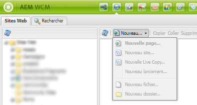
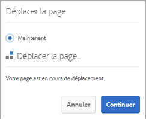
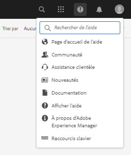
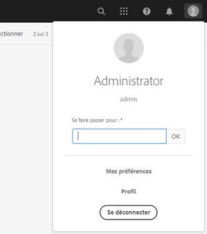

# [!DNL Adobe Experience Manager]Notes de mise à jour de la version 6.5 du Service Pack {#aem-service-pack-release-notes}

## Informations sur la version {#release-information}

| Produits | Adobe Experience Manager 6.5 |
| -------- | ---------------------------- |
| Version | 6.5.6.0 |
| Type | Version du Service Pack |
| Date | 3 septembre 2020 |
| URL de téléchargement | [Distribution de logiciels](https://experience.adobe.com/#/downloads/content/software-distribution/en/aem.html?package=/content/software-distribution/en/details.html/content/dam/aem/public/adobe/packages/cq650/servicepack/aem-service-pkg-6.5.6.zip) |

## Éléments inclus dans Adobe Experience Manager 6.5.6.0 {#what-s-included-in-aem}

Adobe Experience Manager 6.5.6.0 est une mise à jour importante qui comprend de nouvelles fonctionnalités, des améliorations clés demandées par les clients et des améliorations de performances, de stabilité et de sécurité, publiées depuis la version 6.5 d’ **avril 2019**. Il peut être installé sur Adobe Experience Manager 6.5.

Les principales fonctionnalités et améliorations introduites dans Adobe Experience Manager 6.5.6.0 comprennent :

* La publication des dossiers de contribution des ressources depuis le portail de marque vers les ressources du Experience Manager est désormais également prise en charge par le serveur proxy.

* Les groupes de dossiers privés générés automatiquement sont maintenant nettoyés lors de la suppression du dossier privé dans [!DNL Experience Manager Assets].

* La description des modificateurs dans l’éditeur de paramètres prédéfinis de [!UICONTROL visionneuse] vidéo a été mise à jour dans [!DNL Dynamic Media].

* Un nouveau paramètre de société est fourni pour refléter l’état du [!DNL Dynamic Media] connecteur.

* Les options par défaut pour `test` et `aiprocess` sont mises à jour vers `Thumbnail`, depuis `Rasterize` précédemment dans Contenu multimédia dynamique, afin de garantir que les utilisateurs doivent créer uniquement des vignettes et ignorer l’extraction de page et l’extraction de mot-clé.

* Préremplissez un formulaire adaptatif sur le client.

* Intégration du modèle de données de formulaire avec les API RESTful sur un serveur avec une implémentation SSL bidirectionnelle.

* Mise en cache améliorée pour les pages de formulaires adaptatifs converties.

* Prise en charge des balises de texte Adobe Sign dans le service de conversion Forms automatisé.

* Prise en charge des protocoles SMB 2 et SMB 3.

* Prise en charge de la conversion de formulaires colorés en formulaires adaptatifs à l’aide du service de conversion Forms automatisée.

* Le référentiel intégré (Apache Jackrabbit Oak) a été mis à niveau vers la version 1.22.4.

Pour une liste complète des fonctionnalités et améliorations introduites dans Experience Manager 6.5.6.0, voir [Nouveautés de Adobe Experience Manager 6.5 Service Pack 6](new-features-latest-service-pack.md).

Voici la liste des correctifs fournis dans la [!DNL Experience Manager] version 6.5.6.0.

### [!DNL Sites] {#sites-6560}

* Dans [!DNL Sites] ou [!DNL Screens], sélectionnez un projet, puis cliquez sur Publications [!UICONTROL de]gestion. Les utilisateurs ne peuvent pas avancer dans l’assistant [!UICONTROL Gérer les publications] en raison d’erreurs d’interface utilisateur. En particulier, l’option [!UICONTROL Publier] ne fonctionne pas (NPR-34099).
* La position par défaut d’iParsys (système de paragraphes hérité) n’est pas rétablie après avoir désélectionné les options [!UICONTROL Annuler l’héritage] ou [!UICONTROL Désactiver l’héritage] (NPR-34097).
* Si le `RolloutConfigManagerFactoryImpl` serveur ne peut pas charger une configuration de déploiement, il ne tente pas de charger les configurations manquantes. Elle renvoie les configurations mises en cache (NPR-34092).
* Dans le composant noyau de texte, après avoir utilisé l’option d’édition HTML source, la classe de la `em` balise est supprimée (NPR-34081).
* Après la mise à niveau de Experience Manager 6.3.3 vers Experience Manager 6.5.3, le processus de déploiement prend beaucoup plus de temps et le déploiement échoue avec une erreur de dépassement de délai (NPR-34049).
* Le `htmlwriter` code n&#39;incode pas les valeurs d&#39;attribut. L’annotation présente dans l’annotation XF est exportée avec des valeurs d’attribut décodées (à savoir `"` au lieu de `&#34`). Elle entraîne des problèmes du côté Cible avec le compositeur d’expérience visuelle qui utilise le fichier XF exporté (NPR-34048).
* Lorsque vous déplacez des pages dans [!DNL Experience Manager Sites], améliorez la journalisation pour capturer l&#39;échec de création de version avec raison (NPR-34014).
* Dans [!DNL Rich Text Editor] le cas où tout le texte est supprimé, la balise de paragraphe est également supprimée (NPR-33976).
* Lorsque la `siteadmin` page (dans l’interface utilisateur classique) est ouverte ou actualisée, les options du `New` menu sont désactivées (NPR-33949).

   

* Un [!DNL Content Fragment] ne peut pas être utilisé comme un `TemplatedResource` car il échoue `ContentFragmentUsePojo` (NPR-33911).
* Les opérations de déplacement synchrones et asynchrones peuvent entraîner des erreurs en raison de transferts simultanés. Les opérations de déplacement de page sont limitées au déplacement synchrone. Elle empêche le déplacement simultané des pages (NPR-33875).
* [!UICONTROL L’opération de gestion de la publication] pour répliquer du contenu de l’instance d’auteur à l’instance de publication échoue et génère une erreur JavaScript (NPR-33872).
* Lorsque plusieurs pages ou ressources sont sélectionnées pour créer des versions, la nouvelle version est créée uniquement pour la dernière page ou ressource sélectionnée (NPR-33866).
* Déplacez une page de plan avec des copies dynamiques dans un autre dossier. Lors du déplacement vers le dossier d&#39;origine, l&#39;opération de déplacement échoue sans aucune erreur (NPR-33864).
* Lorsque l&#39;action de déplacement est utilisée pour renommer une page Web dans la [!DNL Sites] Console, deux boîtes de dialogue se chevauchent à la dernière étape de l&#39;Assistant (NPR-33831).

   

* Les `cq:acLinks` propriétés et les `cq:acUUID` propriétés de [!DNL Adobe Campaign] la copie sont supprimées lors de l&#39;opération de copier-coller (NPR-33794).
* Lors d’une tentative de déploiement sur une page enfant d’une copie dynamique parent détachée, [!DNL Experience Manager] génère une exception de pointeur nulle (NPR-33676).
* Les [!DNL RTE] composants d’un conteneur de mise en page ne sont pas visibles lorsque le conteneur de mise en page est copié et collé à nouveau sur la page. Les [!DNL RTE] composants ne sont pas modifiables mais s&#39;affichent lors d&#39;une actualisation de page (NPR-33662).
* Lors du redimensionnement d’un composant de mise en page pour différents points d’arrêt (moyens et grands), la mise en page ne se comporte pas comme prévu (NPR-33608).
* En mode de modification en ligne dans [!DNL RTE], le fait de faire glisser une image ne fonctionne pas pour le composant Texte (NPR-33602).
* Il est possible de créer un composant dans une page de plan avec le même nom que le nom de la page. Au cours du déploiement, `_msm_moved` est suffixe pour renommer le composant. Le composant est déplacé à la fin du système [!UICONTROL de] paragraphes (NPR-33535).
* Lorsque offTime ou onTime est défini sur de nombreuses pages ou ressources, il est gourmand en ressources et ralentit le système au démarrage et à l&#39;arrêt (NPR-33482).
* Un utilisateur disposant d&#39;autorisations CRUD sur `/content/experience-fragment` ne peut pas supprimer un dossier (NPR-33436).
* Vous pouvez sélectionner [!UICONTROL HTML et JSON] comme option pour le format [!UICONTROL d’exportation] Adobe Target sur un dossier parent dans [!DNL Experience Fragments] la section. Les mêmes propriétés s’affichent dans l’interface utilisateur tactile pour les sous-dossiers de ce dossier parent. Cependant, dans CRXDE, par exemple, `cq:adobeTargetExportFormat`il affiche uniquement du code HTML au lieu de s’afficher `html,json` (NPR-33423).
* La fonction Publier ou Annuler la publication à partir d’un alias de page n’est pas prise en charge. Supprimez l&#39;option qui semble prétendre autrement (NPR-33415).
* Une balise spécifique peut être déplacée d’un emplacement à un autre dans [!DNL Experience Manager]. Il peut également être appliqué à différentes pages avant et après le déplacement. Lors de la modification des propriétés des pages, la balise n’est pas affichée pour modification, même si la balise est identique (NPR-33353).
* Un modèle de page ne s’affiche pas correctement lorsqu’un conteneur de mise en page est supprimé d’un modèle qui contient plusieurs conteneurs de mise en page (NPR-33347).
* Dans l’éditeur de modèles, essayez de supprimer un modèle utilisé par plus de 100 000 pages sous `/content/`. Une erreur s&#39;affiche sans message d&#39;erreur (NPR-33312).
* La redirection vers [!DNL Experience Manager] la page avec ancrage ne fonctionne pas sur l’instance d’auteur, car `PageRedirectServlets` elle place une chaîne de requête après un fragment d’URL ou une ancre (NPR-34288).
* La création d’une marque sous `/content/campaign` produit une structure qui n’autorise pas la création de campagnes. [!UICONTROL L’option Créer une marque] laisse la nouvelle marque sans possibilité de créer des [!UICONTROL Offres et des Activités] car il n’existe pas d’option [!UICONTROL Créer] (NPR-34113).
* Vous pouvez suspendre l’affichage [!DNL Live Copy] d’une page et l’héritage est rompu comme dans le mode Editeur. Dans les propriétés de la page, l’icône représentant l’héritage indique à tort que l’héritage existe et n’est pas rompu (NPR-34017).
* Les pages comportant de nombreuses références ne peuvent pas être déplacées de manière asynchrone et parfois l’opération de déplacement échoue (CQ-4297969).
* Une page Web comportant `/` un caractère dans l’URL ne répond plus lors de la création. Lorsqu’un composant est ajouté lors de la création, l’utilisation du processeur augmente et le navigateur cesse de répondre (CQ-4295749).
* En mode Parcourir, NVDA ne décrit pas une valeur sélectionnée dans l’option de menu Type/Taille. La cible d’action visuelle ne se concentre pas sur l’élément sélectionné. Les utilisateurs qui utilisent un lecteur d’écran ne peuvent pas utiliser le mode de navigation (CQ-4294993).
* Lors de la création d’une page Web, les utilisateurs peuvent sélectionner le modèle Page [!UICONTROL de] contenu. Dans l’onglet Médias  sociaux, les utilisateurs sélectionnent une variante [!UICONTROL XF]préférée. Pour sélectionner un fragment d’expérience en mode de navigation NVDA, les utilisateurs ne peuvent pas utiliser les touches du clavier (CQ-4292669).
* Mise à jour de la bibliothèque des barres de poignées vers la version 4.7.3 la plus sécurisée (NPR-34484).

### [!DNL Assets] {#assets-6560}

**Améliorations de l’accessibilité des ressources d’Experience Manager**

* Les utilisateurs peuvent désormais accéder aux options de l’interface utilisateur interactive et les cibler dans [!UICONTROL Références] liste de ressources à l’aide des touches du clavier (NPR-34115).

* Le lecteur d’écran annonce maintenant les options du filtre de recherche sous forme d’accordéons extensibles (NPR-34104).

* La page de recherche et la page de résultats de recherche ont désormais des titres plus informatifs pour mieux comprendre les utilisateurs de lecteurs d’écran (NPR-34093).

* Les lecteurs d’écran annoncent maintenant les options de suppression des balises sélectionnées dans l’onglet [!UICONTROL Simple] des boutons Propriétés de la ressource pour supprimer les balises sélectionnées (NPR-33972).

* Les éléments de chaque ligne de la vue de liste sont désormais correctement annoncés comme éléments de la même ligne par les lecteurs d’écran (NPR-33932).

* La sélection de l&#39;utilisateur lors de la navigation à l&#39;aide de la touche de tabulation passe désormais correctement à l&#39;option de fermeture de la prévisualisation de version (NPR-33863).

* La sélection des utilisateurs se déplace désormais correctement vers l&#39;icône de recherche après la fermeture d&#39;Omnisearch (NPR-33705).

* Les options de l’interface utilisateur exploitables ont désormais une mise au point visuelle plus visible et un contraste amélioré lorsque cette mise au point est effectuée à l’aide des touches du clavier. Par conséquent, les utilisateurs de clavier voyants peuvent maintenant différencier les zones ciblées (NPR-33542).

* La fonctionnalité de glisser-déplacer à l’aide du clavier fonctionne désormais correctement dans l’éditeur [!UICONTROL de Schéma de] métadonnées en mode de navigation du lecteur d’écran (CQ-4296326).

* Dans la boîte de dialogue de partage de liens, lorsque vous naviguez en mode de navigation, les lecteurs d’écran,

   * ne narrez plus les informations du tableau dès que la boîte de dialogue est chargée.

   * peut accéder à toutes les suggestions automatiques répertoriées.

   * décrivez maintenant les suggestions automatiques affichées pour l’adresse électronique/recherche  Ajoutée (CQ-4294232).

* L’utilisation de la touche Echap pour supprimer les icônes d’action rapide de la vue de miniature ne supprime plus la cible d’action du clavier du dernier élément ciblé (CQ-4293554).

* Le lecteur d’écran annonce maintenant des alternatives textuelles, qui décrivent leurs fonctionnalités, pour les icônes (comme les chevrons) au lieu de leurs noms littéraux (CQ-4272943).

* La sélection du clavier passe maintenant à [!UICONTROL Fenêtre déroulante], [!UICONTROL Zoom intégré], [!UICONTROL Bannière]Shoppable, [!UICONTROL Zoom_dark, Zoom_light, ZoomVertical_darket les options ZoomVertical_light lors de la navigation à l’aide de la touche de tabulation du clavier dans les détails de la ressource, les visionneuses de médias dynamiques (CQ-4290605).]

* [!UICONTROL L’option Enregistrer et fermer] de la page [!UICONTROL Propriétés] de la ressource est désormais accessible à l’aide des touches du clavier (NPR-34107).

* Les messages d’erreur dus à des combinaisons de nom d’utilisateur et de mot de passe incorrectes sur la page de connexion sont maintenant annoncés par les lecteurs d’écran chaque fois que l’erreur se produit (NPR-33722).

* Dans [!DNL Experience Manager] la section d’en-tête, lorsque vous naviguez en mode de navigation, le lecteur d’écran annonce maintenant,

   * modification automatique des suggestions dans [!UICONTROL Type pour effectuer une recherche] dans Omnisearch.

   * l’état développé ou réduit pour les options [!UICONTROL Solutions], [!UICONTROL Aide], [!UICONTROL Boîte de réception] et [!UICONTROL Utilisateur.]

   * le message d’état [!UICONTROL Recherche d’aide] qui s’affiche lorsque l’utilisateur entre une chaîne de recherche dans le champ [!UICONTROL Rechercher de l’aide] sous l’option [!UICONTROL Aide] .

   

   *Figure :[!UICONTROL Rechercher de l&#39;aide]dans le menu[!UICONTROL Aide]*

   * le message d’erreur si une valeur incorrecte est saisie dans le champ [!UICONTROL Faire passer l’identité comme] sous l’option [!UICONTROL Utilisateur] et que le focus se déplace correctement vers le champ de texte (NPR-33804).

   

   *Figure :[!UICONTROL Champ d’emprunt d’identité]dans le menu[!UICONTROL Utilisateur]de l’en-tête*

* L’utilisateur peut désormais déplacer la cible d’action à l’aide des touches du clavier dans :

   * [!UICONTROL Champ Rechercher/Ajouter l’adresse] de courriel dans la boîte de dialogue Partage [!UICONTROL de] liens.

   * [!UICONTROL Champ Ajouter un utilisateur ou un groupe] sous Groupe [!UICONTROL d’utilisateurs] fermé dans l’onglet [!UICONTROL Autorisations] du dossier [!UICONTROL Propriétés] (NPR-34452).

**Problèmes résolus dans les ressources Experience Manager**

[!DNL Adobe Experience Manager] 6.5.6.0 Le module Ressources résout les problèmes suivants :

* La prévisualisation des actifs de garantie marketing (tels que Brochure, Brochure et Carte de visite) créés à l’aide du modèle [!DNL Adobe InDesign] (INDD) ne conserve pas les sauts de ligne et les sauts de paragraphe (NPR-34268).

* L’extraction de texte des fichiers PDF téléchargés ne fonctionne pas et la recherche de texte intégral de certains mots dans un fichier PDF ne parvient pas à récupérer ce fichier PDF (NPR-34164).

   >[!NOTE]
   >Pour que ce correctif fonctionne, redémarrez votre instance Adobe Experience Manager après avoir installé le Service Pack 6.5.6.0.

* La chronologie des ressources de plusieurs pages affiche les annotations appliquées à toutes les sous-ressources lors de la navigation dans la ressource dans la vue de chronologie, au lieu d’afficher les annotations spécifiques aux sous-ressources spécifiques (NPR-34100).

* Les dossiers de ressources ne sont pas publiés à l’aide de l’option [!UICONTROL Gérer la publication] si les dossiers contiennent des ressources au format de fichier JavaScript, CSS ou JSON (NPR-34090).

* La désélection ou la suppression des balises ou filtres appliqués dans Omnisearch exécute la requête de recherche plusieurs fois, ce qui entraîne une augmentation du temps de recherche (NPR-34078).

* Dans la vue de carte lorsqu’un processus (sur une ressource d’un dossier) est en cours ou en attente, la page se recharge jusqu’à ce que le processus soit terminé ou terminé. Par conséquent, les auteurs ne peuvent pas travailler sur ces ressources dans le dossier pour lequel ils doivent faire défiler la page vers le bas (NPR-33986).

* Si l’utilisateur déplace un fichier publié vers un nouvel emplacement, le fichier est republié même si l’option [!UICONTROL Republier] est désélectionnée. Ceci conduit à la présence de nombreux actifs orphelins sur l’instance de publication. Cependant, le comportement par défaut est que l’opération de déplacement sur une ressource publiée annule automatiquement sa publication ; cette ressource est republiée si l’auteur sélectionne l’option [!UICONTROL Republier] lors du déplacement de la ressource (NPR-33934).

* La page [!UICONTROL Déplacer des ressources] pour les ressources des collections ne charge pas tout le contenu HTML, par exemple l’option [!UICONTROL Modifier/Republier] . Par conséquent, les utilisateurs ne peuvent pas effectuer l’opération de déplacement (NPR-33860).

* Le déplacement d’une ressource et l’ajout de caractères spéciaux dans le nom et le titre des ressources déplacées crée un dossier supplémentaire (portant le même nom) au nouvel emplacement de la ressource (NPR-33826).

* [!UICONTROL Le bouton Télécharger] pour un fichier est désactivé lorsque l’option [!UICONTROL Courriel] est sélectionnée dans la boîte de dialogue [!UICONTROL Télécharger] (NPR-33730).

* L’erreur &quot;Request-URI too long&quot; est observée lors des opérations en bloc sur des ressources, telles que la modification des métadonnées en masse (NPR-33723).

* Une erreur JavaScript est observée et les utilisateurs ne peuvent pas sélectionner ou supprimer les choix générés dans le champ [!UICONTROL déroulant] par [!UICONTROL Ajoute via la fonctionnalité de chemin] JSON dans l’éditeur [!UICONTROL de formulaire du Schéma de métadonnées du]dossier, si le fichier JSON téléchargé comporte de l’espace ou des caractères spéciaux (NPR-33712).

* Les rendus statiques des ressources ne sont pas mis à jour lorsque la ressource est mise à jour à l’aide de l’option [!UICONTROL Ouvrir] [!DNL desktop app] ou [!DNL Adobe Asset Link] et sont synchronisés de nouveau sur [!DNL Adobe Experience Manager] (CQ-4296279).

* Dans la vue de colonne, l’opération de déplacement sur un ensemble de ressources déplace également les ressources qui ont été sélectionnées avant d’utiliser l’option [!UICONTROL Filtrer] pour elles. Notez que l&#39;utilisation de l&#39;option [!UICONTROL Filtre] désélectionne la sélection précédente (NPR-34018).

* Les barres obliques inverses sont ajoutées avant les caractères spéciaux dans les suggestions de recherche de ressources, qui portent des caractères spéciaux dans leur nom (NPR-33834).

* Lors de la création de règles pour la liste déroulante dans le formulaire [!UICONTROL de Schéma]de métadonnées de [!UICONTROL dossiers, l’utilisateur ne peut pas sélectionner de valeurs dans la colonne Choix] dechamp (CQ-4297530).

* La copie d’exécution du modèle de flux de travaux personnalisé des ressources (créée dans `/var/workflow/models/dam`) est supprimée lorsque vous installez la version 6.5 Service Pack 5 ou les versions antérieures sur la version 6.5 GA (NPR-34532).

   >[!NOTE]
   >
   >La mise à niveau vers la version [!DNL Experience Manager] 6.5 Service Pack 6 ne récupère pas votre copie d’exécution si celle-ci est supprimée lors de l’installation de la version [!DNL Experience Manager] 6.5 Service Pack 5 ou des versions antérieures sur la version 6.5 GA. Pour récupérer la copie d’exécution, synchronisez la copie d’heure de conception du modèle de processus avec la copie d’exécution à l’aide de l’API HTTP :
   `<designModelPath>/jcr:content.generate.json`.

**Problèmes résolus dans Contenu multimédia dynamique**

* Si l’utilisateur définit les paramètres de codage dans les modifications après la création du profil vidéo, les paramètres de recadrage intelligent sont supprimés des profils vidéo (CQ-4299177).

* Les ressources clignotent au chargement de la page lorsque l’utilisateur bascule entre les options du rail latéral (par exemple, [!UICONTROL Aperçu], [!UICONTROL Chronologie], [!UICONTROL Visionneuses]) sur la page des détails de la ressource (NPR-34235).

* Les problèmes suivants ont été observés avec le travail de retraitement :

   * L&#39;ID de tâche est manquant dans le descripteur de tâche renvoyé par la tâche de retraitement.

   * Retraiter la tâche pour les journaux vidéo uniquement le nom de fichier et non le chemin d’accès complet.

   * La tâche de retraitement n’a pas d’option permettant de définir le type de ressource comme statique.

   * `ExcludeFromAVS` n’est pas fournie (CQ-4298401).

* La fonctionnalité de recadrage dynamique échoue avec une erreur lorsque le profil d’image est ajouté à un dossier ayant plusieurs proportions (par exemple, 11) (NPR-34082).

* Le processus de mise à jour des actifs de gestion des actifs est déclenché lorsque l’utilisateur fait défiler la page d’archivage [!UICONTROL des] flux de travaux sur l’onglet [!UICONTROL Workflow] dans [!UICONTROL Outils] dans [!DNL Adobe Experience Manager] configuré avec Dynamic Media Scene7 (CQ-4299727).

* Les symboles de l’onglet [!UICONTROL Comportement] de l’éditeur [!UICONTROL de paramètres prédéfinis de la] visionneuse ne sont pas localisés (CQ-4299026).

* La vue principale affiche l’image dans une disposition incorrecte qui ne tient pas dans la visionneuse, si celle-ci est en mode réactif (CQ-4298293).

* Les modifications apportées aux paramètres d’image prédéfinis dans [!UICONTROL Adobe Experience Manager] ne sont pas synchronisées avec Scene7 Publishing System (CQ-4299713).

### [!DNL Commerce] {#commerce-6560}

* Les liens vers les ressources provenant de produits ne sont pas refactorisés lors du déplacement des ressources (NPR-34098).

### Plate-forme {#platform-6560}

* Impossible de télécharger les journaux à l&#39;aide de l&#39;outil Diagnostic sur une instance de Experience Manager mise à niveau (NPR-34336).
* La mise à niveau échoue avec une erreur en raison des dépendances d’une version spécifique du package `cq-wcm-api` foundation (CQ-4300520).
* Les valeurs par défaut des paramètres **[!UICONTROL Connect Timeout]** et **[!UICONTROL Socket Timeout]** pour la configuration de l’agent par défaut (publication) ne sont pas spécifiées (NPR-33707).
* Les mises à jour de la configuration de mappage sous `/etc/map.publish` ne sont pas répercutées sur les pages du site (NPR-34015).
* [La documentation](https://helpx.adobe.com/experience-manager/6-5/sites/developing/using/reference-materials/javadoc/com/day/cq/tagging/package-summary.html) de référence d’API n’inclut pas la documentation du `com.day.cq.tagging` package (CQ-4295864).

### Interface utilisateur {#ui-6560}

* L’interface du navigateur de déchargement n’affiche pas toutes les rubriques de tâches (NPR-34308).
* L&#39;interface du navigateur de configuration n&#39;affiche pas toutes les configurations (NPR-33644).
* Lorsque vous appuyez sur la `Esc` touche lorsque vous recherchez des utilisateurs à faire passer pour des utilisateurs, la boîte de dialogue **[!UICONTROL Utilisateur]** se ferme à la place de la liste utilisateur (NPR-34084).

### Intégrations {#integrations-6560}

* Les Activités dont le nom est long ne sont pas synchronisées avec [!DNL Adobe Target] (NPR-34254).

### Projets de traduction {#translation-6560}

* Un projet de traduction n&#39;est pas créé si l&#39;utilisateur `authorizableID` inclut des caractères spéciaux (NPR-33828).

### Sling {#sling-6560}

* Les fonctionnalités de contrôle d’intégrité et de détection de schémas se chevauchent. Par conséquent, la vérification de la santé est supprimée du produit (NPR-33928).

### WCM {#wcm-6560}

* Composants de base : lorsque vous ajoutez un composant d&#39;image de base à une page et référencez une image, l&#39; `Undo` opération ne fonctionne pas (NPR-34516).

* Impossible d&#39;utiliser l&#39;opération de déplacement de page (CQ-4303028).

### [!DNL Communities] {#communities-6560}

* Le partage d&#39;un billet sur les médias sociaux montre une option obsolète, Google+ (NPR-33877).

* Le membre de la communauté ne peut pas modifier le modèle de groupe ou d&#39;autres paramètres de fonction de groupe (NPR-33530).

* Les balises d’hyperlien sur les images ne sont pas générées correctement dans une publication de forum (NPR-33464).

* Les échecs d’accessibilité sont identifiés dans la fonction Affectation de communauté (NPR-33442).

* Les utilisateurs existants d’un groupe de la communauté ajouté via la console d’administration sont supprimés de la liste d’utilisateurs lors de toute modification de la console de groupe de la communauté (NPR-34315).

<!--
* Tag filters are vulnerable to sensitive information disclosure (NPR-33868).
-->

### [!DNL Forms] {#forms-6560}

>[!NOTE]
>
>[!DNL Experience Manager] Le Service Pack n’inclut pas de correctifs pour [!DNL Forms]. They are delivered using a separate [!DNL Forms] add-on package. In addition, a cumulative installer is released that includes fixes for [!DNL Experience Manager Forms] on JEE. For more information, see [Install AEM Forms add-on](#install-aem-forms-add-on-package) and [Install AEM Forms on JEE](#install-aem-forms-jee-installer).

**Formulaires adaptatifs**

* S’il manque un fragment de formulaire adaptatif, le rendu du formulaire adaptatif échoue (NPR-34302).

* La description du contenu d’aide d’un champ de formulaire adaptatif affiche une balise HTML de paragraphe (NPR-34116).

* Lorsque vous sélectionnez la propriété **[!UICONTROL Revalider sur le serveur]** , le formulaire adaptatif ne peut pas être envoyé (NPR-33876).

* L’action d’envoi **[!UICONTROL Envoyer vers le point de terminaison]** REST ne fonctionne pas pour un formulaire adaptatif (CQ-4299044).

* Accessibilité : Lorsque vous tentez d’envoyer un formulaire adaptatif sans télécharger de pièce jointe pour un champ obligatoire, la cible d’action ne se déplace pas automatiquement vers le champ de pièce jointe (CQ-4298065).

* Lorsque vous ajoutez des rangées à un tableau d’un formulaire adaptatif, l’ **[!UICONTROL Ajoute en haut]** et l’ **[!UICONTROL Ajoute en bas]** n’affichent pas les résultats appropriés (CQ-4297511).

* Le script de validation [!UICONTROL de] valeur est déclenché incorrectement, ce qui entraîne une perte de données dans un formulaire adaptatif (CQ-4296874).

* Le sélecteur de dates ne fonctionne pas correctement pour les formulaires adaptatifs localisés (NPR-34333).

* Lorsque le nom de fichier contient un trait de soulignement ou un espace, vous ne pouvez pas joindre le fichier à un formulaire adaptatif (CQ-4301001).

* Lorsqu’un panneau répétable imbriqué comporte plus d’occurrences que son parent, toutes les occurrences de ce panneau répétable imbriqué ne sont pas préremplies (NPR-33666).

* Les formulaires adaptatifs disposent de certains résolveurs de ressources ouverts. Cela entraîne des échecs d’envoi. Le problème se produit par intermittence (CQ-4299407).

**Processus**

* Lorsqu’un approbateur de processus télécharge une pièce jointe, celle-ci est renommée `undefined` (NPR-33699).

* [!DNL Experience Manager] Échec de l&#39;opération de purge du flux de travail et affiche le message d&#39;erreur suivant (NPR-33575) :

   `java.lang.UnsupportedOperationException: The query read more than 500000 nodes in memory`

* [!DNL Experience Manager Forms] pour [!DNL Windows] arrêter de répondre après l’envoi d’un formulaire (NPR-34409).

* Lorsque vous installez AEM Service Pack, la liste **Tâches** des éléments ne s’affiche pas sous forme de liens. Le texte des éléments **Tâches** comprend des balises HTML (NPR-34317).

**Communication interactive**

* Lorsque vous incluez un fragment de document de texte avec des composants répétables imbriqués, l’enregistrement de la communication interactive échoue (NPR-34095).

**Correspondence Management**

* Lorsque vous modifiez un fragment de document de texte qui inclut des valeurs de dictionnaire de données, l’interface utilisateur de l’agent ne répond plus (NPR-33930).

* Le fait de copier-coller du contenu d’un [!DNL Microsoft Word] document dans un fragment de document de texte d’une lettre entraîne des problèmes de formatage (NPR-33536).

**Services de documents**

* Lorsque vous générez un fichier PDF à partir d’un fichier XDP à l’aide des services Output et Forms, il manque et le texte se chevauche (NPR-34237, CQ-4299331).

* Lorsque vous convertissez un fichier HTML au format PDF, l’ `MaxReuseCount` attribut n’est pas configurable (NPR-33470).

* Lorsque vous téléchargez un fichier PDF contenant des fonctions interactives Reader Extensions, vous ne pouvez pas ajouter de pièce jointe au fichier PDF à l’aide de [!DNL Adobe Reader] (NPR-33729).

**Document Security**

* Impossible d&#39;exécuter l&#39;opération Sign avec des certificats basés sur HSM dans un fichier PDF après avoir installé [!DNL Experience Manager] Service Pack (NPR-34310).

**Designer**

* Impossible d’ouvrir XForms dans Designer version 6.5.x (CQ-4295322).

* Lorsque vous ouvrez Designer, l’écran de bienvenue affiche une année incorrecte (CQ-4295289).

* Lorsque vous effectuez une installation [!DNL Acrobat DC] sur le serveur, l’option **[!UICONTROL Diffuser le formulaire]** est inactive (CQ-4296304).

## Install 6.5.6.0 {#install}

**Conditions requises**

* AEM 6.5.6.0 requires AEM 6.5. See [upgrade documentation](/help/sites-deploying/upgrade.md) for detailed instructions.
* Le téléchargement du Service Pack est disponible sur Adobe [Software Distribution](https://experience.adobe.com/#/downloads/content/software-distribution/en/aem.html).
* Lors d’un déploiement avec MongoDB et plusieurs instances, installez AEM 6.5.6.0 sur l’une des instances d’auteur à l’aide du gestionnaire de modules.
* Avant d&#39;installer, effectuez un instantané ou une nouvelle sauvegarde de votre instance AEM.
* Redémarrez l’instance avant l’installation. Cela est nécessaire uniquement lorsque l’instance reste en mode de mise à jour (ce qui est le cas lorsque l’instance vient d’être mise à jour depuis une version antérieure). Toutefois, cela est recommandé si l’instance s’est exécutée pendant une longue durée.

>[!NOTE]
>
>adobe ne recommande pas de supprimer ou de désinstaller le package Adobe Experience Manager 6.5.6.0.

### Installation du Service Pack {#install-service-pack}

Effectuez les étapes suivantes pour installer le Service Pack sur une instance Adobe Experience Manager 6.5 existante :

1. Téléchargez le Service Pack depuis [Software Distribution](https://experience.adobe.com/#/downloads/content/software-distribution/en/aem.html?package=/content/software-distribution/en/details.html/content/dam/aem/public/adobe/packages/cq650/servicepack/aem-service-pkg-6.5.6.zip).

1. Open Package Manager and click **[!UICONTROL Upload Package]** to upload the package. Pour savoir comment l’utiliser, voir [Package Manager](https://docs.adobe.com/content/help/fr-FR/experience-manager-65/administering/contentmanagement/package-manager.html).

1. Select the package and click **[!UICONTROL Install]**.

>[!NOTE]
>
>La boîte de dialogue de l’interface utilisateur de Package Manager se ferme parfois lors de l’installation du Service Pack. adobe vous recommande d’attendre que les journaux d’erreurs se stabilisent avant d’accéder au déploiement. Attendez les journaux spécifiques liés à la désinstallation du lot de mise à jour avant de vous assurer que l&#39;installation est réussie. Typically, this happens on [!DNL Safari] but can intermittently happen on any browser.

**Installation automatique**

Il existe deux manières d’installer automatiquement Adobe Experience Manager 6.5.6.0 sur une instance de travail :

R. Placez le package dans `../crx-quickstart/install` un dossier lorsque le serveur est disponible en ligne. Le package est automatiquement installé.

B. Utilisez l’API [HTTP de Package Manager](https://docs.adobe.com/content/docs/en/crx/2-3/how_to/package_manager.html). Utilisez `cmd=install&recursive=true` pour installer les packages imbriqués.

>[!NOTE]
>
>Adobe Experience Manager 6.5.6.0 ne prend pas en charge l’installation des Bootstrap.

**Validation de l’installation**

1. La page d’informations sur le produit (`/system/console/productinfo`) affiche la chaîne de version mise à jour `Adobe Experience Manager (6.5.6.0)` sous Produits installés.

1. All OSGi bundles are either **[!UICONTROL ACTIVE]** or **[!UICONTROL FRAGMENT]** in the OSGi Console (Use Web Console: `/system/console/bundles`).

1. The OSGI bundle `org.apache.jackrabbit.oak-core` is version 1.22.3 or higher (Use Web Console: `/system/console/bundles`).

Pour connaître les plates-formes certifiées pour fonctionner avec cette version, voir les exigences [](/help/sites-deploying/technical-requirements.md)techniques.

### Installation du module complémentaire Adobe Experience Manager Forms {#install-aem-forms-add-on-package}

>[!NOTE]
>
>Passez cette étape si vous n’utilisez pas AEM Forms. Les correctifs dans Adobe Experience Manager Forms sont fournis par le biais d’un module complémentaire distinct.

1. Assurez-vous d’avoir installé le Service Pack de Adobe Experience Manager.
1. Download the corresponding Forms add-on package listed at [AEM Forms releases](https://helpx.adobe.com/fr/aem-forms/kb/aem-forms-releases.html) for your operating system.
1. Install the Forms add-on package as described in [Installing AEM Forms add-on packages](../forms/using/installing-configuring-aem-forms-osgi.md#install-aem-forms-add-on-package).

### Installation de Adobe Experience Manager Forms on JEE {#install-aem-forms-jee-installer}

>[!NOTE]
>
>Passez cette étape si vous n’utilisez pas AEM Forms sous JEE. Les correctifs d’Adobe Experience Manager Forms on JEE sont diffusés par le biais d’un programme d’installation distinct.

For information about installing the cumulative installer for Experience Manager Forms on JEE and post-deployment configuration, see the [release notes for patch 0018](jee-patch-installer-65.md).

### UberJar {#uber-jar}

UberJar pour Experience Manager 6.5.6.0 est disponible dans le référentiel [](https://repo.maven.apache.org/maven2/com/adobe/aem/uber-jar/6.5.6/)Adobe Public Maven.

Pour utiliser UberJar dans un projet Maven, voir [comment utiliser UberJar](/help/sites-developing/ht-projects-maven.md) et inclure la dépendance suivante dans le POM de votre projet :

```shell
<dependency>
      <groupId>com.adobe.aem</groupId>
      <artifactId>uber-jar</artifactId>
      <version>6.5.6</version>  
      <scope>provided</scope>
</dependency>
```

## Fonctionnalités obsolètes {#removed-deprecated-features}

Cette section liste les fonctionnalités et fonctionnalités qui ont été marquées comme obsolètes avec AEM 6.5.6.0. Les fonctionnalités qui doivent être supprimées dans une version ultérieure sont définies comme obsolètes en premier, avec une autre option à utiliser.

Il est conseillé aux clients de vérifier s’ils utilisent la fonctionnalité ou la fonctionnalité dans leur déploiement actuel et de planifier la modification de leur mise en oeuvre pour utiliser l’autre option.

| Zone | Fonctionnalité | Remplacement |
|---|---|---|
| Intégrations | L’écran d’inclusion **[!UICONTROL des services]** AEM Cloud est obsolète. L’intégration des AEM et des Cibles étant mise à jour dans AEM 6.5 pour prendre en charge l’API Target Standard, qui utilise l’authentification via l’Adobe IMS et E/S, et le rôle croissant du lancement d’Adobe pour l’instrumentalisation de pages de données d’analyse et de personnalisation, l’assistant d’inclusion est devenu non pertinent du point de vue fonctionnel. | Configurez les connexions système, l’authentification IMS Adobe et les intégrations d’E/S Adobe via les services cloud AEM correspondants. |
| Connecteurs | L’Adobe JCR Connector for Microsoft SharePoint 2010 et Microsoft SharePoint 2013 est obsolète pour AEM 6.5. | N/A |

## Problèmes connus {#known-issues}

* Si vous installez [!DNL Experience Manager] 6.5 Service Pack 5 ou des versions antérieures sur la version GA 6.5, la copie d’exécution du modèle de flux de travaux personnalisé de vos ressources (créée dans `/var/workflow/models/dam`) est supprimée.
Pour récupérer votre copie d’exécution, l’Adobe suggère de synchroniser la copie d’heure de conception du modèle de processus personnalisé avec sa copie d’exécution à l’aide de l’API HTTP :
   `<designModelPath>/jcr:content.generate.json`.

* Contactez l’assistance à l’Adobe si vous rencontrez des problèmes lors de la modification et de la création de règles en cascade dans l’éditeur [!UICONTROL Forms de Schéma de métadonnées de] dossiers et l’éditeur [!UICONTROL de Schéma de métadonnées à l’aide de la boîte de dialogue] Définir une règle  . Notez que les règles déjà créées et enregistrées fonctionnent comme prévu.

* If a folder in the hierarchy is renamed in [!DNL Experience Manager Assets] and the nested folder containing an asset is published to [!DNL Brand Portal], the title of the folder is not updated in [!DNL Brand Portal] until the root folder is published again.

* Lorsqu’un utilisateur sélectionne pour la première fois un champ dans un formulaire adaptatif, l’option permettant d’enregistrer une configuration ne s’affiche pas dans le navigateur de propriétés. La sélection pour configurer un autre champ du formulaire adaptatif dans le même éditeur résout le problème.

* Si l’assistant de configuration [!UICONTROL des ressources] connectées renvoie un message d’erreur 404 après l’installation, réinstallez manuellement les `cq-remotedam-client-ui-content` packages et `cq-remotedam-client-ui-components` packages à l’aide de Package Manager.

* Les erreurs et messages d’avertissement suivants peuvent s’afficher lors de l’installation de AEM 6.5.x.x :
   * « Lorsque l’intégration de Target est configurée dans AEM à l’aide de l’API Target Standard (authentification IMS), l’exportation de fragments d’expérience vers Target entraîne la création de types d’offres incorrects. Au lieu du type « Fragment d’expérience » / source « Adobe Experience Manager », Target crée plusieurs offres avec le type « HTML » / source « Adobe Target Classic ».
   * `com.adobe.granite.maintenance.impl.TaskScheduler`: Aucune fenêtre de maintenance n’a été trouvée sur granite/operations/maintenance.
   * La validation côté serveur du formulaire adaptatif échoue lorsque des fonctions d’agrégat telles que SUM, MAX et MIN sont utilisées. CQ-4274424
   * `com.adobe.granite.maintenance.impl.TaskScheduler` - Aucune fenêtre de maintenance n’a été trouvée sur granite/operations/maintenance.
   * La zone réactive d’une image interactive Contenu multimédia dynamique n’est pas visible lors de la prévisualisation du fichier via la visionneuse de bannières modifiables.

## OSGi bundles and content packages included {#osgi-bundles-and-content-packages-included}

Les documents de texte suivants liste les lots OSGi et les packages de contenu inclus dans AEM 6.5.6.0 :

* [Liste des lots OSGi inclus dans AEM 6.5.6.0](assets/6560_bundles.txt)

* [Liste des packages de contenu inclus dans AEM 6.5.6.0](assets/6560_packages.txt)

## Restricted sites {#restricted-sites}

Ces sites sont réservés aux clients. Si vous êtes client et avez besoin d’un accès, contactez votre responsable de compte Adobe.

* [Téléchargement du produit à l’adresse licensing.adobe.com](https://licensing.adobe.com/)
* [Contactez l&#39;assistance](https://docs.adobe.com/content/help/en/customer-one/using/home.html)clientèle Pour plus d&#39;informations sur l&#39;accès au portail d&#39;assistance, consultez [Accès au portail](https://helpx.adobe.com/fr/experience-manager/kb/accessing-aem-support-portal.html)d&#39;assistance.

>[!MORELIKETHIS]
>
>* [Notes de mise à jour d’AEM 6.5](/help/release-notes/release-notes.md)
>* [Page de produits AEM ](https://www.adobe.com/fr/marketing/experience-manager.html)
>* [Documentation d’AEM 6.5](https://helpx.adobe.com/fr/support/experience-manager/6-5.html)
>* Subscribe to [Adobe priority product updates](https://www.adobe.com/subscription/priority-product-update.html)

