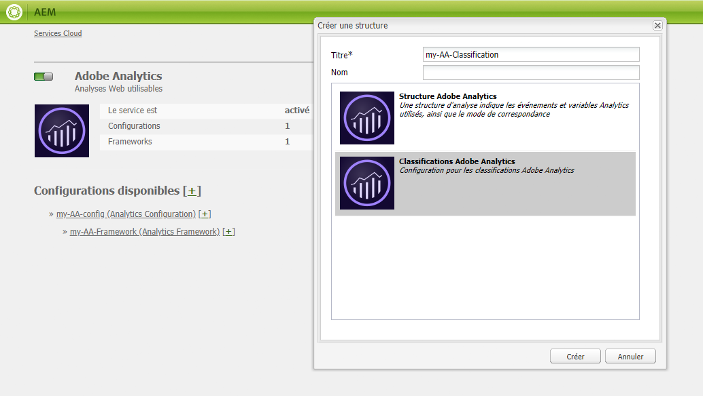
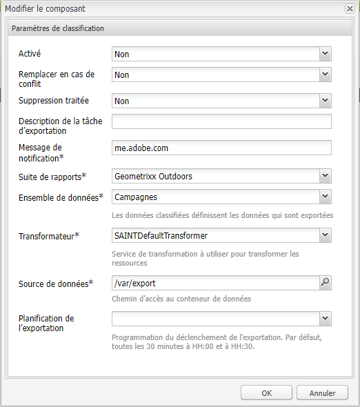

# Classifications Adobe{#adobe-classifications}

Adobe Classifications exports classifications data to [Adobe Analytics](/help/sites-administering/adobeanalytics.md) in a scheduled manner. L’exportateur est une implémentation de **com.adobe.cq.scheduled.exporter.Exporter**.

Pour configurer cela :

1. Avec la **Navigation**, sélectionnez **Outils**, **Services cloud**, puis **Services cloud hérités**.
1. Accédez à **Adobe Analytics** et sélectionnez **Afficher les configurations**.
1. Click the **[+]** link next to your Adobe Analytics configuration.

1. Dans la boîte de dialogue **Créer une structure** :

   * Spécifiez un **Titre**.
   * Vous pouvez éventuellement spécifier le **Nom**, pour le nœud qui stocke les détails de la structure dans le référentiel.
   * Select **Adobe Analytics Classifications**
   puis cliquez sur **Créer**.

   

1. La boîte de dialogue Paramètres **des** classifications s’ouvre pour modification.

   

   Les propriétés sont par exemple les suivantes :

   | **Field (Champ)** | **Description** |
   |---|---|
   | Activé | Sélectionnez **Oui** pour activer les paramètres d’Adobe Classifications. |
   | Remplacer en cas de conflit | Sélectionnez **Oui** pour remplacer toute collision de données. Par défaut, cette option est définie sur **Non**. |
   | Suppression traitée | Si elle est définie sur **Oui**, supprime les nœuds traités après leur exportation. La valeur par défaut est **Faux**. |
   | Description de la tâche d’exportation | Saisissez une description pour la tâche d’Adobe Classifications. |
   | Message de notification | Entrez une adresse électronique pour la notification des classifications Adobe. |
   | Suite de rapports | Saisissez la suite de rapports pour laquelle exécuter la tâche d’importation. |
   | Ensemble de données | Saisissez l’ID de relation de l’ensemble de données pour lequel exécuter la tâche d’importation. |
   | Transformateur | Dans le menu déroulant, sélectionnez une mise en œuvre de transformateur. |
   | Source de données | Accédez au chemin du conteneur de données. |
   | Planification de l’exportation | Sélectionnez la planification pour l’exportation. Par défaut, elle a lieu toutes les 30 minutes. |

1. Cliquez sur **OK** pour enregistrer vos paramètres.

## Modification de la taille des pages {#modifying-page-size}

Les enregistrements sont traités par pages. Par défaut, les classifications Adobe créent des pages d’un format de page de 1 000.

Une page peut avoir une taille maximale de 2 5000 par définition dans les classifications Adobe et peut être modifiée à partir de la console Felix. Lors de l’exportation, les classifications Adobe verrouillent le noeud source pour empêcher les modifications simultanées. Le nœud est déverrouillé après l’exportation, en cas d’erreur, ou lorsque la session est fermée.

Pour modifier la taille de page :

1. Navigate to the OSGI console at **https://&lt;host>:&lt;port>/system/console/configMgr** and select **Adobe AEM Classifications Exporter**.

   

1. Mettez à jour **Export Page Size** (Exporter la taille de page) selon les besoins, puis cliquez sur **Save** (Enregistrer).

## SAINTDefaultTransformer {#saintdefaulttransformer}

>[!NOTE]
>
>Auparavant, Adobe Classifications était appelé exportateur SAINT.

Un exportateur peut utiliser un transformateur pour transformer les données d’exportation vers un format spécifique. For Adobe Classifications, a subinterface `SAINTTransformer<String[]>` implementing the Transformer interface has been provided. This interface is used to restrict the data type to `String[]` which is used by the SAINT API and to have a marker interface to find such services for selection.

Dans l’implémentation par défaut SAINTDefaultTransformer, les ressources enfants de la source d’exportation sont traitées comme des enregistrements avec des noms de propriété comme clés et des valeurs de propriété comme valeurs. La colonne **Clé** est automatiquement ajoutée en tant que première colonne ; sa valeur est le nom du nœud. Namespaced properties (containing `:`) are disregarded.

*Structure de nœud :*

* id-classification `nt:unstructured`

   * 1)`nt:unstructured`

      * Product = My Product Name (chaîne)
      * Price = 120.90 (chaîne)
      * Size = M (chaîne)
      * Color = black (chaîne)
      * Color^Code = 101 (chaîne)

**En-tête et enregistrement SAINT :**

| **Clé** | **Produit** | **Prix** | **Taille** | **Couleur** | **Couleur^Code** |
|---|---|---|---|---|---|
| 1 | Mon nom de produit | 120.90 | M | black | 101 |

Les propriétés sont par exemple les suivantes :

<table>
 <tbody>
  <tr>
   <td><strong>Chemin de la propriété</strong></td>
   <td><strong>Description</strong></td>
  </tr>
  <tr>
   <td>transformer</td>
   <td>Nom de classe d’une mise en œuvre SAINTTransformer</td>
  </tr>
  <tr>
   <td>email</td>
   <td>Adresse e-mail des notifications.</td>
  </tr>
  <tr>
   <td>reportsuites</td>
   <td>Les ID des suites de rapports pour lesquelles exécuter la tâche d’importation. </td>
  </tr>
  <tr>
   <td>dataset</td>
   <td>ID de relation de l’ensemble de données pour lequel exécuter la tâche d’importation. </td>
  </tr>
  <tr>
   <td>description</td>
   <td>Description de la tâche.   </td>
  </tr>
  <tr>
   <td>overwrite</td>
   <td>Indicateur pour remplacer les collisions de données. La valeur par défaut est <strong>false</strong>.</td>
  </tr>
  <tr>
   <td>checkdivisions</td>
   <td>Indicateur pour vérifier la compatibilité des suites de rapports. La valeur par défaut est <strong>true</strong>.</td>
  </tr>
  <tr>
   <td>deleteprocessed</td>
   <td>Indicateur pour supprimer les nœuds traités après l’exportation. La valeur par défaut est <strong>false</strong>.</td>
  </tr>
 </tbody>
</table>

## Automatisation de l’exportation d’Adobe Classifications {#automating-adobe-classifications-export}

Vous pouvez créer votre propre workflow, de sorte que toutes les nouvelles importations le lancent afin de créer les données appropriées et structurées dans **/var/export/** pour qu’elles puissent être exportées dans Adobe Classifications.
