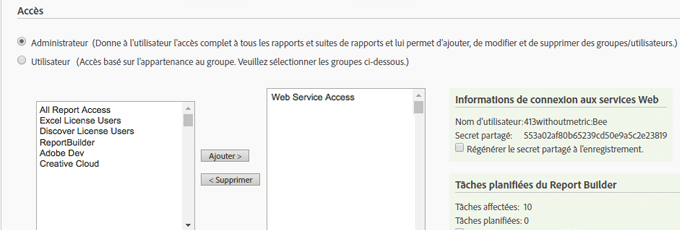
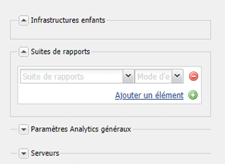
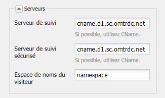

# Connexion à Adobe Analytics et création de structures {#connecting-to-adobe-analytics-and-creating-frameworks}

Pour effectuer le suivi des données Web de vos pages AEM dans Adobe Analytics, créez une configuration Cloud Service Adobe Analytics Adobe et une structure Analytics :

* **Configuration Adobe Analytics :** Informations relatives à votre compte Adobe Analytics. La configuration Adobe Analytics permet à AEM de se connecter à Adobe Analytics. Créez une configuration Adobe Analytics pour chaque compte que vous utilisez.
* **Cadre de Analytics en Adobe :** Ensemble de mappages entre les propriétés de la suite de rapports Adobe et les variables CQ. Utilisez une structure pour configurer la façon dont les données de votre site web renseignent vos rapports Adobe Analytics. Les cadres sont associés à une configuration Adobe Analytics. Vous pouvez créer plusieurs structures pour chaque configuration.

Lorsque vous associez une page Web à une structure, celle-ci effectue le suivi pour cette page et ses descendants. Les vues de page peuvent ensuite être récupérées dans Adobe Analytics et affichées dans la console Sites.

## Conditions préalables {#prerequisites}

### Compte Adobe Analytics {#adobe-analytics-account}

Pour effectuer le suivi des données AEM dans Adobe, vous devez disposer d’un compte d’Adobe Marketing Cloud Adobe valide.

Le compte Adobe Analytics doit :

* Disposer d’autorisations **Administrateur**
* Être affecté au groupe d’utilisateurs **Accès aux services web.**

>[!CAUTION]
>
>Le fait de fournir des autorisations **Administrateur** (dans Adobe Analytics) ne suffit pas pour permettre à l’utilisateur de se connecter d’AEM à Adobe Analytics. Le compte doit également disposer d’autorisations **Accès aux services web**.

Avant de commencer, assurez-vous que vos informations d’identification vous permettent de vous connecter à Adobe Analytics. Via :

* [https://marketing.adobe.com](https://marketing.adobe.com)

* [https://sc.omniture.com/login/](https://sc.omniture.com/login/)

### Configuration d’AEM pour utiliser vos centres de données Adobe Analytics {#configuring-aem-to-use-your-adobe-analytics-data-centers}

Adobe Analytics [data centers](https://developer.omniture.com/en_US/content_page/concepts-terminology/c-how-is-data-stored) collect, process and store data associated with your Adobe Analytics report suite. Vous devez configurer AEM pour qu’il utilise le centre de données qui héberge votre suite de rapports Adobe Analytics. Le tableau suivant répertorie les centres de données disponibles et leur URL.

| Centre de données | URL |
|---|---|
| San Jose | https://api.omniture.com/admin/1.4/rest/ |
| Dallas | https://api2.omniture.com/admin/1.4/rest/ |
| Londres | https://api3.omniture.com/admin/1.4/rest/ |
| Singapour | https://api4.omniture.com/admin/1.4/rest/ |
| Oregon | https://api5.omniture.com/admin/1.4/rest/ |

AEM utilise le centre de données de San Jose (https://api.omniture.com/admin/1.4/rest/) par défaut.

Utilisez la [console Web pour configurer le](/help/sites-deploying/configuring-osgi.md#osgi-configuration-with-the-web-console) **client HTTP Adobe AEM Analytics du lot OSGi**. Add the **Data Center URL** for the data center that hosts a report suite for which your AEM pages collect data.

1. Ouvrez la console Web dans votre navigateur web. ([https://localhost:4502/system/console/configMgr](https://localhost:4502/system/console/configMgr))
1. Entrez vos informations d’identification pour accéder à la console.

   >[!NOTE]
   >
   >Contactez l’administrateur de votre site web pour savoir si vous avez accès à cette console.

1. Sélectionnez l’élément de configuration nommé **Client HTTP Adobe AEM Analytics**.
1. To add the URL for a data center, press the + button next to the **Data Center URLs** list, and type the URL in the box.

1. Pour supprimer une URL de la liste, cliquez sur le bouton - situé en regard de l’URL.
1. Cliquez sur Enregistrer.

## Configuration de la connexion à Adobe Analytics {#configuring-the-connection-to-adobe-analytics}

>[!CAUTION]
>
>En raison de modifications de sécurité dans l’API Adobe Analytics, il n’est plus possible d’utiliser la version d’Activity Map incluse dans AEM.
>
>The [ActivityMap plugin provided by Adobe Analytics](https://docs.adobe.com/content/help/fr-FR/analytics/analyze/activity-map/getting-started/get-started-users/activitymap-install.html) should now be used.

## Configuration pour Activity Map {#configuring-for-the-activity-map}

>[!CAUTION]
>
>En raison de modifications de sécurité dans l’API Adobe Analytics, il n’est plus possible d’utiliser la version d’Activity Map incluse dans AEM.
>
>The [ActivityMap plugin provided by Adobe Analytics](https://docs.adobe.com/content/help/fr-FR/analytics/analyze/activity-map/getting-started/get-started-users/activitymap-install.html) should now be used.

## Création d’une structure Adobe Analytics {#creating-a-adobe-analytics-framework}

Pour l’identifiant de suite de rapports (RSID) que vous utilisez, vous pouvez contrôler quelles instances de serveur (création, publication ou les deux) contribuent aux données de la suite de rapports :

* **Tout** : les informations de l’instance de création et de publication renseignent la suite de rapports.
* **Création** : seules les informations de l’instance de création renseignent la suite de rapports.
* **Publication** : seules les informations de l’instance de publication renseignent la suite de rapports.

>[!NOTE]
>
>La sélection du type d’instance de serveur ne restreint pas les appels à Adobe Analytics, mais contrôle simplement quels appels incluent le RSID.
>
>Par exemple, une structure est configurée pour utiliser la suite de rapports *diiweretail* et l’instance de serveur sélectionnée est l’instance de création. Lorsque les pages sont publiées avec la structure, les appels sont toujours émis vers Adobe Analytics, mais ces appels ne contiennent pas le RSID. Seuls les appels effectués à partir de l’instance de création incluent le RSID.

1. Avec la **Navigation**, sélectionnez **Outils**, **Services cloud**, puis **Services cloud hérités**.
1. Faites défiler l’écran jusqu’à **Adobe** et sélectionnez **Afficher les configurations**.
1. Click the **[+]** link next to your Adobe Analytics configuration.

1. Dans la boîte de dialogue **Créer une structure** :

   * Spécifiez un **Titre**.
   * Vous pouvez éventuellement spécifier le **Nom**, pour le nœud qui stocke les détails de la structure dans le référentiel.
   * Select **Adobe Analytics Framework**
   puis cliquez sur **Créer**.

   La structure s’ouvre en vue de la modification.

1. Dans la section **Suites de rapports** de la capsule latérale (côté droit du panneau principal), cliquez sur **Ajouter un élément**. Then use the drop-down to select the Report Suite ID (for example, `geometrixxauth`) with which the framework will interact.

   >[!NOTE]
   >
   >L’outil de recherche de contenu sur la gauche est renseigné par les variables Adobe Analytics (Variables SiteCatalyst) lorsque vous sélectionnez un identifiant de suite de rapports.

1. Utilisez ensuite le menu déroulant **Mode d’exécution** (situé à côté de l’identifiant de suite de rapports) pour sélectionner les instances de serveur qui doivent envoyer des informations à la suite de rapports.

   

1. To make the framework available on the publish instance of your site, on the **Page** tab of sidekick, click **Activate Framework.**

### Configuration des paramètres de serveur pour Adobe Analytics {#configuring-server-settings-for-adobe-analytics}

Le système de cadre vous permet de modifier les paramètres du serveur dans chaque cadre Adobe.

>[!CAUTION]
>
>These settings determine where your data is sent and how, so it is imperative that you *do not tamper with these settings* and let your Adobe Analytics representative set it up instead.

Commencez par ouvrir le panneau. Appuyez sur la flèche vers le bas située en regard de **Serveurs** :

* **Serveur de suivi**

   * contient l’URL utilisée pour envoyer des appels Adobe Analytics

      * cname - defaults to the Adobe Analytics account&#39;s *Company name*
      * d1 : correspond au centre de données auquel les informations seront envoyées (il peut s’agir de d1, d2 ou d3)
      * sc.omtrdc.net - nom de domaine

* **Serveur de suivi sécurisé**

   * Comporte les mêmes segments que le serveur de suivi
   * Ceci permet d’envoyer les données à partir des pages sécurisées (https://)

* **Espace de noms du visiteur**

   * L’espace de noms détermine la première partie de l’URL de suivi.
   * e.g. changing the namespace to **CNAME** will cause the calls made to Adobe Analytics to look like **CNAME.d1.omtrdc.net** instead of the default.

## Association d’une page à une structure Adobe Analytics {#associating-a-page-with-a-adobe-analytics-framework}

Lorsqu’une page est associée à un cadre Adobe Analytics, la page envoie des données à Adobe Analytics lors du chargement de la page. Les variables que la page renseigne sont mappées et extraites des variables Adobe Analytics dans la structure. Par exemple, les pages vues sont extraites d’Adobe Analytics.

Les descendants de la page héritent de l’association avec la structure. Par exemple, lorsque vous associez la page racine de votre site à une structure, toutes les pages du site sont associées à cette structure.

1. From the **Sites** console, select the page you wish to set up with tracking.
1. Ouvrez les **[Propriétés de la page](/help/sites-authoring/editing-page-properties.md)**, directement à partir de la console ou via l’éditeur de page.
1. Ouvrez l&#39;onglet** Cloud Service**.

1. Use the **Add Configuration** drop down to select **Adobe Analytics** from the available options. Si l’héritage est en place, vous devez le désactiver pour que le sélecteur devienne disponible.

1. Le sélecteur déroulant pour **Adobe Analytics** est ajouté aux options disponibles. Utilisez-le pour sélectionner la configuration de structure requise.

1. Sélectionnez **Enregistrer et fermer**.
1. **[Publiez](/help/sites-authoring/publishing-pages.md)**la page pour activer la page et tous les fichiers/configurations connecté(e)s.
1. La dernière étape consiste à visiter la page sur l’instance de publication et à rechercher un mot-clé (par exemple, aubergine) à l’aide du composant **Rechercher**.
1. You can then check the calls made to Adobe Analytics using an appropriate tool; for example, [Adobe Experience Cloud Debugger](https://docs.adobe.com/content/help/en/debugger/using/experience-cloud-debugger.html).
1. Dans l’exemple fourni, l’appel doit contenir la valeur entrée (c’est-à-dire, aubergine) dans eVar7 et la liste des événements doit contenir event3.

### Pages vues {#page-views}

Lorsqu&#39;une page est associée à une structure Adobe Analytics, le nombre de vues de page peut être affiché dans la vue de Liste de la console Sites.

Voir [Affichage des données d’analyse de page](/help/sites-authoring/page-analytics-using.md) pour plus de détails.

### Configuration de l’intervalle d’importation {#configuring-the-import-interval}

Configurez l’instance appropriée du service **Configurations d’interrogation personnalisées Adobe AEM** :

* **Intervalle d’interrogation** : intervalle, en secondes, auquel le service extrait les données de pages vues d’Adobe Analytics.
L’intervalle par défaut est de 43 200 000 ms (12 heures).

* **Activer** :  pour activer ou désactiver le service. Par défaut, le service est activé.

To configure this OSGi service, you can either use the [Web Console](/help/sites-deploying/configuring-osgi.md#osgi-configuration-with-the-web-console) or an [osgiConfig node in the repository](/help/sites-deploying/configuring-osgi.md#osgi-configuration-in-the-repository) (the service PID is `com.day.cq.polling.importer.impl.ManagedPollConfigImpl`).

## Modification de configurations et/ou de structures Adobe Analytics {#editing-adobe-analytics-configurations-and-or-frameworks}

Comme pour la création d’une configuration ou d’une structure Adobe Analytics, accédez à l’écran **Services cloud** (hérité). Sélectionnez **Afficher les configurations**, puis cliquez sur le lien vers la configuration que vous souhaitez mettre à jour.

When editing an Adobe Analytics configuration, you also need to press the **Edit** button when on the configuration page itself in order to open the **Edit Component** dialog.

## Suppression de structures Adobe Analytics {#deleting-adobe-analytics-frameworks}

Pour supprimer une structure Adobe Analytics, [ouvrez-la d’abord pour la modifier](#editing-adobe-analytics-configurations-and-or-frameworks).

Sélectionnez ensuite **Supprimer l’infrastructure** dans l’onglet **Page** du sidekick.

