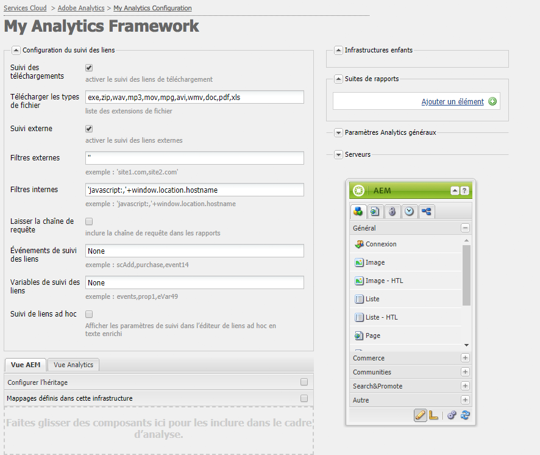

# Configuration du suivi des liens Adobe Analytics{#configuring-link-tracking-for-adobe-analytics}

Lorsque des utilisateurs cliquent sur des liens figurant sur les pages de votre site web, vous pouvez enregistrer diverses informations dans Adobe Analytics. Par exemple, utilisez le suivi des liens pour savoir comment les utilisateurs interagissent avec votre site et surveiller le téléchargement de fichiers et les liens de sortie.

## Configuration du suivi des liens de configuration pour une structure Adobe Analytics {#configuring-link-tracking-for-an-adobe-analytics-framework}

1. Avec **Navigation**, accédez via **Déploiement**, **Services Cloud** à la section **Adobe Analytics.**

1. Avec **Afficher les configurations**, ouvrez la structure Adobe Analytics requise.
1. Développez la section **Configuration du suivi des liens** et modifiez les informations selon vos besoins (cette page fournit des détails supplémentaires) :

   

## Suivi des téléchargements de fichiers {#tracking-file-downloads}

Configurez la structure Adobe Analytics de sorte que les fichiers téléchargés à partir des pages associées fassent automatiquement l’objet d’un suivi en tant que téléchargements dans Adobe Analytics. Lorsque vous activez le suivi des téléchargements, seuls les types de fichiers que vous spécifiez sont suivis.

Les téléchargements des types de fichiers suivants sont suivis par défaut :

* exe
* zip
* wav
* mp3
* mov
* mpg
* avi
* wmv
* doc
* pdf
* xls

Si, par exemple, avec le suivi des téléchargements activé pour les fichiers PDF, chaque fois que les utilisateurs cliquent sur les liens vers des fichiers PDF, le téléchargement du fichier PDF est suivi.

Les propriétés de suivi des téléchargements de la structure sont implémentées comme code dans le fichier `analytics.sitecatalyst.js` généré pour une page. L’exemple de code suivant présente la configuration par défaut du suivi des téléchargements :

```
s.trackDownloadLinks= true;
s.linkDownloadFileTypes= 'exe,zip,wav,mp3,mov,mpg,avi,wmv,doc,pdf,xls';
```

Pour activer le suivi des téléchargements pour votre structure Adobe Analytics :

1. [Ouvrez la structure Adobe Analytics et développez la section Configuration du suivi des liens](#configuring-link-tracking-for-an-adobe-analytics-framework).
1. Activez l’option **Suivi des téléchargements**.
1. Dans la boîte de dialogue **Télécharger les types de fichier**, entrez les extensions de nom de fichier des types de fichiers dont vous souhaitez effectuer le suivi.

## Suivi des liens externes {#tracking-external-links}

Vous pouvez effectuer le suivi des clics sur les liens externes (liens de sortie) sur vos pages.

Pour effectuer le suivi des liens externes pour votre structure Adobe Analytics :

1. [Ouvrez la structure Adobe Analytics et développez la section **Configuration du suivi des liens**.](#configuring-link-tracking-for-an-adobe-analytics-framework)
1. Configurez les propriétés suivantes, en fonction de vos besoins.

Propriétés de suivi lorsque l’utilisateur clique sur des liens externes :

* **Suivi externe**  Active le suivi des liens externes.

* **Filtres externes**  (Facultatif) Définit des filtres pour apparier les URL externes des cibles de lien. Lorsque les liens cibles correspondent au filtre, le lien est suivi. Les filtres externes sont utiles pour suivre uniquement certains des liens externes sur vos pages.

    Pour spécifier les liens externes à suivre, tapez entièrement ou partiellement l’URL du lien cible. S’il y a plusieurs filtres, séparez-les par une virgule. Entourez les chaînes littérales par des guillemets simples. No value (the default value of `''`, two single quotes) causes all external links to be tracked.

* **Filtres internes**  Définit des filtres pour apparier les URL des liens internes. Lorsque le lien cible des URL qui correspondent à ce filtre, le lien n’est pas suivi. La valeur par défaut est une commande JavaScript qui renvoie le nom d’hôte de l’URL de l’adresse de fenêtre en cours.

    Pour spécifier les liens internes qui ne sont pas suivis, tapez entièrement ou partiellement l’URL interne du lien cible. S’il y a plusieurs filtres, séparez-les par une virgule. Entourez les chaînes littérales par des guillemets simples.

   La valeur par défaut est `'javascript:,'+window.location.hostname`

* **Laisser la chaîne de requête**  Inclut les paramètres URL lors de l’évaluation de correspondances avec des filtres internes et externes.

   Activez cette option pour inclure les paramètres URL lors de l’évaluation d’URL du lien cible par rapport aux filtres externes et internes.

Les propriétés de suivi des liens externes sont implémentées en tant que code dans le fichier `analytics.sitecatalyst.js` généré pour une page. L’exemple de code suivant est généré pour une page qui est associée à une structure ayant activé le suivi des liens externes avec la configuration suivante :

* External filter is `'google.com'`
* Internal filter is the default value of `'javascript:,'+window.location.hostname`
* Les chaînes de requête ne sont pas incluses lors de l’évaluation du lien cible par rapport aux filtres.

```
s.trackExternalLinks= false;
s.linkExternalFilters= 'google.com';
s.linkInternalFilters= 'javascript:,'+window.location.hostname;
s.linkLeaveQueryString= false;
```

## Envoi de données de variable avec les clics sur les liens {#sending-variable-data-with-link-clicks}

Vous pouvez configurer AEM pour envoyer des données de événement et de variable à Adobe Analytics lorsqu’un utilisateur clique sur un lien. The **Link Tracking Configuration** properties enable you to specify the Adobe Analytics events and variables to track when link clicks occur.

Les mappages de structure déterminent les valeurs d’événement et de variable. Vous pouvez mapper des variables Adobe Analytics aux variables de vos composants de contenu qui stockent les données dont vous souhaitez effectuer le suivi lorsque vous cliquez sur des liens.

Pour envoyer des données de variable avec des clics sur des liens :

1. [Ouvrez la structure Adobe Analytics et développez la section Configuration du suivi des liens](#configuring-link-tracking-for-an-adobe-analytics-framework).
1. Configurez les propriétés suivantes, en fonction de vos besoins.

Pour envoyer des propriétés données variables avec des clics sur des liens :

* **Événements** de suivi des liens Saisissez les variables de événement Adobe Analytics que vous souhaitez utiliser pour comptabiliser les clics sur les liens.

   S’il y a plusieurs noms de variables, séparez-les par une virgule.

   The default value of `None` causes no event tracking.

* **Vars de suivi des liens** Entrez les variables Adobe Analytics que vous souhaitez envoyer à Adobe Analytics lorsque vous cliquez sur des liens. S’il y a plusieurs noms de variables, séparez-les par une virgule.

   The default value of `None` causes no variable data to be sent.

Lorsque vous spécifiez les événements et les variables à envoyer, la configuration est mise en œuvre sous forme de code dans le fichier `analytics.sitecatalyst.js` généré pour une page. L’exemple de code suivant est généré pour une page lorsque la structure suit l’événement `event10` et la propriété `prop4` :

```
s.linkTrackEvents= 'event10';
s.linkTrackVars= 'prop4';
```

## Exemple de configuration du suivi des liens {#example-link-tracking-configuration}

Suivez les procédures suivantes pour explorer le comportement de suivi des liens de l’intégration Adobe Analytics. Les procédures affichent les résultats de [Adobe Marketing Cloud Debugger](https://docs.adobe.com/content/help/en/debugger/using/experience-cloud-debugger.html).

### Configuration générale {#general-configuration}

Cet exemple illustre le fonctionnement du mappage dans le cas du suivi et du débogueur :

1. Ouvrez la structure associée à une page web.
1. Faites glisser le composant **Page** vers la zone de mappages de la structure. Le composant **Page** fait partie du groupe de composants **Général** dans le Sidekick.

   >[!NOTE]
   >
   >Le composant que vous devez utiliser dans un cas réel dépend du composant hérité (le cas échéant).
   >
   >Dans le cas contraire, votre propre composant doit y apparaître (en définissant un sous-nœud d’analyse dans son composant de page).

   Configurez le mappage selon le tableau suivant en faisant glisser la variable Analytics (SiteCatalyst) à partir du panneau latéral gauche :

<table>
 <tbody>
  <tr>
   <th>Variable CQ<br /> </th>
   <th>Entrée dans le navigateur des variables<br /> </th>
   <th>Variable Adobe Analytics</th>
  </tr>
  <tr>
   <td>pagedata.title</td>
   <td>eVar personnalisée 1 (eVar1)</td>
   <td>eVar1</td>
  </tr>
  <tr>
   <td>eventdata.events.pageView</td>
   <td>Événement personnalisé 1 (event1)</td>
   <td>event1</td>
  </tr>
 </tbody>
</table>

1. Faites glisser le composant Recherche vers la zone de mappages de la structure. Le composant Recherche fait partie du groupe de composants Général dans le sidekick. Configurez le mappage selon le tableau suivant en faisant glisser la variable Analytics (SiteCatalyst) à partir du panneau latéral gauche :

<table>
 <tbody>
  <tr>
   <th>Variable CQ<br /> </th>
   <th>Entrée dans le navigateur des variables</th>
   <th>Variable Adobe Analytics</th>
  </tr>
  <tr>
   <td>eventdata.keyword</td>
   <td>eVar personnalisée 2 (eVar2)</td>
   <td>eVar2</td>
  </tr>
  <tr>
   <td>eventdata.results</td>
   <td>eVar personnalisée 3 (eVar3)</td>
   <td>eVar3</td>
  </tr>
  <tr>
   <td>eventdata.events.search</td>
   <td>Événement personnalisé 2 (event2)</td>
   <td>event2</td>
  </tr>
 </tbody>
</table>

### Configurer le suivi des liens externes {#configure-external-link-tracking}

1. Dans votre structure, développez la zone **Configuration du suivi des liens**.
1. Désélectionnez **Suivi des téléchargements**.

1. Sélectionnez **Suivi externe**.
1. Désélectionnez **Laisser la chaîne de requête**.
1. Use the following value for the **External Filters** list to identify it as an external URL:

   `‘yahoo.com’`

1. Add the following value to the **Link Track Events** field:

   ```
       event1,event2
   ```

1. Add the following value to the **Link track vars** field:

   ```
       eVar1,eVar2
   ```

1. Sur la page qui est associée à la structure, ajoutez un composant **Texte**. Inside the **Text** component, add a hyperlink pointing to the following address:

   `https://search.yahoo.com/?p=this`

1. Passez en **mode Aperçu** et cliquez sur le lien.

L’appel ressemblera à ceci une fois affiché avec Adobe Marketing Cloud Debugger :


>[!NOTE]
>
>The URL does not contain the Query string: `?p=this`

### Inclure le paramètre d’URL {#include-the-url-parameter}

1. Dans la structure, développez la zone **Configuration du suivi des liens**.
1. Activez **Laisser la chaîne de requête**.
1. Rechargez l’aperçu de la page, puis cliquez sur le lien.

Les détails de l’appel qui s’affichent dans le débogueur Adobe Marketing Cloud sont similaires à l’exemple suivant :


>[!NOTE]
>
>This time the URL does contain the Query string: `?p=this`

## Suivi de liens ad hoc {#ad-hoc-link-tracking}

Le suivi des liens ad hoc permet aux créateurs de contenu de configurer le suivi des liens pour un composant. La configuration du composant remplace la **Configuration du suivi des liens** de la structure. Pour cette raison, sur les pages associées à la structure, des composants **Texte** peuvent être configurés pour le suivi des liens à partir des URL.

Le suivi des liens ad hoc vous permet de suivre les liens de téléchargement et les liens externes, ainsi que les données d’événement et de variable.

Pour activer le suivi des liens ad hoc, vous devez :

* [Associer la page contenant le composant **Texte** à la structure](/help/sites-administering/adobeanalytics-connect.md#associating-a-page-with-a-adobe-analytics-framework).
* [Configurer la structure Adobe Analytics pour activer le suivi des liens ad hoc](#enabling-ad-hoc-link-tracking).
* [Configurer le suivi des liens pour un composant Texte](#configuring-link-tracking-for-a-text-component).

### Activation du suivi des liens ad hoc {#enabling-ad-hoc-link-tracking}

Configurez votre structure Adobe Analytics pour activer le suivi des liens ad hoc.

1. Ouvrez la structure Adobe Analytics et développez la section **Configuration du suivi des liens**.

1. Activez le **Suivi de liens ad hoc**.

   >[!NOTE]
   >
   >Tous les types d’utilisateurs n’ont pas tous accès à cette case à cocher. Contactez votre administrateur si vous avez besoin d’y accéder.

>[!NOTE]
>
>The XSS Antisamy configuration is now in SLING under path **/libs/sling/xss.config.xml** and the following rules need to be added to for ad-hoc linking to work:

#### Extension de la règle de balise d’ancrage {#anchor-tag-rule-extension}

```xml
<attribute name="onclick">
    <literal-list>
        <literal value="CQ_Analytics.Sitecatalyst.customTrack(this)"/>
    </literal-list>
</attribute>
<attribute name="adhocenable">
    <literal-list>
        <literal value="true"/>
        <literal value="false"/>
    </literal-list>
</attribute>
<attribute name="adhocevents">
    <regexp-list>
        <regexp name="anything"/>
    </regexp-list>
</attribute>
<attribute name="adhocevars">
    <regexp-list>
        <regexp name="anything"/>
    </regexp-list>
</attribute>
```

### Configuration du suivi des liens pour un composant Texte {#configuring-link-tracking-for-a-text-component}

Pour pouvoir configurer le suivi des liens ad hoc pour les composants **Texte** eux-mêmes, les configurations suivantes doivent avoir déjà été mises en œuvre :

* La structure [Adobe Analytics est configurée pour autoriser le suivi des liens ad hoc](#enabling-ad-hoc-link-tracking).
* La [page contenant le composant **Texte** est associée à la structure.](/help/sites-administering/adobeanalytics-connect.md#associating-a-page-with-a-adobe-analytics-framework)

Appliquez la procédure suivante afin de configurer le suivi des liens pour un composant **Texte** :

1. Ouvrez la page en mode d’édition et modifiez le composant **Texte**.

1. Sélectionnez le texte que vous souhaitez utiliser comme hypertexte et cliquez sur le bouton Lien hypertexte.

   

1. Ajoutez l’URL cible dans la zone Lier à, puis développez la zone Suivi des liens.

   >[!NOTE]
   >
   >Le suivi des liens personnalisés est visible en tant qu’action distincte, à côté de l’action Lier/Rompre le lien (icône Analytics).
   >
   >L’action ne sera activée que lorsque vous aurez sélectionné un lien valide dans l’éditeur de texte enrichi.

   

1. Enable **Custom Link Tracking** to override the link tracking configuration of the Adobe Analytics framework and to enable link tracking for the current link.

1. (Optional) To track events with the link click, add Adobe Analytics event names in the **Include Adobe Analytics Variables** field. Séparez plusieurs noms de événement par des virgules, par exemple

   `event1, event22`.

1. (Optional) To track variable data with the link click, add Adobe Analytics variables in the **Include Adobe Analytics Variables** field. Utilisez l’un des formats suivants :

   * *`<Variable-name>`*: *`<Dynamic Value>`*
   * *`<Variable-name>`*: *`‘CONSTANT'`*

   Les exemples suivants illustrent chaque format :

   * `eVar10:pagedata.title`
   * `prop1: ‘Aubergine'`

   S’il y a plusieurs valeurs, séparez-les par une virgule.

1. **Cliquez sur OK**.

