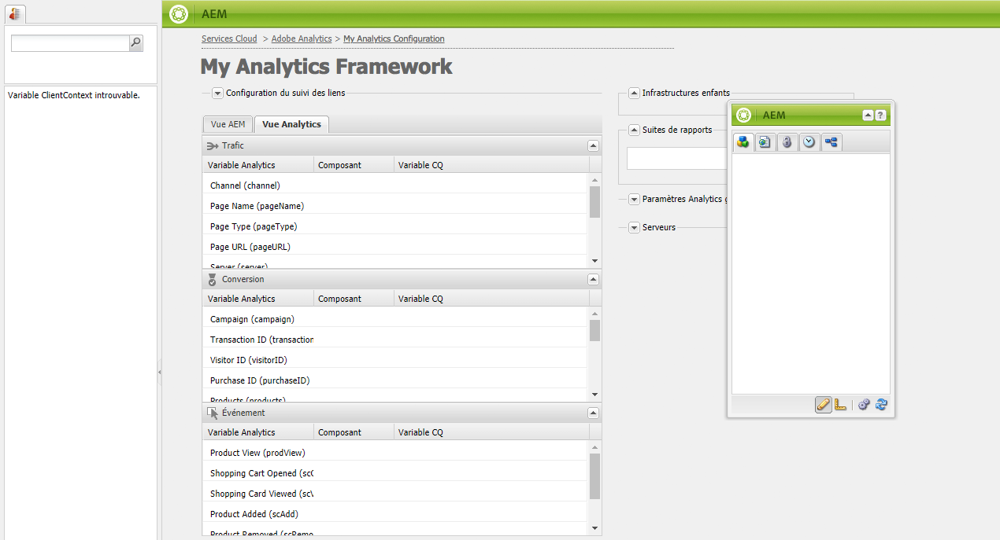
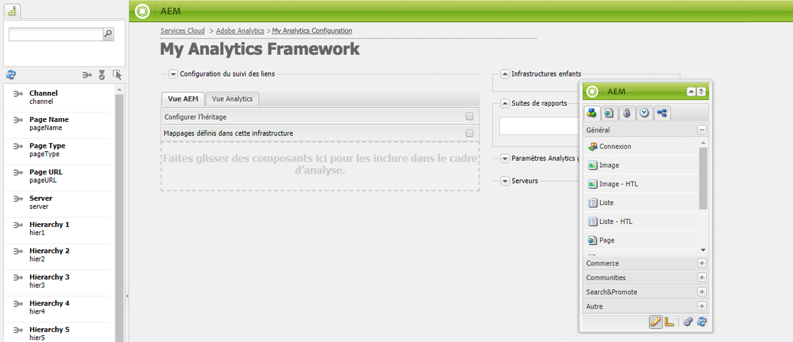
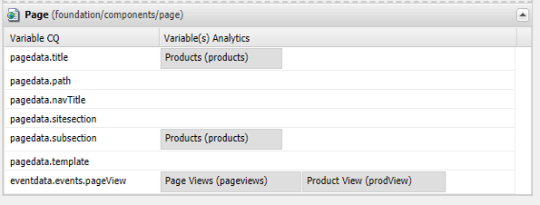
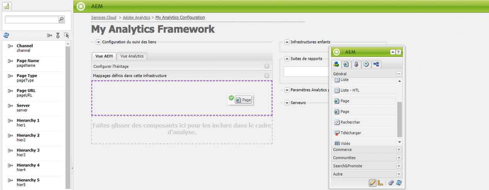
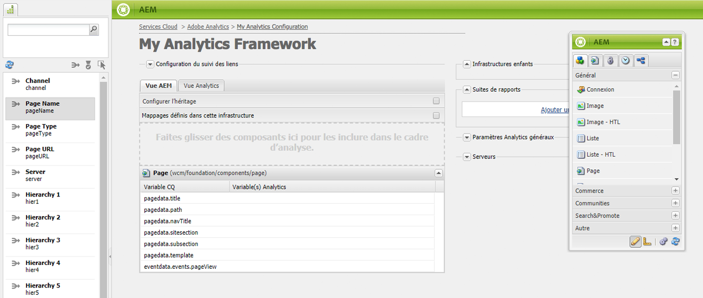
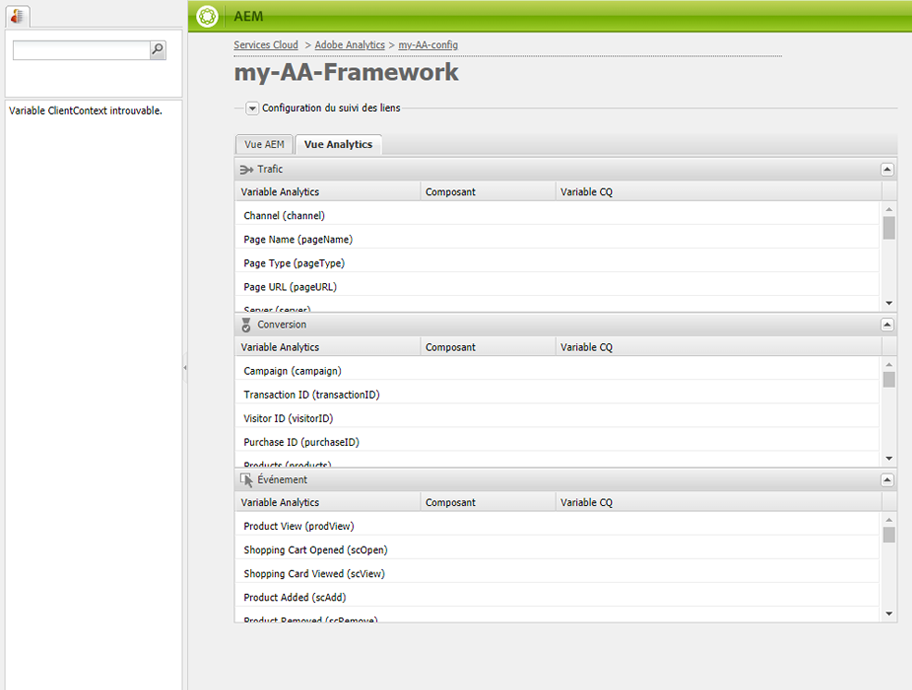
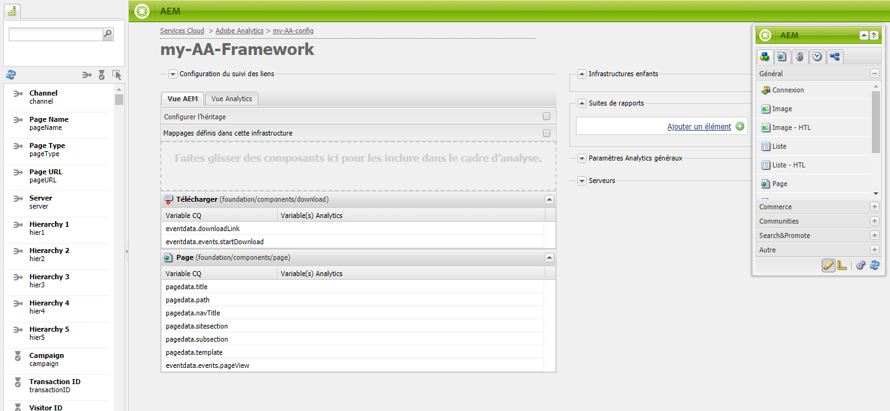
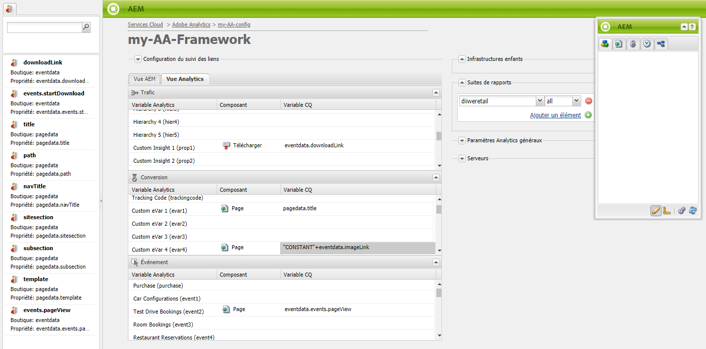

# Mappage des données de composant aux propriétés Adobe Analytics{#mapping-component-data-with-adobe-analytics-properties}

Ajoutez à la structure des composants qui rassemblent les données à envoyer à Adobe Analytics. Les composants conçus pour collecter des données d’analyse stockent les données dans la **variable CQ** appropriée. When you add such a component to a framework, the framework displays the list of CQ variables so that you can each to the appropriate **Analytics variable**.

When the **AEM view** is open the Analytics variables appear in the content finder.

You can map multiple Analytics variables with the same **CQ variable**.

Les données mappées sont envoyées à Adobe Analytics lorsque la page se charge et que les conditions suivantes sont remplies :

* La page est associée à la structure.
* La page utilise les composants ajoutés à la structure.

Suivez la procédure suivante pour mapper des variables de composant CQ avec des propriétés de rapport Adobe Analytics.

1. In the **AEM view**, drag a tracking component from sidekick onto the framework. For example, drag the **Page** component component from the **General** category.

   

   Il existe différents groupes de composants par défaut : **Général**, **Commerce**, **Communities**, **Search&amp;Promote** et **Autre**. Votre instance AEM peut être configurée de manière à afficher différents groupes et composants.

1. To map Adobe Analytics variables with variables that are defined in the component, drag an **Analytics variable** from the content finder onto a field on the tracking component. Par exemple, faites glisser `Page Name (pageName)` vers `pagedata.title`.

   

   >[!NOTE]
   >
   >L’identifiant de suite de rapports (RSID) sélectionné pour la structure détermine les variables Adobe Analytics qui apparaissent dans l’outil de recherche de contenu.

1. Répétez les deux étapes précédentes pour les autres composants et variables.

   >[!NOTE]
   >
   >You can map multiple Analytics variables (e.g. `props`, `eVars`, `events`) to the same CQ variable (e.g. `pagedata.title`)

   >[!CAUTION]
   >
   >Il est vivement recommandé de suivre les indications suivantes :
   >    
   >    * `eVars` et `props` sont mappés à des variables CQ commençant par `pagedata.X` ou `eventdata.X`
      >    
      >    
   * tandis que les événements doivent être mappés à des variables commençant par `eventdata.events.X`.

1. To make the framework available on the publish instance of your site, open the **Page** tab of sidekick, and click **Activate Framework.**

## Mappage de variables liées à des produits {#mapping-product-related-variables}

aem utilise une convention pour nommer les variables et les événements liés aux produits qui sont censés être mappés aux propriétés liées aux produits Adobe Analytics :

| Variable CQ | Variable Analytics | Description |
|---|---|---|
| `product.category` | `product.category` (variable de conversion) | Catégorie de produits. |
| `product.sku` | `product.sku` (variable de conversion) | SKU du produit. |
| `product.quantity` | `product.quantity` (variable de conversion) | Nombre de produits achetés. |
| `product.price` | `product.price` (variable de conversion) | Prix du produit. |
| `product.events.<eventName>` | Événements réussis à associer au produit dans votre rapport. | `product.events` est le préfixe des événements appelés *eventName*. |
| `product.evars.<eVarName>` | Variables de conversion (`eVar`) à associer au produit. | `product.evars` est le préfixe des variables eVar appelées *eVarName*. |

Plusieurs composants d’AEM Commerce utilisent ces noms de variables.

>[!NOTE]
>
>Ne mappez pas la propriété Produits Adobe Analytics à une variable CQ. La configuration de mappages liés à un produit, comme indiqué dans le tableau, s’apparente au mappage de la variable Products.

### Vérification des rapports dans Adobe Analytics {#checking-reports-on-adobe-analytics}

1. Connectez-vous au site Web Adobe Analytics en utilisant les mêmes informations d’identification que celles fournies à AEM.
1. Assurez-vous que le RSID sélectionné est celui utilisé lors des étapes précédentes.
1. Dans **Rapports** (dans la partie gauche de la page), sélectionnez **Conversion personnalisée**, puis **Conversion personnalisée 1-10** et sélectionnez la variable correspondant à `eVar7`.

1. Selon la version d’Adobe Analytics que vous utilisez, vous devez attendre en moyenne 45 minutes pour que le rapport soit mis à jour avec le terme de recherche utilisé ; par exemple, aubergine dans l&#39;exemple

## Utilisation de l’outil de recherche de contenu (cf#) avec les structures Adobe Analytics {#using-the-content-finder-cf-with-adobe-analytics-frameworks}

Au départ, lorsque vous ouvrez une structure Adobe Analytics, l’outil de recherche de contenu contient des variables Analytics prédéfinies sous :

* Trafic
* Conversion
* Événements

Lorsqu’un RSID est sélectionné, toutes les variables appartenant à ce RSID sont ajoutées à la liste.\
The `cf#` is needed in order to map Analytics variables to the CQ variables present on the different tracking components. Voir Configuration d’une structure pour le suivi de base.

Selon la vue sélectionnée pour la structure, l’outil de recherche de contenu sera renseigné par des variables Analytics (dans la vue AEM) ou CQ (dans la vue Analytics).

La liste peut être manipulée comme suit :

1. Lorsque vous accédez à la **vue AEM**, la liste peut être filtrée en fonction du type de variable sélectionné à l’aide des trois boutons de filtre :

   * Si *aucun bouton* n’est sélectionné, la liste complète s’affiche.
   * If the **Traffic** button is selected, the list will only show the variables belonging to the Traffic section.
   * If the **Conversion** button is selected, the list will only show the variables belonging to the Conversion section.
   * Si vous sélectionnez le bouton **Événements**, seules les variables appartenant à la section Événements sont répertoriées dans la liste.

   >[!NOTE]
   >
   >Un seul bouton de filtre peut être actif à la fois.

   >[!NOTE]
   >
   >Les variables de Search &amp; Promote appartiennent également à la section Conversion.

   1. La liste comporte également une fonctionnalité de recherche, qui filtre les éléments en fonction du texte saisi dans le champ de recherche.
   1. Si une option de filtre est activée lors de la recherche des éléments de la liste, les résultats affichés sont également filtrés en fonction du bouton actif.
   1. La liste peut être rechargée à tout moment à l’aide du bouton de flèches tourbillonnantes.
   1. Si vous sélectionnez plusieurs RSID dans la structure, toutes les variables de la liste s’affichent à l’aide de toutes les étiquettes utilisées dans les RSID sélectionnés.

1. Dans Adobe Analytics vue, l’outil de recherche de contenu affiche toutes les variables CQ appartenant aux composants de suivi glissés dans la vue CQ.

   * e.g. in case the **Download component** is the *only one dragged* in CQ view (which has two mappable variables *eventdata.downloadLink* and *eventdata.events.startDownload*), the Content Finder wil look like this when switching to Adobe Analytics view:

   

   * The variables can be dragged&amp;dropped onto any Adobe Analytics variable belonging to either one of the 3 variable sections (**Traffic**, **Conversion** and **Events**).

   * Lorsque vous faites glisser un nouveau composant de suivi sur la structure dans la vue CQ, les variables CQ appartenant au composant sont automatiquement ajoutées à l’outil de recherche de contenu (cf#) dans la vue Adobe Analytics.
   >[!NOTE]
   >
   >Une seule variable CQ peut être mappée simultanément à une variable Adobe Analytics.

## Utilisation de la vue AEM et de la vue Analytics {#using-aem-view-and-analytics-view}

A tout moment, les utilisateurs ont la possibilité de basculer entre deux méthodes d’affichage des mappages Adobe Analytics sur une page de structure. Les deux vues offrent une meilleure présentation des mappages dans la structure, de deux points de vue différents.

### Vue AEM {#aem-view}

En prenant comme exemple l’image ci-dessus, la **vue AEM** possède les propriétés suivantes :

1. Voici la vue par défaut à l’ouverture de la structure.
1. Côté gauche : l&#39;outil de recherche de contenu (cf#) est renseigné par des variables Adobe Analytics en fonction du ou des RSID sélectionnés.
1. En-têtes d’onglets (**vue AEM** et **vue Analytics**) : à utiliser pour basculer entre les vues.

1. **Vue AEM**:

   1. Si la structure contient des composants hérités du parent, ils sont répertoriés à cet endroit, avec les variables mappées aux composants.

      1. Les composants hérités sont verrouillés.
      1. Pour déverrouiller un composant hérité, il suffit de double-cliquer sur le cadenas en regard du nom du composant.
      1. Pour inverser l’héritage, vous devez supprimer le composant déverrouillé. Il retrouve alors son statut verrouillé.
   1. **Faites glisser des composants ici pour les inclure dans la structure d’analyse** : vous pouvez faire glisser et déposer les composants du Sidekick à cet emplacement.
   1. Vous pouvez trouver tous les composants actuellement inclus dans la structure d’analyse :

      1. Pour ajouter un composant, faites-le glisser à partir de l’onglet Composants du sidekick.
      1. Pour supprimer un composant et tous ses mappages, sélectionnez Supprimer dans le menu contextuel du composant, puis acceptez la suppression dans la boîte de dialogue de confirmation.
      1. Gardez à l’esprit qu’un composant peut être supprimé uniquement dans la structure dans laquelle il a été créé et qu’il ne peut pas être supprimé de structures enfants au sens habituel (il peut uniquement être remplacé).

### Vue Analytics {#analytics-view}

1. Cette vue est accessible en cliquant sur l’onglet **vue Analytics** de la structure.
1. Sur la gauche de l’écran : outil de recherche de contenu (cf#) renseigné par des variables CQ en fonction des composants déplacés sur la structure dans la vue CQ.
1. En-têtes d’onglets (**vue AEM** et **vue Analytics**) : à utiliser pour basculer entre les vues.

1. Les trois tableaux (Trafic, Conversion, Événement) liste toutes les variables Adobe Analytics disponibles. des RSID sélectionnés. Les mappages affichés ici doivent être identiques à ceux de la vue AEM :

   * **Trafic** :

      * Traffic variable ( `prop1`) mapped to a CQ variable ( `eventdata.downloadLink`)

      * Lorsque le composant comporte un cadenas en regard de son nom, cela signifie qu’il est hérité d’une structure parente et ne peut donc pas être modifié.
   * **Conversion**:

      * Conversion variable ( `eVar1`) mapped to a CQ variable ( `pagedata.title`)

      * Variable de conversion (`eVar3`) mappée à une expression JavaScript ajoutée en ligne en double-cliquant dans le champ Variable CQ et en saisissant manuellement le code.
   * **Événement**:

      * Event variable ( `event1`) mapped to a CQ event ( `eventdata.events.pageView`)

>[!NOTE]
>
>La colonne Variable CQ de chaque tableau peut également être renseignée en ligne en double-cliquant dans le champ et en ajoutant du texte. Ces champs acceptent la saisie de code JavaScript.
>
>* Par exemple, en regard de `prop3` vous pouvez ajouter
>* `'`* `Adobe:'+pagedata.title+':'+pagedata.sitesection`\
   >  pour envoyer le *titre* d&#39;une page concaténée avec sa section *de* site à l&#39;aide de *:* (deux-points) et précédés d’un *Adobe* comme `prop3`

>

>[!CAUTION]
>
>Une seule variable CQ peut être mappée à une variable Adobe Analytics à un moment donné.

