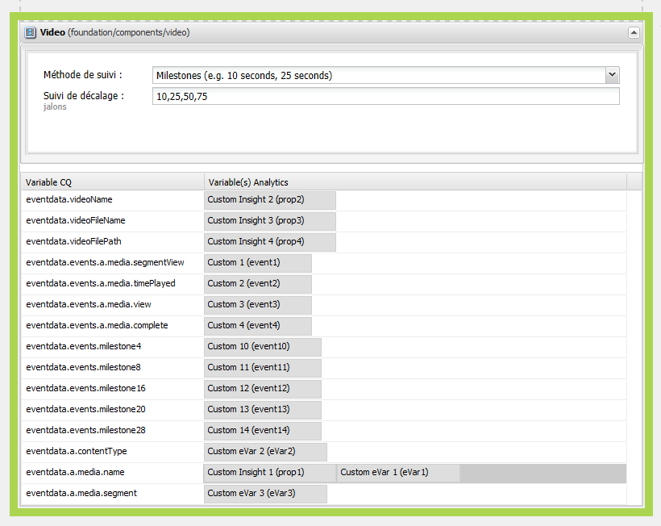

# Configuration du suivi vidéo pour Adobe Analytics{#configuring-video-tracking-for-adobe-analytics}

Il existe différentes méthodes pour assurer le suivi des événements vidéo, dont deux sont des options héritées de versions précédentes d’Adobe Analytics. Ces options existantes sont : Jalons hérités et Secondes héritées.

>[!NOTE]
>
>Avant de poursuivre, assurez-vous qu’une **vidéo lisible** est chargée dans AEM.
>
>Pour vous assurer que vos vidéos sont lisibles dans la page, consultez **[ce didacticiel](/help/sites-authoring/default-components-foundation.md#video)** pour plus d’informations sur le transcodage de fichiers vidéo dans AEM.

Appliquez la procédure ci-dessous pour configurer un framework pour le suivi des vidéos à l’aide de chaque méthode.

>[!NOTE]
>
>Pour les nouvelles mises en œuvre, il est recommandé de **ne pas utiliser** les options héritées pour le suivi vidéo. Utilisez la variable **Jalons** à la place.

## Étapes communes {#common-steps}

1. Configurez une page Web en faisant glisser un **composant vidéo** à partir du sidekick et en ajoutant une **vidéo comme ressource** lisible pour le composant.

1. [Créez une configuration et un framework Adobe Analytics](/help/sites-administering/adobeanalytics.md).

   * Les exemples dans les sections qui suivent utilisent le nom **my-sc-configuration** pour la configuration et **videofw** pour le framework.

1. Dans la page du framework, sélectionnez un RSID et définissez l’utilisation sur Tout. ([https://localhost:4502/cf#/etc/cloudservices/sitecatalyst/videoconf/videofw.html](https://localhost:4502/cf#/etc/cloudservices/sitecatalyst/videoconf/videofw.html))
1. Dans la catégorie Général du sidekick, faites glisser le composant vidéo dans le framework.
1. Sélectionnez une méthode de suivi :

   * [Jalons](/help/sites-administering/adobeanalytics.md)
   * [Jalons non hérités](/help/sites-administering/adobeanalytics.md)
   * [Jalons hérités](/help/sites-administering/adobeanalytics.md)
   * [Secondes héritées](/help/sites-administering/adobeanalytics.md)

1. Lorsque vous sélectionnez une méthode de suivi, la liste de variables CQ change en conséquence. Consultez les sections ci-après pour obtenir plus d’informations sur la configuration du composant et le mappage des variables CQ aux propriétés Adobe Analytics.

## Jalons {#milestones}

La méthode Jalons effectue le suivi du plus grand nombre d’informations sur la vidéo, est hautement personnalisable et facile à configurer.

Pour utiliser la méthode Jalons, spécifiez les décalages de suivi temporels afin de définir les jalons. Lorsque la lecture d’une vidéo franchit un jalon, la page appelle Adobe Analytics pour suivre l’événement. Pour chaque jalon que vous définissez, le composant crée une variable CQ que vous pouvez mapper à une propriété Adobe Analytics. Le nom de ces variables CQ utilise le format suivant :

```shell
eventdata.events.milestoneXX
```

Le suffixe XX correspond au décalage de suivi, qui définit le jalon. Par exemple, la spécification du décalage de suivi de 4, 8, 16, 20 et 28 secondes génère les variables CQ suivantes :

* `eventdata.events.milestone4`
* `eventdata.events.milestone8`
* `eventdata.events.milestone16`
* `eventdata.events.milestone20`
* `eventdata.events.milestone28`

Le tableau ci-dessous décrit les variables CQ par défaut fournies pour la méthode Jalons :

<table>
 <tbody>
  <tr>
   <th>Variables CQ</th>
   <th>Propriétés Adobe Analytics</th>
  </tr>
  <tr>
   <td>eventdata.videoName </td>
   <td>Les variables mappées à cette propriété contiennent le nom <strong>convivial</strong> (<strong>Titre</strong>) de la vidéo s’il est défini dans la gestion des ressources numériques ; si cette valeur n’est pas définie, le <strong>nom du fichier</strong> de la vidéo sera envoyé à sa place. Envoyé une seule fois, au début de la lecture d’une vidéo.</td>
  </tr>
  <tr>
   <td>eventdata.videoFileName </td>
   <td>Les variables mappées à cette propriété contiennent le nom du fichier. Envoyé uniquement avec eventdata.events.a.media.view. </td>
  </tr>
  <tr>
   <td>eventdata.videoFilePath </td>
   <td>Les variables mappées à cette propriété contiennent le chemin d’accès au fichier sur le serveur. Envoyé uniquement avec eventdata.events.a.media.view. </td>
  </tr>
  <tr>
   <td>eventdata.events.a.media.segmentView </td>
   <td>Envoyé chaque fois qu’un jalon de segment est franchi. </td>
  </tr>
  <tr>
   <td>eventdata.events.a.media.timePlayed</td>
   <td>Envoyé chaque fois qu’un jalon est déclenché, le nombre de secondes passées par l’utilisateur à regarder le segment donné est également envoyé avec cet événement, par exemple, eventX=21<br /> </td>
  </tr>
  <tr>
   <td>eventdata.events.a.media.view </td>
   <td>Envoyé lors de l’initialisation de la vue vidéo.</td>
  </tr>
  <tr>
   <td>eventdata.events.a.media.complete </td>
   <td>Envoyé lorsque la lecture de la vidéo est terminée.<br /> </td>
  </tr>
  <tr>
   <td>eventdata.events.milestoneX </td>
   <td>Envoyé lorsque le jalon donné est franchi, X correspondant à la seconde où le jalon est déclenché.<br /> </td>
  </tr>
  <tr>
   <td>eventdata.a.contentType </td>
   <td>Envoyé à chaque jalon ; s’affiche en tant que pev3 dans l’appel Adobe Analytics, généralement envoyé en tant que « vidéo ».<br /> </td>
  </tr>
  <tr>
   <td>eventdata.a.media.name </td>
   <td>Correspond exactement à eventdata.videoName. </td>
  </tr>
  <tr>
   <td>eventdata.a.media.segment </td>
   <td>Contient des informations sur le segment qui a été consulté, par exemple : <code>2:O:4-8</code> </td>
  </tr>
 </tbody>
</table>

>[!NOTE]
>
>Vous pouvez définir le nom **convivial** d’une vidéo en ouvrant la vidéo pour la modifier dans la gestion des ressources numériques et en définissant le champ de métadonnées **Titre** sur le nom de votre choix.

1. Après avoir sélectionné les jalons comme méthode de suivi, dans la boîte de dialogue des décalages de suivi, saisissez une liste de décalages de suivi, exprimés en secondes, séparés par des virgules. Par exemple, la valeur suivante définit des jalons à 4, 8, 16, 20 et 28 secondes après le début de la vidéo :

   ```xml
   4,8,16,20,24
   ```

   Les valeurs de décalage doivent être des entiers supérieurs à 0. La valeur par défaut est `10,25,50,75`.

1. Pour mapper les variables CQ à des propriétés Adobe Analytics, faites glisser les propriétés Adobe Analytics de ContentFinder en regard de la variable CQ sur le composant.

   Pour plus d’informations sur l’optimisation des mappages, consultez le guide relatif à la [mesure de la vidéo dans Adobe Analytics](https://experienceleague.adobe.com/docs/media-analytics/using/media-overview.html?lang=fr).

1. [Ajoutez le framework](/help/sites-administering/adobeanalytics.md) à la page.
1. Pour tester la configuration en **mode Aperçu**, lisez la vidéo pour obtenir des appels Adobe Analytics à déclencher.

Les exemples de données de suivi Adobe Analytics qui suivent s’appliquent au suivi de Jalons à l’aide de décalages de suivi de 4, 8, 16, 20 et 24 secondes et aux mappages ci-dessous pour les variables CQ :

<table>
 <tbody>
  <tr>
   <th>Variable CQ</th>
   <th>Propriété Adobe Analytics</th>
  </tr>
  <tr>
   <td>eventdata.videoName </td>
   <td>prop2</td>
  </tr>
  <tr>
   <td>eventdata.videoFileName </td>
   <td>prop3 </td>
  </tr>
  <tr>
   <td>eventdata.videoFilePath </td>
   <td>prop4</td>
  </tr>
  <tr>
   <td>eventdata.events.a.media.segmentView </td>
   <td>event1</td>
  </tr>
  <tr>
   <td>eventdata.events.a.media.timePlayed</td>
   <td>event2<br /> </td>
  </tr>
  <tr>
   <td>eventdata.events.a.media.view </td>
   <td>event3</td>
  </tr>
  <tr>
   <td>eventdata.events.a.media.complete </td>
   <td>event4<br /> </td>
  </tr>
  <tr>
   <td>eventdata.events.milestone4</td>
   <td>event10</td>
  </tr>
  <tr>
   <td>eventdata.events.milestone8</td>
   <td>event11</td>
  </tr>
  <tr>
   <td>eventdata.events.milestone16</td>
   <td>event12</td>
  </tr>
  <tr>
   <td>eventdata.events.milestone20</td>
   <td>event13</td>
  </tr>
  <tr>
   <td>eventdata.events.milestone24</td>
   <td>event14</td>
  </tr>
  <tr>
   <td>eventdata.a.contentType </td>
   <td>eVar3</td>
  </tr>
  <tr>
   <td>eventdata.a.media.name </td>
   <td>eVar1, prop1 </td>
  </tr>
  <tr>
   <td>eventdata.a.media.segment </td>
   <td>eVar2</td>
  </tr>
 </tbody>
</table>

Dans cet exemple, le composant Vidéo s’affiche comme suit dans la page du framework :



>[!NOTE]
>
>Pour afficher les appels à Adobe Analytics, utilisez un outil approprié, comme DigitalPulse Debugger ou Fiddler.

Les appels à Adobe Analytics à l’aide de l’exemple fourni doivent se présenter comme suit lorsqu’ils sont affichés avec DigitalPulse Debugger :


*Le **premier appel**à Adobe Analytics contient les valeurs suivantes :*

* *prop1 et eVar1 pour eventdata.a.media.name,*
* *props2-4, avec eVar2 et eVar3 contenant contentType (vidéo) et segment (1:O:1-4)*
* *event3 mappé à eventdata.events.a.media.view.*


***Troisième appel**vers Adobe Analytics :*

* *prop1 et eVar1 contiennent a.media.name ;*
* *event1 car un segment a été visionné ;*
* *event2 envoyé avec un temps de lecture = 4 ;*
* *event11 envoyé car eventdata.events.milestone8 a été atteint ;* 
* *prop2 à 4 ne sont pas envoyés (car eventdata.events.a.media.view n’a pas été déclenché).* 

## Jalons non hérités {#non-legacy-milestones}

La méthode Jalons non hérités est similaire à la méthode Jalons, excepté que les jalons sont définis à l’aide de pourcentages de la durée du suivi. Les points communs sont les suivants :

* Lorsque la lecture d’une vidéo franchit un jalon, la page appelle Adobe Analytics pour suivre l’événement.
* L’[ensemble statique des variables CQ](#cqvars) définies pour le mappage à des propriétés Adobe Analytics.
* Pour chaque jalon que vous définissez, le composant crée une variable CQ que vous pouvez mapper à une propriété Adobe Analytics.

Le nom de ces variables CQ utilise le format suivant :

Le suffixe XX correspond au pourcentage de la durée du suivi, qui définit le jalon. Par exemple, la spécification de pourcentages de 10, 25, 50 et 75 génère les variables CQ suivantes :

* `eventdata.events.milestone10`
* `eventdata.events.milestone25`
* `eventdata.events.milestone50`
* `eventdata.events.milestone75`

```shell
eventdata.events.milestoneXX
```

1. Après avoir sélectionné la méthode de suivi Jalons non hérités, dans la zone Décalage de suivi, saisissez une liste de pourcentages de durée du suivi séparés par des virgules. Par exemple, la valeur par défaut suivante définit des jalons à 10, 25, 50 et 75 % de la durée du suivi :

   ```xml
   10,25,50,75
   ```

   Les valeurs de décalage doivent être des entiers supérieurs à 0.

1. Pour mapper les variables CQ à des propriétés Adobe Analytics, faites glisser les propriétés Adobe Analytics de ContentFinder en regard de la variable CQ sur le composant.

   Pour plus d’informations sur l’optimisation des mappages, consultez le guide relatif à la [mesure de la vidéo dans Adobe Analytics](https://experienceleague.adobe.com/docs/media-analytics/using/media-overview.html?lang=fr).

1. [Ajoutez le framework](/help/sites-administering/adobeanalytics.md) à la page.
1. Pour tester la configuration en **mode Aperçu**, lisez la vidéo pour obtenir des appels Adobe Analytics à déclencher.

## Jalons hérités {#legacy-milestones}

Cette méthode est similaire à la méthode Jalons avec la différence que les jalons spécifiés dans la variable *Décalage de suivi* sont des pourcentages au lieu de définir des points dans la vidéo.

>[!NOTE]
>
>Le champ Décalage de suivi accepte uniquement une liste séparée par des virgules contenant des nombres entiers compris entre 1 et 100.

1. Définissez le décalage de suivi.

   * par exemple, 10,50,75,100

   De même, les informations envoyées à Adobe Analytics sont moins personnalisables. Seules 3 variables sont disponibles pour le mappage :

<table>
 <tbody>
  <tr>
   <td>eventdata.videoName <br /> </td>
   <td>Les variables mappées à cette propriété contiennent le nom <strong>convivial</strong> (<strong>Titre</strong>) de la vidéo s’il est défini dans la gestion des ressources numériques ; si cette valeur n’est pas définie, le <strong>nom du fichier</strong> de la vidéo sera envoyé à sa place. Envoyée une seule fois, au début de la lecture d’une vidéo.<br /> </td>
  </tr>
  <tr>
   <td>eventdata.videoFileName </td>
   <td>Les variables mappées à cette propriété contiennent le nom du fichier. Envoyé une seule fois, au début de la lecture d’une vidéo.</td>
  </tr>
  <tr>
   <td>eventdata.videoFilePath </td>
   <td>La variable mappée à cette propriété contient le chemin d’accès au fichier sur le serveur. Envoyé une seule fois, au début de la lecture d’une vidéo.</td>
  </tr>
 </tbody>
</table>

>[!NOTE]
>
>Vous pouvez définir le nom **convivial** d’une vidéo en ouvrant la vidéo pour la modifier dans la gestion des ressources numériques et en définissant le champ de métadonnées **Titre** sur le nom de votre choix. Vous devez également enregistrer les modifications apportées une fois l’opération terminée.

1. Mappez ces variables aux variables props 1 à 3.

   Le **reste des informations pertinentes** dans l’appel sera envoyé sous forme concaténée dans **une** variable nommée **pev3**.

   Les **exemples d’appel** vers Adobe Analytics à l’aide de l’exemple fourni doivent se présenter ainsi lorsqu’ils sont affichés avec DigitalPulse Debugger :

   

   *La variable **pev3**envoyée dans l’appel contient les informations suivantes :*

   * *Nom* : nom du fichier vidéo (*film.avi*)

   * *Durée* : durée du fichier vidéo, exprimée en secondes (*100*)

   * *Nom du lecteur* : lecteur vidéo utilisé pour lire le fichier vidéo (*vidéo HTML5*)

   * *Nombre total de secondes de lecture* : nombre total de secondes pendant lesquelles la vidéo a été lue (*25*)

   * *Horodatage de début* : horodatage identifiant le début de la lecture de la vidéo (*1331035567*)

   * *Session de lecture* : détails de la séance de lecture. Ce champ indique comment l’utilisateur a interagi avec la vidéo. Cela peut inclure des données comme l’emplacement où a commencé la lecture de la vidéo, si l’utilisateur a utilisé le curseur vidéo pour avancer dans la vidéo et l’emplacement où il a arrêté la lecture (*L10E24S58L58 - Vidéo interrompue à la seconde 25 de la section L10, puis avance rapide jusqu’à la seconde 48*)

## Secondes héritées {#legacy-seconds}

Lors de l’utilisation de la méthode **Secondes héritées**, les appels Adobe Analytics sont déclenchés chaque nième seconde, où « n » est spécifié dans le champ décalage de suivi.

1. Définissez le décalage de suivi sur un nombre de secondes déterminé.

   * par exemple, 6

   >[!NOTE]
   >
   >Le champ Décalage de suivi accepte uniquement les nombres entiers supérieurs à 0

   Les informations envoyées à Adobe Analytics sont moins personnalisables. Seules 3 variables sont disponibles pour le mappage :

<table>
 <tbody>
  <tr>
   <td>eventdata.videoName <br /> </td>
   <td>Les variables mappées à cette propriété contiennent le nom <strong>convivial</strong> (<strong>Titre</strong>) de la vidéo s’il est défini dans la gestion des ressources numériques ; si cette valeur n’est pas définie, le <strong>nom du fichier</strong> de la vidéo sera envoyé à sa place. Envoyée une seule fois, au début de la lecture d’une vidéo.<br /> </td>
  </tr>
  <tr>
   <td>eventdata.videoFileName </td>
   <td>La variable mappée à cette propriété contient le nom du fichier. Envoyé une seule fois, au début de la lecture d’une vidéo.</td>
  </tr>
  <tr>
   <td>eventdata.videoFilePath </td>
   <td>La variable mappée à cette propriété contient le chemin d’accès au fichier sur le serveur. Envoyé une seule fois, au début de la lecture d’une vidéo.</td>
  </tr>
 </tbody>
</table>

>[!NOTE]
>
>Vous pouvez définir le nom **convivial** d’une vidéo en ouvrant la vidéo pour la modifier dans la gestion des ressources numériques et en définissant le champ de métadonnées **Titre** sur le nom de votre choix. Vous devez également enregistrer les modifications apportées une fois l’opération terminée.

1. Mapper ces variables à prop1, prop2 et prop3

   La variable **reste des informations pertinentes** dans l’appel sera envoyé dans **one** variable nommée **pev3**.

   Les appels à Adobe Analytics à l’aide de l’exemple fourni doivent se présenter comme suit lorsqu’ils sont affichés avec DigitalPulse Debugger :

   

   *L’appel est similaire à l’appel Jalons hérités ci-dessus. Consultez les informations sur pev3 **[fourni ici](/help/sites-administering/adobeanalytics.md)**.*

**Références utilisées dans ce tutoriel :**

[0] [https://experienceleague.adobe.com/docs/media-analytics/using/media-overview.html?lang=fr](https://experienceleague.adobe.com/docs/media-analytics/using/media-overview.html?lang=fr)
