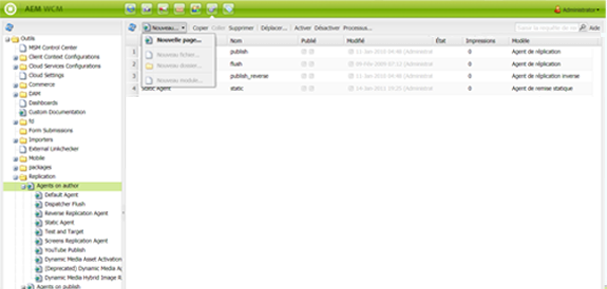
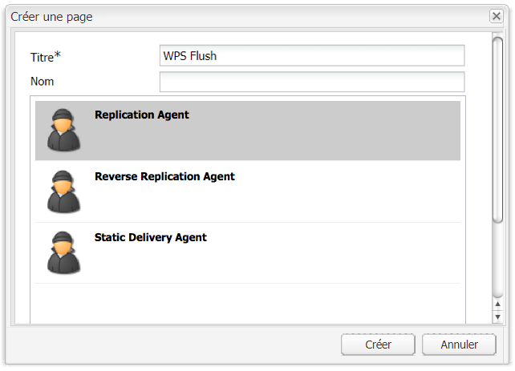
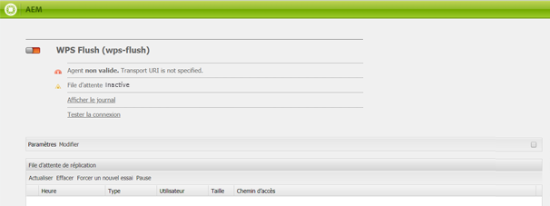
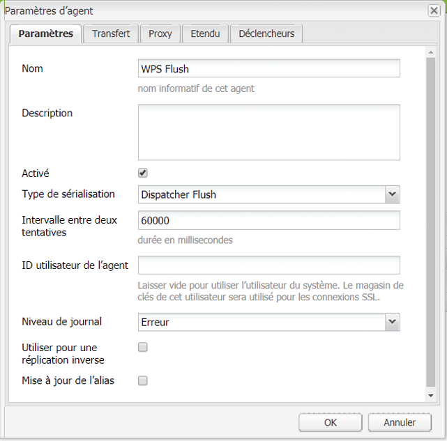
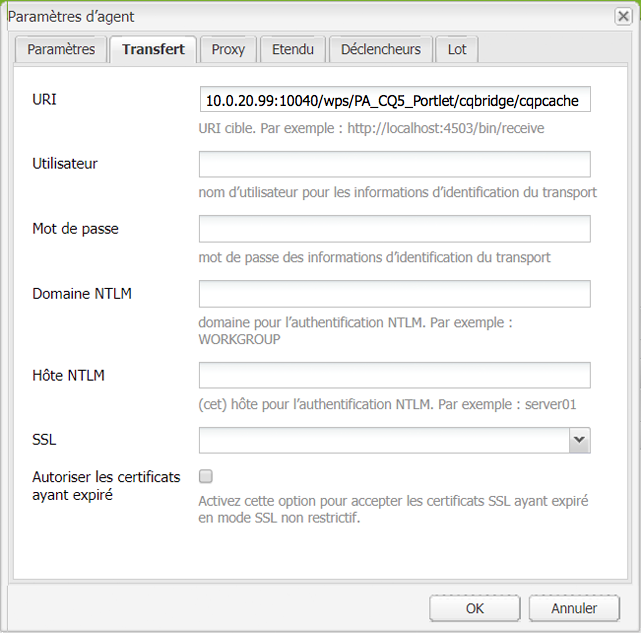
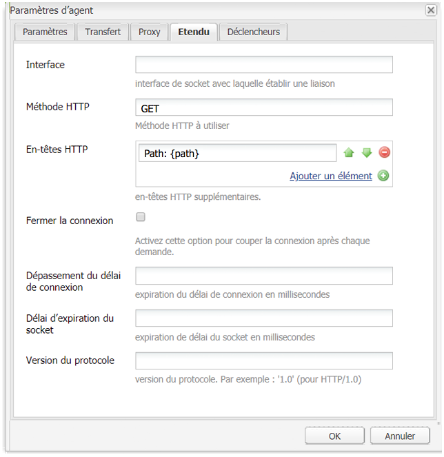
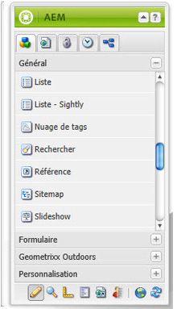

# Portails et portlets AEM{#aem-portals-and-portlets}

Ce document répond aux questions suivantes :

* Architecture du portail AEM
* Administration et configuration d’AEM en tant que portail
* Utilisation d’AEM en tant que portail
* Installation, configuration et affichage du contenu d’AEM dans un portlet (serveur web, par exemple)

## Architecture du portail AEM {#aem-portal-architecture}

L’architecture du portail AEM comporte des définitions des portails et des portlets.

### Qu’est-ce qu’un portail ? {#what-is-a-portal}

Un portail est une application web qui permet la personnalisation, la connexion unique et l’intégration du contenu provenant de sources différentes et héberge la couche de présentation des systèmes d’information.

Vous pouvez exécuter des portlets conformes à la norme JSR 286 dans AEM. Le composant Portlet permet également d’incorporer un portlet dans la page. Voir [Administration du portlet de contenu AEM](#administeringthecqcontentportlet).

### Qu&#39;est-ce qu&#39;un portlet ? {#what-is-a-portlet}

Les portlets sont des composants web déployés dans un conteneur, qui proposent du contenu dynamique. L’interface du portlet est regroupée et déployée sous forme de fichier WAR dans un conteneur de portlet. Si vous exécutez AEM en tant que portail, vous avez besoin du fichier WAR du portlet pour exécuter le portlet.

Pour configurer le contenu d’AEM de sorte qu’il s’affiche sur un portail, voir [Installation, configuration et utilisation d’AEM dans un portlet](#installingconfiguringandusingcqinaportlet).

### AEM Portal Director  {#aem-portal-director}

>[!CAUTION]
>
>AEM Portal Director est obsolète depuis la version AEM 6.4. Voir [Fonctionnalités obsolètes et supprimées](https://helpx.adobe.com/fr/experience-manager/6-4/release-notes/deprecated-removed-features.html).

## Administration du portlet de contenu AEM  {#administering-the-aem-content-portlet}

Le portlet de contenu AEM permet d’afficher du contenu AEM sur un portail. Le portlet est disponible à l&#39;adresse `/crx-quickstart/opt/portal` et peut être personnalisé de différentes manières. Par exemple, vous pouvez personnaliser la gestion SSO/de l’authentification en déployant votre propre service d’authentification générant les informations d’authentification nécessaires pour qu’AEM remplace le comportement par défaut. Les modules externes utilisent une API définie, qui permet d’ajouter votre propre fonctionnalité en créant le module externe contre les API. Le module externe peut être déployé dans le portlet exécuté. Pour qu’il fonctionne correctement, une instance de création et de publication AEM doit être configurée avec le chemin d’accès au contenu à afficher au démarrage.

Certaines des configurations sont modifiables par le biais des préférences de portlet et d’autres par le biais des configurations de service OSGI. Vous pouvez modifier ces configurations à l’aide des fichiers **config** ou de la console web OSGi.

### Préférences de portlet {#portlet-preferences}

Les préférences de porlet peuvent être configurées lors du déploiement sur le serveur du portail ou en modifiant le fichier **WEB-INF/portlet.xml** avant de déployer l’application web du portlet. Le fichier portlet.xml se présente, par défaut, comme suit :

```xml
<?xml version="1.0" encoding="UTF-8"?>
<portlet-app xmlns="https://java.sun.com/xml/ns/portlet/portlet-app_1_0.xsd"
             xmlns:xsi="https://www.w3.org/2001/XMLSchema-instance"
             xsi:schemaLocation="https://java.sun.com/xml/ns/portlet/portlet-app_1_0.xsd /opt/SUNWps/dtd/portlet.xsd"
             version="1.0">
   <portlet>
      <portlet-name>RSSWeatherPortlet</portlet-name>
      <portlet-class>org.jboss.portlet.weather.WeatherPortlet</portlet-class>
      <init-param>
         <name>default_zipcode</name>
         <value>05673</value>
      </init-param>
      <init-param>
         <name>RSS_XSL</name>
         <value>/WEB-INF/Rss.xsl</value>
      </init-param>
      <init-param>
         <name>base_url</name>
         <value>https://xml.weather.yahoo.com/forecastrss?p=</value>
      </init-param>
      <expiration-cache>180</expiration-cache>
      <supports>
         <mime-type>text/html</mime-type>
         <portlet-mode>VIEW</portlet-mode>
         <portlet-mode>EDIT</portlet-mode>
      </supports>
      <portlet-info>
         <title>Weather Portlet</title>
      </portlet-info>
      <portlet-preferences>
         <preference>
            <name>expires</name>
            <value>180</value>
         </preference>
         <preference>
            <name>RssXml</name>
            <value>https://xml.weather.yahoo.com/forecastrss?p=33145</value>
            <read-only>false</read-only>
         </preference>
      </portlet-preferences>
   </portlet>
</portlet-app>
```

Le portlet peut être configuré avec les préférences suivantes :

<table>
 <tbody>
  <tr>
   <td>startPath</td>
   <td><p>Il s’agit du chemin d’accès de début du portlet : il définit le contenu affiché initialement.</p> <p><strong>Important</strong> : Si le portlet est configuré pour se connecter à AEM instances d'auteur et de publication qui s'exécutent sur un chemin de contexte différent de<strong> /</strong>, vous devez activer la force  <strong></strong> CQUrlInfoin dans la configuration du gestionnaire de bibliothèques Html de ces instances d'AEM (par exemple via Felix Webconsole) ou la modification ne fonctionnera pas et la boîte de dialogue des préférences n'apparaîtra pas.</p> </td>
  </tr>
  <tr>
   <td>htmlSelector</td>
   <td>Sélecteur ajouté à chaque adresse URL. Par défaut, il s’agit de <strong>portlet</strong>, de sorte que toutes les requêtes de pages html utilisent des url se terminant par <strong>.portlet.html.</strong> Cela permet d’utiliser des scripts personnalisés dans AEM pour le rendu du portlet.</td>
  </tr>
  <tr>
   <td>addCssToPortalHeader</td>
   <td><p>Par défaut, les fichiers CSS d’AEM que contient la page HTML sont inclus dans le portlet. La désactivation de cette option exclut les fichiers CSS par défaut.</p> <p>Si cette option est activée, les fichiers CSS sont ajoutés dans les balises &lt;head&gt; de la page HTML ou incorporés dans la page HTML en fonction du comportement du portail.</p> </td>
  </tr>
  <tr>
   <td>includeToolbar</td>
   <td>Par défaut, une barre d’outils est rendue dans le portlet de contenu pour la fonctionnalité de gestion. Si vous désactivez cette option, aucune barre d’outils n’est rendue.</td>
  </tr>
  <tr>
   <td>urlParameterNames</td>
   <td><p>Liste des autres noms de paramètre URL susceptibles de contenir la nouvelle adresse URL du contenu à afficher pour le portlet. La liste est traitée de haut en bas. Le premier paramètre contenant une valeur est utilisé. Si le système ne trouve aucune adresse URL, le paramètre d’URL par défaut est utilisé. L’adresse URL fournie est utilisée en l’état, sans autre modification.</p> <p>Ce paramètre concerne chaque portlet déployé. Il sert également à configurer globalement certains paramètres des adresses URL dans la configuration d’OSGi pour le « Day Portal Director Portlet Bridge ».</p> </td>
  </tr>
  <tr>
   <td>preferenceDialog</td>
   <td>Chemin d’accès à la boîte de dialogue Préférences dans AEM. Si cette préférence n’est pas renseignée, la boîte de dialogue Préférences intégrée est utilisée. La valeur par défaut est /libs/portal/content/prefs.html.</td>
  </tr>
  <tr>
   <td>initialRedirect</td>
   <td>Par défaut, le portlet exécute une redirection JavaScript de toute la page du portail lors du premier appel. Cela permet de prendre en charge le scénario de glisser-déposer des serveurs de portail modernes. En production, cette redirection est rarement nécessaire et peut donc être désactivée en définissant la préférence sur <em>false</em>.</td>
  </tr>
 </tbody>
</table>

#### Console web OSGi  {#osgi-web-console}

Si le serveur est exécuté sur localhost, port , et que l’application web du portlet AEM est montée dans le contexte de l’application web *cqportlet*, l’adresse URL de la console web est `https://localhost:8080/cqportlet/cqbridge/system/console`:8080/. Le nom d’utilisateur et le mot de passe par défaut sont **admin**.

Ouvrez l’onglet **Configurations** et sélectionnez **Configuration du serveur CQ de Portal Directory**. Vous spécifiez l’adresse URL de base de l’instance de création et de publication. Cette procédure est décrite dans la section [Configuration du portlet](#configuring-the-portlet).

>[!NOTE]
>
>La console web OSGi n’est destinée qu’à la modification des configurations en phase de développement (ou de test). Veillez à bloquer les demandes de la console pour les systèmes de production.

### Fourniture de fonctionnalités  {#providing-configurations}

Pour prendre en charge les déploiements automatisés et la mise en service des configurations, le portlet de contenu AEM comporte une prise en charge des configurations intégrée, qui tente de lire les configurations au chemin d’accès aux classes indiqué à l’application du portlet.

Au démarrage, la propriété système **com.day.cq.po rtet.config** est lue pour détecter l’environnement actif. En règle générale, la valeur de cette propriété est du type **dev**, **prod**, **test** et ainsi de suite. Si aucun environnement n’est défini, aucune configuration n’est lue.

Si un environnement est défini, un fichier de configuration est recherché dans le chemin de classe à l’adresse* ***com/day/cq/portlet/{env}.config** où **env** est remplacé par la valeur réelle de l’environnement. Ce fichier doit répertorier tous les fichiers de configuration pour cet environnement. Ces fichiers sont recherchés par rapport à l’emplacement du fichier .config. Par exemple, si le fichier contient une ligne `my.service.xml,`, ce fichier est lu à partir du chemin de classe `com/day/cq/portlet/my.service.config.`. Le nom du fichier comprend l’identifiant de persistance du service, suivi de **.config**. Dans l’exemple précédent, l’ID de persistance est **my.service**. Le format du fichier de configuration est le format utilisé par le programme d’installation OSGi Apache Sling.

Cela signifie qu’un fichier .config correspondant doit être ajouté pour chaque environnement. Une configuration qui doit être appliquée à tous les environnements doit être indiquée dans tous ces fichiers. Si un seul environnement est concerné, elle est simplement indiquée dans ce fichier. Ce mécanisme permet de s’assurer d’un contrôle total sur la configuration lue dans un environnement déterminé.

Il est possible d’utiliser une autre propriété système pour détecter l’environnement. Spécifiez la propriété système **com.day.cq.po rtet.configproperty** contenant le nom de la propriété système à utiliser à la place de **com.day.cq.portet.config**.

#### Mise en cache et annulation de la mise en cache  {#caching-and-caching-invalidation}

Le portlet, dans sa configuration par défaut, met en cache les réponses qu’il reçoit d’AEM WCM dans un cache spécifique à l’utilisateur. Les caches doivent être annulés si des modifications sont apportées au contenu de l’instance de publication. À cet effet, un agent de réplication doit être configuré dans l’instance de création AEM WCM. Le cache peut également être vidé manuellement. Cette section décrit ces deux procédures.

Le portlet peut être configuré avec son propre cache, de sorte que le contenu dans le portlet s’affiche sans avoir à accéder à AEM. Le portail est disponible sous forme de contenu dans le répertoire /libs/portal/director. Pour accéder au contenu, démarrez une instance AEM et téléchargez le fichier de cet emplacement à l’aide de CRXDE Lite ou Webdav.

Vous pouvez déployer ce lot lors de l’exécution ou l’ajouter à l’application web du portlet sous `WEB-INF/lib/resources/bundles` avant le déploiement.

Une fois le cache déployé, le portlet met en cache le contenu de l’instance de publication. Le cache du portlet peut être annulé en vidant le Dispatcher d’AEM. Pour configurer le portlet de manière à utiliser son propre cache :

1. Configurez un agent de réplication dans l’instance de création qui cible le serveur du portail.
1. En supposant que le serveur de portail s&#39;exécute sur l&#39;hôte **localhost**, **port 8080 **et que l&#39;application Web du portlet AEM soit montée dans le contexte **cqportlet**, l&#39;URL pour vider le cache est `https://localhost:8080/cqportlet/cqbridge/cqpcache?Path=$(path)`. Utilisez la méthode GET.
   **Remarque :** au lieu d’utiliser un paramètre de demande, vous pouvez envoyer un en-tête HTTP appelé **Path**.

#### Vidage du cache par un agent de réplication {#flushing-the-cache-via-replication-agent}

Comme l’annulation normale de Dispatcher, un agent de réplication peut être configuré de manière à cibler le cache du portlet AEM du portail. Une fois que vous avez configuré l’agent de réplication, chaque activation d’une page normale vide le cache du portail.

Si vous gérez plusieurs nœuds du portail exécutant le portlet AEM, vous devez créer un agent de chaque nœud, comme indiqué dans cette procédure.

Pour configurer un agent de réplication pour le portail :

1. Connectez-vous à l’instance de création.
1. Dans l&#39;onglet Sites Web, cliquez sur l&#39;onglet *Outils*.
1. Cliquez sur **Nouvelle page...** dans les agents de réplication **Nouveau...**.

   

1. Dans *Modèle*, sélectionnez *Agent de réplication*, puis saisissez le nom de l&#39;agent. Cliquez sur *Créer*.

   

1. Double-cliquez sur l’agent de réplication que vous venez de créer. Le système indique qu’il n’est pas valide, car il n’a pas encore été configuré.

   

1. Cliquez sur **Modifier** (Edit).
1. Dans l&#39;onglet **Paramètres**, activez la case à cocher **Activé**, sélectionnez **Flush du répartiteur** comme type de sérialisation et saisissez un délai d&#39;attente de nouvelle tentative (par exemple, 60000).

   

1. Cliquez sur l&#39;onglet **Transport**.
1. Dans le champ **URI**, saisissez l&#39;URL de vidage du portlet. L’URI est au format suivant :

   ```xml
   https://<wps-host>:<port>/<wps-context>/<cq5-portlet-context>/cqbridge/cqpcache
   ```

   

1. Cliquez sur l&#39;onglet **Étendu**.

   

1. Dans le champ **Méthode HTTP**, saisissez **GET**.
1. Dans le champ **En-têtes HTTP**, cliquez sur **+** pour ajouter une nouvelle entrée et tapez **Chemin : {path}**.
1. Si nécessaire, cliquez sur l&#39;onglet **Proxy** et entrez les informations du proxy à l&#39;agent.
1. Cliquez sur **OK** pour enregistrer les modifications.
1. Pour tester la connexion, cliquez sur le lien **Tester la connexion**. Un message du journal s’affiche et indique si le test de réplication a réussi. Par exemple :

   

#### Vidage manuel du cache du portlet {#manually-flushing-the-portlet-cache}

Vous pouvez vider manuellement le cache du portlet en accédant à l’adresse URL configurée pour l’agent de réplication. Pour le format de l’adresse URL, voir [Vidage du cache](#flushing-the-cache-via-replication-agent). De plus, l’adresse URL doit être étendue avec un paramètre URL Path=&lt;chemin d’accès> pour indiquer les éléments à vider.

Par exemple :

`https://10.0.20.99:10040/wps/PA_CQ5_Portlet/cqbridge/cqpcache?Path=*` vire le cache complet. `https://10.0.20.99:10040/wps/PA_CQ5_Portlet/cqbridge/cqpcache?Path=/content/mypage/xyz` vire  `/content/mypage/xyz` du cache.

### Sécurité du portail {#portal-security}

Le portail est le mécanisme d’authentification principal. Vous pouvez vous connecter à AEM avec un utilisateur technique, un utilisateur du portail, un groupe et ainsi de suite. Le portlet n’a pas accès au mot de passe de l’utilisateur du portail. Par conséquent, si le portlet ne connaît pas toutes les informations d’identification pour connecter correctement un utilisateur, une solution de connexion unique doit être utilisée. Dans ce cas, le portlet AEM transfère toutes les informations nécessaires à AEM, qui les transfère à son tour au référentiel AEM sous-jacent. Ce comportement est enfichable et peut être personnalisé.

### Authentification lors de la publication  {#authentication-on-publish}

Cette section décrit les modes d’authentification disponibles que le portlet peut utiliser pour communiquer avec les instances AEM WCM sous-jacentes.

Par défaut, aucune information de l’utilisateur n’est envoyée à l’instance de publication d’AEM. Le contenu s’affiche toujours en tant qu’utilisateur anonyme. Si des informations spécifiques à l’utilisateur sont fournies par AEM ou si l’utilisateur doit s’authentifier pour la publication, cette option doit être activée.

#### Accès à la configuration de l’authentification du portlet  {#accessing-the-portlet-s-authentication-configuration}

Les options de configuration de l’authentification utilisées par le portlet dans des instances AEM WCM sont disponibles dans la console web (configuration OSGi).

>[!NOTE]
>
>Lorsque vous utilisez AEM, plusieurs méthodes permettent de gérer les paramètres de configuration pour les services OSGi (nœuds de la console ou du référentiel).
>
>Pour plus d’informations, voir [Configuration d’OSGi](/help/sites-deploying/configuring-osgi.md).

Pour accéder à la configuration de l’authentification du portlet :

1. Accès à la console web à l’adresse URL suivante :

   `https://localhost:8080/cqportlet/cqbridge/system/console`

   Par exemple, dans sa configuration par défaut :

   `https://wps-host:10040/wps/PA_CQ5_Portlet/cqbridge/system/console`

1. Connectez-vous à la console web. Les informations d’identification par défaut sont `admin/admin`.
1. Dans la console, sélectionnez **Configuration**.
1. Dans le menu **Configuration**, sélectionnez un service particulier à configurer. Les services sont fournis par le portlet dans la structure OSGi.

   | Nom du service | Description |
   |---|---|
   | Day Portal Director Authenticator | Configurer le mode d’authentification utilisé pour les instances AEM WCM. En fonction du mode sélectionné, vous pouvez spécifier un utilisateur technique ou le nom du cookie de connexion unique. De plus, il est possible d’activer l’authentification pour les instances de publication d’AEM WCM. |
   | Day Portal Director File Cache | Configurer les paramètres déterminant la façon dont le portlet met en cache les réponses qu’il reçoit des instances AEM WCM. |
   | Day Portal Director HTTP Client Service | Configurer la façon dont le portlet se connecte aux instances AEM WCM sous-jacentes via HTTP. Vous pouvez, par exemple, spécifier un serveur proxy. |
   | Day Portal Director Locale Handler | Configurer les paramètres régionaux pris en charge par le portlet. Les requêtes d’AEM instances WCM sont basées sur les paramètres régionaux de l’utilisateur ; par exemple, la langue d’utilisateur *German *demanderait `/content/geometrixx/de/`.... |
   | Day Portal Director Privilege Manager | Indiquer si le portlet doit tester l’onglet Sites web en fonction de l’utilisateur actuellement connecté. |
   | Day Portal Director Toolbar Renderer | Personnaliser le rendu de la barre d’outils du portlet. |

1. Vous pouvez également configurer la console web et le service de journalisation. Par exemple, vous pouvez modifier les informations d’identification de l’administrateur pour la console web en cliquant sur le lien Console de gestion OSGi Apache Felix.

#### Mode Utilisateur technique  {#technical-user-mode}

Dans le mode par défaut, toutes les demandes émises par le portlet pour l’instance de création AEM WCM sont authentifiées à l’aide du même utilisateur technique, indépendamment de l’utilisateur actuel du portail. Le mode Utilisateur technique est activé par défaut. Vous activez/désactivez ce mode dans l’écran de configuration approprié dans la console de gestion OSGi :

L’utilisateur technique spécifié doit exister sur l’instance d’auteur AEM WCM et sur l’instance de publication si **Authentification sur publication** est activé. Veillez à attribuer à l’utilisateur des autorisations suffisantes pour la tâche de création.

#### Connexion unique (SSO)  {#sso}

Le portlet prend en charge la connexion unique avec la version commerciale d’AEM. Le service d’authentification peut être configuré de manière à utiliser la connexion unique et transmettre à AEM l’utilisateur actuel du portail au format **De base** sous forme de cookie appelé « `cqpsso` ». AEM doit être configuré de manière à utiliser le gestionnaire d’authentification SSO pour le chemin d’accès /. Le nom du cookie doit également être configuré ici.

Le référentiel `crx-quickstart/repository/repository.xml` pour AEM doit être configuré en conséquence :

```xml
<LoginModule class="com.day.crx.security.authentication.CRXLoginModule">
  ...
  <param name="trust_credentials_attribute" value="TrustedInfo"/>
  <param name="anonymous_principal" value="anonymous"/>
</LoginModule>
```

#### Mode Authentification SSO {#sso-authentication-mode}

Le portlet peut s’authentifier pour AEM WCM à l’aide du schéma de connexion unique (SSO). Dans ce mode, l’utilisateur actuellement connecté au portail est transféré à AEM WCM sous forme de cookie de connexion unique. Si le mode SSO est utilisé, tous les utilisateurs du portail ayant accès au portlet AEM doivent être connus au niveau des instances AEM WCM sous-jacentes, le plus souvent sous forme d’AEM WCM connecté au LDAP ou en ayant créé manuellement les utilisateurs à l’avance. En outre, avant d’activer l’authentification unique dans le portlet, l’instance d’auteur WCM sous-jacente (et l’instance de publication, si **Authentifier sur Publier** est activée) doit être configurée pour accepter les requêtes SSO.

Pour configurer le portlet de manière à utiliser le mode d’authentification SSO, exécutez cette procédure (décrite en détail dans les sections suivantes) :

* Activer le référentiel d’AEM WCM pour accepter les informations d’identification de confiance.
* Activer l’authentification SSO dans AEM WCM.
* Activer l’authentification SSO dans le portlet AEM.

#### Activation du référentiel d’AEM WCM pour accepter les informations d’identification approuvées  {#enabling-aem-wcm-s-repository-to-accept-trusted-credentials}

Avant de pouvoir activer la connexion unique pour AEM WCM, le référentiel sous-jacent doit être configuré de manière à accepter les informations d’identification approuvées fournies par AEM WCM. À cet effet, configurez le fichier repository.xml d’AEM.

1. Dans le système de fichiers dans lequel AEM WCM est installé, ouvrez le fichier suivant :

   `//crx-quickstart/repository/repository.xml`

1. Dans le fichier XML, cherchez l’entrée de **LoginModule** et ajoutez trust_credentials_attribute à sa configuration :

   ```xml
   <LoginModule class="com.day.crx.security.authentication.CRXLoginModule">
     ...
     <param name="trust_credentials_attribute" value="TrustedInfo"/>
     <param name="anonymous_principal" value="anonymous"/>
   </LoginModule>
   ```

1. Redémarrez AEM WCM pour que les modifications soient appliquées.

#### Activation de l’authentification SSO dans AEM WCM  {#enabling-sso-authentication-in-the-aem-wcm}

Pour activer la connexion unique dans AEM WCM, accédez à l’entrée de configuration appropriée dans la Console de gestion web Apache Felix (OSGi) d’AEM WCM :

1. Accédez à la console via son URI à l’adresse https://&lt;AEM-host>:&lt;port>/system/console.
1. Dans le menu Configuration, sélectionnez Gestionnaire d’authentification SSO. Dans cet exemple, le gestionnaire de connexion unique accepte des demandes de connexion unique de tous les chemins d’accès en fonction du cookie fourni par le portlet AEM. Votre configuration peut varier.

   | Chemin | / | Active le gestionnaire d’authentification unique pour toutes les requêtes. |
   |---|---|---|
   | Noms des cookies | cqpsso | Nom du cookie fourni par le portlet tel que configuré dans la console OSGi du portlet. |

1. Cliquez sur **Enregistrer** pour activer la connexion unique. La connexion unique est maintenant le schéma d’authentification principal.

Pour chaque demande que reçoit AEM WCM, l’authentification SSO est tentée en premier. En cas d’échec, un système de secours du schéma d’authentification de base habituel est exécuté. En tant que telles, les connexions normales à AEM WCM sans connexion unique restent possibles.

#### Activation de l’authentification SSO dans un portlet AEM  {#enabling-sso-authentication-in-a-aem-portlet}

Pour que l’instance WCM sous-jacente AEM accepte les demandes d’authentification unique, le mode d’authentification du portlet doit être passé de **Technical** à **SSO**.

Pour activer l’authentification SSO dans un portlet AEM :

1. Accédez à la console via son URI à l’adresse https://&lt;aem-host>:&lt;port>/system/console.
1. Dans le menu Configuration, sélectionnez Day Portal Director Authenticator dans la liste des configurations disponibles.
1. Dans ce mode, sélectionnez Connexion unique. Conservez les valeurs par défaut des autres paramètres.

   

1. Cliquez sur Enregistrer pour permettre la connexion unique pour le portlet.

   À des fins de test, accédez au portlet avec l’administrateur de votre portail après avoir créé le même utilisateur dans AEM WCM avec des autorisations d’administrateur.

Après avoir exécuté cette procédure, les demandes sont authentifiées à l’aide d’une connexion unique. Un fragment de code type de la communication HTTP révèle la présence des en-têtes ci-dessous, spécifiques à SSO set au portlet :

```xml
C-12-#001898 -> [GET /mynet/en/_jcr_content/par/textimage/image.img.png HTTP/1.1 ]
C-12-#001963 -> [cq5:locale: en ]
C-12-#001979 -> [cq5:used-locale: en ]
C-12-#002000 -> [cq5:locales: en,en_US ]
C-12-#002023 -> [cqp:user: wpadmin ]
C-12-#002042 -> [cqp:portal: IBM WebSphere Portal/6.1 ]
C-12-#002080 -> [cqp:windowid: 7_CGAH47L000CE302V2KFNOG0084 ]
C-12-#002124 -> [cqp:windowstate: normal ]
C-12-#002149 -> [cqp:portletmode: view ]
C-12-#002172 -> [User-Agent: Jakarta Commons-HttpClient/3.1 ]
C-12-#002216 -> [Host: 10.0.0.68:4502 ]
C-12-#002238 -> [Cookie: $Version=0; cqpsso=Basic+d3BhZG1pbg%3D%3D ]
C-12-#002289 -> [ ]
```

### Activation de l’authentification par code personnel  {#enabling-pin-authentication}

Si vous n’utilisez pas les fonctionnalités de modification en ligne par défaut du portlet de contenu AEM, mais que vous souhaitez que la création et l’administration fassent partie du portlet en dehors du portail directement dans l’instance de création AEM, vous devez activer l’authentification par code personnel. Vous devez également modifier la configuration des boutons de gestion.

Pour afficher la page d’administration du site web ou modifier une page du portlet, le portlet de contenu AEM utilise la nouvelle authentification par code personnel. Par défaut, l’authentification par code personnel est désactivée, donc les modifications ci-dessous apportées à la configuration doivent être effectuées dans AEM :

1. Activez l’authentification approuvée dans AEM en ajoutant les informations approuvées au fichier repository.xml :

   ```xml
   <LoginModule class="com.day.crx.security.authentication.CRXLoginModule">
     ...
     <param name="trust_credentials_attribute" value="TrustedInfo"/>
   </LoginModule>
   ```

1. Dans la console de configuration OSGi, située par défaut à l’adresse https://localhost:4502/system/console/configMgr, sélectionnez **CQ PIN Authentication Handler** dans le menu déroulant.
1. Modifiez le paramètre **Chemin d’accès racine de l’adresse URL** afin qu’il ne contienne que la valeur unique **/**.

### Autorisations  {#privileges}

Certaines fonctions du portlet sont protégées par des autorisations. L’utilisateur actuel doit disposer de cette autorisation pour pouvoir accéder à cette fonction. Les autorisations ci-dessous sont prédéfinies :

* « toolbar » : il s’agit de l’autorisation générale en affichage/utilisation de la barre d’outils dans le portlet.
* « prefs » : si l’utilisateur dispose de cette autorisation, il peut afficher/modifier les préférences du portlet.
* « cq-author:edit » : avec cette autorisation, l’utilisateur peut appeler l’affichage de modification du contenu.
* « cq-author:preview » : avec cette autorisation, l’utilisateur peut afficher l’aperçu.
* « cq-author:siteadmin » : avec cette autorisation, l’utilisateur peut ouvrir l’administration du site dans AEM.

La meilleure approche pour gérer les autorisations consiste à utiliser les rôles du portail et d’affecter des rôles à ces droits. Cette opération peut être effectuée par le biais d’une configuration OSGi. La configuration « Day Portal Director Privilege Manager » peut être configurée avec un ensemble de rôles pour chaque autorisation. Si l’utilisateur possède l’un des rôles, il dispose de l’autorisation correspondante.

De plus, il est possible de définir cet accès en fonction des rôles pour chaque instance de portlet. La boîte de dialogue Préférences du portlet contient un champ de saisie pour chacune des autorisations ci-dessus. Pour chaque autorisation, il est possible de configurer une liste des rôles de portlet, séparés par des virgules. Si une valeur est configurée, elle remplace la configuration globale du service « Day Portal Director Privilege Manager », et il peut être nécessaire d’ajouter les mêmes rôles que dans ce paramètre global, car les rôles ne sont pas fusionnés. Si aucune valeur n’est spécifiée, la configuration globale est utilisée.

### Personnalisation de l’application du portlet AEM {#customizing-the-aem-portlet-application}

L’application du portlet AEM indiquée lance un conteneur OSGi dans l’application web comme le fait AEM. Cette architecture permet d’utiliser tous les avantages d’OSGi :

* Facilité de mise à jour et d’extension
* Fourniture de mises à jour dynamiques dans le portlet sans intervention du serveur du portail
* Facilité de personnalisation du portlet

### Boutons de la barre d’outils  {#toolbar-buttons}

La barre d’outils et ses boutons peuvent être configurés et personnalisés. Vous pouvez ajouter vos propres boutons à la barre d’outils ou définir les boutons affichés dans les différents modes. Chaque bouton correspond à un service OSGi configurable par le biais d’une configuration OSGi.

La console web OSGi répertorie toutes les configurations de bouton sur l’onglet **Configuration**. Pour chaque bouton, vous pouvez choisir le mode dans lequel ce bouton s’affiche. Cela permet de désactiver un bouton en supprimant tous les modes, par exemple.

Par défaut, le portlet de contenu AEM utilise la fonctionnalité de modification en ligne. Cependant, si vous préférez passer à l’instance de création AEM pour la modification, activez **Bouton SiteAdmin** et **Bouton ContentFinder**, mais désactivez **Bouton Modifier**. Dans ce cas, veillez à configurer correctement l’authentification par code personnel dans AEM.

La disposition de la barre d’outils du portlet peut être personnalisée en installant un lot par le biais de la console web Felix du portlet, qui contient du code CSS/HTML personnalisé à un emplacement prédéfini.

#### Structure des lots  {#bundle-structure}

Voici un exemple de structure de lots :

```xml
$ jar tvf target/toolbarlayout-0.0.1-SNAPSHOT.jar | awk '{print $8}'
META-INF/
META-INF/MANIFEST.MF
/com/day/cq/portlet/toolbar/layout/
/com/day/cq/portlet/toolbar/layout/author.gif
/com/day/cq/portlet/toolbar/layout/back.gif
/com/day/cq/portlet/toolbar/layout/button.html
/com/day/cq/portlet/toolbar/layout/edit.gif
/com/day/cq/portlet/toolbar/layout/manage.html
/com/day/cq/portlet/toolbar/layout/publish.html
/com/day/cq/portlet/toolbar/layout/refresh.gif
/com/day/cq/portlet/toolbar/layout/siteadmin.gif
/com/day/cq/portlet/toolbar/layout/toolbar.css
```

Le dossier META-INF contient le fichier MANIFEST.MF nécessaire à OSGi afin de l’identifier comme lot. Il se présente de la manière suivante :

```xml
Manifest-Version: 1.0
Built-By: djaeggi
Created-By: Apache Maven Bundle Plugin
Import-Package: com.day.cq.portlet.toolbar.layout
Bnd-LastModified: 1234178347159
Export-Package: com.day.cq.portlet.toolbar.layout
Bundle-Version: 0.0.1.SNAPSHOT
Bundle-Name: Company CQ5 Portal Director Portlet Toolbar Layout
Bundle-Description: This bundle provides a custom layout for the CQ5 P
 ortal Director Portlet Toolbar.
Build-Jdk: 1.5.0_16
Bundle-ManifestVersion: 2
Bundle-SymbolicName: com.day.cq.portlet.company.toolbarlayout
Tool: Bnd-0.0.255
```

La présence du répertoire HTML/CSS/images dans le dossier /com/day/cq/portlet/toolbar/layout est déterminée par le portlet et ne peut pas être modifiée. De même, les en-têtes Import-Package et Export-Package du fichier MANIFEST.MF doivent être appelés eux aussi dans le dossier /com/day/cq/portlet/toolbar/layout. Bundle-SymbolicName doit être un nom de module complet unique.

Vous pouvez le créer à l’aide d’un outil comme maven ou manuellement, comme un fichier JAR avec l’en-tête approprié défini, comme indiqué dans cette section.

#### Affichages de la barre d’outils du portlet  {#portlet-toolbar-views}

La barre d’outils du portlet comporte deux états d’affichage. Chaque affichage et les boutons associés peuvent être personnalisés avec un fichier HTML correspondant.

#### Affichage Publication {#publish-view}

L’affichage Publication ne comporte qu’un seul bouton, qui permet d’afficher/de masquer la barre d’outils dans l’affichage Gestion. L’affichage Publication est représenté par le fichier publish.html dans le [lot précédent](/help/sites-deploying/configuring-osgi.md#bundles). Dans le code HTML, vous pouvez utiliser les espaces réservés ci-dessous, que le portlet remplace par le contenu approprié lors du rendu :

#### Espaces réservés de l’affichage Publication  {#publish-view-placeholders}

| Chaîne d’espace réservé | Description |
|---|---|
| {buttonManage} | L&#39;espace réservé est remplacé par le bouton **Gérer**, qui bascule l&#39;état du portlet en état de gestion. |

#### Affichage Gestion {#manage-view}

L’affichage Gestion comporte quatre boutons : Modifier, onglet Sites web, Actualiser et Précédent. L’affichage Gestion est représenté par le fichier manage.html dans le [lot précédent](/help/sites-deploying/configuring-osgi.md#bundles). Dans le code HTML, vous pouvez utiliser les espaces réservés ci-dessous, que le portlet remplace par le contenu approprié lors du rendu :

#### Espaces réservés de l’affichage Gestion  {#manage-view-placeholders}

| Chaîne d’espace réservé | Description |
|---|---|
| {buttonEdit} | L’espace réservé est remplacé par le bouton **Modifier**, qui affiche une nouvelle fenêtre contenant la page active en mode d’édition dans AEM. |
| {buttonWebsites tab} | Espace réservé, remplacé par un bouton qui affiche l’onglet Sites web d’AEM WCM. |
| {buttonRefresh} | Actualise l’affichage actif. |
| {buttonBack} | Remet le portlet en mode de publication. |

#### Boutons  {#buttons}

Les boutons, indépendamment de l’affichage dans lequel ils figurent, utilisent le même code HTML commun, défini dans le fichier button.html.

Dans le code HTML, vous pouvez utiliser les espaces réservés ci-dessous, que le portlet remplace par le contenu approprié lors du rendu :

#### Boutons des affichages Gestion et Publication  {#manage-and-publish-view-buttons}

| Chaîne d’espace réservé | Description |
|---|---|
| {name} | Nom du bouton, par exemple, auteur**, Précédent, Actualiser**, etc. |
| {id} | ID CSS du bouton. |
| {url} | URL de la cible du bouton. |
| {text} | Étiquette du bouton. |
| {onclick} | Fonction JavaScript **onclick** (contient {url}). |

Exemple de fichier button.html :

```xml
<div class="cqp_button">

 <a href="#" onclick="{onclick}">

 

 </a>
</div>
```

#### Installation d’une mise en page personnalisée  {#installing-a-custom-layout}

Pour installer une disposition personnalisée, accédez à la console Web OSGI du portlet **Bundles **section et téléchargez le lot.

#### Modules {#packages}

Si vous devez charger ou créer des modules pour votre installation, voir la section Gestionnaire de modules dans la documentation d’AEM pour obtenir des instructions détaillées.

### Gestion des liens {#link-handling}

Tous les liens sont réécrits afin de fonctionner dans le contexte du portail. Par défaut, ce sont les liens avec des paramètres de rendu qui sont utilisés. Le service Portal Director HTML Rewriter peut être configuré de manière à utiliser des liens d’action à la place.

Vous pouvez également définir d’autres paramètres de demande qui peuvent faire l’objet d’une requête pour le chemin d’accès au contenu à afficher. Cette fonction est utile, par exemple, s’il y a un lien de l’extérieur vers du contenu spécifique.

De plus, le service Portal Director HTML Rewriter peut être configuré avec une liste d’exclusions définies par des expressions régulières pour la réécriture des liens. Par exemple, s’il y a des liens relatifs vers des systèmes externes, vous devez les ajouter à cette liste d’exclusions.

### Localisation {#localization}

Le portlet de contenu AEM possède une fonctionnalité de localisation intégrée, qui permet de s’assurer que le contenu d’AEM est dans la langue appropriée.

Cette opération s’effectue en deux étapes :

1. Le service Portal Directory Locale Detector détecte les paramètres régionaux du portail en extrayant le paramètre des paramètres régionaux du portail. Ce service doit être configuré avec la liste des langues disponibles dans AEM.
1. Le service Portal Director Locale Handler gère la localisation de la demande actuelle. Il suit le chemin du contenu demandé, par exemple `/content/geometrixx/en/company.html`et selon la configuration, il réécrit **en** avec le paramètre régional réel de l’utilisateur.

Le Gestionnaire de paramètres régionaux de Portal Director peut être configuré avec les chemins d’accès pour rechercher des informations sur les paramètres régionaux. En règle générale, cela inclut tout ce qui se trouve sous `/content` et la position des informations sur les paramètres régionaux dans le chemin d’accès. Par défaut, le gestionnaire des paramètres régionaux suit la recommandation de structurer les sites multilingues dans AEM.

Si votre site ne comporte pas de règle absolue pour gérer les informations des paramètres régionaux avec le chemin d’accès, il est possible de remplacer le gestionnaire des paramètres régionaux par votre propre mise en œuvre.

### Services OSGi facultatifs {#optional-osgi-services}

Des services OSGi facultatifs peuvent être mis en œuvre pour personnaliser différentes parties du portlet. Chaque service correspond à une interface Java. Cette interface peut être mise en œuvre et déployée par le biais d’un lot dans le portlet.

<table>
 <tbody>
  <tr>
   <td>RequestTracker</td>
   <td>Le suivi des demandes reçoit une notification chaque fois que le contenu s’affiche dans le portlet. Cela vous permet de conserver une trace des appels du portlet.</td>
  </tr>
  <tr>
   <td>InvocationContextListener</td>
   <td>Programme d’écoute appelé au début et à la fin de chaque demande adressée au portlet. Ce programme d’écoute peut être utilisé pour modifier ou ajouter des informations pour la demande actuelle.<br /> </td>
  </tr>
  <tr>
   <td>ErrorHandler</td>
   <td>Gestionnaire d’erreur personnalisé pour les erreurs lors de la phase de rendu.</td>
  </tr>
  <tr>
   <td>HttpProcessor</td>
   <td>Ce service peut être utilisé pour ajouter des informations pour chaque appel HTTP transmis à AEM.</td>
  </tr>
  <tr>
   <td>PortletAction</td>
   <td>Ajoutez votre propre action au portlet : cette action peut être appelée par le biais d’un lien d’action de portlet.</td>
  </tr>
  <tr>
   <td>PortletDecoratorService</td>
   <td>Ce service peut être utilisé pour décorer le contenu du portlet.</td>
  </tr>
  <tr>
   <td>ResourceProvider</td>
   <td>Ajoutez votre propre fournisseur de ressource afin de fournir au client une ressource par le biais d’un lien de ressource de portlet.</td>
  </tr>
  <tr>
   <td>TextMapper</td>
   <td>Permet de post-traiter des fichiers HTML, CSS et JavaScript.</td>
  </tr>
  <tr>
   <td>ToolbarButton</td>
   <td>Ajoutez votre propre bouton à la barre d’outils.</td>
  </tr>
  <tr>
   <td>UrlMapper</td>
   <td>Ajoutez un service afin d’appliquer une correspondancepersonnalisée ou une réécriture personnalisée des adresses URL.</td>
  </tr>
  <tr>
   <td>UserInfoProvider</td>
   <td>Ajoutez vos propres informations sur l’utilisateur. Ce service peut être utilisé pour obtenir des informations du portail dans le portlet.</td>
  </tr>
 </tbody>
</table>

#### Remplacement des services par défaut  {#replacing-default-services}

Les services ci-dessous possèdent une mise en œuvre par défaut dans le portlet de contenu (grâce à une interface Java correspondante). Pour la personnalisation, un lot contenant la nouvelle mise en œuvre du service doit être déployé dans l’application du portlet.

En mettant en œuvre ce service, veillez à définir la propriété **service.ranking** du service sur une valeur positive. L’implémentation par défaut utilise le classement** 0** et le portlet utilise le service avec le rang le plus élevé.

| **Name** (Nom) | **Description** | **Comportement par défaut** |
|---|---|---|
| Authentificateur | Fournit les informations d’authentification à AEM. | Utilise un utilisateur technique configurable pour la création et la publication. Ou le protocole SSO peut être utilisé. |
| HTMLRewriter | Réécrit les liens, les images, etc. | Réécrit les liens AEM en liens de portail ; peut être étendu par un UrlMapper et un TextMapper |
| HttpClientService | Gère toutes les connexions HTTP | Mise en œuvre standard |
| LocaleHandler | Gère les informations de paramètres régionaux. | Réécrit un lien dans le contenu en prenant les paramètres régionaux en compte. |
| LocaleDetector | Détecte les paramètres régionaux de l’utilisateur. | Utilise les paramètres régionaux fournis par le portail. |
| PrivilegeManager | Vérifie les droits d’utilisateur | Vérifie l’accès à instance de création si l’utilisateur a l’autorisation de modifier le contenu |
| ToolbarRenderer | Effectue le rendu de la barre d’outils. | Ajoute une fonctionnalité à la barre d’outils |

### Événements de portlet  {#portlet-events}

L’API de portlet (JSR-286) spécifie les événements de portlet. Le portlet de contenu AEM comporte une passerelle intégrée, répartissant les événements pour le portlet AEM sous forme d’événements OSGi : la gestion des événements de portlet devient enfichable.

Si vous voulez gérer des événements spécifiques, déclarez-les comme événements de réception dans le descripteur de déploiement (ou configurez-le par le biais de votre serveur de portail) et mettez un service OSGi en œuvre en déclarant l’interface EventHandler (voir la spécification OSGi EventAdmin).

Chaque fois qu’un événement de portlet se produit, un événement OSGi spécifique est envoyé pour appeler le gestionnaire. Le gestionnaire extrait toutes les informations contextuelles et peut mettre à jour le statut du portlet en conséquence ou envoyer de nouveaux événements. Essentiellement, dans la méthode handle, toutes les fonctionnalités de la phase d’événement de portlet peuvent être utilisées.

## Utilisation d’AEM en tant que portail {#using-aem-as-a-portal}

Utilisez le composant Portlet pour ajouter des fenêtres de portlet à des pages AEM. Les bibliothèques partagées que vous installez sur le serveur d’applications permettent au composant Portlet de détecter les applications de portlet déployées.

Pour utiliser AEM comme portail, procédez comme suit :

1. Installez le composant Portlet et les bibliothèques partagées.
1. Ajoutez le composant Portlet au Sidekick.
1. Configurez et déployez l’application web qui contient les portlets à afficher dans le composant Portail.
1. Ajoutez le composant Portlet à une page, puis sélectionnez le portlet à afficher.

>[!NOTE]
>
>Vous ne pouvez utiliser le composant Portlet que lorsque AEM est déployé comme application web. (Voir [Installation d’AEM avec un serveur d’applications](/help/sites-deploying/application-server-install.md).)

### Installation du composant Portlet  {#installing-the-portlet-component}

Le fichier JAR d’AEM Quickstart contient les fichiers du composant Portlet. Pour obtenir les fichiers (cq-portlet-components.zip), vous pouvez exécuter Quickstart ou extrayez le contenu.

1. Exécutez ou extrayez le contenu du fichier JAR de démarrage rapide et recherchez le fichier cq-portlet-components.zip en conséquence :

   * Exécutez Quickstart : crx-quickstart/opt/portal
   * Extrayez le contenu de Quickstart : static/opt/portal

1. Ouvrez le Gestionnaire de modules de l’instance de création CQ5 déployée sur le serveur d’applications. (https://*hôte du serveur d’applications*:*port*/cq5author/crx/packmgr)

1. Utilisez Package Manager pour [télécharger et installer](/help/sites-administering/package-manager.md#uploading-packages-from-your-file-system) le package cq-portlets-components.zip.

   Le package installe cq-portlet-Director-sharedlibs-x.x.x.jar dans le dossier /libs/portal/Director du référentiel.

1. Copiez cq-portlet-director-sharedlibs-x.x.x.jar sur votre disque dur. Vous pouvez utiliser n’importe quel moyen pour obtenir le fichier, par exemple, FileVault ou un client WebDAV.
1. Déplacez le fichier cq-portlet-director-sharedlibs.x.x.x.jar vers le dossier de la bibliothèque partagée de votre serveur d’applications afin que les classes soient disponibles pour les applications de portlet déployées.

### Ajout du composant Portlet au Sidekick {#adding-the-portlet-component-to-sidekick}

Ajoutez le composant Portlet au système de paragraphes afin qu’il soit disponible pour les auteurs.

1. Dans le Sidekick, cliquez sur l’icône en forme de règle pour accéder au mode Conception.
1. En regard de l’en-tête `Design of par` au-dessus du premier paragraphe, cliquez sur **Modifier**.

1. Dans la catégorie de composants **Général**, cochez la case en regard du composant Portlet et cliquez sur OK.



### Configuration et déploiement des applications Portlet {#configuring-and-deploying-your-portlet-applications}

Déployez les portlets dans le conteneur web du serveur d’applications afin qu’ils soient disponibles dans le composant Portail. Avant de déployer l’application de portlet, vous devez configurer l’application afin qu’elle charge le servlet du conteneur de portail d’AEM. Cette configuration permet au composant Portlet d’accéder aux portlets.

1. Extrayez le contenu du fichier WAR de l&#39;application de portlet.

   **Conseil :** La commande jar xf  *name*.war extrait les fichiers.

1. Ouvrez le fichier web.xml dans un éditeur de texte.
1. Ajoutez la configuration de servlet suivante dans l’élément web-app :

   ```xml
   <servlet>
           <servlet-name>slingportal</servlet-name>
           <servlet-class>org.apache.sling.portal.container.api.ContainerServlet</servlet-class>
           <load-on-startup>1</load-on-startup>
   </servlet>
   <servlet-mapping>
           <servlet-name>slingportal</servlet-name>
           <url-pattern>/SlingPortletInvoker</url-pattern>
   </servlet-mapping>
   ```

1. Enregistrez le fichier web.xml et recompressez le fichier WAR.

   **Conseil :** La  `jar cvf nameofapp.war *` commande ajoute le contenu du répertoire actuel au fichier name.war.

1. Déployez l’application de portlet sur le serveur d’applications. Pour plus d’informations, reportez-vous à la documentation de votre serveur d’applications.

### Ajout de portlets à votre page AEM  {#adding-portlets-to-your-aem-page}

Utilisez le composant Portail pour ajouter une fenêtre du portlet à votre page web. Spécifiez le portlet à afficher à l’aide des propriétés du composant.

1. Dans la page web, faites glisser le composant **Portlet** dans le groupe Général du Sidekick dans la page.

   >[!NOTE]
   >
   >Une fois que vous avez fait glisser le composant dans la page, rechargez la page pour vous assurer de son bon fonctionnement.

1. Double-cliquez sur le composant pour ouvrir les propriétés du portlet.
1. Dans le menu déroulant **Entité du portlet**, sélectionnez le portlet dans la liste.
1. Activez ou désactivez la case à cocher **Masquer la barre de titre **selon que vous souhaitez afficher ou non la barre de titre du portlet.
1. Dans le champ **Fenêtre du portlet**, saisissez un ID de fenêtre du portlet unique, si vous le souhaitez.

   >[!NOTE]
   >
   >Si vous envisagez d’utiliser plusieurs fois le même portlet dans la même page, attribuez à chaque portlet un ID de fenêtre différent.

1. Cliquez sur **OK**. Le portlet s’affiche dans la page AEM.

   

## Installation, configuration et utilisation d’AEM dans un portlet {#installing-configuring-and-using-aem-in-a-portlet}

Pour accéder au contenu fourni par AEM WCM, le serveur du portail peut disposer d’AEM Portal Director Portlet. À cet effet, installez, configurez et ajoutez le portlet à la page du portail en suivant la procédure décrite dans cette section.

Par défaut, le portlet se connecte à l’instance de publication sur localhost 4503 et l’instance de création sur locahost 4502. Ces valeurs peuvent être modifiées lors du déploiement du portlet. Portal Director est disponible sous forme de contenu dans le référentiel, sous /libs/portal/directory. Avant de l’utiliser, vous devez télécharger le fichier WAR de l’application.

### Téléchargement du fichier WAR {#downloading-the-war-file}

1. À l’aide de WebDAV ou CRXDE Lite, accédez à /libs/portal/director.

1. Téléchargez *cq-portlet-webapp.war*.

>[!NOTE]
>
>Ces procédures utilisent le portail WebSphere à titre d’exemple même si elles sont aussi génériques que possible. N’oubliez pas que les procédures varient pour les autres portails web. Même si la procédure est identique, pour l’essentiel, pour tous les portails web, vous devez adapter les étapes à votre portail web spécifique.

#### Installation du portlet  {#installing-the-portlet}

Pour installer le portlet :

1. Connectez-vous au portail avec des autorisations d’administrateur.
1. Accédez à la partie Gestion du portlet de votre portail web.
1. Cliquez sur Installer et accédez à l’application du portlet AEM (cq-portlet-webapp.war) téléchargée et saisissez d’autres informations importantes sur le portlet.

   Pour obtenir des informations essentielles sur le portlet, vous pouvez accepter les valeurs par défaut ou modifier les valeurs. Si vous acceptez les valeurs par défaut, le portlet est disponible à l’adresse https://&lt;wps-host>:&lt;port>/wps/PA_CQ5_Portlet. La console d’administration OSGi fournie par le portlet est disponible à l’adresse https://&lt;wps-host>:&lt;port>/wps/ PA_CQ5_Portlet/cqbridge/system/console (le nom d’utilisateur/mot de passe par défaut est admin/admin).

1. Assurez-vous que l’application de portlet démarre automatiquement en sélectionnant cette option ou en cochant la case, puis enregistrez vos modifications. Un message indiquant que l’installation a été effectuée correctement s’affiche.

#### Configuration du portlet  {#configuring-the-portlet}

Une fois que vous avez installé le portlet, vous devez le configurer afin qu’il connaisse les adresses URL des instances AEM sous-jacentes (création et publication). Vous pouvez également configurer d’autres options.

Pour configurer le portlet :

1. Dans la fenêtre d’administration du portail du serveur d’applications, accédez à la gestion du portlet, qui répertorie tous les portlets, et sélectionnez le portlet AEM Portal Director.
1. Configurez le portlet, au besoin. Par exemple, vous pouvez avoir besoin de modifier l’adresse URL pour les instances de création et de publication et l’adresse URL du chemin d’accès de début. Les configurations par défaut sont décrites dans la section [Préférences de portlet](/help/sites-administering/aem-as-portal.md#portlet-preferences).

   >[!NOTE]
   >
   >Si le portlet est configuré pour se connecter à AEM instances d&#39;auteur et de publication qui s&#39;exécutent sur un chemin de contexte différent de** /**, vous devez activer la force **CQUrlInfo** dans la configuration du gestionnaire de bibliothèque Html de ces instances AEM (par exemple via Felix Webconsole) ou la modification ne fonctionnera pas et la boîte de dialogue des préférences n&#39;apparaîtra pas.

1. Enregistrez les modifications apportées à la configuration sur le serveur d’applications.

1. Accédez à la console d’administration OSGi pour le portlet. L’emplacement par défaut est `https://<wps-host>:<port>/wps/PA_CQ5_Portlet/cqbridge/system/console/configMgr`. La paire nom d’utilisateur/mot de passe est par défaut **admin/admin**.

1. Sélectionnez la configuration **Day Portal Director CQ Server Configuration** et modifiez les valeurs suivantes :

   * **Adresse URL de base de création** : adresse URL de base de l’instance de création AEM.
   * **Adresse URL de base de publication** : adresse URL de base de l’instance de publication AEM.
   * **Création utilisée comme publication** : l’instance de création est-elle utilisée comme instance de publication (pour le développement) ?

   

1. Cliquez sur **Enregistrer**. Vous pouvez maintenant ajouter le portlet aux pages du portail et utiliser le portail.

### URL de contenu {#content-urls}

Lorsque le contenu est demandé à partir d’AEM, le portlet utilise le mode d’affichage actuel (publication ou création) et le chemin d’accès actuel pour assembler une adresse URL complète. Avec les valeurs par défaut, la première url est `https://localhost:4503/content/geometrixx/en.portlet.html`. La valeur de la propriété `htmlSelector` est ajoutée automatiquement à l’adresse URL avant l’extension.

Si le portlet passe en mode d&#39;aide et que `appendHelpViewModeAsSelector` est sélectionné, le sélecteur `help` est également ajouté, par exemple `https://localhost:4503/content/geometrixx/en.portlet.html.help`. Si la fenêtre du portlet est agrandie et que `appendMaxWindowStateAsSelector` est sélectionné, le sélecteur est également ajouté, par exemple `https://localhost:4503/content/geometrixx/en.portlet.max.help`.

Les sélecteurs peuvent être évalués dans AEM, et un autre modèle peut être utilisé pour différents sélecteurs.

### Utilisation d’une correspondance d’adresses URL de contenu dans AEM  {#using-a-content-url-map-in-aem}

Généralement, le chemin d’accès de début pointe directement vers le contenu dans AEM. Cependant, si vous souhaitez conserver les chemins d&#39;début en AEM plutôt que dans les préférences de portlet, vous pouvez pointer le chemin d&#39;début vers un mappage de contenu en AEM, par exemple `/var/portlets`. Dans ce cas, un script exécuté dans AEM peut utiliser les informations envoyées à partir du portlet pour déterminer l’adresse URL qui est l’adresse URL de début. Il doit exécuter une redirection vers l’adresse URL appropriée.

#### Ajout du portlet à la page Portail  {#adding-the-portlet-to-the-portal-page}

Pour ajouter le portlet à la page Portal :

1. Assurez-vous que vous êtes dans la fenêtre administration du serveur d’applications et accédez à l’emplacement de gestion des pages. (Par exemple, dans WebSphere 6,1, cliquez sur **Gérer les pages**.)
1. Sélectionnez le nom dans le portlet, puis sélectionnez une page existante ou créez-en une.
1. Modifiez la mise en page de la page.
1. Sélectionnez le portlet et ajoutez-le à un conteneur.
1. Enregistrez les modifications.

#### Utilisation du portlet  {#using-the-portlet}

Pour accéder à la page que vous avez ajoutée au portlet :

1. Dans le menu de personnalisation du portlet, configurez le portlet comme vous l’avez configuré dans le portail.
1. Ouvrez la configuration (le portlet affiche l’adresse URL de début de la publication définie dans sa configuration) et apportez-y des modifications, au besoin, puis enregistrez-les.

