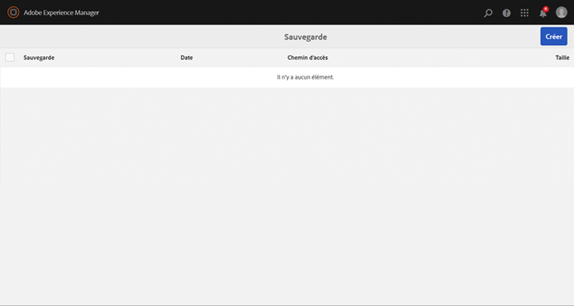
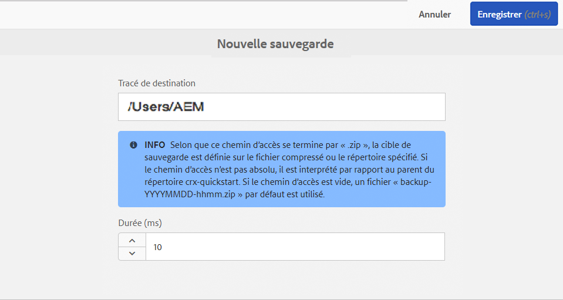
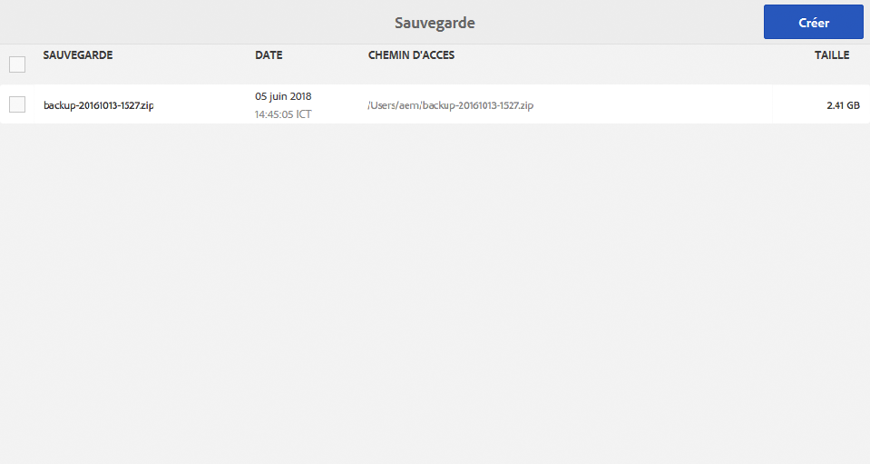

# Sauvegarde et restauration{#backup-and-restore}

Il existe deux façons de sauvegarder et de restaurer le contenu du référentiel dans AEM :

* Vous pouvez créer une sauvegarde externe du référentiel et la stocker en lieu sûr. Si le référentiel est ventilé, vous pouvez le restaurer à l’état précédent.
* Vous pouvez créer des versions internes du contenu du référentiel. Ces versions sont stockées dans le référentiel avec le contenu. Vous pouvez ainsi restaurer rapidement les noeuds et les arborescences que vous avez modifiés ou supprimés.

## Général {#general}

L’approche décrite ici s’applique à la sauvegarde et à la récupération du système.

Si vous devez sauvegarder et/ou récupérer une petite quantité de contenu, qui est perdue, une récupération du système n’est pas nécessairement nécessaire :

* Vous pouvez récupérer les données d’un autre système via un package.
* ou restaurer la sauvegarde sur un système temporaire, créer un module de contenu et le déployer sur le système, où ce contenu est manquant.

Pour plus d’informations, consultez [Sauvegarde de package](/help/sites-administering/backup-and-restore.md#package-backup) ci-dessous.

## Minutage {#timing}

N’exécutez pas la sauvegarde en parallèle du nettoyage de la mémoire d’entrepôt de données, car cela peut nuire aux résultats des deux processus.

## Sauvegarde hors ligne {#offline-backup}

Vous pouvez toujours effectuer une sauvegarde hors ligne. Cela nécessite un temps d’arrêt d’AEM, mais peut s’avérer très efficace en termes de temps requis par rapport à une sauvegarde en ligne.

Le plus souvent, vous utilisez un instantané de système de fichiers pour créer une copie en lecture seule du stockage à ce moment-là. Pour créer une sauvegarde hors ligne, procédez comme suit :

* arrêtez l’application ;
* effectuez une sauvegarde instantanée ;
* démarrez l’application.

Comme la sauvegarde d’instantané ne prend généralement que quelques secondes, le temps d’arrêt complet est inférieur à quelques minutes.

## Sauvegarde en ligne {#online-backup}

Cette méthode de sauvegarde crée une sauvegarde du référentiel entier, y compris les applications déployées dans le référentiel, comme AEM. La sauvegarde comprend le contenu, l’historique des versions, la configuration, le logiciel, les correctifs, les applications personnalisées, les fichiers journaux, les index de recherche, etc. Si vous utilisez la mise en cluster et si le dossier partagé est un sous-répertoire de `crx-quickstart` (physiquement ou à l’aide d’un softlink), le répertoire partagé est lui aussi sauvegardé.

Vous pouvez restaurer ultérieurement l’ensemble du référentiel (et de toutes les applications).

Cette méthode fait office de sauvegarde « à chaud » ou « en ligne » et peut donc être exécutée alors que le référentiel est en cours d’exécution. Par conséquent, le référentiel peut être utilisé alors que la sauvegarde est en cours d’exécution. Cette méthode fonctionne pour les instances de référentiel par défaut, basées sur un stockage au format TAR.

Lors de la création d’une sauvegarde, vous disposez des possibilités suivantes :

* Sauvegarde d’un répertoire à l’aide de l’outil de sauvegarde intégré d’AEM
* Sauvegarde d’un répertoire à l’aide d’un instantané de système de fichiers

Dans tous les cas, la sauvegarde crée une image (ou un instantané) du référentiel. Ensuite, l’agent de sauvegarde du système doit veiller à transférer réellement cette image vers un système de sauvegarde dédié (lecteur de bande magnétique).

>[!NOTE]
>
>Si la fonctionnalité Sauvegarde en ligne d’AEM est utilisée sur une instance AEM qui possède une configuration d’entrepôt de grands objets binaires personnalisée, il est recommandé de configurer le chemin d’accès au magasin de données de sorte qu’il soit à l’extérieur du répertoire `crx-quickstart` et de sauvegarder le magasin de données séparément.

>[!CAUTION]
>
>La sauvegarde en ligne ne sauvegarde que le système de fichiers. Si vous stockez le contenu et/ou les fichiers du référentiel dans une base de données, cette base de données doit être sauvegardée séparément. Si vous utilisez AEM avec MongoDB, consultez la documentation sur l’utilisation de la variable [Outils de sauvegarde natifs MongoDB](https://docs.mongodb.org/manual/tutorial/backup-with-mongodump/).

### Sauvegarde en ligne AEM {#aem-online-backup}

Une sauvegarde en ligne de votre référentiel permet de créer, de télécharger et de supprimer des fichiers de sauvegarde. Il s’agit d’une fonction de sauvegarde &quot;à chaud&quot; ou &quot;en ligne&quot;. Elle peut donc être exécutée pendant que le référentiel est utilisé normalement en mode lecture-écriture.

>[!CAUTION]
>
>N’exécutez pas la fonctionnalité Sauvegarde en ligne d’AEM en même temps que le [Nettoyage de la mémoire de magasin de données](/help/sites-administering/data-store-garbage-collection.md) ou le [Nettoyage des révisions](/help/sites-deploying/revision-cleanup.md#how-to-run-offline-revision-cleanup). Cela affecte les performances du système.

Lors du démarrage d’une sauvegarde, vous pouvez spécifier un **chemin d’accès cible** et un **délai**.

**Chemin cible** Les fichiers de sauvegarde sont généralement enregistrés dans le dossier parent du fichier qui contient le fichier JAR de quickstart (.jar). Par exemple, si le fichier JAR d’AEM se trouve sous /InstallationKits/AEM, la sauvegarde est générée sous /InstallationKits. Vous pouvez également spécifier une cible correspondant à un emplacement de votre choix.

Si le chemin d’**accès cible** est un répertoire, l’image du référentiel est créée dans ce répertoire. Si le même répertoire est utilisé plusieurs fois (ou toujours) pour stocker la sauvegarde,

* les fichiers modifiés dans le référentiel sont modifiés en conséquence dans TargetPath.
* les fichiers supprimés dans le référentiel sont supprimés dans TargetPath.
* les fichiers créés dans le référentiel sont créés dans TargetPath.

>[!NOTE]
>
>If **TargetPath** est défini sur filename avec l’extension **.zip**, le référentiel est sauvegardé dans un répertoire temporaire, puis le contenu de ce répertoire temporaire est compressé et stocké dans le fichier ZIP.
>
>Cette approche est découragée, car
>
>* il nécessite un stockage disque supplémentaire pendant le processus de sauvegarde (répertoire temporaire plus fichier zip).
>* le processus de compression est effectué par le référentiel et peut influer sur ses performances.
>* Cela retarde le processus de sauvegarde.
>* Java 1.6 peut uniquement créer des fichiers ZIP d’une taille de 4 Go.
>
>Si vous devez créer un fichier ZIP comme format de sauvegarde, vous devez effectuer la sauvegarde dans un répertoire, puis utiliser un programme de compression pour créer le fichier ZIP.

**Délai** Indique un délai (en millisecondes) afin que les performances du référentiel ne soient pas affectées. Par défaut, la sauvegarde du référentiel s’exécute à la vitesse maximale. Vous pouvez ralentir la création d’une sauvegarde en ligne afin de ne pas ralentir d’autres tâches.

Lorsque vous utilisez un délai très important, assurez-vous que la sauvegarde en ligne ne met pas plus de 24 heures. En pareil cas, annulez cette sauvegarde, car elle ne contient peut-être pas tous les fichiers binaires.
 Un délai de 1 ms se traduit généralement par l’utilisation de 10 % du processeur. Un délai de 10 ms se traduit généralement par l’utilisation de moins de 3 % du processeur. Le délai total en secondes peut être évalué comme suit : taille du référentiel en Mo, multiplié par le délai en millisecondes, divisé par 2 (si l’option ZIP est utilisée) ou divisé par 4 (en cas de sauvegarde dans un répertoire). Cela signifie qu’une sauvegarde dans un répertoire d’un référentiel de 200 Mo avec un délai de 1 ms augmente le temps de sauvegarde d’environ 50 secondes.

>[!NOTE]
>
>Pour les détails internes du processus, consultez [Fonctionnement de la sauvegarde en ligne d’AEM](#how-aem-online-backup-works).

Pour créer une sauvegarde :

1. Connectez-vous à AEM en tant qu’administrateur.

1. Sélectionnez **Outils > Opérations > Sauvegarde.**
1. Cliquez sur **Créer**. La console de sauvegarde s’affiche.

   

1. Dans la console de sauvegarde, spécifiez le **[chemin d’accès cible](#aem-online-backup)** et le **[délai](#aem-online-backup)**.

   

   >[!NOTE]
   >
   >La console de sauvegarde est également disponible en utilisant :
   >
   >
   >` https://<*hostname*>:<*port-number*>/libs/granite/backup/content/admin.html`

1. Cliquez sur **Enregistrer**. Une barre de progression indique la progression de la sauvegarde.

   >[!NOTE]
   >
   >Vous pouvez **Annuler** une sauvegarde en cours à tout moment.

1. Une fois la sauvegarde terminée, les fichiers zip sont répertoriés dans la fenêtre de sauvegarde.

   

   >[!NOTE]
   >
   >Les fichiers de sauvegarde qui ne sont plus nécessaires peuvent être supprimés à l’aide de la console. Sélectionnez le fichier de sauvegarde dans le volet de gauche, puis cliquez sur **Supprimer**.

   >[!NOTE]
   >
   >Si vous avez sauvegardé un répertoire : une fois le processus de sauvegarde terminé, AEM n’écrira pas dans le répertoire cible.

### Automatisation AEM sauvegarde en ligne {#automating-aem-online-backup}

Si possible, la sauvegarde en ligne doit être exécutée lorsque la charge du système est faible, par exemple le matin.

Les sauvegardes peuvent être automatisées à l’aide du client HTTP `wget` ou `curl`. Vous trouverez ci-dessous des exemples d’automatisation de la sauvegarde à l’aide de curl.

#### Sauvegarde dans le répertoire cible par défaut {#backing-up-to-the-default-target-directory}

>[!CAUTION]
>
>Dans l’exemple ci-dessous, différents paramètres dans la commande `curl` doivent être configurés pour votre instance. Par exemple, le nom d’hôte (`localhost`), le port (`4502`), le mot de passe administrateur (`xyz`) et le nom de fichier (`backup.zip`).

```shell
curl -u admin:admin -X POST http://localhost:4502/system/console/jmx/com.adobe.granite:type=Repository/op/startBackup/java.lang.String?target=backup.zip
```

Le fichier/répertoire de sauvegarde est créé sur le serveur dans le dossier parent du dossier qui contient le dossier `crx-quickstart` (le même que si vous étiez en train de créer la sauvegarde à l’aide du navigateur). Par exemple, si vous avez installé AEM dans le répertoire `/InstallationKits/crx-quickstart/`, la sauvegarde est ensuite créée dans le répertoire `/InstallationKits`.

La commande curl renvoie immédiatement une valeur. Vous devez donc surveiller ce répertoire pour savoir quand le fichier ZIP est prêt. Alors que la sauvegarde est en cours de création, un répertoire temporaire (dont le nom dépend du fichier ZIP final) s’affiche et à la fin, il est compressé. Par exemple :

* nom du fichier ZIP créé : `backup.zip`
* nom du répertoire temporaire : `backup.f4d5.temp`

#### Sauvegarde dans un répertoire cible autre que le répertoire par défaut {#backing-up-to-a-non-default-target-directory}

En général, le fichier/répertoire de sauvegarde est créé sur le serveur, dans le dossier parent du dossier qui contient le dossier `crx-quickstart`.

Si vous souhaitez enregistrer votre sauvegarde (indépendamment du type) à un autre emplacement, vous pouvez définir un chemin d’accès absolu dans le paramètre `target` dans la commande `curl`.

Par exemple, pour générer le fichier `backupJune.zip` dans le répertoire `/Backups/2012` :

```shell
curl -u admin:admin -X POST http://localhost:4502/system/console/jmx/com.adobe.granite:type=Repository/op/startBackup/java.lang.String?target=/Backups/2012/backupJune.zip"
```

>[!CAUTION]
>
>Lorsque vous utilisez un autre serveur d’applications (comme JBoss), la sauvegarde en ligne risque de ne pas fonctionner comme prévu, car le répertoire cible n’est pas accessible en écriture. Dans ce cas, veuillez contacter l’assistance.

>[!NOTE]
>
>Une sauvegarde peut également être déclenchée. [à l’aide des MBeans fournis par AEM](/help/sites-administering/jmx-console.md).

### Sauvegarde instantanée du système de fichiers {#filesystem-snapshot-backup}

Le processus décrit ici est particulièrement adapté aux référentiels volumineux.

>[!NOTE]
>
>Si vous souhaitez utiliser cette approche de la sauvegarde, votre système doit prendre en charge les instantanés de système de fichiers. Par exemple, pour Linux, cela signifie que vos systèmes de fichiers doivent être placés sur un volume logique.

1. Créez un instantané du système de fichiers sur lequel AEM est déployé.

1. Montez l’instantané du système de fichiers.
1. Effectuez une sauvegarde et démontez l’instantané.

### Fonctionnement de la sauvegarde en ligne AEM {#how-aem-online-backup-works}

La sauvegarde en ligne d’AEM comprend une série d’actions internes pour s’assurer de l’intégrité des données sauvegardées et des fichiers de sauvegarde créés. Elles sont répertoriées ci-dessous à l’intention des personnes intéressées.

La sauvegarde en ligne utilise l’algorithme suivant :

1. Lors de la création d’un fichier ZIP, la première étape consiste à créer ou à chercher le répertoire cible.

   * Si vous effectuez une sauvegarde dans un fichier ZIP, un répertoire temporaire est créé. Le nom du répertoire commence par `backup.` et se termine par `.temp` ; par exemple `backup.f4d3.temp`.
   * Si vous effectuez une sauvegarde dans un répertoire, le nom spécifié dans le chemin d’accès cible est utilisé. Un répertoire existant peut être utilisé, sinon un nouveau répertoire sera créé.

      Un fichier vide nommé « `backupInProgress.txt` » est créé dans le répertoire cible au début de la sauvegarde. Ce fichier est supprimé lorsque la sauvegarde est terminée.

1. Les fichiers sont copiés du répertoire source vers le répertoire cible (ou vers un répertoire temporaire lors de la création d’un fichier ZIP). L’entrepôt de segments est copié avant le magasin de données afin d’éviter d’altérer le référentiel. Les données d’index et du cache sont omises lors de la création de la sauvegarde. Par conséquent, les données des répertoires `crx-quickstart/repository/cache` et `crx-quickstart/repository/index` ne sont pas incluses dans la sauvegarde. L’indicateur de la barre de progression du processus est compris entre 0 % et 70 % lors de la création d’un fichier ZIP ou entre 0 % et 100 % si aucun fichier ZIP n’est créé.

1. Si la sauvegarde est effectuée dans un répertoire préexistant, les « anciens » fichiers du répertoire cible sont supprimés. Les anciens fichiers sont des fichiers qui n’existent pas dans le répertoire source.

Les fichiers sont copiés dans le répertoire cible en quatre étapes :

1. Lors de la première étape de copie (indicateur de progression compris entre 0 % et 63 % lors de la création d’un fichier ZIP ou entre 0 % et 90 % si aucun fichier ZIP n’est créé), tous les fichiers sont copiés alors que le référentiel est exécuté normalement. Le processus comporte deux phases :

   * Phase A : tout est copié, à l’exception de la banque de données (avec délai).
   * Phase B : seule la banque de données est copiée (avec délai).

1. Lors de la deuxième étape de copie (indicateur de progression compris entre 63 % et 65,8 % lors de la création d’un fichier ZIP ou entre 90 % et 94 % si aucun fichier ZIP n’est créé), seuls les fichiers créés ou modifiés dans le répertoire source depuis le début de la première étape de copie sont copiés. En fonction de l’activité du référentiel, cela peut aussi bien correspondre à aucun fichier ou à un nombre de fichiers significatif (car la première étape de la copie des fichiers prend généralement beaucoup de temps). Le processus de copie est similaire à la première étape (phase A et phase B avec un délai).
1. Lors de la troisième étape de copie (indicateur de progression compris entre 65,8 % et 68,6 % lors de la création d’un fichier ZIP ou entre 94 % et 98 % si aucun fichier ZIP n’est créé), seuls les fichiers créés ou modifiés dans le répertoire source depuis le début de la deuxième étape de la copie sont copiés. En fonction de l’activité du référentiel, il peut n’y avoir aucun fichier à copier ou un très petit nombre de fichiers (car la deuxième étape de copie des fichiers est généralement rapide). Le processus de copie est similaire à la deuxième étape (phase A et phase B mais sans délai).
1. Les étapes de copie des fichiers, de la première à la troisième, sont toutes effectuées simultanément alors que le référentiel est en cours d’exécution. Seuls les fichiers créés ou modifiés dans le répertoire source depuis le début de la troisième étape de copie sont copiés. En fonction de l’activité du référentiel, il peut n’y avoir aucun fichier à copier ou un vraiment très petit nombre de fichiers (car la deuxième étape de copie des fichiers est généralement très rapide). L’indicateur de progression est compris entre 68,6 % et 70 % lors de la création d’un fichier ZIP ou entre 98 % et 100 % si aucun fichier ZIP n’est créé. Le processus de copie est similaire à la troisième étape.
1. Selon la cible :

   * Si un fichier ZIP a été spécifié, il est maintenant créé dans le répertoire temporaire. Indicateur de progression 70 % à 100 %. Le répertoire temporaire est alors supprimé.
   * Si la cible est un répertoire, le fichier vide `backupInProgress.txt` est supprimé pour indiquer que la sauvegarde est terminée.

## Restauration de la sauvegarde {#restoring-the-backup}

Vous pouvez restaurer une sauvegarde comme suit :

* Si vous avez effectué une sauvegarde d’instantané du système de fichiers, vous pouvez simplement restaurer une image du système.
* Si vous avez créé la sauvegarde sous la forme d’un fichier zip, décompressez simplement le contenu dans un nouveau dossier et lancez l’AEM à partir de cet emplacement.

## Sauvegarde de package {#package-backup}

Pour sauvegarder et restaurer du contenu, vous pouvez utiliser l’un des gestionnaires de packages, qui utilise le format de package de contenu pour sauvegarder et restaurer du contenu. Le gestionnaire de packages offre davantage de flexibilité pour définir et gérer les packages.

Pour plus d’informations sur les fonctionnalités et les compromis de chacun de ces formats de modules de contenu individuels, voir [Utilisation de modules](/help/sites-administering/package-manager.md).

### Portée de la sauvegarde {#scope-of-backup}

Lorsque vous sauvegardez des nœuds à l’aide du gestionnaire de packages ou de Content Zipper, CRX enregistre les informations suivantes :

* Le contenu du référentiel sous l’arborescence que vous avez sélectionnée.
* Définitions de type Node utilisées pour le contenu sauvegardé.
* Définitions des espaces de noms utilisées pour le contenu sauvegardé.

Lors de la sauvegarde, AEM perd les informations suivantes :

* L’historique des versions
