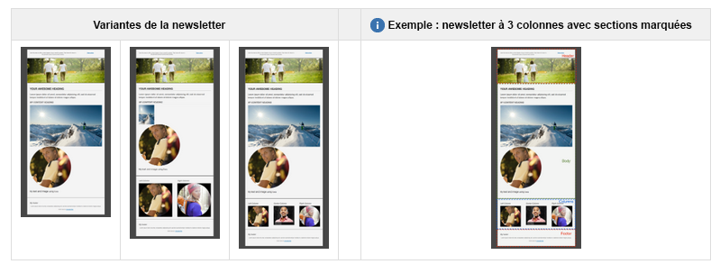

# Meilleures pratiques des modèles de courrier électronique {#best-practices-for-email-templates}

>[!CAUTION]
>
>Les composants de courrier électronique AEM sont obsolètes. En raison de la nature de l’e-mail, qui fusionne le contenu et le style, les composants de l’e-mail fournis prêts à l’emploi par AEM deviennent de réutilisation limitée pour les clients, en raison de la nécessité d’implémenter des styles personnalisés dans les composants requis pour les projets.
>
>Les composants de courrier électronique peuvent être implémentés au niveau du projet et les composants de courrier électronique AEM obsolètes illustrent la manière dont cela peut être réalisé. Toutefois, ces composants obsolètes ne doivent pas être utilisés sur les projets.

Ce document décrit certaines des meilleures pratiques concernant la conception de courrier électronique, qui aboutissent à la création d’un modèle de campagne par courrier électronique bien développé.

La campagne de démonstration disponible dans AEM observe toutes ces meilleures pratiques. La manière dont les meilleures pratiques sont mises en œuvre dans la campagne de démonstration est décrite pour chaque bonne pratique.

Utilisez ces meilleures pratiques pour créer votre propre newsletter.

>[!NOTE]
>
>Tout le contenu de la campagne doit être créé sous une `master` page de type `cq/personalization/components/ambitpage`.
>
>Par exemple, si votre structure de campagne planifiée ressemble à
>
>`/content/campaigns/teasers/en/campaign-promotion-global`
>
>Vous devez vous assurer qu’il réside sous une `master` page
>
>`/content/campaigns/teasers/master/en/campaign-promotion-global`

>[!NOTE]
>
>When creating a mail template for Adobe Campaign, you must include the property **acMapping** with the value **mapRecipient** in the **jcr:content** node of the template, or you will not be able to select the Adobe Campaign template in **Page Properties** of AEM (field is disabled).

## Composant de modèle/page {#template-page-component}

***/libs/mcm/campaign/components/campaign_newsletterpage***

<table>
 <tbody>
  <tr>
   <td><strong>Meilleure pratique</strong></td>
   <td><strong>Mise en œuvre</strong></td>
  </tr>
  <tr>
   <td>
Spécifiez le type de  du pour assurer un rendu cohérent.
 
Ajouter DOCTYPE au début (HTML ou XHTML)
 </td>
   <td>
Est configurable en modifiant la propriété <i>cq:doctype</i> dans<i>"/etc/designs/default/jcr:content/campaign_newsletterpage"</i>
 
La valeur par défaut est "XHTML" :
 
&lt;!DOCTYPE html PUBLIC "-//W3C//DTD XHTML 1.0 transitionnel//EN" "https://www.w3.org/TR/xhtml1/DTD/xhtml1-transitional.dtd"&gt;
 
Peut être remplacé par "HTML_5" :
 
&lt;!DOCTYPE HTML&gt;
 </td>
  </tr>
  <tr>
   <td>
Spécifiez la définition des caractères pour garantir le rendu correct des caractères spéciaux.
 
Ajouter déclaration CHARSET (ex. : iso-8859-15, UTF-8) à &lt;head&gt;
 </td>
   <td>
Est défini sur UTF-8.
 
&lt;meta http-equiv="content-type" content="text/html; charset=UTF-8"&gt;
 </td>
  </tr>
  <tr>
   <td>
Codez toute la structure à l’aide de l’élément &lt;table&gt;. Pour des mises en page plus compliquées, vous devez imbriquer les tableaux pour créer des structures complexes.
 
Le courrier électronique devrait avoir l'air bien, même sans css.
 </td>
   <td>
Les tableaux sont utilisés dans tout le modèle pour structurer le contenu. Actuellement, il est possible d’utiliser un maximum de quatre tableaux imbriqués (1 tableau de base + 3 niveaux d’imbrication)
 
Les balises &lt;div&gt; ne sont utilisées qu’en mode création pour garantir une modification appropriée des composants.
 </td>
  </tr>
  <tr>
   <td>Utilisez les attributs d’élément (tels que le remplissage de la cellule, la valeur et la largeur) pour définir les dimensions d’un tableau. Ceci force une structure boîte-modèle.</td>
   <td>
Tous les tableaux contiennent les attributs nécessaires, tels que <i>bordure</i>, <i>remplissage</i>cellulaire, espacement <i>entre les cellules et</i> <i>largeur.</i>
 
To harmonize element positioning inside tables, all table cells have the attribute <i>valign="top"</i> being set.
 </td>
  </tr>
  <tr>
   <td>
Tenez compte, si possible, de la convivialité mobile. Utilisez les requêtes multimédias pour augmenter la taille du texte sur les petits écrans et fournir des zones actives de la taille d’une vignette pour les liens.
 
Rendez un courrier électronique interactif si la conception l’autorise.
 </td>
   <td>Dans la mesure où les styles CSS sont utilisés pour illustrer la conception de démonstration, les requêtes multimédias le sont pour proposer une version conviviale pour les appareils mobiles.</td>
  </tr>
  <tr>
   <td>Le format CSS intégré est préférable à la mise en page de toutes les feuilles de style CSS au début.</td>
   <td>
Pour mieux démontrer la structure HTML sous-jacente et utiliser la possibilité de personnaliser la structure de newsletter, seules certaines définitions CSS ont été intégrées.
 
Les styles de base et les variations de modèle ont été extraits dans un bloc de style dans le &lt;head&gt; de la page. À l’envoi final de la newsletter, ces définitions CSS doivent être intégrées dans la structure HTML. Un mécanisme d’intégration automatique est prévu, mais n’est actuellement pas disponible.
 </td>
  </tr>
  <tr>
   <td>Restez simple avec votre CSS. Évitez les déclarations de style composées, les formes courtes de code, les propriétés de mise en page CSS, les sélecteurs complexes et les pseudo-éléments.</td>
   <td>Dans la mesure où les styles CSS sont utilisés pour illustrer la conception de démonstration, les recommandations CSS sont observées.</td>
  </tr>
  <tr>
   <td>La largeur maximale des courriels doit être comprise entre 600 et 800 pixels. Ils auront ainsi un meilleur comportement dans le panneau d’aperçu de la plupart des clients.</td>
   <td>The <i>width</i> of content table is limited to 600px in demo design.</td>
  </tr>
 </tbody>
</table>

### Images {#images}

/libs/mcm/campaign/components/image

| **Meilleure pratique** | **Mise en œuvre** |
|---|---|
| Ajouter attributs *alt* aux images | L’attribut *alt* a été défini comme obligatoire pour le composant d’image. |
| Utiliser *jpg* au lieu du format *png* pour les images | Les images seront toujours diffusées au format JPG par le composant d’image. |
| Utilisez `` un élément au lieu des images d’arrière-plan dans un tableau. | Aucune donnée d’image d’arrière-plan n’est utilisée dans les modèles. |
| Ajouter attribut style=&quot;bloc d’affichage&quot; sur les images. Permet d’obtenir un affichage correct dans Gmail. | Toutes les images contiennent par défaut l’attribut *style=&quot;bloc d’affichage&quot;* . |

### Texte et liens {#text-and-links}

/libs/mcm/campaign/components/heading, /libs/mcm/campaign/components/textimage

<table>
 <tbody>
  <tr>
   <td><strong>Meilleure pratique</strong></td>
   <td><strong>Mise en œuvre</strong></td>
  </tr>
  <tr>
   <td>Utilisez html &lt;font&gt; au lieu de style dans CSS (font-family)</td>
   <td>RichTextEditor (par exemple dans le composant textimage) prend désormais en charge le choix et l’application de familles de polices et de tailles de police aux textes sélectionnés. Ils seront rendus sous la forme de balises &lt;font&gt;.</td>
  </tr>
  <tr>
   <td>Utilisez des polices de base multiplateformes, telles que <i>Arial, Verdana, Georgia</i> et <i>Times New Roman</i>.</td>
   <td>
Dépend de la conception du bulletin d’information.
 
Pour la conception de la démo, la police "Helvetica" est utilisée, mais elle revient à la police générique sans-serif, si elle n'est pas présente.
 </td>
  </tr>
 </tbody>
</table>

### Générique {#generic}

| **Meilleure pratique** | **Mise en œuvre** |
|---|---|
| Utilisez le validateur W3C pour corriger le code HTML. Assurez-vous que toutes les balises ouvertes sont correctement fermées. | Le code a été validé. Pour la documentation de transition XHTML, seul l’attribut xmlns manquant pour la variable <html> est absent. |
| Ne vous embêtez pas avec JavaScript ou Flash : ces technologies ne sont en grande partie pas prises en charge par les clients du courrier électronique. | Ni JavaScript ni Flash ne sont utilisés dans le modèle de newsletter. |
| Ajouter une version en texte brut pour l’envoi en plusieurs parties. | Un nouveau widget a été créé dans les propriétés de la page pour extraire facilement une version en texte brut du contenu de la page. Ceci peut être utilisé comme point de départ pour la version en texte brut finale. |

## Modèles et exemples de newsletter de campagne {#campaign-newsletter-templates-and-examples}

AEM est fourni avec des modèles et des composants clé en main vous permettant de créer des newsletters de campagne. Vous pouvez utiliser ces modèles et composants pour créer vos newsletters personnalisées.

### Modèles {#templates}

Pour offrir une base solide et élargir la variété de possibilités de flux de contenu, trois types de modèle légèrement différents sont disponibles clé en main. Vous pouvez facilement les utiliser pour créer une newsletter personnalisée.

All have a **header**, a **footer** and a **body** section. Below the body section, each template differs in **column design** (1, 2 or 3 columns).

### Composants {#components}

[Sept composants sont actuellement disponibles dans les modèles de campagne](/help/sites-authoring/adobe-campaign-components.md). Tous ces composants sont basés sur le langage de balisage **HTL** d’Adobe.

| **Nom du composant** | **Chemin du composant** |
|---|---|
| En-tête | /libs/mcm/campaign/components/heading |
| Image | /libs/mcm/campaign/components/image |
| Texte et personnalisation | /libs/mcm/campaign/components/personalization |
| Textimage | /libs/mcm/campaign/components/textimage |
| Lien | /libs/mcm/campaign/components/reference |
| Modèle d’image Scene7 | /libs/mcm/campaign/s7image |
| Référence ciblée | /libs/mcm/campaign/components/reference |

>[!NOTE]
>
>Ces composants sont optimisés pour le contenu de courrier électronique. En d’autres termes, ils respectent les meilleures pratiques décrites dans ce document. L’utilisation d’autres composants clé en main va généralement à l’encontre de ces règles.

Ces composants sont décrits en détail dans [Composants Adobe Campaign](/help/sites-authoring/adobe-campaign-components.md).