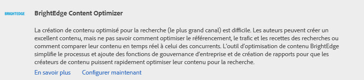
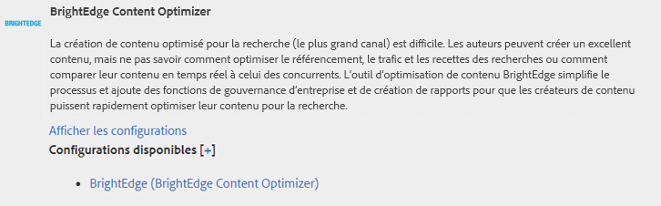
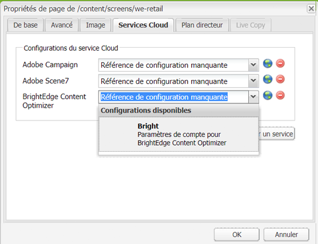
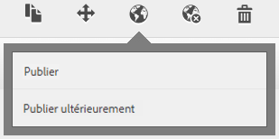
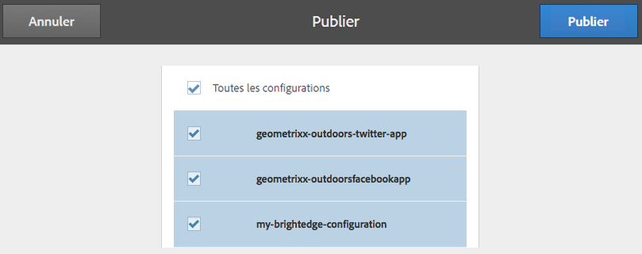

# Intégration à BrightEdge Content Optimizer{#integrating-with-brightedge-content-optimizer}

Créez une configuration de cloud BrightEdge afin qu’AEM puisse se connecter à l’aide des informations d’identification de votre compte BrightEdge. Vous pouvez créer plusieurs configurations si vous utilisez plusieurs comptes.

Lorsque vous créez la configuration, vous spécifiez un titre. Le titre doit être éloquent afin que les gens puissent corréler la configuration au compte BrightEdge. Lorsque le créateur ou l’administrateur d’une page associe une page web à un compte BrightEdge, ce titre figure dans une liste déroulante.

1. Sur le rail, cliquez sur Outils > Opérations > Cloud > Services cloud.
1. Cliquez sur le lien qui s’affiche dans la section BrightEdge Content Optimizer. Selon qu’une configuration BrightEdge a été créée ou non, le texte du lien varie :

   * Configurer maintenant : ce lien s’affiche lorsque aucune configuration n’a été créée.
   * Afficher les configurations : ce lien s’affiche lorsqu’une ou plusieurs configurations ont été créées.

   

1. Si vous avez cliqué sur Afficher les configurations, cliquez sur le lien « + » en regard des configurations disponibles.
1. Saisissez un titre pour la configuration. Éventuellement, saisissez un nom pour le nœud utilisé afin de stocker la configuration dans le référentiel. Cliquez sur Créer.
1. Dans la boîte de dialogue Configuration de BrightEdge Content Optimizer, saisissez le nom d’utilisateur et le mot de passe du compte BrightEdge, puis cliquez sur OK.

## Modification d’une configuration BrightEdge {#editing-a-brightedge-configuration}

Modifiez le nom d’utilisateur et le mot de passe d’une configuration BrightEdge, au besoin. Les modifications affectent toutes les pages qui utilisent la configuration.

1. Sur le rail, cliquez sur Outils > Opérations > Cloud > Services cloud.
1. Dans la section BrightEdge Content Optimizer, cliquez sur Afficher les configurations.

   

1. Cliquez sur le nom de la configuration à modifier.
1. Cliquez sur Modifier, modifiez les valeurs des propriétés, puis cliquez sur OK.

## Association de pages à une configuration BrightEdge  {#associating-pages-with-a-brightedge-configuration}

Associez des pages à une configuration BrightEdge pour envoyer des données de page au service BrightEdge pour analyse. Lorsque vous associez une page à une configuration, les pages enfants héritent de l’association. En général, vous associez la page d’accueil du site afin que les données de toutes les pages soient envoyées à BrightEdge.

1. Ouvrez la console Sites web classique. ([http://localhost:4502/siteadmin#/content](http://localhost:4502/siteadmin#/content))
1. Dans l’arborescence des sites web, sélectionnez le dossier ou la page contenant la page à associer à la configuration BrightEdge.
1. Dans la liste des pages, cliquez avec le bouton droit sur la page à configurer, puis cliquez sur Propriétés.
1. Dans l’onglet Services cloud, cliquez sur le bouton Ajouter un service puis, dans la boîte de dialogue Services cloud, sélectionnez BrightEdge Content Optimizer et cliquez sur OK.
1. Dans la liste BrightEdge Content Optimizer, sélectionnez la configuration BrightEdge à associer à la page, puis cliquez sur OK.

   

## Activation d’une configuration BrightEdge {#activating-a-brightedge-configuration}

Activez une configuration BrightEdge pour la répliquer sur l’instance de publication et permettre aux pages publiées d’interagir avec le service BrightEdge.

1. Sur le rail, cliquez sur Sites, puis sélectionnez la page que vous avez associée à la configuration BrightEdge.
1. Cliquez ou appuyez sur l’icône Publier, puis sur Publier.

   

1. Dans la liste des configurations qui s’affichent, assurez-vous que la configuration BrightEdge est sélectionnée, puis cliquez sur Publier.

   

