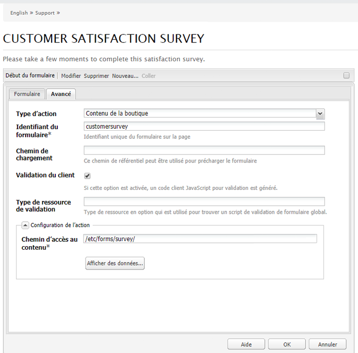
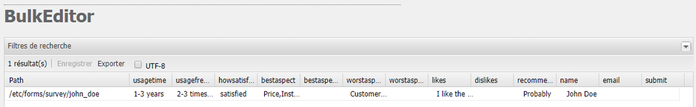
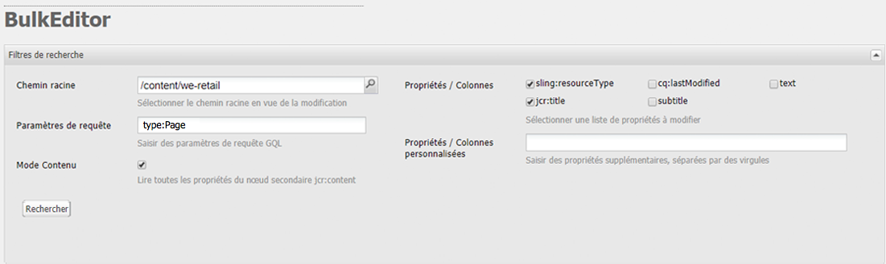
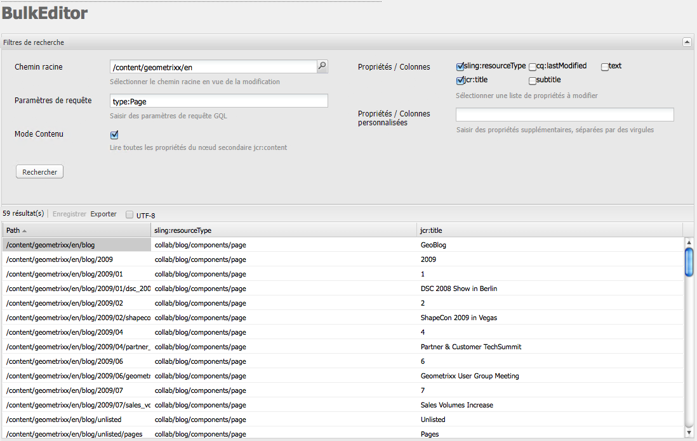
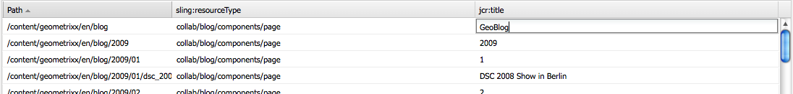
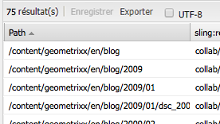

# Éditeur en bloc{#the-bulk-editor}

L’éditeur en bloc permet une modification très efficace lorsque le contexte visuel de la page n’est pas nécessaire, car il permet :

* de chercher (et afficher) le contenu de plusieurs pages, à l’aide du langage de requête de Google (Google Query Language, GQL) ;
* de modifier directement ce contenu dans l’éditeur en bloc ;
* d’enregistrer les modifications (dans les pages d’origine) ;
* d’exporter ce contenu vers un fichier de feuille de calcul de données séparées par des tabulations (.tsv).

>[!NOTE]
>
>Vous pouvez également importer du contenu dans le référentiel, mais il est désactivé par défaut pour l’éditeur en bloc selon sa disponibilité dans la console **Outils**.

Cette section décrit comment utiliser l’éditeur en bloc dans la console **Outils**. En général, les administrateurs utilisent l’éditeur en bloc pour chercher et modifier différents éléments. Cette opération est effectuée en renseignant le tableau à l’aide d’une requête GQL, puis en sélectionnant les éléments de contenu sur lesquels travailler. Les créateurs utilisent généralement l’éditeur en bloc dans le cadre d’une application d’éditeur en bloc personnalisée par le biais du composant [Liste de produits](/help/sites-authoring/default-components.md#productlist).

>[!CAUTION]
>
>Avec l’[abandon de l’IU classique](/help/release-notes/deprecated-removed-features.md) dans AEM 6.4, l’éditeur en bloc a également été abandonné et Adobe ne prévoit donc pas de l’améliorer.

## Exemple de cas d’utilisation pour l’éditeur en bloc {#example-use-case-for-the-bulk-editor}

Si, par exemple, vous avez besoin de l’ensemble des noms et des adresses électroniques des utilisateurs qui ont rempli une enquête particulière, l’éditeur en bloc peut fournir ces informations, et vous pouvez les exporter dans une feuille de calcul.

Le site web Geometrixx est un exemple de cas d’utilisation :

1. Accédez à la page **Support**, puis à l’enquête de **satisfaction des clients vis-à-vis du service**.
1. **Modifiez** le paragraphe **Début du formulaire**. Dans la boîte de dialogue, cliquez sur l’onglet **Avancé**, développez la **Configuration de l’action**, puis cliquez sur **Afficher les données...**.

   

1. L’éditeur en bloc est entièrement personnalisable, même si, dans cet exemple, il ne permet pas aux utilisateurs de modifier le contenu, mais seulement d’exporter les informations vers une feuille de calcul.

   

## Utilisation de l’éditeur en bloc {#how-to-use-the-bulk-editor}

L’éditeur en bloc permet ce qui suit :

* [de rechercher du contenu en fonction de paramètres de requête afin d’afficher les propriétés spécifiées des résultats dans des colonnes, de modifier ce contenu et d’enregistrer les modifications ;](#searching-and-editing-content)
* [d’exporter ce contenu vers une feuille de calcul de données séparées par des tabulations ;](#exporting-content)

* [d’importer le contenu d’une feuille de calcul de données séparées par des tabulations.](#importing-content)

### Recherche et modification du contenu {#searching-and-editing-content}

Pour utiliser l’éditeur en bloc pour modifier simultanément différents éléments, procédez comme suit :

1. Dans la console **Outils**, cliquez sur le dossier **Importateurs** pour le développer.
1. Double-cliquez sur l’**éditeur en bloc** pour l’ouvrir.
1. Saisissez les exigences de sélection :

<table>
 <tbody>
  <tr>
   <td>Champ</td>
   <td>Propriété</td>
  </tr>
  <tr>
   <td>Chemin racine</td>
   <td>Indique le chemin racine recherché par l’éditeur en bloc.  Par exemple, <code>/content/geometrixx/en</code>. L’éditeur en bloc effectue une recherche dans tous les nœuds enfants.</td>
  </tr>
  <tr>
   <td>Paramètres de requête</td>
   <td>A l’aide des paramètres GQL, entrez la chaîne de recherche que l’éditeur en vrac doit rechercher dans le référentiel ; par exemple, <code>type:Page</code> recherche toutes les pages du chemin racine, <code>text:professional</code> recherche toutes les pages qui contiennent le mot "professionnel" et <code>"jcr:title":English</code> recherche toutes les pages dont le titre est "anglais". Vous pouvez rechercher uniquement des chaînes.</td>
  </tr>
  <tr>
   <td>Case à cocher Mode de contenu</td>
   <td>Activez cette case à cocher pour lire les propriétés dans le sous-noeud <code>jcr:content</code> des résultats de la recherche, le cas échéant. À utiliser uniquement pour des pages. Les noms de propriété sont précédés du préfixe <code>"jcr:content/"</code></td>
  </tr>
  <tr>
   <td>Propriétés / Colonnes</td>
   <td>Cochez les cases correspondant aux propriétés que l’éditeur en vrac doit renvoyer. Les propriétés que vous sélectionnez sont les titres de colonne dans le volet de résultats. Par défaut, le chemin d’accès au nœud est affiché dans les résultats.</td>
  </tr>
  <tr>
   <td>Propriétés / Colonnes personnalisées</td>
   <td>Entrez toute autre propriété qui n'est pas répertoriée dans le champ <strong>Propriétés/Colonnes</strong>. Ces propriétés personnalisées s’affichent dans le volet de résultats. Vous pouvez ajouter plusieurs propriétés en les séparant par des virgules. <i>Remarque : </i> si vous ajoutez une propriété personnalisée qui n’existe pas encore, AEM WCM affiche une cellule vide. Lorsque vous modifiez la cellule vide et que vous l’enregistrez, la propriété est ajoutée au nœud. La propriété qui vient d’être créée doit respecter les contraintes de type de nœud et les espaces de noms des propriétés.</td>
  </tr>
 </tbody>
</table>

Par exemple :

1. Cliquez sur **Rechercher**. L’éditeur en bloc affiche les résultats.
Pour l’exemple ci-dessus, toutes les pages qui correspondent aux critères de recherche sont renvoyées et affichées avec les colonnes demandées.

   

1. Apportez les modifications nécessaires en double-cliquant dans une cellule.

   

1. Cliquez sur **Enregistrer** pour enregistrer les modifications (le bouton **Enregistrer** est activé une fois que vous avez modifié une cellule).

   >[!CAUTION]
   >
   >Les modifications que vous apportez sont écrites dans le contenu du référentiel, par exemple la page référencée dans **Chemin d’accès**.

#### Paramètres de requête GQL supplémentaires {#additional-gql-query-parameters}

* **path:** uniquement les noeuds de recherche sous ce chemin. Si vous spécifiez plusieurs termes avec un préfixe de chemin d’accès, seul le dernier terme sera pris en compte.
* **type : renvoie** uniquement les noeuds des types de noeud donnés. Cela inclut le type principal, ainsi que les types Mixin. Vous pouvez spécifier plusieurs types de nœuds séparés par des virgules. GQL renvoie les nœuds correspondant à l’un des types spécifiés.
* **order :** trier le résultat selon les propriétés données. Vous pouvez spécifier plusieurs noms de propriété séparés par des virgules. Pour contrôler le résultat dans l’ordre descendant, ajoutez simplement le préfixe « - » (moins) au nom de la propriété. Par exemple : order:-name. Si vous utilisez un signe « + » (plus), le résultat est renvoyé dans l’ordre ascendant, qui est également le paramètre par défaut.
* **limit :** limite le nombre de résultats à l’aide d’un intervalle. Par exemple : limit:10.20 Veuillez noter que l&#39;intervalle est de base zéro, le début est inclusif et la fin est exclusive. Vous pouvez également spécifier un intervalle ouvert : limit:10.. ou limite :..20 Si les points sont omis et qu&#39;une seule valeur est spécifiée, GQL renvoie au maximum ce nombre de résultats. Par exemple, limit:10 (renverra les 10 premiers résultats)

### Exportation de contenu {#exporting-content}

Vous pouvez avoir besoin d’exporter du contenu et d’y apporter des modifications dans une feuille de calcul Excel. Vous souhaitez, par exemple, exporter une liste de diffusion et modifier l’indicatif régional de tous les numéros de téléphone répertoriés directement dans Excel, ajouter des lignes supplémentaires, etc.

Pour exporter du contenu, procédez comme suit :

1. Recherchez le contenu, comme indiqué dans la section [Recherche et modification du contenu](#searching-and-editing-content).
1. Cliquez sur **Exporter** pour exporter les modifications dans une feuille de calcul Excel de données séparées par des tabulations. La gestion de contenu web AEM vous invite à indiquer l’emplacement où télécharger le fichier.

   >[!NOTE]
   >
   >Par défaut, les modifications sont codées en [Windows-1252](https://fr.wikipedia.org/wiki/Windows-1252) (également appelé « CP-1252 »). Vous pouvez cocher UTF-8 pour exporter les modifications au format UTF-8.

   

1. Sélectionnez l’emplacement et confirmez que vous souhaitez télécharger le fichier.
1. Une fois que vous avez téléchargé le fichier, vous pouvez l’ouvrir dans votre tableur, par exemple, Microsoft Excel. Le tableur importe le fichier et le convertit au format de la feuille de calcul.

   

### Importation de contenu  {#importing-content}

Par défaut, la fonctionnalité d’importation est masquée lorsque vous ouvrez l’éditeur en bloc. Il suffit d’ajouter le paramètre `hib=false` à l’adresse URL pour afficher le bouton **Importer** dans la page Éditeur en bloc. Vous pouvez importer du contenu à partir de n’importe quel fichier séparé par des tabulations ( `.tsv`). Pour que l’importation fonctionne correctement, les titres de colonne (première ligne des cellules) doivent correspondre aux titres de colonne du tableau dans lequel vous importez le contenu.

>[!NOTE]
>
>Lorsque vous réimportez le contenu, vous effacez le contenu existant de ces nœuds. Veillez à ne pas remplacer des informations importantes.

Pour importer du contenu, procédez comme suit :

1. Ouvrez l’éditeur en bloc.
1. Ajouter `?hib=false` à l’URL, par exemple :
   `https://localhost:4502/etc/importers/bulkeditor.html?hib=false`
1. Cliquez sur **Importer**.
1. Sélectionnez le fichier `.tsv`. Les données sont importées dans le référentiel.