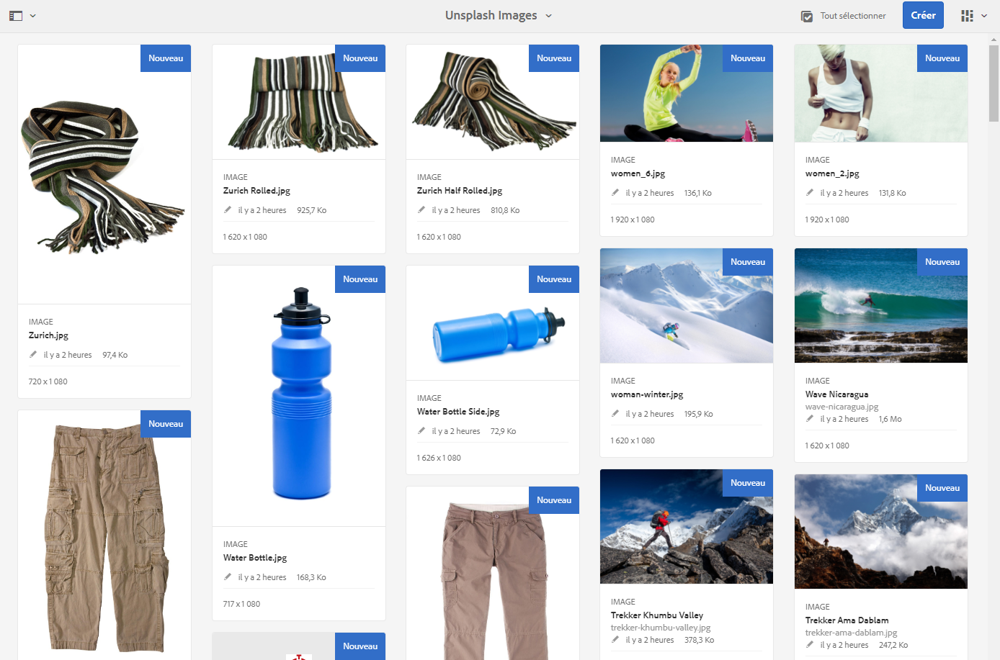
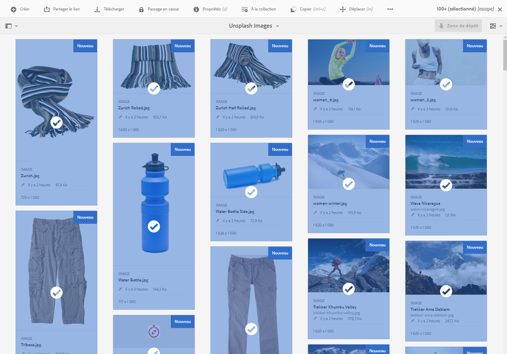
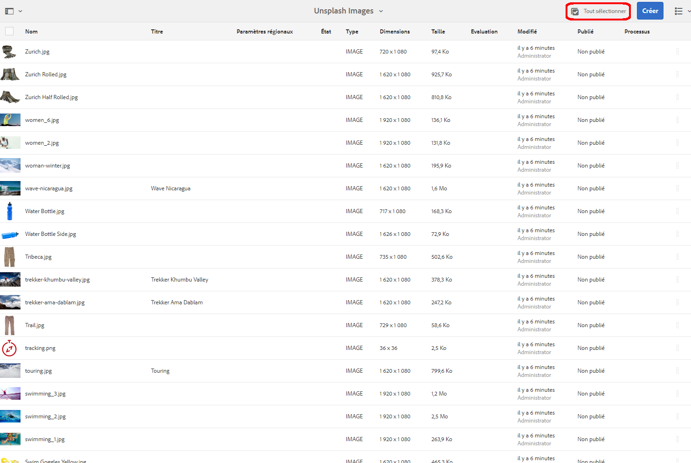
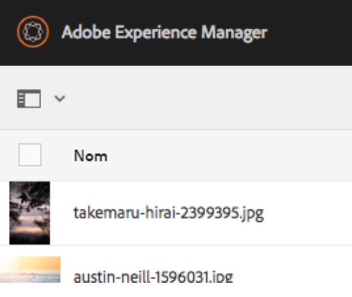
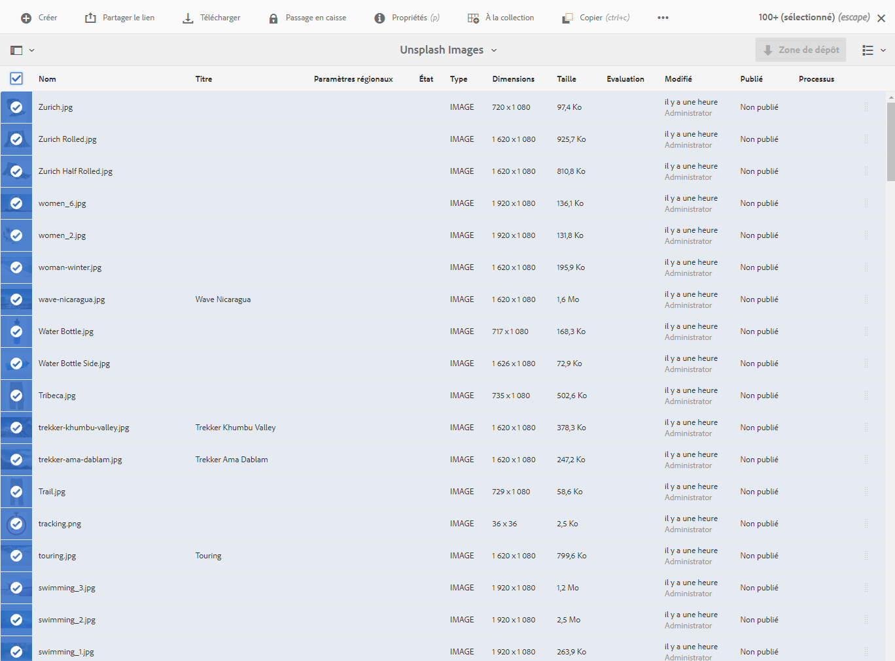
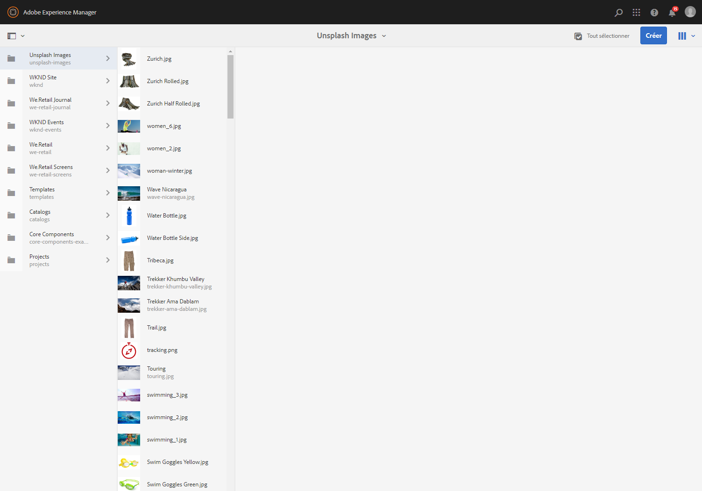
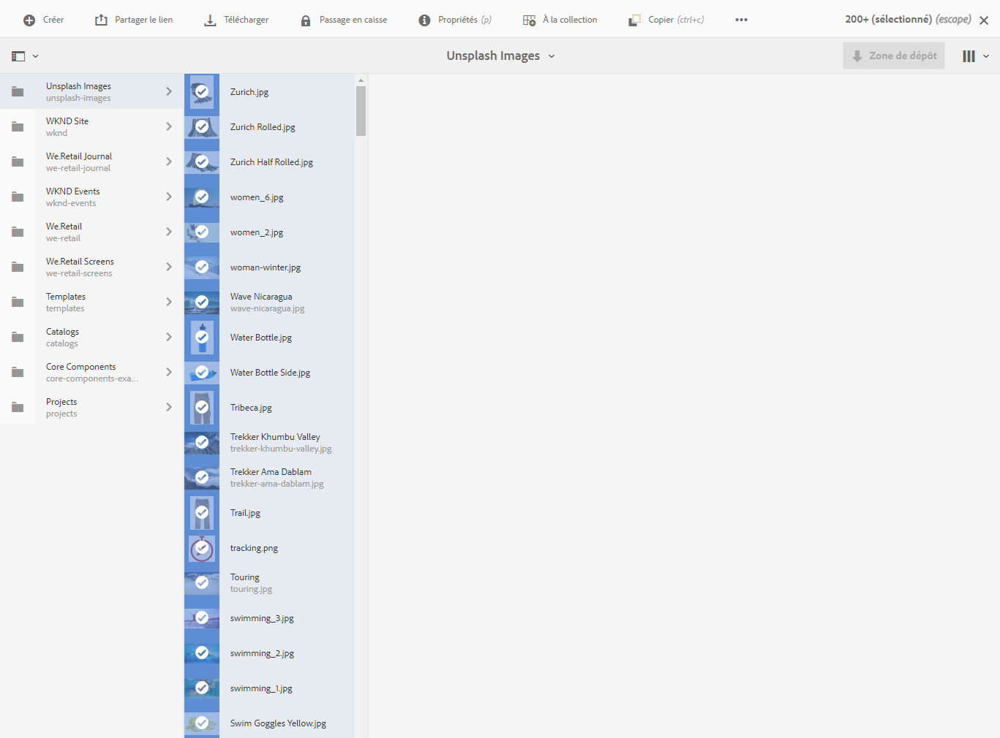
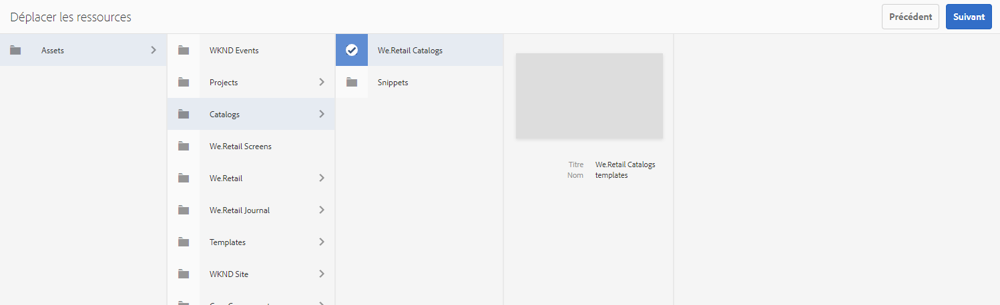
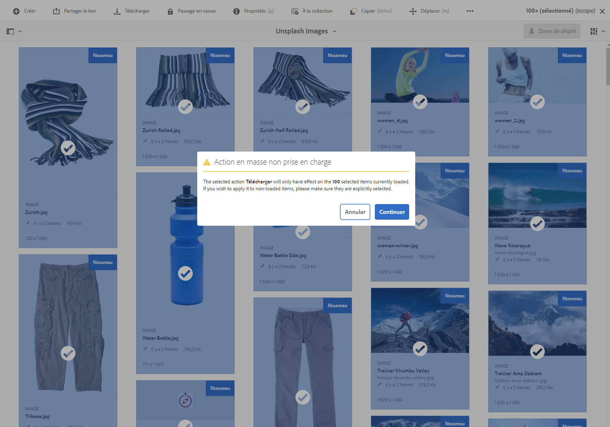

# Opérations de traitement en masse {#bulk-processing-operations}

## Présentation {#introduction}

Avec la dernière version de AEM, le bouton Sélectionner tout a été étendu à toutes les vues : Liste, colonne et vue de carte. Le bouton Sélectionner tout sélectionne désormais l’ensemble du contenu d’un dossier ou d’une collection donné et pas seulement les ressources et pages qui sont chargées et visibles dans le navigateur client.

Les actions clés ont été activées pour l&#39;opération en bloc : **Déplacer**, **Supprimer** et **Copier**. Une nouvelle boîte de dialogue informera les clients des actions pour lesquelles le traitement en vrac n&#39;est pas disponible.

## How To Use {#how-to-use}

Un nouveau bouton intitulé **Sélectionner tout** a été ajouté aux vues Carte, Liste ou Colonne. Ce bouton peut être utilisé dans n’importe quelle vue pour sélectionner tous les éléments du jeu de données.

Dans les versions précédentes d’AEM, la sélection était limitée à ce qui était chargé dans le navigateur client. Ces nouveaux changements ont été apportés afin d&#39;éviter toute confusion quant au nombre d&#39;éléments sur lesquels une opération en vrac est effectuée.

Pour l’instant, trois opérations ont été ajoutées au traitement en vrac :

* Déplacer
* Copier
* Supprimer

La prise en charge d’autres opérations sera ajoutée à l’avenir.
Pour utiliser cette fonctionnalité, vous devez accéder au dossier ou à la collection dans lequel vous souhaitez effectuer des opérations en bloc sur les pages ou sur les ressources.

Sélectionnez ensuite l’une des vues, comme illustré ci-dessous :

### Mode Carte {#card-view}

### Sélection en masse dans la Vue de cartes {#bulk-selection-in-card-view}

Les ressources ou les pages peuvent être sélectionnées en bloc à l’aide du bouton **Sélectionner tout** situé en haut à droite :

 

### Mode Liste {#list-view}

Il en va de même pour la Vue des Listes :

### Bulk Selection in List View {#bulk-selection-in-list-view}

Dans la Vue de Liste, utilisez le bouton **Sélectionner tout** ou cochez la case à gauche pour la sélection en bloc.

 

### Mode Colonnes {#column-view}

### Sélection en bloc dans la Vue de colonnes {#bulk-selection-in-column-view}

## Opérations activées en bloc {#bulk-enabled-operations}

Après sélection, l’une des trois actions activées en bloc peut être exécutée : **Déplacer**, **copier** ou **supprimer**.

Ici, l’opération **Déplacer** est exécutée sur les ressources sélectionnées ci-dessus. Dans n’importe quelle vue, toutes les ressources sont alors déplacées vers l’emplacement choisi et pas seulement celles qui sont chargées à l’écran.

Pour les autres opérations qui ne sont pas activées en bloc, comme **Télécharger,** un avertissement s’affiche indiquant que seuls les éléments chargés dans le navigateur seront inclus dans l’opération.

