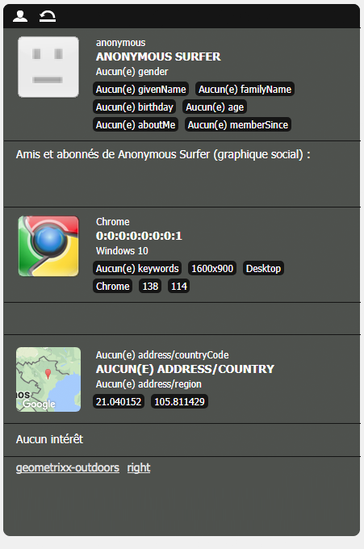

# Configuration de la segmentation {#configuring-segmentation}

>[!NOTE]
>
>Ce document traite de la configuration de la segmentation telle qu’utilisée avec ClientContext. Pour configurer des segments avec ContextHub à l’aide de l’interface utilisateur tactile, voir la rubrique [Configuration de la segmentation avec ContextHub](/help/sites-administering/segmentation.md).

La segmentation est un élément clé de la création d’une campagne. Voir le [Glossaire sur la segmentation](/help/sites-authoring/segmentation-overview.md) pour plus d’informations sur le fonctionnement de la segmentation et en connaître les termes clés.

En fonction des informations que vous avez déjà collectées sur les visiteurs de votre site et des objectifs que vous souhaitez atteindre, vous devez définir les segments et les stratégies requis pour votre contenu ciblé.

Ces segments sont ensuite utilisés pour fournir aux visiteurs du contenu spécifiquement ciblé. This content is maintained in the [Campaigns](/help/sites-classic-ui-authoring/classic-personalization-campaigns.md) section of the website. Les pages de teaser définies ici peuvent être ajoutées en tant que paragraphes de teaser à n’importe quelle page et définissent à quel segment de visiteurs le contenu spécialisé s’applique.

AEM vous permet de facilement créer et mettre à jour des segments, des teasers et des campagnes. Il vous permet également de vérifier les résultats de vos définitions.

The **Segment Editor** allows you to easily define a segment:

Vous pouvez **Modifier** chaque segment pour spécifier un facteur **Titre**, **Description** et **Amplifier**. Avec le sidekick, vous pouvez ajouter des conteneurs **ET** et **OU** pour définir la **Logique de segment**, puis ajouter des **Caractéristiques de segment** pour définir les critères de sélection.

## Facteur d’amplification {#boost-factor}

Each segment has a **Boost** parameter that is used as a weighting factor; a higher number indicates that the segment will be selected in preference to a segment with a lower number.

* Valeur minimale : `0`
* Valeur maximale : `1000000`

## Logique de segment {#segment-logic}

Les conteneurs logiques suivants sont disponibles clé en main et vous permettent de créer la logique de votre sélection de segments. Ils peuvent être déplacés du sidekick vers l’éditeur :

<table>
 <tbody>
  <tr>
   <td> Conteneur ET  </td>
   <td> Opérateur ET booléen.  </td>
  </tr>
  <tr>
   <td> Conteneur OU  </td>
   <td> Opérateur OR booléen.</td>
  </tr>
 </tbody>
</table>

## Caractéristiques de segment {#segment-traits}

Les caractéristiques de segment suivantes sont disponibles clé en main ; elles peuvent être déplacées du sidekick vers l’éditeur :

<table>
 <tbody>
  <tr>
   <td> Plage d’adresses IP  </td>
   <td>Définit une plage d’adresses IP que le visiteur peut avoir.  </td>
  </tr>
  <tr>
   <td> Accès à la page  </td>
   <td>Fréquence à laquelle la page a été demandée.   </td>
  </tr>
  <tr>
   <td> Propriété de page  </td>
   <td>Toute propriété de la page visitée.  </td>
  </tr>
  <tr>
   <td> Mots-clés de référence  </td>
   <td>Mots-clés pour correspondre aux informations du site Web référent.   </td>
  </tr>
  <tr>
   <td> Script</td>
   <td>Expression JavaScript à évaluer.  </td>
  </tr>
  <tr>
   <td> Référence de segment   </td>
   <td>Référence à une autre définition de segment.  </td>
  </tr>
  <tr>
   <td> Nuage de tags  </td>
   <td>Balises à mettre en correspondance avec celles des pages visitées.  </td>
  </tr>
  <tr>
   <td> Âge de l’utilisateur  </td>
   <td>Extrait du profil utilisateur.  </td>
  </tr>
  <tr>
   <td> Propriété de l’utilisateur  </td>
   <td>Toute autre information disponible dans le profil utilisateur. </td>
  </tr>
 </tbody>
</table>

You can combine these traits using the boolean operators OR and AND (see [Creating a New Segment](#creating-a-new-segment)) to define the exact scenario for selecting this segment.

Lorsque l’intégralité de l’instruction est vraie, alors ce segment a été résolu. Si plusieurs segments sont applicables, le facteur **[Amplifier](/help/sites-administering/campaign-segmentation.md#boost-factor)** est également utilisé.

>[!CAUTION]
>
>L’éditeur de segment ne vérifie aucune référence circulaire. Par exemple, le segment A fait référence à un autre segment B qui, à son tour, fait référence au segment A. Vous devez vous assurer que vos segments ne contiennent aucune référence circulaire.

>[!NOTE]
>
>Properties with the **_i18n** suffix are set by a script which is a part of personalization&#39;s UI clientlib. Toutes les bibliothèques clientes liées à l’interface utilisateur sont chargées à la création uniquement, car l’interface utilisateur n’est pas nécessaire lors de la publication.
>
>Therefore when creating a segment with such properties is it normally necessary to rely on **browserFamily** for instance instead of **browserFamily_i18n**.

### Création d’un nouveau segment {#creating-a-new-segment}

Pour définir votre nouveau segment :

1. In the rail, choose **Tools > Operations > Configuration**.
1. Cliquez sur la page **Segmentation** dans le panneau gauche, puis accédez à l’emplacement requis.
1. Créez une [nouvelle page](/help/sites-authoring/editing-content.md#creatinganewpage) à l’aide du modèle **Segment**.
1. Ouvrez la nouvelle page pour afficher l’éditeur de segment :

   

1. Utilisez le sidekick ou le menu contextuel (en général, cliquez avec le bouton droit de la souris, puis sélectionnez **Nouveau** pour ouvrir la fenêtre Insérer un nouveau composant) et recherchez la caractéristique de segment dont vous avez besoin. Faites alors glisser la caractéristique vers l’**éditeur de segment** pour qu’elle apparaisse dans le conteneur **ET** par défaut.
1. Double-cliquez sur la nouvelle caractéristique pour modifier les paramètres, par exemple la position de la souris :

   

1. Cliquez sur **OK** pour enregistrer votre définition :
1. Vous pouvez **Modifier** la définition de segment pour lui attribuer un **Titre**, une **Description** et un facteur **[Amplifier](#boost-factor)** :

   

1. Ajoutez d’autres caractéristiques si nécessaire. Vous pouvez formuler des expressions booléennes à l’aide des composants **Conteneur ET** et **Conteneur OU** figurant dans **Logique de segment**. Avec l’éditeur de segment, vous pouvez supprimer des caractéristiques ou des composants qui ne sont plus utiles ou les faire glisser vers un nouvel emplacement dans l’instruction.

### Utilisation des conteneurs ET et OU {#using-and-and-or-containers}

Vous pouvez créer des segments complexes dans AEM. Ceci vous aide à tenir compte de certains aspects élémentaires :

* Le niveau supérieur de la définition est toujours le conteneur ET qui est initialement créé ; ceci ne peut pas être changé, mais n’a pas d’effet sur le reste de votre définition de segment.
* Assurez-vous que l’imbrication de votre conteneur a un sens. Les conteneurs peuvent être considérés comme les crochets de votre expression booléenne.

L’exemple suivant permet de sélectionner les visiteurs qui sont soit :

Homme et entre 16 et 65 ans

OU

Femme et entre 16 et 62 ans

Puisque l’opérateur principal est OU, vous devez commencer par le **Conteneur OU**. Celui-ci contient 2 instructions ET. Pour chacune de ces instructions, il vous faut un **Conteneur ET**, dans lequel vous pouvez ajouter les caractéristiques principales.

## Test de l’application d’un segment {#testing-the-application-of-a-segment}

Une fois le segment défini, les résultats potentiels peuvent être testés avec l’aide du **[ClientContext](/help/sites-administering/client-context.md)** :

1. Sélectionnez le segment à tester.
1. Appuyez sur les touches **[Ctrl-Alt-C](/help/sites-authoring/page-authoring.md#keyboardshortcuts)** pour ouvrir le **[ClientContext](/help/sites-administering/client-context.md)**, qui affiche les données collectées. For testing purposes you can **Edit** certain values, or **Load** another profile to see the impact there.

1. En fonction des caractéristiques définies, les données disponibles pour la page en cours peuvent ou non correspondre à la définition de segment. Le statut de la correspondance s’affiche sous la définition.

Par exemple, une seule définition de segment peut être fonction de l’âge et du sexe de l’utilisateur. Le chargement d’un profil spécifique montre que le segment a été résolu avec succès :

Ou non :

>[!NOTE]
>
>Toutes les caractéristiques sont résolues immédiatement, bien que la plupart ne soient modifiées qu’au rechargement de la page. Les modifications apportées à la position de la souris sont visibles immédiatement, ce qui est utile à des fins de test.

Such tests can also be performed on content pages and in combination with **Teaser** components.

Survoler la photographie d’un teaser avec la souris affiche les segments appliqués et indique s’ils sont actuellement résolus et, par conséquent, pourquoi l’instance de teaser actuelle a été sélectionnée :

### Utilisation de votre segment {#using-your-segment}

Les segments sont actuellement utilisés dans les [campagnes](/help/sites-classic-ui-authoring/classic-personalization-campaigns.md). Ils sont utilisés afin d’orienter le contenu réel affiché pour des audiences cible spécifiques. Voir la rubrique [Compréhension des segments](/help/sites-authoring/segmentation-overview.md) pour plus d’informations.
