# Intégration à Adobe Campaign Classic{#integrating-with-adobe-campaign-classic}

>[!NOTE]
>
>Cette documentation décrit comment intégrer AEM à Adobe Campaign Classic, la solution sur site. Si vous utilisez Adobe Campaign Standard, voir la section [Intégration à Adobe Campaign Standard](/help/sites-administering/campaignstandard.md) pour prendre connaissance de ces instructions.

Adobe Campaign permet de gérer le contenu et les formulaires d’envoi de courrier électronique directement dans Adobe Experience Manager.

Pour utiliser les deux solutions conjointement et simultanément, vous devez d’abord les configurer de manière à les connecter l’une à l’autre. Cela implique certaines étapes de configuration à la fois dans Adobe Campaign et dans Adobe Experience Manager, qui sont décrites en détail dans ce document.

L’utilisation d’Adobe Campaign dans AEM comprend la possibilité d’envoyer un courrier électronique par le biais d’Adobe Campaign. Cette possibilité est décrite dans la section [Utilisation d’Adobe Campaign](/help/sites-authoring/campaign.md). Cela inclut également l’utilisation de formulaires dans des pages AEM pour manipuler des données.

En outre, les rubriques suivantes peuvent être utiles lors de l’intégration d’AEM avec [Adobe Campaign](https://helpx.adobe.com/fr/support/campaign/classic.html) :

* [Meilleures pratiques des modèles de courrier électronique](/help/sites-administering/best-practices-for-email-templates.md)
* [Résolution des incidents liés à votre intégration Adobe Campaign](/help/sites-administering/troubleshooting-campaignintegration.md)

Si vous étendez votre intégration à Adobe Campaign, vous pouvez consulter les pages suivantes :

* [Création d’extensions personnalisées](/help/sites-developing/extending-campaign-extensions.md)
* [Création de mises en correspondance de formulaires personnalisés](/help/sites-developing/extending-campaign-form-mapping.md)

## Processus d’intégration d’AEM et d’Adobe Campaign  {#aem-and-adobe-campaign-integration-workflow}

Cette section décrit un processus de production type entre AEM et Adobe Campaign lors de la création de campagnes et de la diffusion de contenu.

Le processus type, décrit en détail ci-dessous, implique les conditions suivantes :

1. Commencez à créer votre campagne (à la fois dans Adobe Campaign et dans AEM).
1. Avant de lier le contenu et la diffusion, personnalisez le contenu dans AEM et créez une diffusion dans Adobe Campaign.
1. Liez le contenu et la diffusion dans Adobe Campaign.

### Commencez à créer votre campagne  {#start-building-your-campaign}

Vous commencez à créer une campagne à tout moment. Avant la liaison du contenu, AEM et Adobe Campaign sont indépendants. Cela signifie que les spécialistes du marketing peuvent commencer à créer leurs campagnes et leur ciblage dans Adobe Campaign, tandis que les créateurs de contenu travaillent sur la création dans AEM.

### Avant de lier le contenu et la diffusion  {#before-linking-content-and-delivery}

Avant de lier le contenu et de créer un mécanisme de diffusion, vous devez effectuer les opérations suivantes :

**Dans AEM**

* À l’aide des champs de personnalisation du composant **Texte et personnalisation**, personnalisez ce qui doit l’être.

**Dans Adobe Campaign**

* Créez un type de diffusion **aemContent**.

### Liaison du contenu et définition de la diffusion  {#linking-content-and-setting-delivery}

Après avoir préparé le contenu pour la liaison et la diffusion, vous déterminez exactement comment lier le contenu et à quel emplacement.

Toutes ces étapes sont effectuées dans Adobe Campaign.

1. Spécifiez l’instance AEM à utiliser.
1. Synchronisez le contenu en cliquant sur le bouton Synchroniser.
1. Ouvrez le sélecteur de contenu pour sélectionner le contenu.

### Si vous êtes un utilisateur novice d’AEM  {#if-you-are-new-to-aem}

Si vous êtes un utilisateur novice d’AEM, vous trouverez les liens ci-dessous utiles pour comprendre pleinement AEM :

* [Démarrage d’AEM](/help/sites-deploying/deploy.md)
* [Compréhension des agents de réplication](/help/sites-deploying/replication.md)
* [Recherche et utilisation des fichiers journaux](/help/sites-deploying/monitoring-and-maintaining.md#working-with-audit-records-and-log-files)
* [Présentation de la plateforme AEM](/help/sites-deploying/platform.md)

## Configuration d’Adobe Campaign  {#configuring-adobe-campaign}

La configuration d’Adobe Campaign implique les tâches suivantes :

1. Installation du module d’intégration AEM dans Adobe Campaign
1. Configuration d’un compte externe
1. Vérification de la configuration appropriée d’AEMResourceTypeFilter

Vous pouvez également effectuer des configurations avancées :

* Gestion des blocs de contenu
* Gestion des champs de personnalisation

Voir [Configurations avancées](#advanced-configurations).

>[!NOTE]
>
>Pour effectuer ces opérations, vous devez avoir le rôle **administration** en Adobe Campaign.

### Conditions préalables {#prerequisites}

Au préalable, assurez-vous de disposer des éléments suivants :

* [Une instance de création AEM](/help/sites-deploying/deploy.md#getting-started)
* [Une instance de publication AEM](/help/sites-deploying/deploy.md#author-and-publish-installs)
* [Une instance](https://helpx.adobe.com/support/campaign/classic.html)  Adobe Campaign Classic, comprenant un client et un serveur
* Internet Explorer 11

>[!NOTE]
>
>Si vous exécutez une version antérieure à Adobe Campaign Classic build 8640, consultez la [documentation de mise à niveau](https://docs.campaign.adobe.com/doc/AC6.1/en/PRO_Updating_Adobe_Campaign_Upgrading.html) pour plus d’informations. Notez que le client et la base de données doivent être mis à niveau vers la même version.

>[!CAUTION]
>
>Les opérations détaillées dans les sections [Configuration d’Adobe Campaign](#configuring-adobe-campaign) et [Configuration de Adobe Experience Manager](#configuring-adobe-experience-manager) sont nécessaires pour que les fonctionnalités d’intégration entre l’AEM et Adobe Campaign fonctionnent correctement.

### Installation du module d’intégration AEM {#installing-the-aem-integration-package}

Vous devez installer le package **AEM Integration** dans Adobe Campaign. Pour ce faire :

1. Accédez à l’instance Adobe Campaign à lier à AEM.
1. Sélectionnez *Outils* > *Avancé* > *Importer le package...*.

   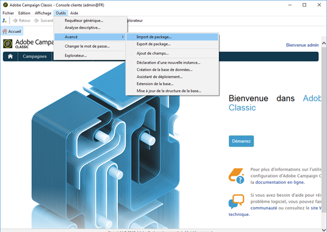

1. Cliquez sur **Installer un package standard**, puis sélectionnez le package **AEM Integration**.

   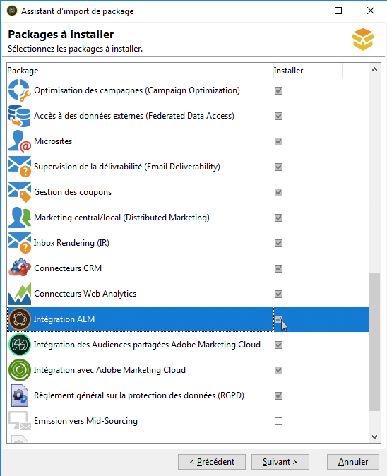

1. Cliquez sur **Suivant**, puis **Début**.

   Ce package contient l&#39;opérateur **aemserver** qui sera utilisé pour connecter le serveur AEM à Adobe Campaign.

   >[!CAUTION]
   >
   >Par défaut, aucune zone de sécurité n’est configurée pour cet opérateur. Pour vous connecter à Adobe Campaign le biais d’AEM, vous devez en sélectionner une.
   >
   >Dans le fichier **serverConf.xml**, l&#39;attribut **allowUserPassword** de la zone de sécurité sélectionnée doit être défini sur **true** pour autoriser l&#39;AEM à se connecter à Adobe Campaign par identifiant/mot de passe.
   >
   >Il est vivement recommandé de créer une zone de sécurité dédiée à AEM afin d’éviter tout problème de sécurité. Pour plus d&#39;informations à ce sujet, consultez le [Guide d&#39;installation](https://docs.campaign.adobe.com/doc/AC/en/INS_Additional_configurations_Configuring_Campaign_server.html).

   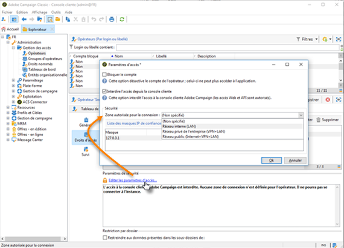

### Configuration d’un compte externe AEM {#configuring-an-aem-external-account}

Vous devez configurer un compte externe permettant de connecter Adobe Campaign à votre instance AEM.

>[!NOTE]
>
>* Lors de l’installation du package **AEM Integration**, un compte AEM externe est créé. Vous pouvez configurer la connexion à votre instance AEM ou en créer une autre.
>* Dans AEM, veillez à définir le mot de passe de l’utilisateur distant d’Adobe Campaign. Vous devez définir ce mot de passe pour connecter Adobe Campaign à AEM. Connectez-vous en tant qu’administrateur et, dans la console d’administration des utilisateurs, recherchez l’utilisateur à distance d’Adobe Campaign et cliquez sur **Définir le mot de passe**.

>


Pour configurer un compte externe AEM :

1. Accédez au noeud **Administration** > **Plateforme** > **Comptes externes**.
1. Créez un compte externe et sélectionnez le type **AEM**.
1. Saisissez les paramètres d’accès pour votre instance de création AEM : l’adresse du serveur, ainsi que l’ID et le mot de passe utilisés pour la connexion à cette instance. Le mot de passe du compte de l’utilisateur de l’API Campaign est identique à celui de l’utilisateur à distance d’Adobe Campaign pour lequel vous définissez un mot de passe dans AEM.

   >[!NOTE]
   >
   >Assurez-vous que l’adresse du serveur ne se termine **pas** par une barre oblique. Par exemple, saisissez `https://yourserver:4502` au lieu de `https://yourserver:4502/`

   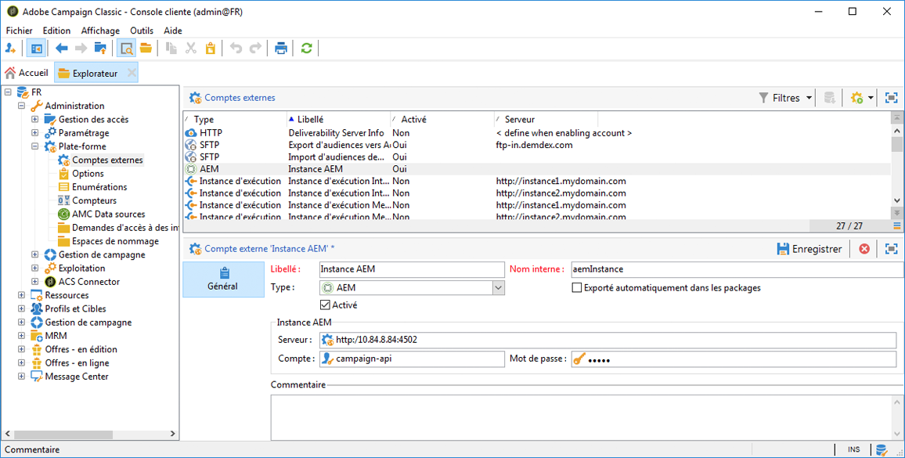 

1. Assurez-vous que la case **Activé** est cochée.

### Vérification de l’option AEMResourceTypeFilter {#verifying-the-aemresourcetypefilter-option}

L&#39;option **AEMResourceTypeFilter** est utilisée pour filtrer les types de ressources AEM qui peuvent être utilisées dans Adobe Campaign. Cela permet à Adobe Campaign de récupérer le contenu AEM conçu spécifiquement pour n’être utilisé que dans Adobe Campaign.

Cette option devrait être préconfigurée. Cependant, si vous la modifiez, l’intégration risque de ne pas fonctionner.

Pour vérifier que l’option **AEMResourceTypeFilter** est configurée :

1. Sélectionnez **Plateforme** >**Options**.
1. Dans l&#39;option **AEMResourceTypeFilter**, vérifiez que les chemins d&#39;accès sont corrects. Ce champ doit contenir la valeur :

   **mcm/campaign/components/newsletter,mcm/campaign/components/campaign_newsletterpage,mcm/neolane/components/newsletter**

   Ou, dans certains cas, la valeur est la suivante :

   **mcm/campaign/components/newsletter**

   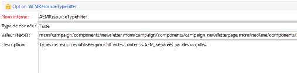

## Configuration d’Adobe Experience Manager {#configuring-adobe-experience-manager}

Pour configurer AEM, vous devez procéder comme suit :

* Configurez la réplication entre les instances.
* Connectez AEM à Adobe Campaign via des services cloud.
* Configurez l’externaliseur.

### Configuration de la réplication entre les instances AEM  {#configuring-replication-between-aem-instances}

Le contenu créé à partir de l’instance de création AEM est d’abord envoyé à l’instance de publication. Vous devez effectuer la publication de sorte que les images de la newsletter soient disponibles dans l’instance de publication et pour ses destinataires. L’agent de réplication doit donc être configuré pour répliquer à partir de l’instance de création AEM vers l’instance de publication AEM.

>[!NOTE]
>
>Si vous ne souhaitez pas utiliser l’URL de réplication mais plutôt l’URL accessible au public, vous pouvez définir l’**URL publique** dans le paramètre de configuration suivant dans OSGi (**logo AEM** > **icône Outils** > **Opérations** > **Console Web** a10/>Configuration OSGi **>** Intégration Campaign - Configuration **de** AEM - Configuration) :
**URL publique :** com.day.cq.mcm.campaign.impl.IntegrationConfigImpl#aem.mcm.campaign.publicUrl

Cette étape est également nécessaire pour répliquer certaines configurations d’instance de création dans l’instance de publication.

Pour configurer la réplication entre les instances AEM :

1. Dans l’instance de création, sélectionnez **AEM logo** **icône Outils** > **Déploiement** > **Réplication** > **Agents sur auteur**, puis cliquez sur **Agent par défaut**.

   

   >[!NOTE]
   Évitez d’utiliser l’hôte local localhost (il s’agit d’une copie locale d’AEM) lors de la configuration de votre intégration avec Adobe Campaign, à moins que les instances de publication et de création se trouvent toutes deux sur le même ordinateur.

1. Appuyez ou cliquez sur **Modifier**, puis sélectionnez l&#39;onglet **Transport**.
1. Configurez l’URI en remplaçant **localhost** par l’adresse IP ou l’adresse de l’instance de publication AEM.

   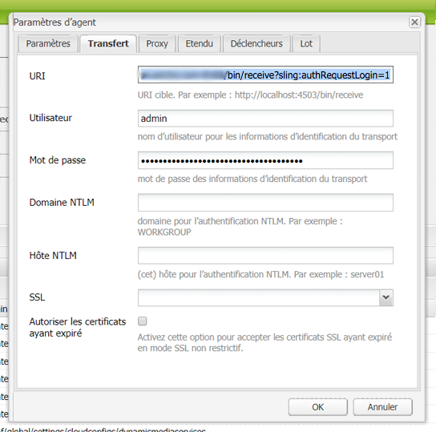

### Connexion d’AEM à Adobe Campaign {#connecting-aem-to-adobe-campaign}

Avant que vous puissiez utiliser AEM et Adobe Campaign ensemble, vous devez établir la liaison entre les deux solutions afin qu’elles puissent communiquer.

1. Connectez-vous à votre instance de création AEM.
1. Sélectionnez **AEM logo** > **Icône Outils** > **Déploiement** > **Cloud Services**, puis **Configurer maintenant** dans la section Adobe Campaign.

   

1. Créez une nouvelle configuration en saisissant un **Titre** et en cliquant sur **Créer**, ou choisissez la configuration existante à lier à votre instance Adobe Campaign.
1. Modifiez la configuration afin qu’elle corresponde aux paramètres de votre instance Adobe Campaign.

   * **Nom d&#39;utilisateur** :  **aemserver**, l’opérateur de package d’intégration AEM Adobe Campaign utilisé pour établir le lien entre les deux solutions.
   * **Mot de passe** : mot de passe de l’opérateur aemserver Adobe Campaign. Vous devrez peut-être respécifier le mot de passe pour cet opérateur directement dans Adobe Campaign.
   * **Point de terminaison de l’API** : URL de l’instance Adobe Campaign.

1. Sélectionnez **Se connecter à Adobe Campaign** et cliquez sur **OK**.

   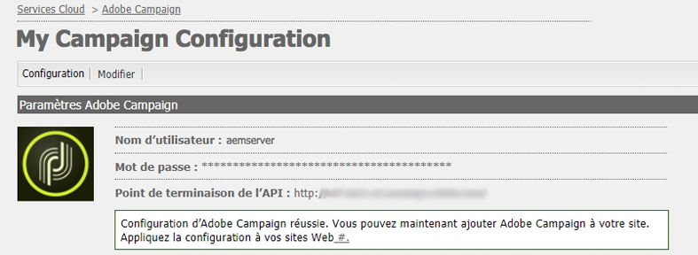

   >[!NOTE]
   Après avoir [créé et publié votre courrier électronique](/help/sites-authoring/campaign.md), vous devez republier la configuration sur votre instance de publication.

   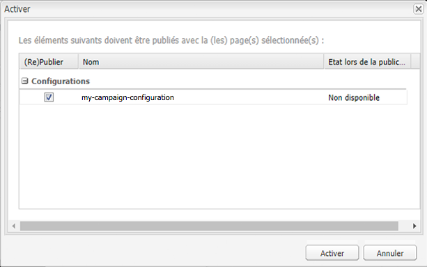

>[!NOTE]
Si la connexion échoue, vérifiez les éléments suivants :
* Vous pouvez rencontrer un problème de certificat lorsque vous utilisez une connexion sécurisée sur une instance Adobe Campaign (https). Vous devrez ajouter le certificat d’instance Adobe Campaign au fichier **cacerts** du JDK de votre instance AEM.
* Une zone de sécurité doit être configurée pour l’[opérateur aemserver](#connecting-aem-to-adobe-campaign) dans Adobe Campaign. De plus, dans le fichier **serverConf.xml**, l&#39;attribut **allowUserPassword** de la zone de sécurité doit être défini sur **true** pour autoriser la connexion AEM à Adobe Campaign à l&#39;aide du mode de connexion/mot de passe.

Voir également [Résolution des incidents liés à votre intégration AEM/Adobe Campaign](/help/sites-administering/troubleshooting-campaignintegration.md).

### Configuration de l’externaliseur  {#configuring-the-externalizer}

Vous devez [configurer l’externaliseur](/help/sites-developing/externalizer.md) dans AEM sur votre instance de création. L’externaliseur est un service OSGi qui vous permet de transformer un chemin de ressources en une URL absolue externe. Ce service propose un emplacement centralisé pour configurer ces adresses URL externes et les créer.

Pour des instructions générales, voir [Configuration de l’externaliseur](/help/sites-developing/externalizer.md). Pour l’intégration Adobe Campaign, veillez à configurer le serveur de publication à `https://<host>:<port>/system/console/configMgr/com.day.cq.commons.impl.ExternalizerImpl`non pas en pointant vers `localhost:4503` mais vers un serveur accessible par la console Adobe Campaign.

S’il pointe vers `localhost:4503` ou un autre serveur auquel Adobe Campaign ne parvient pas à se connecter, les images ne s’affichent pas dans la console Adobe Campaign.


## Configurations avancées {#advanced-configurations}

Vous pouvez également effectuer des configurations avancées, à savoir :

* Gérez les champs et les blocs de personnalisation.
* Désactivez un bloc de personnalisation.
* Gérez les données d’extension cible.

### Gestion des champs et des blocs de personnalisation  {#managing-personalization-fields-and-blocks}

Les champs et les blocs disponibles pour ajouter une personnalisation au contenu de vos courriers électroniques dans AEM sont gérés par Adobe Campaign.

Une liste par défaut est fournie, mais peut être modifiée. Vous pouvez également ajouter ou masquer des champs et des blocs de personnalisation.

#### Ajout d’un champ de personnalisation  {#adding-a-personalization-field}

Pour ajouter un nouveau champ de personnalisation à ceux qui sont déjà disponibles, vous devez étendre le schéma Adobe Campaign **nms:seedMember** comme suit :

>[!CAUTION]
Le champ à ajouter doit déjà avoir été ajouté par le biais d’une extension de schéma de destinataire (**nms:recipient**). Pour plus d&#39;informations, consultez le guide [Configuration](https://docs.campaign.adobe.com/doc/AC6.1/en/CFG_Editing_schemas_Editing_schemas.html).

1. Accédez au noeud **Administration** > **Configuration** > **schémas de données** dans la navigation Adobe Campaign.
1. Sélectionnez **Nouveau**.

   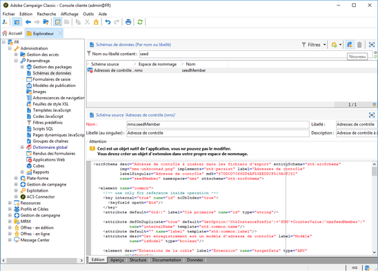

1. Dans la fenêtre contextuelle, sélectionnez **Étendre les données du tableau en utilisant un schéma d&#39;extension** et cliquez sur **Suivant**.

   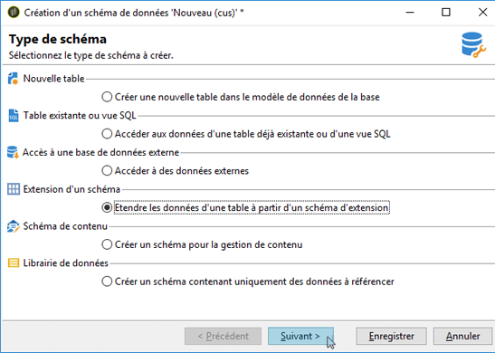

1. Saisissez les différents paramètres du schéma étendu :

   * **Schéma** : sélectionnez le  **nms:** seedMemberschema. Les autres champs de la fenêtre sont renseignés automatiquement.
   * **Espace de noms** : personnalisez l’espace de noms du schéma étendu.

1. Modifiez le code XML du schéma pour spécifier le champ que vous souhaitez ajouter. Pour plus d&#39;informations sur l&#39;extension des schémas en Adobe Campaign, consultez le [Guide de configuration](https://docs.campaign.adobe.com/doc/AC6.1/en/CFG_Editing_schemas_Extending_a_schema.html).
1. Enregistrez votre schéma, puis mettez à jour la structure de base de données Adobe Campaign via le menu **Outils** > **Avancé** > **Mettre à jour la structure de base de données** dans la console.
1. Déconnectez-vous de la console Adobe Campaign, puis reconnectez-vous-y pour enregistrer vos modifications. Le nouveau champ figure maintenant dans la liste des champs de personnalisation disponibles dans AEM.

#### Exemple {#example}

Pour ajouter un champ **Numéro d&#39;enregistrement**, vous devez disposer des éléments suivants :

* L&#39;extension de schéma **nms:destinataire** nommée **cus:destinataire** contient :

```xml
<element desc="Recipient table (profiles)" img="nms:recipient.png" label="Recipients" labelSingular="Recipient" name="recipient">

  <attribute dataPolicy="smartCase" desc="Recipient registration number"
  label="Registration Number"
  length="50" name="registrationNumber" type="string"/>

</element>
```

L&#39;extension de schéma **nms:seedMember** nommée **cus:seedMember** contient :

```xml
<element desc="Seed to insert in the export files" img="nms:unknownad.png" label="Seed addresses" labelSingular="Seed" name="seedMember">

  <element name="custom_nms_recipient">
    <attribute name="registrationNumber"
    template="cus:recipient:recipient/@registrationNumber"/>
  </element>

</element>
```

Le champ **Numéro d&#39;enregistrement** fait désormais partie des champs de personnalisation disponibles :

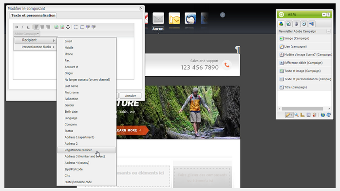

#### Masquage d’un champ de personnalisation {#hiding-a-personalization-field}

Pour masquer un champ de personnalisation parmi ceux qui sont déjà disponibles, vous devez étendre le schéma Adobe Campaign **nms:seedMember** comme indiqué dans la section [Ajoutant un champ de personnalisation](#adding-a-personalization-field). Procédez comme suit :

1. Copiez le champ à utiliser du schéma **nms:seedMember** vers le schéma étendu (**cus :seedMember**, par exemple).
1. Ajoutez l’attribut XML **advanced=&quot;true&quot;** au champ. Il ne figure plus dans la liste des champs de personnalisation disponibles dans AEM.

   Par exemple, pour masquer le champ **Middle Name**, le schéma **cud:seedMember** doit contenir l’élément suivant :

   ```xml
   <element desc="Seed to insert in the export files" img="nms:unknownad.png" label="Seed addresses" labelSingular="Seed" name="seedMember">
   
     <element name="custom_nms_recipient">
       <attribute advanced="true" name="middleName"/>
     </element>
   
   </element>
   ```

### Désactivation d’un bloc de personnalisation {#deactivating-a-personalization-block}

Pour désactiver un bloc de personnalisation parmi les blocs disponibles :

1. Accédez au **noeud Resources** > **Gestion de campagne** > **Blocs de personnalisation** dans la navigation Adobe Campaign.
1. Sélectionnez le bloc de personnalisation à désactiver dans AEM.
1. Désactivez la case à cocher **Visible dans les menus de personnalisation** et enregistrez vos modifications. Le bloc ne figure plus dans la liste des blocs de personnalisation disponibles dans AEM.

   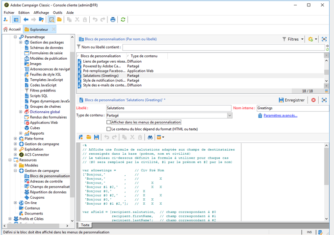

### Gestion des données d’extension cible {#managing-target-extension-data}

Vous pouvez également insérer des données d’extension cible pour la personnalisation. Les données d’extension cible (également appelées « données cibles ») sont issues de l’enrichissement ou de l’ajout de données dans une requête dans un processus de campagne, par exemple. Pour plus d&#39;informations, consultez les sections [Création de requêtes](https://docs.campaign.adobe.com/doc/AC/en/PTF_Creating_queries_About_queries_in_Campaign.html) et [Enrichissement de données](https://docs.campaign.adobe.com/doc/AC/en/WKF_Use_cases_Enriching_data.html).

>[!NOTE]
Les données dans la cible ne sont disponibles que si le contenu AEM est synchronisé avec une diffusion Adobe Campaign. Voir [Synchronisation du contenu créé dans AEM avec une diffusion de Adobe Campaign](/help/sites-authoring/campaign.md#synchronizing-content-created-in-aem-with-a-delivery-from-adobe-campaign-classic).

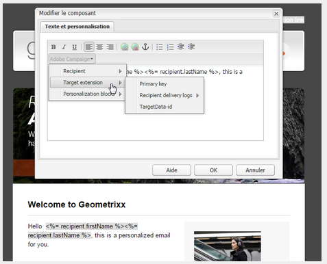

