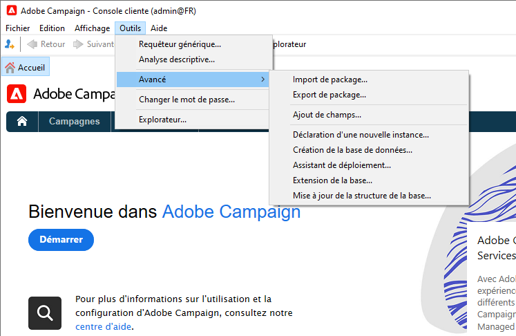
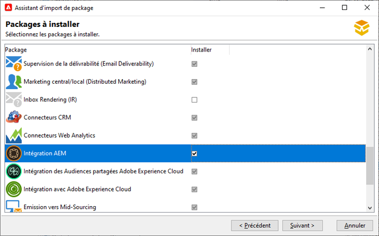
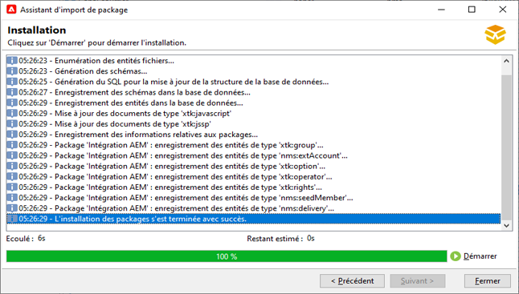
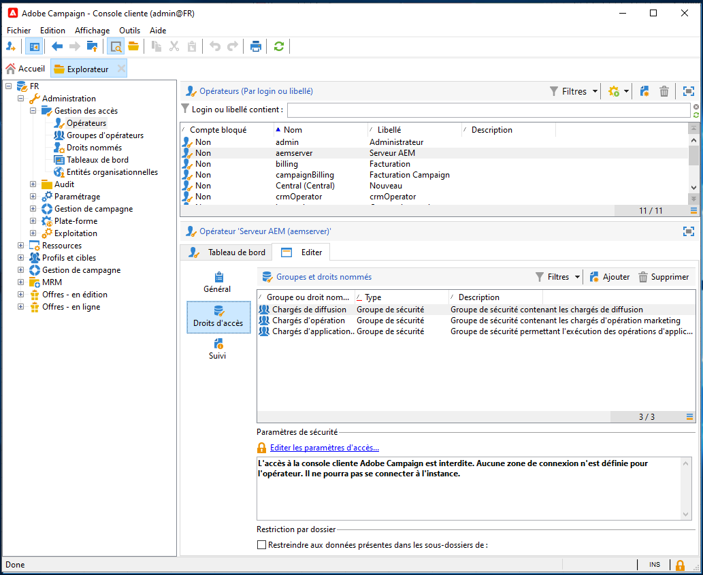
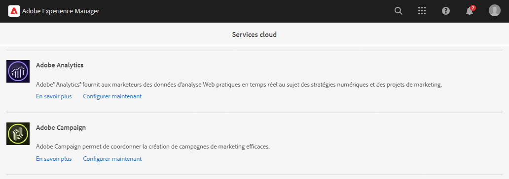
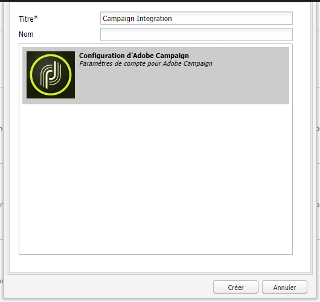
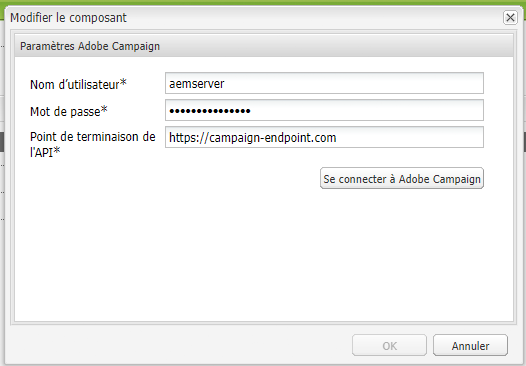
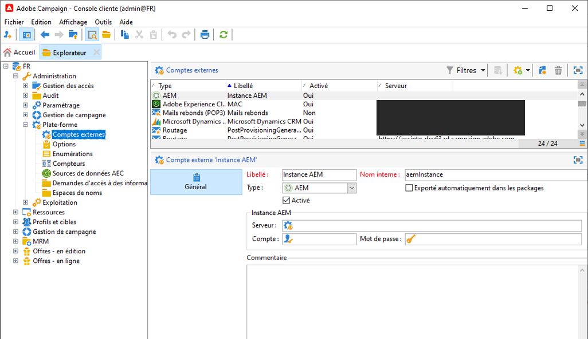

# Intégration d’AEM 6.5 à Adobe Campaign Classic {#integrating-campaign-classic}

Grâce à l’intégration d’AEM à Adobe Campaign Classic (ACC), vous pouvez gérer la diffusion d’e-mails, le contenu et les formulaires directement dans AEM. Des étapes de configuration aussi bien dans Adobe Campaign Classic que dans AEM sont nécessaires pour permettre la communication bidirectionnelle entre ces solutions.

Cette intégration permet d’utiliser AEM et Adobe Campaign Classic indépendamment. Les spécialistes du marketing peuvent créer des campagnes et utiliser le ciblage dans Adobe Campaign, tandis qu’en parallèle, les créateurs et créatrices de contenu peuvent travailler sur la conception de contenu dans AEM. L’intégration permet à Adobe Campaign de cibler et de diffuser le contenu et la conception de la campagne créée dans AEM.

>[!INFO]
>
>Ce document explique comment intégrer Adobe Campaign Classic à AEM 6.5. Pour les autres intégrations de Campaign, reportez-vous au document . [Intégration d’AEM 6.5 à Adobe Campaign.](campaign.md)

## Étapes d’intégration {#integration-steps}

L’intégration entre AEM et Campaign requiert un certain nombre d’étapes dans les deux solutions.

1. [Installer le package d’intégration AEM dans Campaign](#install-package)
1. [Créer un opérateur pour AEM dans Campaign](#create-operator)
1. [Configurer l’intégration de Campaign à AEM](#campaign-integration)
1. [Configurer l’externaliseur AEM](#externalizer)
1. [Configurer l’utilisateur distant de Campaign dans AEM](#configure-user)
1. [Configurer le compte externe AEM dans Campaign](#acc-setup)

Ce document vous guide de façon détaillée à travers chacune de ces étapes.

## Prérequis {#prerequisites}

* Accès des administrateurs à Adobe Campaign Classic
   * Pour effectuer l’intégration, vous avez besoin d’une instance Adobe Campaign Classic opérationnelle, y compris d’une base de données configurée.
   * Si vous avez besoin de détails supplémentaires sur l’installation et la configuration d’Adobe Campaign Classic, veuillez vous reporter à la section [Documentation d’Adobe Campaign Classic,](https://experienceleague.adobe.com/docs/campaign-classic/using/campaign-classic-home.html?lang=fr) et particulièrement au Guide d’installation et de configuration.
* Accès de l’administrateur à AEM

## Installer le module d’intégration AEM dans Campaign {#install-package}

Le package d’**intégration d’AEM** à Adobe Campaign comprend plusieurs configurations standard nécessaires pour se connecter à AEM.

1. En tant qu’administrateur, connectez-vous à l’instance Adobe Campaign à l’aide de la console cliente.

1. Sélectionnez **Outils** > **Avancés** > **Importer un package...**.

   

1. Cliquez sur **Installer un package standard** puis cliquez sur **Suivant**.

1. Vérifiez le package d’**intégration d’AEM**.

   

1. Cliquez sur **Suivant**, et puis sur **Démarrer** pour commencer l’installation.

   

1. Cliquez sur **Fermer** à la fin de l’installation.

Le package d’intégration est maintenant installé.

## Créer l’opérateur AEM dans Campaign {#create-operator}

Le package d’intégration crée automatiquement l’opérateur `aemserver` qu’AEM utilise pour se connecter à Adobe Campaign. Vous devez définir une zone de sécurité pour cet opérateur et définir son mot de passe.

1. Connectez-vous à Adobe Campaign en tant qu’administrateur à l’aide de la console cliente.

1. Sélectionnez **Outils** -> **Explorateur** dans la barre des menus.

1. Dans l’explorateur, accédez au nœud **Administration** > **Gestion des accès** > **Opérateurs**.

1. Sélectionnez l’opérateur `aemserver`.

1. Sous l’onglet **Modifier** de l’opérateur, sélectionnez le sous-onglet **Droits d’accès** et puis cliquez sur le lien **Modifier les paramètres d’accès...**.

   

1. Sélectionnez la zone de sécurité appropriée et définissez le masque IP de confiance selon vos besoins.

1. Cliquez sur **Enregistrer**.

1. Déconnectez-vous du client Adobe Campaign.

1. Dans le système de fichiers du serveur Adobe Campaign, accédez à l’emplacement d’installation de Campaign et modifiez le fichier `serverConf.xml` en tant qu’administrateur. Ce fichier se trouve généralement sous :
   * `C:\Program Files\Adobe\Adobe Campaign Classic v7\conf` sous Windows.
   * `/usr/local/neolane/nl6/conf/eng` sous Linux.

1. Recherchez `securityZone` et assurez-vous que les paramètres suivants sont définis pour la zone de sécurité de l’opérateur AEM.

   * `allowHTTP="true"`
   * `sessionTokenOnly="true"`
   * `allowUserPassword="true"`.

1. Enregistrez le fichier.

1. Assurez-vous que la zone de sécurité n’est pas écrasée par le paramètre correspondant dans le fichier `config-<server name>.xml`.

   * Si le fichier de configuration contient un paramètre de zone de sécurité distinct, alors définissez l’attribut `allowUserPassword` sur `true`.

1. Si vous souhaitez modifier le port du serveur Adobe Campaign Classic, remplacez `8080` par le port souhaité.

   >[!CAUTION]
   >
   >Par défaut, aucune zone de sécurité n’est configurée pour l’opérateur. Pour qu’AEM se connecte à Adobe Campaign, vous devez sélectionner une zone comme décrit dans les étapes précédentes.
   >
   >Adobe recommande vivement de créer une zone de sécurité dédiée à AEM afin d’éviter tout problème de sécurité. Pour plus d’informations à ce sujet, reportez-vous à la [documentation d’Adobe Campaign Classic](https://experienceleague.adobe.com/docs/campaign-classic/using/installing-campaign-classic/additional-configurations/security-zones.html?lang=fr).

1. Dans le client Campaign, revenez à l’opérateur `aemserver` et sélectionnez l’onglet **Général**.

1. Cliquez sur le lien **Réinitialiser le mot de passe...**.

1. Indiquez un mot de passe et stockez-le dans un emplacement sécurisé en vue d’une utilisation ultérieure.

1. Cliquez sur **OK** pour enregistrer le mot de passe pour l’opérateur `aemserver`.

## Configurer l’intégration de Campaign dans AEM {#campaign-integration}

Utilisations AEM [l&#39;opérateur que vous avez déjà configuré dans Campaign.](#create-operator) pour communiquer avec Campaign

1. Connectez-vous à votre instance de création AEM en tant qu’administrateur.

1. Dans le rail latéral de navigation globale, sélectionnez **Outils** > **Services cloud** > **Services cloud hérités** > **Adobe Campaign**, puis cliquez sur **Configurer maintenant**.

   

1. Dans la boîte de dialogue, créez une configuration de service Campaign en saisissant un **Titre** et en cliquant sur **Créer**.

   

1. Une nouvelle fenêtre et boîte de dialogue s’ouvre pour modifier la configuration. Fournissez les informations requises.

   * **Nom d’utilisateur** : il s’agit de [l’opérateur du package d’intégration Adobe Campaign AEM créé à l’étape précédente.](#create-operator) Par défaut, celui-ci est `aemserver`.
   * **Mot de passe** : il s’agit du mot de passe pour [l’opérateur du package d’intégration Adobe Campaign AEM créé à l’étape précédente](#create-operator).
   * **Point de fin d’API** - Il s’agit de l’URL de l’instance Adobe Campaign.

   

1. Sélectionnez **Se connecter à Adobe Campaign** pour vérifier la connexion, puis cliquez sur **OK**.

AEM peut désormais communiquer avec Adobe Campaign.

>[!NOTE]
>
>Assurez-vous que votre serveur Adobe Campaign est accessible via Internet. AEM ne peut pas accéder aux réseaux privés.

## Configurer la réplication sur l’instance de publication AEM {#replication}

Le contenu de Campaign est créé par les auteurs de contenu sur l’instance de création AEM. Cette instance est généralement disponible uniquement en interne au sein de votre organisation. Pour que le contenu tel que les images et les ressources soit accessible aux destinataires de votre campagne, vous devez publier ce contenu.

L’agent de réplication est chargé de publier le contenu de l’instance d’auteur AEM vers l’instance de publication et doit être configuré pour que l’intégration fonctionne correctement. Cette étape est également nécessaire pour répliquer certaines configurations d’instance de création dans l’instance de publication.

Pour configurer la réplication de votre instance d’auteur AEM vers l’instance de publication :

1. Connectez-vous à votre instance de création AEM en tant qu’administrateur.

1. Dans le rail latéral de navigation générale, sélectionnez **Outils** > **Déploiement** > **Réplication** > **Agents sur l’instance d’auteur**, puis appuyez ou cliquez sur **Agent par défaut (publication)**.

   

1. Appuyez ou cliquez sur **Modifier**, puis sélectionnez l’onglet **Transport**.

1. Configurez le champ **URI** en remplaçant la valeur par défaut `localhost` avec l’adresse IP de l’instance de publication AEM.

   

1. Appuyez ou cliquez sur **OK** pour enregistrer les modifications des paramètres de l’agent.

Vous avez configuré la réplication sur l’instance de publication AEM afin que les destinataires de vos campagnes puissent accéder à votre contenu.

>[!NOTE]
>
>Si vous ne souhaitez pas utiliser l’URL de réplication, mais plutôt l’URL publique, vous pouvez définir l’URL publique dans les paramètres de configuration suivants via OSGi.
>
>Dans le rail latéral de navigation générale, sélectionnez **Outils** > **Opérations** > **Console web** > **Configuration OSGi** et recherchez **Intégration AEM Campaign - Configuration**. Modifiez la configuration ainsi que le champ **URL publique** (`com.day.cq.mcm.campaign.impl.IntegrationConfigImpl#aem.mcm.campaign.publicUrl`).

## Configurer l’externaliseur AEM {#externalizer}

[L’externaliseur](/help/sites-developing/externalizer.md) est un service OSGi d’AEM qui transforme un chemin d’accès aux ressources en URL externe et absolue, ce qui est nécessaire pour qu’AEM diffuse du contenu que Campaign peut utiliser. Vous devez le configurer pour que l’intégration de Campaign fonctionne.

1. Connectez-vous à l’instance de création AEM en tant qu’administrateur.
1. Dans le rail latéral de navigation générale, sélectionnez **Outils** > **Opérations** > **Console web** > **Configuration OSGi** et recherchez **Day CQ Link Externalizer**.
1. Par défaut, la dernière entrée dans le champ **Domaines** est destinée à l’instance de publication. Modifier l’URL à partir de la valeur par défaut `http://localhost:4503` à votre instance de publication publique.

   

1. Cliquez ou appuyez sur **Enregistrer**.

Vous avez configuré l’externaliseur et Adobe Campaign peut désormais accéder à votre contenu.

>[!NOTE]
>
L’instance de publication doit être accessible à partir du serveur Adobe Campaign. S’il pointe vers `localhost:4503` ou un autre serveur auquel Adobe Campaign ne parvient pas à se connecter, les images d’AEM ne s’affichent pas dans la console Adobe Campaign.

## Configurer l’utilisateur distant de Campaign dans AEM {#configure-user}

Pour que Campaign puisse communiquer avec AEM, vous devez définir un mot de passe pour l’utilisateur `campaign-remote` dans AEM.

1. Connectez-vous à AEM en tant qu’administrateur.
1. Dans la console de navigation principale, cliquez sur **Outils** dans le rail de gauche.
1. Cliquez ensuite sur **Sécurité** -> **Utilisateurs** pour ouvrir la console d’administration des utilisateurs.
1. Recherchez l’utilisateur `campaign-remote`.
1. Sélectionnez l’utilisateur `campaign-remote` et cliquez sur **Propriétés** pour le modifier.
1. Dans la fenêtre **Modifier les paramètres utilisateur**, cliquez sur **Modifier le mot de passe**.
1. Saisissez un nouveau mot de passe pour l’utilisateur et notez-le dans un emplacement sécurisé en vue d’une utilisation ultérieure.
1. Cliquez sur **Enregistrer** pour enregistrer le changement de mot de passe.
1. Cliquez sur **Enregistrer et fermer** pour enregistrer les modifications apportées à l’utilisateur `campaign-remote`.

## Configurer le compte externe AEM dans Campaign {#acc-setup}

Lors de [l’installation du package **Intégration AEM** dans Campaign,](#install-package) un compte externe est créé pour AEM. En configurant ce compte externe, Adobe Campaign peut se connecter à AEM, ce qui permet une communication bidirectionnelle entre les solutions.

1. Connectez-vous à Adobe Campaign en tant qu’administrateur à l’aide de la console cliente.

1. Sélectionnez **Outils** -> **Explorateur** dans la barre de menus.

1. Dans l’explorateur, accédez au nœud **Administration** > **Plateforme** > **Comptes externes**.

   

1. Recherchez le compte AEM externe. Il possède par défaut les valeurs suivantes :

   * **Type** - `AEM`
   * **Libellé** - `AEM Instance`
   * **Nom interne** - `aemInstance`

1. Sous l’onglet **Général** de ce compte, saisissez les informations utilisateur que vous avez définies lors de l’étape [Définir le mot de passe de l’utilisateur campaign-remote](#set-campaign-remote-password).

   * **Serveur** : adresse du serveur de création AEM
      * Le serveur de création AEM doit être accessible à partir de l’instance de serveur Adobe Campaign Classic.
      * Assurez-vous que l’adresse du serveur ne se termine **pas** par une barre oblique.
   * **Compte** : par défaut, il s’agit de l’utilisateur `campaign-remote` défini dans AEM lors de l’étape [Définir le mot de passe de l’utilisateur campaign-remote](#set-campaign-remote-password).
   * **Mot de passe** : il est identique à celui défini dans AEM pour l’utilisateur `campaign-remote` lors de l’étape [Définir le mot de passe de l’utilisateur campaign-remote](#set-campaign-remote-password).

1. Cochez la case **Activé**.

1. Cliquez sur **Enregistrer**.

Adobe Campaign peut désormais communiquer avec AEM.

## Étapes suivantes {#next-steps}

Adobe Campaign Classic et AEM sont maintenant configurés, ici s’achève donc l’intégration.

Ne vous arrêtez pas en si bon chemin et apprenez à créer une newsletter dans Adobe Experience Manager à l’aide de [ce document](/help/sites-authoring/campaign.md).
