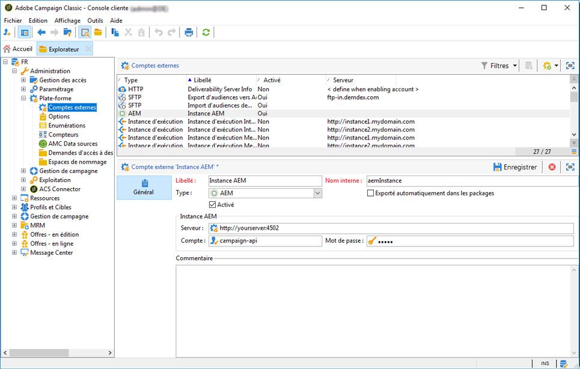

# Intégration à Adobe Campaign Classic{#integrating-with-adobe-campaign-classic}

>[!NOTE]
>
>Cette documentation décrit comment intégrer AEM à Adobe Campaign Classic, la solution sur site. Si vous utilisez Adobe Campaign Standard, voir la section [Intégration à Adobe Campaign Standard](/help/sites-administering/campaignstandard.md) pour prendre connaissance de ces instructions.

Adobe Campaign permet de gérer le contenu et les formulaires d’envoi de courrier électronique directement dans Adobe Experience Manager.

Pour utiliser les deux solutions conjointement et simultanément, vous devez d’abord les configurer de manière à les connecter l’une à l’autre. Cela implique certaines étapes de configuration à la fois dans Adobe Campaign et dans Adobe Experience Manager, qui sont décrites en détail dans ce document.

L’utilisation d’Adobe Campaign dans AEM comprend la possibilité d’envoyer un courrier électronique par le biais d’Adobe Campaign. Cette possibilité est décrite dans la section [Utilisation d’Adobe Campaign](/help/sites-authoring/campaign.md). Cela inclut également l’utilisation de formulaires dans des pages AEM pour manipuler des données.

En outre, les rubriques suivantes peuvent être utiles lors de l’intégration d’AEM avec [Adobe Campaign](https://helpx.adobe.com/fr/support/campaign/classic.html) :

* [Meilleures pratiques des modèles de courrier électronique](/help/sites-administering/best-practices-for-email-templates.md)
* [Résolution des incidents liés à votre intégration Adobe Campaign](/help/sites-administering/troubleshooting-campaignintegration.md)

Si vous étendez votre intégration à Adobe Campaign, vous pouvez consulter les pages suivantes :

* [Création d’extensions personnalisées](/help/sites-developing/extending-campaign-extensions.md)
* [Création de mises en correspondance de formulaires personnalisés](/help/sites-developing/extending-campaign-form-mapping.md)

## Processus d’intégration d’AEM et d’Adobe Campaign {#aem-and-adobe-campaign-integration-workflow}

Cette section décrit un processus de production type entre AEM et Adobe Campaign lors de la création de campagnes et de la diffusion de contenu.

Le processus type, décrit en détail ci-dessous, implique les conditions suivantes :

1. Commencez à créer votre campagne (à la fois dans Adobe Campaign et dans AEM).
1. Avant de lier le contenu et la diffusion, personnalisez le contenu dans AEM et créez une diffusion dans Adobe Campaign.
1. Liez le contenu et la diffusion dans Adobe Campaign.

### Commencez à créer votre campagne {#start-building-your-campaign}

Vous commencez à créer une campagne à tout moment. Avant la liaison du contenu, AEM et Adobe Campaign sont indépendants. Cela signifie que les spécialistes du marketing peuvent commencer à créer leurs campagnes et leur ciblage dans Adobe Campaign, tandis que les créateurs de contenu travaillent sur la création dans AEM.

### Avant de lier le contenu et la diffusion {#before-linking-content-and-delivery}

Avant de lier le contenu et de créer un mécanisme de diffusion, vous devez effectuer les opérations suivantes :

**Dans AEM**

* À l’aide des champs de personnalisation du composant **Texte et personnalisation**, personnalisez ce qui doit l’être.

**Dans Adobe Campaign**

* Créez un type de diffusion **aemContent**.

### Liaison du contenu et définition de la diffusion {#linking-content-and-setting-delivery}

Après avoir préparé le contenu pour la liaison et la diffusion, vous déterminez exactement comment lier le contenu et à quel emplacement.

Toutes ces étapes sont effectuées dans Adobe Campaign.

1. Spécifiez l’instance AEM à utiliser.
1. Synchronisez le contenu en cliquant sur le bouton Synchroniser.
1. Ouvrez le sélecteur de contenu pour sélectionner le contenu.

### Si vous êtes un utilisateur novice d’AEM {#if-you-are-new-to-aem}

Si vous êtes un utilisateur novice d’AEM, vous trouverez les liens ci-dessous utiles pour comprendre pleinement AEM :

* [Démarrage d’AEM](/help/sites-deploying/deploy.md)
* [Compréhension des agents de réplication](/help/sites-deploying/replication.md)
* [Recherche et utilisation des fichiers journaux](/help/sites-deploying/monitoring-and-maintaining.md#working-with-audit-records-and-log-files)
* [Présentation de la plateforme AEM](/help/sites-deploying/platform.md)

## Configuration d’Adobe Campaign {#configuring-adobe-campaign}

La configuration d’Adobe Campaign implique les tâches suivantes :

1. Installation du module d’intégration AEM dans Adobe Campaign
1. Configuration d’un compte externe
1. Vérification de la configuration appropriée d’AEMResourceTypeFilter

Vous pouvez également effectuer des configurations avancées :

* Gestion des blocs de contenu
* Gestion des champs de personnalisation

Voir [Configurations avancées](#advanced-configurations).

>[!NOTE]
>
>To perform these operations, you must have the **administration** role in Adobe Campaign.

### Conditions préalables {#prerequisites}

Au préalable, assurez-vous de disposer des éléments suivants :

* [Une instance de création AEM](/help/sites-deploying/deploy.md#getting-started)
* [Une instance de publication AEM](/help/sites-deploying/deploy.md#author-and-publish-installs)
* [Une instance](https://helpx.adobe.com/fr/support/campaign/classic.html) Adobe Campaign Classic, comprenant un client et un serveur
* Internet Explorer 11

>[!NOTE]
>
>If you are running a version earlier than Adobe Campaign Classic build 8640, see the [upgrade documentation](https://docs.campaign.adobe.com/doc/AC6.1/en/PRO_Updating_Adobe_Campaign_Upgrading.html) for more information. Notez que le client et la base de données doivent être mis à niveau vers la même version.

>[!CAUTION]
>
>Operations detailed in the [Configuring Adobe Campaign](#configuring-adobe-campaign) and [Configuring Adobe Experience Manager](#configuring-adobe-experience-manager) sections are necessary for the integration functionalities between AEM and Adobe Campaign to work correctly.

### Installation du module d’intégration AEM {#installing-the-aem-integration-package}

You must install the **AEM Integration** package in Adobe Campaign. Pour ce faire :

1. Accédez à l’instance Adobe Campaign à lier à AEM.
1. Select *Tools* > *Advanced* > *Import package...*.

   

1. Click **Install a standard package**, then select the **AEM Integration** package.

   

1. Click **Next**, and then **Start**.

   This package contains the **aemserver** operator that will be used to connect the AEM server to Adobe Campaign.

   >[!CAUTION]
   >
   >Par défaut, aucune zone de sécurité n’est configurée pour cet opérateur. Pour vous connecter à Adobe Campaign le biais d’AEM, vous devez en sélectionner une.
   >
   >In the **serverConf.xml** file, the **allowUserPassword** attribute of the selected security zone must be set to **true** to authorize AEM to connect Adobe Campaign via login/password.
   >
   >Il est vivement recommandé de créer une zone de sécurité dédiée à AEM afin d’éviter tout problème de sécurité. For more on this, refer to the [Installation guide](https://docs.campaign.adobe.com/doc/AC/en/INS_Additional_configurations_Configuring_Campaign_server.html).

   

### Configuration d’un compte externe AEM {#configuring-an-aem-external-account}

Vous devez configurer un compte externe permettant de connecter Adobe Campaign à votre instance AEM.

>[!NOTE]
>
>* When installing the **AEM Integration** package, an external AEM account is created. Vous pouvez configurer la connexion à votre instance AEM ou en créer une autre.
>* Dans AEM, veillez à définir le mot de passe de l’utilisateur distant d’Adobe Campaign. Vous devez définir ce mot de passe pour connecter Adobe Campaign à AEM. Connectez-vous en tant qu’administrateur et, dans la console d’administration des utilisateurs, recherchez l’utilisateur à distance d’Adobe Campaign et cliquez sur **Définir le mot de passe**.

>


Pour configurer un compte externe AEM :

1. Go to the **Administration** > **Platform** > **External Accounts** node.
1. Create a new external account and select the **AEM** type.
1. Saisissez les paramètres d’accès pour votre instance de création AEM : l’adresse du serveur, ainsi que l’ID et le mot de passe utilisés pour la connexion à cette instance. Le mot de passe du compte de l’utilisateur de l’API Campaign est identique à celui de l’utilisateur à distance d’Adobe Campaign pour lequel vous définissez un mot de passe dans AEM.

   >[!NOTE]
   >
   >Assurez-vous que l’adresse du serveur ne se termine **pas** par une barre oblique. For example, enter `https://yourserver:4502` instead of `https://yourserver:4502/`

    

1. Make sure that the **Enabled** checkbox is selected.

### Vérification de l’option AEMResourceTypeFilter {#verifying-the-aemresourcetypefilter-option}

The **AEMResourceTypeFilter** option is used to filter types of AEM resources that can be used in Adobe Campaign. Cela permet à Adobe Campaign de récupérer le contenu AEM conçu spécifiquement pour n’être utilisé que dans Adobe Campaign.

Cette option devrait être préconfigurée. Cependant, si vous la modifiez, l’intégration risque de ne pas fonctionner.

Pour vérifier que l’option **AEMResourceTypeFilter** est configurée :

1. Sélectionnez **Plateforme** >**Options**.
1. In the **AEMResourceTypeFilter** option, check that the paths are correct. Ce champ doit contenir la valeur :

   **mcm/campaign/components/newsletter,mcm/campaign/components/campaign_newsletterpage,mcm/neolane/components/newsletter**

   Ou, dans certains cas, la valeur est la suivante :

   **mcm/campaign/components/newsletter**

   

## Configuration d’Adobe Experience Manager {#configuring-adobe-experience-manager}

Pour configurer AEM, vous devez procéder comme suit :

* Configurez la réplication entre les instances.
* Connectez AEM à Adobe Campaign via des services cloud.
* Configurez l’externaliseur.

### Configuration de la réplication entre les instances AEM {#configuring-replication-between-aem-instances}

Le contenu créé à partir de l’instance de création AEM est d’abord envoyé à l’instance de publication. Vous devez effectuer la publication de sorte que les images de la newsletter soient disponibles dans l’instance de publication et pour ses destinataires. L’agent de réplication doit donc être configuré pour répliquer à partir de l’instance de création AEM vers l’instance de publication AEM.

>[!NOTE]
>
>If you do not want to use the replication URL but instead use the public-facing URL, you can set the **Public URL** in the following configuration setting in the OSGi (**AEM logo** >  **Tools** icon >  **Operations** > **Web Console** > **OSGi Configuration** > **AEM Campaign Integration - Configuration**):
**URL publique :** com.day.cq.mcm.campaign.impl.IntegrationConfigImpl#aem.mcm.campaign.publicUrl

Cette étape est également nécessaire pour répliquer certaines configurations d’instance de création dans l’instance de publication.

Pour configurer la réplication entre les instances AEM :

1. From the authoring instance, select **AEM logo**> **Tools** icon > **Deployment** > **Replication** > **Agents on author**, then click **Default Agent**.

   

   >[!NOTE]
   Évitez d’utiliser l’hôte local localhost (il s’agit d’une copie locale d’AEM) lors de la configuration de votre intégration avec Adobe Campaign, à moins que les instances de publication et de création se trouvent toutes deux sur le même ordinateur.

1. Tap or click **Edit** then select the **Transport** tab.
1. Configurez l’URI en remplaçant **localhost** par l’adresse IP ou l’adresse de l’instance de publication AEM.

   

### Connexion d’AEM à Adobe Campaign {#connecting-aem-to-adobe-campaign}

Avant que vous puissiez utiliser AEM et Adobe Campaign ensemble, vous devez établir la liaison entre les deux solutions afin qu’elles puissent communiquer.

1. Connectez-vous à votre instance de création AEM.
1. Select **AEM logo** > **Tools** icon > **Deployment** > **Cloud Services**, then **Configure now** in the Adobe Campaign section.

   

1. Create a new configuration by entering a **Title** and click **Create**, or choose the existing configuration that you want to link with your Adobe Campaign instance.
1. Modifiez la configuration afin qu’elle corresponde aux paramètres de votre instance Adobe Campaign.

   * **Nom d&#39;utilisateur**: **aemserver**, l’opérateur de package d’intégration AEM Adobe Campaign utilisé pour établir le lien entre les deux solutions.
   * **Mot de passe** : mot de passe de l’opérateur aemserver Adobe Campaign. Vous devrez peut-être respécifier le mot de passe pour cet opérateur directement dans Adobe Campaign.
   * **Point de terminaison de l’API** : URL de l’instance Adobe Campaign.

1. Select **Connect to Adobe Campaign** and click **OK**.

   

   >[!NOTE]
   Après avoir [créé et publié votre courrier électronique](/help/sites-authoring/campaign.md), vous devez republier la configuration sur votre instance de publication.

   

>[!NOTE]
Si la connexion échoue, vérifiez les éléments suivants :
* Vous pouvez rencontrer un problème de certificat lorsque vous utilisez une connexion sécurisée sur une instance Adobe Campaign (https). You will have to add the Adobe Campaign instance certificate to the **cacerts** file of your AEM instance&#39;s JDK.
* Une zone de sécurité doit être configurée pour l’[opérateur aemserver](#connecting-aem-to-adobe-campaign) dans Adobe Campaign. Furthermore, in the **serverConf.xml** file, the **allowUserPassword** attribute of the security zone must be set to **true** to authorize AEM connection to Adobe Campaign using the login/password mode.

Voir également [Résolution des incidents liés à votre intégration AEM/Adobe Campaign](/help/sites-administering/troubleshooting-campaignintegration.md).

### Configuration de l’externaliseur {#configuring-the-externalizer}

Vous devez [configurer l’externaliseur](/help/sites-developing/externalizer.md) dans AEM sur votre instance de création. L’externaliseur est un service OSGi qui vous permet de transformer un chemin de ressources en une URL absolue externe. Ce service propose un emplacement centralisé pour configurer ces adresses URL externes et les créer.

Pour des instructions générales, voir [Configuration de l’externaliseur](/help/sites-developing/externalizer.md). For the Adobe Campaign integration, make sure you configure the publish server at `https://<host>:<port>/system/console/configMgr/com.day.cq.commons.impl.ExternalizerImpl`not point to `localhost:4503` but to a server that is reachable by the Adobe Campaign console.

S’il pointe vers `localhost:4503` ou un autre serveur auquel Adobe Campaign ne parvient pas à se connecter, les images ne s’affichent pas dans la console Adobe Campaign.


## Configurations avancées {#advanced-configurations}

Vous pouvez également effectuer des configurations avancées, à savoir :

* Gérez les champs et les blocs de personnalisation.
* Désactivez un bloc de personnalisation.
* Gérez les données d’extension cible.

### Gestion des champs et des blocs de personnalisation {#managing-personalization-fields-and-blocks}

Les champs et les blocs disponibles pour ajouter une personnalisation au contenu de vos courriers électroniques dans AEM sont gérés par Adobe Campaign.

Une liste par défaut est fournie, mais peut être modifiée. Vous pouvez également ajouter ou masquer des champs et des blocs de personnalisation.

#### Ajout d’un champ de personnalisation {#adding-a-personalization-field}

To add a new personalization field to those that are already available, you have to extend the Adobe Campaign **nms:seedMember** schema as follows:

>[!CAUTION]
Le champ à ajouter doit déjà avoir été ajouté par le biais d’une extension de schéma de destinataire (**nms:recipient**). For more information, see the [Configuration](https://docs.campaign.adobe.com/doc/AC6.1/en/CFG_Editing_schemas_Editing_schemas.html) guide.

1. Go to the **Administration** > **Configuration** > **Data schemas** node in the Adobe Campaign navigation.
1. Select **New**.

   

1. In the pop-up window, select **Extend the data in the table using an extension schema** and click **Next**.

   

1. Saisissez les différents paramètres du schéma étendu :

   * **Schéma**: sélectionnez le schéma **nms:seedMember** . Les autres champs de la fenêtre sont renseignés automatiquement.
   * **Espace de noms** : personnalisez l’espace de noms du schéma étendu.

1. Modifiez le code XML du schéma pour spécifier le champ que vous souhaitez ajouter. For more information on extending schemas in Adobe Campaign, refer to the [Configuration guide](https://docs.campaign.adobe.com/doc/AC6.1/en/CFG_Editing_schemas_Extending_a_schema.html).
1. Save your schema then update the Adobe Campaign database structure via the **Tools** > **Advanced** > **Update database structure** menu in the console.
1. Déconnectez-vous de la console Adobe Campaign, puis reconnectez-vous-y pour enregistrer vos modifications. Le nouveau champ figure maintenant dans la liste des champs de personnalisation disponibles dans AEM.

#### Exemple {#example}

To add a **Registration Number** field, you must have the following elements:

* The **nms:recipient** schema extension named **cus:recipient** contains:

```xml
<element desc="Recipient table (profiles)" img="nms:recipient.png" label="Recipients" labelSingular="Recipient" name="recipient">

  <attribute dataPolicy="smartCase" desc="Recipient registration number"
  label="Registration Number"
  length="50" name="registrationNumber" type="string"/>

</element>
```

The **nms:seedMember** schema extension named **cus:seedMember** contains:

```xml
<element desc="Seed to insert in the export files" img="nms:unknownad.png" label="Seed addresses" labelSingular="Seed" name="seedMember">

  <element name="custom_nms_recipient">
    <attribute name="registrationNumber"
    template="cus:recipient:recipient/@registrationNumber"/>
  </element>

</element>
```

The **Registration Number** field is now part of the available personalization fields:


#### Masquage d’un champ de personnalisation {#hiding-a-personalization-field}

To hide a personalization field among those that are already available, you must extend the Adobe Campaign **nms:seedMember** schema as detailed in the [Adding a personalization field](#adding-a-personalization-field) section. Procédez comme suit :

1. Copiez le champ à utiliser du schéma **nms:seedMember** vers le schéma étendu (**cus :seedMember**, par exemple).
1. Add the **advanced=&quot;true&quot;** XML attribute to the field. Il ne figure plus dans la liste des champs de personnalisation disponibles dans AEM.

   For example, to hide the **Middle Name** field, the **cud:seedMember** schema must contain the following element:

   ```xml
   <element desc="Seed to insert in the export files" img="nms:unknownad.png" label="Seed addresses" labelSingular="Seed" name="seedMember">
   
     <element name="custom_nms_recipient">
       <attribute advanced="true" name="middleName"/>
     </element>
   
   </element>
   ```

### Désactivation d’un bloc de personnalisation {#deactivating-a-personalization-block}

Pour désactiver un bloc de personnalisation parmi les blocs disponibles :

1. Go to the **Resources** > **Campaign Management** > **Personalization blocks** node in the Adobe Campaign navigation.
1. Sélectionnez le bloc de personnalisation à désactiver dans AEM.
1. Clear the **Visible in the customization menus** checkbox and save your changes. Le bloc ne figure plus dans la liste des blocs de personnalisation disponibles dans AEM.

   

### Gestion des données d’extension cible {#managing-target-extension-data}

Vous pouvez également insérer des données d’extension cible pour la personnalisation. Les données d’extension cible (également appelées « données cibles ») sont issues de l’enrichissement ou de l’ajout de données dans une requête dans un processus de campagne, par exemple. For more information, refer to the [Creating queries](https://docs.campaign.adobe.com/doc/AC/en/PTF_Creating_queries_About_queries_in_Campaign.html) and [Enriching data](https://docs.campaign.adobe.com/doc/AC/en/WKF_Use_cases_Enriching_data.html) sections.

>[!NOTE]
Les données dans la cible ne sont disponibles que si le contenu AEM est synchronisé avec une diffusion Adobe Campaign. See [Synchronizing content created in AEM with a delivery from Adobe Campaign](/help/sites-authoring/campaign.md#synchronizing-content-created-in-aem-with-a-delivery-from-adobe-campaign-classic).


