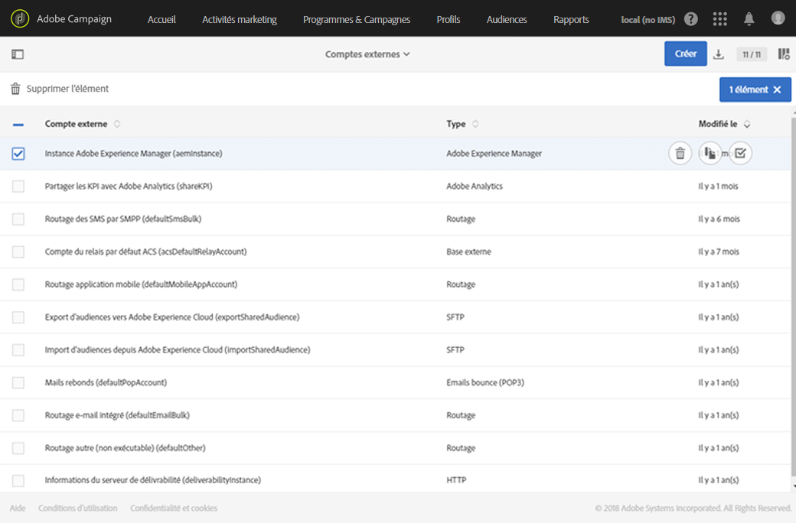
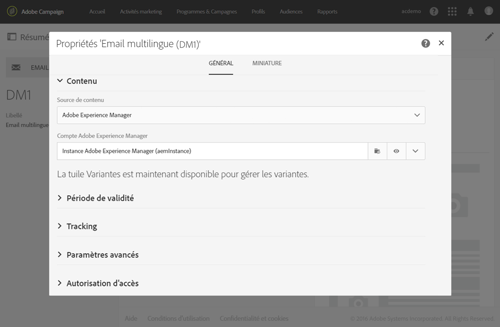
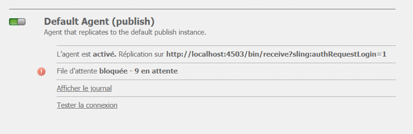
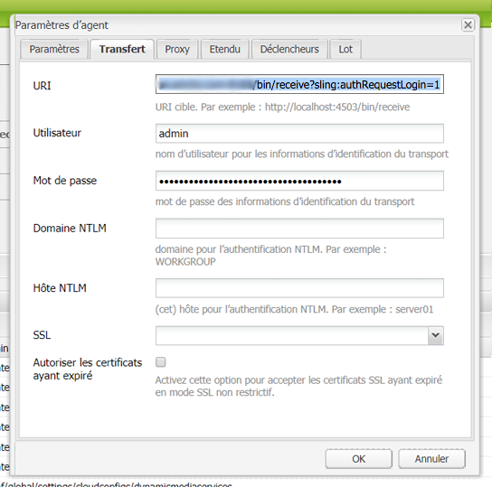
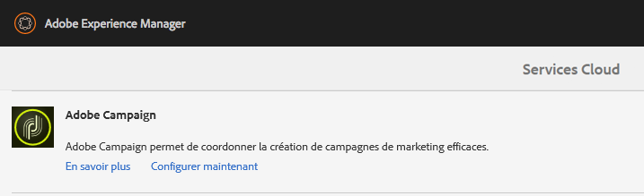
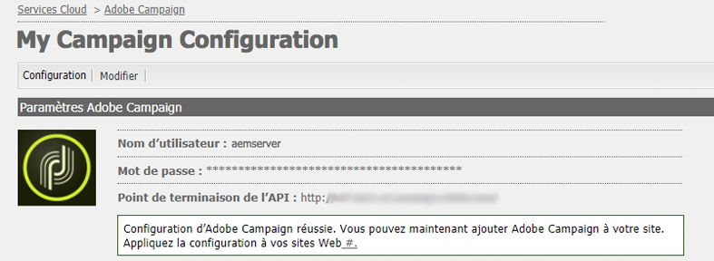
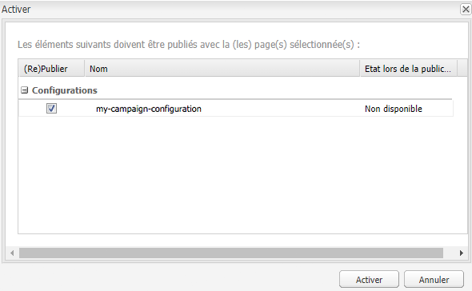

# Intégration à Adobe Campaign Standard{#integrating-with-adobe-campaign-standard}

>[!NOTE]
>
>Cette documentation décrit comment intégrer AEM à Adobe Campaign Standard, la solution par abonnement. Si vous utilisez Adobe Campaign 6.1, voir [Intégration à Adobe Campaign 6.1](/help/sites-administering/campaignonpremise.md) pour ces instructions.

Adobe Campaign permet de gérer le contenu et les formulaires d’envoi de courrier électronique directement dans Adobe Experience Manager.

Pour utiliser les deux solutions ensemble, vous devez d’abord les configurer pour les connecter l’une à l’autre. Cela implique certaines étapes de configuration à la fois dans Adobe Campaign et dans Adobe Experience Manager, qui sont décrites en détail dans ce document.

L’utilisation d’Adobe Campaign dans AEM comprend la possibilité d’envoyer du courrier électronique et des formulaires via Adobe Campaign et elle est décrite dans [Utilisation d’Adobe Campaign](/help/sites-authoring/campaign.md).

En outre, les rubriques suivantes peuvent être utiles lors de l’intégration d’AEM avec [Adobe Campaign](https://docs.campaign.adobe.com/doc/standard/fr/home.html) :

* [Meilleures pratiques des modèles de courrier électronique](/help/sites-administering/best-practices-for-email-templates.md)
* [Résolution des incidents liés à votre intégration Adobe Campaign](/help/sites-administering/troubleshooting-campaignintegration.md)

Si vous étendez votre intégration à Adobe Campaign, vous pouvez consulter les pages suivantes :

* [Création d’extensions personnalisées](/help/sites-developing/extending-campaign-extensions.md)
* [Création de mises en correspondance de formulaires personnalisés](/help/sites-developing/extending-campaign-form-mapping.md)

## Configuration d’Adobe Campaign {#configuring-adobe-campaign}

La configuration d’Adobe Campaign implique les tâches suivantes :

1. Configuration de l’utilisateur **aemserver**
1. Création d’un compte externe dédié
1. Vérification de l’option AEMResourceTypeFilter
1. Création d’un modèle de livraison dédié

>[!NOTE]
>
>Pour effectuer ces opérations, vous devez avoir le rôle **administration** en Adobe Campaign.

### Conditions préalables {#prerequisites}

Au préalable, assurez-vous de disposer des éléments suivants :

* [Une instance de création AEM](/help/sites-deploying/deploy.md#getting-started)
* [Une instance de publication AEM](/help/sites-deploying/deploy.md#author-and-publish-installs)
* [Une instance Adobe Campaign](https://docs.adobe.com/content/docs/fr/campaign/ACS.html)

>[!CAUTION]
>
>Les opérations détaillées dans les sections [Configuration d’Adobe Campaign](#configuring-adobe-campaign) et [Configuration de Adobe Experience Manager](#configuring-adobe-experience-manager) sont nécessaires pour que les fonctionnalités d’intégration entre l’AEM et Adobe Campaign fonctionnent correctement.

### Configuration de l’utilisateur aemserver {#configuring-the-aemserver-user}

L&#39;utilisateur **aemserver** doit être configuré en Adobe Campaign. **aemserver** est un utilisateur technique qui sera utilisé pour connecter le serveur AEM à Adobe Campaign.

Accédez à **Administration** > **Utilisateurs et sécurité** > **Utilisateurs**, puis sélectionnez l&#39;utilisateur **aemserver**. Cliquez dessus pour ouvrir les paramètres utilisateur.

* Vous devez définir un mot de passe pour cet utilisateur. Cette opération ne peut pas être effectuée via l’interface utilisateur. Cette configuration doit être effectuée dans REST par un administrateur technique.
* Vous pouvez attribuer des rôles spécifiques à cet utilisateur, tels que **deliveryPrepare**, ce qui permet à l’utilisateur de créer et de modifier des diffusions.

### Configuration d’un compte externe Adobe Experience Manager {#configuring-an-adobe-experience-manager-external-account}

Vous devez configurer un compte externe permettant de connecter Adobe Campaign à votre instance AEM.

>[!NOTE]
>
>Dans AEM, veillez à définir le mot de passe de l’utilisateur distant d’Adobe Campaign. Vous devez définir ce mot de passe pour connecter Adobe Campaign à AEM. Connectez-vous en tant qu’administrateur et, dans la console d’administration des utilisateurs, recherchez l’utilisateur à distance d’Adobe Campaign et cliquez sur **Définir le mot de passe**.

Pour configurer un compte externe AEM :

1. Accédez à **Administration** > **Paramètres de l&#39;application** > **Comptes externes**.

   

1. Sélectionnez le compte externe **aemInstance** par défaut ou créez-en un en cliquant sur le bouton **Créer**.
1. Sélectionnez **Adobe Experience Manager** i dans le champ **Type** et saisissez les paramètres d’accès utilisés pour votre instance de création AEM : adresse du serveur, nom du compte et mot de passe.

   >[!NOTE]
   >
   >Veillez à ne pas ajouter de barre oblique **/** à la fin de l’URL ou la connexion ne fonctionnera pas.

1. Assurez-vous que la case **Activé** est cochée, puis cliquez sur **Enregistrer** pour enregistrer vos modifications.

### Vérification de l’option AEMResourceTypeFilter {#verifying-the-aemresourcetypefilter-option}

L&#39;option **AEMResourceTypeFilter** est utilisée pour filtrer les types de ressources AEM qui peuvent être utilisées dans Adobe Campaign. Cela permet à Adobe Campaign de récupérer le contenu AEM conçu spécifiquement pour n’être utilisé que dans Adobe Campaign.

Cette option est préconfigurée, cependant, si vous la modifiez, l’intégration risque de ne pas fonctionner.

Pour vérifier que l’option **AEMResourceTypeFilter** est configurée :

1. Accédez à **Administration** > **Paramètres d’application** > **Options**.
1. Dans la liste, vous pouvez vous assurer que l&#39;option **AEMResourceTypeFilter** est répertoriée et que les chemins d&#39;accès sont corrects.

### Création d’un modèle de livraison de courrier électronique spécifique à AEM {#creating-an-aem-specific-email-delivery-template}

Par défaut, la fonction AEM n’est pas activée dans les modèles de courrier électronique Adobe Campaign. Vous pouvez configurer un nouveau modèle de livraison de courrier électronique utilisable pour créer des courriers électroniques avec du contenu AEM.

Pour créer un modèle de livraison de courrier électronique spécifique à AEM :

1. Accédez à **Ressources** > **Modèles** > **Modèles de livraison**.
1. **Activez** la sélection en cliquant sur la coche dans la barre d’actions et en sélectionnant le modèle  **par défaut de courrier électronique** standard existant, puis en cliquant sur l’ **** icône Copier et en cliquant sur  **Confirmer**.
1. Désactivez le mode de sélection en cliquant sur le **x** et ouvrez le nouveau modèle **Copie de courrier électronique standard (mail)**, puis sélectionnez **Modifier les propriétés** dans la barre d&#39;actions du tableau de bord de modèle.

   Vous pouvez modifier le libellé du modèle ****.

1. Dans la section **Contenu** des propriétés, modifiez la **source de contenu** en **Adobe Experience Manager**. Sélectionnez ensuite le compte externe qui a été créé auparavant, puis cliquez sur **Confirmer**.

   Enregistrez vos modifications en cliquant sur **Confirmer** et sur **Enregistrer.**

   La fonction de contenu AEM sera activée pour les livraisons de courrier électronique créées à partir de ce modèle.

   

## Configuration d’Adobe Experience Manager {#configuring-adobe-experience-manager}

Pour configurer AEM, vous devez procéder comme suit :

* Configurez la réplication entre les instances.
* Connectez-vous à Adobe Campaign.
* Configurez l’externaliseur.

### Configuration de la réplication entre les instances AEM  {#configuring-replication-between-aem-instances}

Le contenu créé à partir de l’instance de création AEM est d’abord envoyé à l’instance de publication. Cette instance de publication transfère ensuite le contenu vers Adobe Campaign. L’agent de réplication doit donc être configuré pour répliquer à partir de l’instance de création AEM vers l’instance de publication AEM.

>[!NOTE]
>
>Si vous ne souhaitez pas utiliser l’URL de réplication, mais plutôt l’URL conviviale, vous pouvez définir l’**URL publique** dans le paramètre de configuration suivant dans OSGi (**Outils** > **Console web** > **Configuration OSGi > Intégration AEM Campaign – configuration**) :
**URL publique :** com.day.cq.mcm.campaign.impl.IntegrationConfigImpl#aem.mcm.campaign.publicUrl

Cette étape est également nécessaire pour répliquer certaines configurations d’instance de création dans l’instance de publication.

Pour configurer la réplication entre les instances AEM :

1. Dans l’instance de création, sélectionnez **AEM logo** **Outils** > **Déploiement** > **Réplication** > **Agents sur auteur**, puis cliquez sur **Agent par défaut**.

   

   >[!NOTE]
   Évitez d’utiliser l’hôte local localhost (il s’agit d’une copie locale d’AEM) lors de la configuration de votre intégration avec Adobe Campaign, à moins que les instances de publication et de création se trouvent toutes deux sur le même ordinateur.

1. Cliquez sur **Modifier**, puis sélectionnez l&#39;onglet **Transport**.
1. Configurez l’URI en remplaçant **localhost** par l’adresse IP ou l’adresse de l’instance de publication AEM.

   

### Connexion d’AEM à Adobe Campaign {#connecting-aem-to-adobe-campaign}

Avant que vous puissiez utiliser AEM et Adobe Campaign ensemble, vous devez établir la liaison entre les deux solutions afin qu’elles puissent communiquer.

1. Connectez-vous à votre instance de création AEM.
1. Sélectionnez **Outils** > **Opérations** > **Cloud** > **Cloud Services**, puis **Configurer maintenant** dans la section Adobe Campaign.

   

1. Créez une nouvelle configuration en saisissant un **Titre** et en cliquant sur **Créer**, ou choisissez la configuration existante à lier à votre instance Adobe Campaign.
1. Modifiez la configuration afin qu’elle corresponde aux paramètres de votre instance Adobe Campaign.

   * **Nom d&#39;utilisateur** :  **aemserver**, l’opérateur de package d’intégration AEM Adobe Campaign utilisé pour établir le lien entre les deux solutions.
   * **Mot de passe** : mot de passe de l’opérateur aemserver Adobe Campaign. Vous devrez peut-être respécifier le mot de passe pour cet opérateur directement dans Adobe Campaign.
   * **Point de terminaison de l’API** : URL de l’instance Adobe Campaign.

1. Sélectionnez **Se connecter à Adobe Campaign** et cliquez sur **OK**.

   

   >[!NOTE]
   Après avoir [créé et publié votre courrier électronique](/help/sites-authoring/campaign.md), vous devez republier la configuration sur votre instance de publication.

   

>[!NOTE]
Si la connexion échoue, vérifiez les éléments suivants :
* Vous pouvez rencontrer un problème de certificat lorsque vous utilisez une connexion sécurisée sur une instance Adobe Campaign (https). Vous devrez ajouter le certificat d’instance Adobe Campaign au **cacerts **fichier de votre JDK.
* Voir également [Résolution des incidents liés à votre intégration AEM/Adobe Campaign](/help/sites-administering/troubleshooting-campaignintegration.md).

### Configuration de l’externaliseur  {#configuring-the-externalizer}

Vous devez [configurer l’externaliseur](/help/sites-developing/externalizer.md) dans AEM sur votre instance de création. L’externaliseur est un service OSGi qui vous permet de transformer un chemin de ressources en une URL absolue externe. Ce service propose un emplacement centralisé pour configurer ces adresses URL externes et les créer.

Pour des instructions générales, voir [Configuration de l’externaliseur](/help/sites-developing/externalizer.md). Pour l’intégration Adobe Campaign, veillez à configurer le serveur de publication à `https://<host>:<port>/system/console/configMgr/com.day.cq.commons.impl.ExternalizerImpl` non pas en pointant vers `localhost:4503` mais vers un serveur accessible par la console Adobe Campaign.

S’il pointe vers `localhost:4503` ou un autre serveur auquel Adobe Campaign ne parvient pas à se connecter, les images ne s’affichent pas dans la console Adobe Campaign.

