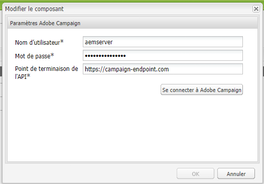

# Intégration d’AEM 6.5 à Adobe Campaign Standard {#integrating-with-adobe-campaign-standard}

Grâce à l’intégration d’AEM 6.5 à Adobe Campaign Standard (ACS), vous pouvez gérer la diffusion d’e-mails, le contenu et les formulaires directement dans AEM. Des étapes de configuration dans Adobe Campaign Standard et dans AEM sont nécessaires pour permettre la communication bidirectionnelle entre les solutions.

Cette intégration permet d’utiliser AEM et Adobe Campaign Standard indépendamment. Les spécialistes du marketing peuvent créer des campagnes et utiliser le ciblage dans Adobe Campaign, tandis qu’en parallèle, les créateurs et créatrices de contenu peuvent travailler sur la conception de contenu dans AEM. L’intégration permet à Adobe Campaign de cibler et de diffuser le contenu et la conception de la campagne créée dans AEM.

>[!INFO]
>
>Ce document explique comment intégrer Adobe Campaign Standard à AEM 6.5. Pour les autres intégrations de Campaign, reportez-vous au document . [Intégration d’AEM 6.5 à Adobe Campaign.](campaign.md)

## Étapes d’intégration {#integration-steps}

La configuration de l’intégration entre AEM et Adobe Campaign Standard nécessite plusieurs étapes dans les deux solutions.

1. [Configurez le ](#aemserver-user)
1. [Vérifiez le ](#resource-type-filter)
1. [Créer un modèle de diffusion d’e-mails spécifique à AEM dans Campaign](#aem-email-delivery-template)
1. [Configurer l’intégration de Campaign dans AEM](#campaign-integration)
1. [Configurer la réplication sur l’instance de publication AEM](#replication)
1. [Configurer l’externaliseur AEM](#externalizer)
1. [Configurez le ](#campaign-remote-user)
1. [Configurer le compte externe AEM dans Campaign](#acc-external-user)

Ce document vous guide de façon détaillée à travers chacune de ces étapes.

## Prérequis {#prerequisites}

* Accès de l’administrateur à Adobe Campaign Standard
   * Si vous avez besoin de détails supplémentaires sur la configuration d’Adobe Campaign Standard, reportez-vous à la [documentation Adobe Campaign Standard](https://experienceleague.adobe.com/docs/campaign-standard/using/campaign-standard-home.html?lang=fr).
* Accès de l’administrateur à AEM

## Configurer l’utilisateur aemserver dans Campaign {#aemserver-user}

Par défaut, Adobe Campaign Standard est fourni avec un utilisateur `aemserver` qu’AEM utilise pour se connecter à Adobe Campaign. Attribuez un groupe de sécurité approprié à cette personne et définissez son mot de passe.

1. Connectez-vous à Adobe Campaign en tant qu’administrateur ou administratrice.

1. Cliquez sur le logo Adobe Campaign en haut à gauche de la barre de menus pour ouvrir la navigation générale, puis sélectionnez **Administration** > **Utilisateurs et sécurité** > **Utilisateurs** dans le menu de navigation.

1. Cliquez sur l’utilisateur ou l’utilisatrice `aemserver` dans la console utilisateurs ou utilisatrices.

1. Assurez-vous que l’utilisateur `aemserver` est attribué au minimum à un groupe de sécurité auquel est attribué le rôle `deliveryPrepare`. Par défaut, le groupe `Standard Users` a ce rôle.

   

1. Cliquez sur **Enregistrer** pour enregistrer les modifications.

Votre utilisateur `aemserver` dispose désormais des droits nécessaires pour qu’AEM l’utilise pour communiquer avec Adobe Campaign.

Toutefois, avant qu’AEM puisse utiliser l’utilisateur `aemserver`, son mot de passe doit être défini. Cette opération ne peut pas être effectuée via Adobe Campaign. Un ingénieur ou une ingénieure du support Adobe doit s’en charger. [Envoyez un ticket à l’Assistance clientèle d’Adobe](https://experienceleague.adobe.com/?support-tab=home&amp;lang=fr#support) pour demander la réinitialisation du mot de passe de l’utilisateur ou de l’utilisatrice `aemserver`. Une fois que l’Assistance clientèle d’Adobe vous a fourni le mot de passe, conservez-le dans un emplacement sécurisé.

## Vérifier AEMResourceTypeFilter dans Campaign {#resource-type-filter}

`AEMResourceTypeFilter` est une option d’Adobe Campaign servant à filtrer les ressources AEM qui peuvent être utilisées dans Adobe Campaign. AEM disposant d’une grande quantité de contenu, cette option agit comme un filtre qui permet à Adobe Campaign de récupérer uniquement le contenu AEM des types spécialement conçus pour être utilisés dans Adobe Campaign.

Cette option est préconfigurée. Il se peut que vous deviez la mettre à jour si vous avez personnalisé les composants Campaign d’AEM. Pour vérifier que l’option `AEMResourceTypeFilter` est configurée, procédez comme suit :

1. Connectez-vous à Adobe Campaign en tant qu’administrateur.

1. Cliquez sur le logo Adobe Campaign en haut à gauche de la barre de menus pour ouvrir la navigation générale, puis sélectionnez **Administration** > **Paramètres d’application** > **Options** dans le menu de navigation.

1. Cliquez sur `AEMResourceTypeFilter` dans la console options.

1. Confirmez la configuration de l’option `AEMResourceTypeFilter`. Les chemins sont délimités par des virgules et contiennent par défaut :

   * `mcm/campaign/components/newsletter`
   * `mcm/campaign/components/campaign_newsletterpage`
   * `mcm/neolane/components/newsletter`

   

1. Cliquez sur **Enregistrer** pour enregistrer les modifications.

L’option `AEMResourceTypeFilter` est maintenant configurée pour récupérer le contenu pertinent à partir d’AEM.

## Créer un modèle de diffusion d’e-mails spécifique à AEM dans Campaign {#aem-email-delivery-template}

Par défaut, AEM n’est pas activé dans les modèles d’e-mail d’Adobe Campaign. Configurez un nouveau modèle de diffusion d’e-mail utilisable pour créer des e-mails avec du contenu AEM. Pour créer un modèle de diffusion d’e-mail spécifique à AEM, procédez comme suit.

1. Connectez-vous à Adobe Campaign en tant qu’administrateur.

1. Cliquez sur le logo d’Adobe Campaign en haut à gauche de la barre de menus pour ouvrir la navigation globale, puis sélectionnez **Ressources** > **Modèles** > **Modèle de diffusion** dans le menu de navigation.

1. Dans la console des modèles de diffusion, recherchez le modèle d’e-mail par défaut **Envoyer par e-mail (courrier)** et passez la souris sur la carte (ou la ligne) qui le représente pour afficher les options. Cliquez sur **Dupliquer l’élément**.

   

1. Dans la boîte de dialogue **Confirmation**, cliquez sur **Confirmer** pour dupliquer le modèle.

   

1. L’éditeur de modèles s’ouvre avec votre copie du modèle **Envoyer par e-mail (courrier)**. Cliquez sur l’icône **Modifier les propriétés** en haut à droite de la fenêtre.

   

1. Dans la fenêtre des propriétés, modifiez le champ **Libellé** et saisissez un texte descriptif de votre nouveau modèle AEM.

1. Cliquez sur l’en-tête **Contenu** pour le développer et sélectionnez **Adobe Experience Manager** dans le menu déroulant **Source de contenu**.

1. Le champ **Compte Adobe Experience Manager** apparaît. Dans la liste déroulante, sélectionnez l’utilisateur de l’**instance Adobe Experience Manager (aemInstance)**. Il s’agit de l’utilisateur externe par défaut pour l’intégration d’AEM.

1. Cliquez sur **Confirmer** pour enregistrer les modifications apportées aux propriétés.

1. Dans l’éditeur de modèles, cliquez sur **Enregistrer** pour enregistrer une copie de votre modèle d’e-mail modifié à utiliser avec AEM.

Vous disposez désormais d’un modèle d’e-mail qui peut utiliser le contenu AEM.

## Configurer l’intégration de Campaign dans AEM {#campaign-integration}

AEM communique avec Adobe Campaign à l’aide d’une intégration et de l’utilisateur `aemserver` que vous avez configuré dans Adobe Campaign. Pour configurer cette intégration, procédez comme suit.

1. Connectez-vous à votre instance de création AEM en tant qu’administrateur.

1. Dans le rail latéral de navigation globale, sélectionnez **Outils** > **Services cloud** > **Services cloud hérités** > **Adobe Campaign**, puis cliquez sur **Configurer maintenant**.

   

1. Dans la boîte de dialogue, créez une configuration de service Campaign en saisissant un **Titre** et en cliquant sur **Créer**.

   

1. Une nouvelle fenêtre et boîte de dialogue s’ouvre pour modifier la configuration. Fournissez les informations requises.

   * **Nom d’utilisateur** : il s’agit de [l’utilisateur `aemserver` dans Adobe Campaign que vous avez configuré à l’étape précédente.](#aemserver-user)Par défaut, celui-ci est `aemserver`.
   * **Mot de passe** : il s’agit du mot de passe de [l’utilisateur `aemserver` dans Adobe Campaign que vous avez demandé à l’assistance clientèle d’Adobe lors d’une étape précédente.](#aemserver-user)
   * **Point de fin d’API** - Il s’agit de l’URL de l’instance Adobe Campaign.

   

1. Sélectionnez **Se connecter à Adobe Campaign** pour vérifier la connexion, puis cliquez sur **OK**.

AEM peut désormais communiquer avec Adobe Campaign.

>[!NOTE]
>
>Assurez-vous que votre serveur Adobe Campaign est accessible via Internet. AEM ne peut pas accéder aux réseaux privés.

## Configurer la réplication sur l’instance de publication AEM {#replication}

Le contenu de Campaign est créé par les auteurs de contenu sur l’instance de création AEM. Cette instance est généralement disponible uniquement en interne au sein de votre organisation. Pour que le contenu tel que les images et les ressources soit accessible aux destinataires de votre campagne, vous devez publier ce contenu.

L’agent de réplication est chargé de publier le contenu de l’instance d’auteur AEM vers l’instance de publication et doit être configuré pour que l’intégration fonctionne correctement. Cette étape est également nécessaire pour répliquer certaines configurations d’instance de création dans l’instance de publication.

Pour configurer la réplication de votre instance d’auteur AEM vers l’instance de publication :

1. Connectez-vous à votre instance de création AEM en tant qu’administrateur.

1. Dans le rail latéral de navigation globale, sélectionnez **Outils** > **Déploiement** > **Réplication** > **Agents de création**, puis cliquez sur **Agent par défaut (publication)**.

   

1. Cliquez sur **Modifier**, puis sélectionnez l’onglet **Transfert**.

1. Configurez le champ **URI** en remplaçant la valeur par défaut `localhost` avec l’adresse IP de l’instance de publication AEM.

   

1. Cliquez sur **OK** pour enregistrer les modifications des paramètres de l’agent.

Vous avez configuré la réplication sur l’instance de publication AEM afin que les destinataires de vos campagnes puissent accéder à votre contenu.

>[!NOTE]
>
>Si vous ne souhaitez pas utiliser l’URL de réplication, mais plutôt l’URL publique, vous pouvez définir l’URL publique dans les paramètres de configuration suivants via OSGi.
>
>Dans le rail latéral de navigation générale, sélectionnez **Outils** > **Opérations** > **Console web** > **Configuration OSGi** et recherchez **Intégration AEM Campaign - Configuration**. Modifiez la configuration ainsi que le champ **URL publique** (`com.day.cq.mcm.campaign.impl.IntegrationConfigImpl#aem.mcm.campaign.publicUrl`).

## Configurer l’externaliseur AEM {#externalizer}

[L’externaliseur](/help/sites-developing/externalizer.md) est un service OSGi d’AEM qui transforme un chemin d’accès aux ressources en URL externe et absolue, ce qui est nécessaire pour qu’AEM diffuse du contenu que Campaign peut utiliser. Configurez-les pour que l’intégration de Campaign fonctionne.

1. Connectez-vous à l’instance de création AEM en tant qu’administrateur.
1. Dans le rail latéral de navigation générale, sélectionnez **Outils** > **Opérations** > **Console web** > **Configuration OSGi** et recherchez **Day CQ Link Externalizer**.
1. Par défaut, la dernière entrée dans le champ **Domaines** est destinée à l’instance de publication. Modifiez l’URL du `http://localhost:4503` par défaut sur votre instance de publication publiquement disponible.

   

1. Cliquez sur **Enregistrer**.

Vous avez configuré l’externaliseur et Adobe Campaign peut désormais accéder à votre contenu.

>[!NOTE]
>
L’instance de publication doit être accessible à partir du serveur Adobe Campaign. S’il pointe vers `localhost:4503` ou un autre serveur auquel Adobe Campaign ne parvient pas à se connecter, les images d’AEM ne s’affichent pas dans la console Adobe Campaign.

## Configurer l’utilisateur distant de Campaign dans AEM {#campaign-remote-user}

Tout comme vous avez besoin d’un utilisateur ou d’une utilisatrice dans Adobe Campaign qu’AEM peut utiliser pour communiquer avec Adobe Campaign, Adobe Campaign a également besoin d’un utilisateur ou d’une utilisatrice dans AEM pour communiquer avec AEM. Par défaut, l’intégration de Campaign crée l’utilisateur ou l’utilisatrice `campaign-remote` dans AEM. Pour configurer cet utilisateur, procédez comme suit.

1. Connectez-vous à AEM en tant qu’administrateur ou administratrice.
1. Dans la console de navigation principale, cliquez sur **Outils** dans le rail de gauche.
1. Cliquez ensuite sur **Sécurité** > **Utilisateurs** pour ouvrir la console d’administration des utilisateurs.
1. Recherchez l’utilisateur `campaign-remote`.
1. Sélectionnez l’utilisateur `campaign-remote` et cliquez sur **Propriétés** pour le modifier.
1. Dans la fenêtre **Modifier les paramètres utilisateur**, cliquez sur **Modifier le mot de passe**.
1. Saisissez un nouveau mot de passe pour l’utilisateur et notez-le dans un emplacement sécurisé en vue d’une utilisation ultérieure.
1. Cliquez sur **Enregistrer** pour enregistrer le changement de mot de passe.
1. Cliquez sur **Enregistrer et fermer** pour enregistrer les modifications apportées à l’utilisateur `campaign-remote`.

## Configurer le compte externe AEM dans Campaign {#acc-external-user}

Lorsque vous [avez créé un modèle de diffusion d’e-mail spécifique à AEM,](#aem-email-delivery-template) vous avez spécifié que le modèle doit utiliser le compte externe `aemInstance` pour communiquer avec AEM. Pour activer la communication bidirectionnelle entre les deux solutions, vous devez configurer ce compte dans Adobe Campaign.

1. Connectez-vous à Adobe Campaign en tant qu’administrateur ou administratrice.

1. Cliquez sur le logo d’Adobe Campaign en haut à gauche de la barre de menus pour ouvrir la navigation globale, puis sélectionnez **Administration** > **Paramètres de l’application** > **Comptes externes** dans le menu de navigation.

1. Cliquez sur l’utilisateur ou l’utilisatrice de l’**instance Adobe Experience Manager (aemInstance)** dans la console utilisateurs et utilisatrices.

1. Assurez-vous que l’utilisateur a **Adobe Experience Manager** comme propriété **Type**.

1. Dans la section **Connexion**, définissez les champs suivants :

   1. Serveur : il s’agit de l’URL de votre serveur de création AEM. L’URL ne doit pas se terminer par une barre oblique.
   1. Compte : il s’agit de l’utilisateur `campaign-remote` que vous [avez précédemment configuré(e) dans AEM.](#campaign-remote-user)
   1. Mot de passe : il s’agit du mot de passe pour l’utilisateur `campaign-remote` que vous [avez précédemment configuré dans AEM.](#campaign-remote-user)

   

1. Assurez-vous que la case **Activé** est cochée, puis cliquez sur **Enregistrer** pour enregistrer vos modifications.

Félicitations ! Vous avez terminé l’intégration entre AEM et Adobe Campaign Standard !

## Étapes suivantes {#next-steps}

Adobe Campaign Classic et AEM sont maintenant configurés, ici s’achève donc l’intégration.

Ne vous arrêtez pas en si bon chemin et apprenez à créer une newsletter dans Adobe Experience Manager à l’aide de [ce document](/help/sites-authoring/campaign.md).
