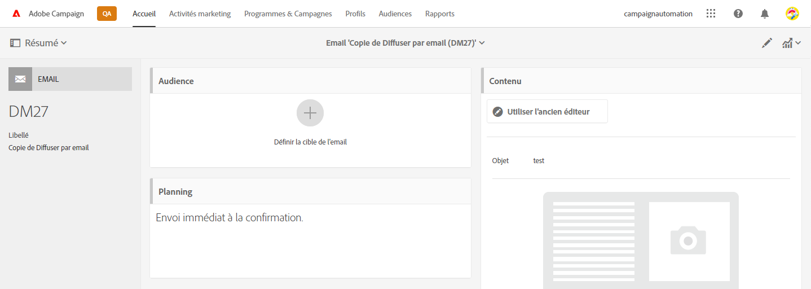
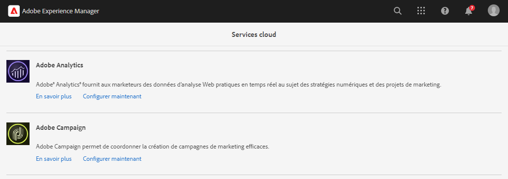

# Intégration à Adobe Campaign Standard {#integrating-with-adobe-campaign-standard}

En intégrant AEM à Adobe Campaign, vous pouvez gérer la diffusion email, le contenu et les formulaires directement dans AEM. Les étapes de configuration d’Adobe Campaign Standard et d’AEM sont nécessaires pour permettre la communication bidirectionnelle entre les solutions.

Cette intégration permet à AEM et à Adobe Campaign Standard d’être utilisés indépendamment. Les marketeurs peuvent créer des campagnes et utiliser le ciblage dans Adobe Campaign, tandis qu’en parallèle, les créateurs de contenu peuvent travailler sur la conception de contenu dans AEM. Grâce à l&#39;intégration, le contenu et la conception de la campagne créée dans AEM peuvent être ciblés et diffusés par Adobe Campaign.

## Étapes d’intégration {#integration-steps}

La configuration de l’intégration entre AEM et Adobe Campaign Standard nécessite plusieurs étapes dans les deux solutions.

1. [Configurez la variable ](#aemserver-user)
1. [Vérifiez les ](#resource-type-filter)
1. [Création d’un modèle de diffusion email spécifique à AEM dans Campaign](#aem-email-delivery-template)
1. [Configuration de l’intégration Campaign dans AEM](#campaign-integration)
1. [Configuration de la réplication sur l’instance de publication AEM](#replication)
1. [Configurer l’externaliseur AEM](#externalizer)
1. [Configurez la variable ](#campaign-remote-user)
1. [Configuration du compte externe AEM dans Campaign](#acc-external-user)

Ce document vous guide tout au long de chacune de ces étapes.

## Prérequis {#prerequisites}

* Accès des administrateurs à Adobe Campaign Standard
   * Si vous avez besoin de détails supplémentaires sur la configuration d’Adobe Campaign Standard, reportez-vous à la section [Documentation Adobe Campaign Standard.](https://experienceleague.adobe.com/docs/campaign-standard/using/campaign-standard-home.html)
* Accès des administrateurs à AEM

## Configuration de l’utilisateur aemserver dans Campaign {#aemserver-user}

Par défaut, Adobe Campaign Standard est fourni avec un `aemserver` utilisateur utilisé par AEM pour se connecter à Adobe Campaign. Vous devez affecter un groupe de sécurité approprié à cet utilisateur et définir son mot de passe.

1. Connectez-vous à Adobe Campaign en tant qu’administrateur.

1. Appuyez ou cliquez sur le logo Adobe Campaign en haut à gauche de la barre de menus pour ouvrir la navigation globale, puis sélectionnez **Administration** > **Utilisateurs et sécurité** > **Utilisateurs** dans le menu de navigation.

1. Appuyez ou cliquez sur le bouton `aemserver` dans la console utilisateurs.

1. Assurez-vous que la variable `aemserver` l’utilisateur est affecté au minimum à un groupe de sécurité possédant le rôle `deliveryPrepare` qui lui est assignée. Par défaut, le groupe `Standard Users` a ce rôle.

   

1. Appuyez ou cliquez sur **Enregistrer** pour enregistrer les modifications.

Votre `aemserver` l’utilisateur dispose désormais des droits nécessaires pour qu’AEM puisse l’utiliser pour communiquer avec Adobe Campaign.

Toutefois, avant que AEM puisse utiliser la variable `aemserver` , son mot de passe doit être défini. Cela ne peut pas être effectué via Adobe Campaign. Il doit être effectué par un ingénieur Adobe-support. [Veuillez envoyer un ticket à l’Assistance clientèle d’Adobe.](https://experienceleague.adobe.com/?support-tab=home&amp;lang=fr#support) pour demander la réinitialisation de la variable `aemserver` mot de passe. Une fois que vous disposez du mot de passe de l’Assistance clientèle d’Adobe, gardez-le dans un emplacement sécurisé.

## Vérification d’AEMResourceTypeFilter dans Campaign {#resource-type-filter}

Le `AEMResourceTypeFilter` est une option d’Adobe Campaign utilisée pour filtrer AEM ressources pouvant être utilisées dans Adobe Campaign. Comme AEM contient beaucoup de contenu, cette option agit comme un filtre qui permet à Adobe Campaign de récupérer uniquement le contenu AEM des types spécialement conçus pour être utilisés dans Adobe Campaign.

Cette option est préconfigurée. Cependant, vous devrez peut-être le mettre à jour si vous avez personnalisé les composants Campaign de AEM. Pour vérifier que la variable `AEMResourceTypeFilter` est configurée, procédez comme suit.

1. Connectez-vous à Adobe Campaign en tant qu’administrateur.

1. Appuyez ou cliquez sur le logo Adobe Campaign en haut à gauche de la barre de menus pour ouvrir la navigation globale, puis sélectionnez **Administration** > **Paramètres de l’application** > **Options** dans le menu de navigation.

1. Appuyez ou cliquez sur le bouton `AEMResourceTypeFilter` dans la console options.

1. Confirmez la configuration de la variable `AEMResourceTypeFilter`. Les chemins sont délimités par des virgules et contiennent par défaut :

   * `mcm/campaign/components/newsletter`
   * `mcm/campaign/components/campaign_newsletterpage`
   * `mcm/neolane/components/newsletter`

   

1. Appuyez ou cliquez sur **Enregistrer** pour enregistrer les modifications.

Votre `AEMResourceTypeFilter` est maintenant configuré pour récupérer le contenu correct à partir d’AEM.

## Création d’un modèle de diffusion email spécifique à AEM dans Campaign {#aem-email-delivery-template}

Par défaut, AEM n’est pas activé dans les modèles de courrier électronique d’Adobe Campaign. Vous devez configurer un nouveau modèle de diffusion email qui pourra être utilisé pour créer des emails à l’aide du contenu AEM. Pour créer un modèle de diffusion email spécifique à AEM, procédez comme suit.

1. Connectez-vous à Adobe Campaign en tant qu’administrateur.

1. Appuyez ou cliquez sur le logo Adobe Campaign en haut à gauche de la barre de menus pour ouvrir la navigation globale, puis sélectionnez **Ressources** > **Modèles** > **Modèles de diffusion** dans le menu de navigation.

1. Dans la console des modèles de diffusion, recherchez le modèle d’email par défaut. **Envoyer par email (courrier)** et passez la souris sur la carte (ou la ligne) qui la représente pour afficher les options. Cliquez sur **Dupliquer l’élément**.

   

1. Dans le **Confirmation** boîte de dialogue, cliquez sur **Confirmer** pour dupliquer le modèle.

   

1. L’éditeur de modèles s’ouvre avec votre copie du **Envoyer par email (courrier)** modèle. Cliquez sur le bouton **Modifier les propriétés** en haut à droite de la fenêtre.

   

1. Dans la fenêtre des propriétés, modifiez la variable **Libellé** pour décrire votre nouveau modèle d’AEM.

1. Cliquez sur le bouton **Contenu** en-tête pour le développer et sélectionnez **Adobe Experience Manager** dans le **Source de contenu** menu déroulant.

1. Cela révèle que la variable **Compte Adobe Experience Manager** champ . Utilisez la liste déroulante pour sélectionner **Instance Adobe Experience Manager (aemInstance)** utilisateur. Il s’agit de l’utilisateur externe par défaut pour l’intégration d’AEM.

1. Cliquez sur **Confirmer** pour enregistrer les modifications apportées aux propriétés.

1. Dans l’éditeur de modèles, cliquez sur **Enregistrer** pour enregistrer votre copie modifiée du modèle d’email en vue de l’utiliser avec AEM.

Vous disposez désormais d’un modèle d’email qui peut utiliser AEM contenu.

## Configuration de l’intégration Campaign dans AEM {#campaign-integration}

AEM communique avec Adobe Campaign à l’aide d’une intégration intégrée et de la variable `aemserver` utilisateur que vous avez configuré dans Adobe Campaign. Pour configurer cette intégration, procédez comme suit.

1. Connectez-vous à votre instance de création AEM en tant qu’administrateur.

1. Dans le rail latéral de navigation globale, sélectionnez **Outils** > **Services cloud** > **Services cloud hérités** > **Adobe Campaign**, puis cliquez sur **Configurer maintenant**.

   

1. Dans la boîte de dialogue, créez une configuration de service Campaign en saisissant un **Titre** et en cliquant sur **Créer**.

   

1. Une nouvelle fenêtre et boîte de dialogue s’ouvre pour modifier la configuration. Fournissez les informations requises.

   * **Nom d’utilisateur** - Ceci est [la valeur `aemserver` utilisateur dans Adobe Campaign que vous avez configuré à l’étape précédente.](#aemserver-user) Par défaut, celui-ci est `aemserver`.
   * **Mot de passe** - Il s’agit du mot de passe pour [la valeur `aemserver` utilisateur dans Adobe Campaign que vous avez demandé à l’assistance clientèle d’Adobe lors d’une étape précédente.](#aemserver-user)
   * **Point de fin d’API** - Il s’agit de l’URL de l’instance Adobe Campaign.

   

1. Sélectionnez **Se connecter à Adobe Campaign** pour vérifier la connexion, puis cliquez sur **OK**.

AEM peut désormais communiquer avec Adobe Campaign.

>[!NOTE]
>
>Assurez-vous que votre serveur Adobe Campaign est accessible via Internet. AEM ne peut pas accéder aux réseaux privés.

## Configuration de la réplication sur l’instance de publication AEM {#replication}

Le contenu de Campaign est créé par les auteurs de contenu sur l’instance de création AEM. Cette instance est généralement disponible uniquement en interne au sein de votre entreprise. Pour que le contenu tel que les images et les ressources soit accessible aux destinataires de votre campagne, vous devez publier ce contenu.

L’agent de réplication est chargé de publier le contenu de l’instance d’auteur AEM vers l’instance de publication et doit être configuré pour que l’intégration fonctionne correctement. Cette étape est également nécessaire pour répliquer certaines configurations d’instance de création dans l’instance de publication.

Pour configurer la réplication de votre instance d’auteur AEM vers l’instance de publication :

1. Connectez-vous à votre instance de création AEM en tant qu’administrateur.

1. Dans le rail latéral de navigation globale, sélectionnez **Outils** > **Déploiement** > **Réplication** > **Agents sur l’auteur**, puis appuyez ou cliquez sur **Agent par défaut (publication)**.

   

1. Appuyez ou cliquez sur **Modifier**, puis sélectionnez **Transférer**.

1. Configurez la variable **URI** en remplaçant la valeur par défaut `localhost` avec l’adresse IP de l’instance de publication AEM.

   

1. Appuyez ou cliquez sur **OK** pour enregistrer les modifications apportées aux paramètres de l’agent.

Vous avez configuré la réplication sur l’instance de publication AEM afin que les destinataires de vos campagnes puissent accéder à votre contenu.

>[!NOTE]
>
>Si vous ne souhaitez pas utiliser l’URL de réplication, mais plutôt l’URL publique, vous pouvez définir l’URL publique dans le paramètre de configuration suivant via OSGi.
>
>Dans le rail latéral de navigation globale, sélectionnez **Outils** > **Opérations** > **Console web** > **Configuration OSGi** et recherchez **Intégration AEM Campaign - Configuration**. Modifiez la configuration et modifiez le champ. **URL publique** (`com.day.cq.mcm.campaign.impl.IntegrationConfigImpl#aem.mcm.campaign.publicUrl`).

## Configurer l’externaliseur AEM {#externalizer}

[Externalizer est un service OSGi d’AEM qui transforme un chemin d’accès aux ressources en URL externe et absolue, ce qui est nécessaire pour qu’AEM diffuse du contenu que Campaign peut utiliser. ](/help/sites-developing/externalizer.md) Vous devez le configurer pour que l’intégration de Campaign fonctionne.

1. Connectez-vous à l’instance de création AEM en tant qu’administrateur.
1. Dans le rail latéral de navigation globale, sélectionnez **Outils** > **Opérations** > **Console web** > **Configuration OSGi** et recherchez **Externalisateur de lien Day CQ**.
1. Par défaut, la dernière entrée dans la variable **Domaines** est destiné à l’instance de publication. Modifier l’URL à partir de la valeur par défaut `http://localhost:4503` à votre instance de publication disponible publiquement.

   

1. Cliquez ou appuyez sur **Enregistrer**.

Vous avez configuré l’externaliseur et Adobe Campaign peut désormais accéder à votre contenu.

>[!NOTE]
L’instance de publication doit être accessible à partir du serveur Adobe Campaign. S’il pointe vers `localhost:4503` Pour un autre serveur qu’Adobe Campaign ne peut pas atteindre, les images d’AEM n’apparaîtront pas dans la console Adobe Campaign.

## Configuration de l’utilisateur distant de campagne dans AEM {#campaign-remote-user}

Tout comme vous avez besoin d’un utilisateur dans Adobe Campaign AEM qui peut communiquer avec Adobe Campaign, Adobe Campaign a également besoin d’un utilisateur dans AEM pour communiquer avec l’instance. Par défaut, l&#39;intégration de Campaign crée la variable `campaign-remote` utilisateur dans AEM. Pour configurer cet utilisateur, procédez comme suit.

1. Connectez-vous à AEM en tant qu’administrateur.
1. Dans la console de navigation principale, cliquez sur **Outils** dans le rail de gauche.
1. Cliquez ensuite sur **Sécurité** > **Utilisateurs** pour ouvrir la console d’administration des utilisateurs.
1. Recherchez l’utilisateur `campaign-remote`.
1. Sélectionnez l’utilisateur `campaign-remote` et cliquez sur **Propriétés** pour le modifier.
1. Dans la fenêtre **Modifier les paramètres utilisateur**, cliquez sur **Modifier le mot de passe**.
1. Saisissez un nouveau mot de passe pour l’utilisateur et notez-le dans un emplacement sécurisé en vue d’une utilisation ultérieure.
1. Cliquez sur **Enregistrer** pour enregistrer le changement de mot de passe.
1. Cliquez sur **Enregistrer et fermer** pour enregistrer les modifications apportées à l’utilisateur `campaign-remote`.

## Configuration du compte externe AEM dans Campaign {#acc-external-user}

Lorsque vous [a créé un modèle de diffusion email spécifique à AEM,](#aem-email-delivery-template) vous avez spécifié que le modèle doit utiliser la variable `aemInstance` compte externe pour communiquer avec AEM. Pour activer la communication bidirectionnelle entre les deux solutions, vous devez configurer ce compte dans Adobe Campaign.

1. Connectez-vous à Adobe Campaign en tant qu’administrateur.

1. Appuyez ou cliquez sur le logo Adobe Campaign en haut à gauche de la barre de menus pour ouvrir la navigation globale, puis sélectionnez **Administration** > **Paramètres de l’application** > **Comptes externes** dans le menu de navigation.

1. Appuyez ou cliquez sur le bouton **Instance Adobe Experience Manager (aemInstance)** dans la console utilisateurs.

1. Assurez-vous que l’utilisateur a **Adobe Experience Manager** comme la propriété **Type**.

1. Dans le **Connexion** définissez les champs suivants :

   1. Serveur : Il s’agit de l’URL de votre serveur de création AEM. Cela ne doit pas se terminer par une barre oblique.
   1. Compte : Il s’agit de la variable `campaign-remote` user you [précédemment configuré dans AEM.](#campaign-remote-user)
   1. Mot de passe : Il s’agit du mot de passe de la variable `campaign-remote`user you [précédemment configuré dans AEM.](#campaign-remote-user)

   

1. Assurez-vous que la variable **Activé** case à cocher sélectionnée, puis cliquez sur **Enregistrer** pour enregistrer vos modifications.

Félicitations ! Vous avez terminé l’intégration entre AEM et Adobe Campaign Standard !

## Étapes suivantes {#next-steps}

Une fois Adobe Campaign Classic et AEM configurés, l’intégration est désormais terminée.

Ne vous arrêtez pas en si bon chemin et apprenez à créer une newsletter dans Adobe Experience Manager à l’aide de [ce document](/help/sites-authoring/campaign.md).
