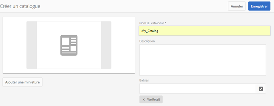
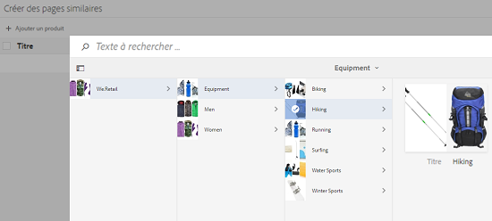
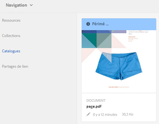

# Catalog Producer{#catalog-producer}

Découvrez comment utiliser le Catalog Producer dans AEM Assets pour générer des catalogues de produits à l’aide de vos ressources numériques.

Grâce à Adobe Experience Manager (AEM) Assets Catalog Producer, vous pouvez créer des catalogues pour vos produits de marque à l’aide de modèles InDesign importés à partir d’une application InDesign. Pour importer des modèles d’InDesign, vous devez d’abord intégrer AEM Assets à un serveur d’InDesign.

## Intégration à un serveur InDesign {#integrating-with-indesign-server}

As part of the integration process, configure the **DAM Update Asset** workflow, which is suited for integration with InDesign. Configurez également un programme de traitement du proxy pour le serveur InDesign. For details, see [Integrating AEM Assets with InDesign Server](/help/assets/indesign.md).

>[!NOTE]
>
>Vous pouvez générer des modèles InDesign à partir de fichiers InDesign avant de les importer dans AEM Assets. Pour plus d’informations, voir [Utilisation de fichiers et de modèles](https://helpx.adobe.com/fr/indesign/using/files-templates.html).
>
>Vous pouvez associer les éléments dans vos modèles InDesign à des balises XML. Les balises mappées s’affichent sous forme de propriétés lorsque vous mappez les propriétés d’un produit aux propriétés d’un modèle dans Catalog Producer. To learn about XML tagging in InDesign files, see [Tagging content for XML](https://helpx.adobe.com/fr/indesign/using/tagging-content-xml.html).

>[!NOTE]
>
>Seuls des fichiers InDesign (.indd) sont utilisés comme modèles. Les fichiers possédant l’extension « .indt » ne sont pas pris en charge.

## Création d’un catalogue {#creating-a-catalog}

Catalog Producer utilise des données de gestion d’informations sur les produits pour mapper les propriétés d’un produit aux propriétés XML affichées dans le modèle. Pour créer un catalogue, procédez comme suit :

1. From the Assets user interface, tap/click the **AEM logo**, and go to **Assets > Catalogs**.
1. In the **Catalogs** page, tap/click **Create** from the toolbar, and then select **Catalog** from the list.
1. In the **Create Catalog** page, enter a name and description (optional) for the catalog and specify tags, if any. Vous pouvez également ajouter une miniature.

   

1. Appuyez/cliquez sur **Enregistrer**. Une boîte de dialogue de confirmation vous informe que le catalogue a été créé. Tap/click **Done** to close the dialog.
1. To open the catalog you created, tap/click it from the **Catalogs** page.

   >[!NOTE]
   >
   >To open the catalog, you can also tap/click **Open** in the confirmation dialog mentioned in the previous step.

1. To add pages to the catalog, tap/click **Create** from the toolbar, and then choose the **New Page** option.
1. Dans l’assistant, sélectionnez un modèle InDesign pour votre page. Then, tap/click **Next**.
1. Spécifiez un nom pour la page et une description (facultative). Spécifiez des balises, le cas échéant.
1. Tap/click the **Create** from the toolbar. Then, tap/click **Open** from the dialog. Les propriétés du produit sont affichées dans le volet gauche. Les propriétés prédéfinies du modèle InDesign s’affichent dans le volet droit.
1. Dans le volet gauche, faites glisser les propriétés du produit vers les propriétés du modèle InDesign, puis créez un mappage entre elles.

   To view how the page appears in real time, tap/click the **Preview** tab on the right pane.

1. Pour créer d’autres pages, répétez les étapes 6 à 9. To create similar pages for other products, select the page and tap/click the **Create similar pages** icon from the toolbar.

   

   >[!NOTE]
   >
   >Vous ne pouvez créer des pages similaires que pour les produits ayant une structure similaire.

   Appuyez/cliquez sur l’icône Ajouter, sélectionnez les produits à l’aide du sélecteur de produits, puis appuyez/cliquez sur **Sélectionner** dans la barre d’outils.

   

1. From the toolbar, click/tap **Create**. Tap/click **Done** to close the dialog. Les pages similaires sont incluses dans votre catalogue.
1. To add any existing InDesign file to your catalog, tap/click **Create** from the toolbar, and choose the **Add to existing page** option.
1. Select the InDesign file, and tap/click **Add** from the toolbar. Then, tap/click **OK** to close the dialog.

   Si les métadonnées des produits que vous référencez dans les pages du catalogue sont modifiées, les modifications ne sont pas automatiquement répercutées dans les pages du catalogue. A banner labeled **Stale** appears on the product images in the referencing catalog pages, indicating that the metadata for the referenced products is not up-to-date.

   

   To ensure that the product images reflect the latest metadata changes, select the page in the Catalog console and click/tap the **Update page** icon from the toolbar.

   

   >[!NOTE]
   >
   >To change the metadata for a referenced product, navigate to the Products console (**AEM Logo** > **Commerce** > **Products**), and select the product. Then, click/tap the **View Properties** icon from the toolbar and edit the metadata in the Properties page of the asset.

1. To rearrange the pages in catalog, tap/click the **Create** icon from the toolbar and then choose **Merge** from the menu. Dans l’assistant, le carrousel dans la partie supérieure permet de réorganiser les pages en les faisant glisser. Vous pouvez également supprimer des pages.

1. Appuyez/cliquez sur **Suivant**. To add an existing InDesign file as a cover page, tap/click **Browse** beside the **Choose Cover Page** box, and specify the path for the cover page template.
1. Tap/click **Save**, and then tap/click **Done** to close the confirmation dialog.
Lorsque vous sélectionnez l’option **Terminé** , une boîte de dialogue s’ouvre pour indiquer si vous souhaitez obtenir un rendu .pdf.
   Si l’option Acrobat(PDF) est sélectionnée, un rendu pdf est créé dans **/jcr:content/renditions** en plus du rendu indesign. Vous pouvez télécharger tous les rendus en cochant la case &quot;Rendus&quot; dans la boîte de dialogue de téléchargement.

1. To generate a preview for the catalog you created, select it in the **Catalogs** console, and then click the **Preview** icon from the toolbar.

   

   Consultez les pages de votre catalogue dans l’aperçu. Appuyez/cliquez sur **Fermer** pour fermer l’aperçu.

