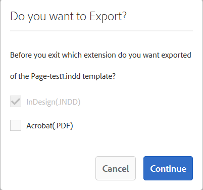

# Catalog Producer{#catalog-producer}

Découvrez comment utiliser Catalog Producer dans AEM Assets pour générer des catalogues de produits à l’aide de vos ressources numériques.

Grâce au Catalog Producer d’Adobe Experience Manager (AEM) Assets, vous pouvez créer des catalogues pour vos produits de marque à l’aide de modèles InDesign importés à partir d’une application InDesign. Pour importer des modèles InDesign, intégrez d’abord AEM Assets à un serveur InDesign.

## Intégration à un serveur InDesign {#integrating-with-indesign-server}

Dans le cadre du processus d’intégration, configurez le workflow **Ressource de mise à jour de la gestion des ressources numériques** qui est adapté à l’intégration à InDesign. Configurez également un programme de traitement du proxy pour le serveur InDesign. Pour plus de détails, consultez [Intégration d’AEM Assets au serveur InDesign](/help/assets/indesign.md).

>[!NOTE]
>
>Vous pouvez générer des modèles InDesign à partir de fichiers InDesign avant de les importer dans AEM Assets. Pour plus d’informations, voir [Utilisation de fichiers et de modèles](https://helpx.adobe.com/fr/indesign/using/files-templates.html).
>
>Vous pouvez associer les éléments dans vos modèles InDesign à des balises XML. Les balises mappées s’affichent sous forme de propriétés lorsque vous mappez les propriétés d’un produit aux propriétés d’un modèle dans Catalog Producer. Pour en savoir plus sur les balises XML dans les fichiers InDesign, consultez [Balisage de contenu au format XML](https://helpx.adobe.com/fr/indesign/using/tagging-content-xml.html).

>[!NOTE]
>
>Seuls des fichiers InDesign (.indd) sont utilisés comme modèles. Les fichiers avec l’extension .indt ne sont pas pris en charge.

## Création d’un catalogue {#creating-a-catalog}

Catalog Producer utilise des données de gestion d’informations sur les produits pour mapper les propriétés d’un produit aux propriétés XML affichées dans le modèle. Pour créer un catalogue, procédez comme suit :

1. Dans l’interface utilisateur d’Assets, cliquez sur le **Logo AEM**, puis accédez à **Ressources > Catalogues**.
1. Dans le **Catalogues** page, cliquez sur **Créer** dans la barre d’outils, puis sélectionnez **Catalogue** dans la liste.
1. Dans la page **Créer un catalogue**, entrez un nom et une description (facultative) pour le catalogue et spécifiez les balises, le cas échéant. Vous pouvez également ajouter une miniature.

   

1. Cliquez sur **Enregistrer**. Une boîte de dialogue de confirmation vous informe que le catalogue a été créé. Cliquez sur **Terminé** pour fermer la boîte de dialogue.
1. Pour ouvrir le catalogue que vous avez créé, cliquez dessus dans le **Catalogues** page.

   >[!NOTE]
   >
   >Pour ouvrir le catalogue, vous pouvez également cliquer sur **Ouvrir** dans la boîte de dialogue de confirmation mentionnée à l’étape précédente.

1. Pour ajouter des pages au catalogue, cliquez sur **Créer** dans la barre d’outils, puis sélectionnez l’option **Nouvelle page** .
1. Dans l’assistant, sélectionnez un modèle InDesign pour votre page. Cliquez ensuite sur **Suivant**.
1. Spécifiez un nom pour la page et une description (facultative). Indiquez des balises, le cas échéant.
1. Cliquez sur le bouton **Créer** dans la barre d’outils. Cliquez ensuite sur **Ouvrir** dans la boîte de dialogue. Les propriétés du produit sont affichées dans le volet gauche. Les propriétés prédéfinies du modèle InDesign s’affichent dans le volet de droite.
1. Dans le volet de gauche, faites glisser les propriétés du produit vers les propriétés du modèle InDesign, puis créez un mappage entre elles.

   Pour afficher la page en temps réel, cliquez sur la **Aperçu** dans le volet de droite.

1. Pour créer d’autres pages, répétez les étapes 6 à 9. Pour créer des pages similaires pour d’autres produits, sélectionnez la page et cliquez sur le bouton **Création de pages similaires** dans la barre d’outils.

   

   >[!NOTE]
   >
   >Vous pouvez uniquement créer des pages similaires pour les produits ayant une structure similaire.

   Cliquez sur l’icône Ajouter , sélectionnez des produits dans le sélecteur de produits, puis cliquez sur **Sélectionner** dans la barre d’outils.

   

1. Dans la barre d’outils, cliquez sur **Créer**. Cliquez sur **Terminé** pour fermer la boîte de dialogue. Des pages similaires sont incluses dans votre catalogue.
1. Pour ajouter un fichier d’InDesign existant à votre catalogue, cliquez sur **Créer** dans la barre d’outils, puis sélectionnez l’option **Ajouter à une page existante** .
1. Sélectionnez le fichier d’InDesign, puis cliquez sur **Ajouter** dans la barre d’outils. Cliquez ensuite sur **OK** pour fermer la boîte de dialogue.

   Si les métadonnées des produits que vous référencez dans les pages du catalogue sont modifiées, les modifications ne sont pas répercutées automatiquement dans les pages du catalogue. Une bannière **Obsolète** s’affiche sur les images du produit dans toutes les pages du catalogue qui y font référence, ce qui indique que les métadonnées des produits référencés ne sont pas à jour.

   

   Pour vous assurer que les images du produit reflètent les dernières modifications apportées aux métadonnées, sélectionnez la page dans la console Catalogue et cliquez sur le bouton **Mettre à jour la page** dans la barre d’outils.

   

   >[!NOTE]
   >
   >Pour modifier les métadonnées d’un produit référencé, accédez à la console Produits (**Logo AEM** > **Commerce** > **Produits**) et sélectionnez le produit. Cliquez ensuite sur le bouton **Afficher les propriétés** dans la barre d’outils, puis modifiez les métadonnées dans la page Propriétés de la ressource.

1. Pour réorganiser les pages du catalogue, cliquez sur le bouton **Créer** dans la barre d’outils, puis choisissez **Fusion** dans le menu. Dans l’assistant, le carrousel dans la partie supérieure permet de réorganiser les pages en les faisant glisser. Vous pouvez également supprimer des pages.

1. Cliquez sur **Suivant**. Pour ajouter un fichier d’InDesign existant comme page de garde, cliquez sur **Parcourir** en regard de la variable **Sélectionner la page de couverture** et indiquez le chemin d’accès au modèle de page de garde.
1. Cliquez sur **Enregistrer**, puis cliquez sur **Terminé** pour fermer la boîte de dialogue de confirmation.
Lorsque vous sélectionnez l’option **Terminé**, une boîte de dialogue s’ouvre pour vous demander si vous souhaitez un rendu .pdf.
   
Si l’option Acrobat(PDF) est sélectionnée, un rendu pdf est créé dans  **/jcr:content/renditions**, en plus du rendu indesign. Vous pouvez télécharger tous les rendus en cochant la case « Rendus » dans la boîte de dialogue de téléchargement.

1. Pour générer un aperçu du catalogue que vous venez de créer, sélectionnez-le dans la console **Catalogues**, puis cliquez sur l’icône **Aperçu** de la barre d’outils.

   

   Consultez les pages de votre catalogue dans l’aperçu. Cliquez sur **Fermer** pour fermer l’aperçu.
