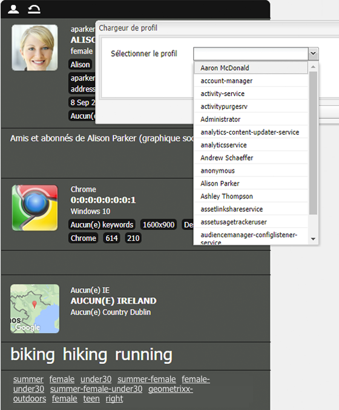

# ClientContext{#client-context}

>[!NOTE]
>
>ClientContext a été remplacé par ContextHub. Pour plus d&#39;informations, consultez la documentation [configuration]ch-configuring.md) et [developer](/help/sites-developing/contexthub.md) associée.

Le contexte client est un mécanisme qui fournit certaines informations sur la page et le visiteur en cours. Il peut être ouvert à l’aide de **Ctrl-Alt-c** (windows) ou **control-option-c** (Mac) :

Dans l’[environnement de publication et de création, il affiche des informations](#propertiesavailableintheclientcontext) sur :

* Le visiteur. En fonction de votre instance, certaines informations sont demandées ou dérivées.
* Les balises de page et le nombre de fois que ces balises ont été consultées par le visiteur actuel (ceci s’affiche lorsque vous placez le curseur de la souris sur une balise).
* Informations sur la page.
* Informations sur l’environnement technique, telles que l’adresse IP, le navigateur et la résolution d’écran.
* Tous les segments actuellement résolus.

Les icônes (disponibles uniquement dans l’environnement de création) vous permettent de configurer les détails du contexte client :

* **Modifier** Une nouvelle page s’ouvre, vous permettant de [modifier, d’ajouter ou de supprimer une propriété de profil](#editingprofiledetails).

* **Charger** Vous pouvez [effectuer un choix dans une liste de profils et charger le profil](#loading-a-new-user-profile) que vous souhaitez tester.

* **Réinitialiser** Vous pouvez [réinitialiser le profil](#resetting-the-profile-to-the-current-user) sur celui de l’utilisateur actuel.

## Composants ClientContext disponibles {#available-client-context-components}

ClientContext peut afficher les propriétés suivantes ([selon les éléments ayant été sélectionnés à l’aide de Modifier](#adding-a-property-component)) :

**Informations** sur le référentAffiche les informations suivantes côté client :

* **Adresse IP**
* **mot-** clé utilisé pour le référent de moteur de recherche
* le **navigateur** utilisé
* le **système d’exploitation** (système d’exploitation) utilisé
* l&#39;écran **résolution**
* position **souris X**
* position **Y de la souris**

**Activité** StreamCette section fournit des informations sur l&#39;activité sociale de l&#39;utilisateur sur différentes plateformes ; par exemple, les forums AEM, les blogs, les évaluations, etc.

**** CampaignPermet aux auteurs de simuler une expérience spécifique pour une campagne. Ce composant remplace la sélection normale de résolution et d’expérience de campagne pour permettre de tester différentes variantes.

La résolution Campaign est généralement basée sur la propriété priority de la campagne. L’expérience est normalement sélectionnée en fonction de la segmentation.

**** Panier Affiche les informations du panier, y compris les entrées de produits (titre, quantité, prixFormaté, etc.), les promotions résolues (titre, message, etc.) et les bons (code, description, etc.).

La boutique de session de panier informe également le serveur des changements de promotion résolus (en fonction des modifications de segmentation) avec la propriété ClientContextCartServlet.

**** Magasin génériqueComposant générique qui affiche le contenu d’une boutique. Il s’agit d’une version de niveau inférieur du composant Propriétés de la boutique générique.

La boutique générique doit être configurée avec un rendu JS qui affiche les données d’une manière personnalisée.

**** Propriétés génériques du magasinComposant générique qui affiche le contenu d&#39;un magasin. Il s’agit d’une version de niveau supérieur du composant Boutique générique.

Le composant Propriétés de la boutique générique inclut un rendu par défaut qui répertorie les propriétés configurées (ainsi qu’une miniature).

**** Géolocalisation Affiche la latitude et la longitude du client. Elle utilise l’API de géolocalisation HTML5 pour demander la position actuelle au navigateur. Cela se traduit par l’affichage d’une fenêtre contextuelle au visiteur, où le navigateur lui demande s’il accepte de partager son emplacement.

Lorsqu’il est affiché dans le cloud contextuel, le composant utilise une API Google pour afficher une carte sous forme de vignette. Le composant est soumis aux [limites d’utilisation](https://developers.google.com/maps/documentation/staticmaps/intro#Limits) de l’API Google.

>[!NOTE]
>
>Dans AEM 6.1, la boutique Géolocalisation ne fournit plus la fonction de géocodage inversé. Par conséquent, elle ne récupère plus de détails concernant l’emplacement actuel, tels que le nom de ville ou le code pays. Les segments qui utilisent ces données de boutique ne fonctionneront pas correctement. La boutique Géolocalisation contient uniquement la latitude et la longitude de l’emplacement.

**Composant JSONP** StoreUn qui affiche le contenu qui dépend de votre installation.

La norme JSONP est un complément de JSON qui permet de contourner stratégie de même origine (ce qui empêche les applications web de communiquer avec les serveurs se trouvant sur un autre domaine). Il consiste à encapsuler l’objet JSON dans un appel de fonction afin de pouvoir le charger en tant que `<script>` à partir de l’autre domaine (exception autorisée pour la même stratégie d’origine).

  La boutique JSONP est semblable à n’importe quelle autre boutique, mais elle charge des informations issues d’un autre domaine sans avoir besoin d’un proxy pour ces informations sur le domaine actuel. Voir l’exemple figurant dans [Stockage de données dans le contexte client via JSONP](/help/sites-administering/client-context.md#storing-data-in-client-context-via-jsonp).

>[!NOTE]
>
>La boutique JSONP ne met pas en cache les informations figurant dans le cookie, mais récupère ces données à chaque chargement de la page.

**Profil** DataAffiche les informations collectées dans le profil utilisateur. Par exemple, le sexe, l’âge ou l’adresse électronique.

**** segments résolusIndique les segments actuellement résolus (souvent en fonction d&#39;autres informations affichées dans le contexte du client). Ceci s’avère utile lors de la configuration d’une campagne.

Par exemple, si la souris se trouve sur la partie gauche ou droite de la fenêtre. Ce segment est principalement utilisé pour les tests, car les modifications sont visibles immédiatement.

**** Graphique des réseaux sociaux Affiche le graphique des réseaux sociaux des amis et abonnés de l’utilisateur.

>[!NOTE]
>
>Il s’agit actuellement d’une fonction de démonstration qui repose sur des données pré-configurées définies sur les nœuds de profil de nos utilisateurs de démonstration. Pour obtenir un exemple, voir la section :
>
>`/home/users/geometrixx/aparker@geometrixx.info/profile` => propriété des amis

**Tag** CloudAffiche les balises définies sur la page active et celles rassemblées lors de la navigation sur le site. Déplacer le curseur sur une balise affiche le nombre de fois que l’utilisateur actuel a accédé aux pages contenant cette balise.

>[!NOTE]
Les balises définies sur des ressources DAM qui s’affichent sur les pages visitées ne sont pas prises en compte.

**Technographics** StoreCe composant dépend de votre installation.

**Produits** consultésEffectue le suivi des produits que l&#39;acheteur a consultés. Peut être interrogé pour connaître le produit le plus récemment affiché, ou le produit le plus récemment affiché ne figurant pas déjà dans le panier.

Cette boutique de session ne comporte pas de composant de contexte client par défaut.

Pour plus d’informations, voir [ClientContext en détail](/help/sites-developing/client-context.md).

>[!NOTE]
« Données de page » ne figure plus dans ClientContext sous la forme d’un composant par défaut. Au besoin, vous pouvez l’ajouter en modifiant ClientContext, en ajoutant le composant **Propriétés de la boutique générique**, puis en le configurant de manière à définir **Boutique** en tant que `pagedata`.

## Modification du profil ClientContext {#changing-the-client-context-profile}

ClientContext vous permet de modifier des détails de manière interactive :

* Modifier le profil utilisé dans ClientContext vous permet de voir les différentes expériences de l’utilisateur sur la page en cours.
* En plus de modifier le profil utilisateur, vous pouvez modifier certains détails du profil pour voir comment le contenu de la page diffère selon différentes conditions.

### Chargement d’un nouveau profil utilisateur {#loading-a-new-user-profile}

Vous pouvez changer le profil en effectuant l’une des opérations suivantes :

* [À l’aide de l’icône de chargement](#loading-a-new-visitor-profile-with-the-load-profile-icon)
* [À l’aide du curseur de sélection](#loadinganewvisitorprofilewiththeselectionslider)

Lorsque vous avez terminé, vous pouvez [réinitialiser le profil](#resetting-the-profile-to-the-current-user).

#### Chargement d’un nouveau profil de visiteur avec l’icône de chargement de profil {#loading-a-new-visitor-profile-with-the-load-profile-icon}

1. Cliquez sur l’icône de chargement de profil :

   

1. Cette action ouvre la boîte de dialogue, où vous pouvez sélectionner le profil à charger :

   

1. Cliquez sur **OK** pour procéder au chargement.

#### Chargement d’un nouveau profil utilisateur avec le curseur de sélection {#loading-a-new-user-profile-with-the-selection-slider}

Vous pouvez également sélectionner un profil avec le curseur de sélection :

1. Double-cliquez sur l’icône représentant l’utilisateur actuel. Le sélecteur s’ouvre ; utilisez les flèches pour passer en revue les profils disponibles :

   

1. Cliquez sur le profil à charger. Lorsque les informations sont chargées, cliquez en dehors du sélecteur pour le fermer.

#### Réinitialisation du profil sur l’utilisateur actuel {#resetting-the-profile-to-the-current-user}

1. Utilisez l’icône de réinitialisation pour réinitialiser le profil ClientContext sur celui de l’utilisateur actuel :

   

### Changement de la plateforme de navigateur {#changing-the-browser-platform}

1. Double-cliquez sur l’icône représentant la plateforme de navigateur. Le sélecteur s’ouvre ; utilisez les flèches pour passer en revue les plateformes/navigateurs disponibles :

   

1. Cliquez sur la plateforme de navigateur que vous souhaitez charger. Lorsque les informations sont chargées, cliquez en dehors du sélecteur pour le fermer.

### Changement de la géolocalisation  {#changing-the-geolocation}

1. Double-cliquez sur l’icône de géolocalisation. Une carte étendue s’ouvre ; vous pouvez y faire glisser le marqueur vers un nouvel emplacement :

   

1. Cliquez en dehors de la carte pour la fermer.

### Modification de la sélection des balises  {#changing-the-tag-selection}

1. Double-cliquez sur la section Nuage de tags de ClientContext. La boîte de dialogue s’ouvre, et vous pouvez y sélectionner des balises :

   

1. Cliquez sur OK pour procéder au chargement dans ClientContext.

## Modification de ClientContext  {#editing-the-client-context}

La modification de ClientContext peut être utilisée pour définir (ou réinitialiser) les valeurs de certaines propriétés, ajouter une nouvelle propriété ou supprimer une propriété qui n’est plus utile.

### Modification des détails des propriétés  {#editing-property-details}

La modification de ClientContext peut être utilisée pour définir (ou réinitialiser) les valeurs de certaines propriétés. Cela vous permet de tester des scénarios spécifiques (particulièrement utiles pour [segmentation](/help/sites-administering/campaign-segmentation.md) et [campagnes](/help/sites-classic-ui-authoring/classic-personalization-campaigns.md)).

### Ajout d’un composant de propriété {#adding-a-property-component}

Après avoir ouvert la **page de conception de ClientContext**, vous pouvez également **Ajouter** une propriété entièrement nouvelle à l&#39;aide des composants disponibles (les composants sont répertoriés dans le sidekick ou dans la boîte de dialogue **Insérer un nouveau composant** qui s&#39;ouvre après un doublon-clic sur **Faire glisser les composants** ) :

### Suppression d’un composant de propriété {#removing-a-property-component}

Après avoir ouvert la **page de conception de ClientContext**, vous pouvez également **Supprimer** une propriété si elle n’est plus utile. Ceci comprend les propriétés fournies clé en main. L’option **Réinitialiser** restaure ces propriétés si elles ont été supprimées.

## Stockage des références dans ClientContext via JSONP  {#storing-data-in-client-context-via-jsonp}

Suivez cet exemple pour utiliser le composant de boutique contextuel Boutique JSONP afin d’ajouter des données externes à ClientContext. Ensuite, créez un segment basé sur les informations issues de ces données. Cet exemple utilise le service JSONP que WIPmania.com fournit. Le service retourne des informations de géolocalisation en fonction de l’adresse IP du client web.

Cet exemple utilise l’exemple de site web Geometrixx Outdoors pour accéder à ClientContext et tester le segment créé. Vous pouvez utiliser un autre site web tant que la page a activé ClientContext. (Voir [Ajout de ClientContext à une page](/help/sites-developing/client-context.md#adding-client-context-to-a-page).)

### Ajout du composant Boutique JSONP  {#add-the-jsonp-store-component}

Ajoutez le composant Boutique JSONP à ClientContext et utilisez-le pour récupérer et stocker des informations de géolocalisation sur le client web.

1. Ouvrez la page d’accueil en anglais du site Geometrixx Outdoors sur l’instance de création AEM. ([https://localhost:4502/content/geometrixx-outdoors/en.html](https://localhost:4502/content/geometrixx-outdoors/en.html)).
1. Pour ouvrir Client Context, appuyez sur Ctrl-Alt-c (windows) ou Ctrl-option-c (Mac).
1. Cliquez sur l’icône de modification de ClientContext pour ouvrir le concepteur ClientContext.

   

1. Faites glisser le composant Boutique JSONP sur ClientContext.

   

1. Double-cliquez sur le composant pour ouvrir la boîte de dialogue d’édition.
1. Dans la zone URL du service JSONP, saisissez l’URL suivante, puis cliquez sur Récupérer la boutique :

   `https://api.wipmania.com/jsonp?callback=${callback}`

   Le composant appelle le service JSONP et répertorie toutes les propriétés que les données renvoyées contiennent. Les propriétés qui figurent dans la liste sont celles qui seront disponibles dans ClientContext.

   

1. Cliquez sur OK.
1. Revenez à la page d’accueil Geometrixx Outdoors et actualisez-la. ClientContext comprend désormais les informations du composant Boutique JSONP.

   

### Création du segment  {#create-the-segment}

Utilisez les données de la boutique de session que vous avez créée à l’aide du composant Boutique JSONP. Le segment utilise la latitude de la boutique de session et la date actuelle pour déterminer si c’est l’hiver là où se trouve le client.

1. Ouvrez la console Outils dans votre navigateur Web (`https://localhost:4502/miscadmin#/etc`).
1. Dans l’arborescence, cliquez sur le dossier Outils/Segmentation, puis sur Nouveau > Nouveau dossier. Spécifiez les valeurs de propriété suivantes, puis cliquez sur Créer :

   * Nom : mysegments
   * Titre : Mes segments

1. Sélectionnez le dossier Mes segments et cliquez sur Nouveau > Nouvelle page :

   1. Pour le Titre, saisissez Hiver.
   1. Sélectionnez le modèle de segment.
   1. Cliquez sur Créer.

1. Cliquez avec le bouton droit de la souris sur le segment Hiver et cliquez sur Ouvrir.
1. Faites glisser la propriété de la boutique générique vers le conteneur ET par défaut.

   

1. Double-cliquez sur le composant pour ouvrir la boîte de dialogue de modification, spécifiez les valeurs de propriété suivantes, puis cliquez sur OK :

   * Boutique : wipmania
   * Nom de la propriété : Latitude
   * Opérateur : Est supérieur à
   * Valeur de propriété : 30

1. Faites glisser le composant Script vers le même conteneur ET, puis ouvrez sa boîte de dialogue de modification. Ajoutez le script suivant, puis cliquez sur OK :

   `3 < new Date().getMonth() < 12`

