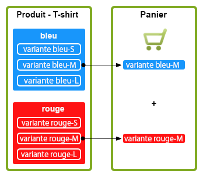
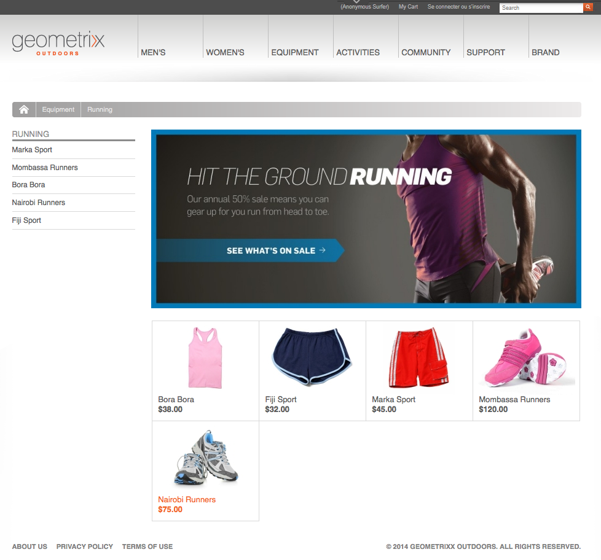
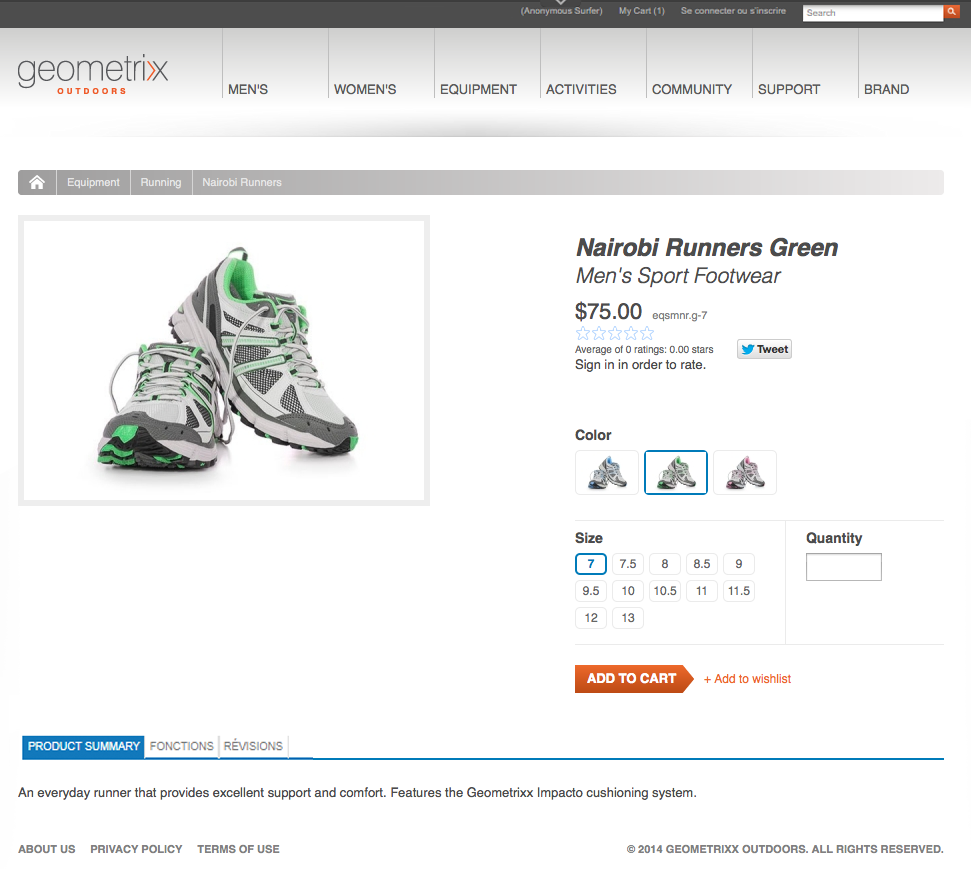

# Concepts {#concepts}

La structure d’intégration fournit les mécanismes et les composants des opérations suivantes :

* Connexion à un moteur de commerce électronique
* Extraction de données dans AEM
* Affichage des données et collecte des réponses des acheteurs
* Renvoi des détails des transactions
* Recherche sur les données des deux systèmes

Cela signifie que :

* les acheteurs peuvent s’enregistrer et effectuer des achats sans attendre ;
* les acheteurs découvrent les changements de prix sans délai ;
* des produits peuvent être ajoutés, au besoin.

>[!NOTE]
>
>La structure de commerce électronique peut être utilisée avec :
>
>* [Magento](https://www.adobe.io/apis/experiencecloud/commerce-integration-framework/integrations.html#!AdobeDocs/commerce-cif-documentation/master/integrations/02-AEM-Magento.md)
>* [SAP Commerce Cloud](/help/sites-administering/sap-commerce-cloud.md)
>* [Salesforce Commerce Cloud](https://github.com/adobe/commerce-salesforce)

>

>[!CAUTION]
>
>La [structure d’intégration du commerce électronique](https://www.adobe.com/solutions/web-experience-management/commerce.html) est un module complémentaire d’AEM.
>
>Le représentant commercial peut vous donner plus de détails, en fonction du moteur approprié.

>[!CAUTION]
>
>La structure fournit les exigences de base de votre propre projet.
>
>Un certain travail de développement reste nécessaire pour adapter la structure à vos spécifications.

>[!CAUTION]
>
>L’installation standard d’AEM inclut une mise en œuvre générique d’eCommerce (JCR) AEM.
>
>Pour le moment, elle est utilisée à des fins de démonstration ou comme base d’une mise en œuvre personnalisée selon vos besoins.

Pour optimiser le fonctionnement, AEM et le moteur eCommerce se concentrent chacun sur leur propre champ d’expertise. Les informations sont transférées entre les deux en temps réel. Par exemple :

* AEM peut :

   * Requête:

      * des informations sur les produits au moteur eCommerce ;
   * Fournissez les détails suivants :

      * des vues utilisateur pour les informations sur les produits, le panier et le passage en caisse ;
      * des informations sur le panier et le passage en caisse au moteur eCommerce ;
      * l’optimisation du moteur de recherche ;
      * des fonctionnalités de communauté ;
      * des interactions marketing non structurées.

* Le moteur eCommerce peut :

   * Fournissez les détails suivants :

      * des informations de la base de données ;
      * la gestion des variantes des produits ;
      * la gestion des commandes ;
      * la planification des ressources de l’entreprise (ERP) ;
      * la recherche dans les informations sur les produits.
   * Traiter :

      * le panier ;
      * le passage en caisse ;
      * la préparation des commandes.

>[!NOTE]
>
>Les détails exacts dépendent du moteur eCommerce et de la mise en œuvre du projet.

Un certain nombre de composants AEM prêts à l’emploi sont fournis pour utiliser la couche d’intégration. Pour le moment, par exemple :

* Informations sur les produits
* Panier
* Passage en caisse
* Mon compte

Différentes options de recherche sont également disponibles.

## Architecture {#architecture}

La structure d’intégration fournit l’API, une série de composants illustrant les fonctionnalités et différentes extensions pour fournir des exemples de méthodes de connexion.

La structure vous donne accès à certaines fonctionnalités, comme :

### Mises en œuvre {#implementations}

AEM eCommerce est mis en œuvre avec un moteur eCommerce :

* La structure d’intégration de commerce électronique a été conçue pour permettre d’intégrer facilement un moteur de commerce électronique à AEM. Le moteur de commerce électronique intégré contrôle les données des produits, les paniers, le passage en caisse et l’exécution des commandes, tandis qu’AEM contrôle l’affichage des données et les campagnes marketing.

>[!NOTE]
>
>L’installation standard d’AEM inclut une mise en œuvre générique d’eCommerce (JCR) AEM.
>
>Pour le moment, elle est utilisée à des fins de démonstration ou comme base d’une mise en œuvre personnalisée selon vos besoins.
>
>AEM eCommerce mis en œuvre dans AEM à l’aide du développement générique reposant sur JCR est :
>
>* Un exemple d’instance AEM eCommerce native autonome illustrant l’utilisation de l’API, qui peut être utilisée pour contrôler des données des produits, les paniers et le passage en caisse conjointement à l’affichage des données existantes et aux campagnes marketing. Dans ce cas, la base de données de produits est stockée dans le référentiel natif à AEM (mise en œuvre [JCR](https://docs.adobe.com/content/docs/en/spec/jcr/2.0/index.html) d’Adobe).
>
>  
L’installation standard d’AEM contient les éléments de base de la [mise en œuvre générique eCommerce](/help/sites-administering/generic.md).

### Fournisseurs de commerce {#commerce-providers}

Lors de l’importation des données d’un moteur de commerce dans votre site AEM eCommerce, un fournisseur de commerce est utilisé pour fournir des données aux importateurs. Un fournisseur de commerce peut prendre en charge différents importateurs.

Un fournisseur de commerce est du code AEM personnalisé pour les opérations suivantes :

* Interface avec un moteur de commerce dorsal
* Mise en œuvre d’un système de commerce en complément du référentiel JCR

Deux exemples de fournisseurs de commerce sont disponibles actuellement pour AEM :

* Un pour geometrixx-hybris
* Un autre pour geometrixx-generic (JCR)

Généralement, un projet doit développer son propre fournisseur de commerce personnalisé spécifique à sa gestion d’informations sur les produits et à son schéma de données sur les produits.

>[!NOTE]
>
>Les importateurs geometrixx utilisent des fichiers CSV. Les commentaires précédant la mise en œuvre décrivent le schéma accepté (avec les propriétés personnalisées autorisées).

[ProductServicesManager](https://helpx.adobe.com/experience-manager/6-5/sites/developing/using/reference-materials/javadoc/com/adobe/cq/commerce/pim/api/ProductServicesManager.html) conserve (par le biais d’[OSGi](/help/sites-deploying/configuring.md#osgi-configuration-settings)) une liste des mises en œuvre des interfaces [ProductImporter](https://helpx.adobe.com/experience-manager/6-5/sites/developing/using/reference-materials/javadoc/com/adobe/cq/commerce/pim/api/ProductImporter.html) et [CatalogBlueprintImporter. ](https://helpx.adobe.com/experience-manager/6-5/sites/developing/using/reference-materials/javadoc/com/adobe/cq/commerce/pim/api/CatalogBlueprintImporter.html) Celles-ci sont répertoriées dans le champ de liste déroulante **Importateur/Fournisseur de commerce** de l’assistant d’importation (à l’aide de la propriété `commerceProvider` comme nom).

Lorsqu’un importateur/fournisseur de commerce spécifique est répertorié dans la liste déroulante, toutes les données complémentaires dont il a besoin doivent être définies (en fonction du type de l’importateur) dans :

* `/apps/commerce/gui/content/catalogs/importblueprintswizard/importers`
* `/apps/commerce/gui/content/products/importproductswizard/importers`

Le dossier situé sous le dossier `importers` approprié doit correspondre au nom de l’importateur, par exemple :

* `.../importproductswizard/importers/geometrixx/.content.xml`

Le format du fichier d’importation source est défini par l’importateur. L’importateur peut également établir une connexion (WebDAV ou HTTP, par exemple) au moteur de commerce.

## Rôles {#roles}

Le système intégré gère les rôles ci-dessous pour conserver les données :

* Utilisateur de la gestion d’informations sur les produits, qui gère les éléments suivants :

   * Informations sur les produits
   * Taxonomie, catégories, approbation
   * Interactions avec la gestion des ressources numériques
   * Tarification, provenant souvent d’un système ERP et gérée non explicitement dans le système de commerce

* Créateur/responsable marketing, qui gère les données suivantes :

   * Contenu marketing pour tous les canaux
   * Promotions
   * Bons
   * Campagnes

* Utilisateur du site/acheteur, qui gère les éléments suivants :

   * Affichages des informations sur les produits
   * Articles placés dans le panier
   * Paiement des commandes
   * Exécution des commandes

L’emplacement réel peut dépendre de votre mise en œuvre, par exemple, générique ou avec un moteur eCommerce :

## Produits {#products}

### Produit Data versus Marketing Data {#product-data-versus-marketing-data}

#### Catégories structurelles et catégories marketing {#structural-versus-marketing-categories}

Si les deux catégories ci-dessous peuvent être différenciées, vous pouvez créer des adresses URL claires avec une structure significative (arborescences de nœuds `cq:Page`) et, par conséquent, très proche de la gestion de contenu AEM classique :

* *catégories structurelles

   Arbre de catégories définissant *ce qu&#39;est un produit*; par exemple :

   `/products/mens/shoes/sneakers`

* *Catégories marketing*

   All other categories a *product can belong to*; for example:

   `/special-offers/christmas/shoes`)

### Données du produit {#product-data}

Pour décrire et gérer votre produit, vous souhaitez conserver une série d’informations les concernant.

Les données peuvent être :

* Gérées directement dans AEM (générique).
* Gérées dans le moteur eCommerce et mises à disposition dans AEM.

   Depending on the data type it is [synchronized](#catalog-maintenance-data-synchronization) as necessary, or accessed directly; for example, highly volatile and critial data such as product prices are retrieved from the ecommerce engine on every page request to ensure they are always up-to-date.

Dans un cas comme dans l’autre, lorsque les données des produits ont été saisies/importées dans AEM, elles sont visibles dans la console **Produits**. Dans l’exemple ci-dessous, les vues sous forme de carte et de liste fournissent des informations du type suivant :

* Image
* Code SKU
* Date de dernière modification

### Variantes de produit {#product-variants}

Pour certains produits, il peut exister des informations sur les variantes. Pour des vêtements par exemple, les différentes couleurs disponibles sont affichées sous forme de variantes :

### Attributs d’un produit {#product-attributes}

Les différents attributs de produit peuvent dépendre du moteur eCommerce utilisé et de votre mise en œuvre AEM. Ils sont disponibles (lorsque cela est approprié) lors de l’affichage des pages et/ou de la modification des informations sur les produits et peuvent inclure les informations suivantes :

* **Image**

   Image du produit.

* **Titre**

   Nom du produit.

* **Description**

   Description textuelle du produit.

* **Balises**

   Balises utilisées pour grouper des produits associés.

* **Catégorie de ressources par défaut**

   Catégorie par défaut pour les ressources.

* **Données ERP**

   Informations sur la planification des ressources d&#39;entreprise.

   * **SKU**

      Informations sur l&#39;unité de gestion des stocks (UGS).

   * **Couleur**
   * **Taille**
   * **Prix**

      Prix unitaire du produit.

* **Résumé**

   Résumé des fonctionnalités du produit.

* **Fonctionnalités**

   Plus de détails sur les fonctionnalités du produit.

### Ressources du produit {#product-assets}

Plusieurs ressources peuvent être disponibles pour différents produits. En général, il s’agit d’images et de vidéos.

## Catalogues {#catalogs}

Un catalogue regroupe des données sur les produits afin de faciliter la gestion et la présentation à l’acheteur. Généralement, un catalogue est structuré selon des attributs comme la langue, la région géographique, la marque, la saison, le centre d’intérêt, le sport, etc.

### Structure de catalogue {#catalog-structure}

#### Catalogues multilingues {#catalogs-in-multiple-languages}

AEM prend en charge le contenu du produit en plusieurs langues. When requesting data, the integration framework retrieves the language from the current tree (for example, `en_US` for pages under `/content/geometrixx-outdoors/en_US`).

Pour une boutique multilingue, vous pouvez importer un catalogue individuellement pour chaque arborescence de langue (ou le copier avec [MSM](/help/sites-administering/msm.md)).

#### Catalogues multimarque {#catalogs-for-multiple-brands}

Comme pour les langues, les grandes entreprises multinationales peuvent avoir à couvrir plusieurs marques.

#### Catalogues avec balises {#catalogs-by-tags}

Vous pouvez également utiliser des balises pour regrouper des produits dans un catalogue. Ceci permet de générer des catalogues plus dynamiques, par exemple pour les offres saisonnières.

### Configuration d’un catalogue (importation initiale) {#catalog-setup-initial-import}

En fonction de votre mise en œuvre, vous pouvez importer les données sur les produits nécessaires pour votre catalogue de base dans AEM à partir de l’un des éléments suivants :

* Fichier CSV (pour la mise en œuvre générique)
* Moteur eCommerce

### Maintenance du catalogue (synchronisation des données) {#catalog-maintenance-data-synchronization}

D’autres modifications apportées aux données du produit sont inévitables :

* Pour la mise en œuvre générique, elles peuvent être gérées avec l’[éditeur de produit](/help/sites-administering/generic.md#editing-product-information).
* Lors de l’utilisation d’un [moteur eCommerce, les modifications doivent être synchronisées](#data-synchronization-with-an-ecommerce-engine-ongoing).

#### Synchronisation des données avec un moteur eCommerce (en cours) {#data-synchronization-with-an-ecommerce-engine-ongoing}

Après l’importation initiale, les modifications apportées aux données de vos produits sont inévitables.

Lorsque vous utilisez un moteur eCommerce, les données des produits y sont conservées et doivent être disponibles dans AEM. Ces données sur les produits doivent être synchronisées en cas de mises à jour.

Cela dépend du type de données :

* Une [synchronisation périodique est utilisée avec un flux de données des modifications](/help/sites-developing/sap-commerce-cloud.md#product-synchronization-and-publishing).

   De plus, vous pouvez sélectionner des mises à jour spécifiques pour une mise à jour express.

* Des données très variables, comme des informations sur les prix, sont extraites du moteur de commerce pour chaque demande de page afin de veiller à ce qu’elles soient toujours à jour.

### Catalogues – Performance et évolutivité {#catalogs-performance-and-scaling}

L’importation d’un catalogue volumineux contenant de nombreux produits (plus de 100 000 en général) à partir d’un moteur eCommerce (gestion d’informations sur les produits) peut avoir un impact sur le système en raison du grand nombre de nœuds. Elle peut également ralentir l’instance de création si des ressources (images des produits, par exemple) sont associées aux produits. Cela s’explique par l’utilisation intensive du processeur et de la mémoire lors du post-traitement de ces ressources.

Pour contourner ces problèmes, vous pouvez appliquer l’une des stratégies suivantes :

* [Compartimentage](#bucketing) : permet de gérer le nombre important de nœuds
* [Déchargement du post-traitement des ressources sur une instance dédiée](#offload-asset-post-processing-to-a-dedicated-instance)
* [Importation exclusive des données des produits](#only-import-product-data)
* [Limitation de l’importation et enregistrements par lots](#import-throttling-and-batch-saves)
* [Test de performance](#performance-testing)
* [Performances – Divers](#performance-miscellaneous)

#### Compartimentage {#bucketing}

Si un nœud JCR comporte de nombreux nœuds enfants directs (1 000 et plus, par exemple), des compartiments (dossiers fantômes) sont nécessaires pour s’assurer que les performances ne sont pas affectées. Ils sont créés selon un algorithme lors de l’importation.

Ces compartiments prennent la forme de dossiers fantômes introduits dans la structure du catalogue, mais peuvent être configurés afin d’être invisibles dans les adresses URL publiques.

#### Déchargement du post-traitement des ressources sur une instance dédiée {#offload-asset-post-processing-to-a-dedicated-instance}

Ce scénario consiste à configurer deux instances de création :

1. Instance d’auteur de Principal

   Importe les données de produit de PIM, sur lesquelles le post-traitement des chemins d’accès aux ressources est désactivé.

1. Instance d’auteur DAM dédiée

   Importe et traite les actifs de produit du PIM, puis les réplique à l’instance d’auteur maître pour utilisation.

#### Importation exclusive des données des produits {#only-import-product-data}

En l’absence de ressources (images) à importer pour des produits, vous pouvez importer les données des produits sans être affecté par le post-traitement des ressources.

<!--delete
#### Import Throttling and Batch Saves {#import-throttling-and-batch-saves}

[Import throttling](/help/sites-deploying/scaling.md#import-throttling) and [batch saves](/help/sites-deploying/scaling.md#batch-saves) are two general [scaling](/help/sites-deploying/scaling.md) mechanisms that can help when importing large volumes of data.-->

#### Test de performance {#performance-testing}

Le test de performances doit être pris en compte dans les mises en œuvre d’AEM eCommerce :

* Environnement de l’auteur :

   L’activité en arrière-plan (par exemple, l’importation) peut se produire en même temps que l’activité normale de l’utilisateur (par exemple, la modification des pages) et même si les performances frontales sont (en général) prioritaires, les mauvaises performances constatées par les auteurs en ligne peuvent entraîner une frustration susceptible de bloquer une décision d’activation.

* Environnement de la publication :

   La réplication est un processus essentiel pour s’assurer que le contenu est publié rapidement et de manière fiable. qui peut être influencée par la façon dont le créateur regroupe le contenu à publier.

* Frontal:

   Le mélange d&#39;invalidations frontales et de cache peut potentiellement entraîner des surprises de performances. Des tests permettent de les éviter.

Ces tests des performances impliquent de connaître et d’analyser la cible :

* Volumes de contenu

   * Ressources
   * Produits internationalisés localisés et codes SKU

* Activité de l’utilisateur

   * Modification en bloc
   * Publication en bloc
   * Demandes de recherche intensives

* Processus en arrière-plan

   * Importations
   * Mises à jour de la synchronisation (tarification, par exemple)

* Exigences de maintenance (sauvegarde, optimisation TAR PM, nettoyage de l’entrepôt de données, etc.)

#### Performances – Divers {#performance-miscellaneous}

Pour toutes les mises en œuvre, tenez compte des points suivants :

* Comme les produits, il peut y avoir de nombreuses unités de gestion des stocks et catégories. Utilisez le plus petit nombre de nœuds possible afin de modéliser le contenu.

    Plus il y a de nœuds, plus le contenu est flexible (système de paragraphes, par exemple). Cependant, certains compromis sont inévitables. Avez-vous besoin d’une flexibilité individuelle (par défaut) lorsque vous manipulez, par exemple, 30 000 produits ?

* Évitez autant que possible la duplication (voir localisation) ou, en cas de duplication, pensez au nombre de nœuds découlant de la duplication.
* Essayez autant que possible de définir des balises pour le contenu afin de préparer l’optimisation des requêtes.

   Par exemple :

   `/content/products/france/fr/shoe/reebok/pump/46 SKU`

   doit comporter une balise par niveau de contenu (c’est-à-dire pays, langue, catégorie, marque, produit). Recherche

   `//element(*,my:Sku)[@country=’france’ and @language=’fr’`

   et

   `@category=’shoe’ and @brand=’reebok’ and @product=’pump’]`

   sera beaucoup plus rapide que la recherche

   `/jcr:root/content/france/fr/shoe/reebok/pump/element(*,my:Sku)`

* Dans votre pile technique, planifiez un modèle et des services d’accès au contenu très adaptés. Cette pratique recommandée générale s’impose encore plus dans le cas présent, car vous pouvez, lors des phases d’optimisation, ajouter des caches d’application pour les données lues très souvent (avec lesquelles vous ne souhaitez pas remplir le cache des lots).

   Par exemple, il est habituellement recommandé de mettre en cache la gestion des attributs, car cela concerne les données mises à jour lors de l’importation des produits.
* Envisagez d’utiliser des [pages de proxy](/help/sites-administering/concepts.md#proxy-pages).

### Pages de sections du catalogue {#catalog-section-pages}

Les sections du catalogue fournissent, par exemple, les éléments suivants :

* Présentation (image et/ou texte) de la catégorie. Elle peut également être utilisée pour les bannières et les teasers afin de promouvoir des offres spéciales.
* Liens vers les différents produits de cette catégorie.
* Liens vers les autres catégories.

### Pages de produits {#product-pages}

Les pages de produits fournissent des informations exhaustives sur des produits spécifiques. Les mises à jour dynamiques sont également prises en compte, par exemple les changements de prix enregistrés dans le moteur eCommerce.

Les pages de produits sont des pages AEM qui utilisent le composant **Produit**, par exemple dans le modèle **Produit du commerce** :

Le composant Produit fournit les éléments suivants :

* Informations générales sur les produits, dont le texte et les images.
* Tarification : cette opération est généralement extraite du moteur eCommerce chaque fois que la page est affichée/actualisée.
* Informations sur les variantes des produits, par exemple, couleur et taille.

Ces informations permettent à l’acheteur de sélectionner les éléments ci-dessous lorsqu’il ajoute un article dans son panier :

* Variantes de couleur et de taille
* Quantité

#### Pages d’entrée du produit {#product-landing-pages}

Ces pages AEM fournissent principalement des informations statiques, par exemple une présentation et un aperçu contenant des liens vers les pages de produit sous-jacentes.

### Composant de produit {#product-component}

Le composant **Produit** peut être ajouté à une page avec une page parente, qui contient les métadonnées nécessaires (à savoir, chemins d’accès à `cartPage` et à `cartObject`). Sur le site de démonstration Geometrixx Outdoors, il est fourni par `UserInfo.jsp`.

Le composant **Produit** peut également être personnalisé selon vos exigences.

### Pages de proxy {#proxy-pages}

Des pages de proxy sont utilisées pour simplifier la structure du référentiel et optimiser le stockage des catalogues volumineux.

La création d’un catalogue utilise dix nœuds par produit, car elle fournit des composants individuels pour chaque produit, que vous pouvez mettre à jour et personnaliser dans AEM. Ce grand nombre de nœuds peut devenir problématique si votre catalogue contient des centaines, voire des milliers de produits. Pour éviter tout problème, créez le catalogue en utilisant des pages de proxy.

Proxy pages use a two-node structure ( `cq:Page` and `jcr:content`) that does not contain any of the actual product content. Le contenu est généré, au moment de la demande, en référençant les données du produit et la page de modèle.

Ceci présente cependant un inconvénient : vous ne pourrez pas personnaliser les informations sur les produits dans AEM, car un modèle standard (défini pour votre site) est utilisé.

>[!NOTE]
>
>Vous ne rencontrerez aucun problème si vous importez un catalogue volumineux sans pages de proxy.
>
>Vous pouvez passer d’une méthode à l’autre à tout moment. Vous pouvez également convertir une sous-section de votre catalogue.

## Promotions et bons {#promotions-and-vouchers}

### Bons {#vouchers}

Les bons constituent une méthode éprouvée pour proposer des remises afin d’inciter les acheteurs à acheter et/ou de récompenser la fidélité des clients.

* Les bons se composent des éléments suivants :

   * Un code de réduction (à saisir dans le panier par l’acheteur).
   * Un libellé de bon (à afficher après que le client l’a entré dans le panier).
   * Chemin d’accès à la promotion (qui définit l’action à laquelle s’applique ce bon)

* Les moteurs de commerce externes peuvent également fournir des bons.

Dans AEM :

* Un bon est un composant basé sur une page, créé/modifié avec la console Sites web.
* Le composant **Bon** fournit :

   * Un moteur de rendu pour l’administration des bons qui affiche tous les bons actuellement dans le panier.
   * Les boîtes de dialogue de modification (formulaire) pour administrer (ajouter/supprimer) les bons.
   * les actions nécessaires à l’ajout/la suppression des bons dans le panier.

* Les bons ne comportent pas leurs propres dates/périodes de validité ; ils utilisent celles de leurs campagnes parentes.

>[!NOTE]
>
>AEM utilise le terme **bon**, synonyme de **coupon**.

### Promotions {#promotions}

Tout comme les bons, les promotions permettent d’exécuter des scénarios, comme ceux qui suivent :

* Une entreprise propose des prix personnalisés pour les employés, regroupés dans une liste d’utilisateurs constituée manuellement.
* Les clients à long terme reçoivent des remises sur toutes les commandes.
* Un prix de vente est proposé pendant une période bien définie.
* Un client reçoit un bon lorsque sa commande précédente a dépassé un certain montant.
* Un client qui achète le *produit X* se voit proposer un rabais sur le *produit Y* (produits associés).

Généralement, les promotions ne sont pas gérées par les responsables des informations sur les produits, mais par les directeurs marketing :

* Une promotion est un composant basé sur une page, créé/modifié avec la console Sites web. ``
* Diffusion de promotions :

   * Une priorité
   * Un chemin de gestionnaire de promotion

* Vous pouvez associer des promotions à une campagne pour définir leur date/heure d’activation/de désactivation.
* Vous pouvez associer des promotions à une expérience pour définir leurs segments.
* Les promotions qui ne sont pas liées à une expérience ne se déclenchent pas seules, mais peuvent être déclenchées par un bon.
* Le composant Promotion contient les éléments suivants :

   * Rendus et boîtes de dialogue pour l’administration des promotions
   * Sous-composants pour le rendu et la modification des paramètres de configuration spécifiques aux gestionnaires de promotion

Dans AEM, les promotions sont également intégrées à la [gestion des campagnes](/help/sites-authoring/personalization.md) :

* Une [campagne](/help/sites-authoring/personalization.md) spécifie les heures de validité.
* Les [expériences](/help/sites-authoring/personalization.md) *dans* la campagne sont utilisées pour regrouper des ressources (pages de teaser, promotions, etc.) en fonction des segments ciblés auxquels elles correspondent.

Une promotion peut être contenue dans une expérience ou directement dans la campagne :

* Si une promotion est contenue dans une expérience, elle peut être appliquée automatiquement à un segment ciblé.

   Par exemple, dans l’exemple de site geometrixx-outdoors, la promotion :

   `/content/campaigns/geometrixx-outdoors/big-spender/ordervalueover100/free-shipping`

   se trouve dans une expérience et se déclenche donc automatiquement chaque fois que le segment ( `ordervalueover100`) se résout.

* Si une promotion ne s’affiche pas dans une expérience (seulement dans la campagne), elle ne peut pas être appliquée automatiquement à une audience. Cependant, elle peut se déclencher si l’acheteur saisit un bon dans son panier et que ce bon est associé à la promotion.

   Par exemple, la promotion :

   `/content/campaigns/geometrixx-outdoors/article/10-bucks-off`

   est en dehors d’une expérience et ne se déclenche donc jamais automatiquement (par exemple : selon la segmentation). Il est toutefois référencé par les bons qui se trouvent dans plusieurs expériences de la campagne d’articles. La saisie de ces codes de bon dans le panier déclenche la promotion.

>[!NOTE]
>
>Les [promotions Hybris](https://www.hybris.com/modules/promotion) et les [bons Hybris](https://www.hybris.com/en/modules/voucher) couvrent tout ce qui influence le panier et est lié au prix. Le contenu marketing spécifique à une promotion (bannières, etc.) ne fait pas partie de la promotion Hybris.

## Personnalisation   {#personalization}

### Enregistrement et comptes des clients {#customer-registration-and-accounts}

Lorsqu’un acheteur s’enregistre, les détails du compte doivent être synchronisés entre AEM et le moteur eCommerce. Les données sensibles sont conservées indépendamment, mais les profils sont partagés :

Le mécanisme exact peut dépendre du scénario :

1. Le compte utilisateur existe sur les deux systèmes :

   1. Aucune action n’est nécessaire.

1. Le compte utilisateur existe seulement dans AEM :

   1. L’utilisateur est créé dans le moteur eCommerce avec le même ID de compte et un mot de passe aléatoire, qui sont stockés dans AEM.
   1. Le mot de passe aléatoire est nécessaire, car AEM tente de se connecter au moteur eCommerce au premier appel (par exemple, lorsqu’une page de produit est demandée et que le moteur eCommerce est consulté pour le prix). Dans la mesure où cela se produit après la connexion AEM, le mot de passe n’est pas disponible.

1. Le compte utilisateur existe uniquement dans le moteur eCommerce :

   1. Le compte est créé dans AEM avec les mêmes ID de compte et mot de passe.

Lorsque vous utilisez un moteur eCommerce, AEM stocke uniquement l’ID de compte et le mot de passe (éventuellement, un groupe d’utilisateurs). Toutes les autres informations sont stockées dans le moteur eCommerce.

>[!NOTE]
>
>Lorsque vous utilisez un moteur eCommerce, vous devez vous assurer que les comptes créés pour les utilisateurs qui se connectent à une instance AEM sont répliqués (par le biais de workflows, par exemple) sur les autres instances AEM qui communiquent avec ce moteur.
>
>Autrement, ces autres instances AEM essaient également de créer des comptes pour les mêmes utilisateurs dans le moteur. Ces actions échouent avec une exception `DuplicateUidException` générée par le moteur.

### Inscription des clients {#customer-sign-up}

Pour que l’acheteur ait accès au panier, il doit généralement s’inscrire. Cela implique un enregistrement (Créer un compte) afin de pouvoir créer un compte spécifique au client.

>[!NOTE]
>
>Un panier et un passage en caisse anonymes sont également pris en charge.

### Connexion des clients {#customer-sign-in}

Après s’être inscrit, l’acheteur peut se connecter à son compte afin que ses actions puissent faire l’objet d’un suivi et que ses commandes soient exécutées.

### Connexion unique {#single-sign-on}

La connexion unique (SSO) est proposée afin que les créateurs soient identifiés dans AEM et sur le système de commerce électronique sans avoir à s’identifier deux fois.

### Mon compte {#myaccount}

Les données des transactions du moteur eCommerce sont combinées aux informations personnelles sur l’acheteur. AEM utilise certaines de ces données sous forme de données de profil. L’action d’un formulaire dans AEM réécrit les informations dans le moteur eCommerce.

Il existe une page qui vous permet de gérer facilement les informations de votre compte. You can access it by clicking **My Account** at the top of a geometrixx page, or by navigating to `/content/geometrixx-outdoors/en/user/account.html`.

### Carnet d’adresses {#address-book}

Votre site doit stocker diverses adresses, dont les adresses de livraison, de facturation et secondaires. Cette possibilité peut être mise en œuvre à l’aide de formulaires en fonction du format d’adresse par défaut ou vous pouvez utiliser le composant Carnet d’adresses fourni par AEM.

Ce composant Carnet d’adresses permet ce qui suit :

* modifier des adresses du carnet d’adresses ;
* sélectionner une adresse du carnet d’adresses pour l’adresse de livraison ;
* sélectionner une adresse du carnet d’adresses pour l’adresse de facturation.

Vous pouvez choisir l’adresse à définir par défaut.

The address book component is reachable from the **My Account** page by clicking **Address Book** or by navigating to `/content/geometrixx-outdoors/en/user/account/address-book.html`.

Cliquez sur **Ajouter une nouvelle adresse…** pour ajouter une nouvelle adresse à votre carnet d’adresses. Un formulaire à remplir s’affiche. Cliquez ensuite sur **Ajouter une adresse**.

>[!NOTE]
>
>Vous pouvez saisir plusieurs adresses dans votre carnet d’adresses.

Le carnet d’adresses est utilisé lors du passage en caisse de votre panier :

Les adresses sont conservées ci-dessous `user_home/profile/addresses`.
Par exemple, pour Alison Parker, il se trouverait sous aparker@geometrixx.info/profil/address/home/users/geometrixx//address

Vous pouvez définir l’adresse à sélectionner par défaut. Ces informations sont conservées dans le profil de l’acheteur plutôt qu’avec l’adresse. The profile property `address.default` is set with the path of the selected address for value.

### Tarification spécifique à un client {#customer-specific-pricing}

Le moteur eCommerce utilise le contexte (essentiellement les informations de l’acheteur) afin de déterminer le prix qu’il contient, puis renvoie les informations correctes dans AEM.

## Panier et commandes {#shopping-cart-and-orders}

Lorsque l’acheteur effectue des achats, il parcourt les pages de produits et sélectionne des articles qu’il place dans son panier. Lorsqu’il passe en caisse, il peut passer une commande.

### Acheteurs anonymes {#anonymous-shoppers}

Un client anonyme peut :

* afficher des produits ;
* ajouter des produits à son panier ;
* passer en caisse pour passer sa commande.

>[!NOTE]
>
>Selon la configuration de vos informations d’adresse d’instance, l’enregistrement des clients peut être nécessaire avant le passage en caisse.

### Clients enregistrés {#registered-shoppers}

Un client enregistré peut :

* se connecter à son compte ;
* afficher des produits ;
* ajouter des produits à son panier ;
* passer en caisse pour passer sa commande ;
* afficher et suivre les commandes précédentes.

### Présentation du contenu du panier {#shopping-cart-content-overview}

Le panier fournit :

* une présentation des articles sélectionnés ;
* des liens vers des pages de produits pour les articles sélectionnés ;
* la possibilité de :

   * mettre à jour le nombre/la quantité d’articles individuels ;
   * supprimer des articles individuels.

Le panier est enregistré en fonction du moteur utilisé :

* AEM générique stocke le panier dans un cookie.
* Certains moteurs de commerce électronique stockent le panier dans une session.

Dans un cas comme dans l’autre, les articles restent dans le panier (et peuvent être restaurés) au-delà de la connexion/déconnexion (mais uniquement sur le même ordinateur/dans le même navigateur). Par exemple :

* browse as `anonymous` and add products to the cart
* sign in as `Allison Parker` - her cart is empty
* Ajoutez des produits à son panier.
* sign out - the cart will show the products for `anonymous`

* sign in again as `Allison Parker` - her products are restored

>[!NOTE]
>
>Un panier anonyme peut être restauré uniquement sur le même ordinateur/dans le même navigateur.

>[!NOTE]
>
>It is not recommended to test restoring the cart contents with the `admin` account, as this can conflict with the `admin` account of the eCommerce engine (e.g. hybris).

>[!NOTE]
>
>Hybris peut être configuré de manière à supprimer les paniers en attente après une certaine période.

Avant le passage en caisse, les modifications des prix sont répercutées (sur les deux systèmes) dès qu’elles ont lieu.

### Informations sur les commandes {#order-information}

En fonction de vos informations de mise en œuvre sur une commande contenue dans le moteur eCommerce ou dans AEM, ces informations sont rendues par AEM.

Différentes informations sont stockées, notamment :

* **ID de commande**

   Numéro de référence de la commande.

* **Passée**

   Date à laquelle la commande a été passée.

* **État**

   Statut de la commande ; par exemple, Expédié.

* **Devise**

   Devise de la commande.

* **Eléments de contenu**

   Liste des articles commandés.

* **Sous-total**

   Coût total des articles commandés.

* **Taxe**

   Montant des taxes dues sur la commande.

* **Expédition**

   Frais d&#39;expédition.

* **Total**

   Valeur totale de la commande : articles commandés, taxes et frais d’expédition.

* **Adresse de facturation**

   adresse à laquelle la facture doit être envoyée.

* **Jeton de paiement**

   Mode de paiement.

* **État du paiement**

   Statut du paiement.

* **Adresse d’expédition**

   Adresse à laquelle les marchandises doivent être expédiées.

* **Mode d’expédition**

   Le mode d&#39;expédition ; par exemple, terre, mer ou air.

* **Numéro de suivi**

   Tout numéro de suivi utilisé par la société d&#39;expédition.

* **Lien de suivi**

   Lien utilisé pour le suivi de la commande lors de son expédition.

>[!NOTE]
>
>Les champs utilisés dans l’assistant de création de commande dépendent de la génération de modèles automatique optimisée pour les écrans tactiles définie pour le lieu. Dans l’exemple générique, vous trouverez les informations suivantes :
>`/etc/scaffolding/geometrixx-outdoors/order/jcr:content/cq:dialog`

Lorsque la commande est conservée dans AEM, la console Commande affiche les informations ci-dessous pour chaque commande :

* Nombre d’articles dans le panier
* Valeur totale de la commande
* Date à laquelle la commande a été passée
* État

### Suivi des commandes {#order-tracking}

Après avoir passé une commande, les acheteurs reviennent souvent sur le site pour :

* vérifier l’état de leur commande ;
* supprimer des produits de leur commande ;
* ajouter des produits à leur commande.

Après réception de la commande, ils peuvent également consulter l’historique des commandes passées pendant une période donnée.

L’exécution et le suivi des commandes sont généralement gérés par le moteur eCommerce. Les informations peuvent être affichées par AEM à l&#39;aide du composant Historique des commandes, qui affiche tous les détails pertinents, y compris les bons et les promotions appliqués. Par exemple :

## Passage en caisse {#checkout}

Le passage en caisse est mis en œuvre avec des formulaires AEM standard. Cela permet au responsable marketing de personnaliser l’expérience avec du contenu marketing.

Le moteur eCommerce gère ensuite le processus de passage en caisse avec les informations saisies dans les formulaires AEM.

### Sécurité du paiement {#payment-security}

Les informations de paiement, dont les informations de carte de crédit, sont généralement gérées par le moteur eCommerce. AEM transfère ces informations sur les transactions au moteur (d’où elles sont ensuite transférées à un service de traitement des paiements).

La conformité du secteur des cartes de paiement (PCI) peut être atteinte.

### Confirmation de commande {#confirmation-of-order}

La commande est confirmée à l’écran et peut être suivie grâce au [suivi des commandes](#order-tracking).

## Recherche {#search-features}

Dans la mesure où AEM utilise des pages standard pour les produits, vous pouvez utiliser le composant de recherche standard afin de créer une page de recherche.

Si vous avez besoin d’une mise en œuvre approfondie, vous pouvez :

* étendre le composant de recherche par défaut avec les fonctionnalités dont vous avez besoin ;
* mettre en œuvre la méthode de recherche de `CommerceService`, puis utiliser le composant de recherche eCommerce sur votre page de recherche.

Lors de l’utilisation d’un moteur de commerce électronique, l’API de recherche eCommerce peut être entièrement implémentée dans la solution de moteur de commerce électronique, de sorte que vous pouvez utiliser le composant de recherche eCommerce fourni prêt à l’emploi. La recherche à facette permet d’effectuer une recherche dans JCR et/ou dans le moteur :

