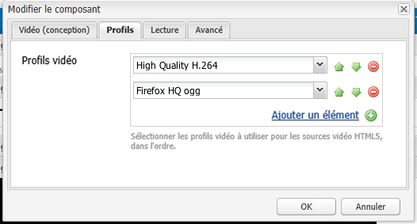

# Configuration du composant vidéo {#configure-the-video-component}

The [Video component](/help/sites-authoring/default-components-foundation.md#video) lets you place a predefined, out-of-the-box (OOTB) video asset on your page.

Pour un transcodage correct, un administrateur installe FFmpeg séparément. Voir [Installation de Fmpeg et configuration des AEM](#install-ffmpeg). Administrators also [Configure Video Profiles](#configure-video-profiles) for use with HTML5 elements.

## Configuration des profils vidéo {#configure-video-profiles}

Pour utiliser des éléments HTML5, définissez des profils vidéo. Les profils vidéo sélectionnés ici sont utilisés dans l’ordre. Pour y accéder, utilisez le [mode de conception](/help/sites-authoring/default-components-designmode.md) (interface utilisateur classique uniquement) et sélectionnez l’onglet **[!UICONTROL Profils]** :

From this dialog, you can also configure the design of the Video component and parameters for [!UICONTROL Playback], [!UICONTROL Flash], and [!UICONTROL Advanced].

## Installation de FFmpeg et configuration des AEM {#install-ffmpeg}

Le composant Vidéo repose sur le produit open source tiers FFmpeg pour le transcodage de vidéos. Téléchargé depuis [https://ffmpeg.org/](https://ffmpeg.org/). Après avoir installé FFmpeg, configurez AEM pour utiliser un codec audio spécifique et des options d’exécution spécifiques.

Pour installer FFmpeg sous **Windows**, procédez comme suit :

1. Téléchargez le fichier binaire compilé en tant que `ffmpeg.zip`.
1. Désarchiver dans un dossier.
1. Définissez la variable d’environnement système `PATH` sur &lt;*your-ffmpeg-location*>`\bin`.
1. Redémarrez AEM.

Pour installer FFmpeg sous **Mac OS X**, procédez comme suit :

1. Installez Xcode disponible à l’adresse [developer.apple.com/xcode](https://developer.apple.com/xcode/).
1. Installation disponible à [XQuartz](https://www.xquartz.org) pour obtenir [X11](https://support.apple.com/fr-fr/HT201341).
1. Installez MacPorts disponible à l’adresse [www.macports.org](https://www.macports.org/).
1. Dans la console, exécutez `sudo port install ffmpeg` la commande et suivez les instructions qui s’affichent à l’écran. Assurez-vous que le chemin d’accès de l’ `FFmpeg` exécutable est ajouté à la variable `PATH` système.

Pour installer FFmpeg sous **Mac OS X 10.6**, à l’aide de la version précompilée, procédez comme suit :

1. Téléchargez la version précompilée.
1. Désarchivez-la dans le `/usr/local` répertoire.
1. Dans la console, exécutez `sudo ln -s /usr/local/Cellar/ffmpeg/0.6/bin/ffmpeg /usr/bin/ffmpeg`. Modifiez les chemins selon vos besoins.

Pour **configurer AEM**, procédez comme suit :

>[!NOTE]
>
>Ces étapes ne sont nécessaires que si une personnalisation plus poussée des codecs est requise.

1. Open [!UICONTROL CRXDE Lite] in your web browser. Access [http://localhost:4502/crx/de](http://localhost:4502/crx/de).
2. Select the `/libs/settings/dam/video/format_aac/jcr:content` node and ensure that the node properties are as follows:

   * `audioCodec` est `aac`.
   * `customArgs` est `-flags +loop -me_method umh -g 250 -qcomp 0.6 -qmin 10 -qmax 51 -qdiff 4 -bf 16 -b_strategy 1 -i_qfactor 0.71 -cmp chroma -subq 8 -me_range 16 -coder 1 -sc_threshold 40 -b-pyramid normal -wpredp 2 -mixed-refs 1 -8x8dct 1 -fast-pskip 1 -keyint_min 25 -refs 4 -trellis 1 -direct-pred 3 -partitions i8x8,i4x4,p8x8,b8x8`.

3. To customize the configuration, create an overlay in `/apps/settings/` node and move the same structure under `/conf/global/settings/` node. It cannot be edited in `/libs` node. Par exemple, pour superposer un chemin `/libs/settings/dam/video/fullhd-bp`, créez-le à `/conf/global/settings/dam/video/fullhd-bp`.

   >[!NOTE]
   >
   >Remplacez et modifiez le profile-node entier et pas seulement la propriété ayant besoin d’être modifiée. Ces ressources ne sont pas résolues via SlingResourceMerger.

4. Si vous avez modifié des propriétés, cliquez sur **[!UICONTROL Tout enregistrer.]**

>[!NOTE]
>
>Les modifications apportées aux modèles de processus prêts à l’emploi par défaut ne sont pas conservées lorsque vous mettez à niveau votre instance AEM. Adobe vous recommande de copier les modèles de processus modifiés avant de les modifier. For example, copy the OOTB [!UICONTROL DAM Update Asset] model before editing the FFmpeg Transcoding step in the [!UICONTROL DAM Update Asset] model to pick video-profile names that existed before the upgrade. Then, you can overlay the `/apps` node to let AEM retrieve the custom changes to the OOTB model.
