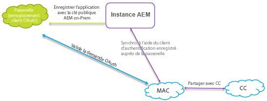
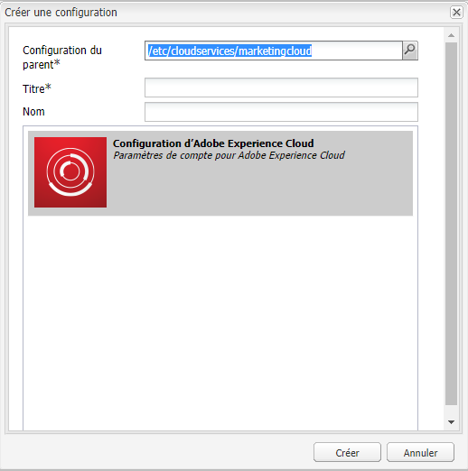
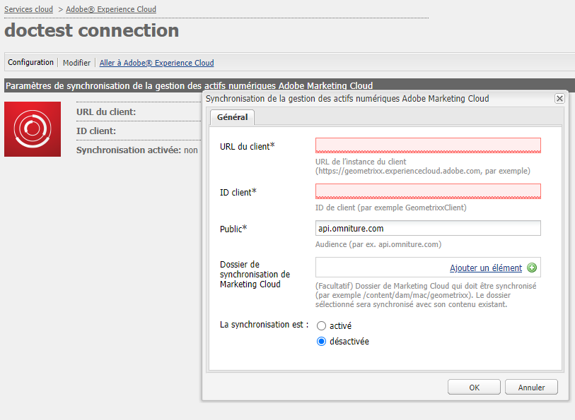
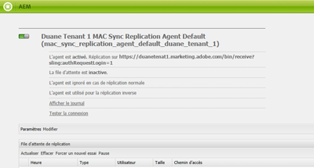

# Configuration de l’intégration AEM Assets avec l’Experience Cloud {#configure-aem-assets-integration-with-experience-cloud-and-creative-cloud}

Si vous êtes un client Adobe Experience Cloud, vous pouvez synchroniser vos ressources dans Adobe Experience Manager Assets avec Adobe Creative Cloud, et vice versa. Vous pouvez également synchroniser vos ressources avec Experience Cloud et vice versa. Vous pouvez configurer cette synchronisation via [!DNL Adobe I/O]. Le nom mis à jour de [!DNL Adobe Marketing Cloud] est [!DNL Adobe Experience Cloud].

Le workflow pour configurer cette intégration est le suivant :

1. Créez une authentification dans [!DNL Adobe I/O] à l&#39;aide d&#39;une passerelle publique et obtenez un ID de l&#39;application.
1. Créez un profil sur votre instance AEM Assets à l’aide du ID de l&#39;application.
1. Utilisez cette configuration pour synchroniser vos ressources.

En arrière-plan, le serveur authentifie votre profil avec la passerelle, puis synchronise les données entre AEM Assets et Marketing Cloud.

>[!NOTE]
>
>Cette fonctionnalité est obsolète en AEM Assets. Recherchez des remplacements dans [Meilleures pratiques d’intégration des Creative Cloud et des AEM](/help/assets/aem-cc-integration-best-practices.md). Si vous avez des requêtes, [contactez le service à la clientèle de l’Adobe](https://www.adobe.com/account/sign-in.supportportal.html).

<!-- Hiding this for now via cqdoc-16834.

>[!NOTE]
>
>Sharing assets between Adobe Experience Cloud and Adobe Creative Cloud requires administrator privileges on the AEM instance.
-->

## Création d’une application {#create-an-application}

1. Accédez à l&#39;interface de passerelle Adobe Developer en vous connectant à [https://legacy-oauth.cloud.adobe.io](https://legacy-oauth.cloud.adobe.io/).

   >[!NOTE]
   >
   >Vous devez disposer de droits d’administrateur pour créer un ID d’application.

1. Dans le volet de gauche, accédez à **[!UICONTROL Outils de développement]** > **[!UICONTROL Applications]** pour vue d&#39;une liste d&#39;applications.
1. Cliquez sur **[!UICONTROL Ajouter]**  pour créer une application.
1. Dans la liste **[!UICONTROL Informations d’identification du client]**, sélectionnez **[!UICONTROL Compte de service (déclaration JWT)]**, qui est un service de communication serveur à serveur pour l’authentification de serveur.

   

1. Spécifiez le nom de l’application et une description facultative.
1. Dans la liste **[!UICONTROL Organisation]**, sélectionnez l’organisation pour laquelle vous souhaitez synchroniser les ressources.
1. Dans la liste **[!UICONTROL Scope]**, sélectionnez **[!UICONTROL dam-read]**, **[!UICONTROL dam-sync]**, **[!UICONTROL dam-write]** et **[!UICONTROL cc-share]**.
1. Cliquez sur **[!UICONTROL Créer]**. Un message indique que l’application a été créée.

   

1. Copiez l’**[!UICONTROL ID d’application]** généré pour la nouvelle application.

   >[!CAUTION]
   >
   >Assurez-vous de ne pas copier par inadvertance le **[!UICONTROL secret d’application]** au lieu de l’**[!UICONTROL ID d’application.]**.

## Ajouter une nouvelle configuration à l&#39;Experience Cloud {#add-a-new-configuration}

1. Cliquez sur le logo AEM sur l’interface utilisateur de votre instance AEM Assets locale et accédez à **[!UICONTROL Outils]** > **[!UICONTROL Déploiement]** > **[!UICONTROL Services cloud hérités]**.

1. Recherchez le service **[!UICONTROL Adobe Experience Cloud]**. S’il n’existe aucune configuration, cliquez sur **[!UICONTROL Configurer maintenant]**. Si des configurations existent, cliquez sur **[!UICONTROL Afficher les configurations]** et sur `+` pour ajouter une nouvelle configuration.

   >[!NOTE]
   >
   >Utilisez un compte Adobe ID pourvu de droits d’administrateur pour l’organisation.

1. Dans la boîte de dialogue **[!UICONTROL Créer une configuration]**, indiquez un titre et un nom pour la nouvelle configuration et cliquez sur **[!UICONTROL Créer]**.

   

1. Dans le champ **[!UICONTROL URL du client]**, spécifiez l’URL d’AEM Assets. Dans le passé, si l’URL était définie comme `https://<tenant_id>.marketing.adobe.com`, remplacez-la par `https://<tenant_id>.experiencecloud.adobe.com`.

   1. Accédez à **Outils > Cloud Services > Ancienne version de Cloud Services**. Sous Adobe Experience Cloud, cliquez sur **Afficher les configurations**.
   1. Sélectionnez la configuration existante à modifier. Modifiez la configuration et remplacez `marketing.adobe.com` par `experiencecloud.adobe.com`.
   1. Enregistrez la configuration. Testez les agents de réplication de synchronisation MAC.

1. Dans le champ **[!UICONTROL ID client]**, collez le ID de l&#39;application que vous avez copié à la fin de la procédure [créez une application](#create-an-application).

   

1. Sous **[!UICONTROL Synchronisation]** sélectionnez **[!UICONTROL Activé]** pour activer la synchronisation et cliquez sur **[!UICONTROL OK]**. Si vous sélectionnez **disabled**, la synchronisation fonctionne dans une seule direction.

1. Sur la page de configuration, cliquez sur **[!UICONTROL Afficher la clé publique]** afin d’afficher la clé publique générée pour votre instance. Vous pouvez également cliquer sur **[!UICONTROL Télécharger la clé publique pour la passerelle OAuth]** pour télécharger le fichier contenant la clé publique. Ouvrez ensuite le fichier pour afficher la clé publique.

## Activation de la synchronisation {#enable-synchronization}

1. Affichez la clé publique en utilisant l&#39;une des méthodes suivantes mentionnées à la dernière étape de la procédure [ajouter une nouvelle configuration à Experience Cloud](#add-a-new-configuration). Cliquez sur **[!UICONTROL Afficher la clé publique]**.

1. Copiez la clé publique et collez-la dans le champ **[!UICONTROL Clé publique]** de l&#39;interface de configuration de l&#39;application que vous avez créée dans [créez une application](#create-an-application).

   

1. Cliquez sur **[!UICONTROL Mettre à jour]**. Synchronisez vos ressources avec l’instance AEM Assets maintenant.

## Test de la synchronisation {#test-the-synchronization}

1. Cliquez sur le logo de l&#39;AEM dans l&#39;interface utilisateur de votre instance AEM Assets locale et accédez à **[!UICONTROL Outils&lt;a1/&quot;**[!UICONTROL  Déploiement ]****[!UICONTROL Réplication]**pour localiser les profils de réplication créés pour la synchronisation.]**
1. Sur la page **[!UICONTROL Réplication]**, cliquez sur **[!UICONTROL Agents sur author]**.
1. Dans la liste des profils, cliquez sur le profil de réplication par défaut de votre organisation pour l’ouvrir.
1. Dans la boîte de dialogue, cliquez sur **[!UICONTROL Tester la connexion]**.

   

1. Une fois le test de réplication terminé, recherchez le message de réussite à la fin des résultats des tests.

## Ajouter les utilisateurs à l’Experience Cloud {#add-users-to-experience-cloud}

1. Connectez-vous à l’Experience Cloud à l’aide des informations d’identification de l’administrateur.
1. Dans les rails, accédez à **[!UICONTROL Administration]**, puis cliquez sur **[!UICONTROL Démarrer Enterprise Tableau de bord]**.
1. Sur le rail, cliquez sur **[!UICONTROL Utilisateurs]** pour ouvrir la page **[!UICONTROL Gestion des utilisateurs]**.
1. Dans la barre d’outils, cliquez sur **Ajouter** .
1. Ajoutez un ou plusieurs utilisateurs auxquels vous souhaitez offrir la possibilité de partager des ressources avec Creative Cloud.

<!-- TBD: Check.
   >[!NOTE]
   >
   >Only the users that you add to Experience Cloud can share assets from AEM Assets to Creative Cloud.

-->

## Actifs d’échange entre AEM Assets et l’Experience Cloud {#exchange-assets-between-aem-and-experience-cloud}

1. Connectez-vous à AEM Assets.
1. Dans la console Assets, créez un dossier et téléchargez des ressources vers ce dossier. Par exemple, créez un dossier **mc-demo** et téléchargez une ressource vers ce dossier.
1. Sélectionnez le dossier et cliquez sur **Partager** .
1. Dans le menu, sélectionnez **[!UICONTROL Adobe Experience Cloud]** et cliquez sur **[!UICONTROL Partager]**. Un message indique que le dossier est partagé avec l’Experience Cloud.

   >[!NOTE]
   >
   >Le partage d’un dossier Assets de type `sling:OrderedFolder` n’est pas pris en charge dans le cadre du partage dans Adobe Experience Cloud. Si vous souhaitez partager un dossier, lors de sa création dans AEM Assets, ne sélectionnez pas l’option **[!UICONTROL Ordre]**.

1. Actualisez l’interface utilisateur AEM Assets. Le dossier que vous avez créé dans la console Ressources de votre instance AEM Assets locale est copié dans l’interface utilisateur de l’Experience Cloud. La ressource que vous téléchargez dans le dossier en AEM Assets s’affiche dans la copie du dossier dans l’Experience Cloud après son traitement par le serveur AEM.
1. Vous pouvez également télécharger un fichier dans la copie répliquée du dossier dans l’Experience Cloud. Une fois qu’elle a été traitée, la ressource s’affiche dans le dossier partagé dans AEM Assets.

<!-- Removing as per PM guidance via https://jira.corp.adobe.com/browse/CQDOC-16834?focusedCommentId=22881523&page=com.atlassian.jira.plugin.system.issuetabpanels:comment-tabpanel#comment-22881523.

## Exchange assets between AEM Assets and Creative Cloud {#exchange-assets-between-aem-assets-and-creative-cloud}

>[!CAUTION]
>
>The AEM to Creative Cloud Folder Sharing feature is deprecated. Customers are strongly advised to use newer capabilities, like [Adobe Asset Link](https://helpx.adobe.com/enterprise/using/adobe-asset-link.html) or [AEM desktop app](https://helpx.adobe.com/experience-manager/desktop-app/aem-desktop-app.html). Learn more in [AEM and Creative Cloud Integration Best Practices](/help/assets/aem-cc-integration-best-practices.md).

AEM Assets lets you share folders containing assets with Adobe Creative Cloud users.

1. In the Assets console, select the folder to share with Creative Cloud.
1. From the toolbar, click **[!UICONTROL Share]** .
1. From the list, select the **[!UICONTROL Adobe Creative Cloud]** option.

   >[!NOTE]
   >
   >The options are available for users with read permissions on the root. Users must have the required permission to access the replication agent information of Marketing Cloud.

1. In the **[!UICONTROL Creative Cloud Sharing]** page, add the user to share the folder with and choose a role for the user. Click **[!UICONTROL Save]** and click **[!UICONTROL OK]**.

1. Log on to Creative Cloud with the credentials of the user you shared the folder with. The shared folder is available in Creative Cloud.

The AEM Assets-Marketing Cloud synchronization is designed in a way that the user machine instance from where the asset is uploaded retains the right to modify the asset. Only these changes are propagated to the other instance.

For example, if an asset is uploaded from an AEM Assets (on premises) instance, the changes to the asset from this instance are propagated to the Marketing Cloud instance. However, the changes done from the Marketing Cloud instance to the same asset aren’t propagated to the AEM instance and vice versa for asset uploaded from Marketing Cloud.
-->

>[!MORELIKETHIS]
>
>* [Meilleures pratiques d’intégration des ressources et des Creative Cloud](/help/assets/aem-cc-integration-best-practices.md)
>* [Ressources vers le dossier Creative Cloud, partage des meilleures pratiques](/help/assets/aem-cc-folder-sharing-best-practices.md)

