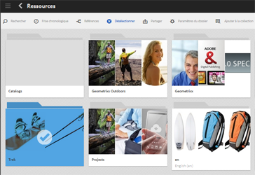
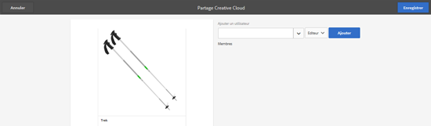

# Partage de dossiers avec Adobe Creative Cloud {#folder-sharing-with-adobe-creative-cloud}

>[!CAUTION]
>
>La fonction de partage de dossiers entre AEM et Creative Cloud est obsolète. Customers are strongly advised to use newer capabilities, like [Adobe Asset Link](https://helpx.adobe.com/fr/enterprise/using/adobe-asset-link.html) or [AEM desktop app](https://helpx.adobe.com/fr/experience-manager/desktop-app/aem-desktop-app.html). En savoir plus sur les [meilleures pratiques d’intégration d’AEM et de Creative Cloud](/help/assets/aem-cc-integration-best-practices.md).

AEM Assets permet de partager des dossiers de ressources avec les utilisateurs d’Adobe Creative Cloud. For details on how to configure Adobe Marketing Cloud to let you share assets with Adobe Creative Cloud, see [Configuring Assets-Creative Cloud integration](/help/sites-administering/configure-assets-cc-integration.md).

1. Dans la console Assets, sélectionnez un dossier à partager avec Creative Cloud.

   

1. Dans la barre d’outils, cliquez sur **Partager **.

   

1. From the list, select the **Adobe Creative Cloud** option.

   

1. In the **Creative Cloud Sharing** page, add the user to share the folder with and then click **Save**.

   

1. Cliquez sur **OK** pour fermer le message de confirmation.
1. Connectez-vous à Creative Cloud avec les informations d’identification de l’utilisateur avec lequel vous avez partagé le dossier. Le dossier partagé est disponible dans Creative Cloud.