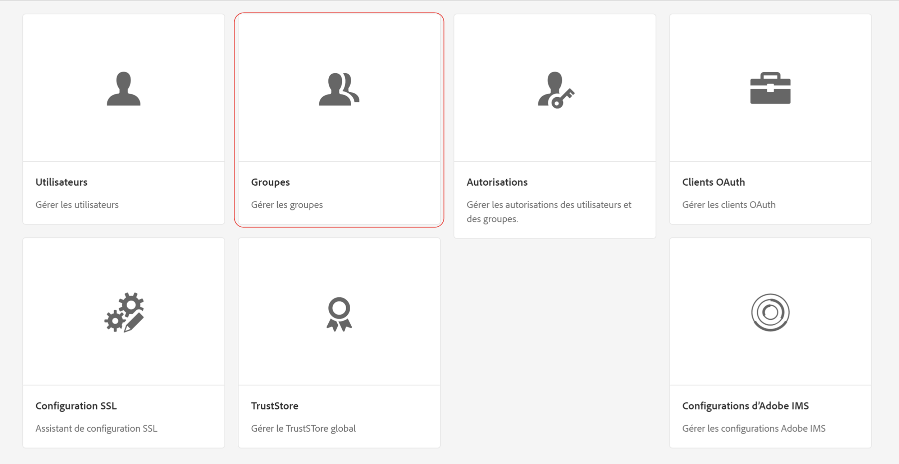
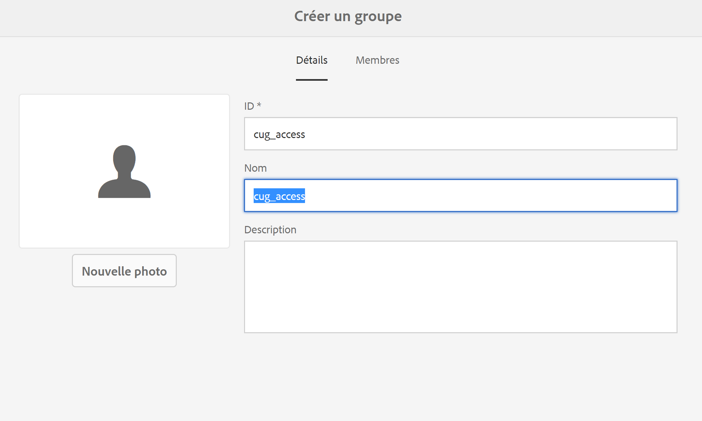
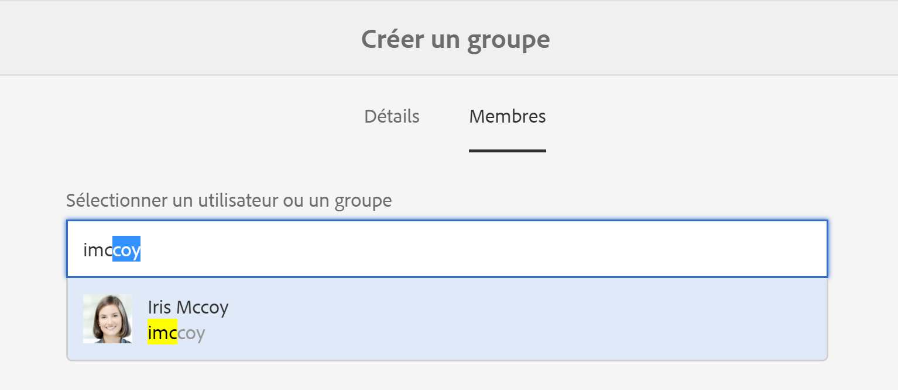
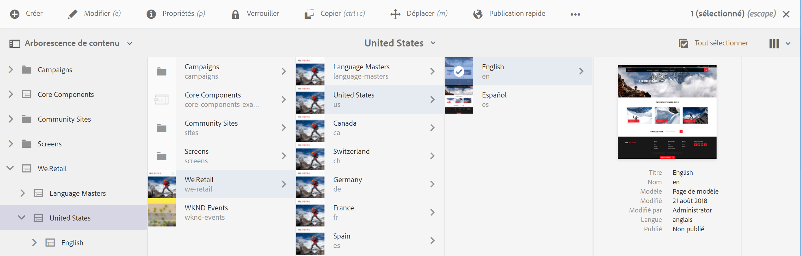
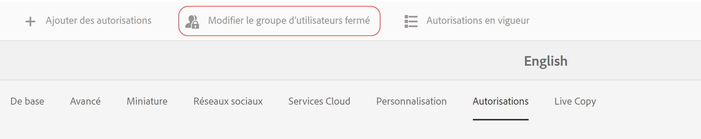

# Création d’un groupe d’utilisateurs fermé{#creating-a-closed-user-group}

Les groupes d’utilisateurs fermés permettent de restreindre l’accès à des pages spécifiques qui se trouvent sur un site Internet publié. Ces pages impliquent que les membres concernés se connectent et fournissent des informations d’identification de sécurité.

Pour configurer ce type de zone dans votre site web :

* [Créez un groupe d’utilisateurs fermé réel et affectez-y des membres.](#creating-the-user-group-to-be-used)

* [Appliquez ce groupe aux pages concernées](#applying-your-closed-user-group-to-content-pages) et sélectionnez (ou créez) la page de connexion à utiliser par les membres du groupe d’utilisateurs fermé. Cela est spécifié également lors de l’application d’un groupe d’utilisateur fermé à une page de contenu.

* [Créez un lien, quelle qu’en soit la forme, vers au moins une page dans la zone protégée](#linking-to-the-realm). Autrement, elle sera invisible.
* [Configurez Dispatcher](#configure-dispatcher-for-cugs) s’il est utilisé.

>[!CAUTION]
>
>Les groupes d’utilisateurs fermés doivent toujours être créés en pensant aux performances.
>
>Même si le nombre d’utilisateurs et de groupes dans un groupe d’utilisateurs fermé n’est pas limité, un nombre élevé de groupes d’utilisateurs fermés dans une page risque de ralentir les performances de rendu.
>
>L’impact des groupes d’utilisateurs fermés doit toujours être pris en compte lorsque vous effectuez des tests de performances.

## Création du groupe d’utilisateurs à utiliser {#creating-the-user-group-to-be-used}

Pour créer un groupe d’utilisateurs fermé :

1. Accédez à **Outils - Sécurité** depuis l’écran d’accueil d’AEM.

   >[!NOTE]
   >
   >Pour plus d’informations sur la création et la configuration des utilisateurs et des groupes, voir [Gestion des utilisateurs et des groupes](/help/sites-administering/security.md#managing-users-and-groups).

1. Sélectionnez la carte **Groupes** dans l’écran suivant.

   

1. Appuyez sur le bouton **Créer** dans le coin supérieur droit pour créer un groupe.
1. Nommez votre nouveau groupe ; par exemple, `cug_access`.

   

1. Accédez à l’onglet **Membres** et affectez les utilisateurs requis à ce groupe.

   

1. Activez les utilisateurs affectés à votre groupe d’utilisateurs fermé, en l’occurrence, le groupe `cug_access`.
1. Activez le groupe d’utilisateurs fermé de sorte qu’il soit disponible dans l’environnement de publication. Dans cet exemple, `cug_access`.

## Application de votre groupe d’utilisateurs fermé à des pages de contenu {#applying-your-closed-user-group-to-content-pages}

Pour appliquer le groupe d’utilisateurs fermé à une page :

1. Accédez à la page principale de la section restreinte que vous souhaitez affecter à votre groupe d’utilisateurs fermé.
1. Sélectionnez la page en cliquant sur sa miniature, puis sur **Propriétés** dans le panneau supérieur.

   

1. Dans la fenêtre suivante, accédez à l’onglet **Avancé**.
1. Faites défiler vers le bas et activez la case à cocher dans la section **Exigence d’authentification**.

1. Ajoutez votre chemin de configuration ci-dessous, puis appuyez sur Enregistrer.
1. Ensuite, accédez à l’onglet **Autorisations** et appuyez sur le bouton **Modifier le groupe d’utilisateurs fermé**.

   

   >[REMARQUE!]
   >
   > Notez que les groupes d’utilisateurs fermés dans l’onglet Autorisations ne peuvent pas être restaurés depuis les plans directeurs vers les Live Copies. Veuillez en tenir compte lors de la configuration de Live Copy.
   >
   > Pour plus d’informations, consultez [cette page](closed-user-groups.md#aem-livecopy).

1. Recherchez et ajoutez votre CUG dans la fenêtre suivante - dans ce cas, ajoutez le groupe nommé **cug_access**. Enfin, appuyez sur **Enregistrer**.
1. Cliquez sur **Activé** pour définir que cette page et les pages enfants appartiennent à un groupe d’utilisateurs fermé.
1. Spécifiez la **page de connexion** que les membres du groupe utiliseront ; par exemple :

   `/content/geometrixx/en/toolbar/login.html`

   Cette option est facultative, si rien n’est indiqué, la page de connexion standard sera utilisée.

1. Ajoutez les **groupes admis**. Utilisez « + » pour ajouter des groupes ou « – » pour en supprimer. Seuls les membres de ces groupes ont l’autorisation de se connecter et d’accéder aux pages.
1. Affectez un **domaine** (nom pour les groupes de pages), si nécessaire. Ne renseignez pas ce champ pour utiliser le titre de la page.
1. Cliquez sur **OK** pour enregistrer la spécification.

Pour plus d’informations sur les profils dans l’environnement de publication et pour proposer des formulaires de connexion et de déconnexion, voir [Gestion de l’identification](/help/sites-administering/identity-management.md).

## Liaison au domaine  {#linking-to-the-realm}

Dans la mesure où la cible des liens vers le domaine Groupe d’utilisateur fermé est invisible pour l’utilisateur anonyme, le vérificateur de lien supprime ces liens.

Pour éviter cette situation, il est recommandé de créer des pages de redirection non protégées, qui pointent vers des pages dans le domaine Groupe d’utilisateurs fermé. Les entrées de navigation sont alors rendues sans causer de problème au niveau du vérificateur de lien. L’utilisateur n’est redirigé à l’intérieur du domaine Groupe d’utilisateur fermé que lorsqu’il accède effectivement à la page de redirection, après avoir fourni des informations d’identification correctes.

## Configuration de Dispatcher pour le groupe d’utilisateurs fermé  {#configure-dispatcher-for-cugs}

Si vous utilisez Dispatcher, vous devez définir une ferme de serveurs Dispatcher avec les propriétés suivantes :

* [virtualhosts](https://helpx.adobe.com/experience-manager/dispatcher/using/dispatcher-configuration.html#identifying-virtual-hosts-virtualhosts) : correspond au chemin d’accès aux pages concernées par le groupe d’utilisateurs fermé.
* \sessionmanagement : voir ci-dessous.
* [cache](https://helpx.adobe.com/experience-manager/dispatcher/using/dispatcher-configuration.html#configuring-the-dispatcher-cache-cache) : répertoire de cache dédié aux fichiers concernés par le groupe d’utilisateurs fermé.

### Configuration de la gestion des sessions Dispatcher pour les groupes d’utilisateurs fermés  {#configuring-dispatcher-session-management-for-cugs}

Configurez la gestion de session [dans le fichier dispatcher.any](https://helpx.adobe.com/experience-manager/dispatcher/using/dispatcher-configuration.html#enabling-secure-sessions-sessionmanagement) pour le CUG. Le gestionnaire d&#39;authentification utilisé lorsque l&#39;accès est demandé pour les pages CUG détermine comment configurer la gestion des sessions.

```xml
/sessionmanagement
    ...
    /header "Cookie:login-token"
    ...
```

>[!NOTE]
>
>Lorsque la gestion des sessions est activée pour une ferme de serveurs de Dispatcher, toutes les pages gérées par la ferme de serveurs ne sont pas mises en cache. Pour mettre en cache les pages qui ne sont pas du CUG, créez une deuxième batterie dans dispatcher.any
>qui gère les pages non CUG.

1. Configurer [/sessionmanagement](https://helpx.adobe.com/experience-manager/dispatcher/using/dispatcher-configuration.html#enabling-secure-sessions-sessionmanagement) en définissant `/directory`; par exemple :

   ```xml
   /sessionmanagement
     {
     /directory "/usr/local/apache/.sessions"
     ...
     }
   ```

1. Définissez [/allowAuthorized](https://helpx.adobe.com/experience-manager/dispatcher/using/dispatcher-configuration.html#caching-when-authentication-is-used) sur `0`.

