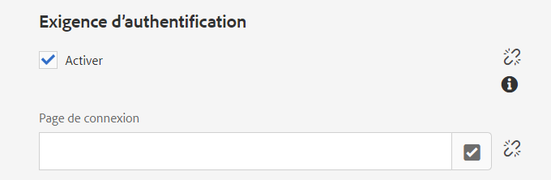
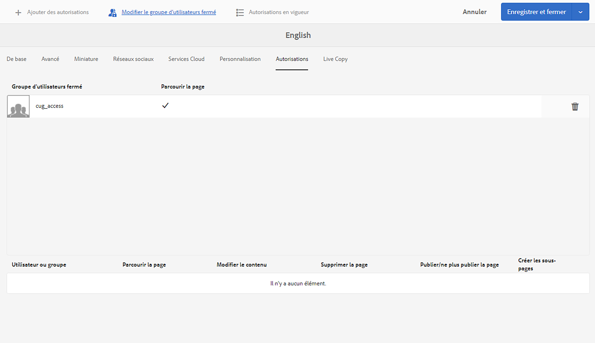

# Créer un groupe d’utilisateurs fermé{#creating-a-closed-user-group}

Les groupes d’utilisateurs fermés permettent de restreindre l’accès à des pages spécifiques qui se trouvent sur un site Internet publié. Ces pages requièrent que les membres affectés se connectent et fournissent des informations d’identification de sécurité.

Pour configurer une telle zone dans votre site web, procédez comme suit :

* [Créez un groupe d’utilisateurs fermé réel et affectez-y des membres.](#creating-the-user-group-to-be-used)

* [Appliquez ce groupe aux pages concernées](#applying-your-closed-user-group-to-content-pages) et sélectionnez (ou créez) la page de connexion à utiliser par les membres du groupe d’utilisateurs fermé. Cela est spécifié également lors de l’application d’un groupe d’utilisateur fermé à une page de contenu.

* [Créez un lien, d’une forme ou d’une autre, vers au moins une page dans la zone protégée](#linking-to-the-cug-pages), sinon il ne sera pas visible.

* [Configurez Dispatcher](#configure-dispatcher-for-cugs) si vous l’utilisez.

>[!CAUTION]
>
>Les groupes d’utilisateurs et d’utilisatrices fermés (CUG) doivent toujours être créés en tenant compte des performances.
>
>Bien que le nombre d’utilisateurs, d’utilisatrices et de groupes dans un CUG ne soit pas limité, un nombre élevé de CUG sur une page peut ralentir les performances de rendu.
>
>L’impact des CUG doit toujours être pris en compte lors des tests de performances.

## Création du groupe d’utilisateurs et d’utilisatrices à utiliser {#creating-the-user-group-to-be-used}

Pour créer un groupe d’utilsateurs et d’utilisatrices fermé :

1. Accédez à **Outils - Sécurité** depuis l’écran d’accueil d’AEM.

   >[!NOTE]
   >
   >Voir [Gestion des utilisateurs, des utilisatrices et des groupes](/help/sites-administering/security.md#managing-users-and-groups) pour obtenir des informations complètes sur la création et la configuration des utilisateurs, des utilisatrices et des groupes.

1. Sélectionnez la carte **Groupes** sur l’écran suivant.

   

1. Appuyez sur le bouton **Créer** dans le coin supérieur droit pour créer un groupe.
1. Nommez votre groupe, par exemple `cug_access`.

   

1. Accédez à l’onglet **Membres** et affectez les utilisateurs requis à ce groupe.

   

1. Activez les utilisateurs affectés à votre groupe d’utilisateurs fermé, en l’occurrence, le groupe `cug_access`.
1. Activez le groupe d’utilisateurs fermé de sorte qu’il soit disponible dans l’environnement de publication. Dans cet exemple, `cug_access`.

## Appliquer votre groupe d’utilisateurs fermé à des pages de contenu {#applying-your-closed-user-group-to-content-pages}

Pour appliquer le groupe d’utilisateurs fermé à une ou plusieurs pages, procédez comme suit :

1. Accédez à la page principale de la section restreinte que vous souhaitez affecter à votre groupe d’utilisateurs fermé.
1. Sélectionnez la page en cliquant sur sa miniature, puis sur **Propriétés** dans la barre d’outils supérieure.

   

1. Dans la fenêtre suivante, ouvrez l’onglet **Avancé**.

1. Faites défiler l’écran vers le bas, jusqu’à la section **Exigence d’authentification**.

   1. Cochez la case **Activer**.

   1. Ajoutez le chemin d’accès à votre **Page de connexion**.
Cette option est facultative. Si rien n’est indiqué, la page de connexion standard sera utilisée.

   

1. Accédez ensuite à l’onglet **Autorisations** et sélectionnez **Modifier le groupe d’utilisateurs fermé**.

   

   >[!NOTE]
   >
   >Les groupes d’utilisateurs fermés dans l’onglet Autorisations ne peuvent pas être déployés dans des Live Copies à partir de plans directeurs. Tenez-en compte lors de la configuration de la Live Copy.
   >
   >Pour plus d’informations, consultez [cette page](closed-user-groups.md#aem-livecopy).

1. La boîte de dialogue **Modifier le groupe d’utilisateurs et d’utilisatrices fermé** s’ouvre. Elle vous permet de rechercher et sélectionner votre groupe d’utilisateurs fermé, puis de confirmer la sélection avec **Enregistrer**.

   Le groupe est alors ajouté à la liste. Par exemple, le groupe **cug_access**.

   

1. Confirmez les modifications avec **Enregistrer et fermer**.

>[!NOTE]
>
>Pour plus d’informations sur les profils dans l’environnement de publication et pour proposer des formulaires de connexion et de déconnexion, voir [Gestion de l’identification](/help/sites-administering/identity-management.md).

## Liaison aux pages de groupe d’utilisateurs fermé {#linking-to-the-cug-pages}

Dans la mesure où la cible des liens vers les pages de groupe d’utilisateurs fermé est invisible pour l’utilisateur ou l’utilisatrice anonyme, le vérificateur de lien supprime ces liens.

Pour éviter cette situation, il est recommandé de créer des pages de redirection non protégées, qui pointent vers des pages dans la zone du groupe d’utilisateurs fermé. Les entrées de navigation sont alors rendues sans causer de problème au niveau du vérificateur de lien. L’utilisateur ou l’utilisatrice n’est redirigé(e) à l’intérieur de la zone du groupe d’utilisateurs fermé que lorsqu’il ou elle accède effectivement à la page de redirection, après avoir fourni des informations d’identification correctes.

## Configuration de Dispatcher pour les CUG {#configure-dispatcher-for-cugs}

Si vous utilisez Dispatcher, vous devez définir une batterie de Dispatcher avec les propriétés suivantes :

* [virtualhosts](https://experienceleague.adobe.com/docs/experience-manager-dispatcher/using/configuring/dispatcher-configuration.html?lang=fr#identifying-virtual-hosts-virtualhosts) : correspond au chemin d’accès aux pages auxquelles le CUG s’applique.
* \sessionmanagement : voir ci-dessous.
* [cache](https://experienceleague.adobe.com/docs/experience-manager-dispatcher/using/configuring/dispatcher-configuration.html#configuring-the-dispatcher-cache-cache) : répertoire de cache dédié aux fichiers auxquels le CUG s’applique.

### Configuration de la gestion des sessions Dispatcher pour les CUG {#configuring-dispatcher-session-management-for-cugs}

Configurez la [gestion des sessions dans le fichier dispatcher.any](https://experienceleague.adobe.com/docs/experience-manager-dispatcher/using/configuring/dispatcher-configuration.html#enabling-secure-sessions-sessionmanagement) pour le groupe d’utilisateurs fermé. Le gestionnaire d’authentification utilisé lorsque l’accès est demandé pour les pages des groupes d’utilisateurs fermés détermine comment configurer la gestion des sessions.

```xml
/sessionmanagement
    ...
    /header "Cookie:login-token"
    ...
```

>[!NOTE]
>
>Lorsque la gestion des sessions est activée pour une ferme de serveurs de Dispatcher, toutes les pages gérées par la ferme de serveurs ne sont pas mises en cache. Pour mettre en cache les pages qui ne sont pas des groupes d’utilisateurs fermés, créez une seconde ferme de serveurs dans dispatcher.any.
>qui gère les pages non CUG.

1. Configurez [/sessionmanagement](https://experienceleague.adobe.com/docs/experience-manager-dispatcher/using/configuring/dispatcher-configuration.html#enabling-secure-sessions-sessionmanagement) en définissant `/directory`, par exemple :

   ```xml
   /sessionmanagement
     {
     /directory "/usr/local/apache/.sessions"
     ...
     }
   ```

1. Définissez [/allowAuthorized](https://experienceleague.adobe.com/docs/experience-manager-dispatcher/using/configuring/dispatcher-configuration.html?lang=fr#caching-when-authentication-is-used) sur `0`.
