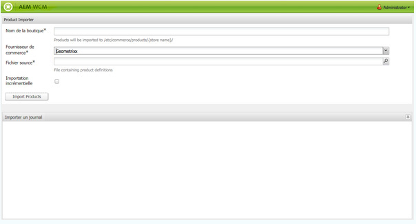
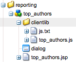

# Tableaux de bord{#dashboards}

Lorsque vous utilisez AEM, vous avez la possibilité de gérer du contenu de nombreux types différents (pages, éléments, etc.). Les tableaux de bord AEM vous permettent de définir facilement et de manière personnalisée des pages affichant des données consolidées.

>[!NOTE]
>
>Ces tableaux de bord sont créés pour chaque utilisateur en particulier. Par conséquent, un utilisateur ne peut accéder qu’à son propre tableau de bord.
>
>Cependant, les [modèles de tableau de bord](#creating-a-dashboard-template) peuvent être utilisés pour créer une disposition et une configuration commune à tous les de tableaux de bord.



## Administration des tableaux de bord {#administering-dashboards}

### Création d’un tableau de bord {#creating-a-dashboard}

Pour créer un tableau de bord, procédez comme suit :

1. Dans la section **Outils**, cliquez sur **Console de configuration**.
1. Dans l’arborescence, double-cliquez sur **Tableau de bord**.
1. Cliquez sur **Nouveau tableau de bord**.
1. Entrez le **Titre** (Mon tableau de bord, par exemple) et le **Nom**.
1. Cliquez sur **Créer**.

### Clonage d’un tableau de bord {#cloning-a-dashboard}

Vous pouvez, si vous le souhaitez, disposer de plusieurs tableaux de bord afin de consulter rapidement des informations sur votre contenu depuis différentes vues. Pour faciliter la création d’un tableau de bord, AEM propose une fonctionnalité de clonage que vous pouvez utiliser pour dupliquer un tableau de bord existant. Pour cloner un tableau de bord, procédez comme suit :

1. Dans la section **Outils**, cliquez sur **Console de configuration**.

1. Dans l’arborescence, double-cliquez sur **Tableau de bord**.
1. Cliquez sur le tableau de bord que vous souhaitez cloner.

1. Cliquez sur **Cloner**.

1. Entrez le **Nom** de votre nouveau tableau de bord.

### Suppression d’un tableau de bord  {#removing-a-dashboard}

1. Dans la section **Outils**, cliquez sur **Console de configuration**.

1. Dans l’arborescence, double-cliquez sur **Tableau de bord**.
1. Cliquez sur le tableau de bord que vous souhaitez supprimer.

1. Cliquez sur **Supprimer**.

1. Cliquez sur **Oui** pour confirmer.

## Composants du tableau de bord  {#dashboard-components}

### Présentation {#overview}

Les composants de tableau de bord ne sont rien de plus que des [composants AEM](/help/sites-developing/developing-components-samples.md) standard. Cette section décrit les composants de génération de rapports fournis avec AEM.

### Composants de génération de rapports sur les analyses Web  {#web-analytics-reporting-components}

AEM est fourni avec un ensemble de composants qui effectuent le rendu de plusieurs mesures de vos données [SiteCatalyst](/help/sites-administering/adobeanalytics.md). Ces composants sont répertoriés dans le Sidekick, sous la section **Tableau de bord**.

Chacun de ces composants comprend au moins trois onglets :

* **De base** : contient la configuration principale.

* **Rapport** : contient la configuration propre à chaque rapport.
* **Style** : contient la configuration du style, telle que la taille du graphique et la marge.

Les composants de génération de rapports sont initialisés avec une configuration par défaut qui vous aide à configurer rapidement votre tableau de bord.

#### Configuration de base {#basic-configuration}

L’onglet **De base** vous donne accès aux entrées de configuration suivantes :

**** TitreTitre affiché sur le tableau de bord.

**Type** de demandeMode de demande des données.

**Configuration du SiteCatalyst (facultative)** Configuration que vous souhaitez utiliser pour vous connecter au SiteCatalyst. En l’absence de configuration, on suppose qu’elle est configurée sur la page Tableau de bord (via les propriétés de page).

**Identifiant de Report Suite (facultatif)** Suite de rapports de SiteCatalyst que vous souhaitez utiliser pour générer le graphique.

#### Configuration du rapport {#report-configuration}

Pour pouvoir afficher des statistiques web, vous devez définir la plage de dates des données à récupérer. L’onglet **Rapport** met à votre disposition deux champs pour définir cette plage.

>[!NOTE]
>
>La définition d’une plage de dates étendue a pour effet de diminuer la réactivité du tableau de bord.

**Date** FromAbsolute ou date relative à partir de laquelle les données sont extraites.

**Date** àDate absolue ou relative à laquelle les données sont extraites.

Chaque composant définit également des paramètres spécifiques.

#### Rapport d’heures supplémentaires  {#overtime-report}


**Date** GranularitéUnité d&#39;heure de l&#39;axe X (par exemple, jour, heure).

**** Mesuresliste des événements à afficher.

**** Elémentsliste des éléments qui ventilent les données des mesures dans le graphique.

#### Rapport de liste avec classement {#ranked-list-report}


**** ElémentsÉlément qui ventile les données de mesures dans le graphique.

**** Mesuresévénement à afficher.

**Non. des principaux éléments** Nombre d’éléments affichés par le rapport.

#### Rapport avec classement {#ranked-report}


**** Mesuresévénement à afficher.

**** ElémentsÉlément qui ventile les données de mesures dans le graphique.

#### Rapport de section du site supérieur {#top-site-section-report}

Ce composant affiche un graphique qui présente la section la plus visitée d’un site web en fonction de la configuration suivante.


**Non. des principaux éléments** Nombre de sections affichées par dans le rapport.

#### Rapport de tendances {#trended-report}


**Date** GranularitéUnité d&#39;heure de l&#39;axe X (par exemple, jour, heure).

**** Mesuresévénement à afficher.

**** ElémentsÉlément qui ventile les données de mesures dans le graphique.

## Extension du tableau de bord {#extending-dashboard}

### Présentation {#overview-1}

Les tableaux de bord sont des pages normales (`cq:Page`). N’importe quel composant peut donc être utilisé pour les assembler.

Il existe un groupe de composants par défaut `Dashboard` contenant les composants du rapports d&#39;analyse qui sont activés par défaut sur le modèle.

### Création d’un modèle de tableau de bord {#creating-a-dashboard-template}

Un modèle définit le contenu par défaut d’un nouveau tableau de bord. Vous pouvez utiliser plusieurs modèles pour créer différents types de tableaux de bord.

Les modèles de tableau de bord sont créés comme les autres modèles de page, sauf qu&#39;ils sont stockés sous `/libs/cq/dashboards/templates/`. Voir la section [Création d’un modèle Contentpage](/help/sites-developing/website.md#creating-the-contentpage-template).

>[!NOTE]
>
>Les modèles de tableau de bord sont partagés entre les utilisateurs.

### Développement d’un composant Tableau de bord  {#developing-a-dashboard-component}

Le développement d’un composant Tableau de bord consiste à créer un composant AEM ordinaire. Cette section illustre un composant qui affiche les 10 principaux contributeurs.



Les principaux composants d’auteur sont stockés dans le référentiel à `/apps/geometrixx-outdoors/components/reporting` et se composent de :

1. Un fichier `jsp` qui lit les données jcr et définit le pseudo-élément `html`.

1. Une bibliothèque côté client contenant un fichier `js` qui récupère et classe les données, puis remplit le pseudo-élément `html`.


Le fichier JavaScript suivant est défini dans la bibliothèque cliente`geout.reporting.topauthors` [](/help/sites-developing/clientlibs.md) en tant qu’enfant du composant lui-même.

Le composant [QueryBuilder](/help/sites-developing/querybuilder-api.md) est utilisé pour interroger le référentiel afin de lire les nœuds `cq:AuditEvent`. Le résultat de la requête est un objet JSON duquel sont extraites les contributions de l’auteur.

#### top_authors.js {#top-authors-js}

```
$.ajax({
  url: "/bin/querybuilder.json",
  cache: false,
  data: {
       "orderby": "cq:time",
       "orderby.sort": "desc",
       "p.hits": "full",
       "p.limit": 100,
       "path": "/var/audit/com.day.cq.wcm.core.page/",
       "type": "cq:AuditEvent"
   },
  dataType: "json"
}).done(function( res ) {
    var authors = {};
    // from JSON to Object
    for(var r in res.hits) {
        var userId = res.hits[r].userId;
        if(userId == undefined) {
            continue;
        }
        var auth = authors[userId] || {userId : userId};
        auth.contrib = (auth.contrib || 0) +1;

        authors[userId] = auth;
    }

    // order by contribution
    var orderedByContrib = [];
    for(var a in authors) {
        orderedByContrib.push(authors[a]);
    }
    orderedByContrib.sort(function(a,b){return b.contrib - a.contrib});

    // produce the list
    for (var i=0, tot=orderedByContrib.length; i < tot; i++) {
        var current = orderedByContrib[i];
        $("<div> #" + (i + 1) +" "+ current.userId + " (" + current.contrib +" contrib.)</div>").appendTo("#authors-list");

    }
});
```

Le `JSP` comprend à la fois `global.jsp` et `clientlib`.

#### top_authors.jsp {#top-authors-jsp}

```java
<%@page session="false" contentType="text/html; charset=utf-8" %><%
%><%
%><%@include file="/libs/foundation/global.jsp" %><%
%>
<ui:includeClientLib categories="geout.reporting.topauthors" />
<%
String reportletTitle = properties.get("title", "Top Authors");
%>
<html>
     <h3><%=xssAPI.encodeForHTML(reportletTitle) %></h3>
     <div id="authors-list"></div>
</html>
```

