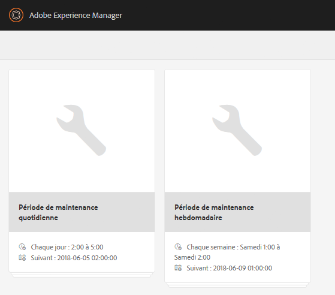
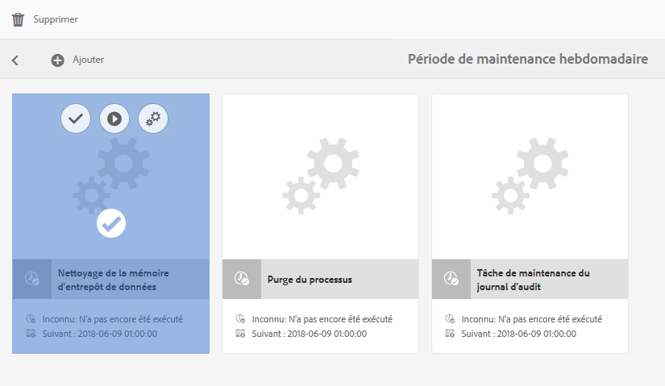
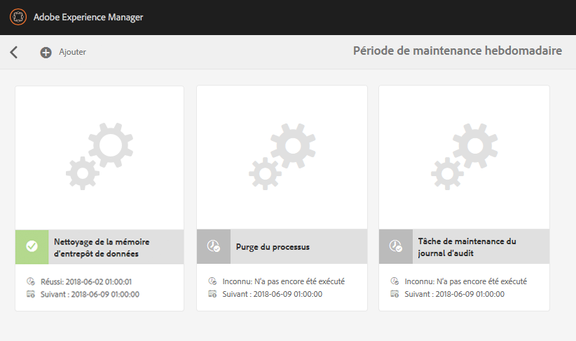

# Nettoyage de la mémoire d’entrepôt de données {#data-store-garbage-collection}

Lorsqu’une ressource WCM conventionnelle est supprimée, la référence à l’enregistrement d’entrepôt de données sous-jacent peut être supprimée de la hiérarchie de nœud, mais l’enregistrement d’entrepôt de données lui-même est conservé. Cet enregistrement d’entrepôt de données non référencé est alors considéré comme faisant partie des « données à nettoyer » qu’il n’est pas utile de conserver. Dans les instances où plusieurs ressources de nettoyage existent, il est préférable de vous en débarrasser pour préserver l’espace et pour optimiser les performances de sauvegarde et de la maintenance du système de fichiers.

Le plus souvent, une application WCM tend à collecter des informations, mais à ne pas les supprimer aussi souvent. Bien que de nouvelles images soient ajoutées qui remplacent même les anciennes versions, le système de contrôle de version conserve encore l’ancienne version et prend sa restauration en charge si nécessaire. Ainsi, la majorité du contenu que nous pensons ajouter au système est définitivement stocké. Quelle est donc la source type des « données à nettoyer » dans le référentiel ?

AEM utilise le référentiel pour stocker plusieurs activités internes et de maintenance :

* Modules générés et transférés
* Fichiers temporaires créés pour la réplication de publication
* Charges utiles de workflow
* Ressources créées temporairement lors du rendu DAM

Lorsque l’un de ces objets temporaires est assez volumineux pour devoir être stocké dans l’entrepôt de données et lorsque cet objet n’est plus utilisé, l’enregistrement d’entrepôt de données lui-même demeure en tant que « données à nettoyer ». Dans une application de création/publication WCM standard, le processus d’activation de publication constitue généralement la plus grande source de données à nettoyer de ce type. Lorsque des données sont répliquées dans le module Publier, elles sont d’abord rassemblées dans des collections dans un format de données efficace appelé &quot;Durbo&quot; et stockées dans le référentiel sous `/var/replication/data`. Les lots de données dépassent souvent en taille le seuil de taille critique de l’entrepôt de données et finissent donc par être stockés comme des enregistrements d’entrepôts de données. Une fois la réplication terminée, le noeud de `/var/replication/data` est supprimé, mais l&#39;enregistrement de la banque de données reste vide.

Les modules constituent une autre source de données à nettoyer récupérables. Les données de module, comme tout le reste, sont stockées dans le référentiel et, donc, pour les modules dont la taille dépasse 4 Ko, dans l’entrepôt de données. Au cours d’un projet de développement ou au fil du temps dans le cadre de la maintenance d’un système, les modules peuvent être créés et recréés de nombreuses fois, chaque nouvelle version résultant en un nouvel enregistrement d’entrepôt de données, l’enregistrement de la version précédente devenant alors orphelin.

## Comment fonctionne le nettoyage de la mémoire d’entrepôt de données ?  {#how-does-data-store-garbage-collection-work}

Si le référentiel a été configuré avec un entrepôt de données externe, le [nettoyage de la mémoire d’entrepôt de données est exécuté automatiquement](/help/sites-administering/data-store-garbage-collection.md#automating-data-store-garbage-collection) dans le cadre de la période de maintenance hebdomadaire. L&#39;administrateur système peut également [exécuter manuellement la collecte des déchets de stockage de données](#running-data-store-garbage-collection) en fonction des besoins. En général, il est recommandé d’effectuer le nettoyage de la mémoire d’entrepôt de données régulièrement, et de prendre en compte les facteurs suivants dans la planification du nettoyage :

* Le nettoyage de la mémoire d’entrepôt de données prend du temps et peut avoir une incidence sur les performances. Il doit donc être planifié en conséquence.
* La suppression des enregistrements du nettoyage de la mémoire d’entrepôt de données n’affecte pas les performances normales et ne relève donc pas d’une optimisation des performances.
* Si l’utilisation du stockage et des facteurs liés tels que les heures de sauvegarde ne pose pas de problème, le nettoyage de la mémoire d’entrepôt de données peut être différé en toute sécurité.

Le nettoyeur de la mémoire d’entrepôt de données prend d’abord note de l’horodatage actuel lorsque le processus commence. Le nettoyage est alors exécuté à l’aide d’un algorithme de marquage/balayage à plusieurs passages.

Lors de la première phase, le nettoyeur de la mémoire d’entrepôt de données traverse entièrement le contenu du référentiel. Pour chaque objet de contenu qui contient une référence à un enregistrement d’entrepôt de données, il localise le fichier dans le système de fichiers, exécutant une mise à jour de métadonnées (en modifiant l’attribut « dernière modification » ou MTIME). À ce stade, les fichiers consultés par cette phase deviennent plus récents que l’horodatage de base initial.

Lors de la seconde phase, le nettoyeur de la mémoire d’entrepôt de données traverse la structure de répertoires physique d’un entrepôt de données à peu près comme une opération de recherche. Il examine l’attribut « dernière modification » ou MTIME du fichier et détermine ce qui suit :

* Si l’attribut MTIME est plus récent que l’horodatage de base initial, le fichier a été trouvé lors de la première phase ou il s’agit d’un fichier entièrement nouveau qui a été ajouté au référentiel pendant l’exécution du processus de nettoyage. Dans l’un ou l’autre de ces cas de figure, l’enregistrement est considéré comme actif et le fichier ne sera pas supprimé.
* Si l’attribut MTIME est antérieur à l’horodatage de base initial, le fichier n’est pas un fichier activement référencé et est considéré comme données à nettoyer pouvant être supprimées.

Cette approche fonctionne bien pour un nœud unique avec un entrepôt de données privé. Toutefois, l’entrepôt de données peut être partagé, et si c’est le cas, les références en direct potentiellement actives aux enregistrements d’entrepôt de données d’autres référentiels ne sont pas vérifiées, et les fichiers référencés actifs peuvent être supprimés par erreur. Il est impératif que l’administrateur système comprenne la nature partagée de l’entrepôt de données avant de planifier un nettoyage et utilise uniquement le processus de nettoyage de la mémoire d’entrepôt de données intégré simple lorsque l’entrepôt de données n’est pas partagé.

>[!NOTE]
>
>Lorsque le nettoyage de la mémoire est effectué dans une configuration d’entrepôt de données partagé ou en cluster (avec Mongo ou Segment Tar), le journal peut contenir des avertissements sur l’impossibilité de supprimer certains ID de blob. Cela se produit car les ID d’objet blob supprimés dans une précédente collecte de déchets sont de nouveau référencés de manière incorrecte par d’autres noeuds de la grappe ou partagés qui ne disposent pas d’informations sur les suppressions d’ID. Lorsque le nettoyage est effectué, un avertissement est donc enregistré dans le journal après une tentative de suppression d’un ID qui avait déjà été supprimé lors du précédent nettoyage. Ce comportement n’affecte pas les performances ou les fonctionnalités.

## Exécution du nettoyage de la mémoire d’entrepôt de données {#running-data-store-garbage-collection}

Il existe trois manières d’effectuer le nettoyage de la mémoire d’entrepôt de données, en fonction de la configuration d’entrepôt de données sur laquelle AEM s’exécute :

1. Via [Revision Cleanup](/help/sites-deploying/revision-cleanup.md) - mécanisme de collecte des déchets habituellement utilisé pour le nettoyage de la banque de noeuds.

1. Via le [nettoyage de la mémoire d’entrepôt de données](/help/sites-administering/data-store-garbage-collection.md#running-data-store-garbage-collection-via-the-operations-dashboard) : un mécanisme de nettoyage de la mémoire spécifique pour les entrepôts de données externes, disponible sur le tableau de bord des opérations.
1. Via la [console JMX](/help/sites-administering/jmx-console.md).

Si TarMK est utilisé comme entrepôt de nœuds et entrepôt de données, le nettoyage de révision peut être utilisé pour le nettoyage de la mémoire de l’entrepôt de nœuds et l’entrepôt de données. Cependant, si un entrepôt de données externe est configuré comme entrepôt de données de système de fichiers, le nettoyage de la mémoire d’entrepôt de données doit être explicitement déclenché séparément du nettoyage de révision. Le nettoyage de la mémoire d’entrepôt de données peut être déclenché par le biais du tableau de bord des opérations ou de la console JMX.

Le tableau ci-dessous indique le type de nettoyage de la mémoire d’entrepôt de données qui doit être utilisé pour tous les déploiements d’entrepôts de données pris en charge dans AEM 6 :

<table>
 <tbody>
  <tr>
   <td><strong>Magasin de nœuds</strong><br /> </td>
   <td><strong>Entrepôt de données</strong></td>
   <td><strong>Mécanisme de collecte de déchets</strong><br /> </td>
  </tr>
  <tr>
   <td>TarMK</td>
   <td>TarMK</td>
   <td>Nettoyage de la révision (les fichiers binaires sont intégrés au magasin de segments)</td>
  </tr>
  <tr>
   <td>TarMK</td>
   <td>Système de fichiers externe</td>
   <td><p>Tâche de collecte des déchets de la banque de données via le Tableau de bord d’exploitation</p> <p>Console JMX</p> </td>
  </tr>
  <tr>
   <td>MongoDB</td>
   <td>MongoDB</td>
   <td><p>Tâche de collecte des déchets de la banque de données via le Tableau de bord d’exploitation</p> <p>Console JMX</p> </td>
  </tr>
  <tr>
   <td>MongoDB</td>
   <td>Système de fichiers externe</td>
   <td><p>Tâche de collecte des déchets de la banque de données via le Tableau de bord d’exploitation</p> <p>Console JMX</p> </td>
  </tr>
 </tbody>
</table>

### Exécution du nettoyage de la mémoire d’entrepôt de données via le tableau de bord des opérations {#running-data-store-garbage-collection-via-the-operations-dashboard}

La période de maintenance hebdomadaire intégrée, disponible via le [tableau de bord des opérations](/help/sites-administering/operations-dashboard.md), contient une tâche intégrée pour déclencher le nettoyage de la mémoire d’entrepôt de données à 1 heure du matin le dimanche.

Si vous devez exécuter le nettoyage de la mémoire d’entrepôt de données en dehors de cet horaire, vous pouvez le déclencher manuellement par le biais du tableau de bord des opérations.

Avant d’exécuter le nettoyage de la mémoire d’entrepôt de données, vérifiez qu’aucune sauvegarde n’est en cours.

1. Ouvrez le tableau de bord des opérations via **Navigation** -> **Outils** -> **Opérations** -> **Maintenance**.
1. Cliquez ou appuyez sur **Période de maintenance hebdomadaire**.

   

1. Sélectionnez la tâche **Nettoyage de la mémoire d’entrepôt de données**, puis cliquez ou appuyez sur l’icône **Exécuter**.

   

1. Le nettoyage de la mémoire d’entrepôt de données s’exécute et son état s’affiche sur le tableau de bord.

   

>[!NOTE]
>
>La tâche de nettoyage de la mémoire d’entrepôt de données est uniquement visible si vous avez configuré un entrepôt de données basé sur les fichiers. Voir [Configuration des magasins de noeuds et des entrepôts de données dans AEM 6](/help/sites-deploying/data-store-config.md#file-data-store) pour plus d’informations sur la configuration d’un magasin de données de fichiers.

### Exécution du nettoyage de la mémoire d’entrepôt de données via la console JMX {#running-data-store-garbage-collection-via-the-jmx-console}

Cette section aborde le nettoyage de la mémoire d’entrepôt de données via la console JMX. Si votre installation est configurée sans entrepôt de données externe, ceci ne s’applique pas. Au lieu de cela, lisez les instructions sur l’exécution du nettoyage de révision dans [Maintenance du référentiel](/help/sites-deploying/storage-elements-in-aem-6.md#maintaining-the-repository).

>[!NOTE]
>
>Si vous exécutez TarMK avec un entrepôt de données externe, vous devez exécuter le nettoyage de révision d’abord pour que le nettoyage soit efficace.

Pour exécuter le nettoyage de la mémoire :

1. Dans la console de gestion OSGi Apache Felix, sélectionnez l’onglet **Principal**, puis **JMX** dans le menu suivant.
1. Ensuite, recherchez **Gestionnaire de référentiel** MBean et cliquez dessus (ou accédez à `https://<host>:<port>/system/console/jmx/org.apache.jackrabbit.oak%3Aname%3Drepository+manager%2Ctype%3DRepositoryManagement`).
1. Cliquez sur **startDataStoreGC(boolean markOnly)**.
1. saisissez &quot;`true`&quot; pour le paramètre `markOnly` si nécessaire :

   | **Option** | **Description** |
   |---|---|
   | booléen markOnly | Définissez cette variable sur true pour marquer uniquement les références et ne pas balayer l’opération de marquage et de balayage. Ce mode doit être utilisé lorsque le BlobStore sous-jacent est partagé entre plusieurs référentiels. Pour tous les autres cas, définissez ce paramètre sur faux pour effectuer le nettoyage complet de la mémoire. |

1. Cliquez sur **Appeler**. CRX effectue le nettoyage de la mémoire et indique quand celui-ci est terminé.

>[!NOTE]
>
>Le nettoyage de la mémoire d’entrepôt de données ne collecte pas les fichiers qui ont été supprimés au cours des dernières 24 heures.

>[!NOTE]
>
>La tâche de nettoyage de la mémoire d’entrepôt de données ne commence que si vous avez configuré un entrepôt de données basé sur les fichiers. Si aucune banque de données de fichier externe n&#39;a été configurée, la tâche renvoie le message `Cannot perform operation: no service of type BlobGCMBean found` après l&#39;appel. Voir [Configuration des magasins de noeuds et des entrepôts de données dans AEM 6](/help/sites-deploying/data-store-config.md#file-data-store) pour plus d’informations sur la configuration d’un magasin de données de fichiers.

## Automatisation du nettoyage de la mémoire d’entrepôt de données {#automating-data-store-garbage-collection}

Si possible, le nettoyage de la mémoire d’entrepôt de données doit être exécuté à un moment où la charge sur le système est réduite, le matin par exemple.

La période de maintenance hebdomadaire intégrée, disponible via le [tableau de bord des opérations](/help/sites-administering/operations-dashboard.md), contient une tâche intégrée pour déclencher le nettoyage de la mémoire d’entrepôt de données à 1 heure du matin le dimanche. Vous devez également vérifier qu’aucune sauvegarde n’est en cours à ce moment. Le début de la période de maintenance peut être personnalisé via le tableau de bord, en fonction des besoins.

>[!NOTE]
>
>La raison de ne pas l’exécuter simultanément est que les anciens fichiers de stockage de données (et inutilisés) sont également sauvegardés, de sorte que s’il est nécessaire de revenir à une ancienne révision, les fichiers binaires sont toujours présents dans la sauvegarde.

Si vous ne souhaitez pas exécuter la collecte des déchets de stockage de données avec la fenêtre de maintenance hebdomadaire du Tableau de bord des opérations, elle peut également être automatisée à l&#39;aide des clients HTTP wget ou curl. Voici un exemple d’automatisation de la sauvegarde à l’aide de curl :

>[!CAUTION]
>
>Dans les exemples de commande `curl` suivants, il se peut que divers paramètres doivent être configurés pour votre instance. Par exemple, le nom d’hôte (`localhost`), le port (`4502`) le mot de passe administrateur (`xyz`) et divers paramètres pour le nettoyage effectif de la mémoire d’entrepôt de données.

Voici un exemple de commande curl invoquant le nettoyage de la mémoire d’entrepôt de données via la ligne de commande :

```shell
curl -u admin:admin -X POST --data markOnly=true  https://localhost:4503/system/console/jmx/org.apache.jackrabbit.oak"%"3Aname"%"3Drepository+manager"%"2Ctype"%"3DRepositoryManagement/op/startDataStoreGC/boolean
```

La commande curl est immédiatement renvoyée.

## Vérification de la cohérence de l’entrepôt de données {#checking-data-store-consistency}

La vérification de la cohérence de l’entrepôt de données signale les fichiers binaires d’entrepôt de données manquants, mais encore référencés. Pour lancer une vérification de la cohérence, procédez comme suit :

1. Accédez à la console JMX. Pour plus d’informations sur l’utilisation de la console JMX, voir [cet article](/help/sites-administering/jmx-console.md#using-the-jmx-console).
1. Recherchez **BlobGarbageCollection** Mbean et cliquez dessus.
1. Cliquez sur le lien `checkConsistency()`.

Une fois la vérification de cohérence terminée, un message affiche le nombre de fichiers binaires signalés comme manquants. Si le nombre est supérieur à 0, consultez la section `error.log` pour plus de détails sur les binaires manquants.

Vous trouverez ci-dessous un exemple de la façon dont les fichiers binaires manquants sont répertoriés dans les journaux :

```xml
11:32:39.673 INFO [main] MarkSweepGarbageCollector.java:600 Consistency check found [1] missing blobs
```

```xml
11:32:39.673 WARN [main] MarkSweepGarbageCollector.java:602 Consistency check failure intheblob store : DataStore backed BlobStore [org.apache.jackrabbit.oak.plugins.blob.datastore.OakFileDataStore], check missing candidates in file /tmp/gcworkdir-1467352959243/gccand-1467352959243
```

