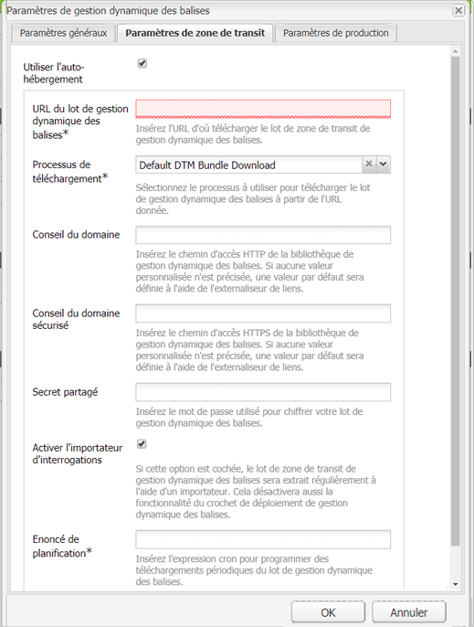
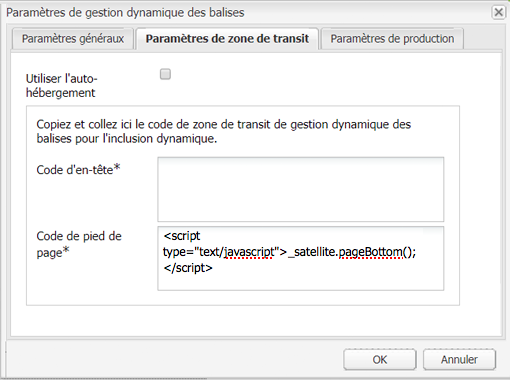
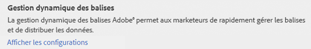
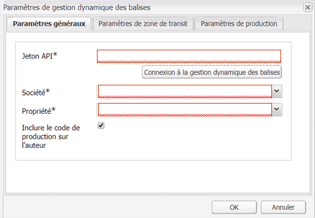
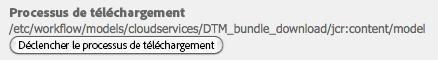
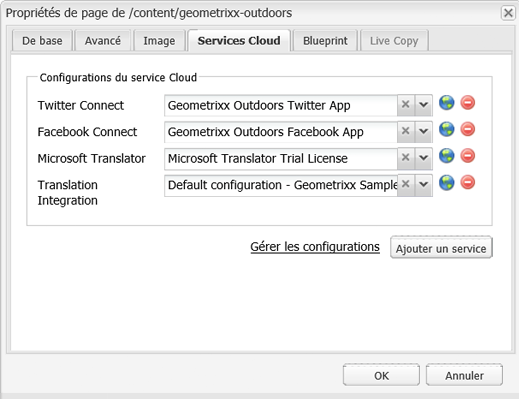
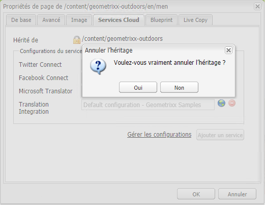

# Intégration à Adobe Dynamic Tag Management {#integrating-with-adobe-dynamic-tag-management}

Intégrez la [gestion dynamique des balises Adobe](https://www.adobe.com/solutions/digital-marketing/dynamic-tag-management.html) à AEM afin de pouvoir utiliser vos propriétés web de gestion dynamique des balises pour effectuer le suivi des sites AEM. La gestion dynamique des balises permet aux spécialistes du marketing de gérer les balises pour la collecte de données et de distribuer les données sur les systèmes de marketing numérique. Par exemple, utilisez la gestion dynamique des balises pour collecter des données d’utilisation pour votre site Web AEM et distribuer les données pour l’analyse dans Adobe Analytics ou Adobe Target.

Avant de procéder à l’intégration, vous devez créer la [propriété web](https://microsite.omniture.com/t2/help/en_US/dtm/#Web_Properties) de gestion dynamique des balises qui surveille le domaine de votre site AEM. The [hosting options](https://microsite.omniture.com/t2/help/en_US/dtm/#Hosting__Embed_Tab) of the web property must be configured so that you can configure AEM to access the Dynamic Tag Management libraries.

Une fois que vous avez configuré l’intégration, les modifications apportées aux outils et aux règles de déploiement de gestion dynamique des balises ne nécessitent pas de modifier la configuration de gestion dynamique des balises dans AEM. Les modifications sont automatiquement disponibles pour AEM.

>[!NOTE]
>
>Si vous utilisez la gestion dynamique des balises avec une configuration de proxy personnalisée, vous devez configurer les deux configurations de proxy client HTTP, car certaines fonctionnalités d’AEM utilisent des API 3.x et d’autres des API 4.x :
>
>* La version 3.x est configurée avec [http://localhost:4502/system/console/configMgr/com.day.commons.httpclient](http://localhost:4502/system/console/configMgr/com.day.commons.httpclient)
>* Les API 4.x sont configurées avec [http://localhost:4502/system/console/configMgr/org.apache.http.proxyconfigurator](http://localhost:4502/system/console/configMgr/org.apache.http.proxyconfigurator)

>

## Options de déploiement {#deployment-options}

Les options de déploiement suivantes affectent la configuration de l’intégration à la gestion dynamique des balises.

### Hébergement de la gestion dynamique des balises {#dynamic-tag-management-hosting}

AEM prend en charge la gestion dynamique des balises hébergée dans le cloud ou hébergée dans AEM.

* Hébergée dans le cloud : les bibliothèques JavaScript de gestion dynamique des balises sont stockées dans le cloud et vos pages AEM y font directement référence.
* Hébergée dans AEM : la gestion dynamique des balises génère des bibliothèques JavaScript. AEM utilise un modèle de workflow pour obtenir et installer les bibliothèques.

Le type d’hébergement utilisé par votre implémentation détermine certaines des tâches de configuration et d’implémentation que vous effectuez. Pour plus d’informations sur les options d’hébergement, voir la rubrique [Hébergement - Onglet Incorporer](https://microsite.omniture.com/t2/help/en_US/dtm/#Hosting__Embed_Tab) de l’aide de la gestion dynamique des balises.

### Bibliothèque intermédiaire et bibliothèque de production {#staging-and-production-library}

Décidez si votre instance de création AEM utilise du code intermédiaire ou de production pour la gestion dynamique des balises.

En général, votre instance de création utilise les bibliothèques intermédiaires de gestion dynamique des balises tandis que l’instance de production utilise les bibliothèques de production. Ce scénario vous permet d’utiliser l’instance de création pour tester les configurations non approuvées de gestion dynamique des balises.

Si vous le souhaitez, votre instance de création peut utiliser les bibliothèques de production. Des modules externes de navigateur Web permettent de basculer entre l’utilisation de bibliothèques d’évaluation à des fins de test lorsque les bibliothèques sont hébergées en mode cloud.

### Utilisation du crochet de déploiement de la gestion dynamique des balises {#using-the-dynamic-tag-management-deployment-hook}

Lorsqu’AEM héberge les bibliothèques de gestion dynamique des balises, vous pouvez utiliser le service de crochet de déploiement de gestion dynamique des balises pour pousser automatiquement les mises à jour de la bibliothèque vers AEM. Les mises à jour de la bibliothèque sont répercutées lorsque des modifications sont apportées aux bibliothèques, par exemple lorsque les propriétés de la propriété Web Gestion dynamique des balises sont modifiées.

Pour utiliser le crochet de déploiement, la gestion dynamique des balises doit pouvoir se connecter à l’instance AEM qui héberge les bibliothèques. You must [enable access to AEM](/help/sites-administering/dtm.md#enabling-access-for-the-deployment-hook-service) for the Dynamic Tag Management servers.

Dans certains cas, AEM peut être inaccessible (par exemple, lorsqu’il se trouve derrière un pare-feu). Dans ces cas, vous pouvez utiliser l’option d’importateur d’interrogations d’AEM pour récupérer régulièrement les bibliothèques. Une expression de tâche cron détermine la planification des téléchargements de bibliothèque.

## Autorisation de l’accès pour le service de crochet de déploiement {#enabling-access-for-the-deployment-hook-service}

Autorisez le service de crochet de déploiement de gestion dynamique des balises à accéder à AEM afin qu’il puisse mettre à jour les bibliothèques hébergées dans AEM. Spécifiez l’adresse IP des serveurs de gestion dynamique des balises qui mettent à jour les bibliothèques d’évaluation et de production selon les besoins :

* Intermédiaire: `107.21.99.31`
* Production: `23.23.225.112` and `204.236.240.48`

Exécutez la configuration à l’aide de la [console Web](/help/sites-deploying/configuring-osgi.md#osgi-configuration-with-the-web-console) ou d’un nœud [`sling:OsgiConfig`](/help/sites-deploying/configuring-osgi.md#osgi-configuration-in-the-repository) :

* Dans la console Web, utilisez l’élément Configuration du Hook de déploiement de la gestion dynamique des balises Adobe de la page Configuration.
* Pour une configuration OSGi, le PID du service est `com.adobe.cq.dtm.impl.servlets.DTMDeployHookServlet`.

Le tableau suivant décrit les propriétés à configurer.

| Propriété de la console Web | Propriété OSGi | Description |
|---|---|---|
| Liste autorisée IP de gestion dynamique des balises | `dtm.staging.ip.whitelist` | Adresse IP du serveur de gestion dynamique des balises qui met à jour les bibliothèques d’évaluation. |
| Liste autorisée IP de la gestion dynamique des balises de production | `dtm.production.ip.whitelist` | Adresse IP du serveur de gestion dynamique des balises qui met à jour les bibliothèques de production. |

## Création de la configuration de gestion dynamique des balises {#creating-the-dynamic-tag-management-configuration}

Créez une configuration cloud de sorte que l’instance AEM puisse s’authentifier auprès de la gestion dynamique des balises et interagir avec votre propriété web.

>[!NOTE]
>
>Évitez l’inclusion de deux codes de suivi Adobe Analytics sur vos pages lorsque votre propriété web de gestion dynamique des balises comprend l’outil Adobe Analytics et que vous utilisez également [Content Insight](/help/sites-authoring/content-insights.md). In your [Adobe Analytics cloud configuration](/help/sites-administering/adobeanalytics-connect.md#configuring-the-connection-to-adobe-analytics), select the Do Not Include Tracking Code option.

### Paramètres généraux {#general-settings}

<table>
 <tbody>
  <tr>
   <th>Propriété</th>
   <th>Description</th>
  </tr>
  <tr>
   <td>Jeton API</td>
   <td>Valeur de la propriété Jeton API de votre compte utilisateur Gestion dynamique des balises. AEM utilise cette propriété pour l’authentification auprès de la gestion dynamique des balises.</td>
  </tr>
  <tr>
   <td>Société</td>
   <td>Société à laquelle votre ID de connexion est associé.</td>
  </tr>
  <tr>
   <td>Propriété</td>
   <td>Nom de la propriété Web que vous avez créée pour gérer les balises de votre site AEM.</td>
  </tr>
  <tr>
   <td>Inclure le code de production sur l'auteur</td>
   <td>
Sélectionnez cette option pour que les instances d’auteur et de publication de l’AEM utilisent la version de production des bibliothèques de la gestion dynamique des balises. 
 
Lorsque cette option n’est pas sélectionnée, les paramètres intermédiaires s’appliquent à l’instance de création et les paramètres de production à l’instance de publication.
 </td>
  </tr>
 </tbody>
</table>

### Propriété d’auto-hébergement - Intermédiaire et production {#self-hosting-properties-staging-and-production}

Les propriétés suivantes de la configuration de gestion dynamique des balises permettent à AEM d’héberger les bibliothèques gestion de dynamique des balises. Les propriétés permettent à AEM de télécharger et d’installer les bibliothèques. Si vous le souhaitez, vous pouvez automatiquement mettre à jour les bibliothèques pour vous assurer qu’elles reflètent les modifications apportées à l’application de gestion dynamique des balises.

Certaines propriétés utilisent des valeurs obtenues à partir de la section Téléchargement de bibliothèque de l’onglet Incorporer de votre propriété web de gestion dynamique des balises. Pour plus d’informations, voir la rubrique [Téléchargement de bibliothèque](https://microsite.omniture.com/t2/help/en_US/dtm/#Library_Download) de l’aide de la gestion dynamique des balises.

>[!NOTE]
>
>Lorsque vous hébergez le lot de gestion dynamique des balises sur AEM, le téléchargement de bibliothèque doit être activé dans Gestion dynamique des balises avant la création de la configuration. En outre, Akamai doit être activé, car ce composant fournit des bibliothèques pour le téléchargement.

Lorsque les bibliothèques de gestion dynamique des balises sont hébergées sur AEM, AEM configure automatiquement certaines propriétés de la propriété web en fonction de votre configuration. Voir les descriptions dans le tableau ci-dessous.

<table>
 <tbody>
  <tr>
   <th>Propriété</th>
   <th>Description</th>
  </tr>
  <tr>
   <td>Utiliser l'auto-hébergement</td>
   <td>Sélectionnez le moment où vous hébergez le fichier de bibliothèque Gestion dynamique des balises sur AEM. Sélectionnez cette option pour afficher les autres propriétés figurant dans ce tableau.</td>
  </tr>
  <tr>
   <td>URL du lot de gestion dynamique des balises</td>
   <td>URL à utiliser pour télécharger la bibliothèque de la gestion dynamique des balises. Procurez-vous cette valeur à partir de la section des URL de téléchargement de la page de téléchargement des bibliothèques de la gestion dynamique des balises. Pour des raisons de sécurité, cette valeur doit être configurée manuellement.</td>
  </tr>
  <tr>
   <td>Processus de téléchargement</td>
   <td>
Modèle de processus à utiliser pour télécharger et installer la bibliothèque de gestion dynamique des balises. Le modèle par défaut est Téléchargement du lot de gestion dynamique des balises par défaut. Utilisez ce modèle, sauf si vous avez créé un modèle personnalisé.
 
Notez que le workflow de téléchargement par défaut active automatiquement les bibliothèques lorsqu’elles sont téléchargées.
 </td>
  </tr>
  <tr>
   <td>Conseil du domaine</td>
   <td>
(Facultatif) Domaine du serveur AEM qui héberge la bibliothèque de gestion dynamique des balises. Specify a value to override the default domain that is configured for the <a href="/help/sites-developing/externalizer.md">Day CQ Link Externalizer service</a>.
 
Lorsqu’il est connecté à la gestion dynamique des balises, AEM utilise cette valeur pour configurer le chemin d’accès HTTP intermédiaire ou le chemin d’accès HTTP de production des propriétés Téléchargement de bibliothèque de la propriété web de gestion dynamique des balises.
 </td>
  </tr>
  <tr>
   <td>Conseil du domaine sécurisé</td>
   <td>
(Facultatif) Domaine du serveur AEM qui héberge la bibliothèque Gestion dynamique des balises sur HTTPS. Specify a value to override the default domain that is configured for the <a href="/help/sites-developing/externalizer.md">Day CQ Link Externalizer service</a>.
 
Lorsqu’il est connecté à la gestion dynamique des balises, AEM utilise cette valeur pour configurer le chemin d’accès HTTPS intermédiaire ou le chemin d’accès HTTPS de production des propriétés Téléchargement de bibliothèque de la propriété web de gestion dynamique des balises.
 </td>
  </tr>
  <tr>
   <td>Secret partagé</td>
   <td>
(Facultatif) Secret partagé à utiliser pour déchiffrer le téléchargement. Récupérez cette valeur dans le champ Secret partagé de la page Téléchargement de bibliothèque de la gestion dynamique des balises.
 
<strong>Remarque :</strong> Les bibliothèques <a href="https://www.openssl.org/docs/apps/openssl.html">OpenSSL</a> doivent être installées sur l’ordinateur où AEM est installé afin que AEM puisse déchiffrer les bibliothèques téléchargées.
 </td>
  </tr>
  <tr>
   <td>Activer l'importateur d'interrogations</td>
   <td>
(Facultatif) Sélectionnez cette option pour télécharger et installer régulièrement la bibliothèque Gestion dynamique des balises afin de vous assurer que vous utilisez une version mise à jour. Lorsqu’elle est sélectionnée, la gestion dynamique des balises n’envoie pas de requêtes de POST HTTP à l’URL du Hook de déploiement.
 
aem configure automatiquement la propriété Deploy Hook URL de la propriété Library Download pour la propriété web Gestion dynamique des balises. Si cette option est sélectionnée, la propriété est configurée sans valeur. Lorsqu’elle n’est pas sélectionnée, la propriété est configurée avec l’URL de votre configuration de la gestion dynamique des balises.
 
Activez l’importateur d’interrogation lorsque le hook de déploiement de la gestion dynamique des balises ne peut pas se connecter à AEM, par exemple lorsque AEM se trouve derrière un pare-feu.
 </td>
  </tr>
  <tr>
   <td>Enoncé de planification</td>
   <td>(S’affiche et est obligatoire lorsque l’option Activer l’importateur d’interrogation est sélectionnée.) Une expression cron qui contrôle à quel moment les bibliothèques de gestion dynamique des balises sont téléchargées.</td>
  </tr>
 </tbody>
</table>

### Propriétés d’hébergement cloud - Intermédiaire et production {#cloud-hosting-properties-staging-and-production}

Configurez les propriétés suivantes pour votre configuration de gestion dynamique des balises lorsque la configuration dynamique des balises est hébergée dans le cloud.

<table>
 <tbody>
  <tr>
   <th>Propriété</th>
   <th>Description</th>
  </tr>
  <tr>
   <td>Utiliser l'auto-hébergement</td>
   <td>Supprimez cette option lorsque le fichier de bibliothèque Gestion dynamique des balises est hébergé dans le cloud.</td>
  </tr>
  <tr>
   <td>Code d'en-tête</td>
   <td>
Code d’en-tête d’évaluation obtenu à partir de la gestion dynamique des balises pour votre hôte. Cette valeur est automatiquement renseignée lorsque vous vous connectez à la gestion dynamique des balises.
 
 Pour afficher le code dans la gestion dynamique des balises, cliquez sur l’onglet Incorporer, puis sur le nom d’hôte. Développez la section Code d’en-tête et cliquez sur l’option Copier le code intégré de la zone Code intégré intermédiaire ou de la zone Code intégré de production selon les besoins.
 </td>
  </tr>
  <tr>
   <td>Code de pied de page</td>
   <td>
Code de pied de page de l’évaluation obtenu à partir de la gestion dynamique des balises pour votre hôte. Cette valeur est automatiquement renseignée lorsque vous vous connectez à la gestion dynamique des balises.
 
Pour afficher le code dans la gestion dynamique des balises, cliquez sur l’onglet Incorporer, puis sur le nom d’hôte. Développez la section Code de pied de page et cliquez sur l’option Copier le code intégré de la zone Code intégré intermédiaire ou Code intégré de production selon les besoins.
 </td>
  </tr>
 </tbody>
</table>

La procédure suivante utilise l’IU optimisée pour les écrans tactiles afin de configurer l’intégration à la gestion dynamique des balises.

1. Sur le rail, cliquez sur Outils > Opérations > Cloud > Services cloud.
1. Dans la zone de gestion dynamique des balises, un des liens suivants s’affiche pour ajouter une configuration :

   * Cliquez sur Configurer maintenant s’il s’agit de la première configuration que vous ajoutez.
   * Cliquez sur Afficher les configurations, puis sur le lien + en regard de Configurations disponibles si une ou plusieurs configurations ont été créées.

   

1. Saisissez le titre de la configuration, puis cliquez sur Créer.
1. Dans le champ Jeton API, entrez la valeur de la propriété Jeton API de votre compte d’utilisateur de gestion dynamique des balises.

   Pour obtenir la valeur de votre jeton d’API, contactez le service à la clientèle de la gestion dynamique des balises.

   >[!NOTE]
   >
   >Le jeton API n’expire que lorsque l’utilisateur de la gestion dynamique des balises le demande explicitement.

   

1. Cliquez sur Connexion à la gestion dynamique des balises. AEM s’authentifie auprès de la gestion dynamique des balises et récupère la liste des entreprises auxquelles votre compte est associé.
1. Sélectionnez l’entreprise, puis la propriété que vous utilisez pour effectuer le suivi de votre site AEM.
1. Si vous utilisez un code intermédiaire sur l’instance de création, désélectionnez l’option Inclure le code de production sur l’auteur.
1. Saisissez les valeurs des propriétés dans les onglets Paramètres de zone de transit et Paramètres de production si nécessaire, puis cliquez sur OK.

## Téléchargement manuel de la bibliothèque de gestion dynamique des balises {#manually-downloading-the-dynamic-tag-management-library}

Téléchargez manuellement les bibliothèques de gestion dynamique des balises pour les mettre immédiatement à jour dans AEM. Par exemple, téléchargez-les manuellement lorsque vous voulez tester une bibliothèque mise à jour avant que l’importateur d’interrogations ne soit programmé pour télécharger automatiquement la bibliothèque.

1. Sur le rail, cliquez sur Outils > Opérations > Cloud > Services cloud.
1. Dans la zone Gestion dynamique des balises, cliquez sur Afficher les configurations, puis cliquez sur votre configuration.
1. Dans la zone Paramètres de zone de transit ou Paramètres de production, cliquez sur le bouton Déclencher le workflow de téléchargement pour télécharger et déployer le lot de bibliothèque.

   

>[!NOTE]
>
>Les fichiers téléchargés sont stockés sous `/etc/clientlibs/dtm/my config/companyID/propertyID/servertype`.
>
>Les valeurs suivantes sont directement issues de votre [configuration de gestion dynamique des balises](#creating-the-dynamic-tag-management-configuration).
>
>* `myconfig`
>* `companyID`
>* `propertyID`
>* `servertype`

>

## Association d’une configuration de gestion dynamique des balises à votre site {#associating-a-dynamic-tag-management-configuration-with-your-site}

Associez votre configuration de gestion dynamique des balises aux pages de votre site web de sorte qu’AEM ajoute le script requis aux pages. Associez la page racine de votre site à la configuration. Tous les descendants de cette page héritent de l’association. Si nécessaire, vous pouvez remplacer l’association sur une page descendante.

Procédez comme suit pour associer une page et ses descendants à une configuration de la gestion dynamique des balises.

1. Ouvrez la page racine de votre site dans l’IU classique.
1. Utilisez le sidekick pour ouvrir les propriétés de la page.
1. Dans l’onglet Services Cloud, cliquez sur Ajouter un service, sélectionnez Gestion dynamique des balises, puis cliquez sur OK.

   

1. Utilisez le menu déroulant Gestion dynamique des balises pour sélectionner votre configuration, puis cliquez sur OK.

Utilisez la procédure suivante pour remplacer l’association de configuration héritée pour une page. Le remplacement affecte la page et tous les descendants de la page.

1. Ouvrez la page dans l’IU classique.
1. Utilisez le sidekick pour ouvrir les propriétés de la page.
1. Dans l’onglet Services Cloud, cliquez sur l’icône de cadenas en regard de la propriété Hérité de, puis cliquez sur Oui dans la boîte de dialogue de confirmation.

   

1. Supprimez ou sélectionnez une autre configuration de gestion dynamique des balises, puis cliquez sur OK.

