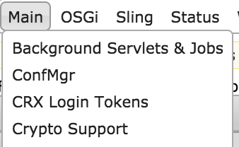

# Prise en charge du chiffrement des propriétés de configuration{#encryption-support-for-configuration-properties}

## Présentation {#overview}

Cette fonction permet à toutes les propriétés de configuration OSGi d’être stockées sous une forme chiffrée et protégée, préférable au texte en clair. Le formulaire de l&#39;interface utilisateur de la console Web est utilisé pour créer du texte chiffré à partir de texte clair à l&#39;aide de la clé principale de chiffrement à l&#39;échelle du système.

La prise en charge du module de configuration OSGi a été ajoutée afin de déchiffrer la propriété avant qu’elle ne soit utilisée par un service.

>[!NOTE]
>
>Les services exigeant une valeur chiffrée doivent utiliser la vérification IsProtected pour vérifier si la valeur est chiffrée avant de tenter de la déchiffrer, car elle a peut-être déjà été déchiffrée.

## Activation de la prise en charge du chiffrement {#enabling-encryption-support}

Ces étapes indiquent comment chiffrer le mot de passe SMTP pour le service de messagerie. Vous pouvez effectuer ces étapes pour une propriété OSGI que vous souhaitez chiffrer.

1. Accédez à la console Web AEM à l’adresse *https://&lt;serveraddress>:&lt;serverport>/system/console/configMgr*
1. Dans le coin supérieur gauche, accédez à **Prise en charge du chiffrement principal**

   

1. La page **Prise en charge du chiffrement de la console web d’Adobe Experience Manager** s’affiche.

   

1. Dans le champ **Texte brut**, saisissez le texte des données sensibles que vous souhaitez protéger.
1. Sélectionnez **Protéger**. Le texte protégé est affiché sous forme de texte chiffré.

   

1. Copiez le texte protégé de l’étape 5 et collez-le dans la valeur du formulaire OSGI. Dans cet exemple, le **mot de passe SMTP** chiffré est ajouté au *Service de messagerie Day CQ*.

   

1. Enregistrez les propriétés du Service de messagerie Day CQ. Le mot de passe SMTP est maintenant envoyé sous forme de valeur chiffrée.

## Prise en charge du déchiffrement  {#decryption-support}

AEM fournit désormais un module de configuration pour déchiffrer les propriétés de configuration. Ce module AEM déchiffre et récupère automatiquement les propriétés de texte en clair.
