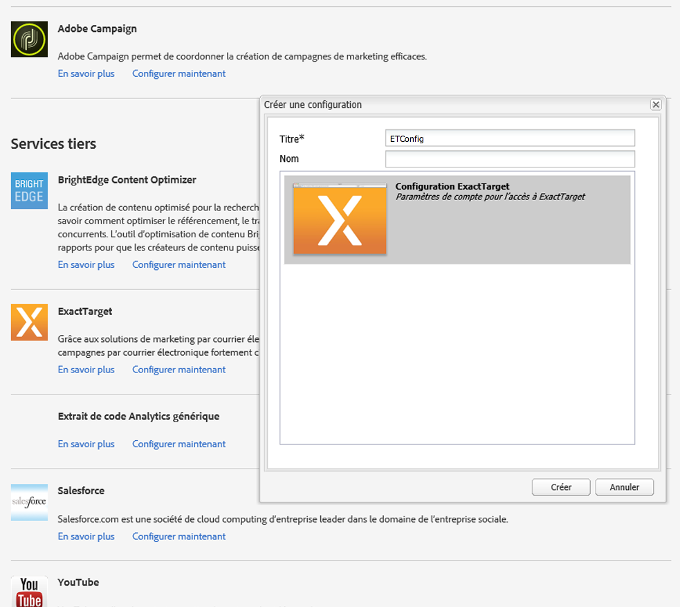
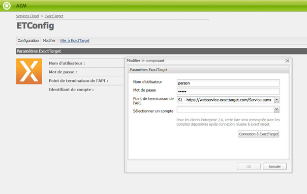
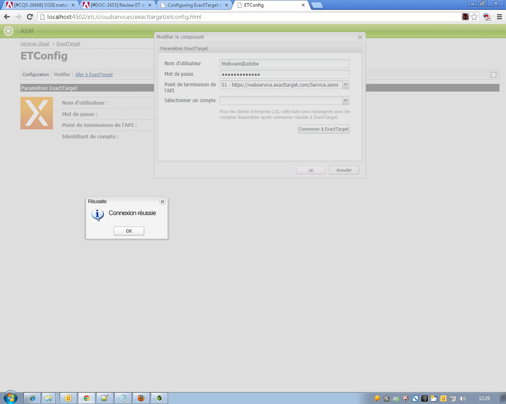
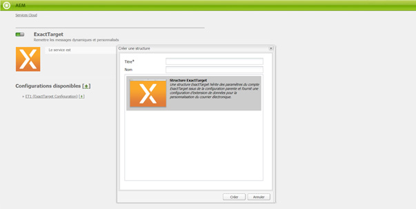
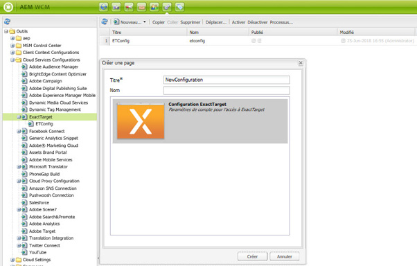

# Intégration à ExactTarget{#integrating-with-exacttarget}

L&#39;intégration de l&#39;AEM à la Cible exacte vous permet de gérer et d&#39;envoyer des e-mails créés dans AEM via la Cible exacte. Il vous permet également d’utiliser les fonctions de gestion des pistes de la Cible exacte via AEM formulaires sur les pages AEM.

L’intégration offre les fonctionnalités suivantes :

* Possibilité de créer des courriers électroniques dans AEM et de les publier dans ExactTarget pour les diffuser
* Possibilité de définir une action d’un formulaire AEM afin de créer un abonné ExactTarget

Une fois ExactTarget configuré, vous pouvez publier des newsletters ou des courriers électroniques dans ExactTarget. Voir [Publication de newsletters dans un service de messagerie](/help/sites-authoring/personalization.md).

## Création d’une configuration ExactTarget {#creating-an-exacttarget-configuration}

Il est possible d’ajouter des configurations ExactTarget par le biais d’outils ou de services cloud. Les deux méthodes sont décrites dans cette section.

### Configuration d’ExactTarget à l’aide des services cloud  {#configuring-exacttarget-via-cloudservices}

Pour créer une configuration ExactTarget dans les services cloud :

1. Sur la page d’accueil, cliquez sur **Services cloud**. (Ou un accès direct à `https://<hostname>:<port>/etc/cloudservices.html`.)
1. Cliquez sur **ExactTarget**, puis sur **Configurer**. La fenêtre de configuration d’ExactTarget s’affiche.

   

1. Ajoutez un titre et, éventuellement, un nom, puis cliquez sur **Créer**. La fenêtre de configuration **Paramètres ExactTarget** s’affiche.

   

1. Entrez le nom d’utilisateur, un mot de passe et sélectionnez un point de terminaison d’API (par exemple, **https://webservice.exacttarget.com/Service.asmx**).
1. Cliquez sur **Connexion à ExactTarget.** Une boîte de dialogue s’affiche pour confirmer que vous êtes bien connecté. Cliquez sur **OK** pour fermer la fenêtre.

   

1. Sélectionnez un compte, le cas échéant. Le compte est destiné aux clients Enterprise 2.0. Cliquez sur **OK**.

   ExactTarget a été configuré. Si vous souhaitez modifier la configuration, cliquez sur **Modifier**. Vous pouvez accéder à ExactTarget en cliquant sur **Atteindre ExactTarget**.

1. AEM propose désormais la fonctionnalité Extension de données. Celle-ci permet d’importer des colonnes d’extensions de données ExactTarget. Pour la configurer, cliquez sur le signe « + » en regard de la configuration ExactTarget créée. Vous pouvez sélectionner l’une des extensions de données existantes dans la liste déroulante. Pour plus d’informations sur la configuration des extensions de données, voir la [documentation ExactTarget](https://help.exacttarget.com/en/documentation/exacttarget/subscribers/data_extensions_and_data_relationships).

   Vous pouvez ensuite utiliser les colonnes d’extensions de données importées dans le composant **Texte et personnalisation**.

   

### Configuration d’ExactTarget à l’aide des outils {#configuring-exacttarget-via-tools}

Pour créer une configuration ExactTarget avec les outils, procédez comme suit :

1. Sur la page d’accueil, cliquez sur **Outils**. Vous pouvez également vous y rendre directement en accédant à `https://<hostname>:<port>/misadmin#/etc`.
1. Sélectionnez **, Outils**, **Configuration des services en cloud**, puis **ExactTarget**.
1. Cliquez sur **Nouveau** pour ouvrir la **fenêtre Créer une page **.

   

1. Saisissez le **titre** et éventuellement le **nom**, puis cliquez sur **Créer**.
1. Saisissez les informations de configuration conformément à l’étape 4 de la procédure précédente. Suivez cette procédure pour terminer la configuration d’ExactTarget.

### Ajout de plusieurs configurations  {#adding-multiple-configurations}

Pour ajouter plusieurs configurations, procédez comme suit :

1. Sur la page d’accueil, cliquez sur **Services cloud** puis sur **ExactTarget**. Cliquez sur le bouton **Afficher les configurations** qui s’affiche si une ou plusieurs configurations ExactTarget sont disponibles. Toutes les configurations disponibles sont répertoriées.
1. Cliquez sur le lien **+** en regard de Configurations disponibles. Cette action ouvre la fenêtre **Créer une configuration**. Pour créer une autre configuration, suivez la procédure de configuration précédente.