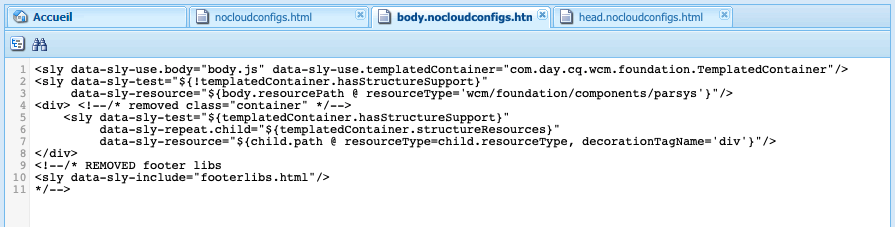
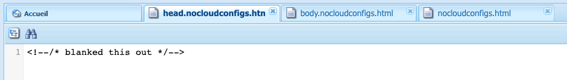

# Exportation de fragments d’expérience vers Adobe Target {#exporting-experience-fragments-to-adobe-target}

>[!CAUTION]
>
>Certaines fonctionnalités de cette page nécessitent l’application d’AEM 6.5.3.0 (ou version ultérieure).
>
>6.5.3.0 :
>
>* Les **domaines de l’externaliseur** peuvent maintenant être sélectionnés.
>  **Remarque :** les domaines de l’externaliseur sont pertinents uniquement pour le contenu du fragment d’expérience envoyé à Target, et non pour les métadonnées telles que Afficher le contenu de l’offre.
>
>6.5.2.0 :
>
>* Les fragments d’expérience peuvent être exportés vers :
>
>   * l’espace de travail par défaut ;
>   * un espace de travail donné, spécifié dans la configuration cloud.
>   * **Remarque :** l’exportation vers des espaces de travail spécifiques nécessite Adobe Target Premium.
>
>* AEM doit être [intégré à Adobe Target à l’aide d’IMS](/help/sites-administering/integration-target-ims.md).
>
>AEM 6.5.0.0 et 6.5.1.0 :
>
>* Les fragments d’expérience AEM sont exportés dans l’espace de travail par défaut d’Adobe Target.
>* AEM doit être intégré à Adobe Target conformément aux instructions de la section [Intégration à Adobe Target](/help/sites-administering/target.md).


Vous pouvez exporter les [Fragments d’expérience](/help/sites-authoring/experience-fragments.md), créés dans Adobe Experience Manager (AEM), dans Adobe Target (Target). Ceux-ci peuvent ensuite être utilisés comme offres dans les activités Target, pour tester et personnaliser les expériences en fonction des besoins.

Il existe trois options de format pour exporter un fragment d’expérience vers Adobe Target :

* HTML (par défaut) : prise en charge de la diffusion de contenu web et hybride
* JSON : prise en charge de la diffusion de contenu découplé
* HTML et JSON

Les fragments d’expérience AEM peuvent être exportés vers l’espace de travail par défaut dans Adobe Target ou vers des espaces de travail définis par l’utilisateur pour Adobe Target. Cette opération s’effectue à l’aide de la console Adobe Developer, pour laquelle AEM doit être [intégré à Adobe Target à l’aide d’IMS](/help/sites-administering/integration-target-ims.md).

>[!NOTE]
>
>Les espaces de travail Adobe Target n’existent pas dans Adobe Target lui-même. Ils sont définis et gérés dans Adobe IMS (Identity Management System), puis sélectionnés pour une utilisation dans toutes les solutions à l’aide de la console Adobe Developer.

>[!NOTE]
>
>Les espaces de travail Adobe Target peuvent être utilisés pour permettre aux membres d’une organisation (groupe) de créer et de gérer des offres et des activités pour cette organisation uniquement ; sans donner accès à d’autres utilisateurs. Par exemple, les organisations spécifiques à un pays avec une préoccupation mondiale.

>[!NOTE]
>
>Pour plus d’informations, consultez également :
>
>* [Développement d’Adobe Target](https://www.adobe.io/apis/experiencecloud/target.html)
>* [Composants principaux - Fragments d’expérience](https://experienceleague.adobe.com/docs/experience-manager-core-components/using/components/experience-fragment.html?lang=fr)
>


## Prérequis {#prerequisites}

>[!CAUTION]
>
>Certaines fonctionnalités de cette page nécessitent l’application d’AEM 6.5.3.0.

Plusieurs actions sont requises :

1. Vous devez [intégrer AEM à Adobe Target à l’aide d’IMS](/help/sites-administering/integration-target-ims.md).
2. Les fragments d’expérience sont exportés à partir de l’instance d’auteur AEM. Vous devez donc [Configurer l’externaliseur de liens d’AEM](/help/sites-administering/target-requirements.md#configuring-the-aem-link-externalizer) sur l’instance d’auteur pour vous assurer que toutes les références contenues dans le fragment d’expérience sont externalisées pour la diffusion web.

   >[!NOTE]
   >
   >Pour la réécriture de liens, non couverte par le format par défaut, il existe un [fournisseur de réécriture de liens des fragments d’expérience](/help/sites-developing/experience-fragments.md#the-experience-fragment-link-rewriter-provider-html). Cela vous permet de développer des règles personnalisées pour votre instance.

## Ajoutez la configuration du cloud {#add-the-cloud-configuration}

Avant d’exporter un fragment, vous devez ajouter la **configuration cloud** pour **Adobe Target** au fragment ou au dossier. Vous pouvez ainsi :

* spécifier la ou les options de format à utiliser pour l’export ;
* sélectionner un espace de travail Target comme destination ;
* sélectionner un domaine d’externaliseur pour réécrire des références dans le fragment d’expérience (facultatif).

Vous pouvez sélectionner les options obligatoires dans les **propriétés de page** du dossier ou du fragment concerné. La spécification sera héritée, le cas échéant.

1. Accédez à la console **Fragments d’expérience**.

1. Ouvrez les **propriétés de page** pour le dossier ou le fragment approprié.

   >[!NOTE]
   >
   >Lorsque vous ajoutez la configuration cloud au dossier parent du fragment d’expérience, celle-ci est héritée par tous les enfants.
   >
   >
   >Lorsque vous ajoutez la configuration cloud directement au fragment d’expérience, la configuration est héritée par toutes les variations.

1. Sélectionnez l’onglet **Services cloud**.

1. Sous **Configuration du service cloud**, sélectionnez **Adobe Target** dans la liste déroulante.

   >[!NOTE]
   >
   >Le format JSON d’une offre de fragment d’expérience peut être personnalisé. Pour ce faire, définissez un composant de fragment d’expérience client, puis annotez comment exporter ses propriétés dans le modèle Sling du composant.
   >
   >Voir le composant principal :
   >
   >[Composants principaux - Fragments d’expérience](https://experienceleague.adobe.com/docs/experience-manager-core-components/using/components/experience-fragment.html?lang=fr)

   Sous **Adobe Target** sélectionnez :

   * la configuration appropriée ;
   * l’option de format requise ;
   * un espace de travail Adobe Target ;
   * si nécessaire : le domaine de l’externaliseur.

   >[!CAUTION]
   >
   >Le domaine de l’externaliseur est facultatif.
   >
   >Un externaliseur d’AEM est configuré lorsque vous souhaitez que le contenu exporté pointe vers un domaine de *publication* spécifique. Pour plus d’informations, consultez [Configuration de l’externaliseur de liens d’AEM](/help/sites-administering/target-requirements.md#configuring-the-aem-link-externalizer).
   >
   >Notez également que les domaines de l’externaliseur sont pertinents uniquement pour le contenu du fragment d’expérience envoyé à Target, et non pour les métadonnées telles que Afficher le contenu de l’offre.

   Par exemple, pour un dossier :

   

1. **Enregistrer et fermer**.

## Exportation d’un fragment d’expérience vers Adobe Target {#exporting-an-experience-fragment-to-adobe-target}

>[!CAUTION]
>
>Pour les contenus multimédias, comme les images, une seule référence est exportée vers Target. La ressource elle-même reste stockée dans AEM Assets et elle est diffusée depuis l’instance de publication AEM.
>
>Le fragment d’expérience, ainsi que l’ensemble des ressources connexes, doivent être publiés avant l’exportation vers Target.

Pour exporter un fragment d’expérience d’AEM vers Target (une fois la configuration cloud spécifiée) :

1. Accédez à la console Fragment d’expérience.
1. Sélectionnez le fragment d’expérience que vous souhaitez exporter vers Target.

   >[!NOTE]
   >
   >Il doit s’agir d’une variation web de fragment d’expérience.

1. Appuyez/cliquez sur **Exporter vers Adobe Target**.

   >[!NOTE]
   >
   >Si le fragment d’expérience a déjà été exporté, sélectionnez **Mettre à jour dans Adobe Target**.

1. Appuyez/cliquez sur **Exporter sans publier** ou sur **Publier**, en fonction de vos besoins.

   >[!NOTE]
   >
   >L’option **Publier** permet la publication immédiate du fragment d’expérience et l’envoie vers Target.

1. Appuyez/cliquez sur **OK** dans la boîte de dialogue de confirmation.

   Votre fragment d’expérience se trouve désormais dans Target.

   >[!NOTE]
   >
   >[Divers détails](/help/sites-authoring/experience-fragments.md#details-of-your-experience-fragment) sur l’exportation sont visibles dans le **mode Liste** de la console et dans **les Propriétés**.

   >[!NOTE]
   >
   >Lors de l’affichage d’un fragment d’expérience dans Adobe Target, la date de la *dernière modification* qui apparaît correspond à la dernière modification du fragment dans AEM. Il ne s’agit pas de la date de la dernière exportation du fragment vers Adobe Target.

>[!NOTE]
>
>Vous pouvez également procéder à l’exportation via l’éditeur de page, à l’aide des commandes comparables du menu [Informations sur la page](/help/sites-authoring/author-environment-tools.md#page-information).

## Utilisation de vos fragments d’expérience dans Adobe Target {#using-your-experience-fragments-in-adobe-target}

Après avoir effectué les tâches précédentes, le fragment d’expérience s’affiche sur la page Offres de Target. Consultez la [documentation spécifique de Target](https://experiencecloud.adobe.com/resources/help/fr_FR/target/target/aem-experience-fragments.html) pour en savoir plus sur ce qui est réalisable.

>[!NOTE]
>
>Lors de l’affichage d’un fragment d’expérience dans Adobe Target, la date de la *dernière modification* qui apparaît correspond à la dernière modification du fragment dans AEM. Il ne s’agit pas de la date de la dernière exportation du fragment vers Adobe Target.

## Suppression d’un fragment d’expérience déjà exporté vers Adobe Target {#deleting-an-experience-fragment-already-exported-to-adobe-target}

La suppression d’un fragment d’expérience qui a déjà été exporté vers Target peut entraîner des problèmes si le fragment est déjà utilisé pour une offre dans Target. L’offre ne serait alors plus utilisable, car c’est AEM qui fournit le contenu du fragment.

Pour éviter de tels problèmes :

* Si le fragment d’expérience n’est pas en cours d’utilisation par une activité, l’utilisateur peut le supprimer sans recevoir de message d’avertissement.
* Si le fragment d’expérience est en cours d’utilisation par une activité dans Target, un message d’erreur informe l’utilisateur d’AEM des risques que la suppression dudit fragment peut engendrer.

   Le message d’erreur apparu dans AEM n’empêche pas à l’utilisateur de forcer la suppression du fragment d’expérience. Lorsque le fragment d’expérience est supprimé :

   * l’offre Target qui utilise le fragment d’expérience AEM peut souffrir d’un comportement indésirable ;

      * l’offre effectue toujours le rendu, car le code HTML du fragment d’expérience a été transmis à Target ;
      * les références du fragment d’expérience peuvent ne pas fonctionner correctement si les ressources référencées ont également été supprimées dans AEM.
   * Bien sûr, toute modification supplémentaire apportée au fragment d’expérience est impossible, car le fragment d’expérience n’existe plus dans AEM.


## Suppression de bibliothèques clientes des fragments d’expérience exportés vers Target {#removing-clientlibs-from-fragments-exported-target}

Les fragments d’expérience contiennent des balises HTML complètes et toutes les bibliothèques clientes (CSS/JS) nécessaires pour effectuer le rendu du fragment tel qu’il a été créé par l’auteur ou l’autrice du contenu du fragment d’expérience. Cela est intentionnel.

Lors de l’utilisation d’une offre de fragment d’expérience avec Adobe Target sur une page diffusée par AEM, la page ciblée contient déjà toutes les bibliothèques clientes nécessaires. En outre, le code HTML superflu dans l’offre de fragment d’expérience n’est pas nécessaire non plus (voir les [Considérations](#considerations)).

Voici un pseudo-exemple du code HTML d’une offre de fragment d’expérience :

```html
<!DOCTYPE>
<html>
   <head>
      <title>…</title>
      <!-- all of the client libraries (css/js) -->
      …
   </head>
   <body>
        <!--/* Actual XF Offer content would appear here... */-->
   </body>
</html>
```

À un niveau élevé, lorsqu’AEM exporte un fragment d’expérience vers Adobe Target, il le fait à l’aide de plusieurs sélecteurs Sling supplémentaires. Par exemple, l’URL du fragment d’expérience exporté peut se présenter comme suit (remarque `nocloudconfigs.atoffer`) :

* http://www.your-aem-instance.com/content/experience-fragments/my-offers/my-xf-offer.nocloudconfigs.atoffer.html

Le sélecteur `nocloudconfigs` est défini à l’aide de HTL et peut être recouvert en le copiant à partir de :

* /libs/cq/experience-fragments/components/xfpage/nocloudconfigs.html

Le sélecteur `atoffer` est en réalité appliqué après traitement à l’aide de la [réécriture Sling](/help/sites-developing/experience-fragments.md#the-experience-fragment-link-rewriter-provider-html). Vous pouvez utiliser les deux pour supprimer les bibliothèques clientes.

### Exemple {#example}

Dans notre cas, nous allons vous montrer comment faire avec `nocloudconfigs`.

>[!NOTE]
>
>Consultez [Modèles modifiables](/help/sites-developing/templates.md#editable-templates) pour en savoir plus.

#### Recouvrements {#overlays}

Dans cet exemple particulier, les [recouvrements](/help/sites-developing/overlays.md) inclus suppriment les bibliothèques clientes *et* le code html superflu. Nous partons du principe que vous avez déjà créé le type de modèle de fragment d’expérience. Les fichiers nécessaires qui devront être copiés à partir de `/libs/cq/experience-fragments/components/xfpage/` incluent :

* `nocloudconfigs.html`
* `head.nocloudconfigs.html`
* `body.nocloudconfigs.html`

#### Recouvrements de type modèle {#template-type-overlays}

Dans le cadre de cet exemple, nous utiliserons la structure suivante :


Le contenu de ces fichiers est le suivant :

* `body.nocloudconfigs.html`

   

* `head.nocloudconfigs.html`

   

* `nocloudconfigs.html`

   

>[!NOTE]
>
>Pour utiliser `data-sly-unwrap` afin de supprimer la balise body, vous avez besoin de `nocloudconfigs.html`.

### Considérations {#considerations}

Si vous devez prendre en charge les sites AEM et non AEM à l’aide d’offres de fragments d’expérience dans Adobe Target, vous devez créer deux fragments d’expérience (deux types de modèles différents) :

* Un avec le recouvrement pour supprimer les bibliothèques clientes ou le code html en trop

* Un qui ne dispose pas du recouvrement et qui inclut donc les bibliothèques clientes requises