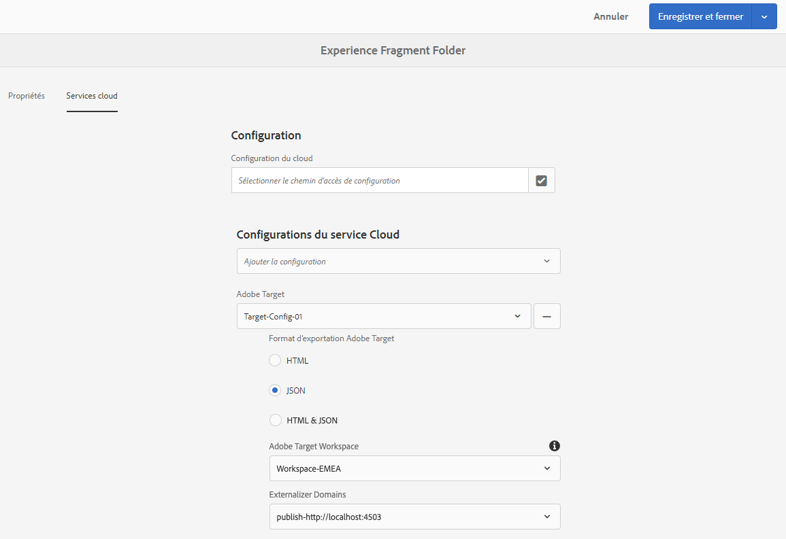

# Exportation de fragments d’expérience vers Adobe Target{#exporting-experience-fragments-to-adobe-target}

>[!CAUTION]
>
>Certaines fonctionnalités de cette page nécessitent l&#39;application de AEM 6.5.3.0.
>
>6.5.3.0
>
>* **Les domaines** Externalizer peuvent désormais être sélectionnés.
>
>
6.5.2.0:
>
>* Les fragments d’expérience peuvent être exportés vers :
   >
   >   
   * l’espace de travail par défaut.
   >   * un espace de travail nommé, spécifié dans la configuration Cloud.
   >   * **Remarque :** L’exportation vers des espaces de travail spécifiques nécessite Adobe Target Premium.
>
>* aem doit être [intégré à Adobe Target en utilisant les E/S](/help/sites-administering/integration-ims-adobe-io.md)d&#39;Adobe.

>
>

aem 6.5.0.0 et 6.5.1.0 :
>
>* Les fragments d’expérience AEM sont exportés dans l’espace de travail par défaut de Adobe Target.
>* aem doit être intégré à Adobe Target selon les instructions de la section [Intégration à Adobe Target](/help/sites-administering/target.md).

You can export [Experience Fragments](/help/sites-authoring/experience-fragments.md), created in Adobe Experience Manager (AEM), to Adobe Target (Target). Ceux-ci peuvent ensuite être utilisés comme offres dans les activités Target, pour tester et personnaliser les expériences en fonction des besoins.

Il existe trois options de format pour exporter un fragment d’expérience vers Adobe Target :

* HTML (par défaut) : Prise en charge de la diffusion de contenu Web et hybride
* JSON : Prise en charge de la diffusion de contenu sans en-tête
* HTML et JSON

Les fragments d’expérience AEM peuvent être exportés vers l’espace de travail par défaut de Adobe Target ou vers des espaces de travail définis par l’utilisateur pour Adobe Target. Cela se fait par E/S d&#39;Adobe, pour lequel AEM doit être [intégré à Adobe Target à l&#39;aide d&#39;E/S](/help/sites-administering/integration-ims-adobe-io.md)d&#39;Adobe.

>[!NOTE]
>
>Les espaces de travail Adobe Target n&#39;existent pas dans Adobe Target lui-même. Ils sont définis et gérés dans l&#39;Adobe IMS (Identity Management System), puis sélectionnés pour une utilisation dans toutes les solutions à l&#39;aide d&#39;intégrations d&#39;E/S d&#39;Adobe.

>[!NOTE]
>
>Les espaces de travail Adobe Target peuvent être utilisés pour permettre aux membres d&#39;une organisation (groupe) de créer et de gérer des offres et des activités pour cette organisation uniquement ; sans donner accès à d&#39;autres utilisateurs. Par exemple, les organisations spécifiques à un pays dans un contexte mondial.

>[!NOTE]
>
>Pour plus d&#39;informations, voir aussi :
>
>* [Développement Adobe Target](https://www.adobe.io/apis/experiencecloud/target.html)
>* [Composants principaux - Fragments d’expérience](https://docs.adobe.com/content/help/en/experience-manager-core-components/using/components/experience-fragment.html)

>

## Conditions préalables {#prerequisites}

>[!CAUTION]
>
>Certaines fonctionnalités de cette page nécessitent l&#39;application de AEM 6.5.3.0.

Plusieurs actions sont requises :

1. Vous devez [intégrer AEM à Adobe Target à l&#39;aide des E/S](/help/sites-administering/integration-ims-adobe-io.md)d&#39;Adobe.
2. Les fragments d’expérience sont exportés à partir de l’instance d’auteur AEM. Vous devez donc [configurer AEM Link Externalizer](/help/sites-administering/target-requirements.md#configuring-the-aem-link-externalizer) sur l’instance d’auteur pour vous assurer que les références contenues dans le fragment d’expérience sont externalisées pour la diffusion Web.

   >[!NOTE]
   >
   >Pour la réécriture de liens, non couverte par le format par défaut, il existe un [fournisseur de réécriture de liens des fragments d’expérience](/help/sites-developing/experience-fragments.md#the-experience-fragment-link-rewriter-provider-html). Cela vous permet de développer des règles personnalisées pour votre instance.

## ajouter la configuration de Cloud {#add-the-cloud-configuration}

Avant d’exporter un fragment, vous devez ajouter la **configuration cloud** pour **Adobe Target** au fragment ou au dossier. Cela vous permet également de :

* spécifier les options de format à utiliser pour l&#39;exportation
* sélectionner un espace de travail de Cible comme destination
* sélectionnez un domaine externaliseur pour réécrire des références dans le fragment d’expérience (facultatif).

Vous pouvez sélectionner les options obligatoires dans les **propriétés de page** du dossier ou du fragment concerné. La spécification sera héritée, le cas échéant.

1. Accédez à la console **Fragments d’expérience**.

1. Ouvrez les **propriétés de page** pour le dossier ou le fragment approprié.

   >[!NOTE]
   >
   >Lorsque vous ajoutez la configuration cloud au dossier parent du fragment d’expérience, celle-ci est héritée par tous les enfants.
   >
   >
   >Lorsque vous ajoutez la configuration cloud directement au fragment d’expérience, la configuration est héritée par toutes les variations.

1. Sélectionnez l’onglet **Services cloud**.

1. Under **Cloud Service Configuration**, select **Adobe Target** from the drop-down list.

   >[!NOTE]
   >
   >Le format JSON d’une offre de fragment d’expérience peut être personnalisé. Pour ce faire, définissez un composant Fragment d’expérience client, puis annotez comment exporter ses propriétés dans le modèle Sling du composant.
   >
   >Voir le composant principal :
   >
   >[Composants principaux - Fragments d’expérience](https://docs.adobe.com/content/help/en/experience-manager-core-components/using/components/experience-fragment.html)

   Sous **Adobe Target** , sélectionnez :

   * la configuration appropriée
   * l’option de format requise
   * un espace de travail Adobe Target
   * si nécessaire - domaine de l&#39;externaliseur

   >[!CAUTION]
   >
   >Le domaine externaliseur est facultatif. Un AEM externaliseur est configuré lorsque vous souhaitez que le contenu exporté pointe vers un domaine de *publication* spécifique. Pour plus d’informations, voir [Configuration de l’Externalisateur](/help/sites-administering/target-requirements.md#configuring-the-aem-link-externalizer)de lien AEM.

   Par exemple, pour un dossier :

   

1. **Enregistrez et fermez**.

## Exporting an Experience Fragment to Adobe Target {#exporting-an-experience-fragment-to-adobe-target}

>[!CAUTION]
>
>Pour les contenus multimédias, comme les images, une seule référence est exportée vers Target. La ressource elle-même reste stockée dans AEM Assets et elle est diffusée depuis l’instance de publication AEM.
>
>Le fragment d’expérience, ainsi que l’ensemble des ressources connexes, doivent être publiés avant l’exportation vers Target.

Pour exporter un fragment d’expérience d’AEM vers Target (une fois la configuration cloud spécifiée) :

1. Accédez à la console Fragment d’expérience.
1. Sélectionnez le fragment d’expérience que vous souhaitez exporter vers Target.

   >[!NOTE]
   >
   >Il doit s’agir d’une variation web de fragment d’expérience.

1. Appuyez/cliquez sur **Exporter vers Adobe Target**.

   >[!NOTE]
   >
   >Si le fragment d’expérience a déjà été exporté, sélectionnez **Mettre à jour dans Adobe Target**.

1. Appuyez/cliquez sur **Exporter sans publier** ou sur **Publier**, en fonction de vos besoins.

   >[!NOTE]
   >
   >L’option **Publier** permet la publication immédiate du fragment d’expérience et l’envoie vers Target.

1. Tap/click **OK** in the confirmation dialog.

   Votre fragment d’expérience se trouve désormais dans Target.

   >[!NOTE]
   >
   >[Divers détails](/help/sites-authoring/experience-fragments.md#details-of-your-experience-fragment) sur l’exportation sont visibles dans le **mode Liste** de la console et dans **les Propriétés**.

   >[!NOTE]
   >
   >Lors de l’affichage d’un fragment d’expérience dans Adobe Target, la date de la *dernière modification* qui apparaît correspond à la dernière modification du fragment dans AEM. Il ne s’agit pas de la date de la dernière exportation du fragment vers Adobe Target.

>[!NOTE]
>
>Vous pouvez également procéder à l’exportation via l’éditeur de page, à l’aide des commandes comparables du menu [Informations sur la page](/help/sites-authoring/author-environment-tools.md#page-information).

## Using your Experience Fragments in Adobe Target {#using-your-experience-fragments-in-adobe-target}

Après avoir exécuté les tâches précédentes, le fragment d’expérience s’affiche sur la page Offres de la Cible. Consultez la [documentation spécifique de Target](https://experiencecloud.adobe.com/resources/help/en_US/target/target/aem-experience-fragments.html) pour en savoir plus sur ce qui est réalisable.

>[!NOTE]
>
>Lors de l’affichage d’un fragment d’expérience dans Adobe Target, la date de la *dernière modification* qui apparaît correspond à la dernière modification du fragment dans AEM. Il ne s’agit pas de la date de la dernière exportation du fragment vers Adobe Target.

## Deleting an Experience Fragment already exported to Adobe Target {#deleting-an-experience-fragment-already-exported-to-adobe-target}

La suppression d’un fragment d’expérience qui a déjà été exporté vers Target peut entraîner des problèmes si le fragment est déjà utilisé pour une offre dans Target. L’offre ne serait alors plus utilisable, car c’est AEM qui fournit le contenu du fragment.

Pour éviter de tels problèmes :

* Si le fragment d’expérience n’est pas en cours d’utilisation par une activité, l’utilisateur peut le supprimer sans recevoir de message d’avertissement.
* Si le fragment d’expérience est en cours d’utilisation par une activité dans Target, un message d’erreur informe l’utilisateur d’AEM des risques que la suppression dudit fragment peut engendrer.

   Le message d’erreur apparu dans AEM n’empêche pas à l’utilisateur de forcer la suppression du fragment d’expérience. Si le fragment d’expérience est supprimé :

   * L’offre de Cible avec le fragment d’expérience AEM peut présenter un comportement indésirable.

      * L’offre sera probablement toujours affichée, car le code HTML du fragment d’expérience a été envoyé à la Cible.
      * Toute référence dans le fragment d’expérience peut ne pas fonctionner correctement si des ressources référencées ont également été supprimées dans AEM.
   * Bien sûr, toute modification supplémentaire du fragment d’expérience est impossible, car le fragment d’expérience n’existe plus en AEM.