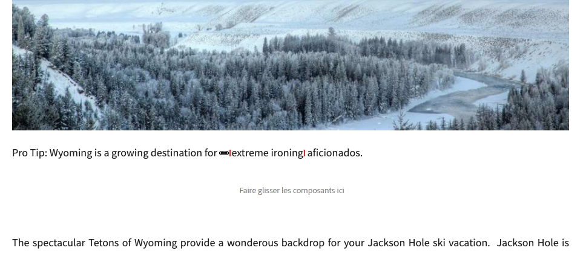
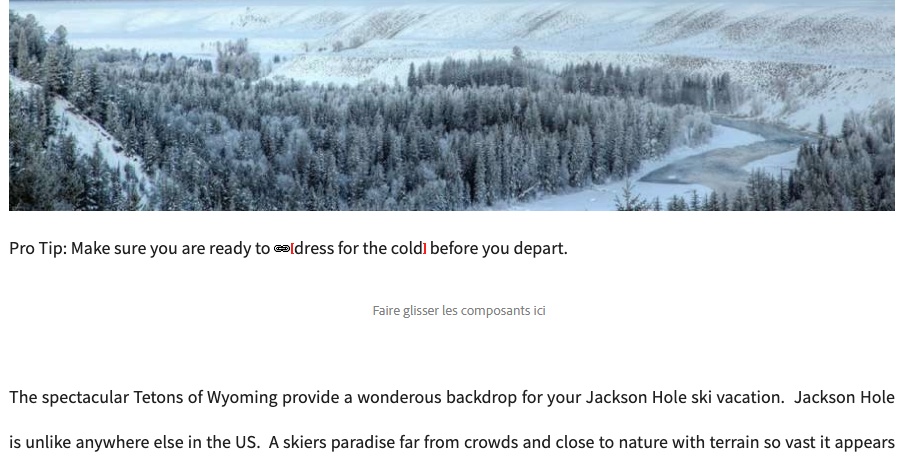
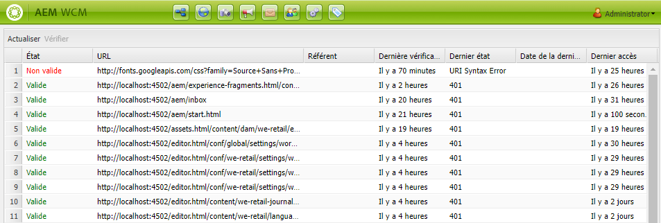

# Vérificateur de lien {#the-link-checker}

Les auteurs de contenu ne doivent pas se soucier de valider chaque lien qu’ils incluent dans leurs pages de contenu.

Le vérificateur de liens s’exécute automatiquement pour aider les auteurs de contenu à créer leurs liens, notamment :

* Validation des liens lorsqu’ils sont ajoutés au contenu
* Affichage de la liste de tous les liens externes du contenu
* Exécution de transformations de liens

Le vérificateur de liens possède un certain nombre d&#39;options de configuration , telles que la définition de la validation interne, ce qui permet d&#39;ignorer certains liens ou certains modèles de liens et de réécrire les règles de réécriture de liens.

Le vérificateur de liens valide les liens [internes](#internal) et [externes.](#external)

>[!NOTE]
>
>Le vérificateur de liens vérifiant les liens de chaque page de contenu, il peut avoir un impact sur les performances des référentiels volumineux. Dans de tels cas, vous devrez peut-être [configurer la fréquence d&#39;exécution du vérificateur de liens](#configuring) ou [le désactiver.](#disabling)

## Vérification des liens internes {#internal}

Les liens internes sont des liens vers d’autres contenus de votre référentiel AEM. Les liens internes peuvent être ajoutés à l’aide du sélecteur de chemins d’accès RTE ou à l’aide d’un composant personnalisé. Par exemple :

* Votre page `/content/wknd/us/en/adventures/ski-touring.html`
* Contenir un lien vers `/content/wknd/us/en/adventures/extreme-ironing.html` dans un composant de texte [.](https://experienceleague.adobe.com/docs/experience-manager-core-components/using/components/text.html)

Les liens internes sont validés dès que l’auteur du contenu ajoute des liens internes à une page. Si le lien devient non valide :

* Il est supprimé de l’éditeur. Le texte du lien reste, mais le lien lui-même est supprimé.
* Il s’affiche sous la forme d’un lien rompu dans l’interface de création.

## Vérification des liens externes {#external}

Les liens externes sont des liens vers du contenu en dehors de votre référentiel AEM. Les liens externes peuvent être ajoutés à l’aide de l’ETC ou d’un composant personnalisé. Par exemple :

* Votre page `/content/wknd/us/en/adventures/ski-touring.html`
* Contenir un lien vers `https://bunwarmerthermalunderwear.com` dans un composant de texte [.](https://experienceleague.adobe.com/docs/experience-manager-core-components/using/components/text.html)

Les liens externes sont validés pour la syntaxe et en vérifiant leur disponibilité. Cette vérification est effectuée de manière asynchrone sur un système interne configurable. Si le vérificateur de liens détecte un lien externe non valide :

* Il est supprimé de l’éditeur. Le texte du lien reste, mais le lien lui-même est supprimé.
* Il s’affiche sous la forme d’un lien rompu dans l’interface de création.

En outre, l&#39;interface [Vérificateur de lien externe](#external-link-checker) fournit un aperçu de tous les liens externes de vos pages de contenu.

### Utilisation du vérificateur de lien externe {#external-link-checker}

Pour utiliser le vérificateur de liens externes :

1. Avec la **navigation**, sélectionnez **Outils**, puis **Sites**.
1. Sélectionnez **Vérificateur de lien externe** et une liste de tous les liens externes s’affiche.

Les informations suivantes s’affichent :

* **État**  : état de validation du lien
   * **Valide**  : le lien externe est accessible par le vérificateur de liens.
   * **En attente**  : le lien externe a été ajouté au contenu du site, mais n&#39;a pas encore été validé par le vérificateur de liens.
   * **Non valide**  : le lien externe n&#39;est pas accessible par le vérificateur de liens.
* **URL**  : lien externe
* **Parrain**  : page de contenu contenant le lien externe
   * Cette variable n&#39;est renseignée que [si elle est configurée.](#configuring)
* **Dernière vérification**  : dernière fois que le vérificateur de liens a validé le lien externe
   * La fréquence de vérification des liens [est configurable.](#configuring)
* **Dernier état**  - Le dernier code d&#39;état HTML renvoyé lorsque le lien a été vérifié pour la dernière fois a été coché sur le lien externe
* **Dernier disponible**  : heure depuis la dernière disponibilité du lien pour le vérificateur de liens
* **Dernier accès**  : heure depuis le dernier accès au lien par le vérificateur de liens

Vous pouvez manipuler le contenu de la fenêtre en utilisant les deux boutons situés en haut de la liste des liens :

* **Actualiser**  - Pour actualiser le contenu de la liste
* **Vérifier**  - Pour vérifier un lien externe sélectionné dans la liste

### Fonctionnement du vérificateur de liens externes {#how-it-works}

Bien qu&#39;il soit facile à utiliser, le vérificateur de liens externe s&#39;appuie sur plusieurs services et comprend leur fonctionnement pour vous aider à comprendre comment [configurer le vérificateur de liens](#configuring) pour répondre à vos besoins.

1. Chaque fois qu’un auteur de contenu enregistre un lien vers une page, un gestionnaire de événement est déclenché.
1. Le gestionnaire de événements examine tout le contenu sous `/content` et recherche les liens nouveaux ou mis à jour et les ajoute à un cache pour le vérificateur de liens.
1. Le **service de vérification des liens Day CQ** s’exécute ensuite selon un calendrier régulier afin de vérifier que les entrées du cache contiennent une syntaxe valide.
1. Les liens validés par la syntaxe apparaissent ensuite dans la fenêtre [Vérificateur de lien externe](#external-link-checker). Cependant, ils seront dans un état **En attente**.
1. La **Tâche de vérification des liens CQ de jour** s’exécute ensuite régulièrement pour valider les liens en effectuant un appel de GET.
1. La **Tâche Jour du vérificateur de liens CQ** met ensuite à jour les entrées de la fenêtre du vérificateur de liens externes avec les résultats des appels de GET.

## Configuration du vérificateur de liens {#configuring}

Le vérificateur de liens est automatiquement disponible dans AEM. Cependant, plusieurs configurations OSGi peuvent être modifiées pour modifier son comportement :

* **Service**  d&#39;Enregistrement d&#39;informations du vérificateur de liens Day CQ - Ce service définit la taille du cache du vérificateur de liens dans le référentiel.
* **Service**  Day CQ Link Checker - Ce service effectue une vérification asynchrone de la syntaxe des liens externes. Vous pouvez définir la période de vérification et les types de liens que le vérificateur ignore, entre autres options.
* **Tâche**  Day CQ Link Checker - Ce service effectue la validation GET des liens externes. Il permet de définir des intervalles distincts pour vérifier les liens mauvais et bon entre d&#39;autres options.
* **Transformateur**  du vérificateur de liens Day CQ - Permet de convertir des liens en fonction d’un jeu de règles défini par l’utilisateur.

Voir le document [Paramètres de configuration OSGi](/help/sites-deploying/osgi-configuration-settings.md) pour en savoir plus sur la modification des paramètres OSGi.

## Désactivation du vérificateur de liens {#disabling}

Vous pouvez choisir de désactiver entièrement le vérificateur de liens. Pour ce faire :

1. Ouvrez la console OSGi.
1. Modifier le convertisseur de liens CQ de jour ****
1. Cochez la ou les options que vous souhaitez désactiver :
   * **Désactiver la vérification**  - pour désactiver la validation des liens
   * **Désactiver la réécriture**  - pour désactiver les conversions de liens

>[!NOTE]
>
>Si vous désactivez la vérification des liens après avoir commencé à créer votre contenu, il se peut que des entrées s&#39;affichent dans la fenêtre [Vérificateur de liens externes](#external-link-checker), mais elles ne seront plus mises à jour.
